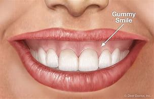

= step 2 - Lesson 03
:toc:

---

Lesson 3 +

== 01

Clerk: Hello, sir. What can I do for you? +
Customer: Hi. Uh ... I have this ... uh ... cassette player 播放机 (Mm-hmm.) here that I bought about six months ago. And it just ruined four of my favourite cassettes. +
Clerk: Oh dear, I'm sorry. +
Customer: So I ... um ... wanted you to fix it. I'm sure it will be no problem, right? +
Clerk: Your *sales slip* (纸条；便条) 收据, please? +
Customer: Yeah, here it is. Uh. +
Clerk: I'm sorry, sir. Your warranty's （商品的）保修单，保用卡 expired. +
Customer: Well, it ... uh ... ran out ten days ago, but I'm sure that you'll ... you'll ... fix the machine for free, because the machine was obviously defective 有缺点的；有缺陷的；有毛病的 when I bought it. I ... +
Clerk: I'm sorry, sir. Your warranty has run out 耗尽，用完. There's nothing I can do. +
Customer: No. No, look. No. I didn't drop it off a building or anything. I mean, what difference can ten days make? I mean you ... you can— +
Clerk: Sir, I'm sorry, we have the six-month rule for a reason. We can't ... +
Customer: Well, but you can bend the rule a little bit. +
Clerk: ... make an exception 规则的例外；例外的事物 for you. Then we'll have to make an exception for everybody. (Well, but look ...) You could say it's only a month, it's only two months. +
Customer: I just lost twenty dollars worth of tapes. +
Clerk: Sir, I'm sorry, it's too late. +
Customer: It actually ate the tapes. I mean, they're destroyed. I mean— +
Clerk: Well, sir, you knew (I ...) when your warranty ran out. You should (Well ...) have brought it in before. It was (Well ... look ...) guaranteed 保证；担保；保障 for six months. I'm sorry, there's nothing I can do. +
Customer: Paying for this is *adding insult 辱骂；侮辱；冒犯 to injury* 雪上加霜；伤害之外又加侮辱. I mean, surely you're going to *make good on* 兑现承诺 this cassette player. It's ... it's ... it's a good cassette player, but it's just defective. I mean, I can't pay for this. +
Clerk: Well, sir, I'm sorry, you should have brought it in earlier. +
Customer: But surely you won't hold me to ten days on this. +
Clerk: Sir, the rules are the rules. I'm sorry, but there's nothing I can do.

Norma: You know, Brian, it doesn't look like you've vacuumed (v.)用真空吸尘器清扫 the living room 客厅；起居室 or cleaned the bathroom. +
Brian: No, I haven't. Ugh. I had the worst day. I am so tired. Look, I promise I'll do it this weekend. +
Norma: Listen, I know the feeling. I'm tired, too. But I came home and I did my share （在多人参加的活动中所占的）一份 of the housework. I mean, that's the agreement, right? +
Brian: All right. We agreed. I'll do it *in a minute* 马上. +
Norma: Come on. Don't be that way. You know, (What?) I shouldn't have to ask you to do anything. I mean, we both work, we both live in the house, we agreed that housework is ... is both of our responsibility. I don't like to have to keep reminding you about it. It makes me feel like an old nag 马;唠叨；不停地抱怨 or something. +
Brian: Sometimes you are an old nag. +
Norma: Oh, great! +
Brian: No, it's just that I don't notice when things get dirty like you do. Look, all you have to do is tell me, and I'll do it. +
Norma: No, I don't want to be put in that position. I mean, you can see dirt as well as I can. Otherwise — I mean, that puts all the responsibility on me. +
Brian: It's just that cleanliness is not a high priority 优先事项；最重要的事；首要事情 with me. There are other things I would much rather do. Besides, the living room floor does not look that dirty. +
Norma: Brian. +
Brian: Okay, a couple crumbs 食物碎屑；（尤指）面包屑，糕饼屑.

柜台服务员:您好，先生。我能为您做些什么? +
顾客:你好。嗯，我有这个卡式录音机(嗯嗯)，这是我六个月前买的。它毁了我最喜欢的四盘磁带。 +
职员:哦，天哪，对不起。 +
顾客:所以我想让你修一下。我肯定不会有问题的，对吗? +
店员:请给我您的售货单。 +
顾客:好的，给你。呃。 +
店员:对不起，先生。您的保修期已过了。 +
顾客:嗯，它10天前就用完了，但我相信你们会免费修理机器的，因为我买的时候机器显然是有缺陷的。我… +
店员:对不起，先生。您的保修期已过了。我什么也做不了。 +
顾客:没有。不,看。不。我没把它丢在楼里什么的。我是说，十天能有什么区别?我是说你…你可以 +
职员:先生，很抱歉，我们有六个月的规定是有原因的。我们不能…… +
顾客:嗯，但是你可以稍微变通一下。 +
职员:我为您破例一次。那我们就得为所有人破一次例了。(嗯，但是你看……)你可以说只有一个月，只有两个月。 +
顾客:我刚丢了价值20美元的磁带。 +
职员:先生，对不起，太晚了。 +
顾客:实际上它把磁带吃了。我是说，他们被毁了。我的意思是, +
职员:嗯，先生，您知道(我……)您的保修期过了。你应该(嗯……)早把它送来。这是(嗯……看……)六个月的保修期。对不起，我无能为力。 +
顾客:付这笔钱真是雪上加霜。我的意思是，你肯定会在这台卡式录音机上赚大钱的。这是个不错的卡带播放器，只是有缺陷。我是说，我付不起这个钱。 +
职员:哦，先生，对不起，您应该早点送来的。 +
顾客:但你肯定不会因为这件事耽误我10天吧。 +
职员:先生，规定就是规定。我很抱歉，但我无能为力。 +

诺尔玛:你知道吗，布莱恩，看起来你并没有用吸尘器打扫过客厅或浴室。 +
布莱恩:不，我没有。啊。我度过了最糟糕的一天。我太累了。听着，我保证这周末会去。 +
诺玛:听着，我知道那种感觉。我也累了。但我回到家，做了我该做的家务。我是说，这是协议，对吧? +
布莱恩:好吧。我们同意了。我马上就做。 +
诺玛:来吧。不要那样。你知道，(什么?)我不应该要求你做任何事。我是说，我们都工作，我们都住在一起，我们都同意家务是我们俩的责任。我不喜欢一直提醒你这件事。这让我觉得自己像个老马什么的。 +
布莱恩:有时候你真是个老唠叨鬼。 +
诺玛:哦，太好了! +
布莱恩:不，只是我不像你那样注意到东西弄脏了。听着，你只需要告诉我，我会照做的。 +
诺玛:不，我不想被置于那种境地。我是说，你和我一样能看到脏东西。否则——我是说，那就把所有的责任都推到我身上了。 +
布莱恩:只是清洁对我来说不是头等大事。我更想做别的事。此外，客厅的地板看起来也没那么脏。 +
诺玛:布莱恩。 +
布莱恩:好的，有一些面包屑。 +

---

== 02

Bob: Mr. Weaver, I have been with this company now for five years. And I've always been very loyal to the company. And I feel that I've worked quite hard here. And I've never been promoted 促进；推动. It's getting to the point now in my life where, you know, I need more money. I would like to buy a car. I'd like to start a family, and maybe buy a house, all of which is impossible with the current salary you're paying me. +
Mr. Weaver: Bob, I know you've been with the company *for a while* 一段时间, but raises here are based on merit 值得赞扬（或奖励、钦佩）的特点；功绩；长处, not on length of employment. Now, you do your job adequately 充分地，足够地；适当地, but you don't do it well enough to deserve a raise at this time. Now, I've told you before, to earn a raise you need to take more initiative 主动性；积极性；自发性 and show more enthusiasm for the job. Uh, for instance, maybe find a way to make the office run more efficiently. +
Bob: All right. Maybe I could show a little more enthusiasm. I still think that I work hard here. But a company does have at least an obligation 义务；职责；责任 to pay its employees enough to live on. And the salary I'm getting here isn't enough. The rent's rising. The price of food is going up. The reflation 再通胀 is high, and I can barely cover my expenses 开支；花费；费用. +

.案例
====
.Reflation
当经济实现充分就业之前, 价格上涨时，就会出现"通货再膨胀" reflation.  +
当经济已经充分就业后, 物价上涨时，就会出现"通货膨胀" inflation. +
所以, "通货再膨胀"和"通货膨胀"都是指价格水平的上涨。然而，两者之间的一个重要区别是"价格上涨发生的时期"。
====

Mr. Weaver: Bob, again, I pay people what they're worth to the company, now, not what they think they need to live on comfortably. If you did that /the company would *go out of business* 破产；倒闭. +
Bob: Yes, but I have ... I have been here for five years and I have been very loyal. And it's absolutely necessary for me to have a raise or I cannot justify (v.)证明…正确（或正当、有理） keeping this job any more. +
Mr. Weaver: Well, that's a decision you'll have to make for yourself, Bob.

鲍勃:韦弗先生，我已经在这家公司工作五年了。我一直对公司非常忠诚。我觉得我在这里工作得很努力。而且我从来没有被提升过。现在我的生活到了一个转折点，你知道，我需要更多的钱。我想买一辆车。我想组建一个家庭，也许还能买套房子，以你现在付给我的薪水，这些都是不可能的。 +
韦弗先生:鲍勃，我知道你在公司已经有一段时间了，但这里的加薪是基于业绩，而不是工作时间长短。现在，你的工作做得很好，但你做得还不够好，不值得加薪。我以前告诉过你，要想加薪，你需要更主动，对工作表现出更大的热情。比如说，想个办法让办公室运转得更有效率。 +
鲍勃:好吧。也许我可以表现得更热情一点。我仍然认为我在这里工作很努力。但公司至少有义务支付员工足够的生活费。而且我现在的薪水也不够。房租在涨。食品价格正在上涨。通货再膨胀率很高，我都快入不敷出了。 +
韦弗先生:鲍勃，我再说一遍，我付给人们的薪水是他们对公司的价值，而不是他们认为他们需要舒适地生活。如果你那样做，公司就会倒闭。 +
鲍勃:是的，但是我已经在这里工作五年了，我一直很忠诚。我绝对有必要加薪，否则我就没有理由继续做这份工作了。 +
韦弗先生:好吧，那你得自己做决定了，鲍勃。 +

---

== 03

Here is an extract 摘录；选录 from a radio talk on marriage customs 婚姻习俗 in different parts of the world by Professor Robin Stuart: +
 +
Despite the recent growth in the number of divorces, we in the West still tend to *regard* (v.)将…认为；把…视为；看待 courtship 求爱期；求爱；追求 and marriage *through the eyes of* a Hollywood producer. For us it's a romantic business. Boy meets girl, boy falls in love with girl, boy asks girl to marry him, girl accepts. Wedding, flowers, big celebration. +
 +
But in other parts of the world things work differently. In India, for instance, arranged marriage is still very common. An intermediary 中间人；调解人, usually a married lady, learns that a young man wishes to get married and she undertakes (v.)承诺；允诺；答应 to find him a suitable bride  新娘. The young couple meet for the first time on the day of the wedding. +
 +
In Japan, too, arranged marriages still take place. But there things are organized in a different way. A girl wishes to find a husband, and the girl's mother, or an aunt perhaps, approaches  （在距离或时间上）靠近，接近;着手处理；对付 the mother of a suitable young man and the young couple are introduced. They get a chance to have a look at one another and if one of them says 'Oh, no, I could never marry him or her', they *call* the whole thing *off* 取消. But if they like one another, then the wedding goes ahead. +
 +
In parts of Africa, a man is allowed to have several wives. Now that sounds fine from the man's point of view, but in fact the man is taking on a great responsibility. When he takes a new wife and buys her a nice present 礼物；礼品, he has to buy all his other wives presents of equal value and, although we are obviously speaking of a male-dominated society, the wives often become very close 亲密的；密切的 and so, if there is a disagreement in the family, the husband has three or four wives to argue with instead of just one. +
 +
Now, most listeners, *being used to* 习惯于、适应于 the Western style of courtship 求爱期；求爱；追求 and marriage, will assume that this is the best system and the one with the greatest chance of producing a happy marriage. But pause and reflect 认真思考；沉思. Marriage must always be 肯定是 something of a gamble （牌戏、赛马等中）赌博，打赌;冒风险；碰运气；以…为赌注. Going out with somebody 和某人约会 for six months is very different from being married to them for six years. +
 +
It is true that American women, brought up 抚养长大 in the United States, who married Africans and went to live in Africa, have sometimes found it exceedingly 极其；非常；特别 difficult to *assume  承担（责任）；就（职）；取得（权力）;呈现（外观、样子）；显露（特征） the role of* the wife of an African living in Africa. However, my observations 观察；观测；监视 have led me to believe that various forms of *arranged marriage* 包办婚姻 have just *as much chance of* bringing happiness to the husband and wife *as* our Western system of choosing marriage partners.

.案例
====
.assume
[ VN] ( formal ) to take or begin to have power or responsibility 承担（责任）；就（职）；取得（权力） SYN take +
• The court *assumed responsibility* for the girl's welfare. 法庭承担了保障这个女孩福利的责任。 +
• Rebel forces *have assumed control of* the capital. 反叛武装力量已控制了首都。
====

以下是罗宾·斯图尔特教授关于世界不同地区婚姻习俗的广播谈话的节选: +
尽管最近离婚的人数有所增加，但我们西方人仍然倾向于通过好莱坞制片人的眼光来看待求爱和婚姻。对我们来说，这是一件浪漫的事情。男孩遇见女孩，男孩爱上女孩，男孩向女孩求婚，女孩接受了。婚礼，鲜花，盛大的庆典。 +
但在世界其他地方，情况就不同了。例如，在印度，包办婚姻仍然很普遍。一个中间人，通常是一位已婚女士，得知一个年轻人希望结婚，她承诺为他找到一个合适的新娘。这对年轻夫妇在婚礼当天第一次见面。 +
在日本，包办婚姻也依然存在。但它们的组织方式不同。一个女孩想找个丈夫，女孩的母亲，或者姨妈，找到一个合适的年轻人的母亲，这对年轻夫妇就被介绍了。他们有机会看看对方，如果其中一个说“哦，不，我永远不会嫁给他或她”，他们就会取消整个计划。但如果他们彼此喜欢，婚礼就会如期举行。 +
在非洲的部分地区，一个男人可以有几个妻子。从男人的角度来看，这听起来不错，但事实上，男人承担了很大的责任。当他娶了新妻子，给她买了一件漂亮的礼物时，他必须给所有其他妻子买同样价值的礼物。尽管我们显然是在一个男性主导的社会里谈论，但妻子们往往关系非常亲密，因此，如果家庭中出现分歧，丈夫有三四个妻子可以争论，而不是一个。 +
现在，大多数听众习惯了西方的求爱和婚姻方式，会认为这是最好的方式，也是最有可能产生幸福婚姻的方式。但请停下来反思一下。婚姻永远是一场赌博。和某人约会六个月和和他们结婚六年是很不一样的。 +
的确，在美国长大、嫁给非洲人、去非洲生活的美国妇女，有时发现要承担住在非洲的非洲人的妻子的角色是极其困难的。然而，我的观察让我相信，各种形式的包办婚姻给丈夫和妻子带来幸福的机会，和我们西方选择婚姻伴侣的制度一样多。 +

---

== 04

Dentist 牙科医生: There we are. Now, open wide. Now, this won't hurt a bit. You won't feel a thing. +
Patient: Aaaagh! +
Dentist: Come along （尤用于鼓励别人参加某活动）来吧，一起来, now. Open your mouth. I can't give you the injection 注射 with your mouth closed, can I? +
Patient: I ... I ... I don't want an injection. I hate needles. +
Dentist: But it won't hurt you, I promise. None of us likes injections but sometimes they're necessary. +
Patient: It will hurt （使）疼痛，受伤, I know. +
Dentist: Not at all. Look, I often deal with little children and they never complain; they're always very brave. Now, open wide. +
Patient: I don't want an injection. +
Dentist: But how else can I take out your tooth? It would hurt even more without an injection, wouldn't it? And the reason we're taking it out is because it's hurting you, isn't it? 条件状 Once you've had an injection and I've taken out the tooth `主` you *won't have* any more pain (n.) *at all*. So let's be brave. Open wide. +
Patient: Aaaagh. +
Dentist: But I haven't touched you yet. What are you shouting for? +
Patient: You're going to touch me. +
Dentist: Well, of course I am. I can't give you an injection without touching you. As soon as 一…就… you've had the injection your gum 牙龈；齿龈；牙床 will freeze and you won't feel a thing. +

.案例
====
.gum

====

Patient: How do I know what you'll do while I'm asleep? You might rob me. +
Dentist: Now, let's not be silly. You won't go to sleep. We don't do that nowadays 现今；现在；目前. This will just freeze the area around the tooth so that you can't feel any pain while I'm pulling out the tooth. That's all. You won't go to sleep. You can watch everything I do in that mirror above you. Come along now. +
Patient: I don't want to watch. I'll faint 昏眩；快要昏厥;不热情的；不积极的. +
Dentist: Then don't look in the mirror. But there won't be a lot of blood. I promise you. +
Patient: Blood! Blood! Why did you have to say that? I can't afford 承担得起（后果） to lose any blood. +
Dentist: Now let's not be silly. You can't take out a tooth without losing some blood. +
Patient: Blood ...! +
Dentist: But it's a tiny amount. You'll *make it up* 弥补，弥合;补足 (某数量);加班补足 (缺工时间) in a day. +
Patient: A night. +
Dentist: All right, in a night, then. But as I said it's only a small amount of blood ... +
Patient: Blood! Blood! +
Dentist: ... and it isn't going to kill you. +
Patient: Kill! Kill! +
Dentist: Oh, don't be silly; of course it won't. You can't die from having a tooth pulled out. +
Patient: Die! Die! +
Dentist: I shall *get cross*  生气，发脾气  in a minute 在很短的时间内；很快. +
Patient: Cross! 恼怒的；十分愤怒的；生气的 Cross! +
Dentist: Now look, I've had *just about* 大约、几乎 enough of this 我已经几乎受够了. You come in here screaming in pain, saying that you've been in agony (n.)（精神或肉体的）极度痛苦 all night because you bit (v.)咬 on a bone or something, and you ask me to do something to stop the pain but the minute I do try to do something you won't let me. Now, just what exactly am I expected to do? You're a grown (a.)成熟的；成年的；长大的 man and I'm a very busy lady. I have a lot of patients waiting in the other room and you're *taking up* 占用 (时间、空间或精力) my time, which is very expensive. Now, *pull yourself together* 冷静下来; 重新振作起来;同心协力 and let's get on with 继续做某事 it. +
Patient: I can't. Couldn't you just give me some painkillers? +
Dentist: Well, I could, but that isn't going to solve the problem. On the other hand, perhaps that's the best thing if you're so nervous about me doing the extraction 提取；提炼；拔出；开采;拔牙 today. Yes, perhaps that's best. You take some painkillers and let's make an appointment  约会；预约；约定 for next week when you're feeling less nervous. Now, which day would you like, Mr. ...? Sorry I didn't catch your name. +
Patient: Dracula 吸血鬼德古拉.

牙医:好了。现在，张开嘴。现在，这一点也不疼。你不会有任何感觉的。 +
病人:Aaaagh ! +
牙医:现在走吧。张开你的嘴。你闭着嘴我没法给你打针，对吧? +
病人:我……我……我不想打针。我讨厌针。 +
牙医:但是我保证它不会伤害你的。我们都不喜欢打针，但有时是必须的。 +
病人:我知道会疼。 +
牙医:一点也不。你看，我经常和小孩子打交道，他们从不抱怨;他们总是很勇敢。现在，张开嘴。 +
病人:我不想打针。 +
牙医:不然我怎么把你的牙拔出来呢?不打针会更疼，对吧?我们把它取出来的原因是它伤害了你，对吧?一旦你打了针，我把牙拔了，你就不会再疼了。所以让我们勇敢起来。打开宽。 +
病人:Aaaagh。 +
牙医:但我还没碰过你呢。你在喊什么? +
病人:你要摸我。 +
牙医:嗯，我当然是。我不能不碰你就给你打针。一旦注射完，你的牙龈就会冻结，你不会有任何感觉。 +
病人:我怎么知道我睡着的时候你会做什么?你可能会抢劫我。 +
牙医:现在，我们不要犯傻了。你睡不着。我们现在不这么做了。这只会冻结牙齿周围的区域，这样我拔牙的时候你就感觉不到疼痛了。这是所有。你睡不着。你可以在你上方的镜子里看到我做的一切。现在走吧。 +
病人:我不想看。我晕倒。 +
牙医:那就不要照镜子。但不会有很多血。我向你保证。 +
病人:血!血!你为什么要这么说?我不能再失血了。 +
牙医:别犯傻了。拔牙不流血是不行的。 +
病人:血……! +
牙医:但是量很小。你一天就能补上。 +
病人:一个晚上。 +
牙医:好吧，那就晚上吧。但就像我说的，只有少量的血… +
病人:血!血! +
牙医:而且它不会杀死你。 +
病人:杀!杀! +
牙医:哦，别傻了;当然不会。你不会因为拔牙而死。 +
病人:死!死的! +
牙医:我马上就要生气了。 +
病人:十字架!十字架! +
牙医:听着，我已经受够了。你痛苦地尖叫着走进来，说你整晚都很痛苦，因为你咬到了骨头之类的东西，你让我做点什么来止痛，但我刚想做点什么，你就不让我做。现在，我到底该怎么做?你是个成年人了，而我是个很忙的女人。我有很多病人在另一个房间等着你占用了我的时间，这是非常昂贵的。现在，振作起来，我们开始干吧。 +
病人:不行。你就不能给我一些止痛药吗? +
牙医:嗯，我可以，但那不能解决问题。另一方面，如果你对我今天拔牙这么紧张，也许这是最好的选择。是的，也许这样最好。你吃点止痛药，等下周你不那么紧张的时候我们再约个时间。那么，. ...先生，您想要哪一天呢?对不起，我没听清你的名字。 +
病人:吸血鬼。 +

---

== 05

Man: Rose (hic). Rose (hic). Rosemary 迷迭香. Can (hic) can you (hic) help me? +

.案例
====
.rosemary

====

Rosemary: What's the mater? Oh, you've got the hiccups 打嗝. +
Man: I've had them for (hic) three hours (hic, hic). +
Rosemary: Oh, there must be something we can do. Now, what are the different remedies 解决办法;治疗; 疗法; 药品 for hiccups? +
Man: I've tried everything (hic) I can think of. +
Rosemary: Have you tried holding your breath? +
Man: I've tried (hic) holding it (hic) but I hiccuped. +
Rosemary: Well, you obviously haven't held it long enough. +
Man: How can (hic) I hold it long enough when I (hic) hiccup in the middle? +
Rosemary: Now what's the other thing 还有其他什么(治疗的)方法 I've heard? Now come along, something to do with a glass of water. That's right, you have to drink from the other side of a glass. Have you tried that? +
Man: Well, how (hic) do you mean (hic) drink (hic) from the other side of a glass? +
Rosemary: Well, you know how you drink normally ... +
Man: Yes (hic). +
Rosemary: Then you drink from the opposite side. +
Man: You mean (hic) you turn the glass round (hic)? +
Rosemary: You *bend over* 弯腰 with your head towards the floor, then you put your lips 嘴唇 to the far side of the glass and you try to drink it like that. +

.案例
====
.bend over

====

Man: Ah, (hic) you mean like this? +
Rosemary: Oh no, you're getting it all over the carpet 地毯. Now what's the other thing? Key down the back of your neck. +

.案例
====
.key down the back of your neck
这就是一个西方传统的治疗流鼻血的方式， put the cold keys or ice pack on the back of your neck . 把一串钥匙或者是冰块, 放在脖子的后面, 就可以让流血的鼻子止住。
====

Man: No (hic), that's for when your ... your nose's bleeding. +
Rosemary: Oh, is it? What about a coin on your forehead? +
Man: I've never (hic, hic) heard of that (hic). +
Rosemary: Now what's that other thing for hiccups? A shock, a shock. I'll have to frighten you ... Erm ... let me burst （使）爆裂，胀开 a paper bag. +
Man: (Hic) But (hic) I know you (hic) are going to frighten me so I (hic) won't be frightened, will I? (Hic) +
Rosemary: Now what else is there? Now, look, I know. I'll give you five pounds if you hiccup again, you give me five pounds if you can't. +
Man: Yes, all right. +
Rosemary: Did you understand what I said? +
Man: Of course I did. You give me five pounds if I hiccup again. +
Rosemary: Yes, but you stopped hiccuping, so that means you owe me five pounds. +
Man: Oh, no!

男:罗斯(哼)。玫瑰(嗝)。迷迭香。你能帮我吗? +
罗斯玛丽:怎么了?哦，你打嗝了。 +
男:我已经有(呃)三个小时了(呃)。 +
罗斯玛丽:哦，我们一定能做点什么。那么，打嗝有哪些不同的治疗方法呢? +
男:我已经试过了我能想到的所有方法。 +
罗斯玛丽:你试过屏住呼吸吗? +
男:我试着拿着它，但是我打嗝了。 +
罗斯玛丽:嗯，很明显你坚持的时间不够长。 +
男:当我在中间打嗝的时候，我怎么能保持足够长的时间呢? +
罗斯玛丽:我听到的另一件事是什么?来吧，喝杯水吧。没错，你必须从杯子的另一边喝。你试过吗? +
男:嗯，你的意思是(嗝)从杯子的另一边喝(嗝)是什么意思? +
罗斯玛丽:嗯，你知道你平时是怎么喝酒的…… +
男:是的。 +
罗斯玛丽:那你就从对面喝。 +
男:你的意思是你把杯子反过来? +
罗斯玛丽:你弯下腰，头朝地板，然后把嘴唇贴在杯子的另一边，试着这样喝。 +
男:啊，你是说像这样吗? +
罗斯玛丽:哦，不，你弄得地毯上到处都是。另一件事是什么?把钥匙从你脖子后面扣下来。 +
男:不(哼)，那是你鼻子流血的时候用的。 +
罗斯玛丽:哦，是吗?在你额头上放一枚硬币怎么样? +
男:我从来没有(呃，呃)听说过那个(呃)。 +
罗斯玛丽:还有什么治打嗝的?震惊，震惊。我得吓吓你…呃…让我炸开一个纸袋。 +
男:(哼)但是(哼)我知道你(哼)会吓到我，所以我(哼)不会害怕，对吗?(嗝) +
罗斯玛丽:还有什么?听着，我知道。如果你再打嗝我就给你五英镑，如果你不打嗝你就给我五英镑。 +
男:是的，好的。 +
罗斯玛丽:你明白我说的话吗? +
男:当然了。如果我再打嗝，你给我五英镑。 +
罗斯玛丽:是的，但是你不打嗝了，所以这意味着你欠我五英镑。 +
男:哦，不! +

---

== 06

(1) A: But the whole office complains that I smell of garlic for a week after we've been to the French restaurant. +
B: Well, how about (pause) the Chinese then? +

(2) A: Look,if you're determined to eat, why don't you go down to the take away and bring us back a nice packet of fish and chips? +
B: Fish and chips? +
A: Well, it's better than nothing, isn't it? Go on. It's down 沿着；顺着；朝着 the road and if you're quick, (pause) they'll still be hot when you get back. +

(3) A: Hurry up and you'll be in time for the next programme. +
B: Not if (pause) there's a queue （人、汽车等的）队，行列. +

(4) A: Hi George. *Where are you off to*? 你要去哪儿 +
B: Home, do you want to come and listen to some jazz? +
A: Yes, that sounds (pause) a good idea. +

(5) A: But I don't think I'm going to take 接受；收到; 选中；买下；租用 it. +
B: Why not? Not enough money? +
A: No, it's not that; the money's good. About 200 a week. It's just that we'll be working in a hotel playing for the tourists 游客 and they just want the same old tunes 曲调；曲子 *over and over* to dance to and I get so bored. It's not like playing music, it's like being a machine. +
B: I wouldn't mind (pause) being a machine for that money. +
A:  But if all I wanted was money I could do an ordinary job. I play drums because (pause) I want to play drums.

A:但是自从我们去了那家法国餐馆后，整个办公室的人都抱怨我身上有一股大蒜味，持续了一个星期。 +
B:那么(暂停一下)中国人怎么样? +
听着，如果你决定要吃的话，为什么不去楼下的外卖店给我们带一袋漂亮的炸鱼薯条回来呢? +
B:鱼和薯条? +
A:嗯，总比没有好，不是吗?继续。它在路上，如果你动作快，(暂停)当你回来的时候，它们仍然是热的。 +

A:快点，你会赶上下一个节目的。 +
B:如果(暂停)有人排队的话，就不行。 +

A:嗨，乔治。你要去哪里? +
B:家，你想来听爵士乐吗? +
A:是的，听起来(停顿一下)是个好主意。 +

A:但我想我不会接受它(这份工作)。 +
B:为什么?钱不够? +
A:不，不是那样的;钱是不错的。一周大约200元。只是我们要在酒店工作，为游客演奏，他们只是想一遍又一遍地跟着同样的老歌跳舞，我觉得很无聊。这不像演奏音乐，就像成为一台机器。 +
B:我不介意(停了一下)当机器换钱。 +
A: 但如果我想要的只是钱，我可以做一份普通的工作。我打鼓是因为(停顿)我想打鼓。 +

---

== Sleep +

It's clear that everyone needs to sleep. Most people rarely think about how and why they sleep, however. We know that if we sleep well, we feel rested (a.)休息后精力恢复（或精神振作）的. If we don't sleep enough, we often feel tired and irritable  易怒的；暴躁的. It seems there are two purposes  目的; 用途 of sleep: physical rest and emotional or psychological 心灵的；心理的；精神上的 rest. We need to rest (v.)休息；放松 our bodies and our minds. Both are important *in order* 目的是；以便；为了 for us *to* be healthy. Each night we alternate between two kinds of sleep: active sleep and passive 消极的；被动的 sleep. The passive sleep gives our body the rest that's needed and prepares us for active sleep, in which dreaming occurs. +
 +
Throughout the night, people alternate between passive and active sleep. The brain rests, then it becomes active, then dreaming occurs. The cycle is repeated: the brain rests, then it becomes active, then dreaming occurs. This cycle is repeated several times throughout the night. During eight hours of sleep, people dream for a total of *one and half hours* on the average.

很明显，每个人都需要睡眠。然而，大多数人很少思考他们是如何以及为什么睡觉的。我们知道，如果我们睡得好，我们会感到休息好。如果我们睡眠不足，我们经常感到疲倦和烦躁。睡眠似乎有两个目的:身体休息和情绪或心理休息。我们需要让我们的身体和思想得到休息。为了我们的健康，两者都很重要。每天晚上我们在两种睡眠之间交替:主动睡眠和被动睡眠。被动睡眠让我们的身体得到必要的休息，为我们进入主动睡眠做准备，在主动睡眠中，我们会做梦。

整个晚上，人们在被动睡眠和主动睡眠之间交替进行。大脑休息，然后变得活跃，然后做梦。这样的循环不断重复:大脑休息，然后变得活跃，然后做梦。这个循环在整个晚上重复几次。在8小时的睡眠中，人们平均总共做梦一个半小时。

---
