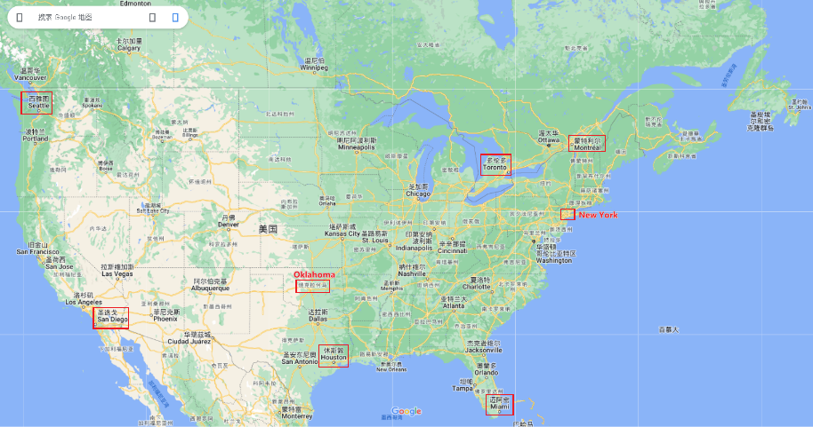
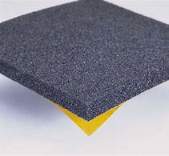

= step 2 - Lesson 04
:toc: left
:toclevels: 3
:sectnums:
:stylesheet: ../../+ 000 eng选/美国高中历史教材 American History ： From Pre-Columbian to the New Millennium/myAdocCss.css

'''

Lesson 4

== 01

Announcer: And now *over to* 转向；切换到 Marsha Davenport for today's *weather forecast*. Marsha? +
Weather reporter: Thanks, Peter. Well, as you can see from the weather map, there's varied weather activity across the United States and Canada today.  +
Let's start with the west coast, where it's raining *from* British Columbia *down to* northern California.  +
The high in #Seattle# will be 50 degrees.  +
Southern California will be in better shape 状况；情况 today — they'll have sunny skies and warmer temperatures.  +
We're looking for 指望，期待 a high of 78 degrees in #San Diego#.  +
The mid-west will be having clear but windy weather. #Oklahoma City# will see a high of 65 and sunny skies, with very strong winds.  +
Down in #Houston# we're looking for cloudy skies and a high of 69.  +
*Over to* the east in #Miami# we expect the thermometer 温度计 to reach 64 degrees, but it'll be cloudy and quite windy.  +
Up in the northeast, it looks like winter just won't let go 放手；松手! #New York# City will be having another day of heavy rains, high winds, and cold temperatures, with a high of only 35 degrees expected.  +
Further north in #Montreal# it's even colder — 28 degrees, with snow flurries  (n.)小阵雪（或雨等）;一阵忙乱（或激动、兴奋等） expected today.  +
Over in #Toronto# it's sunny but a cold 30 degrees. +
 +
And that's this morning's weather forecast. We'll have a complete (a.)（用以强调）完全的，彻底的 weather update today at noon.

[.my1]
====

====

[.my2]
====
+

播音员:现在由玛莎·达文波特为您播报今天的天气预报。玛莎?

天气记者:谢谢，彼得。嗯，正如你从天气图上看到的，今天美国和加拿大有各种各样的天气活动。让我们从西海岸开始，从不列颠哥伦比亚省到北加州都在下雨。西雅图的最高气温将达到50度。南加州今天的天气会好一些，那里会有晴朗的天空和温暖的气温。圣地亚哥的最高气温是华氏78度。中西部地区天气晴朗但多风。俄克拉荷马城的最高气温为65华氏度，天空晴朗，并伴有强风。在休斯敦，我们预计多云天气，最高华氏69度。在东部的迈阿密，我们预计气温将达到64度，但多云且有风。在东北部，看起来冬天就是走不掉!纽约市将迎来又一个大雨、大风和低温的日子，预计最高气温只有35度。再往北，蒙特利尔的气温更低——28华氏度，预计今天会有小雪。在多伦多，阳光明媚，但寒冷的30度。

以上就是今天早上的天气预报。今天中午我们将为您带来完整的天气预报。
====

---

== 02

*News anchor* (锚;给以安全感的人（或物）；精神支柱；顶梁柱,) 新闻主播: Good evening. I'm Charles McKay, and this is the 5 o'clock evening news. The top story this hour: The town of Delta has been declared a health hazard 危险；危害. The entire town of Delta was closed down by government authorities yesterday, after testing confirmed that the town had been poisoned by the dumping of toxic chemicals in town dumps 垃圾场；废物堆. Suspicions were first aroused three weeks ago, when 200 people telephoned the hospital complaining of headaches, stomachaches, faintness 眩晕；虚弱；接近昏厥, and dizziness 头晕；头昏眼花. An investigation revealed that toxic wastes had leaked into the ground and contaminated (v.)污染；弄脏 the water supply. People were being poisoned by their drinking water and by the fruits and vegetables they were eating from their gardens. In fact, any contact they had with soil or water was dangerous. Government authorities have ordered all residents  居民；住户 to leave the area until the chemical company responsible for the toxic waste can determine whether the town can be cleaned up and made safe again. +
 +
And now here's Sarah Cooper with tonight's Consumer Report 消费者报告. Sarah? +
Consumer reporter: Thank you Charles, and good evening. There was some good news for beer drinkers today: A recent study of 17,000 Canadians shows that people who drink beer moderately 适度；适量；适中 are healthier than people who drink other alcoholic beverages 饮料；酒水, such as wine or liquor 烈性酒. Researchers say they don't yet know exactly why this is so. They found, however, that moderate beer drinkers reported less illness and appeared to have a lower risk of death from heart disease. Good health seemed to be connected to the amount of beer consumed and the regularity (n.)规律性；经常性 of drinking. People who drank beer one or more times a day reported the least amount of illness. Heavy drinkers, however — people who drank 35 or more pints 品脱 of beer a week — reported more illness. +
 +
The war against cigarette 香烟 smoking is heating up again. Legislation 法规；法律 was introduced today that would make it illegal to advertise cigarettes, cigars, or any other tobacco product in any form of media. That means ads would be banned from newspapers, magazines, television, radio, and billboards 广告牌. The legislation would also prevent tobacco manufacturers from sponsoring  (v.)赞助（活动、节目等） sporting events and from *giving away* 赠送 free samples. This is the strongest anti-smoking legislation that has been introduced *to date* 迄今. Cigarette manufacturers insist that the legislation would be useless. In fact, they claim that in parts of the country where advertising has already been prohibited （尤指以法令）禁止, cigarette smoking has actually increased. +
 +
That concludes the Consumer Report for tonight. Let's *go over* now *to* Jerry Ryan and find out what's happening in the world of sports. Jerry? +
Sports announcer: Thanks, Sarah, and *good evening* sports fans. It was an exciting day in world soccer. Mexico defeated 击败；战胜 France 7 to 6, in a close game 比分接近的比赛 that offered spectators plenty of excitement. The game between Canada and Argentina ended in a tie 平局；得分相同；不分胜负, 3 to 3. And in a game that's still in progress 正在进行中, Italy is leading Haiti 2 to 1, with 30 minutes left to go. +
 +
Tune in tonight at 11 for a complete sports update.

[.my2]
====
新闻主播:晚上好。我是查尔斯·麦凯，这里是晚间5点新闻。这一小时的头条新闻:三角洲镇被宣布为健康危害。昨日，政府当局关闭了整个德尔塔镇，此前检测证实，该镇因倾倒在城镇垃圾场的有毒化学品而中毒。三周前，有200人打电话给医院，抱怨头痛、胃痛、晕眩。一项调查显示，有毒废物已渗入地下，污染了供水系统。人们被他们的饮用水和他们从花园里吃的水果和蔬菜所毒害。事实上，他们与土壤或水的任何接触都是危险的。政府当局已下令所有居民离开该地区，直到负责有毒废物的化学公司能够确定是否可以清理该镇并使其再次安全。

莎拉·库珀为您带来今晚的《消费者报告》。莎拉?

消费者记者:谢谢你，查尔斯，晚上好。对喝啤酒的人来说，今天有一些好消息:最近一项针对1.7万名加拿大人的研究表明，适度喝啤酒的人比喝其他酒精饮料(如葡萄酒或烈性酒)的人更健康。研究人员表示，他们还不知道为什么会这样。然而，他们发现，适量喝啤酒的人报告的疾病较少，死于心脏病的风险也较低。良好的健康似乎与啤酒的消费量和饮酒的规律有关。每天喝一次或多次啤酒的人患病的几率最小。然而，重度饮酒者——每周喝35品脱或更多啤酒的人——报告的疾病更多。

反对吸烟的战争再次升温。今天出台的立法规定，在任何形式的媒体上为香烟、雪茄或任何其他烟草产品做广告都是非法的。这意味着广告将被禁止出现在报纸、杂志、电视、广播和广告牌上。该立法还将阻止烟草制造商赞助体育赛事和免费赠送样品。这是迄今为止出台的最严厉的禁烟法案。香烟制造商坚持认为这项立法是无用的。事实上，他们声称，在国内已经禁止广告的部分地区，吸烟实际上有所增加。

今晚的消费者报告到此结束。现在让我们转到杰瑞·瑞恩，看看体育界正在发生什么。杰里?

体育播音员:谢谢你，萨拉，体育迷们晚上好。这是世界足球界激动人心的一天。墨西哥队以7比6击败了法国队，这场势均力敌的比赛让观众兴奋不已。加拿大和阿根廷的比赛以3比3打成平局。比赛还在进行中，意大利2比1领先海地，比赛还剩30分钟。

请在今晚11点收看完整的体育新闻。

====

---

== 03

Reporter: Well here I am at the Brooklyn Academy of Dramatic 戏剧的 Arts. I'm *asking* different students here *about* their favourite forms of artistic entertainment. Pop or classical concerts 音乐会；演奏会? Art galleries 美术馆 or the theatre? The ballet or the opera? The first person I'm going to talk to is Benny Gross. Benny comes from New York and he's 20 years old and he's studying the piano. Benny, hello and welcome to our programme. +
Benny: Hi, thanks. +
Reporter: So, first question Benny — have you ever been to an art gallery? +
Benny: Yes, lots of times. +
Reporter: And the ballet, have you ever been to the ballet? +
Benny: Yes, a few times. It's all right, I quite like it. +
Reporter: And what about classical concerts? +
Benny: Yes, of course, many many times. +
Reporter: Erm — next — have you ever been to an exhibition, Benny? +
Benny: Oh, yes — I love going to photographic 摄影的 exhibitions. +
Reporter: Do you? Now, next question — what about a ... folk 普通百姓;民间 concert? +
Benny: No, never. I think folk music is awful. +
Reporter: Ok. And the opera? Have you ever been to the opera? +
Benny: Yes. Two or three times. It's a little difficult but I quite like it. +
Reporter: And a pop concert? +
Benny: No, never. +
Reporter: And finally — have you ever been to the theatre? +
Benny: Yes, once or twice, but I didn't like it much. +
Reporter: Ok Benny. Now the next thing is — which do you like best from this list of eight forms of artistic entertainment? +
Benny: Well I like going to classical concerts best because I'm a musician 音乐家；作曲家, and I love classical music. +
Reporter: Ok and what next? +
Benny: Erm let's see — next, art galleries I think. And then, exhibitions. +
Reporter: OK — art galleries, then exhibitions. Then? The theatre? +
Benny: No, I don't think so, I don't really like the theatre. +
Reporter: The ballet? The opera? Which do you prefer of those two? +
Benny: The opera. +
Reporter: So of the theatre and the ballet, which do you prefer? +
Benny: Erm, the ballet I think because there's the music. I can always enjoy the music if I don't always like the dancing. +
Reporter: Right, well, thanks very much, Benny. +
Benny: You're welcome 不客气. +

Reporter: My next guest is Kimberley Martins. What are you studying here, Kimberley? +
Kimberley: Modern dance. I want to be a professional dancer when I leave. +
Reporter: OK, so here we go. First question — have you ever been to an art gallery? +
Kimberley: Yes, lots of times. +
Reporter: And have you ever been to the ballet? Stupid question I think. +
Kimberley: Yes, a bit. Of course I have. I go almost every night if I can. +
Reporter: And what about classical concerts? +
Kimberley: Yes —there are classical concerts here a lot —the other students perform here and I go to those when I can. +
Reporter: What about exhibitions —have you ever—? +
Kimberley: Oh yes, lots of times —I like exhibitions —exhibitions about famous people —dancers, actors, you know— +
Reporter: Mmm. And what about a folk concert? Have you ever been to one of them? +
Kimberley: No, I don't like folk music very much. +
Reporter: What about the opera? +
Kimberley: No, never. I don't really like opera. It's a bit too heavy for me. +
Reporter: A pop concert? +
Kimberley: Yes. I saw Madonna once. She was fantastic —she's a really great dancer. +
Reporter: And have you ever been to the theatre? +
Kimberley: Yes, I have. +
Reporter: Right. Thank you Kimberley. My next question is —which do you like best of all? And I think I know the answer. +
Kimberley: Yes—ballet, of course. After that, exhibitions. And after that, art galleries. +
Reporter: OK. +
Kimberley: Erm, what's left. Can I see the list? +
Reporter: Yes, of course. +
Kimberley: Erm, let me see —oh, it's difficult —I suppose —what next? —er —classical concerts, pop concerts, the theatre. Well, I think pop concerts next, I like going to those. Then I don't know. Classical concerts or the theatre? Classical concerts I think. So that leaves the theatre after them. OK? +
Reporter: Great. And many thanks for talking to us, Kimberley. +
Kimberley: You're welcome.

[.my2]
====
记者:我现在在布鲁克林戏剧艺术学院。我在这里问不同的学生他们最喜欢的艺术娱乐形式。流行音乐会还是古典音乐会?美术馆还是剧院?芭蕾舞还是歌剧?我要找的第一个人是本尼·格罗斯。本尼来自纽约，他今年20岁，正在学习钢琴。本尼，大家好，欢迎来到我们的节目。 +
本尼:嗨，谢谢。 +
记者:第一个问题，本尼，你去过美术馆吗? +
本尼:是的，很多次。 +
记者:还有芭蕾，你看过芭蕾吗? +
本尼:是的，去过几次。没关系，我很喜欢。 +
记者:那古典音乐会呢? +
本尼:是的，当然，很多很多次。 +
记者:接下来，本尼，你去过展览吗? +
本尼:哦，是的，我喜欢看摄影展。 +
记者:是吗?下一个问题——民间音乐会怎么样? +
本尼:不，从来没有。我认为民间音乐很糟糕。 +
记者:好的。歌剧呢?你去过歌剧院吗? +
本尼:是的。两三次。有点难，但我很喜欢。 +
记者:那流行音乐会呢? +
本尼:不，从来没有。 +
记者:最后，你去过剧院吗? +
本尼:是的，有一两次，但我不太喜欢。 +
记者:好的，本尼。下一个问题是，在这八种艺术娱乐形式中，你最喜欢哪一种? +
本尼:嗯，我最喜欢去古典音乐会，因为我是音乐家，我喜欢古典音乐。 +
记者:好的，接下来呢? +
本尼:嗯，让我想想，下一个，我想是美术馆。然后是展览。 +
记者:好的，画廊，然后是展览。然后呢?剧院吗? +
本尼:不，我不这么认为，我真的不喜欢剧院。 +
记者:芭蕾舞?歌剧吗?这两个你更喜欢哪一个? +
本尼:歌剧。 +
记者:那么戏剧和芭蕾，你更喜欢哪一个? +
本尼:嗯，我想是芭蕾，因为有音乐。如果我不总是喜欢跳舞，我可以总是享受音乐。 +
记者:好的，非常感谢你，本尼。 +
本尼:不客气。 +
记者:下一位嘉宾是金伯利·马丁斯。你在这里学什么，金伯利? +
金伯利:现代舞。我离开后想成为一名职业舞者。 +
记者:好的，我们开始吧。第一个问题，你去过美术馆吗? +
金伯利:是的，很多次。 +
记者:你看过芭蕾舞吗?我认为这是个愚蠢的问题。 +
金伯利:是的，有一点。当然了。如果可以的话，我几乎每天晚上都去。 +
记者:那古典音乐会呢? +
金伯利:是的，这里有很多古典音乐会，其他学生在这里表演，我一有空就去看。 +
记者:那展览呢——你曾经——吗? +
金伯利:哦，是的，很多时候——我喜欢展览——关于名人的展览——舞蹈家、演员，你知道的 +
记者:嗯。民间音乐会怎么样?你去过吗? +
金伯利:不，我不太喜欢民间音乐。 +
记者:歌剧怎么样? +
金伯利:不，从来没有。我不太喜欢歌剧。这对我来说有点重。 +
记者:流行音乐会? +
金柏莉:是的。我看过麦当娜一次。她太棒了——她真的是一个很棒的舞者。 +
记者:你去过剧院吗? +
金伯利:是的，我有。 +
记者:对。谢谢你，金伯利。我的下一个问题是，你最喜欢哪一个?我想我知道答案。 +
金伯利:是的，当然是芭蕾。之后是展览。之后是艺术画廊。 +
记者:好的。 +
金伯利:嗯，还剩下什么?我能看看单子吗? +
记者:是的，当然。 +
金伯利:嗯，让我想想——哦，这很难——我想——接下来怎么办?古典音乐会，流行音乐会，剧院。嗯，我想接下来是流行音乐会，我喜欢去。那我不知道。古典音乐会还是剧院?我想是古典音乐会。那就剩下剧院了。好吗? +
记者:太好了。非常感谢你接受我们的采访，金伯利。 +
金伯利:不客气。 +
====

---

== 04

Salesgirl 女售货员: Yes? +
Mrs. Bradley: Six packets of Rothmans and three of Silk Cut please. +
Salesgirl: Six Rothmans ... and three Silk Cut. That's ... six *fifty fives* -- three pound 英镑 thirty ... three Silk Cut -- one *forty-four* ... That's *four pound seventy-four* altogether. Thank you. 26p. change ... and your stamps. +

[.my1]
====
.six fifty fives — three pound thirty  六个55便士, 总价就是3英镑30便士.
乐富门牌香烟一盒55便士, 买6盒, 就是6*55=330便士, 即=3英镑30便士. (因为 1英镑=100便士。)

.three Silk Cut — one forty-four
买三盒Silk Cut,  一盒44便士, 即 3*44=132便士.

.That's *four pound seventy-four* altogether.
总共是4英镑74便士. 即 (6盒Rothmans的) 330便士 + (三盒Silk Cut的)132便士 = 462便士. 虽然按实际价格算是4英镑62便士,但是收了4英镑74便士,可能是收税了,因为后面说"给你税票". +
国外很多税是"单列"的,就是没有算在商品价格里面,要在结账时单独算进去.这点和国内将税含在商品价格里面不太一样.
====

Interviewer: Excuse me madam. +
Mrs. Bradley: Yes? +
Interviewer: I wonder whether you'd help us. We're doing a survey on smokers' habits. Would you mind ...? +
Mrs. Bradley: Well ... I'm in a bit of a hurry actually +
Interviewer: It'll only take a few minutes. We'd very much appreciate  感激；感谢；欢迎 your help. +
Mrs. Bradley: Well all right. I can spare 抽出；留出；匀出;不吝惜（时间、金钱） that I suppose. +

Interviewer: Thank you. You are a smoker ... of course? +
Mrs. Bradley: Yes I'm afraid I am. My husband is too. As you can see ... I've just bought the week's ration （食品、燃料等短缺时的）配给量，定量;正常量；合理的量. +
Interviewer: Would you *describe* yourself *as* being a heavy smoker 重度吸烟者? +
Mrs. Bradley: Heavy ... no. I wouldn't call *three packets of twenty* a week heavy smoking. That's not even ten a day. No ... a light smoker. My husband ... he's different ... +
Interviewer: Yes? +
Mrs. Bradley: I *get in* 购买；买进 *twice as many* 两倍多 a week for him. He smokes *twenty or more* a day. +
Interviewer: You wouldn't describe him as a chain-smoker 一根接一根抽烟的人；烟瘾大的人 ...? +
Mrs. Bradley: No ... he's not as bad as that. +
Interviewer: Right ... Thank you Mrs. ...? +
Mrs. Bradley: Bradley. Doris Bradley. +

Interviewer: ... Mrs. Bradley. You and your husband smoke cigarettes I see. What about cigars ... a pipe 烟斗；烟袋 ... Does your husband ...? +
Mrs. Bradley: Oh he's never smoked a pipe. He's the restless 坐立不安的；不耐烦的;没有真正休息的；没有睡眠的, nervy 焦虑的；紧张的;莽撞的；冒失的 type. I always *associate* pipe-smoking *with* people of another kind ... the calm contented （尤指因生活好而）满意的，惬意的，满足的 type ... *As for* 至于；关于 cigars I suppose he never smokes more than one a year —after his Christmas dinner. Of course I only smoke cigarettes. +

Interviewer: Right. Now let's keep to you Mrs. Bradley. When and why —if that's not asking too much —did you begin to smoke? Can you remember? +
Mrs. Bradley: Yes ... I remember very well. I'm thirty-two now ... so I must have been ... er ... yes ... seventeen ... when I had my first cigarette. It was at a party and —you know —at that age you want to do everything your friends do. So when my boyfriend —not my husband —when he offered me a cigarette I accepted it. I remember feeling awfully 非常；极其 grown-up 成熟的；成年的；长大的;适于成人的；成年人特有的 about it. Then I started smoking ... let's see now ... just two or three a day ... and I gradually increased. +

Interviewer: I see. That's very clear. Now ... Might I ask if you have ever *tried to* give up smoking? +
Mrs. Bradley: Yes —twice. The first time about six months before getting married. Oh that was because I was saving up and ... yes ... I *used to* （用于过去持续或经常发生的事）曾经 smoke more in those days. Sometimes thirty a day. So I decided to give it up —but only *succeeded* I'm afraid *in* cutting it down  削减，缩小（尺寸、数量或数目）. I still smoked a little ... +

[.my1]
====
.but only *succeeded* I'm afraid *in* cutting it down.
这句其实是: but I'm afraid *only succeeded in* cutting it down. 但我恐怕只是成功地减少了吸烟的数量, 而没有完全戒掉.
====

Interviewer: And the second time? +
Mrs. Bradley: Oh the second time I did manage to give up completely for a while. I was expecting ... and the doctor advised me not to smoke at all. I went （事情）进展，进行 [for about ... seven or eight months] ... without a single cigarette. +
Interviewer: Then you *took it up*  继续；接下去 again. +
Mrs. Bradley: Yes ... a couple of weeks after the baby was born. It was all right then because the baby was being bottle fed anyway. +
Interviewer: Good. That's interesting. So *if you'd been* breast-feeding 母乳喂养/ you would have gone [for longer] without smoking? +

[.my1]
====
.if you had  been...
这是"非真实条件状语从句"。引导条件状语从句的连词, 通常是if。*"非真实条件句"表示假设的情况完全不存在, 或者实现的可能性很小。*

- 表示"现在"或"一般的"情况: 句型是:  #*虚拟的条件句 If sb did sth, 主句 should/would/could/might do sth.*# +
*if I were you*, I wouldn't go there. 如果我是你的话，我是不会去那里的。 +
*If he knew it*, he would tell her.（如果他知道这件事的话，他是会告诉她的。）

- 表示"过去"的情况: 句型是:  #*虚拟的条件句 If sb had done/had been done sth, 主句 should/would/could/might have done sth.*#   +
*If he had known it* then, he might have told her.（如果他那时知道这件事，他早就告诉她了。）
*If I had been* in Peking, I would have seen her. （如果我当时在北京，我早就去看她了。） +

chatGpt: "if you'd been" 是一个条件句中的**条件状语从句，通常用于表示虚拟条件或假设的情况。**这句话中，"if you'd been breast-feeding" 表示一种假设，即如果你曾经进行母乳喂养（实际情况可能并没有进行母乳喂养），那么你可能会更长时间地戒烟。*这种句型用来讨论"与实际情况不符的情况"，以便探讨可能的结果或后果。*
====

Mrs. Bradley: Definitely. It's what the doctors advise. Though 虽然；尽管 not all mothers do as their doctors say ... +
Interviewer: Now Mrs. Bradley. When do you smoke most? +
Mrs. Bradley: Erm ... When I'm sitting watching TV or ... or ... reading a book ... but especially I'm with ... when I'm in company. Yes ... that's it ... when I'm with friends. I never smoke when I'm doing the housework ... never ... There's always too much to do. 总是有太多的事情要做 +
Interviewer: Do you ever smoke at meal 早（或午、晚）餐；一顿饭 times? +
Mrs. Bradley: I always have ... one cigarette after a meal. Never on an empty stomach. Which reminds me —I must be going. My husband will be waiting for his lunch. And Keith ... he's my son. +

Interviewer: Just one more question and that'll be all. +
Mrs. Bradley: Well if you insist. +
Interviewer: How would you describe the effect that smoking has on you? +
Mrs. Bradley: What do you mean? +
Interviewer: Well ... Does smoking —for example —make you excitable 易激动的；易兴奋的 ... keep you awake ...? +
Mrs. Bradley: Oh no —quite the contrary 相对立的；相反的. [As I told you before] I smoke (v.) most [at times when I'm most relaxed]. Though *quite honestly* 说实话  I ... don't really know whether I smoke because I'm relaxed or ... er ... you know ... in order to relax. Now I really must be ... Please excuse me. I see you're ... you're carrying a tape-recorder 磁带录音机. This won't be on the radio, will it? +
Interviewer: No Mrs. Bradley ... I'm afraid not. But we do thank you all the same. +
Mrs. Bradley: Right. Goodbye. +
Interviewer: Goodbye Mrs. Bradley. +

(Pause.) +
Salesgirl: *How's it going* 近况如何，最近怎样 then? +
Interviewer: Fine. Give us a packet of Seniors  较…年长的人, will you. I'm dying for 渴望 a smoke. +
Salesgirl: That's 60p. +
Interviewer: What about you. Don't you smoke ...?

[.my2]
====
女售货员:嗯? +
布拉德利夫人:请给我六包Rothmans和三包Silk Cut。 +

女售货员：六盒乐富门牌香烟,三盒Silk Cut（两个都是香烟的牌子）
六个55便士（乐富门牌香烟一盒55便士）就是3英镑30便士 三盒Silk Cut 一盒44便士 总共是4英镑74便士.找你26便士,这是你的印花税票.（按实际价格算是4英镑62便士,但是收了4英镑74便士,可能是收税了,因为后面说给你税票.国外很多税是单列的,就是没有算在商品价格里面,要在结账时单独算进去.这点和国内将税含在商品价格里面不太一样.）售货员实际上在口头计算着价格,所以说的数比较多

面试官:打扰一下，女士。 +
布拉德利夫人:什么事? +
面试官:我想知道你是否愿意帮助我们。我们正在做一项关于吸烟者习惯的调查。你介意……吗? +
布拉德利夫人:嗯……实际上我有点赶时间 +
采访者:只需要几分钟。我们将非常感谢你的帮助。 +
布拉德利夫人:好吧。我想我可以免去这个。 +
面试官:谢谢。你抽烟……当然了? +
布拉德利夫人:是的，恐怕我是。我丈夫也是。如你所见，我刚买了一周的口粮。 +

采访者：你会不会形容自己是个烟瘾很大的人？ +
布拉德利夫人：烟瘾很大……不。我不会把每周吸三包二十支装的烟叫做烟瘾很大。那连每天十支都不到。不……只能算是个吸烟不多的人。我丈夫……他可不同…… +
采访者：是吗？ +
布拉德利夫人：我为他买的烟，一周是别人的一倍多。他每天要抽二十支以上。 +
采访者：你不会说他是个烟鬼吧……？
布拉德利夫人:不，他没那么坏。 +
采访者:好的，谢谢. ...女士。 +
布拉德利夫人:布拉德利。多丽丝。布拉德利。 +
采访者:布拉德利夫人。我看到你和你丈夫都抽烟。雪茄呢…烟斗呢…你丈夫…? +
布拉德利夫人:哦，他从不抽烟斗。他是那种躁动不安的人。我总是把抽烟斗和另一种人联系在一起……那种平静满足的人……至于雪茄，我想他每年在圣诞晚餐后抽的绝不会超过一支。我当然只抽烟。 +
面试官:对的。现在我们只谈你，布拉德利夫人。如果这不是过分的要求，你是什么时候开始吸烟的?你还记得吗? +
布拉德利夫人:是的，我记得很清楚。我现在32岁了，所以我抽第一支烟的时候一定是17岁。那是在一个派对上，你知道，在那个年纪，你想做你朋友做的一切。所以当我的男朋友——不是我的丈夫——给我一支烟时，我接受了。我记得我觉得自己已经长大了。然后我开始抽烟，让我想想，一天两三支，然后逐渐增加。 +
采访者:我明白了。这很清楚。现在，我可以问一下你曾经试过戒烟吗? +
布拉德利夫人:是的，两次。第一次大约在结婚前六个月。哦，那是因为我在存钱，对，那时候我抽得更多。有时一天30个。所以我决定放弃它，但只有成功，我怕砍倒了它。我还是抽一点烟…… +
采访者:第二次呢? +
布拉德利夫人:哦，第二次，我确实有一段时间完全戒掉了。我怀孕了，医生建议我不要抽烟。我有七八个月没有抽过一支烟。 +
采访者:然后你又开始了。 +
布拉德利夫人:是的，在孩子出生几周后。那时还好，因为婴儿是用奶瓶喂养的。 +
面试官:很好。这很有趣。所以如果你是母乳喂养，你不吸烟的时间会更长吗? +
布拉德利夫人:当然。这是医生的建议。虽然不是所有的母亲都照医生说的做…… +
采访者:现在是布拉德利夫人。你什么时候吸烟最多? +
布拉德利夫人:嗯，当我坐着看电视或者看书的时候，尤其是当我有朋友的时候。是的，就是这样，当我和朋友在一起的时候。我做家务的时候从不抽烟，永远都有太多事情要做。 +
采访者:你曾经在吃饭的时候抽烟吗? +
布拉德利夫人:我总是在饭后抽一支烟。绝对不要空腹。这倒提醒了我，我得走了。我丈夫在等他的午餐。还有基斯，他是我儿子。 +
记者:再问一个问题就行了。 +
布拉德利夫人:好吧，如果你坚持的话。 +
采访者:你如何描述吸烟对你的影响? +
布拉德利夫人:你是什么意思? +
采访者:嗯……比如说，吸烟会让你兴奋吗?会让你保持清醒吗? +
布拉德利夫人:哦，不，恰恰相反。正如我之前告诉过你的，我在最放松的时候吸烟最多。不过老实说，我不太清楚我抽烟是为了放松，还是为了放松。现在我真的必须…请原谅。我看到你…你带着录音机。这不会在广播里播吧? +
采访者:不，布拉德利夫人，恐怕没有。但我们还是要感谢你。 +
布拉德利夫人:对。再见。 +
采访者:再见，布拉德利夫人。 +
(停顿)。 +
销售小姐:怎么样? +
面试官:很好。给我们一袋老年人，好吗?我真想抽支烟。 +
销售小姐:一共60便士。 +
面试官:你呢?你不抽烟吗? +
====

---

== 05

(1) Interviewer: Why do the actors wear roller-skates 溜冰鞋；轮式旱冰鞋? +
Designer: Well, they're all playing trains, you see. +
Interviewer: Trains? +
Designer: Yes, singing trains and they have to skate (v.)（通常指）滑冰，溜冰 all round the audience 观众，听众 at very high speeds. We've designed special lightweight （布料）轻量的，薄型的 costumes for them out of *foam 泡沫橡胶；海绵橡胶 rubber* 橡胶, otherwise 否则；不然 (pause) *they'd be exhausted* at the end of each performance. +

[.my1]
====
.roller-skate

.foam rubber

====

(2) I found it took me rather a long time to get into the book. I mean, I kept wondering *when we were going to* begin with the plot, *when we were going to* get the actual story. *Apart from that* I must say that (pause) I enjoyed it very much. +

[.my1]
====
.be going to 表示"即将发生"的动作
- She told her *she was going to quit the job*．她告诉他，她即将辞职不干。
====

(3) I found it very exciting and moving. I couldn't put it down and (pause) I *stayed up* 熬夜 very late to finish it. +

(4) Well, I do *agree with* Jane that the book took a long time to start. In fact, for me, it's only honest to say that (pause) the book never really *got started* at all. +

(5) I'm one of those impatient readers who want to *get straight into* 直入,立即开始做某事，不拖延 a book from the beginning. Otherwise (pause) I tend to skip parts that don't really hold my interest. +

(6) A: I'm afraid I did quite a lot of skipping with Alan Bailey's novel. And with over five hundred pages it was a bit of a disappointment really. +
B: Yes, I must admit that (pause) it was rather long.

[.my2]
====
(1)采访者:为什么演员要穿旱冰鞋? +
设计师:嗯，他们都在玩火车，你看。 +
面试官:火车吗? +
设计师:是的，会唱歌的火车，它们必须以很高的速度在观众周围滑行。我们用泡沫橡胶为他们设计了特别轻便的服装，否则每次演出结束时他们都会筋疲力尽。 +
我发现我花了很长时间才读懂这本书。我的意思是，我一直在想我们什么时候开始情节，什么时候才能得到真实的故事。除此之外，我必须说(停顿)我非常喜欢它。 +
我发现它非常令人兴奋和感动。我放不下它，为了完成它，我熬到很晚。 +
嗯，我同意简的观点，这本书花了很长时间才开始写。事实上，对我来说，只能诚实地说(暂停)这本书根本就没有真正开始。 +
我是那种没有耐心的读者，想从一本书的开头就直接读进去。否则(暂停)我倾向于跳过我不感兴趣的部分。 +
(6) A:恐怕我对艾伦·贝利的小说略读了不少。有五百多页，确实有点令人失望。 +
B:是的，我必须承认(停顿)时间相当长。 +

====

---

== 06 Books Belong to the Past

Sir, +
I visited my old school yesterday. It hasn't changed in thirty years. The pupils were sitting in the same desks and reading the same books. When are schools going to move into the modern world? Books belong to the past. In our homes /radio and television bring us knowledge of the world. We can see and hear the truth for ourselves. If we want entertainment /most of us *prefer* a modern film *to* a classical novel. In the business world /computers store (v.) information, so that we no longer need encyclopaedias 百科全书 and dictionaries. But in the schools /teachers and pupils still use books. There should be a radio and television set in every classroom, and a library of tapes and records in every school. The children of today will rarely open a book when they leave school. The children of tomorrow won't need to read and write at all. +

M.P. Miller +
London

[.my2]
====
先生,

我昨天参观了我的老学校。它在三十年里没有改变。学生们坐在同样的课桌上，读同样的书。学校什么时候才能进入现代社会?书籍属于过去。在我们家里，收音机和电视带给我们世界的知识。我们可以亲眼看到和听到真相。如果我们想要娱乐，我们大多数人更喜欢现代电影而不是古典小说。在商业世界中，计算机存储信息，因此我们不再需要百科全书和字典。但是在学校里，老师和学生仍然使用书本。每个教室都应该有一台收音机和电视机，每个学校都应该有一个磁带和唱片库。现在的孩子离开学校时很少打开一本书。未来的孩子根本不需要读书写字。

米勒议员

伦敦
====

---
