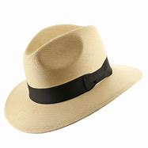
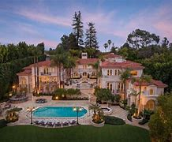

= step 2 - Lesson 05
:toc: left
:toclevels: 3
:sectnums:
:stylesheet: ../../+ 000 eng选/美国高中历史教材 American History ： From Pre-Columbian to the New Millennium/myAdocCss.css

'''

Lesson 5 +

== 1

Herbert Wilson and his wife went to the Isle （常用于诗歌和名称中）岛 of Wight 鬼；幽灵; …的人  for their summer holiday. But they were *by no means* 绝不可能，决不，一点也不 pleased with their hotel. As soon as they returned home, Herbert decided to write to the Manager of Happytours. +
Herbert: Can you spare a moment 抽出一点时间, dear? I want you to listen to this letter. +
Margaret: Go ahead 进行;请发言, then. +
Herbert: Dear Sir, my wife and I arrived home last night after a holiday arranged by your firm, in Jersey. We stayed at the hotel *described* in your brochure 资料（或广告）手册 *as* a comfortable, medium sized hotel, with a magnificent 壮丽的；宏伟的；值得赞扬的 view of the sea, offering courteous 有礼貌的；客气的；（尤指）恭敬的，谦恭的, old fashioned service and excellent food, served in a relaxed friendly atmosphere. +
Margaret: Yes, that's what the brochure said. +
Herbert: In fact the hotel is situated at least half a mile from the sea. Our room overlooked a car park ... +
Margaret: Through the gates of which /*motor vehicles* 机动车 were constantly arriving or departing. +
Herbert: Yes, that's good. The food was strictly  严格地;确切地 beef burgers 牛肉汉堡 and chips or fish and chips. Wine was available, but at exorbitant  (价格、费用) 过高的 prices, and *as for* the courteous 彬彬有礼的, old fashioned service, the majority of the staff were foreign and virtually 几乎；差不多 incapable 没有能力（做某事） of speaking or understanding the English language. +
Margaret: Yes, that's quite true. +
Herbert: In addition to this, we were most unhappy with the arrangements for our journey home 回家的旅程. We were instructed to catch the 11:00 am ferry 渡船；摆渡 ... +
Margaret: Wasn't it 12:00? +
Herbert: No, 11:00 ... but this was apparently delayed and we did not get away till 6 o'clock in the evening. Now that our holiday is over, it seems fairly pointless writing this letter, but I should like you to know that we were most disappointed with the hotel and travel arrangements and shall certainly not be booking any future holidays through Happytours. *Yours faithfully* 忠实地；忠诚地 （正式信末署名前的套语）, Herbert Wilson. +
Margaret: Yes dear, that's a very good letter.

[.my2]
====
赫伯特·威尔逊和他的妻子去怀特岛度暑假。 但他们对他们的酒店绝不满意。 他们一回到家，赫伯特就决定写信给Happytours的经理。
赫伯特：亲爱的，你能抽出一点时间吗？ 我想让你听听这封信。
玛格丽特：那么，继续吧。
赫伯特：亲爱的先生，我和我的妻子昨晚在贵公司安排的泽西岛度假后回到家。 我们住在你们宣传册上描述的一家舒适的中型酒店，可以看到壮丽的海景，提供礼貌的老式服务和美味的食物，在轻松友好的氛围中提供服务。
玛格丽特：是的，小册子上就是这么说的。
赫伯特：事实上，酒店距离大海至少有半英里。 我们的房间俯瞰着停车场……​
玛格丽特：机动车不断地进出大门。
赫伯特：是的，那很好。 食物严格来说是牛肉汉堡和薯条或鱼和薯条。 提供葡萄酒，但价格过高，而且至于礼貌的老式服务，大多数员工都是外国人，几乎不会说或听懂英语。
玛格丽特：是的，确实如此。
赫伯特：除此之外，我们对回家之旅的安排最不满意。 我们被指示搭乘上午 11:00 的渡轮……​
玛格丽特：不是 12:00 吗？
赫伯特：不，11:00……​但这显然被推迟了，我们直到晚上 6 点才离开。 既然我们的假期已经结束，写这封信似乎毫无意义，但我想让您知道，我们对酒店和旅行安排感到非常失望，并且肯定不会通过 Happytours 预订任何未来的假期。 此致，赫伯特·威尔逊。
玛格丽特：是的，亲爱的，这是一封非常好的信。
====

---

== 2

Miss （用于未婚女子姓氏或姓名前，以示礼貌）小姐，女士 Bush is talking to a travel agent in London. +
Travel Agent: Good morning. Can I help you? +
Miss Bush: Hello. Er, my name's Miss Bush and I'm intending to go to a conference （通常持续几天的大型正式）会议，研讨会 in Sydney for three weeks. +
Travel Agent: I see. Er, do you want the *excursion （短期的）涉足，涉猎 fare* 短途旅行优惠票价 or the *full return fare* 全额往返票价，往返票全价（非折后票价）. +

[.my1]
.案例
====
.excursion  fare  和 full return fare 的区别是什么?

chatGpt:
"Excursion fare" 和 "full return fare" 是常用于航空、铁路或其他交通运输领域的术语，用来描述不同种类的票价和购票方式的区别。

1.Excursion Fare（短程票价）：
Excursion fare 是一种特别的票价，通常**适用于旅行者在某一段时间内往返同一目的地，**而且通常要在提前购买。**这种票价通常比标准票价便宜，因为它是为了鼓励旅客计划提前购票、在特定时间内往返同一目的地而设置的。**Excursion fare 可能有一些限制，如日期限制或者一定的最短停留时间。

2.Full Return Fare（全价往返票价）：
Full return fare 是标准的往返票价，通常不受时间限制，旅客可以随时购买，而且通常没有特别的折扣。这种票价适用于那些没有计划提前购票或需要更大的灵活性的旅客。*Full return fare 的价格通常较高，因为它不像 excursion fare 那样享受折扣。*

总的来说，区别在于 excursion fare 是一种为了吸引提前计划, 并在特定时间内旅行的旅客, 而设置的折扣票价，而 full return fare 是标准的、不受时间限制的票价，通常较高。旅客可以根据自己的需求和计划来选择购买哪种票价。
====

Miss Bush: Now, can I get a stopover 中途停留 on an excursion fare? +
Travel Agent: Yes, you're allowed only one stopover on the excursion fare. +
Miss Bush: Oh, only one. +
Travel Agent: Yes. But of course, if you pay *the full return fare* then you can have unlimited stopovers. +
Miss Bush: Oh that's much better. Yes. You see, the thing is that I've got two weeks' holiday after the conference and *I've never been out [that way] before [at all]* to Australia or *the Far East* 远东（中国、日本等东亚及东南亚诸国）, and I, I wanted to go, you know, shopping or seeing Hong Kong or India or somewhere round there. +
Travel Agent: Yes. Uhum. +
Miss Bush: Um, where exactly can I go? +
Travel Agent: Well, lots of places. There's Singapore or um, Teheran 伊朗首都, Kuwait, Athens 希腊首都, you've really got quite a lot of choice you know. +
Miss Bush: Mm. Well, it sounds marvellous 极好的；非凡的. Um, how much would that cost? How much is the full fare? +
Travel Agent: The full fare? Well, that's really quite a lot. It's ￡1204. +
Miss Bush: (laughs) Yes, a thousand two hundred and four. Well, it's once in a lifetime, you know, I've never been. +
Travel Agent: Mm. +
Miss Bush: The thing is, actually that, um, I'm absolutely terrified of flying. I've never done it before. +
Travel Agent: Oh dear. Uhum +
Miss Bush: And er, um, I'm hoping that I can persuade my two friends, who are also going to the conference, to *stop over* 中途停留 with me on the way back. +
Travel Agent: Yes, that would be a good idea, yes. +
Miss Bush: Mm, yes. By the way, one of them's in Cairo at the moment. Would it be possible for me to stop over there on my way to Sydney? +
Travel Agent: Yes of course. There are plenty of flights to Cairo and, and then *plenty more* onwards 向前；前往 from Cairo to Sydney. And then you can stay, there, in Cairo, for as long as you like. +
Miss Bush: Oh that's great? Now, the thing is, I think I'd better go and persuade Mr. Adams that, you know, he'd like to stop with me in Cairo ... +
Travel Agent: I see. +
Miss Bush: ... go and discuss it with him and then come back to you in a day or two, if that's all right. +
Travel Agent: Yes. Certainly. Of course, madam. +
Miss Bush: Oh, thank you very much. OK. Goodbye. +
Travel Agent: Thank you. Goodbye.

[.my2]
====
布什小姐正在与伦敦的一家旅行社交谈。 +
旅行社：早上好。 我可以帮你吗？ +
布什小姐：你好。 呃，我叫布什小姐，我打算去悉尼参加一个为期三周的会议。 +
旅行社：我明白了。 呃，您想要短程票价还是全额回程票价。 +
布什小姐：现在，我可以用短途旅行票价获得中途停留吗？ +
旅行社：是的，您的短途旅行票价仅允许中途停留一站。 +
布什小姐：哦，只有一个。 +
旅行社：是的。 当然，如果您支付全额回程票价，那么您可以无限次中途停留。 +
布什小姐：哦，那好多了。 是的。 你看，事情是，会议结束后我有两周的假期，我以前从未去过澳大利亚或远东，我想去，你知道，购物或 参观香港或印度或附近的某个地方。 +
旅行社：是的。 嗯。 +
布什小姐：嗯，我到底能去哪里？ +
旅行社：嗯，很多地方。 有新加坡或德黑兰、科威特、雅典，你知道，你真的有很多选择。 +
布什小姐：嗯。 嗯，听起来棒极了。 嗯，那要花多少钱？ 全程票价是多少？ +
旅行社：全价吗？ 嗯，这确实是很多。 价格是 1204 英镑。 +
布什小姐：（笑）是的，一千二百零四。 好吧，这是一生一次，你知道，我从来没有去过。 +
旅行社：嗯。 +
布什小姐：事实上，嗯，我非常害怕飞行。 我以前从未这样做过。 +
旅行社：哦天啊。 嗯+
布什小姐：呃，嗯，我希望我能说服我的两个朋友，他们也要去参加会议，在回来的路上和我一起停留。 +
旅行社：是的，那是个好主意，是的。 +
布什小姐：嗯，是的。 顺便说一句，其中一人目前在开罗。 我去悉尼的途中可以在那里停留吗？ +
旅行社：当然可以。 有很多飞往开罗的航班，然后还有更多从开罗飞往悉尼的航班。 然后你可以在开罗呆多久，想呆多久就呆多久。 +
布什小姐：哦，那太好了？ 现在，问题是，我想我最好去说服亚当斯先生，你知道，他想和我一起留在开罗...... +
旅行社：我明白了。 +
布什小姐：……去和他讨论一下，然后一两天后回来找你，如果可以的话。 +
旅行社：是的。 当然。 当然，女士。 +
布什小姐：噢，非常感谢。 好的。 再见。 +
旅行社：谢谢。 再见。
====

---

== 3

Gillian felt slightly uneasy 担心的；忧虑的；不安的 as the porter 门卫；门房 unlocked the gates and waved 挥手；招手 her through. St Alfred's Hospital was not an ordinary mental institution 精神病院.  It was the most exclusive 专有的，独有的;排外的；不愿接收新成员（尤指较低社会阶层）的 institution of its type in the country. You had to be not only mentally ill, but also extremely wealthy  富有的；富裕的 to be accepted as a patient. She parked her car outside the main entrance of the imposing 壮观的；使人印象深刻的 eighteenth century building. She paused 暂停；停顿 on the steps /to look at the superb 极佳的；卓越的；质量极高的 ornamental 装饰性的；点缀的 gardens and surrounding parkland （如乡村大宅院周围的）有草木的开阔地. An old man in a white panama hat 巴拿马草帽 was watering the flowerbed 花坛 beside the steps. He smiled at her. +

[.my1]
.案例
====
.panama hat

====

Old man: Good afternoon, miss. A lovely day, isn't it? +
Gillian: Yes, it certainly is. +
Old man: Are you a new patient? +
Gillian: Oh, I'm not a patient. I'm just here to do some research. +
Old man: Will you be staying long? +
Gillian: I really don't know. I wonder if you could direct me to Dr. Carmichael's office? +
Old man: Certainly, miss. Just go through the main door, turn left, walk down to the end of the corridor （建筑物内的）走廊，过道，通道, and it's the last door on the right. +
Gillian: Thank you very much indeed. +
 +
Dr. Carmichael was waiting for her. He had been looking forward to 期待；盼望 meeting his new research assistant. He himself had always been interested in the special problems of long stay 长期停留 patients. Dr. Carmichael was very proud of his hospital and she was impressed by the relaxed 放松的；安静的；自在的 and informal atmosphere. She *spent* the mornings *interviewing* patients, and the afternoons *writing up*  (根据笔记) 整理成文 the results of her research in the gardens. Some of the patients were withdrawn 沉默寡言的；怕羞的；内向的 and depressed 抑郁的；沮丧的；意志消沉的, some seemed almost normal. Only one or two had to be kept locked up.

[.my1]
.案例
====
.spend ~ sth (on sth) /~ sth (doing sth/in doing sth)
to use time for a particular purpose; to pass time 花（时间）；度过 +
- Most of her life *was spent in caring for others*. 她大半辈子的时间都用来照顾别人了。 +
- I *spend too much time watching television*. 我看电视花的时间太多。
====

She found it hard to believe that all of them had been thought too dangerous to live in normal society. She often saw the old man in the panama hat. He spent most of his time working in the gardens, but he always stopped to speak to her. She found out that his name was Maurice Featherstone. He was a gentle and mild-mannered old fellow, with clear, blue, honest eyes, white hair and a pinkish 浅粉色的；略带桃红色的 complexion 面色；肤色；气色;（事物的）性质，特性. He always looked pleased 高兴；满意；愉快 with life. She became particularly curious about him, but Dr. Carmichael had never asked her to interview him, and she wondered why. One night, at dinner, she asked about Mr. Featherstone. +

Dr. Carmichael: Ah, yes, Maurice. Nice old chap （对男子的友好称呼）家伙，伙计. He's been here longer than anybody. +
Gillian: What's wrong with him? +
Dr. Carmichael: Nothing. His family put him here thirty-five years ago. They never come to visit him, but the bills are always paid on time. +
Gillian: But what had he done? +
Dr. Carmichael: I'll show you his file. It seems that he *burnt* （burn的过去式和过去分词形式） *down* his school when he was seventeen. His family tried to *keep* the incident *quiet* 保持安静,保守秘密,防止透露信息. Over the next few years there were a number of mysterious fires in his neighbourhood, but the family did nothing until he tried to *set fire to* 纵火 the family mansion 公馆；宅第. He was in here the next day. Maurice never protested （公开）反对；抗议. +

[.my1]
.案例
====
.mansion
a large impressive house 公馆；宅第 +

====

Gillian: And that was thirty-five years ago! +
Dr. Carmichael: I'm afraid so. If I'd had my way 如果我有办法的话, I'd have let him out years ago. +
Gillian: But he can't still be dangerous! +
Dr. Carmichael: No. He's had plenty of opportunities. We even let him smoke. If he'd wanted to start a fire, he could have done it at any time. +
 +
Gillian was shocked by the story. She became determined to do something about it. She wrote letters to Maurice's family, but never received a reply. He had never *been* officially *certified （尤指书面）证明，证实;证明（某人）患有精神病 as* insane  精神失常的；精神错乱的, and legally 按照法律，法律上, he could leave at any time. Dr. Carmichael was easily persuaded to let her talk to Maurice. +

Gillian: Maurice, have you ever thought about leaving this place? +
Maurice: No, miss. I'm very happy here. This is my home. And anyway, I've got nowhere to go. +
Gillian: But wouldn't you like to go into the village sometimes ... to walk around, to buy your own tobacco? +
Maurice: I've never thought about it, miss. I suppose it would be nice. But I wouldn't want to stay away for long. I've spent twenty years working on this garden. I know every flower and tree. What would happen to them if I weren't here? +
 +
 Gillian realized that it would be unkind 不友善的；不亲切的；不客气的；刻薄的 to make him leave the hospital. However, she found out that the next Saturday was his birthday. She arranged with the staff to give him a party. They wanted it to be a surprise and Dr. Carmichael agreed to let him go out for the afternoon. There was a flower show 花展 in the village. Maurice left at two o'clock. He seemed quite excited. They expected him to return about four o'clock. The cook had made a birthday cake and the staff had decorated the lounge （私宅中的）起居室;（机场等的）等候室. +
 +
Gillian was standing in the window when she saw him. He was early 早到的；提前的；提早的. He was walking up the drive （从街道通向住宅的宽阔或私人的）车道 towards the house, whistling cheerfully. Behind him, above the trees, several thick black columns of smoke were beginning to rise slowly into the clear blue sky.

[.my2]
====
看门人打开大门，挥手示意她进去时，吉莉安感到有些不安。圣阿尔弗雷德医院不是一家普通的精神病院。这是全国同类机构中最排外的。你不仅要有精神疾病，而且要非常富有才能被接受为病人。她把车停在那幢气势宏伟的十八世纪建筑的正门外面。她在台阶上停了下来，看看那些华丽的装饰花园和周围的公园。一位戴着白色巴拿马草帽的老人正在台阶旁的花坛浇水。他朝她笑了笑。 +
老人:下午好，小姐。天气真好，不是吗? +
吉莉安:是的，确实是这样。 +
老人:你是新病人吗? +
吉莉安:哦，我不是病人。我只是来做些调查的。 +
老人:你会待很久吗? +
吉莉安:我真的不知道。你能告诉我卡迈克尔医生的办公室在哪里吗? +
老人:当然可以，小姐。只要穿过大门，向左拐，走到走廊的尽头，右边最后一个门就是。 +
吉莉安:非常感谢。 +
卡迈克尔医生在等她。他一直盼望着见到他的新研究助理。他自己一直对长期住院病人的特殊问题很感兴趣。卡迈克尔医生对他的医院感到非常自豪，医院里轻松随意的气氛给她留下了深刻印象。她上午会见病人，下午把她在花园里的研究结果写下来。有些病人孤僻、抑郁，有些看起来几乎正常。只有一两个必须被关起来。她发现很难相信他们所有人都被认为太危险而不能生活在正常的社会中。她经常看见那个戴巴拿马草帽的老人。他大部分时间都在花园里干活，但他总是停下来和她说话。她发现他的名字是莫里斯·费瑟斯通。他是一个温文尔雅、举止温和的老人，有一双清澈、湛蓝、诚实的眼睛，白发苍苍，面色红润。他看上去总是对生活很满意。她对他特别好奇，但卡迈克尔医生从来没有请她采访过他，她不知道为什么。一天晚上吃饭时，她问起费瑟斯通先生。 +
卡迈克尔医生:啊，是的，莫里斯。不错的老家伙，他在这里的时间比任何人都长。 +
吉莉安:他怎么了? +
没什么。他的家人35年前把他送到这里。他们从不来看他，但账单总是按时支付。 +
吉莉安:但是他做了什么? +
我给你看看他的档案。似乎他在十七岁时烧毁了他的学校。他的家人试图掩盖这件事。在接下来的几年里，他家附近发生了几起神秘的火灾，但他的家人什么也没做，直到他试图放火烧家里的豪宅。他第二天就来了。莫瑞斯从未提出异议。 +
吉莉安:那是35年前的事了! +
Dr. Carmichael:恐怕是的。如果我有办法，我几年前就放他出来了。 +
吉莉安:但他不可能还是危险的! +
Dr. Carmichael:不。他有很多机会。我们甚至让他抽烟。如果他想放火，他随时都可以做到。 +
吉莉安被这个故事震惊了。她下定决心要做点什么。她给莫瑞斯的家人写了信，但从未收到过回信。他从来没有被正式认定为精神失常，从法律上讲，他随时都可以离开。卡迈克尔医生很容易就被说服让她和莫瑞斯谈谈。 +
吉莉安:莫里斯，你有没有想过离开这个地方? +
莫里斯:不，小姐。我在这里很开心。这是我的家。反正我也没地方可去了。 +
吉莉安:但是你不想偶尔去村里走走，自己买烟草吗? +
莫里斯:我从来没有想过这个问题，小姐。我想这样会很好。但我不想离开太久。我花了二十年的时间打理这个花园。我认识每一朵花和每一棵树。如果我不在这里，他们会怎么样? +
吉莉安意识到让他离开医院是不厚道的。然而，她发现下个星期六是他的生日。她和工作人员安排给他举行宴会。他们想给他一个惊喜，卡迈克尔医生同意让他下午出去。村里有一个花展。莫瑞斯两点钟离开了。他似乎很兴奋。他们预计他四点钟左右回来。厨师做了一个生日蛋糕，工作人员装饰了客厅。 +
吉莉安看见他时正站在窗前。他早到了。他愉快地吹着口哨，沿着车道朝房子走去。在他身后，树木上方，几缕浓黑的烟柱开始缓缓升入清澈的蓝天。 +
====

---

== 4

1. The student, puzzled 迷惑；使困惑 about a particular point, decides to ask a question. As *so often happens* when under pressure, he tends to *concentrate most of his attention on* the subject matter （著作、讲话、绘画等的）主题，题材，主要内容 and he *pays practically no attention to* the language. Consequently, (pause) he fails to employ 应用；运用；使用 the correct question form. +

2. However, even though the student does employ an appropriate question form, (pause) difficulties may still arise. +

3. The basic difficulty *may*, in fact, *be* one of several different types. It may lie in the student's limited *aural 听觉的；听的 perception*  知觉；感知, in other words, (pause) the student may *not have clearly heard* (v.) what was said. +

4. Learners of English *have*, for example, *said to me* such things as "See me here tomorrow" or "Explain this". Fortunately, as I deal with non-native speakers and as I understand their language problems, I *interpret* 把…理解为；领会 this *as* inadequacy 不充分；不足；不够 in the language *rather than* rudeness. Other teachers, however, (pause) may feel angry at receiving such orders. +

[.my1]
.案例
====
chatGpt:  +
"See me here tomorrow" 和 "Explain this" 可能被认为具有冒犯性质，因为它们没有表达出礼貌或委婉的方式来请求或要求某人做某事, 显得比较直接和命令式。

*"See me here tomorrow": 这句话中使用了命令形式，暗示对方必须在明天在某地见面*。通常，在正式和礼貌的交流中，人们更倾向于**使用委婉的表达方式，如 "Could you please** meet me here tomorrow?" 或 "*Would it be possible for you to* meet me here tomorrow?" 这样的表达方式更显得尊重和礼貌。

**"Explain this": 这句话要求对方解释某事，**但它也缺乏委婉和礼貌的元素。通常，更有礼貌的方式是使用更**委婉的表达方式，如 "Could you please** explain this to me?" 或 "**I would appreciate it if you could** explain this." 这样的表达方式更能够表现出尊重和礼貌。

在教育领域，特别是在教授非英语母语学生的情况下，教师通常更容易理解学生的语言不足，并愿意将学生的表达方式解释为语言不熟练，而不是恶意或无礼。然而，其他人，尤其是在正式或职场环境中，可能会认为这样的直接表达方式是不礼貌的。
====

\5. Today I'm going to consider, very briefly, a problem *concerned 与…有关；涉及 with* the competition 竞争；角逐 for land use, that i... that is (pause) whether crops *should be used* to produce food or to ... *should be used* to produce fuel. +

\6. A particularly interesting possibility for many developing countries has been the conversion 转变；转换；转化 of plant material to alcohol. Th... this is interesting /because in many developing countries there is a large agricultural sector, and at the same time (pause) a small industrial sector.

[.my2]
====
1.学生对某一点感到困惑，于是决定问一个问题。就像在压力下经常发生的那样，他倾向于把大部分注意力集中在主题上，而几乎不注意语言。因此，(停顿)他没有使用正确的疑问句。 +
2.然而，即使学生确实使用了适当的提问形式，(暂停)困难仍然可能出现。 +
3.事实上，基本难度可能是几种不同类型中的一种。它可能在于学生的听觉感知有限，换句话说，(暂停)学生可能没有清楚地听到所说的话。 +
4.例如，英语学习者对我说过这样的话:“明天在这里见我”或“解释这个”。幸运的是，当我与非母语人士打交道时，当我了解他们的语言问题时，我把这解释为语言的不足，而不是粗鲁。然而，其他老师可能会对收到这样的命令感到愤怒。+
5.今天，我将简要地考虑一个与土地使用竞争有关的问题，即……那就是(暂停)农作物是应该用来生产食物还是…应该用来生产燃料。 +
6.对许多发展中国家来说，一种特别有趣的可能性是将植物材料转化为酒精。Th……这很有趣，因为在许多发展中国家有一个大的农业部门，同时(暂停)有一个小的工业部门。 +
====

---

== 5 The School Holidays Are Too Long +

Today the children of this country have at last returned to work. After two months' holiday pupils have started a new term. How many adults get such long holidays? Two to four weeks in the summer and public holidays — that's all the working man gets. As for the average woman, she's lucky to get a holiday at all. Children don't need such long holidays. In term-time 学期（与假期相对而言） /they *start work later* and *finish earlier* than anyone else. +
 +
In the holidays most of them *get bored*, and some get into trouble. What a waste! If their overworked parents were given more free time instead, everyone would be happier. +
 +
This isn't just a national problem either — it's worldwide. Dates may be different from country to country, but the pattern's the same. Why should children do half as much work /and *get twice as much holiday as* their parents?

[.my2]
====
学校假期太长了 +
今天，这个国家的孩子们终于重返工作岗位。两个月的假期过后，学生们开始了新学期。有多少成年人有这么长的假期?在夏季和公共假期的两到四周，这就是工人的全部时间。对于普通女性来说，能有个假期就已经很幸运了。孩子们不需要这么长的假期。在学期中，他们开始工作比其他人晚，结束得比其他人早。 +
在假期里，他们中的大多数人感到无聊，有些人陷入困境。太浪费了!如果他们劳累过度的父母有更多的空闲时间，每个人都会更快乐。 +
这也不仅仅是一个国家的问题，而是全世界的问题。每个国家的日期可能不同，但模式是一样的。为什么孩子的工作量是父母的一半，假期却是父母的两倍? +
====

---
