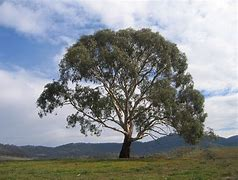
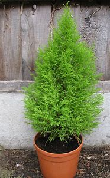
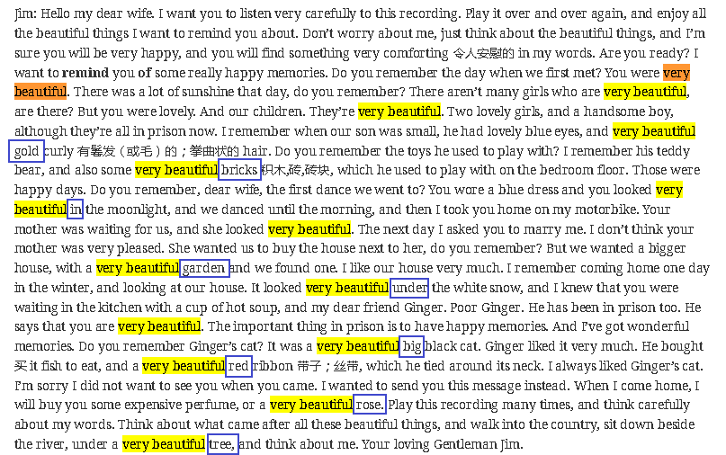

= step 2 - Lesson 06
:toc: left
:toclevels: 3
:sectnums:
:stylesheet: ../../+ 000 eng选/美国高中历史教材 American History ： From Pre-Columbian to the New Millennium/myAdocCss.css

'''

---

Lesson 6 +

== 1

Reporter: And now, Mrs. Skinner, can you tell us your story? What happened at your farm when the earthquake passed? +

Mrs. Skinner: Oh, it was terrible. I'll never forget it to my dying day. I hope I never see anything like that again. It was terrible. Well, we always get up, Jack and me, at about quarter to five. He has to milk (v.)挤奶 the cows 母牛; 奶牛 early, you see, and while he's doing that /I make his breakfast. I was in the kitchen when it came. Suddenly the whole house was moving. The coffee pot flew through the window, and I was on my back 仰面躺在 on the kitchen floor. The noise was terrible. Well, I knew what I had to do. You have to get outside, you know, it's safer there. So I ran through the house and opened the front door. Then I stopped — I couldn't believe it — everything was different, everything had changed, nothing was in the right place any more. You know outside our house there is a path to the gate — there was I should say — well, the path wasn't there any more. In front of the front door was our rose garden, not the path! And next to the rose garden were the eucalyptus 桉树 trees, and behind them the raspberry 覆盆子；山莓；悬钩子 patch 色斑；斑点；（与周围不同的）小块，小片 — just as before, but they had all moved, moved about five metres to the left, to the south that is. On each side of the garden path we had a line of beautiful old cypress  柏树 trees. Well /these had now moved right down to the end of the house, to the left again that is. And the path had completely disappeared. +

[.my1]
.案例
====
.eucalyptus

.raspberry
image:../img/raspberry.jpg[,10%]

.cypress

====

Reporter: But that's incredible 不可思议的，难以置信的, Mrs. Skinner. Do you mean that everything in front of your house had moved — what? — five metres to the left, I mean to the south? The raspberry patch, the eucalyptus trees, the rose-garden, the two lines of cypress trees — all had moved? +

Mrs. Skinner: Yes, everything had moved into the place of the other! +

Reporter: But your front path had completely disappeared? +

Mrs. Skinner: Yes, that's right. Oh it was terrible, terrible. +

Reporter: And your husband Jack? Was he all right? +

Mrs. Skinner: Yes — but the cowshed 牛棚；牛舍 had moved too — it had moved several metres. Jack was all right — I could see him running round after the cows — all the cows had escaped you see. They were running all over the place — it was impossible to catch them. +

Reporter: So Jack, your husband, was all right. +

Mrs. Skinner: Well he was a bit shocked like me, but he was all right. Oh, I forgot to tell you about the granary 谷仓；粮仓 — that had moved south too. Its normal place was behind the house and now it was near the cowshed. Can you believe it? +

Reporter: Incredible, Mrs. Skinner. And the house itself — what about your house? +

Mrs. Skinner: Well then we saw what had happened. Everything had moved one way — that is, to the south — except the house. The house — can you believe it? — had moved the other way — the house had moved north. So the house went one way and everything else — the garden, the trees, the granary — went the other way. +

Reporter: Incredible, Mrs. Skinner, absolutely incredible.

[.my2]
====
记者：现在，斯金纳夫人，您能告诉我们您的故事吗？地震过去后，你的农场发生了什么？ +

斯金纳夫人：噢，太可怕了。直到我去世的那一天我都不会忘记它。我希望我再也不会看到这样的事情了。太可怕了。嗯，杰克和我，我们总是在五点一刻左右起床。你看，他必须早点给奶牛挤奶，当他这样做的时候，我给他做早餐。菜来的时候我正在厨房里。突然整个房子都动了起来。咖啡壶从窗户飞了出去，我仰面躺在厨房的地板上。噪音很可怕。嗯，我知道我必须做什么。你必须出去，你知道，那里更安全。于是我跑过房子，打开前门。然后我停了下来——我简直不敢相信——一切都不同了，一切都变了，一切都不再在正确的位置了。你知道我们家外面有一条通往大门的路——我应该说是有——好吧，那条路已经不存在了。前门前面是我们的玫瑰园，不是小路！玫瑰园旁边是桉树，后面是覆盆子地——和以前一样，但它们都移动了，向左移动了大约五米，即向南移动。花园小路的两边都有一排美丽的老柏树。好吧，这些现在已经移到了房子的尽头，也就是说，又移到了左边。而那条路也完全消失了。 +

记者：但这太不可思议了，斯金纳夫人。你的意思是你家前面的所有东西都移动了——什么？ ——向左五米，我是说向南？覆盆子地、桉树、玫瑰园、两排柏树——全都搬走了？ +

斯金纳夫人：是的，所有的东西都移到了原来的位置！ +

记者：但是你前面的路完全消失了？ +

斯金纳夫人：是的，没错。噢，太可怕了，太可怕了。 +

记者：你的丈夫杰克呢？他还好吗？ +

斯金纳夫人：是的——但是牛棚也移动了——移动了几米。杰克没事——我可以看到他追着奶牛跑——你看，所有的奶牛都逃走了。他们到处乱跑，根本不可能抓住他们。 +

记者：所以你的丈夫杰克一切都好。 +

斯金纳夫人：嗯，他和我一样有点震惊，但他没事。哦，我忘了告诉你粮仓的事了——它也南迁了。原来的位置是在房子后面，现在是在牛棚附近。你相信吗？ +

记者：难以置信，斯金纳夫人。还有房子本身——你的房子呢？ +

斯金纳夫人：那么我们就看到了发生了什么。除了房子之外，一切都向一个方向移动了——即向南移动。房子——你能相信吗？ ——向另一个方向移动了——房子向北移动了。所以房子朝一个方向发展，而其他一切——花园、树木、粮仓——则朝另一个方向发展。 +

记者：难以置信，斯金纳夫人，绝对令人难以置信。 +
====

---

== 2

A funny thing happened to me last Friday. *I'd gone to London* to do some shopping.

[.my1]
.案例
====
chatGpt:  +

"I'd gone to London" 是过去完成时 (past perfect tense) , **强调一个在过去某个时间点之前, 已经发生的动作或事件。**在这种情况下，它强调在上周五之前你已经去过伦敦。
====

I wanted to get some Christmas presents, and I needed to find some books for my course （有关某学科的系列）课程，讲座 at college (you see, I'm a student). I caught an early train to London, so by early afternoon I'd bought everything that I wanted. Anyway, I'm not very fond of London, all the noise and traffic, and I'd made some arrangements for that evening. So, I took a taxi to Waterloo station. I can't really afford taxis, but I wanted to get the 3:30 train. Unfortunately the taxi got stuck in a traffic jam, and by the time I got to Waterloo, the train had just gone. I had to wait an hour for the next one. I bought an evening newspaper, the 'Standard', and wandered 漫游；游荡；闲逛 over to the station buffet 自助餐. At that time of day it's nearly empty, so I bought a coffee and a packet of biscuits ... chocolate biscuits. I am very fond of chocolate biscuits. There were plenty of empty tables and I found one near the window. I sat down and began doing the crossword 纵横填字游戏. I always enjoy doing crossword puzzles. +

After a couple of minutes a man sat down opposite me. There was nothing special about him, except that he was very tall. In fact he looked like a typical city businessman ... you know, dark suit and briefcase 公文包；公事包. I didn't say anything and I *carried on* 继续 with my crossword. Suddenly he reached across 从…一边到另一边；横过 the table, opened my packet of biscuits, took one, dipped it into his coffee and popped （迅速或突然）放置 it into his mouth. I couldn't believe my eyes! I was too shocked to say anything. Anyway, I didn't want to make a fuss 无谓的激动（或忧虑、活动）；大惊小怪;（为小事）大吵大闹，大发牢骚, so I decided to ignore it. I always avoid trouble if I can. I just took a biscuit myself and went back to my crossword. +

When the man took a second biscuit, I didn't look up and I didn't make a sound. I pretended to be very interested in the puzzle. After a couple of minutes, I casually 不经意的,漫不经心的 put out my hand, took the last biscuit and glanced at the man. He was staring at me furiously 狂怒地，狂暴地. I nervously put the biscuit in my mouth, and decided to leave. I was ready to get up and go when the man suddenly pushed back his chair, stood up and hurried out of the buffet. I felt very relieved and decided to wait two or three minutes before going myself. I finished my coffee, folded my newspaper and stood up. And there, on the table, where my newspaper had been, was my packet of biscuits.

[.my2]
====
上周五我发生了一件有趣的事。我去伦敦购物。我想要一些圣诞礼物，我需要为我的大学课程找到一些书籍（你看，我是一名学生）。我乘早班火车去伦敦，所以到下午早些时候我就买了我想要的所有东西。不管怎样，我不太喜欢伦敦，那里的噪音和交通，我已经为那天晚上做了一些安排。于是，我打车去了滑铁卢车站。我真的买不起出租车，但我想坐 3:30 的火车。不幸的是，出租车遇到了交通堵塞，当我到达滑铁卢时，火车刚刚开走。我不得不等一个小时才能看到下一个。我买了一份晚报《标准报》，然后漫步到车站自助餐厅。一天中的那个时候它几乎是空的，所以我买了一杯咖啡和一包饼干……巧克力饼干。我非常喜欢巧克力饼干。那里有很多空桌子，我在窗户附近找到了一张。我坐下来开始做填字游戏。我总是喜欢做填字游戏。 +

几分钟后，一个男人在我对面坐下。他没有什么特别之处，只是个子很高。事实上，他看起来就像一个典型的城市商人……你知道，深色西装和公文包。我什么也没说，继续做填字游戏。突然，他把手伸到桌子对面，打开我的饼干包，拿了一块，把它浸入咖啡中，然后塞进嘴里。我简直不敢相信自己的眼睛！我震惊得说不出话来。反正我也不想大惊小怪，所以决定不去理会。如果可以的话，我总是避免麻烦。我自己拿了一块饼干，然后又回到我的填字游戏。 +

当那个人拿走第二块饼干时，我没有抬头，也没有发出声音。我假装对这个谜题很感兴趣。几分钟后，我漫不经心地伸出手，拿起最后一块饼干，看了那人一眼。他愤怒地盯着我。我紧张地把饼干放进嘴里，决定离开。我正准备起身离开，那人突然把椅子往后一推，站起来，匆匆走出自助餐厅。我心里松了口气，决定等两三分钟再自己走。我喝完咖啡，折起报纸，站了起来。桌子上原来放着报纸的地方，放着我的一包饼干。 +
====

---

== 3

Inspector 检查员；视察员；巡视员; （警察）巡官: Morning, Sergeant （美国警察）警佐;陆军（或空军）中士. What have you got for me today? +

Sergeant: We've got that tape from Gentleman Jim, sir. It was sent to us yesterday. They want to know *if it's all right* to send it to his wife. +

Inspector: And is it? +

Sergeant: I don't know sir. I'm sure there's a message hidden in the tape, but I don't know what it is. It's been examined by half the police force in London, and nothing was found. But there is something very peculiar about that tape. +

Inspector: Well, what is it? +

Sergeant: Well, sir, he talks about happy memories and things. And really, Inspector, I don't think Gentleman Jim really *feels like that* about anything. I don't think *he means any of it*. I'm sure there is something else on the tape, and it's hidden in what he says. But I can't find it. +

[.my1]
.案例
====
.I don't think Gentleman Jim really *feels like that* about anything.
我真的不认为绅士吉姆对任何事情都有这种感觉。

.I don't think he means any of it.
我不认为他指的是其中的任何一个。
====

Inspector: The tape is all right, is it? It wasn't *tampered (v.) 篡改，擅自改动，胡乱摆弄（尤指有意破坏） with* when Gentleman Jim recorded the message? +

Sergeant: The tape was carefully examined by three different experts, and they didn't find anything. Whatever it is, it's in the words. +

Inspector: Well, I think I'd better listen to this tape, and see if I can find this mystery message. +

Sergeant: Right you are 我同意 / sir, it's waiting for you. +

[.my1]
.案例
====
.Right you are sir.
Right you are : said to show that you understand and agree即“同意”。

chatGpt: +
在这个对话中，句子 "Right you are sir" 使用了倒装结构，正常的语序应该是 "You are right, sir"。

倒装结构的目的是为了强调、突出或形成一种更正式的表达方式。在这里，Sergeant使用了倒装结构 "Right you are sir"，以表示对上级Inspector的尊重和遵从，也可以理解为一种礼貌的回应方式。这种用法强调了对上级的配合和尊重，是一种常见的表达方式，尤其在军事、警察等领域的交流中。所以，虽然语序不是正常的，但这种用法在特定情境下是合适的。
====

Jim: Hello my dear wife. I want you to listen very carefully to this recording. Play it over and over again, and enjoy all the beautiful things I want to remind you about. Don't worry about me, just think about the beautiful things, and I'm sure you will be very happy, and you will find something very comforting 令人安慰的 in my words. Are you ready? I want to *remind* you *of* some really happy memories. Do you remember the day when we first met? You were very beautiful. There was a lot of sunshine that day, do you remember? There aren't many girls who are very beautiful, are there? But you were lovely. And our children. They're very beautiful. Two lovely girls, and a handsome boy, although they're all in prison now. I remember when our son was small, he had lovely blue eyes, and very beautiful gold curly 有鬈发（或毛）的；拳曲状的 hair. Do you remember the toys he used to play with? I remember his teddy bear, and also some very beautiful bricks 积木,砖,砖块, which he used to play with on the bedroom floor. Those were happy days. Do you remember, dear wife, the first dance we went to? You wore a blue dress and you looked very beautiful in the moonlight, and we danced until the morning, and then I took you home on my motorbike. Your mother was waiting for us, and she looked very beautiful. The next day I asked you to marry me. I don't think your mother was very pleased. She wanted us to buy the house next to her, do you remember? But we wanted a bigger house, with a very beautiful garden and we found one. I like our house very much. I remember coming home one day in the winter, and looking at our house. It looked very beautiful under the white snow, and I knew that you were waiting in the kitchen with a cup of hot soup, and my dear friend Ginger. Poor Ginger. He has been in prison too. He says that you are very beautiful. The important thing in prison is to have happy memories. And I've got wonderful memories. Do you remember Ginger's cat? It was a very beautiful big black cat. Ginger liked it very much. He bought 买 it fish to eat, and a very beautiful red ribbon 带子；丝带, which he tied around its neck. I always liked Ginger's cat. I'm sorry I did not want to see you when you came. I wanted to send you this message instead. When I come home, I will buy you some expensive perfume, or a very beautiful rose. Play 播放 this recording 录制的音像；录音；录像 many times, and think carefully about my words. Think about what came /after all these beautiful things, and walk into the country, sit down beside the river, under a very beautiful tree, and think about me. Your loving Gentleman Jim. +

Inspector: Is that all? +

Sergeant: Yes, that's all. +

Inspector: You're quite right. There is something very peculiar about that message. Look, I've written some questions for you. +

Inspector: Well, I think Gentleman Jim has hidden a message in the tape. +

Sergeant: Yes sir, so do I. He keeps telling his wife to play the message over and over again. +

Inspector: He tells her that she'll find something comforting. What do you think he means by that? +

Sergeant: Well sir, perhaps there is money hidden somewhere, and this message tells his wife where to look? +

Inspector: I wish he'd tell us where to look. Then perhaps we'd find the message. +

[.my1]
.案例
====
在这句话中，"he'd" 是 "he would" 的缩写，"we'd" 是 "we would" 的缩写。这些缩写形式是用来表示愿望、假设、建议或推测的条件语气。在这个上下文中，说话者表达了他们的愿望，希望"他"会告诉他们在哪里找到信息，这样他们就有可能找到这个消息。这种缩写常常用于表达虚拟条件或愿望，以表示假设的情况。
====

Sergeant: I think he has told us, Inspector. +

Inspector: What do you mean? +

Sergeant: Well, did you notice that he keeps saying the same words over again? +

Inspector: Yes, of course. He says everything is very beautiful. +

Sergeant: Mm, that's right. And he tells his wife to think about these beautiful things. That must be a clue. +

Inspector: Well, what does he say? His wife is beautiful, the girls are beautiful, his son is beautiful, the bricks were beautiful ... +

Sergeant: That's a very funny thing to say. +

Inspector: Yes, it is. But wife, girls, son, bricks. It doesn't make any sense. 'Very beautiful bricks,' he said. It's nonsense! +

Sergeant: Just a minute. Do you remember what Gentleman Jim said at the end of the recording? +

Inspector: What was that? +

Sergeant: He said, 'Think about what came after *all these* beautiful things.' I think that's the answer, Inspector. Play it again, and every time he says 'very beautiful' write down the next word. I think we'll find Gentleman Jim's message. +

Inspector: Right Sergeant. That's very clever of you. Well done!

[.my1]
.案例
====

====

[.my2]
====
检查员：早上好，中士。今天你给我带来了什么？ +

警长：我们从吉姆先生那里得到了那盘磁带，长官。昨天已发送给我们。他们想知道是否可以将其发送给他的妻子。 +

检查员：是吗？ +

警长：我不知道，长官。我确信磁带中隐藏着一条信息，但我不知道它是什么。伦敦一半的警察都对它进行了检查，但什么也没发现。但那盘磁带有一些非常奇特的地方。 +

检查员：嗯，那是什么？ +

警长：嗯，先生，他谈到了快乐的回忆和事情。说实话，督察，我认为吉姆先生对任何事情都没有这样的感觉。我认为他没有这个意思。我确信录音带上还有别的东西，而且隐藏在他所说的内容中。但我找不到它。 +

检查员： 磁带没问题吧？吉姆先生录制信息时没有被篡改吗？ +

警长：录像带由三位不同的专家仔细检查了，他们没有发现任何东西。不管是什么，都在言语中。 +

检查员：嗯，我想我最好听听这盘磁带，看看能否找到这个神秘的信息。 +

警长：好的，先生，它正在等您。 +

吉姆：你好，我亲爱的妻子。我希望你仔细听这段录音。一遍又一遍地玩，享受我想提醒你的所有美好的事情。别担心我，只要想想美好的事情，我相信你会很高兴，你会在我的话中找到一些非常安慰的东西。你准备好了吗？我想提醒你一些真正快乐的回忆。你还记得我们第一次见面的那一天吗？你非常美丽。那天阳光很大，你还记得吗？漂亮的女孩子不多吧？但你很可爱。还有我们的孩子。它们非常漂亮。两个可爱的女孩，一个帅气的男孩，虽然他们现在都在监狱里。我记得我们的儿子很小的时候，他有一双可爱的蓝眼睛，还有非常漂亮的金色卷发。你还记得他以前玩过的玩具吗？我记得他的泰迪熊，还有一些非常漂亮的积木，他过去常常在卧室地板上玩这些积木。那是一段快乐的日子。亲爱的妻子，你还记得我们参加的第一场舞会吗？你穿着蓝色的裙子，在月光下显得非常美丽，我们跳舞到早上，然后我骑着摩托车送你回家。你妈妈正在等我们，她看起来很漂亮。第二天我向你求婚了。我觉得你妈妈不太高兴。她要我们买她旁边的房子，你还记得吗？但我们想要一栋更大的房子，有一个非常美丽的花园，我们找到了。我非常喜欢我们的房子。我记得冬天的一天，我回到家，看着我们的房子。白雪下显得非常美丽，我知道你正在厨房里端着一杯热汤等待，还有我亲爱的朋友金杰。可怜的姜。他也曾入狱。他说你很漂亮。 在监狱里最重要的是拥有幸福的回忆。我有美好的回忆。你还记得金杰的猫吗？那是一只非常漂亮的大黑猫。姜格非常喜欢。他给它买了鱼吃，还给它买了一条非常漂亮的红丝带，系在它的脖子上。我一直很喜欢金杰的猫。很抱歉你来的时候我不想见到你。我本来想给你发这条消息。当我回家时，我会给你买一些昂贵的香水，或者一朵非常美丽的玫瑰。多次播放这段录音，并仔细思考我的话。想想在所有这些美丽的事情之后会发生什么，走进这个国家，坐在河边，在一棵非常美丽的树下，想想我。你亲爱的吉姆先生。 +

检查员：就这些吗？ +

警长：是的，仅此而已。 +

检查员：你说得很对。该消息有一些非常奇特的地方。看，我给你写了一些问题。 +

检查员：嗯，我认为吉姆先生在磁带中隐藏了一条信息。 +

警长：是的，先生，我也是。他一直告诉他的妻子一遍又一遍地播放这条信息。 +

检查员：他告诉她她会找到一些安慰的东西。你认为他这话是什么意思？ +

警长：好吧，先生，也许某处藏着钱，这条信息告诉他的妻子去哪里找？ +

检查员：我希望他能告诉我们去哪里找。然后也许我们会找到消息。 +

警长：我想他已经告诉我们了，督察。 +

检查员：你什么意思？ +

警长：嗯，你有没有注意到他总是一遍遍地说同样的话？ +

检查员：是的，当然。他说一切都非常美丽。 +

警长：嗯，是这样。他告诉他的妻子想想这些美好的事情。这一定是一个线索。 +

检查员：嗯，他说什么？他的妻子很漂亮，女孩们很漂亮，他的儿子很漂亮，砖头很漂亮......​ +

警长：这是一件非常有趣的事情。 +

检查员：是的，是的。但妻子、女儿、儿子、砖头。这没有任何意义。 “非常漂亮的砖块，”他说。简直是无稽之谈！ +

警长：请稍等。你还记得吉姆先生在录音结束时说的话吗？ +

检查员：那是什么？ +

警长：他说，“想想在所有这些美丽的事情之后会发生什么。”我想这就是答案，督察。再播放一次，每次他说“非常漂亮”时，写下下一个单词。我想我们会找到吉姆先生的留言。 +

督察：右侍卫。你真是太聪明了。做得好！ +
====

---

== 4

1. When it has been decided what's to be read — a chapter of a book, for example — then it's helpful to get an overview of the contents before starting to read. This can be done by reading the introduction, usually the opening 开始的；开篇的；第一 paragraph, and the conclusion, usually the final paragraph. In addition, (pause) a glance at the headings of sections or subsections will show the order 顺序；次序 in which the items are introduced. +

2. Finally, the students should ask themselves a specific question connected with the main part of their reading. They should then endeavour 努力；尽力；竭力 to answer it by making appropriate 合适的；恰当的 notes 笔记；记录 as they read. This will help them to focus on the reading as well as (pause) providing a summary which can be reread later. +

3. When the student is writing a dissertation 专题论文；学位论文 or doing a piece of research then he will need to consult 咨询；请教;查阅；查询；参看 a specialized bibliography （某一专题或作家的）书目，索引；参考书目. This is a book which lists all the published materials on a particular subject, and in some cases gives a brief summary of each item. Very recent research, however, (pause) may not appear in a bibliography. +

4. There's the type of error which leads to misunderstanding  误解；误会 or, even worse, to a total breakdown （关系的）破裂；（讨论、系统的）失败 in communication. The causes of such misunderstandings and breakdowns are numerous 众多的；许多的, and I'll therefore be able to (pause) do *no more than* try to cover the most important ones here. +

5. Very often 通常 those students who come from a language background which is Indo-European 印欧语系的, misuse English words which have a similar form to those in their native language. Spanish speakers, for example, expect the English word "actually" to mean (v.) the same as the Spanish word "actualmente". Unfortunately, (pause) it doesn't. +

6. Finally, we come to the third type of error. This is *the least damaging* 破坏性最小 of the three, though (pause) it's still important.

[.my2]
====
当决定要读什么（例如书的一个章节）后，在开始阅读之前概述内容会很有帮助。这可以通过阅读引言（通常是开头段落）和结论（通常是最后一段）来完成。此外，（暂停）扫一眼章节或小节的标题将显示项目介绍的顺序。 +

最后，学生应该问自己一个与阅读的主要部分相关的具体问题。然后，他们应该在阅读时做适当的笔记来努力回答问题。这将帮助他们专注于阅读并（暂停）提供可以稍后重读的摘要。 +

当学生撰写论文或进行一项研究时，他将需要查阅专门的参考书目。这本书列出了有关特定主题的所有已发表的材料，并且在某些情况下给出了每个项目的简短摘要。然而，最近的研究（暂停）可能不会出现在参考书目中。 +

有些错误会导致误解，甚至更糟糕的是，导致沟通完全中断。造成这种误解和崩溃的原因有很多，因此我只能（暂停）在此尝试涵盖最重要的原因。 +

很多时候，那些来自印欧语系背景的学生会误用与母语形式相似的英语单词。例如，讲西班牙语的人期望英语单词“actually”与西班牙语单词“actualmente”的含义相同。不幸的是，（停顿）事实并非如此。 +

最后，我们来讨论第三种错误。这是三者中破坏性最小的，尽管（停顿）它仍然很重要。
====

---

== 5 Sign Language 手语 +

Deaf 聋的 people, people who can't hear, are still able to communicate quite well with a special language. It's called sign language. The speaker of sign language uses hand gestures in order to communicate. Basic sign language has been used for a long, long time, but sign language wasn't really developed until about 250 years ago. In the middle of the 1700s a Frenchman named Epee developed sign language. Epee was able to speak and hear, but he *worked* during most of his life *as* a teacher of deaf people in France. Epee developed a large number of vocabulary words for sign language. Epee taught these words to his deaf students. Epee's system used mostly picture image signs. We call them picture image signs because the signs create a picture. For example, the sign for sleep is to put both hands together, and then to place the hands *flat against* 紧贴着 the right side of your face, and then to lower (v.)把…放低；使…降下 your head slightly to the right. This action was meant to show the position of sleep. So we call it a picture image sign.

[.my2]
====
手语 +
聋哑人，听不见的人，仍然能够用特殊的语言很好地交流。这就是所谓的手语。手语的使用者使用手势来进行交流。基本的手语已经使用了很长一段时间，但手语直到大约 250 年前才真正得到发展。 1700 年代中期，一位名叫 Epee 的法国人发明了手语。埃佩能够说话和聆听，但他一生的大部分时间都在法国担任聋哑人的老师。重剑发展了大量的手语词汇。重剑将这些话教给他的聋哑学生。 Epee的系统主要使用图片图像标志。我们称它们为图片图像标志，因为这些标志创造了一幅图画。例如，睡觉的标志是双手并拢，然后将双手平放在脸的右侧，然后将头稍微向右倾斜。这个动作是为了表明睡觉的姿势。所以我们称其为图片图像标志。 +
====

---

== Try to Remember +

Try to Remember the kind of September +
When life was slow and also mellow 醇香的；甘美的;老练的；成熟的 +
Try to Remember the kind of September +
When grass was green and grain 谷物；谷粒 was yellow +
Try to Remember the kind of September +
When you were a tender 和善的；温柔的；亲切的；慈爱的 and callow  幼稚无经验的；未谙世事的 fellow 男人；男孩；小伙子；家伙；哥儿们 +
Try to Remember and if you remember +
Then follow +
Follow ... +
Try to remember when life was so tender +
That no one wept 哭泣 except the willow 柳；柳树 +
Try to remember the kind of September +
When love was an ember 余火未尽的木块（或煤块） about to billow 鼓起;（烟雾）涌出，汹涌向前；大量冒出 +
Try to remember, and if you remember +
Then follow +
Follow ... +

[.my1]
.案例
====
.ember

====

Deep in December It's nice to remember +
Although you know the snow will follow +
Deep in December It's nice to remember +
The fell 秋天 of september that makes us mellow +
Deep in December Our hearts should remember +
And follow +
Follow ... +

[.my2]
====
尝试记住
尝试记住那温暖的九月
当生活慢慢而宁静
尝试记住那温暖的九月
当草地绿油油，谷物金黄
尝试记住那温暖的九月
当你还是个稚嫩的年轻人
尝试记住，如果你记得
就跟随吧
跟随...​

尝试记住生活是那样温柔
只有柳树才会哭泣
尝试记住那温暖的九月
当爱情像将要燃烧的余烬
尝试记住，如果你记得
就跟随吧
跟随...​

深入十二月，回忆是美好的
尽管你知道雪将会降临
深入十二月，回忆是美好的
那个使我们变得宁静的九月
深入十二月，我们的心应该记住
并跟随吧
跟随...​
====

'''
