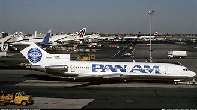
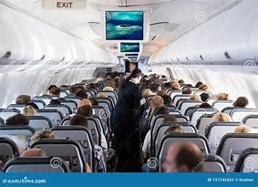
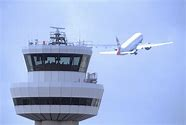

= step 2 - Lesson 08
:toc:

---

Lesson 8 +

== 1

Interviewer: We continue with the World of Investigation. Laura, an identical  完全同样的；相同的;（双胞胎）同卵的 twin 孪生儿之一；双胞胎之一, has agreed to contribute 增加；增进；添加（到某物） to our investigations. I must apologize for the fact that Laura's twin cannot be here tonight. And I'd like to tell you, Laura, how sorry we are. You and your sister are very close, aren't you? +

Laura: Of course we are. +

Interviewer: Interesting! You said 'of course'. Don't you think there are quite a few 相当多的，不少的 sisters who aren't close? +

Laura: Sarah and I aren't just sisters. We're identical twins. +

Interviewer: I take your point 接受某人的观点. How identical 完全同样的；相同的 are you, in fact? +

Laura: Both blonde  头发金黄的, with brown  棕色的；褐色的 eyes. Same height, same weight, same size. Even shoes. +

Interviewer: As you're the same size, have you always dressed alike? +

Laura: Oh yes. *I'm told* it started when we were babies. Mum made a feature  面容的一部分（如鼻、口、眼） of her twins. And then we *got into the habit of* buying two of everything. +

.案例
====
.I’m told
"I’m told" 是一个口语表达，用于表示某人告诉或告诉我。这是一个常见的语法结构，用来引出别人的观点、信息或说法。 +

另一种表达是 "I've been told"，表示过去某个时间点或一段时间内曾经被告知过某事。但在本文这种情况下，用 "I'm told" 更为自然，因为说话者是在引出别人的看法或信息，而不是强调自己曾经被告知的事情。
====

Interviewer: And you've never minded having a double identity  身份；本身；本体? I mean ... another person exactly like you? +

Laura: Sarah isn't exactly like me. We may look identical, but. I remember our boyfriends couldn't tell us apart. +

Interviewer: Didn't that cause problems? +

Laura: For them, perhaps. Not for us. We couldn't stop laughing. +

Interviewer: I think you said you and Sarah weren't exactly alike? Just what did you mean by that? +

Laura: Sarah has a well-fed 吃得好的,营养充足的 happy husband and four healthy children. When she was washing up 洗餐具；洗手洗脸, I was learning to type 打字. When she was knitting 编织；针织, I was writing articles for the school newspaper. When she was having her second child, I was in Panama, doing my first job for United Information Services. See what I mean 你明白我的意思了吗? +

Interviewer: And haven't you got a healthy husband and happy children? +

Laura: You must be joking. There's never been the time ... or the inclination 倾向；意愿;趋向；趋势. +

Interviewer: Laura, you've *made* some very interesting *points* 阐述观点. *I gather  认为；猜想；推断；理解 that* you don't feel that behaviour is purely genetic 基因的；遗传学的 ... that there might be some *element of environment* or choice or even perhaps ... +

Laura: Shall I conclude? Sarah and I are identical twins ... in appearance, that is ... but it's a fact that life has presented us with different opportunities, so we've led very different lives.

采访者：我们继续调查世界。劳拉是同卵双胞胎，她同意参与我们的调查。我必须为劳拉的双胞胎今晚不能来这里而道歉。劳拉，我想告诉你，我们非常抱歉。你和你姐姐很亲密，不是吗？ +

劳拉：我们当然是。 +

采访者：有趣！你说“当然”。你不觉得关系不太好的姐妹不少吗？ +

劳拉：莎拉和我不仅仅是姐妹。我们是同卵双胞胎。 +

采访者：我同意你的观点。事实上，你们有多相似？ +

劳拉：都是金发女郎，棕色眼睛。相同的身高、相同的体重、相同的尺寸。甚至鞋子。 +

采访者：由于你们体型相同，所以你们总是穿得一样吗？ +

劳拉：哦，是的。我听说它从我们还是婴儿的时候就开始了。妈妈给她的双胞胎做了一个特写。然后我们就养成了每样东西都买两件的习惯。 +

采访者：你从来不介意有双重身份？我的意思是……​另一个和你一模一样的人？ +

劳拉：莎拉和我不太一样。我们可能看起来很相似，但是。我记得我们的男朋友无法区分我们。 +

采访者：这没有带来问题吗？ +

劳拉：也许对他们来说。不适合我们。我们忍不住笑了。 +

采访者：我想你说过你和莎拉不完全一样？你这是什么意思？ +

劳拉：莎拉有一个吃饱喝足、幸福快乐的丈夫和四个健康的孩子。她洗碗的时候，我正在学打字。当她编织的时候，我正在为校报写文章。当她生第二个孩子时，我在巴拿马，为联合信息服务公司做我的第一份工作。明白了吗？ +

采访者：那你没有一个健康的丈夫和幸福的孩子吗？ +

劳拉：你一定是在开玩笑。从来没有时间……​也没有兴趣。 +

采访者：劳拉，你提出了一些非常有趣的观点。我猜你不认为行为纯粹是遗传的……​可能有一些环境或选择的因素，甚至可能……​ +

劳拉：我可以总结一下吗？莎拉和我是同卵双胞胎……从外表上看……但事实上，生活给了我们不同的机会，所以我们过着截然不同的生活。 +

---

== 2

Alan and Barbara have just read an article about twins and coincidences 巧合. They are discussing the article *over lunch* 在午餐期间. Listen to their discussion. +

Alan: That idea about our *genetic make-up*  组成成分；构成方式;性格；气质 is rather frightening 引起恐惧的；使惊恐的；骇人的, isn't it? +

.案例
====
.genetic make-up
遗传构成
====

Barbara: *Do you mean the idea that* because of our genetic make-up we are bound (a.)一定会；很可能会 to act in a particular way? +

Alan: Yes. If it's true, then it suggests that criminals  罪犯 are born (a.)天生（有某方面才能）的 and not made. +

Barbara: Not necessarily. It would only mean that somebody was born with the potential 可能性；潜在性 to become a criminal. +

Alan: How do you mean? +

Barbara: Well, if somebody was born with a particular set of genes 基因 that made him a potential criminal, it would be necessary for him to be brought up 抚养长大 in a particular way if he was actually going to become a criminal. +

Alan: He'd have to grow up in a family of criminals, you mean? +

Barbara: Yes, in the sort of family that *regarded* crime *as* a way of life and saw the police as the enemy. +

Alan: They say it *takes a thief to catch a thief* 用贼抓贼;以其人之道还制其人之身. +

Barbara: What do you mean by that? +

Alan: Well, I suppose （根据所知）认为，推断，料想 I mean that similar qualities are necessary to become a successful criminal or a first-class 第一流的；一级的；一等的；最优的 policeman. +

Barbara: That's a bit hard on the policeman, isn't it? +

Alan: I don't think so. In time of war /`主` men who might easily be in jail `谓` win medals 奖章；勋章 for gallantry （尤指在战场上）勇敢，英勇顽强. +

Barbara: That's because they're the sort of men who aren't satisfied with a normal everyday job. +

Alan: Yes, they're men who get bored with ordinary life and want action. They're usually pretty 十分；非常；极；很 strong characters, too.

艾伦和芭芭拉刚刚读了一篇关于双胞胎和巧合的文章。他们正在午餐时讨论这篇文章。听听他们的讨论。 +

艾伦：关于我们基因构成的想法相当可怕，不是吗？ +

芭芭拉：你的意思是说，由于我们的基因构成，我们注定会以特定的方式行事？ +

艾伦：是的。如果这是真的，那就表明罪犯是天生的，而不是后天养成的。 +

芭芭拉：不一定。这仅意味着某人生来就有成为罪犯的潜力。 +

艾伦：你这是什么意思？ +

芭芭拉：嗯，如果一个人生来就有一组特定的基因，使他成为潜在的罪犯，那么如果他真的要成为一名罪犯，就必须以特定的方式抚养他。 +

艾伦：你是说，他必须在一个犯罪家庭中长大？ +

芭芭拉：是的，在那种将犯罪视为一种生活方式并将警察视为敌人的家庭中。 +

艾伦：他们说贼要抓贼。 +

芭芭拉：你这是什么意思？ +

艾伦：嗯，我想我的意思是，要成为一名成功的罪犯或一流的警察，必须具备类似的品质。 +

芭芭拉：这对警察来说有点难，不是吗？ +

艾伦：我不这么认为。在战争时期，那些很容易入狱的人会因为英勇而获得奖章。 +

芭芭拉：那是因为他们是那种对正常的日常工作不满意的人。 +

艾伦：是的，他们是厌倦了平凡的生活并想要采取行动的人。他们通常也是非常坚强的角色。 +

---

== 3

Secretary: Mr. Turner's office. +

Caller 1: Hello. I'd like to speak to Mr. Turner, please. +

Secretary: I'm sorry, he's in a meeting right now. May I *take a message* 捎口信,代留言? +

Caller 1: Uh, yes. This is Mary Roberts from the First National Bank. (Mm-hmm.) Would you ask him to call me at 772-1852? +

Secretary: Okay. That's 772-18-? +

Caller 1: 52. +

Secretary: Okay. +

Caller 1: He can reach me at this number until, say, twelve thirty, or between two and five this afternoon. +

Secretary: That's fine, Ms Roberts. I'll tell him. I'll give him your message. +

Caller 1: Thank you very much. Goodbye. +

Secretary: Goodbye ... Mr. Turner's office. +

Caller 2: Yes. Hello. Is Mr. Turner in, please. +

Secretary: No, I'm sorry, he's in a meeting right now. May I take a message? +

Caller 2: This is Mr. Brown calling. I have *a lunch 午餐，午饭 appointment* 约会；预约；约定 with Mr. Turner for tomorrow noon that I have to cancel. I'm going to be out of town for a while. Would you offer my apologies to Mr. Turner and have him call me, please, to reschedule (v.)将…改期；修改…的时间表；重新安排? My number here is 7439821. +

Secretary: Okay, Mr. Brown. I'll make sure 确保 he gets the message. +

Caller 2: Thank you so much. +

Secretary: You're welcome. +

Caller 2: Bye-bye, now. +

Secretary: Bye-bye ... Mr. Turner's office. +

Caller 3: Hello, Jane. Is my husband in? +

Secretary: Oh, no, Mrs. Turner. I'm sorry. He's in a meeting until noon. +

Caller 3: Oh. +

Secretary: Oh, excuse me just a minute. I have another call. Can you hold for a second? +

Caller 3: Yes, sure. +

Secretary: Mr. Turner's office. Will you hold please? Hello, Mrs. Turner. Uh ... Would you like your husband to call you back? +

Caller 3: No. That's not necessary. But would you just tell him, please, that I won't be home until eight o'clock? I'll be working late. +

Secretary: Oh, sure. I'll tell him. +

Caller 3: Thanks a lot. Bye-bye. +

Secretary: Bye-bye. Thank you for holding. Uh ... Can I help you? +

Caller 4: Yeah. Hi. This is Wendy at *Travel Agents* International. Umm ... I've got Mr. Turner booked on a flight 航班飞机；班机 for Puerto Rico next Tuesday. Can you *take down* 记下,记录 the information? +

Secretary: Sure. +

Caller 4: Okay. It's Pan Am 泛美航空公司 Flight two twenty-six, which leaves Tuesday the twelfth at eight am. +

.案例
====
.Pan Am = Pan American World Airways
泛美航空公司. 1991年倒闭. 之后, 曾有两家公司以泛美航空的名义运作。三家泛美航空均无任何关联。 +

====

Secretary: Okay. That's *Pan Am Flight* two twenty-six, leaving Tuesday *the twelfth* 第十二的 at eight am 上午. +

Caller 4: Right. Umm ... I'll *send* the ticket *over* 发送过来 [later this afternoon], if that's okay. +

Secretary: Oh, sure. That'd be fine. +

Caller 4: Okay. Thanks lot. Bye. +

Secretary: Bye-bye ... Mr. Turner's office. +

Caller 5: Hello. Uh ... My name is Juan Salvador. I'm calling from Puerto Rico, and I want to speak to Mr. Turner. +

Secretary: I'm sorry, sir, Mr. Turner is in a meeting. May I take a message? +

Caller 5: I ... think it would be better if I ... uh ... call him later. Uh ... Will you please tell me when he's going to be free? +

Secretary: He'll be free in about an hour. +

Caller 5: Oh, thanks. Uh ... *Why don't you* 提建议 leave him a message saying that I called him and I will call him back? It's *in regard to* 关于；至于 our meeting on next Wednesday. +

.案例
====
.Why don't you ...?

[.small]
[options="autowidth" cols="1a,1a"]
|===
|Header 1 |Header 2

|常见的语义是 “建议对方做某事”。
|Why don't you (do)...? 这个说法比命令式的口气 (Do) it ! 婉转的多，是个非常好用的句式。

-  *Why don't you* try this jacket on? **这句话并不是质问对方**为什么不穿上夹克，**而是建议对方**试穿这件夹克。

注意: **如果要用 Why don't you ...? 作为 “建议对方做某事” 的意思，就不能改变这句话的时态和助动词以及它的的缩写模式。如果做了任何改变，意思就不再是 “建议对方做某事” 了，**例如：

时态、助动词都不能改变：

- Why didn't you ...?
- Why won't you ...?
- Why wouldn't you ...?
- Why aren't you ...?
- Why weren't you ...?
- How come you ...?

助动词 don't 的缩写不能改变：

- Why do you not ...?

主语 you 不能改变：

- Why doesn't Mary ...?

最后补充，唯一能替换的地方, 是将 you 换成 we （或者 I 也可以），不过用 we 就变成说话者自己也需要这么做了： +

*Why don't we* go to the lobby? 这个意思就差不多是 Let's go to the lobby, shall we? 或是 How about we go to the lobby?

|质问
|- *Why don't you* respect me? 你为什么不尊重我？ <- 这里就不是说话人向听者提出建议了， 不是“何不试试尊重我呢？”的意思.

如果你想想避免这种有歧义的句式, 可以用: +

（1）*把 Why 换成 How come*： 可以说 *How come* you don't respect me?  +

注意: Why 能在"口语"和"书面语"中, 都能用. +

但 How come 只能用在"口语"中, 不适合用于"书面语"。

（2）为了弥补 （1）的 How come 不正式、不能用于书面语的遗憾，*可以把 don't 拆开来*：说成 *Why do you not* respect me? 而且 “do/es [主语] not” 是非常正式的表达哟
|===

====

Secretary: Okay. Uh ... Could you give me your name again, please? +

Caller 5: Yes, of course. Juan Salvador. +

Secretary: Could you spell that, please? +

Caller 5: Yes. S-a-l-v-a. +

Secretary: Uh ... Excuse me, sir. I'm having trouble 在做某事方面遇到困难 hearing you. Could you repeat it, please? +

Caller 5: Yes, of course. S-a-l-v-a-d-o-r. +

Secretary: Thank you very much, Mr. Salvador. I'll give Mr. Turner the message. +

Caller 5: Oh, thank you very much. Bye-bye. +

Secretary: Bye-bye.

秘书：特纳先生的办公室。 +

来电者1：您好。我想和特纳先生通话。 +

秘书：对不起，他现在正在开会。我可以留言吗？ +

来电者 1： 呃，是的。我是第一国家银行的玛丽·罗伯茨。 （嗯嗯。） 你可以请他给我打电话772-1852吗？ +

秘书：好的。那是772-18-？ +

  来电者 1：52。 +

  秘书：好的。 +

呼叫者 1：他可以在十二点三十分或今天下午两点到五点之间通过这个号码联系我。 +

秘书： 没关系，罗伯茨女士。我会告诉他。我会把你的信息转达给他。 +

来电者1：非常感谢。再见。 +

秘书：再见……特纳先生的办公室。 +

来电者 2： 是的。你好。请问特纳先生在吗？ +

秘书： 不，抱歉，他现在正在开会。我可以留言吗？ +

来电者 2： 这是布朗先生打来的电话。我明天中午和特纳先生有一个午餐约会，但我不得不取消。我要出城一段时间。您能否向特纳先生表示歉意并请他给我打电话以重新安排时间？我的电话号码是 7439821。 +

秘书：好的，布朗先生。我会确保他收到消息。 +

来电者2：非常感谢。 +

秘书：不客气。 +

来电者 2：再见。 +

秘书：再见……特纳先生的办公室。 +

呼叫者 3：你好，简。我老公在吗？ +

秘书：哦，不，特纳夫人。对不起。他正在开会直到中午。 +

 来电者 3：哦。 +

秘书：噢，请稍等一下。我还有一个电话。你能坚持一下吗？ +

来电者 3： 是的，当然。 +

秘书：特纳先生的办公室。请问你会坚持吗？你好，特纳夫人。呃……​你想让你丈夫给你回电话吗？ +

来电者 3： 不，没必要。但你能告诉他我要到八点才能回家吗？我会工作到很晚。 +

秘书：哦，当然。我会告诉他。 +

来电者3：非常感谢。再见。 +

秘书：再见。谢谢你的坚持。呃……​我可以帮你吗？ +

来电者 4： 是的。你好。我是国际旅行社的温迪。嗯……我已经为特纳先生预订了下周二飞往波多黎各的航班。能把信息记下来吗？ +

  秘书：当然可以。 +

来电者 4：好的。泛美航空公司226航班，将于12号星期二早上8点起飞。 +

秘书：好的。那是泛美航空公司226航班，将于12号星期二早上8点起飞。 +

来电者4：对。嗯……如果可以的话，我会在今天下午晚些时候把票寄过去。 +

秘书：哦，当然。那就好了。 +

来电者 4：好的。非常感谢。再见。 +

秘书：再见……特纳先生的办公室。 +

呼叫者5：您好。呃……我的名字是胡安·萨尔瓦多。我从波多黎各打来电话，我想和特纳先生通话。 +

秘书：对不起，先生，特纳先生正在开会。我可以留言吗？ +

来电者 5：我……​认为如果我……呃……​稍后再给他打电话会更好。呃……你能告诉我他什么时候有空吗？ +

秘书：他大约一个小时后就有空。 +

来电者 5：噢，谢谢。呃……​你为什么不给他留言说我给他打过电话，我会给他回电话呢？这是关于我们下周三的会议。 +

秘书：好的。呃……​你能再告诉我你的名字吗？ +

来电者 5： 是的，当然。胡安·萨尔瓦多. +

秘书：请您拼写一下好吗？ +

来电者5：是的。 S-a-l-v-a。 +

秘书：呃……对不起，先生。我听不清你说话。请您重复一遍好吗？ +

来电者 5： 是的，当然。 S-a-l-v-a-d-o-r。 +

秘书：非常感谢您，萨尔瓦多先生。我会把消息转告特纳先生。 +

来电者 5：噢，非常感谢。再见。 +

  秘书：再见。 +

---

== 4. Night Flight +

'This is Captain Cook speaking. Our estimated 估计的，预计的 time of arrival in Brisbane will be one am, so we've got a long flight *ahead of us*. I hope you enjoy it. Our hostesses (聚会的) 女主人,女招待 will be serving dinner 中午或晚上吃的）正餐，主餐 shortly 不多时；不久. Thank you.' +

 +

It was Christmas Eve 1959, and the beginning of another routine 常规的；例行公事的；日常的 flight. The hostesses started preparing the food trays 盘；托盘；碟. A few of the passengers were trying to get some sleep, but most of them were reading. There was nothing to see from the windows except the vast 辽阔的；巨大的；庞大的；大量的 blackness 漆黑 of the Australian desert 沙漠；荒漠；荒原 below. There was nothing unusual about the flight, except perhaps that the plane was nearly full. A lot of the passengers were travelling home to spend Christmas with their families. The hostesses started serving dinner. +

 +

.案例
====
.tray

====

It was a smooth and quiet flight. The hostesses had finished collecting the trays, and they were in the galley （船或飞机上的）厨房 *putting things away* 把…收拾起来 when the first buzzers 蜂鸣器 sounded. One of the hostesses went along the aisle 走道，过道 to check. When she came back she looked surprised. 'It's amazing,' she said. 'Even on a smooth flight like this /two people have been sick.' +

 +

Twenty minutes later nearly half the passengers were ill — dramatically 剧烈地，明显地；戏剧性地，夸张地 ill. Several were moaning 呻吟 and groaning 呻吟；叹息；哼哼, some were *doubled 把…对折；折叠 up* （使）弯腰，弓身 in pain, and two were unconscious. Fortunately there was a doctor on board, and he was helping the hostesses. He came to the galley and said, 'I'd better speak to the captain. This is a severe case of food poisoning 中毒；服毒. I think we'd better land as soon as possible.' 'What caused it?' asked one of the hostesses. 'Well,' replied the doctor, 'I had the beef for dinner, and I'm fine. The passengers who chose the fish are ill.' The hostess led him to the *flight deck* （飞机的）驾驶舱. She tried to open the door. 'I think it's jammed 动弹不得；卡住了,' she said. The doctor helped her to push it open. The captain was lying behind the door. He was unconscious. The co-pilot was slumped （因睡着或昏迷等）弯着身子坐，伏;重重地坐下（或倒下） across the controls （机器或车辆的）操纵装置，开关，按钮, and the radio operator 无线电操作员 was trying to revive （使）苏醒，复活 him. +

 +

.案例
====
.moaning,  groaning  的区别是什么?
chatGpt: +

"Moaning" 和 "groaning" 都是表示声音或表达感觉的动词，但它们有一些不同之处：

- Moaning (呻吟): +

*"Moaning" 通常指的是因为疼痛、不适、疲惫或忧虑, 而发出的低声哼声或呻吟声。它可以表示身体或情感上的痛苦*。例如，一个人可能会在睡觉时发出呻吟声，因为他们做了一个不舒服的梦，或者一个受伤的人可能会因为疼痛而呻吟。

- Groaning (呻吟、抱怨): +

**"Groaning" 通常指的是发出深沉、有节奏或低沉的声音，通常是因为沮丧、不满、不耐烦或抱怨。这种声音通常是有意识的，表明一个人感到不满或厌烦。**例如，如果一个人对某个任务感到沮丧，他们可能会发出一些抱怨或不满的声音。

**总的来说，"moaning" 更倾向于表示身体或情感上的痛苦，而 "groaning" 更倾向于表示不满或抱怨。**然而，这两个词汇有时也可以根据语境而有所重叠。

.slump
(v.) [ + adv./prep.] to sit or fall down heavily 重重地坐下（或倒下）

.slumped
adj. ~ (against/over sth) sitting with your body leaning forward, for example because you are asleep or unconscious （因睡着或昏迷等）弯着身子坐，伏 +

====

The doctor quickly examined the two pilots. 'They just collapsed （尤指因病重而）倒下，昏倒，晕倒,' said the radio operator. 'I don't feel too good myself.' 'Can you land the plane?' said the doctor. 'Me? No, I'm not a pilot. We've got to revive them!' he replied. 'The plane's on automatic pilot  驾驶（飞行器）；领航（船只）. We're OK for a couple of hours.' 'I don't know,' said the doctor. 'They could be out 无知觉；昏迷'（表示不在原状态）脱离，离开 for a long time.' 'I'd better contact ground control,' said the radio operator. The doctor turned to the hostess. 'Perhaps you should make an announcement （一项）公告，布告，通告, try to find out if there's a pilot on board.' 'We can't do that!' she said, 'It'll cause *a general  全体的；普遍的；总的 panic* 惊恐；恐慌.' 'Well, *how the hell* （有人认为含冒犯意）该死，见鬼 are we going to get this thing down?' said the doctor. +

.案例
====
.*how the hell*  are we ...
chatGpt : +

在这句话中，**"hell" 是一个口语用语，用来强调或加强问句的情感强度。它常常用于表示不满、困惑、焦虑或愤怒，以表达说话者对某种情况或问题的强烈关切或困扰。**在这个句子中，*"how the hell"* 表示说话者对"how are we going to get this thing down?" 的问题感到非常困惑、焦虑或不满，似乎认为这是一个相当棘手或困难的问题。

这种用法是一种口语化的表达方式，通常用于非正式场合，以增加语句的情感色彩。其他类似的表达方式可能包括 **"what the hell"、"why the hell" **等，*它们都是为了在问题或情况前加入强烈情感。*
====

Suddenly the hostess remembered something. 'One of the passengers ... I overheard 偶尔听到；无意中听到；偷听 him saying that he'd been a pilot in the war. I'll get him.' She found the man and asked him to come to the galley. 'Didn't you say you used to be a pilot?' she asked. 'Yes ... why? The pilot's all right, isn't he?' She led him to the flight deck. They explained the situation to him. 'You mean, you want me to fly the plane?' he said. 'You must be joking. I was a pilot, but I flew single-engined fighter planes, and that was fifteen years ago. This thing's got four engines!' +

 +

'Isn't there anybody else?' he asked. 'I'm afraid not,' said the hostess. The man sat down at the controls. His hands were shaking slightly. The radio operator connected him to Air Traffic Control. They told him to keep flying on automatic pilot towards Brisbane, and to wait for further instructions from an experienced pilot. *An hour later* the lights of Brisbane *appeared on the horizon*. He could see the lights of the runway *shining brightly beyond the city*. Air Traffic Control told him to keep circling 盘旋，绕轨道运行 until the *fuel gauge* (测量仪器（或仪表）；计量器) 燃油表 registered (v.)显示（读数）；记录 almost empty. This gave him a chance *to get used to* 逐渐习惯于；适应 handling the controls.

In the cabin （飞机的）座舱 the hostesses and the doctor were busy *attending 处理；对付；照料；关怀 to* the sick. Several people were unconscious. The plane circled for over half an hour. The passengers had begun to realize that something was wrong. 'What's going on? Why don't we land?' shouted a middle aged man. 'My wife's ill. We've got to get her to hospital!' A woman began sobbing  抽噎 quietly. At last the plane started its descent (n.)下降；下倾. Suddenly there was a bump 碰撞（声）；撞击（声） which shook the plane. 'We're all going to die!' screamed a man. Even the hostesses looked worried as panic began to spread through the plane. 'It's all right!' someone said. 'The pilot's just lowered (v.)把…放低；使…降下 the wheels 车轮；轮子, that's all.'

.案例
====
.cabin
one of the areas for passengers to sit in a plane （飞机的）座舱 +

====

As the plane approached （在距离或时间上）靠近，接近 the runway they could see fire trucks and ambulances *speeding (v.)快速前行; 超速驾驶；超速行驶 along beside the runway* with their lights flashing. There was a tremendous  巨大的；极大的 thump 重击；狠打；（尤指用拳）捶击;（使）撞击，嘭地发出闷响 as the wheels hit the tarmac 以柏油碎石铺筑（路面）, bounced (v.)（使）弹起，弹跳；反射 twice, *raced (v.)（使）快速移动，快速运转 along the runway* and *screeched  (v.)(车辆轮胎摩擦路面而) 发嘎吱声 to a halt*. The first airport 航空站；航空港；机场 truck was there *in seconds* 在几秒钟内. 'That was nearly a perfect landing. Well done!' shouted the *control tower* （机场的）指挥塔台，控制塔，指挥调度台. 'Thanks,' said the man. 'Any chance of a job?'

.案例
====
.tarmac

.control tower

====

夜间飞行 +

“这是库克船长在讲话。我们预计抵达布里斯班的时间是凌晨 1 点，所以我们还有一段长途飞行。我希望你喜欢它。我们的女主人很快就会准备晚餐。谢谢。' +

那是 1959 年的圣诞节前夕，也是另一次例行飞行的开始。女主人开始准备餐盘。一些乘客想睡觉，但大多数人都在看书。从窗户里看不到任何东西，除了下面澳大利亚沙漠的广阔黑暗之外。这次飞行并没有什么异常，除了飞机几乎满员之外。许多乘客正在回家与家人一起度过圣诞节。女主人开始准备晚餐。 +

这是一次平稳而安静的飞行。女服务员们已经收拾好了托盘，当第一声蜂鸣器响起时，她们正在厨房里收拾东西。一位女主人沿着过道去查看。当她回来时，她显得很惊讶。 “太棒了，”她说。 “即使是在这样顺利的航班上，两个人还是生病了。” +

二十分钟后，近一半的乘客病了——病得很重。有几个人在呻吟，有些人痛苦地弯下腰，还有两个人失去知觉。幸运的是，船上有一名医生，他正在帮助女主人。他来到厨房说：“我最好和船长谈谈。”这是一起严重的食物中毒事件。我认为我们最好尽快着陆。” “是什么造成的？”一位女主人问道。 “嗯，”医生回答道，“我晚餐吃了牛肉，我很好。”选择这些鱼的乘客病了。”女主人领着他来到了驾驶舱。她试图打开门。 “我认为它被卡住了，”她说。医生帮她把它推开。船长躺在门后。他失去知觉了。副驾驶倒在了驾驶台上，无线电操作员正试图让他苏醒。 +

医生迅速对两名飞行员进行了检查。 “他们就这样倒塌了，”无线电操作员说。 “我自己感觉不太好。” “你能让飞机降落吗？”医生说。 '我？不，我不是飞行员。我们必须让他们复活！他回答。 “飞机处于自动驾驶状态。我们几个小时都没事。” “我不知道，”医生说。 “他们可能会缺席很长一段时间。” “我最好联系地面控制人员，”无线电操作员说。医生转向女主人。 “也许你应该发布公告，尝试查明机上是否有飞行员。” “我们不能那样做！”她说，“这会引起普遍的恐慌。” “那么，我们到底要怎样才能把这东西弄下来呢？”医生说。 +

突然，女主人想起了什么。 “其中一名乘客……我无意中听到他说他曾在战争中当过飞行员。我会去找他的。她找到了那个男人并请他到厨房来。 “你不是说你曾经是一名飞行员吗？”她问。 “是的……​为什么？飞行员没事吧？她把他带到了驾驶舱。他们向他解释了情况。 “你的意思是，你想让我驾驶飞机？”他说。 '你一定是在开玩笑。我是一名飞行员，但我驾驶的是单引擎战斗机，那是十五年前的事了。这东西有四个引擎！ +

“没有其他人了吗？”他问。 “恐怕不行，”女主人说。那人在控制台旁坐下。他的双手在微微颤抖。无线电操作员给他接通了空中交通管制。他们告诉他继续使用自动驾驶仪飞往布里斯班，并等待经验丰富的飞行员的进一步指示。一小时后，布里斯班的灯光出现在地平线上。他可以看到跑道上的灯光在城市之外闪闪发光。空中交通管制告诉他继续盘旋，直到燃油表显示几乎空了。这给了他一个习惯操作控制的机会。船舱里，女主人和医生正忙着照顾病人。几个人都昏迷不醒。飞机盘旋了半个多小时。乘客们开始意识到有些不对劲。 '这是怎么回事？我们为什么不着陆？一名中年男子喊道。 “我妻子病了。我们必须送她去医院！”一个女人开始小声抽泣。飞机终于开始下降。突然，一阵颠簸使飞机摇晃起来。 “我们都会死！”一个男人尖叫道。随着恐慌开始在飞机上蔓延，就连空姐们也显得很担心。 '没关系！'有人说。 “飞行员只是放下了轮子，仅此而已。”当飞机接近跑道时，他们看到消防车和救护车在跑道旁边飞驰，灯光闪烁。当车轮撞上停机坪时，发出一声巨大的撞击声，弹跳了两次，沿着跑道飞驰，然后嘎吱嘎吱地停了下来。第一辆机场卡车几秒钟就到了。 “这几乎是一次完美的着陆。做得好！'控制塔喊道。 “谢谢，”那人说。 “有工作机会吗？” +

---

== 5

1. Thousands of people *die of heart attacks* every year; heart disease is becoming *so* widespread *that* we can almost talk of an epidemic. +

2. That is, people with heart disease often show one or more of these traits  （人的个性的）特征，特性，特点. +

3. The answer is, *a person's personality 性格；个性；人格 determines (v.) 决定；形成；支配；影响 that* he or she will be likely to develop this illness. +

4. They set themselves unrealistic goals and force themselves to meet impossible deadlines. +

5. Eventually 最后；终于 `主`  their responses to life `系` become less creative 创造（性）的；创作的, more automatic, and `主` all of their activities are performed under stress. +

6. In the past, men have tended to show Type A behaviour more than women have, but with an increasing number of women entering the labour force, this also may change. +

7. Stress seems to be caused by our highly technical, highly rushed 仓促而就的；草率的 modern way of life. +

8. Now it is not uncommon for a sixty or fifty or even a forty-year-old to suffer a heart attack. +

9. Too *preoccupied (a.)全神贯注于;心事重重；一门心思 with* his own schedule 工作计划；日程安排, he has little capacity to *concentrate on* what other people are saying — unless 除非, of course, they are talking about work. +

10. When he returns to work, he finds that `主` the leisure time of the night before `谓` has helped him find a creative solution to his work problems.

每年有数千人死于心脏病；心脏病变得如此普遍，以至于我们几乎可以说是一种流行病。 +

也就是说，患有心脏病的人经常表现出这些特征中的一种或多种。 +

答案是，一个人的性格决定了他或她有可能患上这种疾病。 +

他们给自己设定了不切实际的目标，并强迫自己在不可能的期限内完成任务。 +

最终，他们对生活的反应变得不那么有创造力，更加自动化，他们的所有活动都是在压力下进行的。 +

过去，男性比女性更倾向于表现出 A 型行为，但随着越来越多的女性进入劳动力市场，这种情况也可能会改变。 +

压力似乎是由我们高度技术化、高度匆忙的现代生活方式造成的。 +

现在，六十岁、五十岁甚至四十岁的人患心脏病已是屡见不鲜。 +

由于过于专注于自己的日程安排，他几乎没有能力关注其他人在说什么——当然，除非他们在谈论工作。 +

当他回到工作岗位时，他发现前一天晚上的闲暇时间帮助他找到了解决工作问题的创造性方法。 +

---

== 6 The Boy Who Cried 喊叫；呼喊；呼叫 Wolf +

Once upon a time there was a very naughty 顽皮的；淘气的；不听话的 shepherd 牧羊人；羊倌 boy. He often fell asleep while he was watching his sheep. And he told lies. The villagers shook their heads and said, 'That boy will *come to a bad end*.' +

 +

One day, when he was feeling very bored, the boy decided to play a *practical  实际的；真实的；客观存在的 joke* 恶作剧；捉弄人的把戏 on the villagers. He ran down the hill. 'Wolf, wolf!' he cried. 'Help, come quickly. Wolf!' All the villagers seized their spears  矛；标枪 and ran to help him. But there was no wolf. 'He heard you,' the naughty boy lied, 'and ran away.' When everyone had gone, he started to laugh. +

 +

Three weeks later, when he was feeling very bored indeed, he decided to play the same trick again. 'Wolf, wolf!' he shouted. 'Help, come quickly. Wolf!' Most of the villagers hurried to help him. This time the boy laughed at them. 'Ha, ha. There wasn't a wolf,' he said. 'What a good joke!' The villagers were very angry. 'Lies are not jokes,' they said. +

 +

Two days later the boy woke up suddenly. He had fallen asleep in the afternoon sun. What was that *big dark animal* coming towards his flock （羊或鸟）群? Suddenly it seized a lamb. 'Wolf!' screamed （因伤痛、害怕、激动等）尖叫 the boy. 'Wolf. Help, come quickly. Wolf!' But none of the villagers came to help him. He screamed again. The wolf heard him and *licked 舔 its lips* 嘴唇. 'I like lamb,' it thought, 'but shepherd boy tastes much nicer.' +

 +

When the shepherd boy didn't come home that night, some of the villagers went to look for him. They found a few bones.

狼来了的男孩 +

从前，有一个非常顽皮的牧童。他常常在看着羊群时睡着了。他还撒谎了。村民们纷纷摇头说道：“这孩子的下场不会太好。” +

有一天，当他感到非常无聊时，男孩决定对村民们开一个恶作剧。他跑下山。 “狼，狼！”他哭了。 ‘救命啊，快点过来。狼！'村民们纷纷拿起长矛，跑去帮助他。但没有狼。 “他听到了你的声音，”顽皮的男孩撒谎道，“然后就跑掉了。”当所有人都走了之后，他开始大笑。 +

三周后，当他确实感到非常无聊时，他决定再玩同样的把戏。 “狼，狼！”他喊道。 ‘救命啊，快点过来。狼！'大多数村民赶紧上前帮助他。这次男孩嘲笑他们。 '哈哈。没有狼，”他说。 “多好的笑话啊！”村民们非常愤怒。 “谎言不是笑话，”他们说。 +

两天后，男孩突然醒来。他在午后的阳光下睡着了。那个向他的羊群走来的黑色大动物是什么？突然，它抓住了一只小羊。 '狼！'男孩尖叫道。 '狼。帮忙，快点来。狼！'但没有一个村民来帮助他。他再次尖叫起来。狼听到了他的话，舔了舔嘴唇。 “我喜欢羊肉，”它想，“但是牧童的味道更好。” +

那天晚上，牧童没有回家，一些村民就去找他。他们发现了一些骨头。

---
