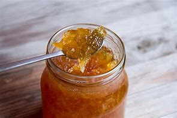
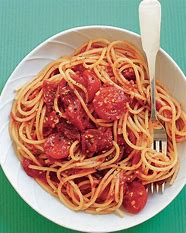
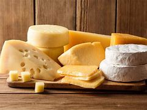
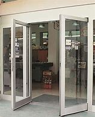
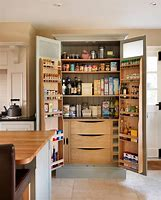

= step 2 - Lesson 11
:toc: left
:toclevels: 3
:sectnums:
:stylesheet: ../../+ 000 eng选/美国高中历史教材 American History ： From Pre-Columbian to the New Millennium/myAdocCss.css

'''

Lesson 11

== 1

Doctor: Well Mr. Thomson. The first and important thing I have to tell you is that ... mm ... there is really nothing seriously wrong with you ... physically 身体上；肉体上 that is. My ... er ... my very thorough 彻底的；完全的；深入的；细致的 re-examination 复查 and the ... the analyst's report show that basically you are very fit 健康的，健壮的. Yes ... very fit.

Mr. Thomson: So ... Why is it doctor that I'm always so nervy 焦虑的；紧张的 ... tense (人) 紧张的; (肌肉) 紧绷的  ... ready to *jump on* (突然或猛烈地)训斥或攻击 anybody — my wife, children, colleagues 同事?

[.my1]
====
.nervy  和 tense 的区别
chatGpt:

"Nervy" 和 "tense" 都是用来描述人的情绪或状态的词汇，但它们之间有一些区别：

1."Nervy"（紧张的、不安的）： +
"Nervy" 通常指的是一种紧张、焦虑或不安的情绪，但它可能伴随着一种兴奋或不安定感。当你感到紧张但也有一种兴奋或胆量时，可以使用 "nervy" 这个词。 +
例如：_She felt nervy_ before her big presentation 展示会；介绍会；发布会;（戏剧等的）上演，演出, but she knew she could do it.
"Tense"（紧张的、绷紧的）：

2."Tense" 指的是一种紧张、绷紧或焦虑的状态，通常与情绪的紧张有关。这种状态可能是由压力、焦虑、不安或担忧引起的。 +
例如：*The atmosphere in the room was tense* as they waited for the test results.

总之，**"nervy" 通常**表示紧张情绪**伴随着一些兴奋**或不安定感，*而 "tense"* 更侧重于描述一种紧张或绷紧的状态，*通常与焦虑或紧张有关，而不一定伴随着兴奋。**
====

Doctor: I think ... erm ... I think your condition (尤指健康) 状况 *has a lot to do with* 与…关系密切,与…有很大关系 er — What shall we call it?  — Way of life? Habits?

Mr. Thomson: Way of life? Habits?

Doctor: Yes ... now tell me Mr. Thomson ... You smoke, don't you?

Mr. Thomson: Yes ... I'm afraid ... I'm afraid I do, doctor.

Doctor: And ... er ... *rather （常用于表示轻微的批评、失望或惊讶）相当，在某种程度上 heavily* I imagine 误以为；胡乱猜想；猜测.

Mr. Thomson: Well ... yes. I smoke — what ... about forty ... fifty a day I suppose.

Doctor: You should *do your best* to stop, you know.

Mr. Thomson: Yes ... I see ... But er ... Well ... it won't be the first time. I've tried to give up smoking several times but it's ... it's no good.

Doctor: You see ... fifty a day is overdoing it ... you must admit. You must cut it down 减少；削减 ... at least that. Oh yes. I know that when you're feeling tense /you ... you probably feel that a cigarette relaxes you. But *in the long run* 从长远来看,终究,最后 ... I do advise you to make ... to make a real effort.

Mr. Thomson: Of course. But ... well ... it's easy to say give it up or cut it down ... but ... oh you know ...

Doctor: Well in my opinion you have no choice. Either you make a real effort or ... or *there's no real chance 真正的机会 of* your feeling better. You see ... well obviously I could prescribe 给…开（药）；让…采用（疗法）；开（处方） some kind of tranquillizer  安定药；镇静剂 ... but would that help? I'd prefer — and I'm quite sure you'll agree — I'd prefer to see you really back to normal ... not just seemingly so. And that's my reason *for* asking you several more questions about ... about your other habits.

Mr. Thomson: Right.

[.my1]
====
.reason
(n.) ~ (why...)~ (that...)~ (*for sth/for doing sth*)a cause or an explanation for sth that has happened or that sb has done 原因；理由；解释 +
- people who,** for whatever reason** , are unable to support themselves 那些**因为种种原因**不能自立的人
====

Doctor: Your *eating habits* 饮食习惯 for example. What do you eat normally ... during a normal day?

Mr. Thomson: Yes ... well ... I'm a good eater. Yes, I'd say I'm a good eater. Now let's see ... Up 未上床；起床 at eight in the morning and my wife has a good breakfast ready.

Doctor: A good breakfast?

Mr. Thomson: The usual. A cereal （常加牛奶作早餐用的）谷类食物 followed by bacon and eggs with fried bread 炸面包 and perhaps a tomato 番茄，西红柿 or two. Then toast and marmalade 橘子酱；酸果酱... all *washed down* (以水或者饮料) 冲咽 with a couple of cups of tea. I er ... yes ... I really enjoy my breakfast.

[.my1]
====
.marmalade
jam/jelly made from oranges, lemons, etc., eaten especially for breakfast 橘子酱；酸果酱 +
-> 词源同melon.用于指一种嫁接苹果树的橘子树。-ade,酱，汁，词源同lemonade. +

====

Doctor: Er ... yes ... I can see you do. But I'd advise you to eat rather less. We'll come to that later. Go on.

Mr. Thomson: Then lunch ... no, first brunch 早午餐. A cup of coffee and a bun  小圆面包 at eleven. Lunch 午餐 has to be quick because there's so much to do in the office about that time. So I have a pint  一品脱啤酒（尤用于酒吧） and a sandwich in the pub. All very hurried.

Doctor: Try to be in less of a hurry.

[.my1]
====
.brunch
N-VAR Brunch is a meal that is eaten in the late morning. It is a combination 混合物 of breakfast and lunch. 早午餐 +
早午餐 brunch，即breakfast（早餐）加上lunch（午餐）的合成词. 

早午餐并不是每天都有，通常只有在周日才吃，就餐时间也比平时来得长，通常由上午10时至下午3时，这类餐厅往往突出休闲、温馨的主题，所以老外们常常把它叫做“sundaybrunch”（星期天早午餐）。 +
相比于传统的早餐和午餐，早午餐的时间更加宽松，可以让人们在上午稍晚一些的时间享用丰盛的餐点，而不必为早起准备早餐或者为午餐找时间。

.bun
image:../img/bun.jpg[,10%]
====

Mr. Thomson: But I *make up for* 弥补；补偿；抵消 it in the evening. I get home at about seven. Dinner's （中午或晚上吃的）正餐，主餐 round about eight. Er ... yes ... My wife's an excellent cook 厨师 ... excellent. It's usually some *meat dish* (一道菜；菜肴)肉菜,荤菜... and we like spaghetti 意大利细面条 as a first course 一道菜. Spaghetti, a meat dish, cheese, a sweet. But er ... but then ... at the end of the day shall we say ... then ... well then I begin to feel *on edge* 紧张不安；激动；烦躁 again. Most evenings after dinner we read or watch TV ... but I ... I get this terrible feeling of tension.

[.my1]
====
.make ˈup for sth
弥补；补偿 +
- Nothing can *make up for* the loss of a child. 失去一个孩子是任何东西都无法弥补的

.make ˈup (to sb) for sth  
（对某人）表示歉意，给以补偿  +
- *I'll make it up to you* , I promise. 我保证我一定会补偿你的。 +
- *How can I make up for* the way I've treated you? 我这样对你，该怎么向你表示歉意呢？

.spaghetti

.cheese

.be on ˈedge
to be nervous, excited or bad-tempered 紧张不安；激动；烦躁
====

Doctor: Well ... I'm sorry to have to say this because you obviously enjoy your food ... but ... er ... I really do recommend  劝告；建议 that you ... that you eat less and — secondly — that you eat more healthily. Instead of having that enormous breakfast for example ... er ... well ... try to be content with a fruit juice and some cereal.

Mr. Thomson: I see ... but er ...

Doctor: Elevenses ... right ... well that's all right. But lunch should be more leisurely 不慌不忙的；慢悠悠的. Remember your health is *at stake* 成败难料；得失都可能；有风险 not your job. As for dinner ... er ... I'd advise you to eat a soup perhaps ... with a salad ... a salad followed by some fruit.

[.my1]
====
.stake
*~ in sth.* an important part or share in a business, plan, etc. that is important to you and that you want to be successful （在公司、计划等中的）重大利益，重大利害关系 +
- *She has a personal stake* in the success of the play. 这出戏成功与否对她个人有重大利害关系。
====

Mr. Thomson: But my wife's cooking ...

Doctor: ... is superb  极佳的；卓越的；质量极高的. Granted （表示肯定属实，然后再作另一番表述）不错，的确. And she probably enjoys preparing delicious meals for you. If you like ... well ... er ... I'll have a word with 与某人简短交谈 your wife ...

Mr. Thomson: No ... that won't be necessary ... erm ... thanks *just the same* 无论如何；依然;然而, doctor. But no ...

Doctor: And on that subject Mr. Thomson ... erm ... er ... Just one other thing ... er ... I'm sure this won't embarrass you. You say you feel tense in the evenings after dinner. Might I ask about your relationship — your sexual relationship that is — with your wife?

Mr. Thomson: Well ... erm ... er ... you see ... er ...

[.my2]
==== 
医生：嗯，汤姆森先生。我要告诉你的第一件重要的事情是……嗯……你真的没有什么严重的问题……身体上就是这样。我的……呃……我非常彻底的重新检查和……分析师的报告表明，基本上你非常适合。是的……​非常合适。 +
汤姆森先生：那么……医生，为什么我总是那么紧张……紧张……准备好扑向任何人——我的妻子、孩子、同事？ +
医生：我觉得……呃……我觉得你的情况和呃——我们该怎么称呼它有很大关系？ - 生活方式？习惯？ +
汤姆森先生：生活方式？习惯？ +
医生：是的……现在告诉我汤姆森先生……你抽烟，不是吗？ +
先生。汤姆森：是的...我担心...我担心，医生。 +
医生：而且……呃……我想相当严重。 +
汤姆森先生：嗯……是的。我抽烟——我想每天大约四十支……五十支。 +
医生：你应该尽力停止，你知道的。 +
汤姆森先生：是的……我明白了……但是呃……嗯……这不是第一次。我曾多次尝试戒烟，但……​这没有什么好处。 +
医生：你看……每天五十已经太过分了……你必须承认。你必须把它砍掉……至少如此。哦是的。我知道，当您感到紧张时，您可能会觉得抽烟可以让您放松。但从长远来看……我确实建议你……做出真正的努力。 +
汤姆森先生：当然。但是……嗯……很容易说放弃或减少……但是……哦你知道……​ +
医生：嗯，我认为你别无选择。要么你做出真正的努力，要么……​或者你根本没有机会感觉好起来。你看……显然我可以开某种镇静剂……但这有帮助吗？我更愿意——而且我很确定你会同意——我更愿意看到你真正恢复正常……而不只是看起来如此。这就是我问你几个关于……关于你的其他习惯的问题的原因。 +
汤姆森先生：是的。 +
医生：比如你的饮食习惯。平常的一天你通常吃什么？ +
汤姆森先生：是的……嗯……我吃得很好。是的，我想说我是一个很好吃的人。现在让我们看看……早上八点起床，我妻子已经准备好了丰盛的早餐。 +
医生：早餐好吃吗？ +
汤姆森先生：平常的。麦片，然后是培根、鸡蛋和炸面包，也许还有一两个西红柿。然后是烤面包和果酱......全部用几杯茶冲下去。我呃……是的……我真的很喜欢我的早餐。 +
医生：呃……是的……我可以看到你这样做。但我建议你少吃一点。我们稍后会讨论这个问题。继续。 +
汤姆森先生：然后是午餐……​不，是第一顿早午餐。十一点喝一杯咖啡，吃一个面包。午餐必须快点，因为这段时间办公室里有很多事情要做。所以我在酒吧喝了一品脱啤酒和一个三明治。一切都非常匆忙。 +
医生：尽量别着急。 +
汤姆森先生：但是我会在晚上补上。我七点左右到家。晚餐大约八点左右。呃……是的……我妻子是一位出色的厨师……非常棒。通常是一些荤菜……​我们喜欢意大利面作为第一道菜。意大利面、荤菜、奶酪、甜点。但是呃……但是……最终我们应该说……然后……然后我又开始感到紧张了。大多数晚上晚饭后我们都会读书或看电视……但我……我有一种可怕的紧张感。 +
医生：嗯……我很抱歉不得不这么说，因为你显然很喜欢你的食物……但是……呃……我真的建议你……少吃一点，其次——吃得更健康。例如，不要吃丰盛的早餐……呃……好吧……尝试满足于果汁和一些麦片。 +
汤姆森先生：我明白了……​但是呃……​ +
医生：十一……对……好吧，没关系。但午餐应该更悠闲一些。请记住，您的健康受到威胁，而不是您的工作。至于晚餐……呃……我建议你也许吃汤……搭配沙拉……沙拉，然后是一些水果。 +
汤姆森先生：但是我妻子做饭……​ +
医生：……太棒了。的确。她可能喜欢为你准备可口的饭菜。如果你喜欢……​好吧……​呃……​我会和你的妻子谈谈……​ +
汤姆森先生：不……没有必要……呃……还是谢谢你，医生。但没有……​ +
医生：关于这个话题，汤姆森先生……呃……呃……只是另一件事……呃……我相信这不会让你感到尴尬。你说你晚上吃完晚饭后感到紧张。我可以问一下你和你妻子的关系——也就是你的性关系吗？ +
汤姆森先生：嗯……呃……呃……你看……呃……​ +
====

---

== 2

(Do It Yourself magazine organizes a competition every summer to find the 'Handyman 善于做室内外杂活的人；杂活工 of the Year'. The winner this year is Mr. Roy Miller, a Sheffield 英国城市名 postman. A journalist and a photographer have come to his house. The journalist is interviewing Mr. Miller for an article in the magazine.)

Journalist: Well, I'm very impressed by all the work you've done on your house, Mr. Miller. How long have you been working on it?

Mr. Miller: I first became interested in do-it-yourself several years ago. You see, my son Paul is disabled 丧失能力的；有残疾的；无能力的. He's in a wheel-chair and I just had to make alterations 改变；更改；改动 to the house. I couldn't afford to pay workmen to do it. I had to learn to do it myself.

Journalist: Have you had any experience of this kind of work? Did you have any practical skills?

Mr. Miller: No. I got a few books from the library but they didn't help very much. Then I decided to go to evening classes so that I could learn basic carpentry  木工；木工工艺；木匠活 and electrics （房屋、汽车或机器的）电力系统，电路.

[.my1]
====
.electrics

====

Journalist: What sort of changes did you make to the house?

Mr. Miller: First of all, practical 切实可行的;有用的；适用的 things to help Paul. You never really realize the problems handicapped  有生理缺陷的；残疾的；弱智的 people have /until it affects your own family. Most government buildings, for example, have steps up to the door. They don't plan buildings so that disabled people can get in and out. We *used to* 指过去惯常做某事，而现在则不了 live in a flat, and of course, it was totally unsuitable. Just imagine the problems a disabled person would have in your house. We needed a large house with wide corridors so that Paul could get from one room to another. We didn't have much money and we had to buy this one. It's over ninety years old and it was in a very bad state of repair.

[.my1]
====
.不要混淆 used to do sth 与 be used to sth :

[.my3]
[options="autowidth" cols="1a,1a"]
|===
|Header 1 |Header 2

|used to do sth  过去惯常做某事，而现在则不了
|You use *used to do sth* to talk about something that happened regularly or was the case in the past, but is not now. used to do sth 指**过去惯常做某事，而现在则不了**：

• *I used to smoke*, but I gave up a couple of years ago. 我以前抽烟，但几年前就戒掉了。

|be used to sth /或 get used to sth : 习惯于、适应于
|You use *be used to sth/to doing sth* to talk about something that you are familiar with so that it no longer seems new or strange to you. be used to sth/to doing sth 指**习惯于、适应于**：

• *We're used to the noise* from the traffic now. 现在我们**已经适应**车辆往来的噪音了。

• *I'm used to* getting up early. 我习惯早起。

You can also use *get used to sth* . 亦可用 get used to sth：

• Don't worry — *you'll soon get used to* his sense of humour. 别担心，你不久就会**适应**他的幽默感。

• I didn't think *I could ever get used to* living in a big city after living in the country. 我觉得我在农村住了之后就无法**适应**大城市的生活了。
|===

====

Journalist: Where did you begin?

Mr. Miller: The electrics. I completely rewired 给（建筑物或设备）换新电线 the house so that Paul could reach all the switches. I had to lower the light switches 电灯开关 and raise the power-points 电源插座. I went on to do the whole house so that Paul could reach things and go where he wanted.

Journalist: What else did you do?

Mr. Miller: By the time I'd altered everything for Paul, do-it-yourself had become a hobby  业余爱好. I really enjoyed doing things with my hands. Look, I even installed smoke-alarms.

Journalist: What was the purpose of that?

Mr. Miller: I was very worried about fire. You see, Paul can't move very quickly. I fitted 安置，安装（在某处） them so that we would have plenty of warning if there were a fire. I put in a complete 全部的；完整的；整个的 burglar-alarm 破门盗贼；入室窃贼 system. It took weeks. The front door opens automatically, and I'm going to *put* a device 装置；仪器；器具；设备 *on* Paul's wheelchair so that he'll be able to open and close it when he wants.

Journalist: What are you working on now?

Mr. Miller: I've just finished the kitchen. I've designed it so that he can reach everything. Now I'm building an extension  增加的房间;扩建部分；增建部分 so that Paul will have a large room on the ground floor where he can work.

Journalist: There's a ￡10,000 prize. How are you going to spend it?

Mr. Miller: I am going to start my own business so that I can convert ordinary houses for disabled people. I think I've become an expert on the subject.

[.my2]
==== 
（《Do It Yourself》杂志每年夏天都会举办一场评选“年度杂工”的比赛。今年的获胜者是谢菲尔德邮递员罗伊·米勒先生。一位记者和一位摄影师来到他家。记者正在采访罗伊·米勒先生。 .米勒在杂志上发表的一篇文章。） +
记者：嗯，米勒先生，您在房子上所做的所有工作给我留下了深刻的印象。您从事这方面工作多久了？ +
米勒先生：几年前我第一次对自己动手感兴趣。你看，我的儿子保罗是残疾人。他坐在轮椅上，我只需要对房子进行改造。我付不起工人的钱来做这件事。我必须学会自己做。 +
记者：您有过这样的工作经历吗？你有什么实用技能吗？ +
米勒先生：没有。我从图书馆借了几本书，但没什么帮助。然后我决定去上夜校，这样我就可以学习基本的木工和电工。 +
记者：你对房子做了哪些改造？ +
米勒先生：首先，要帮助保罗做一些实际的事情。你永远不会真正意识到残疾人所面临的问题，直到它影响到你自己的家人。例如，大多数政府大楼都有通往门口的台阶。他们没有规划建筑物以便残疾人可以进出。我们以前住在公寓里，当然完全不合适。想象一下残疾人在您家中会遇到的问题。我们需要一座有宽阔走廊的大房子，以便保罗可以从一个房间到另一个房间。我们没有多少钱，只好买这个。它已有九十多年的历史，而且维修状况非常糟糕。 +
记者：从哪里开始呢？ +
米勒先生：电气。我彻底重新布置了房子的线路，以便保罗能够接触到所有的开关。我不得不降低电灯开关并提高电源点。我继续清理整个房子，这样保罗就可以够到东西并去他想去的地方。 +
记者：你还做了什么？ +
米勒先生：当我为保罗改变一切时，自己动手已经成为一种爱好。我真的很喜欢用手做事。看，我什至安装了烟雾警报器。 +
记者：这样做的目的是什么？ +
米勒先生：我非常担心火灾。你看，保罗动作不快。我安装了它们，这样如果发生火灾我们就能收到足够的警告。我安装了完整的防盗报警系统。这花了几个星期的时间。前门会自动打开，我将在保罗的轮椅上安装一个装置，以便他可以在需要时打开和关闭它。 +
记者：你现在在做什么工作？ +
米勒先生：我刚刚整理完厨房。我的设计是为了让他能够触及一切。现在我正在扩建，以便保罗在一楼有一个大房间可以在那里工作。 +
记者：有1万英镑的奖金。你准备怎么花呢？ +
米勒先生：我要自己创业，为残疾人改造普通房屋。我想我已经成为这方面的专家了。

====

---

== 3

The first job *I ever had* was as a waitress. I did it the summer before I started at university, when I was eighteen. I was working in a very nice hotel in a small town in Scotland where there are a lot of tourists in the summer so they were *taking on* 聘用 extra staff. I arrived there in the evening and met some of the other girls who were working at the hotel — we all lived in a little house opposite the hotel. Anyway, they were all really friendly and we had dinner together and then sat around chatting and drinking coffee — I didn't get to bed until after one o'clock in the morning. I had to *be at work* 在工作中;在上班 in the *dining 吃饭 room* 餐厅 at seven thirty in the morning to start serving breakfast. Well, I didn't wake up 'til seven fifteen! So I *threw* my clothes *on* 匆匆穿上（衣服） and rushed over to the hotel. I must have looked a real mess 不整洁（或邋遢、不修边幅）的人 because the *head waiter*  服务员领班 just looked at me and told me to go to the bathroom to *tidy* myself *up*  使整洁；使整齐 ；使有条理；整理 — I was so embarrassed!

[.my1]
====
.throw sth←→ˈon
to put on a piece of clothing quickly and carelessly 匆匆穿上（衣服） +
• She just *threw on the first skirt* she found. 她找到一件裙子就匆忙穿上。

.head waiter
"Head waiter" 是一种高级侍者或领班侍者，通常在餐厅中担任管理或领导角色。 

Head waiter 的责任可能包括： +
- 分配服务员的任务和表格。 +
- 监督服务员的工作，确保服务质量和效率。 +
- 处理客户的特殊要求和投诉。 +
- 协助管理餐厅的运营，如座位安排和订单流程。

总之，"head waiter" 是一个高级职位，通常负责管理和领导服务团队，而 "waiter" 是服务团队的一员，主要负责为客人提供食物和饮料服务。在餐厅中，通常会有多名 "waiters" 和一个 "head waiter" 来管理服务过程。

.tidy
(v.) *~ (sth) (up)*( especially BrE ) to make sth look neat by putting things in the place where they belong 使整洁；使整齐 ；使有条理；整理 +
- *to tidy (up) a room* 整理房间
====

*The first thing I learned was that* there were these two heavy *swing doors* 双开式弹簧门 into the kitchen 厨房 from the restaurant — one *for* going into the kitchen and one *for* going out, so that `主` the waiters coming in `谓` didn't bump （无意地）碰，撞 into the ones going out. Anyway, that morning I was *so* frightened of the head waiter *that* I didn't listen properly to what he was saying, so when one of the waiters asked me to *give him a hand* and *take* two plates of eggs and bacon and an orange juice *out* to the restaurant, I went straight towards the wrong door and collided  碰撞；相撞 with another waiter coming in! You can't imagine the mess 肮脏；杂乱；不整洁 — eggs, bacon and orange juice all over the floor, the door, the waiter and me. The other waiter thought it was quite funny, but the head waiter was furious 狂怒的；暴怒的 and made me clear everything up *straight away* 马上；即刻 in case someone slipped 滑倒；滑跤 and fell.

[.my1]
====
.swing door

.bump 和collide 区别
chatGpt:
"Bump" 和 "collide" 都是动词，用来描述物体相互接触或碰撞，但它们之间有一些区别：

1.Bump（碰撞、轻微撞击）： +
"Bump" 通常指的是物体**轻微碰撞或撞击，而没有造成严重的破坏、损坏或伤害。** +
这个词**通常用于描述不太严重的接触，可以是无意识的或轻微的碰撞。** +
例如：He accidentally bumped into the table and spilled his drink.

2.Collide（碰撞、相撞）： +
"Collide" 指的是物体或物体之间的**强烈、有力的碰撞，通常伴随着更大的力量和可能导致损坏或严重伤害。** +
这个词**通常用于描述更严重的碰撞，如车辆相撞、物体相撞或天体相撞等情况。** +
例如：The two cars collided at the intersection, causing a major accident.

总之，"bump" 指的是轻微的碰撞或撞击，通常不会造成重大损坏或伤害，而 "collide" 指的是更强烈的、有力的碰撞，可能会导致损坏或严重伤害。区别在于碰撞的严重程度和影响。
====

After serving breakfast, at about ten o'clock, we had our own breakfast. I was starving by then, and just wanted to sit down and eat quietly 轻轻地，安静地. But some of the waiters started *making fun of* 嘲笑、取笑 my English accent — they were all Scottish. I think they were just trying to *cheer me up* （使）变得更高兴，振奋起来 and have a joke, but I was *so* upset and hungry *that* I just rushed off 匆匆离开 to the bathroom in tears! I thought everybody hated me! By the time I came back, they'd cleared up all the breakfast things, and I hadn't had a chance to eat anything!

[.my1]
====
.cheer ˈupˌ /cheer sb/sth←→ˈup
to become more cheerful; to make sb/sth more cheerful （使）变得更高兴，振奋起来
====

Well, *straight away* 立即 we started *getting* the dining room *ready for* lunch — cleaning the silver 银器（尤指餐具）, setting the tables, hoovering  用真空吸尘器清扫（地毯、地板等） the floor. The room had a beautiful view *over （部分或全部覆盖）在…上面 a river* with the mountains behind, but of course, as soon as I stopped work to have a look out of the window, the head waiter spotted me and told me off again.

I didn't *make* too bad *a job of* serving lunch — one of the waiters *looked after* me /and showed me how to do things. One of the customers 顾客；主顾；客户 ordered some expensive 昂贵的 white wine, and I gave him a bottle from the cupboard 橱柜；食物柜；衣柜, not from the fridge  冰箱, so it wasn't cold enough. But fortunately the other waiters hid the bottle I'd opened wrongly /and I gave him another bottle from the fridge /so the head waiter didn't find out. I would have been quite happy, but I had another problem /which was that I'd *got up* 起床 in such a hurry /I just *put on* the shoes /I'd been wearing the night before. Well, these shoes looked quite smart 整洁而漂亮的；光鲜的; 时髦人物的；高档的 /but they had really high heels, and after a few hours on my feet /I was in agony (n.)（精神或肉体的）极度痛苦 /and there was nothing I could do about it, there was certainly no time to go and change them. I can tell you /I never *wore* those shoes to work *again*!

[.my1]
====
.cupboard

====

Anyway, after lunch /we had our own lunch — I managed 完成（困难的事）；勉力完成 to get something to eat /this time, and we were free in the afternoon. I went for a walk with one of the other girls /and we got a bit lost /so I didn't have time for any rest /before we went back to work at six. By the time *we finished serving dinner* at about ten thirty /I was completely exhausted. I'd never worked so hard in my life, I think. Of course, I *stayed up* 熬夜 chatting with the other girls that night too, and most of the other nights I was there. I *fell into bed* at night /and *out of it* at seven the next morning, but I loved the job *after a while* 一段时间后, believe it or not, and I even （用以加强比较）甚至更，愈加，还 went back to work there the next year! I never *got on very well with* 进展，过得去，与某人相处得好 the head waiter, though 虽然，尽管；可是，不过.

[.my2]
====
我的第一份工作是当服务员。我在上大学前的那个夏天做了这件事，当时我十八岁。我在苏格兰一个小镇的一家非常好的酒店工作，那里夏天有很多游客，所以他们雇用了额外的员工。我晚上到达那里，遇到了在酒店工作的其他一些女孩——我们都住在酒店对面的一栋小房子里。不管怎样，他们都非常友好，我们一起吃了晚饭，然后坐在一起聊天，喝咖啡——我直到凌晨一点才上床睡觉。我必须在早上七点三十分到餐厅工作才能开始供应早餐。好吧，我直到七点十五分才醒来！于是我披上衣服就赶往酒店。我看起来一定很乱，因为领班只是看着我，让我去洗手间收拾一下自己——我太尴尬了！

我了解到的第一件事是，从餐厅到厨房有两扇沉重的平开门——一扇进厨房，一扇出去，这样进来的服务员就不会撞到出去的服务员。不管怎样，那天早上我太害怕服务员领班了，以至于我没有好好听他在说什么，所以当其中一个服务员让我帮他拿两盘鸡蛋和培根和一杯橙汁时出了餐厅，直接走错门，和进来的另一个服务员撞到了！你无法想象那一团糟——鸡蛋、培根和橙汁遍布地板、门、服务员和我。另一个服务员觉得很有趣，但是领班很生气，让我立即清理所有东西，以防有人滑倒。

吃完早餐，十点左右，我们自己吃早餐。那时我已经饿了，只想坐下来安静地吃东西。但一些服务员开始取笑我的英国口音——他们都是苏格兰人。我想他们只是想让我高兴起来，开个玩笑，但我又心烦又饿，泪流满面地冲进卫生间！我以为每个人都讨厌我！等我回来的时候，他们已经把早餐的东西都收拾干净了，我还没来得及吃东西呢！

好吧，我们立即开始准备餐厅的午餐——清洁银器，摆好桌子，用吸尘器吸地板。房间里可以看到河边的美丽景色，后面是群山，但是当然，当我停下工作去看窗外时，领班发现了我并再次让我离开。

我在提供午餐方面做得还不错——其中一位服务员照顾我并教我如何做事。一位顾客点了一些昂贵的白葡萄酒，我从橱柜里给了他一瓶，而不是冰箱里的，所以不够冷。但幸运的是，其他服务员把我开错的瓶子藏了起来，我从冰箱里又给了他一瓶，这样领班就没有发现。我本来会很高兴，但我还有另一个问题，就是我起床太匆忙，只穿上了前一天晚上穿的鞋子。嗯，这些鞋子看起来很漂亮，但它们的鞋跟很高，在我的脚上几个小时后，我感到非常痛苦，我对此无能为力，当然也没有时间去换它们。我可以告诉你我再也没有穿那双鞋去上班了！

不管怎样，午饭后我们自己吃午饭了——这次我设法弄到了东西吃，而且下午我们有空。我和其他一个女孩一起去散步，我们有点迷路了，所以在我们六点回去工作之前我没有时间休息。当我们十点三十分左右吃完晚饭时，我已经筋疲力尽了。我想，我这辈子从来没有这么努力过。当然，那天晚上我也和其他女孩一起熬夜聊天，其他晚上的大部分时间我都在那里。我晚上就倒在床上，第二天早上七点就起床了，但不管你信不信，过了一段时间我就爱上了这份工作，甚至第二年我又回到那里工作了！不过，我和领班的关系一直不太融洽。

====

---

== 4

1. The Landsats 地球资源卫星 are two butterfly-shaped spacecraft that were sent into orbit around the earth in 1972 and 1975.

2. They circle (v.) the earth /14 times every 24 hours /at a height of 570 miles, or 918 kilometres, above the earth.

3. From the photographs 后定向前推进 *sent from* the satellites, scientists are learning things about the earth they have never known before.

4. In false colours, water is black, cities are blue-green, rock is brown, *healthy plants*  植物 are red and *diseased  有病的；患病的；病态的 plants* are green. The white areas show (v.)标示，表明（信息、时间、计量） barren 贫瘠的；不毛的 land.

5. Because photographs from the satellite are taken *looking directly down on the land* from such a height, they are *more* accurate *than* earlier photographs taken from airplanes.

6. `主` The second use 用途；功能；用法 of these Landsat photographs `系` is to help find oil and minerals.

7. Although these two Landsats have already produced a lot of very important information about the world, they are just the beginning.

8. Later /Landsats may be equipped to photograph (v.)拍照；照相 even smaller areas or they may be equipped with radar.

[.my2]
====
Landsat 是两艘蝴蝶形状的航天器，分别于 1972 年和 1975 年送入地球轨道。 +
它们每 24 小时绕地球 14 圈，高度为距地球 570 英里（918 公里）。 +
从卫星发送的照片中，科学家们正在了解他们以前从未了解过的关于地球的事情。 +
在假颜色中，水是黑色的，城市是蓝绿色的，岩石是棕色的，健康的植物是红色的，患病的植物是绿色的。白色区域表示贫瘠的土地。 +
由于卫星照片是从如此高的高度直接俯视陆地拍摄的，因此它们比早期从飞机上拍摄的照片更准确。 +
这些陆地卫星照片的第二个用途是帮助寻找石油和矿物。 +
尽管这两颗陆地卫星已经产生了许多关于世界的非常重要的信息，但这仅仅是开始。 +
以后的陆地卫星可能会配备拍摄更小的区域，或者可能配备雷达。

====

---

== 5. Body Positions

People often show their feelings by the body positions they adopt 采用（某方法）；采取（某态度）. These can contradict 相抵触；相矛盾；相反;反驳 what you are saying, especially when you are trying to disguise 假扮；装扮；伪装; 掩蔽；掩饰 the way you feel. For example, `主` a very common defensive position, assumed 假定的；假设的 when people feel threatened in some way, `系` is to put your arm or arms across your body. This is a way of *shielding 保护某人或某物（免遭危险、伤害或不快） yourself from* a threatening situation. `主` This shielding action `谓` can *be disguised 假扮；装扮；伪装 as* adjusting  调整；调节 one's cuff  袖口 or watchstrap 手表带. `主` Leaning back in your chair especially with your arms folded `系`  is not only defensive, it's also a way of showing your disapproval, of a need to distance yourself from the rest of the company.

`主` A position which betrays  出卖；泄露（机密） an aggressive attitude `系` is to avoid *looking directly at the person* you are speaking to. On the other hand, `主` approval and *desire to cooperate* `谓` are shown by copying the position of the person you are speaking to. This shows that /you agree or are willing to agree with someone. `主` The position of one's feet `谓` also often shows the direction  趋势；动向;目的；目标 of people's thoughts, for example, `主` feet or a foot 后定向前推进 pointing towards the door `谓` can indicate that a person wishes to leave the room. `主` The direction in which your foot points (v.)瞄准 `谓` can also show which of the people in the room you feel most *sympathetic 同情的；有同情心的；表示同情的;赞同的；支持的 towards*, even when you are not speaking directly to that person.

[.my2]
====
身体姿势

人们经常通过他们采取的身体姿势来表达他们的感受。这些可能与你所说的相矛盾，尤其是当你试图掩饰自己的感受时。例如，当人们感到某种方式受到威胁时，一种非常常见的防御姿势是将手臂放在身体上。这是保护自己免受威胁的一种方法。这种屏蔽动作可以伪装成调整袖口或表带。向后靠在椅子上，尤其是双臂交叉，不仅是防御性的，也是表达你的不满的一种方式，需要与公司其他人保持距离。

表现出攻击性态度的一个姿势是避免直视与你交谈的人。另一方面，通过模仿与你交谈的人的立场来表达认可和合作的愿望。这表明您同意或愿意同意某人的观点。脚的位置也常常表明人的思想方向，例如，脚或脚指向门可以表明一个人想要离开房间。你的脚指向的方向也可以表明你最同情房间里的哪一个人，即使你没有直接与那个人说话。
====

---
