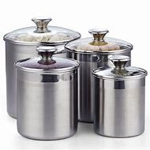
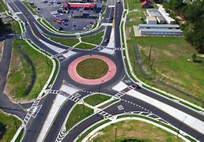

= step 2 - Lesson 12
:toc:

---

Lesson 12 +

== 1

Gentleman Jim has *worked out a plan* 制定计划 to rob a bank. He's *telling* his gang, Fingers Jones and Ginger Robertson *about* the plan. Listen to their conversation. +

Fingers: Let's see. You're going to walk up the counter 柜台 and you're going to start writing a cheque. Then you're going to open *the canister （装茶叶、咖啡等有盖的）小罐 of nerve gas*, and everyone will go to sleep instantly. +

.案例
====
.canister

====

Jim: That's right. This gas will put anyone to sleep for exactly three minutes. +

Fingers: And while everyone is asleep, you're going to go round to the manager's desk and steal all the money? +

Jim: Exactly. I've *worked it out* 计划；思考 very carefully. There should be about ￡50,000 in used *bank notes* 钞票. +

Ginger: Sounds great. There's only one thing. If you open the gas, you'll go to sleep too, won't you? +

Jim: I have thought of that. I'll wear a motor-cycle 摩托车 helmet, with an oxygen mask inside. If I wear a helmet, no one will be able to recognize me afterwards, either. +

Ginger: I think it's risky. If the bank clerk 职员；簿记员；文书 sees you take out a gas canister, he won't wait. He'll push the alarm button *straight away*. +

Fingers: I've just had an idea. If I came into the bank when you were standing at the counter, no one would even look at me. Then, if I threw the can of nerve gas, they wouldn't guess that we were connected. +

Ginger: Yes, that might be better. Are you going to wear a helmet, too? +

Fingers: No. It would look very suspicious if two people were wearing motor cycle helmets. I'll just open the door, throw in the gas canister, and leave Gentleman Jim to rob the bank. +

Jim: I like that idea. Right, we'll do that. Any other problems that you can see? +

Ginger: What are you going to do with the money? If you walk out with ￡50,000 under your arm, somebody will surely notice you. +

Jim: You'll be sitting in a get-away 离开;外出度假;使逃跑; 逃跑 car, waiting for me outsaid the bank. +

Ginger: But there is a police station just fifty yards away. If I park a car outside the bank, the police would probably come and ask me to move. +

Fingers: Well, what do you suggest? He can't just walk around 四处走动；绕走 the town. He'll be carrying ￡50,000 in bundles of bank notes. +

Jim: Just a minute! I've thought of something. What day is this robbery 盗窃；抢劫；掠夺? +

Fingers: Monday. +

Jim: Monday! You know what happens on Monday, don't you? It's dustbin  （常置于房外的）垃圾桶，垃圾箱 day! +

Ginger: So? +

Jim: So, can you think of a better way of moving the money? If you saw a man pick up ￡50,000 and put it into a car, what would you think? +

Fingers: I'd think he was a thief. +

Jim: Exactly. But if you saw a man pick up a dustbin and put it into a lorry 卡车；货运汽车, what would you think? +

Fingers: I'd think he was a dustman. Hey! That's clever! +

Ginger: And if the ￡50,000 was in the dustbin, I could pick up the money and nobody would notice. That's brilliant 巧妙的；使人印象深的;聪颖的；技艺高的. +

Fingers: Is there a dustbin? +

Jim: Oh yes, several. They put the dustbins out every Monday. They'll be standing there, outside the bank. +

Fingers: But if you put the money in a dustbin, it'll stink (v.)有臭味；有难闻的气味. We'll never be able to spend it if it smells like that. +

Jim: We don't have to put it in a dustbin. We can put it in a black plastic bag. They often have black plastic bags for rubbish nowadays. If I carry one in my pocket, I can *pull it out* after you've thrown the gas. OK? Let's *run through* 快速浏览;过一遍;排练 the plan once more. +

Ginger: You go into the bank with a motor-cycle helmet on, and a black rubbish bag in your pocket. +

Fingers: I come in a few minutes later. I open the door, throw in the open gas canister, and then go ... where? +

Jim: I've hired  租用；租借 a room in the building *right opposite* the bank. *Go up* in the lift *to* the top floor /and *keep a look out* 留意，注意. When you get there, radio (v.)（用无线电）发送，传送 Ginger, and tell him to come. +

Ginger: In the meantime, everyone in the bank has gone to sleep, except you. You take the money, and put it in the plastic bag. +

Jim: I come out, and put the bag with the rubbish, and then go back into the bank. +

Ginger: Go back? +

Jim：Oh yes. If everyone woke up and I wasn't there, they'd know I was one of the thieves. No, I'll go back and pretend to wake up with everyone else. +

Fingers: That's a really clever touch 修饰；润色；装点;作风；风格；手法. +

Ginger: I drive a dustcart and wait in the cul-de-sac 死胡同；死巷 behind the bank until Fingers contacts me. Then I come and pick up the rubbish, including the ￡50,000. +

Jim: I can't think of any problems, can you?

.案例
====
.touch
a way or style of doing sth 作风；风格；手法 +

- He couldn't find *his magic touch* with the ball today (= he didn't play well) . 他今天施展不出神奇的踢球技巧。

.cul-de-sac

====

吉姆绅士制定了抢劫银行的计划。他正在向他的帮派手指琼斯和金杰·罗伯逊讲述这个计划。听听他们的谈话。 +

手指：让我们看看。您将走到柜台并开始写一张支票。然后你将打开神经毒气罐，每个人都会立即进入睡眠状态。 +

吉姆：没错。这种气体可以让任何人睡足三分钟。 +

Fingers：趁大家都睡了的时候，你要跑到经理办公桌前偷走所有的钱？ +

吉姆：没错。我已经非常仔细地解决了。用过的纸币应该有5万英镑左右。 +

姜：听起来很棒。只有一件事。如果你打开煤气，你也会去睡觉，不是吗？ +

吉姆：我已经想到了。我会戴上摩托车头盔，里面有氧气面罩。如果我戴上头盔，以后也没有人能认出我。 +

姜：我认为这是有风险的。如果银行职员看到你拿出煤气罐，他不会等待。他会立即按下警报按钮。 +

手指：我刚刚有了一个主意。如果当你站在柜台时我走进银行，没有人会看我一眼。然后，如果我扔掉一罐神经毒气，他们就不会猜到我们有联系。 +

金杰：是的，这样可能会更好。你也要戴头盔吗？ +

Fingers：没有。如果两个人都戴着摩托车头盔，就会显得很可疑。我就打开门，扔进煤气罐，然后让吉姆先生去抢劫银行。 +

吉姆：我喜欢这个主意。好的，我们会这么做的。您还可以看到其他问题吗？ +

姜：你打算用这些钱做什么？如果你腋下夹着5万英镑走出去，肯定会有人注意到你。 +

吉姆：你会坐在一辆逃亡车里，在银行外面等我。 +

金杰：但是五十码外就有一个警察局。如果我把车停在银行外面，警察可能会过来叫我走开。 +

手指：嗯，你有什么建议？他不能只是在城里走来走去。他将携带一捆捆价值 5 万英镑的钞票。 +

吉姆：等一下！我想到了一件事。这次抢劫是哪一天？ +

  手指：周一。 +

吉姆：星期一！你知道周一会发生什么，不是吗？今天是垃圾箱日！ +

  姜：所以呢？ +

吉姆：那么，你能想出更好的转移资金的方法吗？如果你看到一个人捡起5万英镑放进车里，你会怎么想？ +

Fingers：我认为他是个小偷。 +

吉姆：没错。但如果你看到一个人捡起一个垃圾箱并将其放入卡车，你会怎么想？ +

手指：我认为他是一名清洁工。嘿！太聪明了！ +

Ginger：如果 50,000 英镑在垃圾箱里，我可以捡起这笔钱，没有人会注意到。太精彩了。 +

手指：有垃圾箱吗？ +

吉姆：哦，是的，有几个。他们每周一都会把垃圾箱倒掉。他们会站在银行外面。 +

手指：但是如果你把钱放进垃圾箱，它就会发臭。如果闻起来像那样的话，我们就永远无法花掉它。 +

吉姆：我们不必把它扔进垃圾箱。我们可以把它放在一个黑色的塑料袋里。现在他们经常用黑色塑料袋装垃圾。如果我口袋里有一个，我可以在你放完汽油后把它拿出来。好的？让我们再次回顾一下这个计划。 +

金杰：你戴着摩托车头盔走进银行，口袋里揣着一个黑色垃圾袋。 +

Fingers：几分钟后我就进来了。我打开门，把打开的煤气罐扔进去，然后去……​哪里？ +

吉姆：我在银行对面的大楼里租了一个房间。乘电梯到顶层并留意观察。当你到达那里时，给金杰发无线电，告诉他来。 +

金杰：与此同时，银行里的每个人都已经睡觉了，除了你。你拿着钱，把它放进塑料袋里。 +

吉姆：我出来，把垃圾放进袋子里，然后回到银行。 +

  姜：回去吗？ +

吉姆：哦，是的。如果每个人都醒来而我不在场，他们就会知道我是小偷之一。不，我要回去假装和其他人一起醒来。 +

手指：这是一个非常聪明的触摸。 +

金杰：我开着一辆垃圾车，在银行后面的死胡同里等着，直到手指联系我。然后我就来捡垃圾，包括那5万英镑。 +

吉姆：我想不出任何问题，你能吗？ +

---

== 2

(Doorbell rings. Door opens.) +

Boss: *At long last* 终于,总算! Why did it take you so long? +

.案例
====
.at long last
终于：表示经过漫长的等待或努力后，最终发生或实现了某事。 +

- After years of hard work, she finally achieved her dream job *at long last*. 经过多年的努力，她终于实现了她的梦想工作。

====

1st villain 反派角色，反面人物; 罪犯: Er ... *I really am sorry about* this, boss ... +

Boss: Come on! What happened? Where's the money? +

1st villain: Well, it's a long story. We parked outside the bank, OK, on South Street, and I went in and got the money — you know, no problems, they just filled the bag like you said they would. I went outside, jumped into the car, and *off we went*. +

.案例
====
.and off we went
*off we went 是倒装，正确语序是 we went off*，我们出发了. +

Off we go 也可以单独成句，是很常见的用法。中文是：我们走, 我们走喽！出发喽！等等
====

Boss: Yes, yes, yes. And then? +

2nd villain: We turned right up Forest Road, and of course `主` the traffic lights at the High Street crossroads `谓` were against us. And when they went green the stupid car stalled  （使）熄火，抛锚, didn't it? I mean, it was dead —  +

1st villain: So I had to get out and *push*, all the way 一直到底，一路上 *to* the garage 后定 opposite the school. I don't know why Jim here couldn't fix it. I mean, the car was your responsibility, wasn't it? +

2nd villain: Yeah, but it was you that stole it, wasn't it? Why didn't you get a better one? +

1st villain: OK, it was my fault. I'm sorry. +

2nd villain: The mechanic 机械师；机械修理工；技工 said it would take at least two days to fix it — so we just had to leave it there and walk. +

1st villain: Well, we *crossed 穿越；越过；横过；渡过 over* Church Lane, and you'll never believe what happened next, just outside the Police Station, too. +

.案例
====
.cross
(v.)*~ (over) (from...) (to/into...) / ~ (over) (sth)* : to go across; to pass or stretch from one side to the other 穿越；越过；横过；渡过
[ V] +

- I waved and she *crossed over* (= crossed the road towards me) . 我挥了挥手，她便横穿马路朝我走来。 +

- A look of annoyance *crossed her face* . 恼怒的神色从她脸上掠过。
====

2nd villain: Look, it wasn't my fault. You were responsible for providing the bag — I couldn't help it 我没有办法 if the catch  接（球等）;（儿童）传接球游戏;扣拴物；扣件 broke. +

1st villain: It took us five minutes to pick up 拾起 all the notes 票据;纸币 again. +

Boss: Fine, fine, fine. But where is the money? +

2nd villain: We're getting there, boss. Anyway, we ran to where the second car was parked, outside the library 图书馆 in Ox Lane 小巷；胡同；里弄 — you know, we were going to switch  交换；掉换；转换；对调 cars there — and then — you know, this is just unbelievable —  +

1st villain:  — yeah. We drove up 向上行驶,驱车来到 Church Lane, but they were *digging up* （在播种或建筑前）掘地，平整土地 the road just by the church, so we had to take the left fork （道路、河流等的）分岔处，分流处，岔口，岔路 and go all the way round the north side of the park. And then, just before the London Road roundabout （交通）环岛 —  +

.案例
====
.fork
a place where a road, river, etc. divides into two parts; either of these two parts （道路、河流等的）分岔处，分流处，岔口，岔路 +

• Take the right fork. 走右边的岔路。

.roundabout

====

2nd villain:  — some idiot 白痴，笨蛋 must have *driven* out from the railway station [伴随状 without looking right] *into* the side of a lorry. The road was completely blocked 封锁的; 闭塞的; 堵住的. There was nothing for it but to abandon the car and walk the rest of the way. +

Boss: All right, it's a very fascinating 极有吸引力的；迷人的 story. But I still want to have a look at 看一看，查看 the money. +

1st villain: Well, that's the thing, boss. I mean, I'm terribly sorry, but this idiot must have left it somewhere. +

2nd villain: Who are you calling an idiot? I had nothing to do with it. You were carrying the bag. +

1st villain: No. I wasn't. I gave it to you ...

（门铃响了。门打开了。） +

老板：终于来了！为什么你花了这么长时间？ +

第一反派：呃……​真的很抱歉，老大……​ +

老板：来吧！发生了什么？钱在哪里？ +

第一反派：嗯，说来话长。我们把车停在银行外，好吧，在南街，我进去拿了钱——你知道，没问题，他们只是像你说的那样装满了袋子。我走到外面，跳进车里，然后我们就出发了。 +

老板：对，对，对。进而？ +

第二个坏人：我们右转进入森林路，当然，高街十字路口的红绿灯对我们不利。当他们变绿时，那辆愚蠢的车就熄火了，不是吗？我的意思是，它已经死了—— +

第一个恶棍：所以我不得不下车推，一路推到学校对面的车库。我不知道为什么吉姆在这里无法修复它。我的意思是，这辆车是你的责任，不是吗？ +

坏人二号：是啊，但是是你偷的，不是吗？为什么你没有买一个更好的呢？ +

第一个恶棍：好吧，这是我的错。对不起。 +

第二个恶棍：机械师说至少需要两天才能修复它 - 所以我们只能把它留在那里然后步行。 +

第一个恶棍：嗯，我们穿过了教堂巷，你永远不会相信接下来发生的事情，就在警察局外面。 +

第二个坏人：听着，这不是我的错。你负责提供袋子——如果挂钩坏了我也无能为力。 +

第一个恶棍：我们花了五分钟才把所有的笔记都捡起来。 +

老板：好的，好的，好的。但钱在哪里？ +

第二个恶棍：我们快到了，老大。不管怎样，我们跑到了第二辆车停的地方，在牛巷的图书馆外面——你知道，我们要在那里换车——然后——你知道，这真是令人难以置信—— +

第一个恶棍：——是的。我们开车沿着教堂巷行驶，但他们正在教堂旁边挖路，所以我们不得不走左边的岔路，一直绕着公园的北侧走。然后，就在伦敦路环岛之前—— +

第二个恶棍：——肯定是有个白痴从火车站驶出，根本没看向右边就撞上了一辆卡车。整条路都被堵住了。 +

老板：好吧，这是一个非常有趣的故事。但我还是想看看钱。 +

第一个恶棍：嗯，就是这样，老大。我的意思是，我非常抱歉，但是这个白痴一定把它忘在某个地方了。 +

第二个坏人：你说谁是白痴？我与此无关。你背着包。 +

第一个恶棍：不，我不是。我把它给了你……​ +

---

== 3

Man: Excuse me, madam. +

Woman: Yes? +

Man: Would you mind letting me take a look in your bag? +

Woman: I beg your pardon? +

Man: I'd like to look into your bag, if you don't mind. +

Woman: Well I'm afraid I certainly do mind, *if it's all the same to you*. Now go away. Impertinence (n.)粗鲁; 无礼; 鲁莽! +

.案例
====
.if it's all the same to you. = If you don't mind, if it's okay with you (I'd like to get started)  如果对你来说没什么差别, 如果你不介意，如果你同意的话（我想开始）
====

Man: I'm afraid I shall have to insist, madam. +

Woman: And just who are you to insist, may I ask? I advise you to *take yourself off*  (常指突然且出人意料地) 离开 , young man, before I call a policeman. +

Man: I am a policeman, madam. Here's my identity card. +

Woman: What? Oh ... well ... and just what right does that give you to go around looking into people's bags? +

Man: *None whatsoever* 任何 (用于名词词组之后，强调否定陈述), unless I have reason to believe that there's something in the bags belonging to someone else? +

.案例
====
.None whatsoever 毫无任何：表示完全没有或没有任何一点。
- I have no interest in that movie, *none whatsoever*. 我对那部电影没有任何兴趣。
====

Woman: What do you mean belonging to someone else? +

Man: Well, perhaps, things that haven't been paid for? +

Woman: Are you talking about stolen goods? That's a nice way to talk, I must say. I don't know *what things are coming to* when perfectly honest citizens *get stopped* 被拦下 in the street and have their bags examined. A nice state of affairs! +

.案例
====
- "What things are coming to" 翻译为 "现在的情况是怎么了" 或 "事情都变成什么样了"，以表达对当前情况的不满和担忧。
- get stopped 被拦下：被警察、保安或其他人拦下来进行检查或询问。 +

I always *get stopped* by security at the airport. 我总是被机场安检拦下来检查。
- "A nice state of affairs" 翻译为 "真是一团糟" 或 "这可真是个好局面"，以表达对混乱或不愉快的情况的不满。
====

Man: Exactly, but if the citizens are honest, they wouldn't mind, would they? So may I look in your bag, madam? We don't want to make a fuss 无谓的激动（或忧虑、活动）；大惊小怪;（为小事）大吵大闹，大发牢骚, do we? +

Woman: Fuss? Who's making a fuss? Stopping people in the street and demanding to see what they've got in their bags. Charming! （表示对某人的行为评价不高）真是太好了  That's what I call it, charming! Now go away; I've got a train to catch. +

Man: I'm sorry. I'm trying to do my job *as politely as possible* but I'm afraid you're making it rather difficult. However, I must insist on seeing what you have in your bag. +

Woman: And *what*, precisely 准确地；恰好地, *do you expect* to find in there? The Crown 王冠 Jewels? +

Man: No need to be sarcastic 讽刺的；嘲讽的；挖苦的, Madam. I thought I'd made myself plain 坦诚的；直率的；直接的. If there's nothing in there which doesn't belong to you, you can go *straight off* 直接地，立即地 and catch your train and I'll apologize for the inconvenience 不便；麻烦；困难. +

Women: Oh, very well. Anything to help the police. +

Man: Thank you, madam. +

Woman: Not at all, only too happy to cooperate. There you are. 一点也不;不用谢，不客气，只是很乐意合作。给你。 +

Man: Thank you，Mm. Six lipsticks 口红；唇膏? +

Woman: Yes, nothing unusual in that. I like to change the colour with my mood. +

Man: And five powder-compacts 带镜小粉盒? +

.案例
====
.powder-compact

.compact
a small flat box with a mirror, containing powder that women use on their faces 带镜小粉盒
====

Woman: I use a lot of powder. I don't want to embarrass （尤指在社交场合）使窘迫，使尴尬 you, but I sweat 出汗；流汗 a lot. (Laughs) +

Man: And ten men's watches? +

Woman: Er, yes. I get very nervous if I don't know the time. Anxiety, you know. We all *suffer (v.)（因疾病、痛苦、悲伤等）受苦，受难，受折磨 from it* in this day and age. +

Man: I see you smoke a lot, too, madam. Fifteen cigarette lighters 打火机? +

Woman: Yes, I am rather a heavy smoker. And ... and I use them for *finding my way in the dark* and ... and for finding the keyhole 锁眼；钥匙孔 late at night. And ... and I happen to collect lighters. It's my hobby. I have a superb 极佳的；卓越的；质量极高的 collection at home. +

Man: I bet you do, madam. Well, I'm afraid I'm going to have to ask you to come along with me 跟我一起走. +

Woman: How dare you! I don't go out with strange men. And anyway I told you I have a train to catch. +

Man: I'm afraid you won't be catching it today, madam. Now are you going to come along quietly or am I going to have to call for help? +

Woman: But this is outrageous 骇人的；无法容忍的;反常的；令人惊讶的! (Start fade 逐渐消逝；逐渐消失) *I shall complain to* my MP 议员. One *has to* carry one's valuables (n.)（尤指私人的）贵重物品 around these days; *one's house might be broken into* while one's out ...

.案例
====
.MP  +

(n.)  the abbreviation for ‘Member of Parliament’ (a person who has been elected to represent the people of a particular area in a parliament) 议员（全写为Member of Parliament，经选举在议会中代表某一选区者）
====

男：对不起，女士。 +

 女：是吗？ +

男：你介意让我看一下你的包吗？ +

女：请原谅？ +

男：如果你不介意的话，我想看看你的包。 +

女：嗯，恐怕我确实介意，如果你也一样的话。现在走开。无礼！ +

男： 恐怕我得坚持，女士。 +

女：请问你是谁，敢这么坚持？我建议你在我叫警察之前先离开，年轻人。 +

男：女士，我是一名警察。这是我的身份证。 +

女：什么？哦……好吧……那你有什么权利到处查看人们的包呢？ +

男：没有什么，除非我有理由相信袋子里有东西属于别人？ +

女：什么叫属于别​​人？ +

男：嗯，也许是那些还没付钱的东西？ +

女：你说的是赃物吗？我必须说，这是一种很好的谈话方式。我不知道当完全诚实的公民在街上被拦下并检查他们的包时会发生什么。好一个状况啊！ +

男：没错，但是如果公民是诚实的，他们就不会介意，不是吗？女士，我可以看一下您的包吗？我们不想大惊小怪，不是吗？ +

女：闹？谁在大惊小怪？在街上拦住行人并要求查看他们包里的东西。迷人！这就是我所说的，迷人！现在走开；我有一趟火车要赶。 +

男：对不起。我试图尽可能有礼貌地完成我的工作，但我担心你让这件事变得相当困难。不过，我必须坚持看看你包里有什么。 +

女：那么，确切地说，你希望在那里找到什么？皇冠上的宝石？ +

男：女士，不必讽刺。我以为我已经说清楚了。如果里面没有不属于您的东西，您可以直接出发去赶火车，对于给您带来的不便，我深表歉意。 +

女：哦，很好。任何事情都可以帮助警察。 +

男：谢谢您，女士。 +

女：没有，只是太乐意合作了。你在这。 +

男：谢谢你，嗯。六支口红？ +

女：是的，这没什么不寻常的。我喜欢随着心情改变颜色。 +

男：五个粉饼？ +

女：我用了很多粉。我不想让你难堪，但我出汗很多。 （笑） +

男：还有十块男士手表？ +

女：呃，是的。如果我不知道时间，我会非常紧张。焦虑，你知道的。在当今时代，我们所有人都遭受着这种痛苦。 +

男：我发现您也抽烟很多，女士。十五个打火机？ +

女：是的，我烟瘾很大。而且……我用它们在黑暗中寻找路……以及在深夜找到钥匙孔。而且……我碰巧收集打火机。这是我的爱好。我家里有很棒的收藏。 +

男人：我打赌你一定会的，女士。好吧，恐怕我得请你跟我一起去。 +

女：你怎么敢！我不会和陌生男人出去。不管怎样，我告诉过你我要赶火车。 +

男： 恐怕您今天听不到，女士。现在你要安静地过来还是我必须打电话求救？ +

女：但这太离谱了！ （开始淡出）我要向我的国会议员投诉。如今人们必须随身携带贵重物品；当一个人外出时，他的房子可能会被闯入……​ +

---

== 4

1. The American Indians of the Southwest have led an agricultural life since the year 1 A.D., and in some aspects their life is still similar today. +

2. At the beginning of this period, the people farmed on the tops of high, flat, mountain plateaus 高原, called mesas 桌子山，方山（常见于美国西南部）. Mesa is the Spanish word for table. +

3. They lived on top of the mesas or in the protection of the caves 山洞；洞穴 on the sides of the cliffs （常指海洋边的）悬崖，峭壁. +

.案例
====
.mesa
image:../img/mesa.jpg[,15%]

.cliff

====

4. In their early history, the Anasazi used baskets for all these purposes. Later they developed pottery 陶器（尤指手工制的）. But the change from basketmaking 篮子编织 to pottery was *so* important *that* it began a series of secondary changes 次生变化，继发性变化. +

5. To cook food in a basket, the women first *filled* the basket *with* ground  磨细的；磨碎的 corn （小麦等）谷物；谷粒 mixed with water. They then built a fire. +

6. But many stones could be heated on the fire and then dropped into the basket of food, so it would cook. The stones heated the food quite well, but soon they 指石头 had to be taken out of the food and heated again. +

7. But although the men *brought home* 使某人明白,使某人深刻认识到 the idea of pottery, they did not bring home any instructions on how to make it. Anthropologists 人类学家 have discovered pieces of broken pottery 后定 made according to different formulas. +

8. Because the Anasazi had solved the problem of cooking and storing food, they could now enjoy a more prosperous 繁荣的；成功的；兴旺的, comfortable period of life.

.案例
====
.Anasazi阿纳萨齐人

阿纳齐族人是印第安人种族。科罗拉多西南部的维德台地, 是印第安人阿纳萨齐族（Anasazi）人早期的定居点之一，他们于公元6世纪的时来到这里，人们还能看到当时的一些建筑物的遗址。13世纪突然离开。

.bring home
To make perfectly clear: 使…十分清楚： +

- a lecture *that brought home several important points* 清楚地解释了几个要点的讲座

.bring home to sb/sth
- A teacher *should bring home to children* the value and pleasure of reading. 老师应当使儿童懂得读书的重要性和乐趣。
- Its importance *has been brought home to me very strongly*. 我已深刻地认识到它的重要性。

.bring home to sb.
- The story that I heard *that brought home to me the message* 后定 how important psychology is to wellbeing and to success. 那个故事让我明白, 心理学对幸福和成功是多么重要。
- *It brought home to him* just *how vastly different* the risks of the digital world *are from those of* the real world. 这让他意识到，数字世界的风险与现实世界的风险有多么大的不同。
====

西南部的美洲印第安人从公元1年起就过着农业生活，在某些方面他们的生活在今天仍然相似。 +

在这个时期的初期，人们在高而平坦的山地高原（称为台地）的顶部耕作。 Mesa 是西班牙语，意为“桌子”。 +

他们居住在台地顶部或悬崖两侧洞穴的保护下。 +

在他们的早期历史中，阿纳萨齐人将篮子用于所有这些目的。后来他们又发展了陶器。但从编篮到陶器的转变是如此重要，以致于它开始了一系列次要的变化。 +

为了在篮子里煮食物，妇女们首先在篮子里装满磨碎的玉米和水。然后他们生了火。 +

但许多石头可以放在火上加热，然后扔进食物篮子里，这样食物就会煮熟。石头很好地加热了食物，但很快就必须将它们从食物中取出并再次加热。 +

然而，尽管这些人带回了陶器的想法，但他们并没有带回任何有关如何制作陶器的说明。人类学家发现了根据不同配方制成的破碎陶器碎片。 +

由于阿纳萨齐人解决了烹饪和储存食物的问题，他们现在可以享受更加繁荣、舒适的生活。 +

---

== 5. Acupuncture 针灸，针刺疗法 +

There are many forms of alternative medicine which are used in the Western world today. One of the most famous of these is acupuncture, which is a very old form of treatment from China. It is still widely used in China today, where it is said to cure many illnesses, including tonsillitis 扁桃体炎, arthritis 关节炎, bronchitis 支气管炎, rheumatism  风湿（病） and flu. The Chinese believe that there are special energy lines through the body and that the body's energy runs through these lines. When a person is ill the energy in his or her body does not run as well as normal, perhaps because it is weaker or it is blocked in some way. The Chinese believe that if you put very fine needles into the energy line, this helps the energy to return to normal. In this way the body can help itself to get better. +

 +

.案例
====
.acupuncture

.tonsillitis +

-> 来自 tonsil,扁桃体，-itis,炎症。 +

扁桃体炎 +

*由于细菌及分泌物积存于扁桃体窝导致的。致病菌主要为"链球菌"或者"葡萄球菌"。* +

患急性传染病（如猩红热、麻疹、流感、白喉等）后，可引起慢性扁桃体炎，鼻腔有鼻窦感染也可伴发本病。病源菌以链球菌及葡萄球菌等最常见。临床表现为经常咽部不适，异物感，发干、痒，刺激性咳嗽，口臭等症状。
====

The acupuncturist puts the needles into special places along the energy line and some of these places can be a long way from the place where the body is ill. For example it is possible to treat a bad headache by putting needles into certain places on the foot. *It may surprise you to know that* it does not hurt when the acupuncturist puts the needles into your body. People who have had acupuncture say that they felt nothing or hardly anything. Western doctors at first did not believe that acupuncture could work. Now they see that it not only can work but that it does work. How and why does it work? No one has been able to explain this. It is one of nature's mysteries.

针灸 +

当今西方世界使用多种形式的替代医学。其中最著名的是针灸，这是一种来自中国的非常古老的治疗方法。如今，它在中国仍然被广泛使用，据说可以治愈许多疾病，包括扁桃体炎、关节炎、支气管炎、风湿病和流感。中国人认为，身体有特殊的能量线，身体的能量通过这些线运行。当一个人生病时，他或她体内的能量无法正常运行，可能是因为它较弱或以某种方式被阻塞。中国人相信，如果将非常细的针插入能量线，这有助于能量恢复正常。这样身体就可以帮助自己变得更好。 +

针灸师将针沿着能量线刺入特殊的地方，其中一些地方可能距离身体患病的地方很远。例如，可以通过将针刺入脚的某些部位来治疗严重头痛。您可能会惊讶地发现，当针灸师将针刺入您的身体时，您并不会感到疼痛。接受过针灸治疗的人表示，他们没有任何感觉或几乎没有任何感觉。西方医生起初并不相信针灸有效。现在他们发现它不仅可以发挥作用，而且确实有效。它如何以及为什么起作用？没有人能够解释这一点。这是大自然的奥秘之一。 +

---

== 6. I Just Fall in Love Again +

Dreaming, I must be dreaming +

Or am I really lying here with you +

Baby you take me in your arms +

And though I'm wide (ad.)尽可能远地；充分地 awake +

I know my dream is coming true +

And oh I just fall in love again +

Just one touch and then it happens every time +

And there I go +

I just fall in love again and when I do +

I can't help myself I fall in love with you +

Magic, it must be magic +

The way I hold you and the night just seems to fly +

Easy for you 对你来说很容易 to take me to a star +

Heaven is that moment when I look into your eyes +

And oh I just fall in love again +

Just one touch and then it happens every time +

And there I go +

I just fall in love again and when I do +

I can't help myself I fall in love with you +

Can't help myself I fall in love with you

我又坠入爱河了 +

做梦，我一定是在做梦 +

或者我真的和你一起躺在这里吗 +

宝贝你把我抱在怀里 +

尽管我很清醒 +

我知道我的梦想即将实现 +

哦，我又坠入爱河了 +

只需轻轻一按，然后每次都会发生 +

我就这样走了 +

我只是再次坠入爱河，当我坠入爱河时 +

我无法自拔爱上你 +

魔法，一定是魔法 +

我抱着你的方式，夜晚似乎飞逝 +

你很容易带我去星星 +

天堂就是我看着你眼睛的那一刻 +

哦，我又坠入爱河了 +

只需轻轻一按，然后每次都会发生 +

我就这样走了 +

我只是再次坠入爱河，当我坠入爱河时 +

我无法自拔爱上你 +

我无法自拔地爱上你

---

