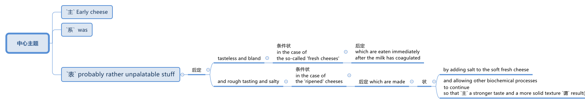
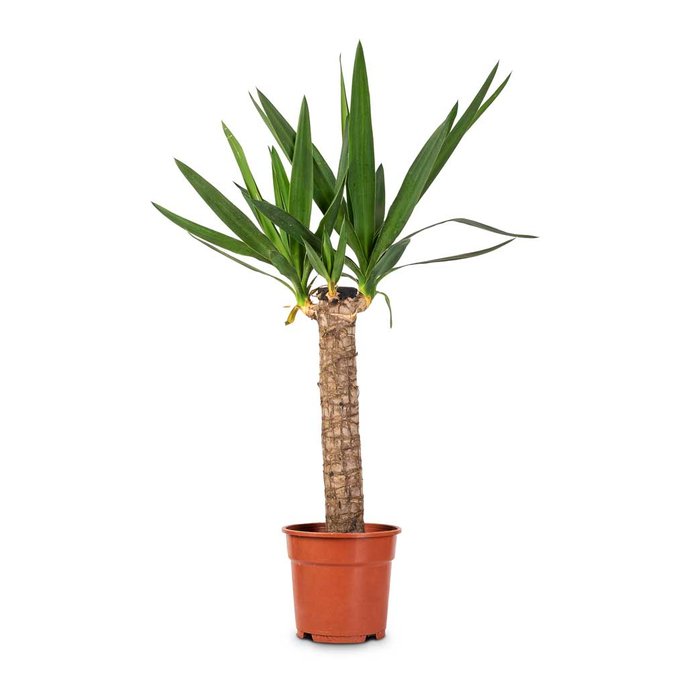

= step 2 - Lesson 15
:toc: left
:toclevels: 3
:sectnums:
:stylesheet: ../../+ 000 eng选/美国高中历史教材 American History ： From Pre-Columbian to the New Millennium/myAdocCss.css

'''

Lesson 15

== 1

A: Did you hear [on the news] today about that ... uh ... murderer 后定 who was executed (v.)（尤指依法）处决，处死?

B: I can't believe it.

A: Yeah. That's the first time in ten years /that they've used *capital (a.)死刑的 punishment* 死刑；极刑.

[.my1]
.案例
====
.capital
-> 这个词来源于拉丁语caput，意思是“头”。大写字母，在一词之“头”，因此叫capital。另外，一个国家首都，可以说是一个国家的“头脑所在”，“首”就是“头”，因此也叫capital。在建筑上，柱冠、柱顶部分也叫capital，因为它位于“头”部。capital作“资本”讲时，也来源于caput，即“头”与cattle（家畜、牛群）同出一源。在最初的时候，人们的财富，或“资本”，是以他的家畜头数来计算的，即有多少“头”。

.本句中的第二个that, 是否是多余的?
chatgpt说: 实际上，第二个 "that" 在语法上并不是必需的，你可以将其省略以简化句子。修正后的版本是："That’s the first time in ten years they’ve used capital punishment." 意思不变，但句子更为简洁。有时人们在表达中可能选择保留 "that" 以增加语气或强调，但在这个句子中，省略它是常见的做法。
====

B: I just can't *believe in* our society today *that* they would actually kill another human being. Nobody has the right to take another person's life.

A: Oh, I don't agree. Listen, I think capital punishment is — it's about time it came back. I think that's exactly what killers deserve.

[.my2]
我认为死刑是时候恢复了。我觉得这就是杀手应得的报应。

B: No, they don't deserve that. Because once you're killing a killer, you're the killer, too. You become a killer as well.

A: No, listen. You take a life, you have to be willing to give up your own. And also, I think that if you have a death penalty (n.)惩罚；处罚；刑罚 /it will prevent other people from killing. I think it's a good deterrent 威慑因素；遏制力.

[.my2]
你夺走一条生命，你就得愿意放弃自己的生命。而且，我认为如果你有死刑，它会阻止其他人杀人。我认为这是一个很好的威慑。

B: I don't think it's a good deterrent at all. My *goodness gracious* 我的天啊. I mean, first of all, are you sure `主` the person you've convicted (v.)证明…有罪；宣判（某人）有罪 to death `系` is really guilty?

[.my1]
.案例
====
.GOODNESS!| GOODNESS ME! | MY GOODNESS! | GOODNESS GRACIOUS!
( informal ) used to express surprise天哪；啊呀

goodness: (n.) the quality of being good 善良；优良；美德 +
gracious : (a.)~ (to sb)( of God上帝 ) showing kindness and mercy仁慈的；慈悲的；宽大的

====

A: Well, I think that's a very rare  少见的，不常发生的 ... very rare incidence.

B: I don't think it's rare, (I don't think it's ...) with all the cracker jack lawyers we have today, (Well, no ... I ...) and the judicial (a.)法庭的；法官的；审判的；司法的 system the way it is.

A: I think it's a rare incidence, and I think it's more important /to get rid of the ... the bad seed, you know?

B: But you don't get rid of it. You rehabilitate (v.)使（重病患者）康复；使（长期服刑者）恢复正常生活 somebody like that. (Oh ...) You don't eliminate 排除；清除；消除, you rehabilitate.

A: Listen, studies show that /criminals 罪犯 are never really rehabilitated. When they're ... when they come out of prison /they just go back to a life of crime, and they're hardened (v.)（使）更坚定，更强硬;使变得无情；使不被打动 by that crime.

B: Because the rehabilitation 康复，复原；（权利、名誉的）恢复；修复，翻新 process has to be more than 不仅仅是,不只是 just what's in jail. I mean, (Oh ... well.) when you're in jail /you do have to work, but when you're out of jail /there has to be an extensive 广大的；大量的;广泛的；广博的 program. We have to expand on the idea /till it works.

[.my2]
改过自新的过程不仅仅是在监狱里。

[.my1]
.案例
====
more than + 名词(动名词),意思是"不仅仅是","不只是"。 +
- *We need more than money*; we need time, too.  我们不只需要钱,我们也需要时间 +
- My trip to Beijing *is more than sightseeing*.  我去北京不仅仅是观光。
====

A: I don't agree. Listen — and, anyway, the jails and the prisons are already very crowded 拥挤的，塞满的, and we have to pay, the taxpayers. Our money goes to maintaining murderers' (I ...) lives 生存；活着.

B: I agree with you. That's why it's important to look at the problem on a much larger scale. The real problem is a social problem. (What ... no ...) There are other problems that cause people to kill. Look at poverty, drugs, discrimination 歧视，区别对待.

A: Some people are just bad. They're just evil and there's nothing you can do.

B: No, there ... it is ... no, it isn't true. There's rehabilitation. (No.) And they ... we're all responsible it ... for ... to humanity. That's one of the reasons ...

A: Well, but in the meantime you have to take care of the people who have already committed 做出（错或非法的事）；犯（罪或错等）;承诺，保证（做某事、遵守协议或遵从安排等） ...

B: I agree with you there.

A: Preventative 预防疗法；预防物 is different, but ...

B: I agree with you there.

A：你今天在新闻中听说过那个……呃……凶手被处决了吗？

---

== 2

Announcer 广播员；宣告者: On 'TV Magazine' tonight /we're looking at people who have given up regular jobs and high salaries /to start a new way of life. First of all, we have two interviews 访谈；面试；面谈 with people /who decided to leave the 'rat race'. Nicola Burgess spoke to them.

[.my1]
.案例
====
.rat race
[ sing.] ( disapproving) the way of life of people living and working in a large city where people compete in an aggressive way with each other in order to be more successful, earn more money, etc.（大城市里为财富、权力等的）疯狂竞争，你死我活的竞争
====

Nicola: This is the Isle 岛 of Skye 岛名. Behind me /you can see the croft （尤指苏格兰的）小农场，小农场上的住宅 belonging to Daniel and Michelle Burns, who gave up their jobs /to come to this remote area of Scotland. Daniel was the sales manager of Hi-Vita, the breakfast cereal 谷类植物,谷类食物 company, and Michelle was a successful advertising executive （公司或机构的）经理，主管领导，管理人员. Michelle, can you tell us /what made you give up everything to come here?

[.my1]
.案例
====
.croft
-> 词源不详。参照电影《古墓丽影》女主角名字 Lara Croft。
====

Michelle: Everything? That's a matter of opinion 这是个见仁见智的问题. A big house and two cars isn't everything! Dan and I both used to work long hours. We had to leave #so# early in the morning /and we came home #so# late at night, #that# we hardly ever saw each other. We should have come here years ago 多年前, but we were earning #such# big salaries 薪金，薪水（尤指按月发放的） #that# we were afraid to leave our jobs. In the end /we had #so# little time together /#that# our marriage was breaking up. So two years ago, we took a week's holiday in the Scottish Highlands. We saw this place /and we both fell in love with it. It was for sale, and we liked it #so# much /#that# we decided to give up our jobs, and here we are!

Nicola: How do you earn a living? If you don't mind me asking.

Michelle: We don't need very much. We keep sheep and goats 山羊, grow our own vegetables. We've got a few chickens. It's a very simple life, and we're not in it for profit 利润，盈利. We're still #so# busy /#that# we work *from* five in the morning *until* eight at night, but we're together. We're happier *than* we're ever been /and we're leading a natural life.

Nicola: There must be some things you miss, surely.

Michelle: I don't know. We knew such a lot of people in London, but they weren't real friends. We see our neighbours occasionally /and there's #such# a lot to do on the farm /#that# we don't have time to feel lonely. At least 至少 we see each other now.

Nicola: The motor-bike I'm sitting on `系`  is a very special one. Special because it's been *all the way* 一直到底，一路上；完全地，彻底地 round the world. It belongs to Luke Saunders, who has just returned to England /after a three year motor-cycle journey. Luke, what led you to leave your job /and make this trip?

Luke: I worked in a car factory /on the *assembly (n.)装配；组装；总成 line* 流水线. All I had to do was *put* four nuts 螺母，螺帽 *on* the bolts 螺栓 /that hold the wheels on. It's done by robots now, and a good thing too! The job was #so# routine #that# I didn't have to think at all. I bought this Triumph 750 cc bike second-hand, fitted two panniers 挂篮，货筐 on the back /and just *set off* 出发，启程 for Australia.

[.my2]
这份工作太常规了，我根本不需要思考。

[.my1]
.案例
====
.bolt

.pannier
each of a pair of bags or boxes carried on either side of the back wheel of a bicycle or motorcycle; each of a pair of baskets carried on either side of its back by a horse or donkey（自行车、摩托车后架两侧的）挂篮，货筐；（牲畜背上驮的）驮笼，驮篮 +
-> 来源于拉丁语panis(面包)的复合词panarium(面包篮子)。 词根词缀： -pan-面包 + -n-重复的辅音字母 + -ier名词词尾,人或物 +

====

Nicola: What did you do *for* money?

Luke: I had a bit of money to start with, but of course /it didn't last long /and I had to find work where I could. I've done so many different things — picked fruit, washed up, worked as a mechanic.

Nicola: How did people react (v.)起反应；（对…）作出反应；回应 to you? In India, for example.

Luke: Everywhere I went, the people were #so# friendly /#that# problems seemed to solve themselves 问题似乎会自行解决. There was #such# a lot of interest in the bike /#that# it was easy to start a conversation. You know, often you can communicate /without really knowing the language.

Nicola: Did you ever feel like giving up, turning round 转身，转向；归航 and coming home?

Luke: Only once, in Bangladesh 孟加拉国. I became #so# ill with food poisoning /#that# I had to go to hospital. But it didn't last long.

Nicola: You've had #such# an exciting time #that# you'll find it difficult to settle down, won't you?

Luke: I'm not going to 不打算. Next week I'm off again, but this time I'm going in the opposite direction! See you in about three years' time!

播音员：在今晚的“电视杂志”中，我们正在关注那些放弃正常工作和高薪开始新生活方式的人。首先，我们采访了两次决定退出“激烈竞争”的人。尼古拉·伯吉斯与他们交谈。

---

== 3

Here is #an extract# (n.)摘录；选录；选曲；节录 from a radio talk /#on# the work of Sigmund Freud 西格蒙德·弗洛伊德 by Professor Eric Watkis:

[.my1]
.案例
====
extract
(n.)~ (from sth) : a short passage from a book, piece of music, etc. that gives you an idea of what the whole thing is like摘录；选录；选曲；节录
====

Sigmund Freud developed his system of psychoanalysis 精神分析；心理分析 /while he was studying cases of mental illness. By examining details of the patient's life, he found that /the illness could often be traced back to some definite 清楚的；明显的 problem or conflict /within the person 后定 concerned 影响，涉及，牵涉（某人）.  +
But he *discovered*, too, *that* `主` many of the #neuroses# 神经症，精神官能症 /后定 observed (v.)观察；遵守；注意到 in mentally ill patients /`系` #were# also present, to a lesser (a.)(范围或程度) 较小的; (数量) 较少的 degree, in normal persons. This led him to the realization /that `主` the borderline 两种品质（或状况）之间的分界线 between the normal and the neurotic person /`系` is *not nearly* 远非；绝不是 #as# clearly marked (a.)显而易见的；明显的；显著的 #as# was once believed.

[.my1]
.案例
====
.NOT NEARLY
much less than; not at all远非；绝不是 +
• It's *not nearly* as hot as last year.天气绝没有去年那么热。 +
• There *isn't nearly* enough time /to get there now.现在根本没有足够的时间赶到那儿。
====

In 1914 /he published a book /called The Psychopathology of Everyday Life 日常生活的精神病理学. This book *goes a long way （对做某事）帮助很大，作用很大 towards* explain**ing** some of the strange behaviour of normal, sane 精神健全的；神志正常的 people.

[.my1]
.案例
====
.go a long/some way towards doing sth
to help very much/a little in achieving sth（对做某事）帮助很大╱不大，作用很大╱不大 +
• The new law *goes a long way towards* solv**ing** the problem. 新的法律十分有助于解决这一问题。
====

A glance at Freud's chapter headings 章节标题 /will indicate 表明；显示 some of the aspects of behaviour 后定 covered by the book:

Forgetting of *proper 符合习俗（或体统）的；正当的；规矩的 names* 专有名词

Forgetting of foreign words 外来词

Childhood and concealing (v.)隐藏；掩饰 memories

Mistakes in speech

Mistakes in reading and writing

Broadly 大体上；基本上；不考虑细节地, Freud demonstrates (v.)证明；证实；论证；说明 that /there are good reasons /for many of the slips 差错；疏漏；纰漏 and errors /后定 that we make. We forget a name because, unconsciously 不知不觉；无意识地, we do not wish to remember that name. We repress (v.)克制；压抑；抑制 a childhood memory /because that memory is painful to us. `主` A slip of the tongue or of the pen /`谓` betrays (v.) a wish or a thought of which we are ashamed.

In these days /when `主` every would-be （形容想要成为…的人）未来的 doctor or writer `谓` *has access (v.)访问，存取（计算机文件）;到达；进入；使用 to* Freud's accounts (n.)描述；叙述；报告;（思想、理论、过程的）解释，说明，叙述 of his research, it is worth pausing and remembering *the remarkable scope （题目、组织、活动等的）范围 and originality* (n.)独创性；创意；独特构思 of his ideas.

---

== 4

Cheese  干酪，奶酪 is one of those foods /that we tend *to take for granted* 认为…是理所当然 *as* always having been with us, and #it#'s odd to think /#that# someone somewhere must have discovered the process /that *takes place* /when micro-organisms get into milk /and bring about changes in its physical and biochemical 生物化学的 structure.

[.my2]
奶酪是这样一种食物 -- 我们理所当然地认为"它一直与我们同在", 因此如果某人有下面这种想法, 就会变得奇怪 -- "历史上某个地方的某个人, 他一定会发现了这个现象: 当微生物进入牛奶, 并改变了其物理和生化结构的过程时, 这个(发酵)过程就发生了".

[.my1]
.案例
====
.take it for ˈgranted (that...)
to believe sth is true without first making sure that it is 认为…是理所当然 +
• I just *took it for granted that* he'd always be around.我还想当然地以为他总能随叫随到呢。

.take sb/sth for ˈgranted
to be so used to sb/sth that you do not recognize their true value any more and do not show that you are grateful（因习以为常）对…不予重视；（因视为当然而）不把…当回事 +
• Her husband was always there /and she just *took him for granted*. 她丈夫随时都在身边，她只是认为他理应如此。 +
• We *take* having an endless supply of clean water *for granted*.我们想当然地认为洁净水的供应无穷无尽而不予以珍惜。
====

Obviously, we don't know /who discovered the process, but it's thought that 通常认为 /it came from South-West Asia about 8,000 years ago.

Early cheese was probably rather unpalatable 难吃的；不可口的 stuff （事物名称不详、无关紧要或所指事物明显时用）东西，物品，玩意儿, ① tasteless 无味的；不可口的 and bland 平淡的；乏味的 /in the case of 关于；就…而言；在…情况下 #the so-called 'fresh cheeses'# 新鲜奶酪, which are eaten immediately /after the milk has coagulated (v.)凝固；使凝结, ② and rough tasting and salty 含盐的；咸的 /in the case of #the 'ripened' 成熟的  cheeses#, which are made /by *adding* salt *to* the soft fresh cheese /and *allowing* other biochemical processes *to continue* /so that `主` a stronger taste and a more solid texture 坚实纹理 `谓` result (v.)（因…）发生；（随…）产生.

[.my1]
.案例
====

====

[.my2]
早期的奶酪, 可能是相当难吃的东西，所谓的“新鲜奶酪”无味无味，在牛奶凝固后立即食用，而“成熟”奶酪口感粗糙且咸，这是通过在软的新鲜奶酪中加入盐，并允许其他生化过程继续进行，从而产生更强的味道和更坚实的纹理质地。

The ancient Romans changed all that. They were great pioneers in the art of cheese-making, and `主` the different varieties of cheese 后定 they invented /and the techniques for producing them /`谓` *spread* [with them] *to* the countries they invaded. This dissemination 宣传，散播 of new techniques *took place* between about 60 BC and 300 AD. You can still trace their influence in the English word 'cheese', which comes ultimately 最终，最后 from the Latin word 'caseus', that's C-A-S-E-U-S.

Well, things went on *quietly 轻轻地，安静地 enough* /after the Roman period /独立主格结构 #with# `主` the cheese producers in the different countries *getting on （尤指中断后）继续做某事 with* developing their own specialities 专业；专长;特产；特色菜. It's amazing /*the variety of flavours* you can get from *essentially 本质上；根本上；基本上 the same process*.

[.my2]
在罗马时期之后，各国的奶酪生产商相对安宁地进行着各自特色的发展。令人惊讶的是，基本上采用相同工艺，却能产生如此多样的风味。

[.my1]
.案例
====
.GET ˈON WITH STH
(1) ( also ˌget aˈlong with sth ) used to talk or ask about how well sb is doing a task（谈及或问及工作情况）进展，进步 +
• I'm not *getting on* very fast *with this job*.我这个工作进展不太快。

(2)to continue doing sth, especially after an interruption（尤指中断后）继续做某事 +
• Be quiet and *get on with your work*.安静下来，继续干你的事。 +
( informal) +
• *Get on with it*! We haven't got all day.继续干吧！我们的时间并不多。

.独立主格结构
见本篇尾
====

*At this stage* in history, people weren't *#aware#* [in a scientific 科学（上）的；关于科学的 way] *#of#* the role of different micro-organisms and enzymes 酶 in producing different types of cheese. But they knew from experience that /if you kept your milk or your 'pre-cheese' mixture /at a certain temperature /or in a certain environment, things would turn out in a certain way. The Roquefort caves in France are an example of a place /that *was used* for centuries *for* the ripening （使）成熟，催熟 of a certain sort of cheese, before people knew exactly *why they produced (v.) the effect* they did.

[.my2]
在历史的这个阶段，人们还没有科学地意识到, 不同的微生物和酶, 在生产不同类型的奶酪中的作用。但他们从经验中知道，如果你把牛奶或“预奶酪”混合物, 放在一定的温度或特定的环境中，事情就会以某种方式发生。法国的罗克福洞穴就是一个例子，几个世纪以来，人们一直用它来熟化某种奶酪，直到人们确切地知道它们为什么会产生这样的效果。

In the nineteenth century, with the increasing knowledge about micro-organisms, there came the next great step forward in cheese-making. Once it was known exactly /which micro-organisms were involved /in the different stages of producing a cheese, and how the presence of different micro-organisms affected the taste, it was possible /to introduce 引进（动物或植物）；传入（疾病）;推行；实施；采用 them deliberately, and to industrialize （使）工业化 the process.

[.my2]
19世纪，随着人们对微生物的了解不断增加，奶酪制作又向前迈出了一大步。一旦确切地知道了哪些微生物参与了奶酪生产的不同阶段，以及不同微生物的存在如何影响奶酪的味道，就有可能有意地引入它们，并使这一过程工业化。

Cheese started *being made* on a large scale in factories, although `主` the small producer 后定 working from his farm dairy `谓` continued to exist and still exist today. Cheese-making *moved* very much /*into* the world of technology and industrial processes, although, because the aim is still to produce something that people like to eat, there's still an important role for human judgement. People still *go round* （常处于某种状态或以某种方式行动）习惯于 tasting the young cheese at different stages /to see how it's *getting on*, and may add a bit of this or that /to improve the final taste. Whatever the scale of production, there is still room for art *alongside 在…旁边；沿着…的边;与…一起；与…同时 the technology*.

[.my2]
奶酪开始在工厂大规模生产，尽管"日常在自己农场工作"的小生产者，今天仍然存在。奶酪制作在很大程度上进入了技术和工业流程的世界，尽管，因为它的目标仍然是生产人们喜欢吃的东西，人类的判断仍然扮演着重要的角色。人们仍然会在不同的阶段品尝新鲜的奶酪，看看它是如何形成的，并可能添加一些这样或那样的东西来改善最终的味道。无论生产规模如何，艺术仍然有发展的空间.

[.my1]
.案例
====
.go aˈround/ˈround
( BrE also also ˌgo aˈbout ) to often be in a particular state or behave in a particular way（常处于某种状态或以某种方式行动）习惯于 +
- It's unprofessional *to go round* criticizing your colleagues.总是指责同事，这不符合职业道德。

.GET ˈON
(1) ( also ˌget aˈlong ) used to talk or ask about how well sb is doing in a particular situation（谈及或问及某人）进展，进步 +
• *He's getting on very well* at school.他在学校学得很好。  +
• *How did you get on* at the interview?你面试的情况怎么样？

(2)to be successful in your career, etc.获得成功；事业有成 +
• Parents are always anxious for their children *to get on*.父母总是急切地盼望孩子们事业有成。 +

(3) ( also ˌget aˈlong ) to manage or survive对付；应付；活下来；过活 +
• *We can get on perfectly well* without her.没有她我们也能过得很好。

====

---

== 5

All cultures change, even modern ones. As a matter of fact 事实上,实际上, change occurs most rapidly in modern cultures, since science brings us so many new discoveries every day. It is rather difficult to follow these changes clearly, since they happen so fast. The civilization that I will discuss today is easier to observe.

[.my2]
所有文化都会发生变化，即使是现代文化。事实上，现代文化中的变化发生得最快，因为科学每天都给我们带来许多新发现。清楚地跟踪这些变化相当困难，因为它们发生得太快了。我今天要讨论的文明更容易观察。

No formal history was written for these early Indians, but Navajo Indians who *came along 到达；抵达；出现;跟随；跟着来 later* found evidence of their great civilization. The Navajos called these prehistoric 史前的；有文字记载以前的；远古的 people 'the Anasazi', which means, 'the Ancient Ones'.

[.my2]
没有为这些早期印第安人写下正式的历史，但后来出现的纳瓦霍印第安人, 发现了他们伟大文明的证据。纳瓦霍人称这些史前民族为“阿纳萨齐人”，意思是“古代人”。

[.my1]
.案例
====
.Navajo
美国最大的印第安部落

.come aˈlong
(1)to arrive; to appear 到达；抵达；出现 +
• When the right opportunity *comes along*, she'll take it.适当的机会来临时，她会抓住的。

(2)to go somewhere with sb 跟随；跟着来 +
• I'm glad *you came along*.有你跟我一起来，我很高兴。
====

Descendants of the Anasazi still live in the Southwest, and many aspects of their culture are similar to ancient times. Today these people are called Pueblo Indians.

There are four different time periods /in the development of the Anasazi. Scientists have *looked for* the one 后定 most important theme 题目，主题，主题思想 in this story, a kind of unifying 使统一,使成一体 idea to organize all the facts. `主` The most critical and influential 有很大影响的；有支配力的 #improvement# 改善；改进 in their lives /`系` #was# the way /后定 they used containers 容器 to cook, store, and carry food and water.

The most important job of the man in this society /was to learn, teach, and perform the religious ceremonies 仪式；典礼 *associated (v.)联想；联系 with* farming. Women worked in the fields /and prepared all the food. Women also *wove* (v.)（用手或机器）编，织 baskets *out of* yucca fibers 纤维.

[.my1]
.案例
====
.yucca
a tropical plant with long stiff pointed leaves on a thick straight stem , often grown indoors 丝兰（叶剑形坚挺，常种于室内） +

====

We don't know what the final problem was. It might have been enemy attack, sickness, lack of rain, or over-farmed soil. But in the year 1300 /the last of the Anasazi left the cliff dwellings 住宅；住所；公寓, never to return again. They left behind their beautiful pueblos 普韦布洛村落, which still stand as a monument to them.

[.my1]
.案例
====
.pueblo
( from Spanish) a town or village in Latin America or the south-western US, especially one with traditional buildings普韦布洛村落（在拉丁美洲或美国西南部，尤指有传统房屋建筑） +

====

'''

