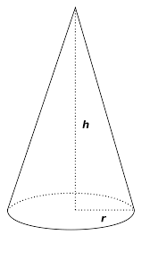
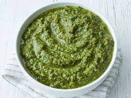

= step 2 - Lesson 17
:toc: left
:toclevels: 3
:sectnums:
:stylesheet: ../../+ 000 eng选/美国高中历史教材 American History ： From Pre-Columbian to the New Millennium/myAdocCss.css

'''

Lesson 17

== part

Here is a summary 总结，概要 of the news.

[.my2]
以下是新闻摘要。

Shots are fired /in a south London street /by escaping bank robbers. Four rock fans die (v.) in a stampede （人群的）奔逃，蜂拥；（兽群的）惊跑，狂奔 at a concert  音乐会，演奏会 Chicago. And how an Air France Concorde 协和式超音速喷射客机 *was involved in* the closest recorded miss in aviation (n.)航空 history?

[.my2]
逃跑的银行劫匪在伦敦南部的一条街道上开枪。四名摇滚乐迷在芝加哥一场音乐会的踩踏事件中丧生。法航协和式飞机, 是如何遭遇航空史上最接近的失航记录的？

[.my1]
.案例
====
.stampede
-> 来自西班牙语 estampida,奔跑，奔逃，词源同 stamp,猛踩，跺脚，-ida,名词后缀。引申诸相 关词义。
====

Shots were fired this morning /*in the course 在…的过程中 of* an 80 m.p.h. （mile per hour） chase /along Brixton High Road in London. A police constable 治安官，巡警；警察 was injured by flying glass /when a bullet shattered (v.)（使）破碎，碎裂 his windscreen /as he was pursuing a car /containing four men /who had earlier raided a branch 分支机构，分店 of Barclays Bank at Stockwell. Police Constable Robert Cranley had been patrolling (v.)巡逻 near the bank /when the alarm was given. The raiders made their getaway (n.)（尤指犯罪后的）逃跑，逃走 in a stolen Jaguar 美洲豹；美洲虎(也是汽车品牌) which was later found abandoned in Croydon 地名. Officials of the bank /later announced that ￡16,000 had been stolen.

[.my2]
今天早上，在时速 80 英里的赛道上发生了枪击事件。沿着伦敦布里克斯顿高路追逐。一名警员在追赶一辆载有四名男子的汽车时，一颗子弹打碎了他的挡风玻璃，这名警员被飞溅的玻璃击伤，这辆汽车早些时候袭击了巴克莱银行位于斯托克韦尔的一家分行。警报响起时，警官罗伯特·克兰利正在银行附近巡逻。袭击者驾驶一辆偷来的捷豹汽车逃跑，后来发现这辆汽车被遗弃在克罗伊登。该银行官员随后宣布16,000英镑被盗。

[.my1]
.案例
====
.constable
-> 来自拉丁短语comes stabuli, 管马的官员。comes, 词源同count, 伯爵，stable,马廐。后来词义发生了变化。比较marshal, 将军，原指管马的官员。

.jaguar

====

Four people were killed /and more than fifty injured /when fans rushed to get into a stadium 体育场；运动场 in Chicago yesterday /where the British *pop group* 流行乐团 Fantasy were giving a concert. The incident occurred /when gates were opened /to admit a huge crowd of young people /waiting outside the stadium /for the sale of unreserved (a.)(剧院的座位等)未被预订的；非保留的 seat tickets. People *were knocked over* 撞倒某人 in the rush /and *trampled 踩伤；践踏 underfoot* (ad.)在脚下；在（脚下的）地面上 /as the crowd surged (v.)涌；汹涌；涌动 forward. The concert later *went ahead [as planned]* 按计划进行 /with Fantasy *unaware of* what had happened. A police spokesman said that /they had decided to allow the concert to proceed (v.)继续做（或从事、进行） /in order to avoid further trouble. There has been criticism (n.)批评；批判；责备；指责 of the concert organizers /for not ensuring that `主` all the tickets `谓` were sold in advance. Roy Thompson, leader of Fantasy, said afterwards that /the whole group was 'shattered' (a.)非常惊愕难过的；遭受极大打击的;破碎的 when they heard what had happened. They are now considering *calling off* 取消；停止进行 the rest of their United States tour 巡回比赛（或演出等）；巡视.

[.my2]
昨天，英国流行乐队 Fantasy 正在芝加哥举行音乐会，歌迷们冲进一个体育场，造成四人死亡、五十多人受伤。事件发生时，大门打开，一大群年轻人在体育场外, 等待出售未预订的座位票。人们在拥挤的人群中被撞倒，被踩在脚下。音乐会随后按计划进行，Fantasy 并不知道发生了什么事。警方发言人表示，他们决定允许音乐会继续进行，以避免进一步的麻烦。有人批评音乐会组织者没有确保所有门票提前售完。幻想乐队的领导人罗伊·汤普森事后表示，当他们听到所发生的事情时，整个乐队都“崩溃了”。他们现在正在考虑取消剩余的美国巡演。

The United States Air Force has admitted that /`主` a formation 编队；队形 of its fighters and an Air France Concorde `谓` recently missed 避开（不愉快的事） colliding /by *as little as* 10 feet. The Air Force *accepts the blame* 承担责任 /for what was the closest recorded miss in aviation history. According to the Air Force spokesman, when the Concorde was already 70 miles out over the Atlantic, on a scheduled 预先安排的，按时刻表的 flight to Paris /from Dulles International Airport, Washington, four US Air Force F-15s approached (v.) *at speed* 迅速地、快速地 from the left. The lead plane missed *the underside 下侧；底面；底部；下表面 of Concorde’s nose* 鼻；鼻子 by 10 feet /while another passed only 15 feet in front of the cockpit （飞机、船或赛车的）驾驶舱，驾驶座.

[.my2]
美国空军承认，其战斗机编队最近与法国航空公司(Air France)的一架协和式飞机(Concorde)险些相撞，仅差10英尺。这是航空史上最接近的一次失误，美国空军对此承担责任。根据美国空军发言人的说法，协和式飞机预定从华盛顿杜勒斯国际机场飞往巴黎，当协和式飞机已经在大西洋上空70英里时，四架美国空军f -15战斗机从左侧飞速靠近。领头的飞机与协和式飞机机头下方10英尺处, 擦肩而过，而另一架飞机从协和驾驶舱前方, 仅15英尺处掠过。

Forest fires in the South of France /*have claimed 要求（拥有）；索取；认领 the life of* another fireman /as they continue to rage (v.)暴怒；狂怒;迅速蔓延；快速扩散 in the hills between Frejus and Cannes. Fanned (v.)扇，吹（使火更旺） by strong westerly winds /the flames are now threatening several villages /and many holiday homes have had to be abandoned. The French army was called in yesterday /to assist (v.)帮助；协助；援助 the fifteen hundred fire fighters /that *have* [so far] *been* unable to contain (v.)防止…蔓延（或恶化）;控制，克制，抑制（感情） the spread of the blaze 烈火；火灾.

[.my2]
法国南部的森林大火在弗雷瑞斯和戛纳之间的山上继续肆虐，导致另一名消防员丧生。在强劲西风的推动下，大火现在威胁着几个村庄，许多度假屋不得不被放弃。昨天，法国军队被召集来协助 1500 名消防员，但迄今为止，他们仍无法控制火势的蔓延。

`主` A demonstration against race prejudice 偏见；成见 /`谓` *drew* thousands of people *to* central London this morning. It was organized by the Labour Party and *the Trades Union 工会 Congress* 代表大会 /under the banner 'United against Racialism 种族主义；种族歧视'. The march was led by several leading Labour Party and Trades Union officials. It was a column （人或车辆排成行移动的）长列，纵队 /that stretched for over two miles /and it took the demonstrators nearly three hours /to cover the distance *from* Speakers' Corner 街角 *to* Trafalgar Square 广场. There were representatives from more than twenty major unions, *as well as* community workers 社区工作者 and various ethnic groups 民族群体. By the time the march reached Trafalgar Square /an estimated  估计的，预计的 fifteen thousand people had joined it.

[.my2]
今天早上，一场反对种族偏见的示威活动, 吸引了数千人来到伦敦市中心。它是由工党和工会代表大会, 在“联合反对种族主义”的旗帜下组织的。游行由工党和工会的几位主要官员领导。这是一支绵延超过两英里的纵队，示威者花了近三个小时, 才从演讲角, 走到特拉法加广场。出席的有二十多个主要工会的代表，还有社区工作者和各族裔群体的代表。当游行到达特拉法加广场时，估计已有一万五千人加入。

Heathrow Airport Police are investigating /how `主` a mailbag 邮袋 containing nearly ￡750,000 worth of jewels `谓` *went missing* between Geneva and London. The mailbag was believed to be *on its way to* a London dealer 商人，交易商 /from a jeweller 宝石钟表匠；宝石钟表商 in Geneva 日内瓦 five weeks ago, but it was not realized /it was missing /until the Post Office *reported* the fact *to* Scotland Yard /two days ago. The mailbag contained a diamond, an emerald 祖母绿；绿宝石；翡翠 and two rubies valued at ￡635,200 /plus a number of stones of lesser (a.)较小的；较少的；次要的 value, according to a police spokesman at Heathrow.

[.my2]
希思罗机场警方正在调查一个装有价值近 75 万英镑珠宝的邮袋, 在日内瓦和伦敦之间失踪的原因。据信，该邮袋五周前正在从日内瓦的一家珠宝商, 发往伦敦经销商的途中，但直到邮局两天前向苏格兰场报告这一事实时，人们才意识到它失踪了。据希思罗警方发言人称，该邮袋内装有一颗钻石、一颗祖母绿和两颗红宝石，价值 635,200 英镑，还有一些价值较低的宝石。

[.my1]
.案例
====
.jeweller
( BrE ) ( NAmE jew·el·er )
a person who makes, repairs or sells jewellery and watches 宝石钟表匠；宝石钟表商
====

Football. The draw 抽签 for the semi-final 半决赛 of the F.A. Cup was made earlier today. Liverpool will play Manchester City /while Arsenal will meet Nottingham Forest. And that’s the end of the news.

[.my2]
足球。足总杯半决赛的抽签仪式于今天早些时候进行。利物浦将对阵曼城，阿森纳将对阵诺丁汉森林。这就是新闻的结尾。

'''

==  part 2. 部分

Today I would like to tell you about /the effects of old age on health. Actually today a lot of improvements have taken place /in the care of old people /and old people’s health is *not nearly* 远非；绝不是 so bad /as it used to be.

[.my2]
今天我想向大家介绍一下, 老年对健康的影响。事实上，现在老年人的护理已经有了很大的进步，老年人的健康状况也不像以前那么糟糕了。

Probably `主` many of #the fears# /that people have of growing old /`系`  #are# greatly exaggerated. Most people, for example, dread (v.)非常害怕；极为担心 becoming senile (a.)衰老的；年老糊涂的. But in fact very few people become senile. Perhaps only about 15% of those over 65 become senile. Actually a much more common problem *is* in fact *caused by* we doctors ourselves. And that is over-medication 用药过度. Nearly 80% of people over 65 have at least one serious illness, such as high blood pressure, hearing difficulty or heart disease. And very often *to combat these* /they take a number of drugs /and *of course* 当然 sometimes there are interaction 相互影响，相互作用 among those drugs /as well as 以及，还有 simply being too many. And this can cause a lot of complications 使复杂化的难题（或困难）；并发症 #*from*# mental confusions 精神混乱, very commonly, #*to*# disturbance （受）打扰，干扰，妨碍 of the heart rhythm. So this is a problem /that doctors have to *watch out for* 注意寻找；戒备；小心提防.

[.my2]
也许人们对变老的许多恐惧都被过分夸大了。例如，大多数人都害怕变老。但事实上，很少有人会衰老。 65 岁以上的人中，也许只有约 15% 会衰老。事实上，一个更常见的问题实际上是我们医生自己造成的。这就是过度用药。近 80% 65 岁以上的人患有至少一种严重疾病，例如高血压、听力困难或心脏病。为了对抗这些疾病，他们经常服用多种药物，当然有时这些药物之间会相互作用，甚至药物太多。这可能会导致许多并发症，从精神错乱（很常见）到心律紊乱。所以这是医生必须警惕的问题。

Probably the most ignored disorder among old people /is depression. Maybe about 15% of older people *suffer from* this condition. `主` A lot of it `谓` is caused by this over-medication which we mentioned.

[.my2]
老年人中最容易被忽视的疾病可能是抑郁症。也许大约 15% 的老年人患有这种疾病。很多都是我们提到的过度用药造成的。

Although it is better now /for old people, we have to admit that /the body does change /as we grow older. The immune system starts to decline /and there are changes in metabolism 新陈代谢, lungs, the senses, the brain and the skin.

[.my2]
虽然现在老年人好了一些，但我们不得不承认，随着年龄的增长，身体确实会发生变化。免疫系统开始衰退，新陈代谢、肺部、感官、大脑和皮肤都发生变化。

So what should an old person do /to counter-act (v.)抵制，抵消，中和 these changes?

[.my2]
那么，老年人应该如何应对这些变化呢？

He or she should eat a balanced diet — not too much fat — chicken or fish should be eaten /rather than eggs or beef. Eat more *high fibre* 高纤维 and *vitamin rich* (a.)维生素丰富的 foods, such as vegetables and fruit.

[.my2]
他或她应该均衡饮食——不要吃太多脂肪——应该吃鸡肉或鱼，而不是鸡蛋或牛肉。多吃高纤维和富含维生素的食物，如蔬菜和水果。

The old person should give up smoking /if he hasn’t already done so. He should also do regular exercise — at least half an hour, three times a week. `主` No section of the population `谓` can *benefit more* from exercise /than the elderly.

[.my2]
如果老人还没有戒烟，就应该戒烟。他还应该定期锻炼——至少半小时，每周三次。没有哪个群体比老年人更能从锻炼中受益。

'''

== part 3. 部分

Carl: I hope I’m not interrupting your work, Mr. Thornton. You must be very busy /at this time of the day.

[.my2]
卡尔：我希望我没有打扰您的工作，桑顿先生。一天中的这个时候你一定很忙。

Paul: Not at all. Come in, come in, Mr. Finch. I’m just tasting a few of the dishes /we’ll be serving this morning.

[.my2]
保罗：一点也不。进来，进来，芬奇先生。我只是品尝我们今天早上提供的一些菜肴。

Carl: That looks interesting. What exactly is it?

[.my2]
卡尔：看起来很有趣。到底是什么？

Paul: That one is fish — in a special sauce. One of my new creations, actually.

[.my2]
保罗：那是鱼——配上一种特殊的酱汁。实际上，这是我的新创作之一。

Carl: I’m looking forward to trying it.

[.my2]
卡尔：我很期待尝试一下。

Paul: I do hope /you’ve enjoyed your stay with us.

[.my2]
保罗：我衷心希望您在我们这里过得愉快。

Carl: Very much, indeed. We both find it very relaxing here.

[.my2]
卡尔：确实非常喜欢。我们都觉得这里非常放松。

Paul: Well, I’m sure there’s lots more you’d like to ask, so, please, go ahead.

[.my2]
保罗：嗯，我确信您还有很多问题想问，所以，请继续。

Carl: Thanks. I notice that /you have a sort of team of helpers. How do you organize who does what? Surely it’s difficult /with so many talented people?
卡尔：谢谢。我注意到你有一个助手团队。你如何组织谁做什么？这么多人才，肯定很难吧？

Paul: Everyone contributes (v.) ideas, of course, and *to a certain extent* shares (v.) in the decision-making. We all have our different specialities and different ways of doing things, but that’s a great advantage in a place like this. If there is any disagreement, I have the final word 最终决定,一槌定音. After all, I own the business and I’m the boss. But it happens very rarely. I’m glad to say.
Paul：当然，每个人都贡献想法，并在一定程度上参与决策。我们都有不同的专长和不同的做事方式，但这在这样的地方是一个很大的优势。如果有任何不同意见，我有最终决定权。毕竟，我拥有这家公司，我是老板。但这种情况很少发生。我很高兴地说。

Carl: Have you had them with you for long?

[.my2]
卡尔：你拥有你的员工很久了吗？

Paul: Not all of them, no. Alan’s been with me /for about five years. I used to have a restaurant /on the east coast. Then I got the offer *to do a lecture 讲座，讲课，演讲 tour* 巡回比赛（或演出等）；巡视 of Australia and New Zealand, you know, with practical demonstrations, so I sold the business, and then Alan and I *looked around* for two young chefs 大厨；主厨 to take with us. Tom and Martin have been working for me ever since (Laughs.) Chefs are not a problem, but I’m having a lot of trouble /at the moment finding good, reliable *domestic 家用的；家庭的；家务的 staff* 家政人员.

[.my2]
保罗：不是全部，不是。艾伦和我在一起大约五年了。我以前在东海岸有一家餐馆。然后我得到了在澳大利亚和新西兰进行巡回演讲的邀请，你知道，并进行实际演示，所以我卖掉了公司，然后艾伦和我四处寻找两位年轻的厨师可以带我们一起去。从那时起，汤姆和马丁就一直为我工作（笑）。厨师不是问题，但我目前在寻找优秀、可靠的家政人员方面遇到了很多麻烦。

Carl: How long did the tour last?

[.my2]
卡尔：巡演持续了多长时间？

Paul: We were away for over two years in the end /because more and more organizations wanted to see the show, and one thing *led to* another.

[.my2]
Paul：我们最终离开了两年多，因为越来越多的组织想看这个节目，一件事导致了另一件事。

Carl: Had you been considering this present (a.)现存的；当前的 venture （尤指有风险的）企业，商业，投机活动，经营项目 for long?

[.my2]
卡尔：您考虑目前的这项事业很久了吗？

Paul: For some time, yes. During the tour /I began to think /it might be interesting *to combine* the show idea *with* a permanent establishment 机构；大型组织；企业；旅馆. And so here we are.

[.my2]
保罗：有一段时间，是的。在参观过程中，我开始认为将展览理念与永久性设施结合起来可能会很有趣。我们就到这里了。

Carl: And what made you choose this particular spot?

[.my2]
卡尔：是什么让你选择了这个特定地点？

Paul: Quite a few 相当多的，不少的 people have been surprised — you’re not the first. It does seem a bit out of the way 偏僻的, I know, but I didn’t want *to start up* （使）启动，发动，开始 in London. There’s far too much competition 竞争；角逐. Then I decided to go /for a different type of client 客户 altogether （用以强调）完全，全部 — the sort of person who wants *to get away （得以）离开，脱身;摆脱（某人）；逃离（某地） from it* all; who loves peace and quiet, and beautiful scenery /but also appreciates (v.) good food. When I saw the farmhouse I couldn’t resist it. I *was brought up* 抚养；养育；教养 not far from here /so everything just *fell into 可以分为；能够分成 place* 逐渐明朗，逐渐变得清晰.

[.my2]
保罗：很多人都感到惊讶——你不是第一个。我知道，这似乎有点偏僻，但我不想在伦敦创业。竞争太多了。然后我决定去寻找完全不同类型的客户——那种想要摆脱一切的人；喜欢宁静、美丽的风景，也喜欢美食。当我看到农舍时，我无法抗拒。我是在离这里不远的地方长大的，所以一切都很顺利。

Carl: To *go back to* the food, Paul. Do you have a large selection of dishes 一道菜；菜肴 *to choose from* /or are you always looking for new ideas?

[.my2]
卡尔：回到食物上来，保罗。您是否有大量菜肴可供选择，或者您总是在寻找新创意？

Paul: Both. A lot of the dishes had already been created on the tour, but I encourage my staff to experiment /whenever possible 只要有机会. I mean /I can’t keep serving the same dishes. The people who come here /expect something unusual at every course （有关某学科的系列）课程，讲座, and some guests, I hope, will want to return.

[.my2]
保罗：两者都有。很多菜肴已经在巡演中制作完成，但我鼓励我的员工尽可能进行尝试。我的意思是我不能一直提供同样的菜肴。来到这里的人们期望每道菜都有不同寻常的东西，我希望有些客人会想回来。

Carl: I know two /who certainly will.

[.my2]
卡尔：我知道有两个人肯定会的。

Paul: It’s very kind of you /to say so. Is there anything else /you’d like to know?

[.my2]
保罗：你这么说真是太好了。您还有什么想知道的吗？

Carl: As a matter of fact, there is. Your grapefruit 西柚；葡萄柚 and ginger 生姜 marmalade 橘子酱；酸果酱 tastes (v.) delicious. Could you possibly give me the recipe 烹饪法，食谱；诀窍，秘诀?
卡尔：事实上，是有的。你的柚子和生姜果酱味道鲜美。你能给我菜谱吗？

[.my1]
.案例
====
.marmalade
[ U]jam/jelly made from oranges, lemons, etc., eaten especially for breakfast 橘子酱；酸果酱 +
image:../img/marmalade.jpg[,10%]
====

Paul: It isn’t really my secret to give. It belongs to Alan, but I’m sure if you ask him he’ll be glad to oblige you — as long as you promise not to print it in your magazine!
保罗：奉献并不是我的秘密。它属于艾伦，但我相信如果你问他，他会很乐意满足你——只要你保证不把它印在你的杂志上！

'''

== part 4. 部分

Shelagh: Um, it’s another one of my adventures 冒险；冒险经历；奇遇 /as a tourist, um, finding out things /后定 you really didn’t expect to find out /when you went to the place! I went to Pompeii 庞贝古城  and *of course* #what# you go to Pompeii #for# is, er, the archaeology 考古学.

[.my2]
Shelagh：嗯，这是我作为一名游客的另一次冒险，嗯，发现了你去那个地方时真正没想到会发现的东西！我去了庞贝城，当然你去庞贝城是为了,呃,考古。

Liz: To see the ruins.

[.my2]
莉兹：去看废墟。

Shelagh: To see the ruins. And I was actually seeing the ruins but, um, suddenly my attention was caught by something else. I was just walking round the corner of a ruin, into a group of trees, pine 松树；松木 trees, and I was just looking at them, admiring 欣赏，观赏 them /and suddenly I saw a man halfway up 到一半的位置 this tree, and I was looking at him so all I could see was his hands and his feet and he was about 20 or 30 feet 英尺 up. I thought, 'Goodness, what’s going on here 这是怎么回事. Has he got a ladder or hasn’t he?' So I walked round to see /if he had a ladder. No, he had just gone straight up the tree.

[.my2]
Shelagh：去看废墟。我实际上看到了废墟，但是，嗯，突然我的注意力被其他东西吸引了。我正绕着废墟的拐角走，走进一群树，松树，我只是看着它们，欣赏它们，突然间我看到一个人在树上半空中，我看着他，所以我能看到的只有他的手和脚，他大约在20或30英尺高的地方。我想，“天哪，这里发生了什么。他有梯子吗？还是没有？”于是我走过去看他是否有梯子。不，他就是径直爬上了树。

Liz: He’d *shinned 爬 up* the tree.

[.my2]
莉兹：他已经爬上了树。

[.my1]
.案例
====
.shin/ˈshinny up/down sth
( informal ) to climb up or down sth quickly, using your hands and legs 爬 +
-> 来自古英语 scinu,胫，胫骨，来自 Proto-Germanic*skino,薄片，来自 PIE*skei,切，分开，词 源同 sheathe,science.比喻用法，引申词义用腿爬，攀爬。
====

Shelagh: He’d shinned up the tree. Like a monkey, more or less 大致上，差不多, except 除了，只是 he was a rather middle-aged monkey …​ He was, er, he was all of 50 and (Oh God), what’s going on here?  +

Anyway, I walked a bit further /and saw other people #either# up trees #or# preparing to go up trees, and then I noticed a man standing there directing them, a sort of foreman 领班；工头, and began to wonder /what on earth 究竟，到底 was going on, and then on the ground /I saw there were all these polythene [高分子]聚乙烯 buckets 桶  /and they were full of *pine cones* (（松树或冷杉的）球果) 松果 /and of course what they were doing was collecting pine cones, and I thought, 'Well, how tidy 整洁的；整齐的；井然有序的；井井有条的 of them /to collect pine cones /to stop the ruins *being*, um, made, um, *made untidy* (a.)不整洁的；不整齐的；凌乱的 with all these things.'  +

[.my1]
.案例
====
.cone

.polythene
聚乙烯（Polyethylene ，简称PE）. 是一种热塑性树脂。聚乙烯无臭，无毒，手感似蜡，具有优良的耐低温性能（最低使用温度可达-100~-70°C）。能耐大多数酸碱的侵蚀（不耐具有氧化性质的酸）。常温下不溶于一般溶剂，吸水性小. +
主要用来制造薄膜、包装材料、容器、管道、单丝、电线电缆、日用品等. +

====

Then I saw there was a lorry 卡车，货运汽车 …​ full of pine cones …​ This was getting ridiculous 可笑的，荒谬的 …​ They were really collecting them *in a big way* 大规模地;大肆地;广泛地.  +

So I, um, asked the, er, foreman what was going on /and he said, 'Well you know, um, pine nuts 坚果（仁） are extremely *sought after* 争相获得的；吃香的；紧俏的；广受欢迎的 and valuable /in the food industry in Italy.'

[.my2]
Shelagh：他已经爬上树了。或多或少像一只猴子，只不过他是一只相当中年的猴子……他，呃，他都 50 岁了，（天哪），这里发生了什么事？不管怎样，我又走了一点，看到其他人要么上树，要么准备上树，然后我注意到一个人站在那里指挥他们，有点像工头，我开始想知道到底发生了什么事，然后我看到地上有很多聚乙烯桶，里面装满了松果，当然他们所做的就是收集松果，我想，‘好吧，他们收集松果以防止废墟被毁，真是太整洁了。 ，嗯，所有这些东西都弄得乱七八糟。然后我看到有一辆卡车…​装满了松果…​这太荒谬了…​他们真的在大规模收集它们。所以我，嗯，问，呃，工头发生了什么事，他说，“嗯，你知道，嗯，松子在意大利的食品工业中非常受欢迎, 并且很有价值。”

Liz: For food (Yeah). Not fuel 燃料! I thought you were going to say /they were going to put (burn) them on a fire. Yes.

[.my2]
莉兹：为了食物（是的）。不是燃料！我以为你会说他们要把它们放在火上（烧掉）。是的。

Shelagh: Well, they might burn the, er, cones （松树或冷杉的）球果 when they’ve finished with them /but inside these cones are little white things like nuts and, er, I realized that /they’re used in Italian cooking *quite a lot* /in, er, there’s a particular sauce that goes with spaghetti 意大利式细面条, em, from Genova 意大利城市名, I think, called 'pesto' 意大利松子青酱（用罗勒叶、松子、干酪和油调制而成） in which these nuts are *ground up* 磨碎 /and of course they *come in* cakes and sweets and things like that.

[.my2]
Shelagh：嗯，当他们用完圆锥体后，他们可能会烧掉，呃，圆锥体，但这些圆锥体里面有一些白色的小东西，比如坚果，呃，我意识到它们在意大利烹饪中经常使用，呃，我想有一种来自热那亚的特殊酱汁，可以搭配意大利面条，叫做“香蒜酱”，其中将这些坚果磨碎，当然它们也可以用于蛋糕和糖果之类的东西中。

[.my1]
.案例
====
.pesto
[ U]an Italian sauce made of basil leaves, pine nuts , cheese and oil意大利松子青酱（用罗勒叶、松子、干酪和油调制而成） +

====

Liz: So it’s quite a delicacy.

[.my2]
莉兹：所以这是一道美味佳肴。

Shelagh: It’s quite a delicacy. And of course I’d never thought of how they actually got them /'cos (=because) you can’t imagine having a pine nut farm. So what he said happens is that /private firms like his *buy* 收买，贿赂（某人不干某事） a licence *off* the Italian State /for the right to go round places like Pompeii — archaeological 考古学的，考古的 sites and things — and systematically collect (v.) all the pine cones /that *come off* 从…掉下（或落下）;与…分离（或分开） the trees and similarly in the, in the forests.

[.my2]
Shelagh：这真是一道美味。当然，我从来没有想过他们是如何得到它们的，因为你无法想象有一个松子农场。所以他所说的情况是，像他这样的私营公司从意大利政府那里购买了许可证，有权进入庞贝古城等地方——考古遗址之类的地方——并系统地收集从树上掉下来的所有松果，同样，在森林里。

[.my1]
.案例
====
.buy sb off
to pay sb money, especially dishonestly, to prevent them from doing sth you do not want them to do收买，贿赂（某人不干某事）
====

Liz: And of course they have to go up the tree /because by the time it’s fallen /the, the food isn’t any good.

[.my2]
丽兹：当然，他们必须爬上树，因为当树掉下来时，食物就不再好吃了。

Shelagh: That’s right. They’re pulling them down /and he said *they were very good at, um, recognizing* which ones were ready /and which ones were a bit hard and etc. And each of them had a sort of stick 条状物；棍状物 with a hook 钩 at the end /which they were using /*to pull* the pines *off*, off the trees /but clearly it wasn’t enough to sit around and wait /till they fell down. You, you had to do something about it. There they were. So that was, er, the end of my looking at the ruins /for about half an hour. I was too fascinated by this, er, strange form of er, agriculture.

[.my2]
谢拉：没错。他们正在把它们拉下来，他说他们非常擅长，嗯，识别哪些已经准备好，哪些有点硬等等。每个人都有一根末端有钩子的棍子，它们是人们常常把松树从树上拉下来，但显然，坐等松树倒下是不够的。你，你必须为此做点什么。他们就在那里。就这样，呃，我对废墟看了大约半个小时的时间就结束了。我对这种呃农业的奇怪形式太着迷了。

Liz: Well, what you don’t intend to see /is always the most interesting.

[.my2]
莉兹：嗯，你不打算看到的, 总是最有趣的。

Shelagh: Much more interesting.

[.my2]
Shelagh：更有趣。

'''

== part 5. 部分

In all humility 谦逊，谦恭, I accept the nomination 提名；推荐；任命；指派 …​ I am happy to be able to say to you that /I come to you *unfettered 无限制的；不受约束的；自由的 (a.) by* a single obligation or promise to any living person. (Thomas Dewey 24/06/48)

[.my2]
怀着虚心的态度，我接受提名...我很高兴能够告诉你们，我来到这里没有对任何活着的人有过一丝承诺或许诺。 （托马斯·杜威 24/06/48）

I’ll never *tell a lie*. I’ll never make a misleading statement. I’ll never *betray the trust of* those who have confidence (n.)信心；信任；信赖 in me. And I will never *avoid a controversial 引起争论的；有争议的 issue*. Watch me closely, because I won’t be any better President *than* I am a candidate. (Jimmy Carter 13/11/75)

[.my2]
我永远不会说谎。我永远不会发表误导性的声明。我永远不会背叛那些对我充满信任的人。而且我永远不会回避有争议的问题。请密切关注我，因为我作为总统不会比我作为候选人更出色。（吉米·卡特，1975年11月13日）

I believe that /this nation 国家；民族 should *commit 承诺，保证（做某事、遵守协议或遵从安排等） itself to* achieving #the goal#, before this decade is out, #of# landing a man on the moon /and returning him safely to the earth. `主` No single space project in this period /`谓` will be more impressive to mankind, or more important for the long-range 远距离的；远程的;长远的；长期的 exploration of space; and none will be so difficult, or expensive to accomplish …​ But, in a very real sense 真正意义上, it will not be one man going to the moon. If we make this judgement affirmatively 肯定地；断然地, it will be an entire nation 整个国家 …​ I believe we should go to the moon. (John F. Kennedy 25/05/61)

[.my2]
我相信这个国家应该致力于在这个十年结束之前实现一个目标，即将一名宇航员送上月球并安全返回地球。在这一时期，没有任何一个太空项目对人类来说将会更具印象，或者对太空的长期探索更为重要；也没有一个项目会如此困难或昂贵... 但从非常实际的角度来看，这不只是一个人登月的事情。如果我们肯定地做出这个判断，那将是整个国家的努力... 我相信我们应该登上月球。（约翰·F·肯尼迪，1961年5月25日）

Those of us /who loved him, and who take him to his rest today, pray that /what he was to us, what he wished for others /will some day *come to pass* 发生; 实现 for all the world. As he said many times, in many parts of this nation, to those he touched /and who sought to touch him: "Some men see things as they are /and say 'Why?' I dream things that never were /and say 'Why not?'". (Edward M. Kennedy (08/06/68)

[.my2]
我们这些爱他的人，今天将他送入永眠，祈祷他对我们的影响，以及他对其他人的期望，总有一天会实现于全世界。正如他在这个国家的许多地方，对于那些他触动过并努力接触他的人所说的那样：“有些人看事物的现状然后说‘为什么？’，我梦想着那些从未存在的事物, 然后说‘为什么不呢？’” （爱德华·M·肯尼迪，1968年6月8日）(选自 Address at the Public Memorial Service for Robert F. Kennedy 在罗伯特·F·肯尼迪公共追悼会上的讲话)

[.my1]
.案例
====
原文件见 +
https://www.americanrhetoric.com/speeches/ekennedytributetorfk.html

That is the way he lived. That is what he leaves us. +
这就是他的生活方式。这就是他留给我们的。

My brother need not be idealized, or enlarged in death beyond what he was in life; to be remembered simply as a good and decent man, who saw wrong and tried to right it, saw suffering and tried to heal it, saw war and tried to stop it. +
我的兄弟不必被理想化，或者在死后比他生前更伟大；被简单地铭记为一个善良而正派的人，他看到了错误并试图纠正它，看到了痛苦并试图治愈它，看到了战争并试图阻止它。

Those of us who loved him and who take him to his rest today, pray that what he was to us and what he wished for others will some day come to pass for all the world. +
我们这些爱他并今天送他入息的人，祈祷他对我们的意义, 以及他对他人的愿望, 有一天会在全世界实现。

As he said many times, in many parts of this nation, to those he touched and who sought to touch him: +
正如他在这个国家的许多地方, 多次对那些他所接触, 和试图接触他的人, 所说的那样：

Some men see things as they are and say why. +
有些人看到事物的本来面目, 并说出原因。

I dream things that never were and say why not. +
我梦想着从未发生过的事情，并说为什么不呢。
====

Because if they don’t awake, they’re going to find out that /`主` #this little Negro# 黑人 that they thought was passive 消极的；被动的 /`谓` #has become# a roaring 咆哮的；呼啸的；轰鸣的, uncontrollable lion /right in right at their door — not at their doorstep 门阶, inside their house, in their bed, in their kitchen, in their attic 阁楼，顶楼, in the basement 地下室，地库. (Malcolm X. 28/06/64)

[.my2]
因为如果他们不醒来，他们就会发现, 这个他们认为被动的小黑人, 已经变成了一头咆哮的、无法控制的狮子，就在他们的门口——不是在他们的门口，而是在他们的房子里，在他们的床上，在他们的厨房，在他们的阁楼，在地下室。 （马尔科姆·X.28/06/64）

I guess I couldn’t say that /er I wouldn’t continue to do that, because I don’t want the Carter Administration, and because I don’t want Secretary Vance er /to have to take the blame （坏事或错事的）责任；责备；指责 for the decisions /that I felt that *I had to make, decisions* which I still feel were very much in the interest of this nation, er I think it best /that I remove myself from the formal employ of the government /er and pursue (v.) er my interests in foreign and domestic policy /as a private citizen. (Andrew Young 15/08/79)

[.my2]
我想我不能说，呃，我不会继续这样做，因为我不想要卡特政府，因为我不希望万斯国务卿不得不为我认为的决定, 承担责任, 我必须做出的决定，我仍然认为这些决定非常符合这个国家的利益，呃我认为最好是我从政府的正式雇员中解脱出来，并作为一个国家在外交和国内政策中追求我的利益。私人公民。 （安德鲁·杨 15/08/79）

---
