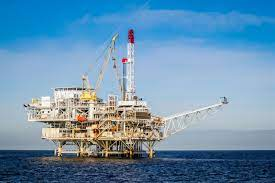
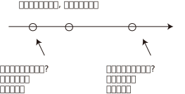
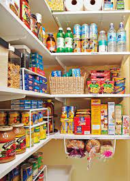

= step 2 - Lesson 18
:toc: left
:toclevels: 3
:sectnums:
:stylesheet: ../../+ 000 eng选/美国高中历史教材 American History ： From Pre-Columbian to the New Millennium/myAdocCss.css

'''

Lesson 18

==  part 1. 部分

Host (Michael Parkhurst): Good evening, and welcome again to the 'Michael Parkhurst Talkabout'. In tonight’s programme, we’re looking at the problem of energy. The world’s energy resources are limited. Nobody knows exactly how much fuel is left, but pessimistic 悲观的；悲观主义的 forecasts say that there is only enough coal for 450 years, enough natural gas for 50 years and that oil might run out in 30 years. Obviously we have to do something, and we have to do it soon!

[.my2]
主持人（迈克尔·帕克赫斯特）：晚上好，欢迎再次来到“迈克尔·帕克赫斯特谈话”。在今晚的节目中，我们正在研究能源问题。世界能源资源有限。没有人确切知道还剩下多少燃料，但悲观的预测称，煤炭仅够 450 年使用，天然气仅够 50 年使用，石油可能在 30 年内耗尽。显然我们必须做点什么，而且我们必须尽快做！

I’d like to welcome our first guest, Professor Marvin Burnham of the New England Institute of Technology. Professor Burnham.

[.my2]
我要欢迎我们的第一位客人，新英格兰理工学院的马文·伯纳姆教授。伯纳姆教授。

Prof. Burnham: Well, we are in an energy crisis and we will have to do something quickly. Fossil 化石 fuels (coal, oil and gas) are rapidly running out. The tragedy 悲剧,惨案 is that fossil fuels are *far too* valuable *to* waste on the production of electricity. Just think of all the things you can make from oil! If we don’t start conserving 节省；节约 these things now, it will be too late. And nuclear power is the only real alternative. We are getting some electricity from nuclear power stations already. If we *invest in* further research 进一步研究 now, we’ll be ready to face the future. There’s been a lot of protest (n.)抗议；抗议书（或行动）；反对 lately *against* nuclear power — some people will *protest (v.) at* anything — but nuclear power stations are not as dangerous as some people say. It’s far more dangerous /to work [down a coal mine] or [on a North Sea oil-rig 石油钻塔;钻井架]. Safety regulations in power stations are very strict.

[.my2]
伯纳姆教授：嗯，我们正处于能源危机中，我们必须迅速采取行动。化石燃料（煤炭、石油和天然气）正在迅速耗尽。悲剧在于化石燃料太有价值了，不能浪费在发电上。想想你可以用石油制造的所有东西！如果我们现在不开始保护这些东西，那就太晚了。核能是唯一真正的替代方案。我们已经从核电站获得了一些电力。如果我们现在投资于进一步的研究，我们就准备好面对未来。最近有很多针对核电的抗议活动——有些人会抗议任何事情——但核电站并不像有些人说的那么危险。在煤矿或北海石油钻井平台上工作要危险得多。发电厂的安全规定非常严格。

[.my1]
.案例
====
.oil-rig

====

If we spent money on research now, we could develop stations /which create their own fuel /and burn their own waste. In many parts of the world /where there are no fossil fuels, nuclear power is the only alternative. If you accept that /we need electricity, then we will need nuclear energy. Just imagine what the world would be like /if we didn’t have electricity — no heating, no lighting, no transport 交通运输系统, no radio or TV. Just think about the ways /you use electricity every day. Surely we don’t want to go back to the Stone Age. That’s what will happen /if we *turn our backs* （使）原路返回，往回走 on nuclear research.

[.my2]
如果我们现在花钱进行研究，我们就可以开发自己制造燃料并燃烧废物的发电站。在世界上许多没有化石燃料的地方，核能是唯一的选择。如果你承认我们需要电力，那么我们就需要核能。想象一下，如果我们没有电，世界会是什么样子——没有暖气、没有照明、没有交通工具、没有收音机或电视。想想你每天用电的方式。我们当然不想回到石器时代。如果我们放弃核研究，就会发生这种情况。

[.my1]
.案例
====
.turn back| turn sb/sth back
to return the way you have come; to make sb/sth do this（使）原路返回，往回走
====

Host: Thank you, Professor. Our next guest is a member of CANE, the Campaign Against Nuclear Energy, Jennifer Hughes.

[.my2]
主持人：谢谢教授。我们的下一位嘉宾是反对核能运动 CANE 的成员詹妮弗·休斯 (Jennifer Hughes)。

Jennifer Hughes: Right. I must *disagree* totally *with* Professor Burnham. Let’s look at the facts. First, there is no perfect machine. I mean, why do aeroplanes crash? Machines fail. People make mistakes. What would happen /if there were a serious nuclear accident? And an accident must be inevitable 不可避免的；不能防止的 — sooner or later. Huge areas would be evacuated 疏散；撤出；排泄. And they could remain contaminated with radioactivity 放射性，放射现象；放射物（或其辐射） for years. If it happened in your area, you wouldn’t get a penny 便士 in compensation. No insurance company covers (v.) nuclear risks. There are accidents. If the nuclear industry didn’t keep them quiet, there would be a public outcry 呐喊；怒吼；强烈的抗议. Radioactivity 放射性 causes (v.) cancer /and may affect future generations. Next, nuclear waste. There is no technology for absolutely safe disposal 去掉；清除；处理. Some of this waste 废料；废物；弃物；垃圾 will remain active (a.) for thousands of years. Is that what you want /to leave to your children? And their children’s children? A reactor 核反应堆 only lasts (v.) about 25 years. By the year 2000 /we’ll have 'retired' 26 reactors in the UK.

[.my2]
詹妮弗·休斯：对。我必须完全不同意伯纳姆教授的观点。让我们看看事实。首先，没有完美的机器。我的意思是，为什么飞机会坠毁？机器出现故障。人们会犯错误。如果发生严重的核事故会发生什么？事故是不可避免的——迟早会发生。大片地区将被疏散。而且它们可能会持续受到放射性污染多年。如果事情发生在你所在的地区，你不会得到一分钱的赔偿。没有保险公司承保核风险。有事故发生。如果核工业不让他们保持沉默，就会引起公众的强烈抗议。放射性会导致癌症，并可能影响后代。接下来是核废料。没有绝对安全处置的技术。其中一些废物将保持活性数千年。这就是你想留给孩子们的吗？他们的孩子的孩子呢？反应堆只能持续大约25年。到 2000 年，英国将“退役”26 座反应堆。

Next, terrorism 恐怖主义. Terrorists could hold the nation to ransom 赎金;（为某人）交付赎金 /if they captured a reactor. In the USA /the Savannah River plant 发电厂；工厂, and Professor Burnham knows this very well, lost (v.) (yes, 'lost') enough plutonium 钚（94号元素） between 1955 and 1978 /to make 18 (18!) atom bombs 原子弹. Where is it? Who’s got it? I consider that /nuclear energy is expensive, dangerous, and evil, and most of all, absolutely unnecessary. But Dr. Woodstock will be saying more about that.

[.my2]
接下来是恐怖主义。如果恐怖分子占领了一座反应堆，他们可能会勒索整个国家。伯纳姆教授非常清楚，美国萨凡纳河工厂在 1955 年至 1978 年间损失了（是的，“损失”）足够的钚来制造 18（18！）颗原子弹。它在哪里？谁得到了它？我认为核能是昂贵的、危险的、邪恶的，而且最重要的是，绝对没有必要。但伍德斯托克博士将会对此进行更多阐述。

Host: Thank you Jennifer. Now I’m very pleased to welcome Dr. Catherine Woodstock. She is the author of several books on alternative technology.

[.my2]
主持人：谢谢詹妮弗。现在我非常高兴地欢迎凯瑟琳·伍德斯托克博士。她是多本有关替代技术的书籍的作者。

Catherine Woodstock: Hello. I’d like to begin /by agreeing with Jennifer. We can develop alternative sources of power, and unless 除非 we try /we’ll never succeed. Instead of burning fossil fuels /we should be concentrating on more economic uses of electricity, because electricity can be produced from any source of energy. If we didn’t waste so much energy, our resources would last longer. You can save more energy by conservation 节约,保护 than you can produce for the same money. Unless we do research on solar energy, wind power, wave power, tidal power, hydroelectric 水力发电的；水电治疗的 schemes etc, our fossil fuels will run out, and we’ll all freeze (v.)极冷；（使）冻死 or starve (v.) to death. Other countries are spending much /more than us on research, and don’t forget that energy from the sun, the waves and the wind lasts (v.) for ever. We really won’t survive /unless we start working on cleaner, safer sources of energy.

[.my2]
凯瑟琳·伍德斯托克：你好。首先我同意詹妮弗的观点。我们可以开发替代能源，但除非我们尝试，否则永远不会成功。我们不应该燃烧化石燃料，而应该专注于更经济地利用电力，因为电力可以由任何能源产生。如果我们不浪费那么多能源，我们的资源就会持续更长时间。通过节约，您可以节省比用同样的钱生产的能源更多的能源。除非我们对太阳能、风能、波浪能、潮汐能、水力发电等进行研究，否则我们的化石燃料将会耗尽，我们都会被冻死或饿死。其他国家在研究上的投入比我们多得多，并且不要忘记来自太阳、海浪和风的能量是永恒的。除非我们开始研究更清洁、更安全的能源，否则我们真的无法生存。

Host: Thank you very much, Dr. Woodstock. Our final speaker, before we open the discussion to the *studio （广播、电视的）录音室，录像室，演播室，制作室；（音乐）录音棚 audience* 现场观众, is Charles Wicks, MP, the Minister for Energy.

[.my2]
主持人：非常感谢伍德斯托克博士。在向演播室观众开放讨论之前，我们的最后一位发言者是国会议员、能源部长查尔斯·威克斯 (Charles Wicks)。

Charles Wicks: I’ve been listening to the other speakers with great interest. By the way, I don’t agree with some of the estimates of world energy reserves. More oil and gas is being discovered all the time. If we listened to the pessimists 悲观主义者 (and there are a lot of them about) /none of us would sleep at night. In the short term, we must continue to rely on the fossil fuels — oil, coal and gas. But we must also look to the future. Our policy must be flexible 灵活的；柔韧的，易弯曲的. Unless we thought new research was necessary, we wouldn’t be spending money on it. After all, the Government wouldn’t have a Department of Energy /unless they thought it was important. The big question is /where *to spend* the money — *on* conservation 保存；节约 of present resources /or *on* research into new forms of power. But I’m fairly 相当地，颇 optimistic 乐观的，乐观主义的. I wouldn’t be in this job unless I were an optimist 乐观主义者，乐天派!

[.my2]
查尔斯·威克斯：我一直饶有兴趣地听其他演讲者的发言。顺便说一下，我不同意一些对世界能源储量的估计。更多的石油和天然气一直在被发现。如果我们听从悲观主义者（这样的人有很多）的话，我们晚上就不会睡觉了。短期内，我们必须继续依赖化石燃料——石油、煤炭和天然气。但我们也必须展望未来。我们的政策必须灵活。除非我们认为有必要进行新的研究，否则我们不会在上面花钱。毕竟，政府不会设立能源部，除非他们认为能源部很重要。最大的问题是把钱花在哪里——保护现有资源还是研究新的能源形式。但我相当乐观。除非我是一个乐观主义者，否则我不会从事这份工作！

'''

== part 2. 部分

Mal Carrington: Good morning. Welcome to "The years 后定向前推进 to Come". I’m Mal Carrington, and every week at this time /Channel 5 brings you information on *life in the future* /from an expert in the field.

[.my2]
马尔·卡林顿：早上好。欢迎来到“未来的岁月”。我是马尔·卡林顿，每周的这个时间，第五频道都会为您带来来自该领域专家的有关未来生活的信息。

Today’s expert is Dr Reginald Healy from MIT, the famous Massachusetts Institute of Technology. Good morning, Dr Healy. Welcome to The years to come.

[.my2]
今天的专家是来自著名的麻省理工学院MIT的Reginald Healy博士。早上好，希利博士。欢迎来到未来的岁月。

Dr Healy: Thank you.

[.my2]
希利博士：谢谢。

Mal Carrington: Well, what are your predictions 预测，预言 about the world? What is it going to be like /in the year 2000?

[.my2]
马尔·卡林顿：那么，您对世界有何预测？ 2000年会是什么样子？

Dr Healy: Hum, if present trends continue, I’m afraid the world in 2000 will be more crowded and more polluted /*than* the world we live in now.

[.my2]
希利博士：嗯，如果目前的趋势继续下去，恐怕 2000 年的世界将比我们现在生活的世界更加拥挤、污染更加严重。

Mal Carrington: Yes, however, food production is constantly increasing. Don’t you think we will be able to cope with the increase 后定向前推进 in world population?

[.my2]
马尔·卡林顿：是的，但是粮食产量正在不断增加。您不认为我们能够应对世界人口的增长吗？

Dr Healy: I don’t think so. *Even though* production is constantly increasing, the people of the world /will be poorer *than* they are today. For hundreds of millions of the desperately (ad.)绝望地，拼命地，不顾一切地；非常，极其 poor, the supply of food and other necessities of life /will not be any better. And for many /they will be worse, unless the nations of the world do something /to change the current trends.

[.my2]
希利博士：我不这么认为。尽管产量不断增加，但世界人民仍将比今天更加贫穷。对于数亿赤贫者来说，食物和其他生活必需品的供应也不会好到哪里去。对于许多人来说，情况会更糟，除非世界各国采取行动改变当前的趋势。

Mal Carrington: What is your estimate of world population /in AD 2000.

[.my2]
Mal Carrington：您对公元 2000 年世界人口的估计是多少？

Dr Healy: Well, already, world population is about 5,000 million. If present trends continue, that is  独立主格结构 *#with#* the number of births [by far] *exceed##ing##* (v.) the number of deaths in 2000 /`主` the world population `谓` could approach 6,500 million people.

[.my2]
希利博士：嗯，世界人口已经大约有 50 亿。如果目前的趋势持续下去，即2000年出生人数远远超过死亡人数，世界人口可能接近65亿。

Mal Carrington: How many people are born every day?

[.my2]
马尔·卡林顿：每天有多少人出生？

Dr Healy: About 250 every minute, but only 100 people die. This means there is an increase of 216,000 people per day, and `主` ninety per cent of this increase `系`  *is* in the poorest countries.

[.my2]
Healy 博士：每分钟大约有 250 人死亡，但只有 100 人死亡。这意味着每天增加 216,000 人，其中 90% 是在最贫穷的国家。

Mal Carrington: That’s worrying! And what about energy? Will there be enough oil /to satisfy our needs in the year 2000?

[.my2]
马尔·卡林顿：这令人担忧！那么能源呢？ 2000年会有足够的石油满足我们的需要吗？

Dr Healy: During the 1990s, world oil production will reach the maximum /and the price of oil will begin to increase. At the end of the century, the available supplies will not be sufficient for our needs. So *at least* part of these needs /will *have to be met* by alternative sources of energy.

[.my2]
希利博士：20世纪90年代，世界石油产量将达到最高水平，石油价格将开始上涨。到本世纪末，可用的供应将不足以满足我们的需要。因此，至少部分需求必须通过替代能源来满足。

Mal Carrington: Yes, water is becoming a problem too.

[.my2]
马尔·卡林顿：是的，水也正在成为一个问题。

Dr Healy: Yes, unfortunately. Water shortage will become more severe in the future, and due to the increase of births /there will be enough water *only for* half of the population.

[.my2]
希利博士：是的，不幸的是。未来水资源短缺将更加严重，由于出生人口的增加，水资源只能满足一半人口的需求。

Mal Carrington: Which of the present trends /do you think will continue (v.) over the next decade?

[.my2]
Mal Carrington：您认为当前的哪些趋势将在未来十年持续下去？

Dr Healy: Well, *significant 有重大意义的；显著的 loss* of the world’s forests will continue /over the next ten years /as the demand for wood for fuel and manufacturers 制造商 increases. Also atmospheric concentration 浓度；含量 of carbon dioxide and other chemicals /is expected to increase /*at rates* that could alter (v.) the world’s climate /due to the 'greenhouse effect'.

[.my2]
希利博士：嗯，随着燃料和制造商对木材的需求增加，未来十年世界森林将继续遭受重大损失。此外，大气中二氧化碳和其他化学物质的浓度预计也会增加，从而可能因“温室效应”而改变世界气候。

Mal Carrington: The 'greenhouse effect'? Could you explain /what the 'greenhouse effect' is?

[.my2]
马尔·卡林顿：“温室效应”？您能解释一下什么是“温室效应”吗？

Dr Healy: Sure. Well, the amount of carbon dioxide in the air /is progressively 渐进地；日益增多地 increasing /and it traps (v.)使落入险境；使陷入困境;收集；吸收 more of the heat of the sun /in the lower atmosphere. This has a warming effect /which could change the climate /and even melt the polar *ice caps* 冰帽, which would cause disastrous 灾难性的，使损失惨重的；极失败的，很糟的 flooding.

[.my2]
希利博士：当然。空气中二氧化碳的含量逐渐增加，它在低层大气中捕获了更多的太阳热量。这会产生变暖效应，可能改变气候，甚至融化极地冰盖，从而导致灾难性的洪水。

[.my1]
.案例
====
.ice cap
a layer of ice permanently covering parts of the earth, especially around the North and South Poles（尤指北极和南极的）冰冠 +
====

Mal Carrington: I see. Is this the only effect of carbon dioxide?

[.my2]
马尔·卡林顿：我明白了。这是二氧化碳的唯一作用吗？

Dr Healy: No, it isn’t. `主` Carbon dioxide and other chemicals /which derive (v.)从…衍生出；起源于；来自 from the use of fossil fuels /`谓` will also increase the quantity 数量；数额；数目 of acid rain /which is already damaging or even destroying plants, trees and other parts of our environment. Also, there will be a dramatic increase in the number of species becoming extinct. Hundreds of thousands of species will be lost because of the loss of their habitat.

[.my2]
希利博士：不，不是。使用化石燃料产生的二氧化碳和其他化学物质也会增加酸雨的数量，而酸雨已经损害甚至摧毁了植物、树木和我们环境的其他部分。此外，灭绝的物种数量也会急剧增加。数十万物种将因其栖息地的丧失而消失。

[.my1]
.案例
====
....of acid rain /which...
#从这里可以看出, 英文你在说一句话的过程中, 如果还想对里面的某个事物进行扩展说明, 就可以用后置定语从句来继续说明. 如果你不想说明任何东西了, 就直接结束你的话语就行了. 很灵活. 就像插头一样, 即插即拔. 后置定语你想插就插.# +

====

Mal Carrington: That’s appalling 令人震惊的；使人惊骇的；极为恶劣的! What about nuclear plants? Aren’t they a constant menace (n.)威胁；危险的人（或物） to life on our planet?

[.my2]
马尔·卡林顿：这太可怕了！核电站呢？它们不是对我们星球上的生命, 构成持续的威胁吗？

[.my1]
.案例
====
.menace
-> 来自拉丁语minari,突出，升出，来自PIE*men,突出，升出，词源同mountain,minatory.引申词义威胁。
====

Dr Healy: Definitely (ad.)肯定地，当然. And *apart from* 除了……之外 the more obvious danger of accidents, like the one at Chemobyl, there’s the problem of the disposal of nuclear waste, that is the waste /which is produced by nuclear power stations.

[.my2]
希利博士：当然。除了像"切尔诺贝利"那样的更明显的事故危险之外，还有核废料的处理问题，即核电站产生的废料。

Mal Carrington: Oh, yes. I know that /some of the materials keep their radioactivity 放射现象;放射物（或其辐射） for hundreds or thousands of years.

[.my2]
马尔·卡林顿：哦，是的。我知道有些材料的放射性可以保持数百年或数千年。

Dr Healy: Yeah, for example, strontium 锶 90 needs storing (v.) for 500 years, being kept cool /all the time. Plutonium-239 钚 may need storing (v.) for *up to* half a million years!

[.my2]
Healy 博士：是的，例如，锶 90 需要储存 500 年，并且始终保持低温。钚239可能需要储存长达50万年！

[.my1]
.案例
====
.Strontium
锶 sī. 锶元素广泛存在在土壤、海水中，是一种微量元素. 同位素90锶, 有放射性，半衰期是28.1年，可作β射线放射源。 +
Strontium-90, 即 latexmath:[ ^{90}.Sr], 存在于核爆炸的辐射微尘中, 是一种强烈的污染源。
====

Mal Carrington: So, what is going to happen to the Earth /in the next few years? Will we be able *to reverse (v.)颠倒；彻底转变；使完全相反 this trend* towards destruction 破坏，摧毁? What is your prediction?

[.my2]
马尔·卡林顿：那么，未来几年地球会发生什么？我们能够扭转这种破坏趋势吗？你的预测是什么？

Dr Healy: Well, I don’t want to be pessimistic 悲观的，悲观主义的, but I’m afraid that /if this trend doesn’t change (v.) within five or ten years /we won’t be able to do very much to save the earth.

[.my2]
希利博士：嗯，我不想悲观，但我担心如果这种趋势在五年或十年内不改变，我们将无法为拯救地球做太多事情。

Mal Carrington: Well, that’s a warning that /we all need to take seriously. And with that warning, we end (v.) *part one* 第一部分 of this week’s _The years to come_. We’ll be back /soon after the break.

Mal Carrington: Here we are again with "The years to Come". Now I’d like to tell you about /and to show you the pictures of an exciting new project /which is the result of the cooperation 合作，协作 of scientists, engineers and technicians /from virtually 事实上，几乎 all over the world.

[.my2]
马尔·卡林顿：嗯，这是一个我们都需要认真对待的警告。带着这个警告，我们结束了本周“未来几年”的第一部分。休息后我们很快就会回来。 +
马尔·卡林顿：我们又来了“未来的岁月”。现在我想向您介绍, 并向您展示一个令人兴奋的新项目的图片，该项目是来自几乎世界各地的科学家、工程师和技术人员合作的成果。

'''

== part 3. 部分

Towards the end of the 90s, a bright new celestial (a.)天空的；天上的 body /will appear in the night sky /like an immense 极大的；巨大的 shining star, fully visible from 38 degrees north or south of the equator. It will be a space station, Freedom. `主` The idea for Freedom `谓` originated in the USA, but `主` eleven other nations `谓` have agreed to contribute a few of the station’s many parts.

[.my2]
到了90年代末，一颗明亮的新天体将出现在夜空中，就像一颗巨大的闪亮恒星，从赤道以北或以南38度都可以完全看到。这将是一个空间站，自由号。自由的想法起源于美国，但其他 11 个国家已同意贡献该站的许多部分中的一些部分。

[.my1]
.案例
====
.celestial +
( formal ) ( literary) of the sky or of heaven天空的；天上的 +
-> 来自拉丁词caelum, 天空，最终来自PIE*kaid,*skai, 照耀，明亮，词源同candle, shine. +
词源解释：celest ←拉丁语caelum（天） 同源词：Selina（赛琳娜←天国似的，美好的）；celeste（天蓝色的） 词组习语：celestial body（天体）；celestial being（神灵）；celestial movement（天体运动）
====

The space station *is not going to* be launched into orbit （天体等运行的）轨道 *in one piece* 完好无损 — `主` the thousands of parts which make up Freedom /`谓` are going to *be assembled (v.)装配；组装 directly* in space.  +
Twenty trips （尤指短程往返的）旅行，旅游，出行 by the shuttle and two rockets /will be needed /*to deliver* 递送；传送 Freedom, piece by piece, *into* a low orbit around the Earth.  +
Then, 250 miles above the Earth, construction crews 建筑队伍 are going to bolt (v.)用螺栓把（甲和乙）固定在一起 together the space station’s many components. +

The first batch 一批，一批生产量 of parts *is going to be launched* in 1995. +
By the end of 1996, the first crew （轮船、飞机等上面的）全体工作人员 of eight /is going to enter the living module (组件；模块；配件;（航天器上独立的）舱) 生活舱 to begin what NASA hopes will be a continuous 不断的；持续的；连续的 human presence in space.  +

The station has been designed /to remain occupied (a.)使用中；有人使用（或居住） and operational (a.)操作的；运转的；运营的；业务的;可使用 /for *up to* thirty years — a whole generation of living in space. +
Considering that /`主` the first man-made object `谓` reached orbit just thirty years ago, that will be quite an accomplishment.  +

The design of a space station /must #*combine*# the excitement 激动；兴奋；刺激 of space #*with*# the necessity for safety and comfort. Freedom will be the best solution [*to date*] 迄今，到现在为止 /and will also be the most complex computerized 电脑化的;用电子计算机控制 house ever built — *either* on Earth *or* in space.

There will be accommodation 住宿；膳宿 for eight people /and each crew member will have his or her own room, a shower, a toilet, exercise 运动，锻炼 equipment, a washing machine, a pantry 食品贮藏室；食品贮藏柜, and a sick bay (分隔间（户外或室内的，用以停放车辆、存放货物等）) 船上的医务室.

*#Add#* a television, video, phone and computer *#to#* each of the eight private sleeping rooms, then *top it off 以…圆满结束；用…完成 /with* the best view on Earth. Is this some wild new 'luxury house' of the future? Exactly. Life on board will also *be brightened* （使）更明亮，色彩鲜艳 by a plan /后定向前推进 *#to fill#* twenty percent of the larder （尤指旧时的）食物橱柜，食物贮藏室 *#with#* fresh refrigerated 冷冻的，冷却的 fruit, vegetable and dairy products.

[.my2]
====
空间站不会被整块发射进入轨道——构成自由号的数千个部件将直接在太空中组装。航天飞机和两枚火箭需要进行二十次飞行才能将自由号一点一点送入绕地球的低轨道。然后，在距离地球 250 英里的地方，施工人员将把空间站的许多部件用螺栓固定在一起。第一批部件将于 1995 年发射。到 1996 年底，第一批 8 名宇航员将进入生活舱，开始 NASA 希望人类在太空中持续存在的事业。

该空间站的设计, 可保持使用和运行长达三十年——整整一代人都生活在太空中。考虑到第一个人造物体在三十年前才进入轨道，这将是一项相当大的成就。空间站的设计必须将太空的刺激性与安全性和舒适性的必要性结合起来。自由将是迄今为止最好的解决方案，也将是有史以来建造的最复杂的计算机化房屋——无论是在地球上还是在太空中。

船上将容纳八人，每位船员都有自己的房间、淋浴、厕所、健身器材、洗衣机、食品储藏室和医务室。八个私人卧室均配备电视、视频、电话和电脑，并享有地球上最好的景观。这是未来疯狂的新“豪华住宅”吗？确切地。船上 20% 的食品储藏室里, 装满新鲜冷藏水果、蔬菜和乳制品的计划, 也将让船上的生活变得更加美好。
====

[.my1]
.案例
====
.pantry

.top sth off (with sth)
to complete sth successfully by doing or adding one final thing以…圆满结束；用…完成
====

Behind every space station `谓` lies the dream /that is at least 120 years old: a colony 殖民地 in space. Freedom is not going to be that colony, for it will always *depend on* the Earth for supplies. But it is going to be the place /where scientists discover how to establish healthy and productive human habitation 住处；住所；聚居地 in space. When new technology is developed /to make it less risky, we will see more civilians 平民 in space. So an eighteen-year-old can *look forward to* 期待 visiting space /by his or her sixty-eighth birthday, in 2050.

[.my2]
每个空间站背后都蕴藏着至少 120 年的梦想：太空殖民地。自由不会成为那个殖民地，因为它将永远依赖地球提供供给。但它将成为科学家探索如何在太空建立健康和富有成效的人类居住地的地方。当新技术的开发降低了风险时，我们将在太空中看到更多的平民。因此，一个 18 岁的年轻人可以期待在 2050 年他或她 68 岁生日之前访问太空。

And that’s the end of this week’s programme. *Tune in* 收听（收音机广播节目）；收看（电视节目） next week *for* another edition of _The years to come_. The years to come is a Channel 5 production /and this is Mal Carrington.

[.my2]
这就是本周节目的结尾。下周请收听另一期的《未来岁月》。未来几年是第五频道的制作，我是马尔·卡林顿。

[.my1]
.案例
====
.tune ˈin (to sth)
to listen to a radio programme or watch a television programme收听（收音机广播节目）；收看（电视节目）
====

'''

== part 4. 部分

Two years ago, …​ when I landed on your soil, I said to the people of the Philippines. 'Whence 从何处；从哪里 I came /I shall return.' Tonight, I repeat those words. I shall return. (Douglas MacArthur 17/03/44)

[.my2]
两年前，……​当我降落在你们的土地上时，我对菲律宾人民说。 “我从哪里来，我就会回来。”今晚，我重复这些话。我应该回来。 （道格拉斯·麦克阿瑟 2044 年 3 月 17 日）

I have a dream that /one day /on the red hills of Georgia, sons of former slaves and the sons of former slaveowners /will be able to sit down together /at the table of brotherhood.  +
I have a dream that /one day, even the state of Mississippi, `主` #a state# sweltering (v.a.)热得难受;闷热的；热得难受的 with the heat of injustice 不公正，无道义, sweltering with the heat of oppression 压迫，压制, `谓` #will# be transformed into an oasis （沙漠中的）绿洲 of freedom and justice.  +
I have a dream that /my four little children will one day live in a nation /where they will not be judged by the colour of their skin, but by the content of their character. (Rev. Martin Luther King, Jr. 28/08/63)

[.my2]
我有一个梦想，有一天，在佐治亚州的红色山丘上，前奴隶的儿子和前奴隶主的儿子将能够坐在兄弟情谊的餐桌旁。我有一个梦想，有一天，即使是密西西比州，一个充满不公正和压迫的州，也会变成一片自由和正义的绿洲。我有一个梦想，希望我的四个孩子有一天能够生活在一个国家，人们不再根据他们的肤色来评判他们，而是根据他们的性格内容来评判他们。 （马丁·路德·金牧师，2063 年 8 月 28 日）

One thought (v.) him 宾补 indestructible 不可毁灭的，不能破坏的, so over-powering 压倒性的；无法抵抗的 was he /in his energy, warmth 热情；友情 and his deep faith in man’s inherent goodness 善良；优良；美德. For 25 years /he had been my friend, my older brother, my inspiration 启发灵感的人（或事物）；使人产生动机的人（或事物） and my teacher. (Henry Kissinger 02/02/79)
[.my2]
人们认为他是坚不可摧的，他的能量、温暖和对人类与生俱来的善良的坚定信念, 是如此具有压倒性的力量。 25 年来，他一直是我的朋友、我的哥哥、我的灵感和我的老师。 （亨利·基辛格 02/02/79）

I have said this before, but I shall say it again, and again, and again.  Your boys are not going to be sent into any foreign wars. (Franklin D. Roosevelt 30/10/40)

[.my2]
我以前已经说过这句话，但我还要再说一遍、再说一遍、再说一遍。你的孩子们不会被派去参加任何外国战争。 （富兰克林·罗斯福 30/10/40）

I have never been a quitter 有始无终的人；虎头蛇尾的人；半途而废者. `主` To leave office *before my term is completed* /`系` is abhorrent (a.)（尤指因道德原因）令人憎恨的，令人厌恶的，令人憎恶的 to every instinct 本能；天性 in my body.  +
But, as President, I must *put the interests of* America *first*. America needs a full-time President and a full-time Congress.  +
Particularly at this time, with problems 后定向前推进 we face at home and abroad.  +
`主` To continue #*to fight*# [through the months ahead] #*for*# my personal vindication 辩护；证明无罪 /`谓` would almost totally absorb (v.) the time and attention /of both the President and the Congress /in a period 后定向前推进 when `主` our #entire focus# (n.)中心点（指人或事物） `谓` #should be# on *the great issues* of peace abroad /and prosperity 兴旺；繁荣；成功；昌盛 without inflation at home. (Richard M. Nixon 08/08/74)

[.my2]
我从来都不是一个放弃者。在我的任期结束之前离开办公室, 对我身体的每一种本能来说, 都是令人厌恶的。但是，作为总统，我必须把美国的利益放在第一位。美国需要一位全职总统和一位全职国会。特别是在当前，国内外都面临问题的情况下。在接下来的几个月里, 继续为我个人的辩护而奋斗, 几乎会完全占用总统和国会的时间和注意力，而此时我们的全部注意力应该集中在国外和平和国内繁荣的重大问题上。 （理查德·尼克松 08/08/74）

In the past several months /I have been living in purgatory (n.)炼狱;受难的处所（或状态）；惩戒所；折磨；磨难. I have found myself *the recipient 受方；接受者 of* undefined 不明确的；未下定义的, unclear, unattributed 不属于的 accusations 指控，指责 /that have surfaced (v.)升到水面；浮出水面;（隐藏或被掩盖一段时间后）露面，重新出现，显露，被披露 in the largest and the most widely *circulated 流通的 organs* （官方的）机构，机关;机关报刊；（某团体的）宣传工具 of our communications media 传播媒体；通信媒体. I want to say, at this point, clearly and unequivocally 明确地,不含糊地 : *I am innocent (a.)无辜的；清白的；无罪的 of* the charges against me. (Spiro T. Agnew 29/09/73)

[.my2]
这几个月我一直生活在炼狱里。我发现自己受到了不明确、不明确、不明来源的指控，这些指控出现在我们最大、传播最广泛的通讯媒体机构中。在这一点上，我想明确无误地说：我对针对我的指控是无辜的。 （斯皮罗·阿格纽 29/09/73）

'''

== part 5. 部分

*Killing Me Softly* With His Song

[.my2]
柔软的用他的歌杀掉我

I heard he sang a good song +
I heard he had a style +
And so /I came to see him /to listen for a while. +
And there he was this young boy

[.my2]
他就是这个小男孩

A stranger to my eyes

[.my2]
我眼中的陌生人

*Strumming 轻轻弹奏；漫不经心地弹奏 my pain* with his fingers

[.my2]
用他的手指弹奏我的痛苦

*Singing my life* with his words +
*Killing me softly* with his song +
Killing me softly with his song +
Telling my whole life with his words +
Killing me softly with his song +
I felt all flushed (a.)发红；脸红 with fever 发烧；发热;激动不安；兴奋紧张 +
Embarrassed by the crowd +
I felt he found my letters /and *read* each one *out* loud

[.my2]
我感觉他找到了我的信, 并大声朗读了每一封

I prayed that he would finish +
But he just *kept right on* 继续做某事 +
Strumming my pain with his fingers +
Singing my life with his words +
Killing me softly with his song +
Killing me softly with his song +
Telling my whole life with his words +
Killing me softly with his song +
He sang /*as if* he knew me in all my dark despair +
And then he looked right through me /as if I wasn’t there

[.my2]
然后他直视着我，就好像我不在那儿一样

And he just kept on singing +
Singing (v.) clear and strong +
Strumming my pain with his fingers +
Singing my life /with his words +
Killing me softly /with his song +
Killing me softly with his song +
Telling my whole life /with his words +
Killing me softly with his song

'''
