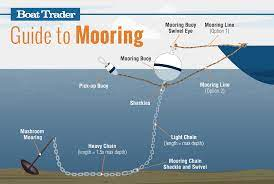
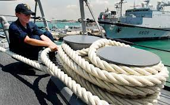

= step 2 - Lesson 20
:toc: left
:toclevels: 3
:sectnums:
:stylesheet: ../../+ 000 eng选/美国高中历史教材 American History ： From Pre-Columbian to the New Millennium/myAdocCss.css

'''

Lesson 20

== part 1. 部分

Principal 大学校长；学院院长: Well it looks to me /as if we shall have to fit him in somewhere. What does Monday morning look like?

[.my2]
校长：嗯，看起来我们似乎得在某个时间段安排他。周一早上的情况怎么样？

Secretary: Well, Monday morning is extremely busy. You’ve got all the short list interviews.

[.my2]
秘书：噢，周一早上非常忙碌。您有所有入围名单的面试。

Principal: Oh goodness. And how long do they go on for?

[.my2]
校长：哦天啊。那得持续多久？

Secretary: Well, the last one is due (a.)预定；预期；预计 at …​ to come at 10 o’clock /and will probably go on through until 10:30.

[.my2]
秘书：最后一位预计在10点到达，可能会一直持续到10:30。

Principal: And then?

[.my2]
校长：然后呢？

Secretary: Then you’ve got your Japanese agent /and you did tell him you’d probably take him out to lunch.

[.my2]
秘书：然后您有您的日本代理商，您告诉过他您可能会请他吃午饭。

Principal: Yes, well can’t *pass that up* 放弃，不要（机会等） …​ erm …​ what’s Tuesday morning look like?

[.my2]
校长：是的，好吧，不能放过那个... 嗯... 周二早上的情况怎么样？

[.my1]
.案例
====
.pass sth←→ˈup
( informal ) to choose not to make use of a chance, an opportunity, etc.放弃，不要（机会等） +
• Imagine *passing up an offer* like that! 真想不到居然放弃人家提供的大好机会！
====

Secretary: Tuesday morning is also very full. You’ve got a committee meeting, starts at 9:30 /probably won’t finish until 12:30.

[.my2]
秘书：周二早上也很满。您有一个委员会会议，从9:30开始，可能要持续到12:30。

Principal: Huh-Huh. And lunch?

[.my2]
校长：嗯嗯。午餐呢？

Secretary: Lunch is with your publisher.

[.my2]
秘书：午餐是和您的出版商的会面。

Principal: Oh yes. And I do remember that /I’ve got something in the afternoon …​ erm …​ from the examining board 考试委员会, haven’t I? I’ve got…​

[.my2]
校长：哦是的。而且我记得下午还有什么事... 嗯...关于考察委员会的，对吧？我有...

Secretary: Yes. At 2:30. You’re expecting the *chief (a.)首要的，主要的 examiner* 审查人；检查人 (Oh) /状 regarding 关于；至于 the *review 评审，审查，检查，检讨（以进行必要的修改） report*.

[.my2]
秘书：是的。在2:30。您预计主考官（噢）会就审核报告进行讨论。

Principal: Oh yes. And I’ve got …​ I’ve got somebody’s parents coming.

[.my2]
校长：哦是的。而且我还有...我还有某个学生的父母要来。

Secretary: Yes, at 4 o’clock /Johan Blun’s parents are coming.

[.my2]
秘书：是的，在4点，Johan Blun的父母要来。

Principal: And there …​ isn’t there a meeting, a principal’s meeting after …​ anyway he didn’t want to be that late …​ erm …​ well, let’s have a look at Monday afternoon. What have we got then?

[.my2]
校长：还有...在那之后不是有一个校长会议... 无论如何，他不想太晚... 嗯...咱们看看周一下午的情况。那时有什么安排？

Secretary: Well the lunch with the Japanese agent 代理人，经纪人 is probably likely to last (v.) until 2:30. (Mm-Mm) At 2:30 you’ve got the lawyer /regarding the *planning permission* 规划许可；建筑（或改建）许可.

[.my2]
秘书：和日本代理商的午餐可能会一直持续到2:30。 （嗯嗯）在2:30，您有要和律师见面, 谈"关于规划许可"的事情。

Principal: Oh, I’ve …​ yes …​ and?

[.my2]
校长：噢，是的...然后呢？

Secretary: Well at 3:30 /there’s a tutorial (n.)（大学导师的）个别辅导时间，辅导课 with Maria Rosa …​

[.my2]
秘书：嗯，在3:30有一个和Maria Rosa的辅导...

Principal: Oh well *hang on* 等一下；停一下  …​ erm …​ look what we can do …​ you …​ if you could give the lawyer a ring /and ask him if he #can fix# 决定，确定（日期、时间、数量等）;安排；组织 it, #the appointment# 约会；预约；约定, for Wednesday /and if he can’t make Wednesday, later in the week.  It’s not absolutely vital (v.)必不可少的；对…极重要的 that I should do it then.  +
And give Maria Rosa a ring also /if you can contact her, otherwise you can tell her /when she arrives /and …​ erm …​ I can give I can definitely give her …​ I’ve got Wednesday clear, haven’t I? So …​ erm …​ (Yes) I can give her a tutorial on Wednesday morning (Yes) /and that gives us two hours /so you could ring the Cultural Council （顾问、立法、研究、基金等）委员会 and fix it for then. His name’s Mr. Dennis I think, isn’t it?

[.my2]
校长：噢等等... 嗯...我们能做些什么... 你...如果你能给那位律师打个电话，问问他是否可以将预约安排在周三，如果周三不行，看看是否能安排在这周后期。我并不是非得在那个时间做这件事。还有，如果你能联系上Maria Rosa，就给她打个电话，否则她来了你就告诉她... 嗯...我肯定可以给她...我周三是清闲的，对吧？那么...（是的）我可以在周三上午给她辅导（是的），这样我们就有两个小时了，所以你可以给文化委员会打个电话，安排在那个时间。他的名字是Dennis先生，对吧？

Secretary: Yes. So I’ll ring him /and tell him you’re expecting him /at 2:30 on Monday afternoon.

[.my2]
秘书：是的。那么我会给他打电话，告诉他您在周一下午2:30等着他。

Principal: OK then.

[.my2]
校长：好的。

Secretary: Fine. Thank you.

[.my2]
秘书：好的。谢谢。

'''

== part 2. 部分

At 7:20 pm 下午 on May 6th 1937, the world’s largest airship 飞艇, the Hindenburg, floated majestically 雄伟地，庄严地；威严地 over Lakehurst airport, New Jersey, after an uneventful 平凡的；平静无事的 crossing (v.)穿越；越过；横过；渡过 from Frankfurt, Germany.  +
There were 97 people on board /for the first Atlantic crossing of the season.  +
There were a number of journalists waiting to greet 欢迎；迎接 it.  +
Suddenly radio listeners heard the commentator 现场解说员，实况播音员 screaming 尖叫 'Oh, my God! It’s broken into flames 火焰；火苗. It’s flashing （使）闪耀，闪光 …​ flashing. It’s flashing terribly.'  +
32 seconds later /the airship had disintegrated (v.)碎裂；解体；分裂;瓦解；崩溃 and 35 people were dead. The Age of the Airship was over.

[.my2]
1937 年 5 月 6 日晚上 7 点 20 分，世界上最大的飞艇兴登堡号从德国法兰克福平安无事地飞过新泽西州莱克赫斯特机场。船上共有 97 名乘客，这是本赛季首次横渡大西洋。现场还有不少记者在等候迎接。突然，广播听众听到解说员尖叫道：“哦，天哪！”它已经分解成火焰。它在闪烁……​闪烁。它闪烁得可怕。 32秒后，飞艇解体，造成35人死亡。飞艇的时代结束了。

[.my1]
.案例
====
.disintegrate
-> dis-, 不，非，使相反。integrate, 连接，一体。
====

The Hindenburg was the last (n.)/in a series of airships /which had been developed over 40 years /in both Europe and the United States.  +
They were designed to carry passengers and cargo over long distances.  +
The Hindenburg could carry 50 passengers /后定向前推进 accommodated (v.)容纳；为…提供空间 in 25 luxury cabins /with all the amenities (n.)生活福利设施；便利设施 of a first class hotel.  +
All the cabins （轮船上工作或生活的）隔间;（飞机的）座舱 had hot and cold water and electric heating 电热装置.  +
There was a dining-room, a bar and a lounge （旅馆、俱乐部等的）休息室;（私宅中的）起居室 with a dance floor and a *baby grand 壮丽的；堂皇的；重大的 piano* 小型三角钢琴.  +
The Hindenburg had been built /*to compete (v.)竞争；对抗 with* the great luxury transatlantic 横渡大西洋的；横越大西洋的 liners.  +
It was 245 metres 米 long /*with a diameter 直径；对径 of* 41 metres.  +
It could cruise (v.)以平稳的速度行驶 /at a speed of 125 km/h, and was able to cross the Atlantic /in *less than* 少于；不到；不足 half the time of a liner. +
By 1937 /it had carried 1,000 passengers safely /and had even transported circus 马戏团 animals and cars.  +
Its sister ship, the Graf Zeppelin, had flown 飞行（fly的过去分词） one and a half million kilometres /and it had carried 13,100 passengers without incident.

[.my2]
兴登堡号是欧洲和美国 40 多年来开发的一系列飞艇中的最后一款。它们的设计目的是长距离运送乘客和货物。兴登堡号可容纳 50 名乘客，分布在 25 间豪华客舱内，配备一流酒店的所有设施。所有的小屋都有冷热水和电暖气。这里有餐厅、酒吧和带舞池和小型三角钢琴的休息室。兴登堡号的建造目的是为了与伟大的豪华跨大西洋客轮竞争。它长245米，直径41米。它的巡航速度可达 125 公里/小时，穿越大西洋的时间不到客轮的一半。到 1937 年，它已经安全载运了 1,000 名乘客，甚至还运输了马戏团的动物和汽车。它的姊妹船齐柏林伯爵号已经飞行了 150 万公里，载运了 13,100 名乘客，没有发生任何事故。

[.my1]
.案例
====
.amenity
-> 来自词根am，爱，愉悦。令人愉悦的（设施）。

.lounge
-> 可能来自法语allonger,逗留，停留，来自al-,向，long,长的，长时间的。引申词义停留，逗留，休息。用于指休息厅，候机厅，酒吧等。

.baby grand piano

====

The Hindenburg was filled with hydrogen 氢，氢气, which is a highly flammable 易燃的；可燃的；可燃性的 gas, and every safety precaution 预防措施，防备 had been taken /to prevent accidents.  +
It had a smoking room /which was pressurized (v.)增压；密封；使……加压 /in order *to prevent* gas *from* ever 不断地；总是；始终;在任何时候，从来 entering it.  +
The cigarette lighters 打火机 *were chained 用锁链拴住（或束缚、固定） to* the tables /and both passengers and crew *were searched for* matches /before entering the ship.  +
Special materials, which were used (v.) in the construction of the airship, had been chosen /to minimize (v.) the possibility of accidental sparks, which might cause (v.) an explosion.

[.my2]
兴登堡号充满了氢气，这是一种高度易燃气体，我们已采取一切安全预防措施来防止事故发生。它有一个吸烟室，该吸烟室经过加压，以防止气体进入其中。打火机被拴在桌子上，乘客和船员在上船前都被搜查是否有火柴。飞艇的建造采用了特殊材料，以最大限度地减少意外火花的可能性，从而可能导致爆炸。

Nobody knows *the exact cause* 确切原因 of the Hindenburg disaster.  +
Sabotage (n.)蓄意毁坏 has been suggested 使想到；使认为；表明, but experts at the time believed that /it was caused by leaking gas /which was ignited (v.)（使）燃烧，着火；点燃 by *static electricity* 静电.  +
It had been waiting to land (v.)  for three hours /because of heavy thunderstorms.  +
The explosion happened /just as the first *mooring 停泊处；系泊区 rope* 系泊绳, which was wet, touched the ground.  +
Observers saw the first flames appear near the tail 尾部；后部, and they began to spread quickly /along the hull 船身；船体.  +
There were a number of flashes /as the hydrogen-filled compartments 分隔间，隔层 exploded.  The airship sank to the ground.  +
The most surprising thing is that /62 people managed to escape. The fatalities （事故、战争、疾病等中的）死亡 were highest /among the crew （轮船、飞机等上面的）全体工作人员, many of whom were working deep inside the airship.  +
After the Hindenburg disaster, all airships were grounded (v.)使停飞；阻止…起飞 /and, until recently, they have never *been seriously considered as* a commercial proposition 提议，建议（尤指业务上的）.

[.my2]
没有人知道兴登堡灾难的确切原因。有人提出有人蓄意破坏，但当时的专家认为这是由静电点燃气体泄漏造成的。由于雷暴天气，飞机已经等待着陆三个小时。爆炸发生在第一条潮湿的系泊绳接触地面时。观察者看到第一道火焰出现在尾部附近，并开始沿着船体迅速蔓延。当充满氢气的舱室爆炸时，发出多次闪光。飞艇沉入地面。最令人惊讶的是，有62人成功逃脱。船员中的死亡人数最高，其中许多人在飞艇深处工作。兴登堡灾难后，所有飞艇都被停飞，直到最近，它们从未被认真考虑作为商业提议。

[.my1]
.案例
====
.mooring
1.moorings[ pl.]the ropes, chains, etc. by which a ship or boat is moored 系泊用具 +
• The boat slipped its moorings and drifted out to sea.船的系泊绳索滑落，船漂向大海。

2.[C] the place where a ship or boat is moored 停泊处；系泊区

.mooring rope

====

'''

== part 3. 部分

David: Hello Peggy. What are you doing *going through* 仔细察看某事物；检查某事物；审查某事物;（尤指反复地）详细研究，仔细琢磨 all those newspapers?

[.my2]
大卫：你好，佩吉。你翻那些报纸干什么？

Peggy: Oh hallo （等于hello） David. I’m trying to find a flat /and I’ve got to *go through* all these advertisements. I just can’t find anything good.

[.my2]
佩吉：哦，大卫，你好。我正在寻找一套公寓，我必须浏览所有这些广告。我就是找不到什么好东西。

David: Are you wanting to share /or do you want a flat on your own?

[.my2]
大卫：你是想要合租, 还是想要自己住一套公寓？

Peggy: Well, you know Sara and Mary? I’d really like to share with them.

[.my2]
佩吉：嗯，你认识莎拉和玛丽吗？我真的很想与他们分享。

David: Well, I *know of* 知道,了解,听说过 an empty flat. I don’t know if you’d like it /though 不过，可是，然而. It’s on the number ten bus route /in Woodside Road. Number 10 I think it is.

[.my2]
大卫：嗯，我知道有一套空公寓。我不知道你是否愿意。它位于伍德赛德路 (Woodside Road) 的十号巴士路线上。 10号,我想是的。

Peggy: Oh, I know Woodside Road /and the ten bus is the one 后定向前推进 that brings me to work. Would be a marvellous 极好的，绝妙的；令人惊奇的，不同寻常的 place. How many rooms has it got?

[.my2]
佩吉：哦，我知道伍德赛德路，十路公交车是载我去上班的。将是一个奇妙的地方。它有多少个房间？

David: Well, it’s got a kitchen and a bathroom. Um, *apart from that* 除此之外 /I think it’s got two bedrooms and a sitting-room.

[.my2]
大卫：嗯，有厨房和浴室。嗯，除此之外我认为它还有两间卧室和一间客厅。

Peggy: Two bedrooms. Mm. Well, I suppose two of us could share, or one of us could sleep in the sitting-room. How much is the rent?

[.my2]
佩吉：两间卧室。毫米。好吧，我想我们两个人可以共用，或者我们一个人可以睡在客厅里。租金是多少？

David: I think they want ￡21 a week for it.

[.my2]
大卫：我想他们每周要 21 英镑。

Peggy: Twenty-one. Oh, that’s fine, that would be ￡7 each. I don’t really want to spend more than ￡7.

[.my2]
佩吉：二十一岁。哦，没关系，每个 7 英镑。我真的不想花超过 7 英镑。

David: No, but you see /the trouble is /it might be a bit noisy. Woodside Road is really quite busy. It’s on the bus route after all. *With* 因为；由于；作为…的结果 all that traffic going past /I don’t know if you’d really like it.

[.my2]
大卫：不，但你看，问题是它可能有点吵。伍德赛德路确实很繁忙。毕竟是在公交车路线上。由于交通繁忙，我不知道您是否真的喜欢它。

[.my1]
.案例
====
.with
because of; as a result of因为；由于；作为…的结果 +
• She blushed with embarrassment. 她难为情得脸红了。 +
• His fingers were numb with cold. 他的手指冻麻了。
====

Peggy: Oh, that doesn’t matter. We’d be out all day. It’d be marvellous /to be on the ten bus route, we wouldn’t have to walk at all /and we’d get to work so quickly. Oh thanks so much David. I must go and tell Sara and Mary.

[.my2]
佩吉：哦，那没关系。我们会整天出去。如果能在十路公交车路线上那就太棒了，我们根本不需要步行，而且我们很快就能上班。哦，非常感谢大卫。我必须去告诉萨拉和玛丽。

David: Well, I hope it’s what you want.

[.my2]
大卫：嗯，我希望这是你想要的。

Peggy: Oh yes, thanks a lot.

[.my2]
佩吉：哦，是的，非常感谢。

David: That’s all right.

[.my2]
大卫：没关系。

'''

== part 4. 部分

Rod: Mm, it’s not a bad size room, is it?

[.my2]
Rod: 嗯，这个房间大小还不错，对吧？

Liz: Oh, it’s great! It’s lovely. Oh, and look at that fireplace 壁炉! Oh, we can have the two chairs right in front of the fireplace there /in the middle of the room /and toast (v.)烤火；取暖；使暖和 our feet.

[.my2]
Liz: 噢，太好了！太美妙了。哦，看看那壁炉！哦，我们可以把两把椅子放在房间中间的壁炉前，烤烤脚。

Rod: The first thing we ought to do is /just decide where the bed’s going.

[.my2]
Rod: 我们首先要做的就是确定床要放在哪里。

Liz: Oh, well …​ (So) what about right here next to the door /(yes) *sort of* 有几分；有那么一点;（想不出恰当的词或不知下面该怎么说时用）可以说，可说是 behind the door /as you come in?

[.my2]
Liz: 噢，那么...（那么）就放在这儿，靠近门口（是的），就在门开的地方，你一进来就看到。

[.my1]
.案例
====
.sort of
( informal )
(1) to some extent but in a way that you cannot easily describe 有几分；有那么一点 +
• She *sort of* pretends that /she doesn't really care. 她摆出一副并不真正在乎的样子。 +
• ‘Do you understand?’ ‘*Sort of*.’ “你懂了吗？”“有点懂了。”

(2) ( also sort of like ) ( BrE informal ) used when you cannot think of a good word to use to describe sth, or what to say next （想不出恰当的词或不知下面该怎么说时用）可以说，可说是 +
• We're *sort of* doing it /the wrong way.我们的方法好像有点不对头。
====

Rod: Yes, that’s a good idea — just as you come in, just in that corner there.

[.my2]
Rod: 是的，这个主意不错——就在你一进来的时候，就在那个角落里。

Liz: Yes. Well now, let’s think. What else?

[.my2]
Liz: 是的。嗯，现在，让我们想想，还有什么？

Rod: What else is there? Erm …​ well there’s that huge wardrobe 衣柜，衣橱 of yours …​ /(Mm) that’s got to go somewhere.

[.my2]
Rod: 还有什么？嗯...嗯...还有你那个巨大的衣柜... （嗯）得找个地方放。

Liz: What about over here — you know — across from 在…对面 the fireplace there, because then, in that little corner /where it …​ where the wall goes back …​ look, over there. (Mm) That’d do, wouldn’t it?

[.my2]
Liz: 在这边怎么样——你知道——就在那壁炉的对面，因为那样，在那个小角落里，就是...墙往后退的地方...看，那边。（嗯）可以吧，是吧？

Rod: Ok, well we’ll put the wardrobe there then. (Yes) OK? So the wardrobe’s opposite 在对面，在对过 the fireplace.

[.my2]
Rod: 好吧，我们就把衣柜放那儿吧。（是的）好吗？所以衣柜在壁炉的对面。

Liz: Er …​ (OK) what about your desk? (Er) Where are you going to put that?

[.my2]
Liz: 嗯...（好）你的写字桌呢？（嗯）你打算放在哪里？

Rod: Er …​ I need lots of light, so I think /in that far corner in between the two windows, OK?

[.my2]
Rod: 嗯...我需要充足的光，所以我觉得在两个窗户之间的那个远处的角落，好吗？

Liz: Oh, I see in the corner there, (Yes) yes. (Erm) Yes, that’d be good.

[.my2]
Liz: 噢，我明白，在那个角落里（是的），是的。（嗯）那样挺好的。

Rod: So the desk goes there.

[.my2]
Rod: 所以写字桌就放在那儿。

Liz: So you’d have your chair with your back to the fireplace? (Yes) Yes, that’ll be all right.

[.my2]
Liz: 那么你会坐在那里，背对着壁炉吗？（是的）好吧，那没问题。

Rod: Yes. And there’s (yes) the chest of drawers.

[.my2]
Rod: 是的。还有（是的）抽屉柜。

Liz: Oh, that’d be nice /in between the two windows there, right in the middle. (Yes) It really …​ come on, I know you’re going to like it. (OK) Come on, let’s shove 猛推；乱挤；推撞  it over there. (I mean) I bet …​ I er …​

[.my2]
Liz: 噢，在两个窗户之间的那个角落里会很好，就在中间。（是的）真的...来吧，我知道你会喜欢的。（好吧）来吧，把它挪过去吧。（我是说）我敢打赌... 我，嗯...

Rod: I knew you’d ask me to move it.

[.my2]
Rod: 我知道你会叫我挪的。

Liz: Come on. Let’s go.

[.my2]
Liz: 来吧，我们走。

Rod: OK. Let’s go then. All right.

[.my2]
Rod: 好吧。那我们走吧。好吧。

Liz: Nearly there! That’s got it.

[.my2]
Liz: 差不多到了！搞定了。

Rod: God, what on earth have you got in there?

[.my2]
Rod: 天啊，你里面装了什么？

Liz: Well, there’s nothing much in there. I emptied it …​ most of it out.

[.my2]
Liz: 噢，里面没什么东西。我把大部分东西都倒出来了。

Rod: Oh God, my back hurts!

[.my2]
Rod: 哦天啊，我腰疼！

Liz: There! Wait a minute. Let me stand back /and have a look.

[.my2]
Liz: 好了！等一下。让我站远点看看。

Rod: Yes, it’s not bad …​ sticks out a bit.

[.my2]
Rod: 是的，还不错...有点突出。

Liz: No, it’s fine. (OK) What about the TV? Where are we going to put that?

[.my2]
Liz: 不，挺好的。（好吧）电视放哪儿？我们要把它放哪里？

Rod: Er …​ it’s really *got to* go /in the opposite corner, hasn’t it? (Mm) Opposite the desk, that is.

[.my2]
Rod: 嗯...它真的得放在对面的角落，不是吗？（嗯）也就是说，对着写字桌的对面。

Liz: Oh, you mean /in the corner between the windows and the fireplace? (Yes) Yes.

[.my2]
Liz: 噢，你是说在窗户和壁炉之间的角落吗？（是的）是的。

Rod: And then the stereo 立体声音响（或录音机等）, er …​ the amplifier 放大器；扩音器；扬声器 underneath 在…底下；隐藏（或掩盖）在下面 the television /and then the two speakers 扬声器；喇叭 /one on *either side of* the fireplace.

[.my2]
Rod: 然后音响，嗯... 放在电视下面的功放上，然后两个音箱一个在壁炉的一侧。

Liz: Yes, that’d be good. (Erm) Well lovely! So it’ll all fit in beautifully! (Yes) What else …​ what else have we got?

[.my2]
Liz: 是的，那挺好的。（嗯）太好了！所以一切都会很完美地放进去的！（是的）还有什么...我们还有什么？

Rod: It’s the er …​ there’s the bookcase 书柜，书架, isn’t there? Erm …​

[.my2]
Rod: 还有那个...书架，对吧？嗯...

Liz: Oh Lord …​ where’ll we put that?

[.my2]
Liz: 天啊...我们要把它放哪？

Rod: Well, as you come in the door, er …​ immediately on the er …​ left-hand side …​
Rod: 嗯，你一进门，就在左手边的那个，嗯... 墙边...

Liz: Oh *along* that wall there /you mean?

[.my2]
丽兹：哦，你是说沿着那面墙吗？

Rod: Because that’s …​ there’s just about enough space there. There’s about two feet, so it shouldn’t stick out too much, no.

[.my2]
Rod: 因为那儿差不多有足够的空间。大约有两英尺，所以它不应该太突出。

Liz: Yes, it’s not very wide is it? So you come in the door (Yes) /and then the bookcase is right there on the left. (Yes) There’s a long way from your desk, though.

[.my2]
Liz: 是的，宽度不是很大吧？你进门（是的），然后书架就在左边。（是的）离你的写字桌挺远的。

Rod: Well, exercise’ll do me good, won’t it? Er …​ table lamp. Well, we can just put that er …​

[.my2]
Rod: 嗯，运动对我有好处，对吧？那个... 台灯。好吧，我们可以把它放在... 嗯...

Liz: On the chest （常为木制的）大箱子;胸部；胸膛 of drawers. (Yes) When it’s …​ (Mm) Yes. That’d be nice.

[.my2]
Liz: 放在抽屉柜上。（是的）当它... （嗯）好吧，那挺好的。

[.my1]
.案例
====
.chest
a large strong box, usually made of wood, used for storing things in and/or moving them from one place to another（常为木制的）大箱子 +
• a medicine chest药箱 +
• a treasure chest财宝箱
====

Rod: And *no matter* who wants to use it, you know.

[.my2]
Rod: 而且不管谁想用它，你知道。

Liz: Yes. Oh this is going to be lovely. When are we going to get it all in? Now?

[.my2]
Liz: 是的。噢，这将会很美好。我们什么时候把一切都搬进去？现在？

Rod: Er …​ no, not now. Let’s just go to the kitchen /and er …​ *sort* that *out* 理顺；整理 /and have a cup of tea, eh.

[.my2]
Rod: 嗯...不，不是现在。让我们去厨房，解决一下那边，喝杯茶，好吗？

[.my1]
.案例
====
.sort sth←→ˈout
(1) ( informal ) to organize the contents of sth; to tidy sth理顺；整理 +
• The cupboards need *sorting out*. 柜橱该整理一下了。

(2)to organize sth successfully 把…安排好 +
• If you're going to the bus station, can you *sort out the tickets* for tomorrow? 你要去汽车站的话，能不能把明天的车票买好？

.sort sth/sb/yourself ˈout
( especially BrE ) to deal with sb's/your own problems successfully 妥善处理某人（或自己）的问题 +
• You load up the car /and I'll *sort the kids out*.你装车，我把孩子们安顿好。
====

Liz: Oh, haha, good. (Right) Yes, I haven’t seen the kitchen. Come on.

[.my2]
莉兹：哦，哈哈，很好。 （右）是的，我没有看到厨房。快点。

Rod: Come on then. Let’s go.

[.my2]
罗德：那就来吧。我们走吧。

'''

== part 5. 部分

Another use for Landsats （美）地球资源卫星(本文这里用了复数) /is to find fresh water. In dry areas /such as deserts, Landsat photos may show black areas /that indicate water /or they may show red areas /that indicate healthy plants. People who are trying to find water in these dry areas /can save time /by looking in the places /that are black or red on the Landsat pictures.

[.my2]
陆地卫星的另一个用途是寻找淡水。在沙漠等干旱地区，陆地卫星照片可能会显示表示"有水"的黑色区域，或者可能会显示表示"有健康植物"的红色区域。试图在这些干旱地区寻找水源的人们, 可以通过查看陆地卫星图片上黑色或红色的地方, 来节省时间。

The fifth use /is *to warn* us *of* natural disasters, such as the damage /done by large forest fires, melting ice /near the North and South Poles, and lines 分界线；边界线;边线；轮廓线；形体；形状 in the earth /where earthquakes might happen.

[.my2]
第五个用途是警告我们自然灾害，例如大型森林火灾、北极和南极附近冰层融化, 以及地球上可能发生地震的那些区域边线。

Many experts believe that /we must turn to the sun /to solve our energy needs. Solar energy is clean and unlimited 尽量多的；任意多的；无限制的. It is estimated 估计，估算 that /the amount of solar energy falling on the continental United States /is 700 times 倍 our total energy consumption. It’s possible /to convert, or change, this energy for our use, but the cost is the major problem. The federal government is spending millions of dollars /to find ways *to convert, or change*, sunshine *into* economical energy. By the year 2000, solar technology could be supplying about 25 percent of the United States' energy needs.

[.my2]
许多专家认为，我们必须依靠太阳来解决我们的能源需求。太阳能是清洁且取之不尽用之不竭的能源。据估计，落在美国大陆上的太阳能量, 是我们能源消耗总量的700倍。可以转换或改变这种能源供我们使用，但成本是主要问题。联邦政府正在花费数百万美元, 寻找将阳光转化为经济能源的方法。到 2000 年，太阳能技术可满足美国约 25% 的能源需求。

The major expense (n.)费用；价钱 involved in a solar heating system /is the *purchase cost* 采购成本 of *all the parts of the system* /and the cost of their installation.  +
`主` *The approximate 大约的；近似的；接近的 cost* to buy and put a solar heating system into a three-bedroom house [at present] /`谓` *varies* (v.) from $7,000 to $12,000. This is *a one-time 一次性的；一切全包的 cost* that can be financed (v.)提供资金 over many years. This finance charge （商品和服务所需的）要价，收费 /may be more expensive *than* heating with oil [at the present prices].

[.my2]
太阳能供暖系统的主要费用, 是系统中所有部件的购买成本, 及其安装成本。目前，购买一套太阳能供暖系统, 并将其安装到三居室房屋中的费用, 大约为 7,000 美元至 12,000 美元。这是一项一次性成本，可以在多年内提供资金。按照目前的价格，这笔财务费用可能比用石油取暖还要贵。

'''
