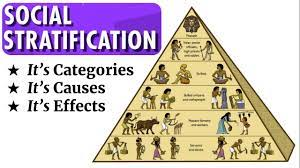

= step 2 - Lesson 22
:toc: left
:toclevels: 3
:sectnums:
:stylesheet: ../../+ 000 eng选/美国高中历史教材 American History ： From Pre-Columbian to the New Millennium/myAdocCss.css

'''

Lesson 22

== part 1. 部分
Christine: Harry, as an American, have you noticed any strong **class distinctions** 差别；区别；对比 in English society /since you’ve been here?

[.my2]
作为一个美国人，哈里，你在这里注意到英国社会中是否存在明显的阶级区别吗？

Harry: Strong class distinctions? Yes, they haven’t changed at all — that’s what — that’s what amuses (v.)逗笑；逗乐 me — in fifteen years or fourteen years — that the stratification 分层；成层 is exactly the same /as it was when I first came. #It#’s extraordinary 不平常的；不一般的；非凡的；卓越的 /#that# it pervades (v.)弥漫，遍布 everything.

[.my2]
哈利：强烈的阶级区别？是的，它们一点都没有改变。
这就是让我感到好笑的地方，在我来到这里的15年或14年里，社会分层竟然与我第一次来时一模一样。
令人惊讶的是，这种分层渗透到了一切。

[.my1]
.案例
====
.stratification
( technical 术语)the division of sth into different layers or groups分层；成层 +
• social stratification 社会阶层化 +
-> 来自 stratum,层，层级，-fy,使。引申词义使分层，使层级化。

====

Anna: What is *class distinction*? Because I don’t know whether it’s what job they do or …​

[.my2]
安娜：什么是阶级区别呢？
因为我不知道它是因为他们的职业还是...

Harry: It’s people’s accents 口音. In Pygmalion, you know, it goes back to, as soon as you open your mouth in England /you’re immediately you know placed.

[.my2]
哈利：是人们的口音。在《皮格马利翁》(卖花女（英国萧伯纳之作品人物）)中，你知道，这可以追溯到，在英国，只要你一开口，你就立刻知道自己的位置。

[.my1]
.案例
====
Pygmalion Effect
皮格马利翁效应. 通常指一个人对另一个人行为的期望, 成为"*自我实现的预言*"的现象。 +
最早由罗伯特·罗森塔尔（Robert Rosenthal）与伊迪丝·雅各布森（Edith Jacobson）正式提出。他们在实验中从班级中随机挑选部分学生，告诉教师这些学生拥有过人的智力水平，极具发展潜能，但要对其他人保密。一段时间后发现, 这些被随机选中的学生成绩进步很大，且变得十分自信积极。总结来说，是教师对学生形成的期望, 会使学生的学习成绩和行为表现向符合该期望的方向发展.
====

Anna: Do you mean that /there aren’t different accents 口音 in America?

[.my2]
安娜：你的意思是美国没有不同的口音吗？

Harry: Not — of course there are different accents — but they’re not *as* — they’re not nearly *as clearly defined*.

[.my2]
哈利：当然有不同的口音，但它们没有那么明显，远没有那么明确。

Anna: But I mean, don’t — doesn’t a certain strata 阶层 of American society /use (v.) perhaps more slang 俚语 than another one? More correct?

[.my2]
安娜：但我的意思是，难道美国社会的某个阶层, 不是比其他阶层使用更多的俚语吗？更正确吗？

Harry: Not the way /后定 they do in England.  In England /they seem to really stick 粘贴；粘住 together.  +
I mean I went the other week /*for the first time* in my life /to a point-to-point 定点越野赛马;(赛马等)越过原野的；逐点的 /and I couldn’t believe what I found.  +
There I was in the middle of Lincolnshire /and we went through muddy 多泥的；泥泞的 fields /and suddenly we *came upon* 偶然遇见；偶然发现 this parking (v.) lot with nine thousand _Range （变动或浮动的）范围，界限，区间;视觉（或听觉）范围 Rovers_ 巡游者 in it /and everyone going 'Oh, hello darling 亲爱的；宝贝. How are you?'  +
you know /and it was so hilarious (a.)极其滑稽的 I mean /and they were all,  you know this meeting of the clan 宗族，氏族，家族;帮派；小集团 /and that certainly doesn’t happen in America /and all those people spoke the same way.

[.my2]
哈利：不像英国人那样。在英格兰，他们似乎真的很团结。
我的意思是，前几周我生平第一次参加了一场马术比赛，我简直无法相信我发现了什么。
我在林肯郡的中心，我们穿过泥泞的田地，突然发现了一个停车场，停满了九千辆路虎，每个人都在打招呼，哦，亲爱的，你好吗。
你知道，这太滑稽了，我是说他们全都，你知道这是个族群的聚会，而在美国肯定不会发生这种情况，而且所有这些人都说着相同的方式。

[.my1]
.案例
====
.come on/upon sb/sth
[ no passive] ( formal ) to meet or find sb/sth by chance偶然遇见；偶然发现

.Range Rovers
一种豪华SUV车型，由英国汽车制造商路虎公司生产。

====

Barrie: But that — yes, I live in the middle of the country in the south /and I must say /when I moved there /I noticed — I mean *of course* I’d been aware of class [before that] /but I had no idea that /the lines between them were so rigid.  +
I lived on an estate （通常指农村的）大片私有土地，庄园 of a very big and successful farm /until recently, and so the farm *of course* was run by the landed (a.)拥有大量土地的 gentry 绅士阶层；上流社会人士 /who all *went hunting* 去打猎 /and to point-to-point /and all the rest of it.  +
I lived next door to the groom 马夫；马倌；马匹饲养员 /who was — who despised (v.)轻视，看不起 them /because they did all this /and he had to just get the horses ready, um but at the same time /he was terribly fond of them /and they of him /and there was all this sort of paternalistic (a.)家长式作风的 attitude to the country workers /that still goes on.  +
I was staggered (a.)震惊；大吃一惊 /and nobody knew where to put me /because I was living in a tied (a.)只租给雇工居住的 cottage 小屋；（尤指）村舍，小别墅 /that *was tied (v.)连接；联合；使紧密结合;束缚；约束；限制 to* the farm, um but because I didn’t work with any of them /they were all uneasy (a.)担心的；忧虑的；不安的;令人不安的；令人不舒服的；不安稳的 with me. Most peculiar 怪异的；奇怪的；不寻常的.

[.my2]
巴里：但是，是的，我住在南方的一个中部城市，我必须说，当我搬到那里时，我注意到——我的意思是，当然在那之前我就已经意识到了阶级问题，但我不知道它们之间的界限是如此的严格。直到最近，我一直住在一个非常大而成功的农场的庄园上，所以这个农场当然是由有土地的绅士们经营的，他们都参加狩猎、参与赛马等等。我住在马厩管理员旁边，他非常鄙视他们，因为他们都做这些事情，而他只是负责准备马匹，但与此同时，他非常喜欢他们，他们也喜欢他，对农场工人存在着一种父权制度的态度，这种态度仍然存在。我感到很震惊，因为没有人知道该怎么对待我，因为我住在一个与农场挂钩的小屋里，但因为我与他们中的任何人都没有一起工作，所以他们对我都感到不安。非常奇怪。

Christine: But I think /you raise a very good point there Barrie /because you’re *in fact* talking about yourself *not fitting into* either of these two extremes /and I’d like to ask Harry again /how many classes he can see very clearly defined.

[.my2]
克里斯汀：但我认为巴里你提出了一个非常好的观点，因为你实际上是在谈论自己不适合这两个极端中的任何一个，我想再次问哈利他可以清楚地看到多少个类别。

Barrie: In England?

Christine: In England, yes.

Harry: Well, I guess, three off the top of my head. I mean not counting (v.)计算，计数 immigrants and foreigners. Yes, I mean there’s the middle class is the most snobbish (a.)势利的；自命不凡的 of all /it seems to me.  +
You know, they’re the most aware of the whole system really /because they’#re# upwardly 向上地；在上面地 #mobile# (a.)易于变换社会阶层（或工作、住处）的；流动的 usually /you know they hope to be, and they’re the ones — I mean the upper class are what I find extraordinary 不平常的；不一般的；非凡的；卓越的 — they seem to be totally uninhibited 纵情的；无拘无束的；随心所欲的 [for the most part 大多数情况下，在很大程度上,多半].  I think it’s extraordinary.  +
I mean I’m not #*passing*# (v.)宣布；声明 any moral judgements #*on*# them /but it still exists …​

[.my2]
哈利：嗯，我猜，我脑子里冒出了三个。我的意思是不计算移民和外国人。是的，我的意思是，在我看来，中产阶级是最势利的。你知道，他们是对整个系统最了解的人，因为他们通常是向上流动的，你知道他们希望成为这样的人，而他们就是这样的人——我的意思是上层阶级是我认为非凡的——他们似乎是大部分时间完全不受约束。我认为这很了不起。我的意思是我不会对他们做出任何道德判断，但它仍然存在……​

[.my1]
.案例
====
.snobbish
(a.) ( also informal snobby  /ˈsnɒbi/
 ) ( disapproving) thinking that having a high social class is very important; feeling that you are better than other people because you are more intelligent or like things that many people do not like势利的；自命不凡的

.pass
(v.) ~ sth (on sb/sth) : to say or state sth, especially officially宣布；声明 +
- It's not for me *to pass (v.) judgement /on* your behaviour.我无权评判你的行为作风。
====

John: Because they’ve got the confidence …​

[.my2]
约翰：因为他们有信心……​

Anna: …​ and the money …​

[.my2]
安娜：……​还有钱……​

Barrie: …​ confidence and the money …​

John: Well no, *I don’t think* money’s much to do with it *actually*.

[.my2]
约翰：嗯，不，我认为钱实际上与这没有多大关系。

Anna: How can you change it? I mean how would you change it?

[.my2]
安娜：你怎么能改变它呢？我的意思是你会如何改变它？

Harry: I’m not saying /it should be changed …​

[.my2]
哈利：我并不是说应该改变……​

Anna: No, no, no, no. I don’t — I mean people do say that /it should be changed. Politicians say that /we should have total equality 平等；均等；相等/which I don’t believe /you can ever have in anything.

[.my2]
安娜：不，不，不，不。我不——我的意思是人们确实说它应该改变。政客们说我们应该拥有完全平等，但我认为在任何事情上都无法做到这一点。

Harry: Well there should be equality of opportunity. I mean *at least* it’s a nice ideal to have, isn’t it?

[.my2]
哈利：嗯，机会应该是平等的。我的意思是至少这是一个美好的理想，不是吗？

'''

== part 2. 部分

Public school was hard compared to what I’d had before, day school on the reservation and a year at Sequoyah Government School. I almost flunked eighth grade at the public school, and it was a miracle that I passed. I just didn’t know a lot of things, mathematics and stuff. I survived it somehow. I don’t know how, but I did. The man who was head of the department of education at the Agency was the only person outside of my family who helped me and encouraged me to get an education. He understood and really helped me with many things I didn’t know about. For a long time the white public school for the Big Cypress area would not let Indian children attend. A boy and I were the first Big Cypress Indians to graduate from that school. He is now in the armed forces.

[.my2]
与我之前在保留地上的走读学校和在塞阔亚政府学校读过一年的公立学校相比，公立学校的学习难度更大。我在公立学校的八年级差点没及格，但我通过了真是一个奇迹。我只是不知道很多事情，数学之类的。我不知怎么地活了下来。我不知道怎么做，但我做到了。该机构教育部的负责人是我家庭之外唯一帮助我并鼓励我接受教育的人。他理解并确实帮助了我很多我不知道的事情。长期以来，大柏树地区的白人公立学校不让印度儿童入学。我和一个男孩是第一批从那所学校毕业的大柏树印第安人。他现在在武装部队服役。

After I graduated from high school, I went to business college, because in high school I didn’t take courses that would prepare me for the university. I realized that there was nothing for me to do. I had no training. All I could do was go back to the reservation. I thought maybe I’d go to Haskell Institute, but my mother was in a TB hospital, and I didn’t want to go too far away. I did want to go on to school and find some job and work. So the director of education, at the Agency said, maybe he could work something out for me so I could go to school down here.

[.my2]
高中毕业后，我去了商学院，因为在高中时我没有学习为进入大学做准备的课程。我意识到我无事可做。我没有受过训练。我所能做的就是回到预订处。我想也许我应该去哈斯克尔研究所，但我母亲在一家结核病医院，我不想去太远。我确实想继续上学并找到一些工作。因此，该机构的教育主管说，也许他可以为我想出一些办法，这样我就可以在这里上学了。

I thought bookkeeping would be good because I had had that in high school and loved it. So I enrolled in the business college, but my English was so bad that I had an awful time. I had to take three extra months of English courses. But that helped me.

[.my2]
我认为簿记会很好，因为我在高中时就学过簿记并且很喜欢它。于是我考入了商学院，但我的英语很差，所以我过得很糟糕。我不得不额外学习三个月的英语课程。但这对我有帮助。

I never did understand why my English was so bad — whether it was my fault or the English I had in high school. I thought I got by in high school; they never told me that my English was so inferior, but it was not good enough for college. It was terrible having to attend special classes.

[.my2]
我一直不明白为什么我的英语这么差——无论是我的错还是我高中时的英语。我以为我在高中就过得很好；他们从来没有告诉我我的英语很差，但还不足以上大学。必须参加特殊课程真是太糟糕了。

At college the hardest thing was not loneliness but schoolwork itself. I had a roommate from Brighton, one of the three reservations, so I had someone to talk to. The landlady was awfully suspicious at first. We were Indians, you know. She would go through our apartment; and if we hadn’t done the dishes, she washed them. We didn’t like that. But then she learned to trust us.

[.my2]
在大学里最难的不是孤独，而是功课本身。我有一个来自布莱顿的室友，这是三个预订之一，所以我有人可以交谈。房东太太一开始非常怀疑。你知道，我们是印第安人。她会经过我们的公寓；如果我们没有洗碗，她就会洗。我们不喜欢那样。但后来她学会了信任我们。

College was so fast for me. Everyone knew so much more. It was as though I had never been to school before. As soon as I got home, I started studying. I read assignments both before and after the lectures. I read them before so I could understand what the professor was saying, and I read them again afterwards because he talked so fast. I was never sure I understood.

[.my2]
大学对我来说太快了。每个人都知道了更多。就好像我以前从未上过学一样。我一回到家就开始学习。我在讲座之前和之后都会阅读作业。我之前读过它们，以便能理解教授在说什么，然后我又读了一遍，因为他说得太快了。我从来不确定我是否理解了。

In college they dressed differently from high school, and I didn’t know anything about that. I learned how to dress. For the first six weeks, though, I never went anywhere. I stayed home and studied. It was hard — real hard. (I can imagine what a real university would be like.) And it was so different. If you didn’t turn in your work, that was just your tough luck. No one kept at me the way they did in high school. They didn’t say, "OK, I’ll give you another week."
大学里他们的穿着和高中不一样，我对此一无所知。我学会了如何穿衣。不过，在最初的六周里，我哪儿也没去。我呆在家里学习。这很难——真的很难。 （我可以想象真正的大学会是什么样子。）而且它是如此不同。如果你没有交作业，那只是你运气不好。没有人像高中时那样一直盯着我。他们没有说：“好吧，我再给你一周时间。”

Gradually I started making friends. I guess some of them thought I was different. One boy asked me what part of India I was from. He didn’t even know there were Indians in Florida. I said, "I’m an American." Things like that are kind of hard. I couldn’t see my family often, but in a way that was helpful because I had to learn to adjust to my new environment. Nobody could help me but myself.

[.my2]
渐渐地我开始交朋友。我想他们中的一些人认为我与众不同。一个男孩问我来自印度的哪个地区。他甚至不知道佛罗里达州有印第安人。我说：“我是美国人。”诸如此类的事情有点难。我不能经常见到家人，但这在某种程度上很有帮助，因为我必须学会适应新环境。除了我自己，没有人能帮助我。

3. part 3. 部分
Well, I graduated and went down to the bank. The president of the bank had called the agency and said he would like to employ a qualified Indian girl. So I went down there, and they gave me a test, and I was interviewed. And then they told me to come in the following Monday. That’s how I went to work. I finished college May 29, and I went to work June 1. I worked there for three years.

[.my2]
好吧，我毕业了，去了银行。该银行行长打电话给该机构，表示他想雇用一名合格的印度女孩。所以我去了那里，他们给了我一个测试，然后我接受了面试。然后他们告诉我下周一过来。我就是这样去上班的。我5月29日大学毕业，6月1日上班。我在那里工作了三年。

In the fall of 1966, my father and the president of the Tribal Board asked me to come back to Big Cypress to manage a new economic enterprise there. It seemed like a dream come true, because I could not go back to live at Big Cypress without a job there.
1966 年秋天，我的父亲和部落委员会主席邀请我回到大柏树，管理那里的一家新经济企业。这似乎是梦想成真，因为如果没有工作，我就无法回到大柏树居住。

But it was not an easy decision. I liked my bank work. You might say I had fallen in love with banking. But all my life I had wanted to do something to help my people, and I could do that only by leaving my bank job in Miami. Being the person I am, I had to go back. I would have felt guilty if I had a chance to help and I didn’t.

[.my2]
但这不是一个容易的决定。我喜欢我的银行工作。你可能会说我爱上了银行业。但我一生都想做点什么来帮助我的人民，而我只能辞去迈阿密的银行工作才能做到这一点。作为我这个人，我必须回去。如果我有机会提供帮助但我没有提供帮助，我会感到内疚。

But I told my daddy that I couldn’t give him an answer right away, and I knew he was upset because he had expected me to jump at the chance to come back. He did understand, though, that I had to think about it. He knew when I went to live off the reservation that I had had a pretty hard time, getting used to a job, getting used to people. He knew I had accomplished a lot, and it wasn’t easy for me to give it up. But that’s how I felt. I had to think. At one time it seemed to me that I could never go back to reservation life.

[.my2]
但我告诉爸爸，我不能立即给他答案，我知道他很沮丧，因为他期望我会抓住机会回来。不过，他确实明白我必须考虑一下。他知道当我去保留地生活时，我经历了一段相当艰难的时期，要适应工作，适应人们。他知道我已经取得了很多成就，对我来说放弃它并不容易。但这就是我的感受。我不得不思考。有一段时间，我似乎再也无法回到保留地生活了。

But then really, through it all, I always wished there was something, even the smallest thing, that I could do for my people. Maybe I’m helping now. But I can see that I may get tired of it in a year, or even less. But right now I’m glad to help build up the store. If it didn’t work out, if the store failed, and I thought I hadn’t even tried, I would really feel bad.

[.my2]
但实际上，经历这一切，我总是希望能为我的人民做点什么，哪怕是最小的事情。也许我现在正在帮忙。但我看得出来，一年甚至更短的时间我可能就会厌倦它。但现在我很高兴能帮助建立这家商店。如果没有成功，如果商店失败了，而我认为我根本没有尝试过，我真的会很难过。

The basic thing about my feeling is that my brothers and sisters and nieces and nephews can build later on in the future only through the foundation their parents and I build. Maybe Indian parents don’t always show their affection; but they have taught us that, even though we have a problem, we are still supposed to help one another. And that is what I am trying to do. Even when we were kids, if we had something and other kids didn’t, we must share what we had …​
我的基本感觉是，我的兄弟姐妹和侄女侄子们只有通过我和他们的父母建立的基础才能在未来取得更大的进步。也许印度父母并不总是表现出他们的爱；但他们告诉我们，即使我们遇到问题，我们仍然应该互相帮助。这就是我正在努力做的事情。即使当我们还是孩子的时候，如果我们有一些东西而其他孩子没有，我们必须分享我们所拥有的……​

By the age of nine, girls were expected to take complete care of younger children. I too had to take care of my little brother and sister. I grew up fast. That’s just what parents expected. Now teenagers don’t want to do that, so they get angry and take off. Head Start and nurseries help the working mothers because older children don’t tend the little ones anymore. The old ways are changing, and I hope to help some of the people, particularly girls about my age, change to something good.

[.my2]
到九岁时，女孩就应该完全照顾年幼的孩子。我也必须照顾我的弟弟和妹妹。我成长得很快。这正是父母所期望的。现在青少年不想这样做，所以他们生气并离开。 Head Start 和托儿所可以帮助职业母亲，因为年龄较大的孩子不再照顾小孩子了。旧的生活方式正在改变，我希望帮助一些人，特别是像我这个年纪的女孩，改变一些好的事情。

There are people on the reservation who don’t seem to like me. Maybe they are jealous, but I don’t know why. I know they resent me somehow. When I used to come from school or from work back to the reservation, I could tell some people felt like this. I don’t think that I have ever, ever, even in the smallest way, tried to prove myself better or more knowing than other people. I have two close friends here, so I don’t feel too lonely; but other people my age do not make friends with me. I miss my sister, and I miss my roommate from Miami. My two friends here are good friends. I can tell them anything I want. I can talk to them. That’s important, that I can talk to them. That’s what I look for in a friend, not their education, but for enjoyment of the same things, and understanding. But there are only two of them. I have not been able to find other friends.

[.my2]
保留地里有些人似乎不喜欢我。也许他们嫉妒，但我不知道为什么。我知道他们对我有些怨恨。当我从学校或下班回到预订处时，我可以告诉有些人有这样的感觉。我不认为我曾经、曾经，甚至以最小的方式，试图证明自己比其他人更好或更了解。我在这里有两个好朋友，所以我不会感到太孤独；但其他与我同龄的人不和我交朋友。我想念我的妹妹，也想念我来自迈阿密的室友。我这里的两个朋友是好朋友。我可以告诉他们任何我想要的事情。我可以和他们交谈。这很重要，我可以和他们交谈。这就是我在朋友身上寻找的东西，不是他们的教育程度，而是享受相同的事物和理解。但他们只有两个。我一直没能找到其他朋友。

The old people think I know everything because I’ve been to school. But the old people don’t have the kind of experience which allows them to understand our problems. They think that it is easy somehow to come back here. They think there is nothing else. They do not understand that there are things I miss on the outside. They do not understand enough to be friends. They are kind, and they are glad that I am educated, but they do not understand my problems. They do not understand loneliness …​
老人们认为我什么都知道，因为我上过学。但老年人没有那种经验可以让他们理解我们的问题。他们认为回到这里很容易。他们认为没有别的了。他们不明白我怀念外面的一些东西。他们不够了解，无法成为朋友。他们很友善，很高兴我受过教育，但他们不理解我的问题。他们不理解孤独……​

4. part 4. 部分
One wonders how, then, these students have arrived at such a false conclusion. One reason, of course, may be that they’re science students. Scientific terms generally possess only one, precisely defined, meaning. It is, in fact, exactly this quality that makes these words distinctive in English, or indeed in any other language. Another reason could be the way in which these students were taught English. For example, long vocabulary lists are still an important feature in the foreign language learning programmes of many countries. On one side of the page is the word in English; on the other side a single word in the student’s native language.

[.my2]
那么，人们想知道这些学生是如何得出这样一个错误的结论的。当然，原因之一可能是他们是理科学生。科学术语通常只有一种明确定义的含义。事实上，正是这种品质使得这些单词在英语中或在任何其他语言中都与众不同。另一个原因可能是这些学生学习英语的方式。例如，长词汇表仍然是许多国家外语学习计划的一个重要特征。页面的一侧有英文单词；另一面是学生母语中的一个单词。

Practically all the students think that every word in English had an exact translational equivalent in their own language. Again this is a gross distortion of the truth. Sometimes a word in the student’s native language may not have an equivalent in English at all, which may have to employ a phrase as a translation. Sometimes one word in the student’s language may be translated by one of two possible words in English. The difficulty that many students have with the two verbs 'do' and 'make' is an example of this. Often the area of meaning covered by one word in the student’s language may be wider or narrower than the area of meaning covered by a corresponding word in English. This sometimes happens with the naming of colours, where most students would expect an exact correspondence between their language and English. The borders between the primary colours of the spectrum are, however, drawn at different places in different languages. Translation, in fact, is a particularly difficult thing to do well. It certainly can’t be done by matching single words from one language by single words from another. At first, those computer scientists who attempted to construct an automatic translation machine made this mistake. The machines often produced nonsense.

[.my2]
几乎所有的学生都认为英语中的每个单词在他们自己的语言中都有精确的对应翻译。这又是对事实的严重歪曲。有时，学生母语中的单词可能根本没有英语中的对应词，这可能需要使用短语作为翻译。有时，学生语言中的一个单词可能会被英语中两个可能的单词之一翻译。许多学生在使用“do”和“make”这两个动词时遇到的困难就是一个例子。通常，学生语言中的一个单词所涵盖的含义范围可能比英语中相应单词所涵盖的含义范围更宽或更窄。这种情况有时会发生在颜色的命名上，大多数学生都希望他们的语言和英语之间有精确的对应关系。然而，光谱的原色之间的边界是用不同的语言在不同的地方绘制的。翻译其实是一件特别难做好的事情。这当然不能通过将一种语言中的单个单词与另一种语言中的单个单词进行匹配来完成。起初，那些试图构建自动翻译机的计算机科学家犯了这个错误。机器经常产生无意义的结果。

What, then, is the best way to increase one’s vocabulary in a foreign language? This can be answered in three words. Firstly, observation: the unknown word should be observed in its context; in other words, the neighbouring words and the grammatical construction should be noted. A good dictionary should be referred to and examples of the usage of the word should be noted. Secondly, imitation: the student should use the new word in appropriate contexts, imitating the examples he has noted. Finally, repetition: he’ll need to practise using the word several times before he’s confident that he can use it correctly; in other words, repetition is necessary if the new word is to 'stick', and especially if it is to enter the student’s active vocabulary.

[.my2]
那么，增加外语词汇量的最佳方法是什么？这可以用三个字来回答。首先，观察：生词要结合上下文观察；换句话说，应该注意邻近的单词和语法结构。应参考一本好的词典，并注意该词的用法示例。其次，模仿：学生应该在适当的上下文中使用新词，模仿他所注意到的例子。最后，重复：他需要多次练习使用这个词，然后才能确信自己可以正确使用它；换句话说，如果新单词要“粘住”，特别是要进入学生的活跃词汇中，重复是必要的。

'''
