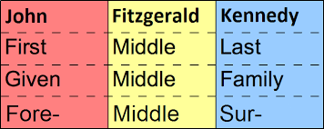
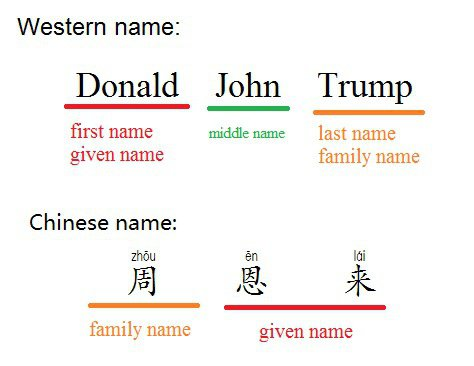
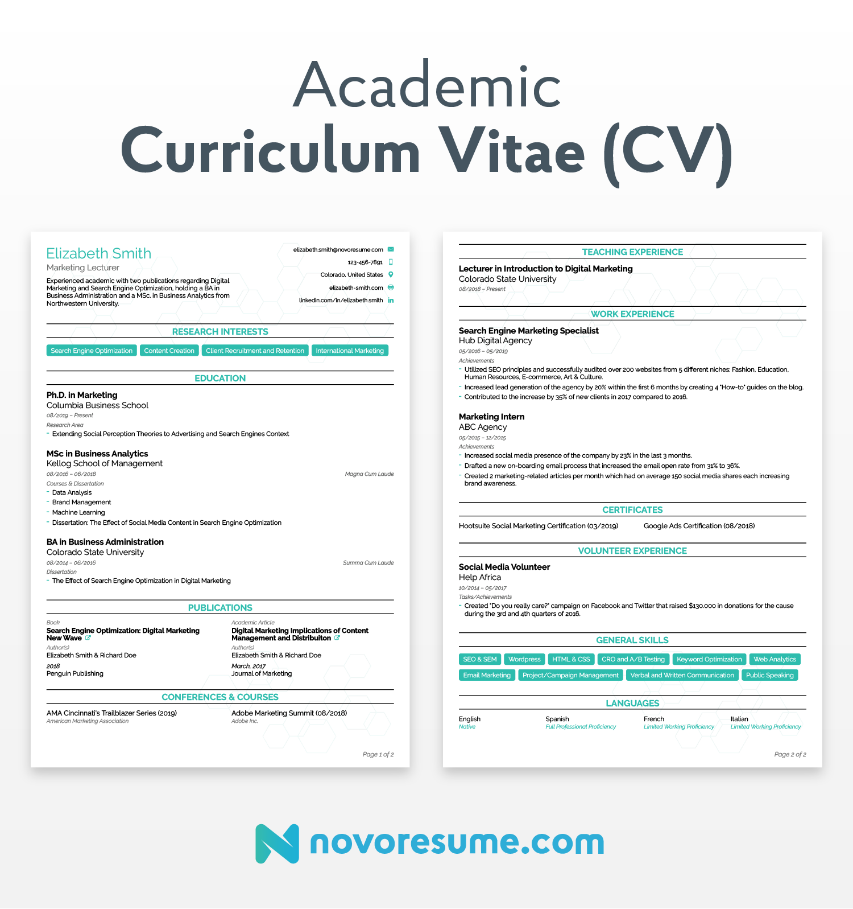
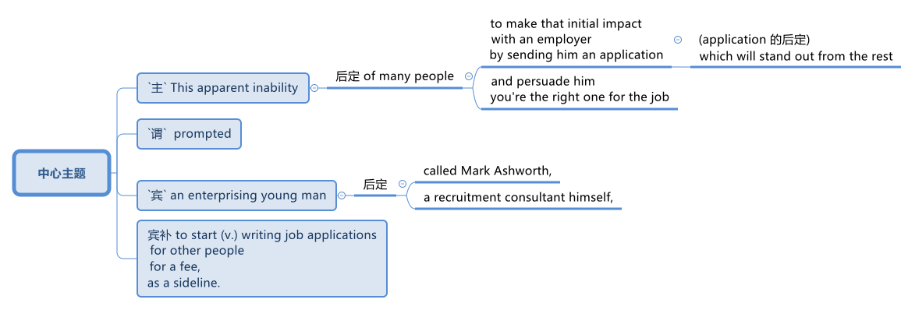
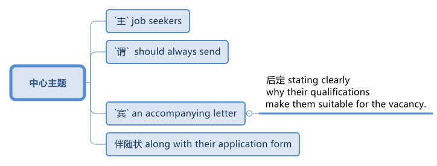
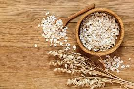

= step 2 - Lesson 23
:toc: left
:toclevels: 3
:sectnums:
:stylesheet: ../../+ 000 eng选/美国高中历史教材 American History ： From Pre-Columbian to the New Millennium/myAdocCss.css

'''

---

Lesson 23

== part 1

Interviewer: Hello. My name’s Hudson. Dick Hudson.

[.my2]
采访者：你好。我叫哈德森。迪克·哈德森。

Applicant: I’m Pamela Gable.

[.my2]
申请人：我是帕梅拉·盖博。

Interviewer: Well, take a seat, please. Miss Gable — it is Miss （用于未婚女子姓氏或姓名前，以示礼貌）小姐，女士, isn’t it? Thought so. Well, let me just check that /I’ve got these particulars 细节；详情 right. Your surname 姓 is Gable, spelt G-A-B-L-E, and your first names 名字 are Pamela Ann …​ Fine. You live at 147 Collington Road, Croydon …​ your telephone number is 246 8008 …​ you were born /on July 8th, 1965, and …​ that’s about it …​ OK? Fine …​ Let’s see …​ what are you working with /at the moment?

[.my2]
面试官：好的，请坐。盖博小姐——是小姐，不是吗？也这么觉得。好吧，让我检查一下这些细节是否正确。你的姓氏是盖博，拼写为 G-A-B-L-E，你的名字是帕梅拉·安……很好。您住在克罗伊登科林顿路 147 号……您的电话号码是 246 8008……您出生于 1965 年 7 月 8 日，并且……就这样……好吗？好吧……让我们看看……你现在在做什么？

[.my1]
.案例
====
.first name
( especially in NAmE ˈgiven name ) a name that was given to you when you were born, that comes before your family name 名字 +
• His *first name* is Tom and his *surname* is Green.他叫汤姆，姓格林。

====

Applicant: I’m the *personal assistant to the manager* （演员、作曲家等的）经理人，经纪人，个人经理 of *a modelling agency*.

[.my2]
申请人：我是一家模特经纪公司中   **经理的私人助理**。

Interviewer: Oh, really? And what does that involve?

[.my2]
采访者：哦，真的吗？这涉及什么？

Applicant: A bit of everything, really. I have to *keep the accounts* 记账, write a few letters, answer the telephone, look after 照顾，照料 bookings 预订;（演出等的）预约，约定 and engagements （尤指正式的或与工作有关的）约定，约会，预约 /and that sort of thing.

[.my2]
申请人：真的，什么都有一点。我必须记账、写几封信、接电话、处理预订和约会之类的事情。

Interviewer: You work with people a lot, do you?

[.my2]
采访者：你经常与人打交道，是吗？

Applicant: Oh yes. I have to look after all the models /who work for us, you know, keep them happy, *lend (v.) an understanding ear to* 聆听；倾听 their heartaches 痛心；伤心；忧虑, you know.

[.my2]
申请人：哦，是的。我必须照顾所有为我们工作的模特，让他们开心，理解他们的心痛，你知道。

[.my1]
.案例
====
.lend
(v.)*~ sth (to sb/sth) |~ (sb/sth) sth* : to give or provide help, support, etc.给予，提供（帮助、支持等） +
[ VN] +
• I was more than happy /*to lend my support to* such a good cause. 我非常乐意给这样美好的事业提供援助。 +
• He came along *to lend me moral support*. 他来给予我精神上的支持。

.LEND AN ˈEAR (TO SB/STH)
to listen in a patient and sympathetic way to sb 聆听；倾听
====

Interviewer: Have you ever done anything /后定 *to do with* 与……有关 hotels or conferences （大型、正式的）会议，研讨会 — hotel management, for instance?

[.my2]
采访者：您曾经做过与酒店或会议有关的事情吗？例如酒店管理？

Applicant: No, not really 不完全是. I did *work* /for a short time /*as* a courier （旅游公司的）导游;（递送包裹或重要文件的）信使，通讯员，专递公司 for a *tour operator* 旅游公司, *taking* foreigners *on* guided (a.)有指导的；有向导的；有导游的 tours (n.)游览；参观；观光 of London. Perhaps that’s the sort of thing you mean?

[.my2]
申请人：不，不完全是。我曾在一家旅行社做过短暂的导游工作，带外国人在导游的带领下游览伦敦。也许这就是你的意思？

[.my1]
.案例
====
.courier
-> 来自词根cur, 跑，词源同course, current.

.tour operator
N-COUNTA *tour operator* is a company /that provides vacations 休假,假期,度假/in which your travel and accommodations 住宿；膳宿 are booked for you. 旅游公司

.take sth/sb on
(1)to decide to do sth; to agree to be responsible for sth/sb 决定做；同意负责；承担（责任） +
• I can't *take on* any extra work. 我不能承担任何额外工作。 +
• We're not *taking on* any new clients at present. 目前我们不接收新客户。

(2) ( of a bus, plane or ship公共汽车、飞机或船只 ) to allow sb/sth to enter 接纳（乘客）；装载 +
• The bus stopped *to take on* more passengers.公共汽车停下, 让其他乘客上车。 +
• The ship *took on more fuel* at Freetown.轮船在弗里敦停靠加燃料。

.guided
(a.) [ usually before noun]that is led by sb who works as a guide 有指导的；有向导的；有导游的 +
• a guided (a.) tour/walk 有导游的观光╱步行观光

====

Interviewer: Yes, I think it is. Do you speak any languages?

[.my2]
采访者：是的，我想是的。你会说任何语言吗？

Applicant: Yes, I do. I speak French and Italian — you see, I spent several years abroad /when I was younger.

[.my2]
申请人：是的，我愿意。我会说法语和意大利语——你看，我年轻时在国外呆过几年。

Interviewer: Oh, did you? That’s very interesting. And what about any exams you’ve taken?

[.my2]
采访者：哦，是吗？这很有趣。你参加过的考试怎么样？

Applicant: Well, I left school at 16. You know, there didn’t seem to be any point /in *staying on* 留下来继续（学习、工作等） somehow 以某种方式（或方法）; I was sure /I could learn much more /by getting a job /and a bit of experience and independence.

[.my2]
申请人：嗯，我 16 岁就离开了学校。你知道，以某种方式留下来似乎没有任何意义；我确信通过找到一份工作、一点经验和独立性，我可以学到更多东西。

Interviewer: So you have no *formal qualifications* （通过考试或学习课程取得的）资格；学历 at all? I see …​ Well, I don’t suppose （根据所知）认为，推断，料想 it matters.

[.my2]
采访者：所以你根本就没有正式的资格吗？我明白了……好吧，我认为这并不重要。

Applicant: Um …​ I was wondering /if perhaps you could tell me a bit more about the job? You know, it said in the ad that /you wanted a go ahead girl with car and imagination, but that’s not very much *to go on* 以…为依据；根据…来判断.

[.my2]
求职者：嗯……我想知道, 你是否可以告诉我更多关于这份工作的信息？你知道，广告里说你想要一个有车、有想象力、勇往直前的女孩，但这并没有什么意义。

[.my1]
.案例
====
.go on sth
( used in negative sentences and questions用于否定句和疑问句 ) to base an opinion or a judgement on sth以…为依据；根据…来判断 +
• The police don't have much *to go on*. 警方没多少依据。
====

Interviewer: No, it isn’t. Well, we run (v.) conferences, and your job as conference coordinator 协调人，统筹者 /*would be, well, much the same as* the one /you have now, I suppose. Meeting (v.) people, transporting (v.) them *from* one place *to* another, making sure they’re comfortable, a bit of telephoning, and so on.

[.my2]
采访者：不，不是。好吧，我们举办会议，我想你作为会议协调员的工作, 将与你现在的工作大致相同。与人会面，将他们从一个地方运送到另一个地方，确保他们感到舒适，打电话等等。

Applicant: It sounds (v.) like /just the sort of thing I want to do.

[.my2]
申请人：这听起来正是我想做的事情。

Interviewer: There is the question of salary, of course.

[.my2]
面试官：当然还有工资问题。

Applicant: Well, my present salary is 8,000 pounds, so I couldn’t accept any less than that. Especially /if I have to use my car.

[.my2]
应聘者：嗯，我现在的工资是8000英镑，所以我不能接受低于这个数字的工资。特别是如果我必须使用我的车的话。

Interviewer: Ah! We have something like 7,500 in mind, plus *of course* a generous 慷慨的；大方的；慷慨给予的 allowance 津贴；补贴；补助 for the car. But look, if I were you, I’d take some time /to think about this. Perhaps you’d care 关注；在意；担忧 /*to have a quick look* round the office here, see if you like the look of the people /who work here.

[.my2]
采访者：啊！我们的预算是 7,500 左右，当然还要加上丰厚的汽车补贴。但是你看，如果我是你，我会花一些时间考虑这个问题。也许您想快速浏览一下这里的办公室，看看您是否喜欢在这里工作的人的样子。

Applicant: What do you think /I should do then …​?

[.my2]
申请人：你认为我应该做什么……​？

'''

== part 2

Ann: When did you discover that /you had this talent for hypnosis 催眠状态, Dr. Parker?

[.my2]
安：帕克博士，你什么时候发现自己有催眠天赋的？

Dr. Parker: When I was a final year medical student, actually. I’d been reading a lot about it /and decided /to try it myself on a few friends, you know — using certain well-tried techniques.

[.my2]
帕克博士：实际上，当我还是一名医学院学生的最后一年时。我读了很多关于它的文章，并决定自己在几个朋友身上尝试一下，你知道的——使用某些久经考验的技术。

Ann: And you were successful.

[.my2]
安：你成功了。

Dr. Parker: Well, yes. I was amazed (a.)大为惊奇 at /how quickly I was able to do it.

[.my2]
帕克博士：嗯，是的。我对自己能如此快地完成这件事, 感到惊讶。

[.my1]
.案例
====
.amazed
(a.)*~ (at/by sb/sth) | ~ (how/that...)  | ~ (to see, find, learn, etc.)* : very surprised大为惊奇
====

Ann: Could you tell me more /about these techniques?

[.my2]
安：你能告诉我更多关于这些技术的信息吗？

Dr. Parker: Certainly. My method has changed very little /since I started. To begin with 首先, I get the subject /to lie (v.) comfortably on a sofa, which helps to relax the body. You see, in order to reach a person’s mind, you have to make him forget his body /as much as possible. Then I tell him /*to concentrate on* my voice. Some experts claim that /the sound of the voice /is one of the most powerful tools in hypnosis.

[.my2]
帕克博士：当然。自从我开始以来，我的方法几乎没有改变。首先，我让拍摄对象舒适地躺在沙发上，这有助于放松身体。你看，要想到达一个人的心灵，就得让他尽可能的忘记自己的身体。然后我告诉他集中注意力在我的声音上。一些专家声称声音是催眠中最强大的工具之一。

Ann: Do you have an assistant with you?

[.my2]
安：你有助理吗？

Dr. Parker: Yes, but only as a secretary. He always sits well /in the background, taking notes /and *looking after* the recording equipment. Then I tell the subject /not to think about what I’m saying /but just to accept it.

[.my2]
Parker 博士：是的，但只能作为秘书。他总是坐在后台，记笔记并照看录音设备。然后我告诉受试者不要思考我所说的话，而只是接受它。

Ann: Don’t you use a swinging watch /or flashing lights?

[.my2]
安：你不使用摆动的手表或闪光灯吗？

[.my1]
.案例
====
.flashing light
闪光灯：指一种具有闪烁特性的照明设备，以间歇性的闪光来提供视觉信号。 +

====

Dr. Parker: No. At first /I used to *rely on* the ticking of a clock — some say that boring, repetitive 重复乏味的 sounds help (v.) — but now I simply get my patient /*to stare (v.)盯着看；凝视；注视 at* some object in the room. At this point /I suggest that /he’s feeling sleepy /and that his body’s becoming *so* relaxed /*that* he can hardly feel it.

[.my2]
帕克博士：不。起初我常常依靠时钟的滴答声——有人说无聊、重复的声音有帮助——但现在我只是让我的病人盯着房间里的某个物体。此时我建议他感到困倦，并且他的身体变得如此放松，以至于他几乎感觉不到。

Ann: Be careful, Dr. Parker, I’m beginning to feel very drowsy (a.)困倦的；昏昏欲睡的 myself.

[.my2]
安：小心点，帕克医生，我自己也开始感到很困了。

[.my1]
.案例
====
.drowsy
-> 词源同drop, dreary. 引申义耷拉着头，打盹。
====

Dr. Parker: Don’t worry. I won’t make you do anything silly, I promise.

[.my2]
帕克博士：别担心。我不会让你做任何傻事，我保证。

Ann: What you’re saying, then, is that /you want to control your patient’s mind, and that /to do this /you have first to take care of the body.

[.my2]
安：那么，你的意思是，你想控制病人的思想，而要做到这一点，你首先要照顾好身体。

Dr. Parker: Yes. You see, the aim of the session 一场；一节；一段时间 /is to make the patient remember (v.) [in great detail] an experience /which has caused (v.) him a lot of pain and suffering, and by doing that /to help him to face his problems.

[.my2]
帕克博士：是的。你看，治疗的目的, 是让病人详细地记住给他带来很多痛苦和磨难的经历，并通过这样做来帮助他面对他的问题。

Ann: I’ve heard /a person’s memory is far more powerful /under hypnosis.

[.my2]
安：我听说人在催眠状态下记忆力更强。

Dr. Parker: Indeed it is. `主` Some of the things /that patients are able to remember /`系` are just incredible.

[.my2]
帕克博士：确实如此。患者能够记住的一些事情简直令人难以置信。

Ann: Would you mind /giving me an example?

[.my2]
安：你介意给我举个例子吗？

Dr. Parker: Not at all. During a session, it’s standard procedure /*to take* a patient *back* in time [*slowly*], pausing [at certain times] in his life /and asking a few questions.

[.my2]
帕克博士：一点也不。在治疗过程中，标准程序是让病人慢慢回到过去，在他生命中的某些时刻停下来, 问一些问题。

Ann: *To*, sort of, *set the scene* 为…做好准备（或铺平道路） /before you go deeper. Is that what you mean?

[.my2]
安：在深入之前，先设置场景。你是这个意思吗？

[.my1]
.案例
====
.SET THE ˈSCENE (FOR STH)
(1) to create a situation in which sth can easily happen or develop 为…做好准备（或铺平道路） +
• His arrival /*set the scene for* another argument. 他这一来，又会引起一场争论。

(2) to give sb the information and details they need in order to understand what comes next （向…）介绍背景，事先介绍情况 +
• The first part of the programme /was just *setting the scene*. 节目的第一部分不过是介绍背景而已。
====

Dr. Parker: That’s it exactly. Well, once, I *took* a thirty-five-year-old lady *back to* the age of eight — in fact, I told her /it was her eighth birthday /and I asked her what day it was. I later checked a calendar for that year /and she was right — it was a Tuesday. She even told me /who was at her party, their names, what they were wearing /and about the presents she received. I mean, can you remember even your last birthday?

[.my2]
帕克博士：正是如此。嗯，有一次，我把一位三十五岁的女士带回到八岁——事实上，我告诉她今天是她的八岁生日，然后我问她今天是什么日子。后来我查了那一年的日历，她是对的——那是星期二。她甚至告诉我谁参加了她的聚会，他们的名字，他们穿什么以及她收到的礼物。我的意思是，你还记得你上次的生日吗？

Ann: I couldn’t even tell you /what day my birthday fell (v.)发生 on this year.

[.my2]
安：我什至无法告诉你今年我的生日是哪一天。

[.my1]
.案例
====
.fall
[ V+ adv./prep.] to happen or take place 发生 +
• My birthday *falls* on a Monday this year. 今年我的生日适逢星期一。
====

Dr. Parker: Precisely （强调真实或明显）正是，确实. And when I asked her /to write down her address /at that time, the handwriting 手写；书写,笔迹 /was in a very immature （行为）不成熟的，不够老练的，幼稚的;未长成的；发育未全的 style. I later *compared* it *to* a sample /from some old school exercise books /her mother had kept /and it was identical (a.)完全同样的；相同的.

[.my2]
帕克博士：没错。当我让她写下她当时的地址时，字迹非常不成熟。后来我将其与她母亲保留的一些旧学校练习册中的样本进行了比较，结果是相同的。

Ann: Dr. Parker, that’s an amazing story.

[.my2]
安：帕克博士，这是一个了不起的故事。

Dr. Parker: I’ve *taken* patients *back to* their first year /and a few even further （过去或未来）较远，更久远 than that …​ but that’s another story, unless you’ve got plenty of time …​

[.my2]
帕克博士：我已经把病人带回到了他们的第一年，还有一些甚至比那更远……但那是另一个故事了，除非你有足够的时间……​

'''

== part 3

These days /it’s hard enough /to find a suitable job, *let alone* 更不用说 get *as far as* an interview.  +
Dozens of people every day /scour (v.)（彻底地）搜寻，搜查，翻找 the *Situations Vacant* （职位）空缺的; （报刊上的）招聘广告 columns of the press, *send off* 寄出；发出 their *curriculum （学校等的）全部课程 vitae* （求职用的）履历，简历 or *application form* 申请表，申请书, and wait (v.) hopefully /to be summoned (v.)传唤；召集 for an interview.  +
Now this, apparently, is where a lot of people *fall down* 不实；不能令人满意；不够好, *because of* their inadequacy 不充分；不足；不够 at completing their application forms, according to Judith Davidson, author of Getting a Job, a book which has recently come on the market.  +
This book, as the title suggests, is crammed (v.)把…塞进；挤满；塞满 full of useful tips /on how *to set about* 开始做；着手做 finding yourself work /in these difficult times.  +
Our reporter 记者，通讯员, Christopher Shields, decided /*to look into* 调查；审查 this apparent #inability# of the British /#to sell themselves#, and he spoke to Judith Davidson about it.

[.my2]
如今，找到一份合适的工作已经很难了，更不用说面试了。每天都有数十人浏览媒体的职位空缺专栏，寄出简历或申请表，满怀希望地等待面试机会。最近上市的《找工作》一书的作者朱迪思·戴维森表示，显然，这是很多人失败的地方，因为他们没有充分填写申请表。正如标题所示，这本书充满了关于如何在这些困难时期为自己找到工作的有用技巧。我们的记者克里斯托弗·希尔兹（Christopher Shields）决定调查英国人明显无法推销自己的情况，他就此与朱迪思·戴维森（Judith Davidson）进行了交谈。

[.my1]
.案例
====
.vacant
(a.)( formal ) if a job in a company is vacant , nobody is doing it and it is available for sb to take（职位）空缺的  +
• When the post finally *fell (= became) vacant* (a.), they offered it to Fiona.这个职位最终空出来之后，他们给了菲奥纳。  +
( BrE ) +
• *Situations Vacant* (= a section in a newspaper where jobs are advertised) 招聘广告栏目

.curriculum vitae
1.( BrE ) ( NAmE also ré·sumé ) a written record of your education and the jobs you have done, that you send when you are applying for a job （求职用的）履历，简历 +
• Applications with a full curriculum vitae and two references should reach the Principal by June 12th. 申请书连同完整个人简历和两份推荐信必须在6月12日以前送达校长处。 +
2.( also *vita* ) ( US ) a record of a university/college teacher's education and where they have worked, also including a list of books and articles that they have published and courses that they have taught, used when they are applying for a job （大学教师求职用的）工作履历 +

====

Judith: Very often /a job application or a curriculum vitae 个人简历 /will contain basic grammatical or careless spelling mistakes, even from university graduates.  +
Then those /that do *get as far as* an interview /become inarticulate 不善于表达的；不善于说话的;词不达意的；表达得不清楚的 or clumsy 笨拙的；不灵巧的 /when they try to talk about themselves.  +
It doesn’t matter 这些都不重要 *how highly qualified or brilliant* you may be, if you *come across* 给人以…印象；使产生…印象 as tongue-tied and gauche (a.)笨拙的；不善社交的；不老练的, your chances of getting a job /are pretty small.

[.my2]
朱迪思：工作申请或简历, 经常会包含基本的语法或粗心的拼写错误，即使是大学毕业生也是如此。然后，那些真正接受采访的人, 在试图谈论自己时, 就会变得口齿不清或笨拙。不管你的资质有多高、有多聪明，如果你给人一种结结巴巴、粗俗的印象，那么你找到工作的机会就很小。 (即, 如果你给人不良印象, 那你的高素质等, 就都不重要了. 你依然无法获得录取.)

[.my1]
.案例
====
.come aˈcross( also ˌcome ˈover )
(1)to be understood 被理解；被弄懂 +
• He spoke for a long time /but his meaning didn't really *come across*. 他讲了很久，但并没有人真正理解他的意思。

(2)to make a particular impression 给人以…印象；使产生…印象 +
• She *comes across* well /in interviews.她在面试中常给人留下很好的印象。

.gauche
(a.) awkward when dealing with people and often saying or doing the wrong thing 笨拙的；不善社交的；不老练的
====

Christopher: Judith Davidson lectures (v.)（尤指在大学里）开讲座，讲授，讲课 at a *management training college* /for young men and women, most of whom /have just graduated from university /and gone there /to take a *crash (a.)应急的；速成的 course* 速成课程 in management techniques.  +
One of the hardest things *is*, #not# passing (v.) the course examinations successfully, #but# actually finding (v.) employment 工作；职业；受雇 afterwards, so Judith now *concentrates on* helping trainees /*to set about* 开始做；着手做 doing just this.

[.my2]
克里斯托弗：朱迪思·戴维森在一所管理培训学院, 为年轻男女授课，其中大多数人刚刚从大学毕业，去那里参加管理技术速成课程。最困难的事情之一**不是**顺利通过课程考试，**而是**找到工作，所以朱迪思现在专注于帮助学员开始做这件事。

Judith: Some letters are dirty and untidily 不整洁地；凌乱地 written, with *finger marks* all over them /and *ink blots* 污点，墨迹 or even *coffee stains* 污点；污渍. Others arrive (v.) 状 on lined (a.)有皱纹的;有衬里的；有内衬的 or flowered or sometimes scented 散发着浓香的；芬芳的 paper — *none of which* is likely to make a good impression /on the average business-like 类似…的；有…特征的 boss.

[.my2]
朱蒂丝:有些信写得又脏又乱，上面满是手印，还有墨迹，甚至还有咖啡渍。还有一些人是用有衬里的、花的、有时是有香味的纸寄来的——这些都不太可能给一般注重商务的老板留下好印象。

[.my1]
.案例
====
.-like
( in adjectives构成形容词)similar to; typical of类似…的；有…特征的 +
• childlike 孩子般 +
• shell-like 似壳的
====

Christopher: `主` #This apparent inability# of many people /to make that initial impact 初期影响 with an employer 雇主 /by sending him an application /which will ① *stand out 显眼；突出 from* the rest 其余的人；其他事物；其他 / ② and persuade (v.) him you’re the right one for the job /`谓` #prompted# (v.)促使；导致；激起 an enterprising 有事业心的；有进取心的；有创业精神的 young man, called Mark Ashworth, a recruitment 招募，招聘 consultant 顾问 himself, to start *writing* job applications /*for* other people /for a fee, as a sideline 兼职；副业；兼营业务.  +
He told me /he got the idea in America /where it’s already big business, and in the last few months alone /he’s written over 250 c.v.s.  +
He feels that /`主` 80 per cent of #job applications# /received by personnel managers /`系` #are# inadequate *in some way*.

[.my2]
克里斯托弗：许多人显然无法通过向雇主发送一份脱颖而出的申请, 来对雇主产生最初的影响，并说服他, 你是这份工作的合适人选，这促使一位名叫马克·阿什沃斯 (Mark Ashworth) 的有进取心的年轻人，自己是一名招聘顾问，开始为其他人撰写收费的工作申请，作为副业。他告诉我，他在美国想到了这个想法，在美国，这已经是一门大生意了，仅在过去几个月里，他就写了 250 多份简历。他认为人事经理收到的 80% 的职位申请, 在某种程度上都是不充分的。

[.my1]
.案例
====
.stand ˈout (from/against sth)
to be easily seen; to be noticeable 显眼；突出 +
• She's the sort of person /who *stands out* in a crowd .她是那种在人群中很显眼的人。

====

Mark: Many people simply can’t *cope with* 成功地）对付，处理 grammar and spelling /and don’t know *what to put in*, or *leave out* 不包括，不提及.  +
Sometimes people condense (v.)（使）浓缩，变浓，变稠;简缩，压缩（文字、信息等） their work experience #so# much /#that# a future employer doesn’t *know* enough /*about* them.  +
Then, on the other hand, some people *go too far* the other way.  To give you an example, `主` one #c.v.# （求职用的）履历，简历  /后定 I once received in my recruiting role /`系` #was# *getting on* 对付；应付；活下来；过活 for thirty pages long.

[.my2]
马克：很多人根本无法应对语法和拼写，也不知道该添加或省​​略什么。有时，人们过于浓缩自己的工作经验，以至于未来的雇主对他们不够了解。另一方面，有些人却走得太远了。举个例子，一份简历。我曾经在招聘岗位上收到过长达三十页的信息。

[.my1]
.案例
====
.GET ˈON
(3) ( also ˌ**get aˈlong** ) to manage or survive对付；应付；活下来；过活 +
• We can *get on* perfectly well /without her.没有她我们也能过得很好。 +
• I just can't *get along* /without a secretary.没有秘书我简直寸步难行。
====

Christopher: Mark *has* an initial interview 初试 *with* all his clients /in which he tries to make them think about /their motivation /and why they’ve done certain things in the past.  +
He can often exploit (v.)利用（…为自己谋利）;剥削；压榨 these experiences /in the c.v. he writes for them, and show that /they *have been* valuable 很有用的；很重要的；宝贵的 preparation for the job 后定 now sought.  +
He also believes that /`主` well-prepared job history /and a good letter of application /`系` are absolutely essential.

[.my2]
克里斯托弗：马克对他的所有客户进行了初步采访，他试图让他们思考自己的动机, 以及为什么他们过去做了某些事情。他经常可以在简历中利用这些经验。他为他们写作，并表明他们为现在寻求的工作做了宝贵的准备。他还认为，准备充分的工作经历和一封好的申请信, 绝对必要。

Mark: Among *the most important aspects* of applications /*are* spelling, correct grammar, content and layout 布局；布置；设计；安排.  +
A new boss will probably also *be impressed /with* a good reference 推荐信；介绍信;说到（或写到）的事；提到；谈及；涉及 /or a letter of commendation 赞扬；称赞；赞成；嘉许 /written by a former employer.  +
`主` The type of c.v. /后定 I aim (v.)瞄准；对准;目的是；旨在 to produce /`谓` *depends largely on* the kind of job 后定 being applied for.  +
They don’t always have to *be slick* (a.)华而不实的；虚有其表的；取巧的 or *highly sophisticated* (a.)复杂巧妙的；先进的；精密的;见多识广的；老练的；见过世面的, but in certain cases /this does help.

[.my2]
马克：申请中最重要的方面, 是拼写、正确的语法、内容和布局。新老板也可能会对前雇主写的好的推荐信或表扬信, 印象深刻。我打算制作的简历类型, 在很大程度上取决于所申请的工作类型。它们并不总是需要圆滑或高度复杂，但在某些情况下这确实有帮助。

Christopher: Judith Davidson thought (v.)(=think) [very much *along the same lines 种类；类型 as* 按…方式 Mark]. In her opinion, one of *the most important aspects* of job applications /was that /they should be easy to read …​

[.my2]
克里斯托弗：朱迪思·戴维森的想法与马克非常相似。在她看来，工作申请最重要的方面之一, 是它们应该易于阅读……​

[.my1]
.案例
====
.along/on (the)... ˈlines
(1) ( informal ) in the way that is mentioned 按…方式 +
• The new system will operate *along the same lines as* the old one. 新系统的运作方式将与老系统一样。 +
• They voted *along class lines*. 他们按各社会等级进行投票。

(2) ( informal ) similar to the way or thing that is mentioned类似于（提及的方式或东西） +
• Those aren't his exact words, but he said something *along those lines*. 那些不是他的原话，但他说的大致就是这个意思。
====

Judith: …​ Many applicants send (v.) 状 in letters and forms /which are virtually unreadable. #The essence# 本质；实质；精髓 of handwritten application /#is that# /they should be neat 整洁的；整齐的；有序的, legible 清晰可读的；清楚的 /and the spelling should be accurate.  +
I stress (v.) handwritten /because most employers want a sample of their future employee’s writing. Many believe /this gives some indication 表明；标示；显示；象征 of the character of the person /who wrote it.  +
Some people forget vital 必不可少的；对…极重要的 things /like 例如 putting their own address *or* the date. Others fail to do /what’s required of them /by a job advertisement.

[.my2]
朱迪思：……​许多申请人寄来的信件和表格, 几乎无法阅读。手写申请的本质是工整、清晰、拼写准确。我强调手写，因为大多数雇主都想要未来员工的写作样本。许多人认为这可以反映出作者的性格。有些人忘记了一些重要的事情，比如写下自己的地址或日期。其他人则未能按照招聘广告的要求行事。

Christopher: Judith believes that /job seekers should always send *#an accompanying (a.)陪伴的；和……一起发生的；附随的 letter#* /along with their application form / 后定 #stating (v.) clearly# why their qualifications /*make* them *suitable* for the vacancy （职位的）空缺；空职；空额.

[.my2]
克里斯托弗：朱迪思认为，求职者应该在申请表的同时附上一封附信，清楚地说明为什么他们的资格使他们适合该职位空缺。

[.my1]
.案例
====

====

Judith: *Personal details* have no place 状 in letters of application. I well remember /*hearing about* one such letter /which stated (v.), quite bluntly 直言地；单刀直入地, I need more money /to pay for my flat. No boss would be impressed /by such directness 直接；直截了当；坦率.

[.my2]
朱迪思：申请信中没有写个人信息 (也是大错)。我清楚地记得听过一封这样的信，信中直言不讳地说，我需要更多的钱来支付我的公寓费用。没有哪个老板会对这种直率印象深刻。

Christopher: She added that /the art of *applying for* jobs successfully /was having to be learnt /by more and more people these days, with the current unemployment situation.  +
独立主格结构 #With# *as many as* two or three hundred people 后定 apply##ing## for one vacancy, a boss would want to see /only *a small fraction* of that number in person /for an interview, so `主` your application /`谓` had to really outshine (v.)比…做得好；使逊色；高人一筹 all the others /to get you on the *short list* 入围名单.

[.my2]
克里斯托弗：她补充说，在当前的失业形势下，越来越多的人必须学习成功申请工作的艺术。有多达两三百人申请一个职位空缺，老板只希望亲自见到其中的一小部分进行面试，因此您的申请必须真正胜过所有其他申请, 才能让您进入候选名单。

---

== part

==== 1. (Literature 文学，文学作品)

We may #note# (v.) *in passing* 顺便提及，偶然提到 #that#, although Dr Johnson's friend and biographer 传记作者, Boswell, was a Scotsman 苏格兰人, Johnson despised (v.)鄙视；蔑视；看不起, or pretended to despise, Scotsmen in general.  +
He once said that /#the best thing# 后定 a Scotsman ever saw /#was# the high road 后定 to England.  +
In his famous dictionary, Johnson *defined* oats 燕麦 *as* 'a grain 谷物，谷粒 /which in England is generally given to horses, but in Scotland supports (v.) the people'.  +
He did not condemn (v.) all Scotsmen, however. Once he commented on a distinguished 卓越的；杰出的；著名的 nobleman /who had been born in Scotland /but educated in England, saying that /much could be made of 由…组成，由…构成 a Scotsman — if he was caught young.

[.my2]
（文学） +
我们可以顺便指出，尽管约翰逊博士的朋友兼传记作者博斯韦尔, 是苏格兰人，但约翰逊总体上鄙视或假装鄙视苏格兰人。他曾经说过，苏格兰人见过的最美好的事物, 就是通往英格兰的公路。约翰逊在他著名的字典中, 将燕麦定义为“一种在英格兰通常喂马的谷物，但在苏格兰却供养人民”。然而，他并没有谴责所有苏格兰人。有一次，他评论了一位出生在苏格兰, 但在英格兰接受教育的杰出贵族，说苏格兰人可以大有作为——如果他年轻时就被抓住的话。

[.my1]
.案例
====
.oats
[ pl.] grain /后定 *grown* in cool countries /*as* food for animals /and for making flour, porridge 燕麦粥，麦片粥 /oatmeal 燕麦粥，麦片粥, etc.燕麦 +

====

'''

==== 2. (Geography: American Indians)

The first important point /to note (v.) about the American Indians /is that, *in spite of* 不管；尽管 their name, they are *in no way* 一点也不,决不 *related to* the peoples of India. This confusion arose (v.), as you probably know, *because of* a mistake /on the part of Christopher Columbus. When he landed in America /he thought that /he had in fact discovered India. This mistake has been perpetrated (v.)犯（罪）；做（错事）；干（坏事）, that is kept alive, ever since by the name he gave them.  +
If they are related to any Asian group /it is to the Mongols 蒙古人 of Northern Asia. Many experts believe that /the ancestors 祖宗；祖先 of the present American Indians /*emigrated* from Northern Asia *across* the Bering Strait 海峡，狭窄水道 /between 10,000 and 20,000 years ago.

[.my2]
（地理：美洲印第安人） +
关于美洲印第安人，需要注意的第一个要点是，尽管他们的名字如此，但他们与印度人民没有任何关系。您可能知道，这种混乱的出现是由于克里斯托弗·哥伦布的一个错误。当他抵达美国时，他认为他实际上发现了印度。这个错误一直在犯下，从他给他们起的名字起就一直存在着。如果说他们与任何亚洲群体有联系的话，那就是北亚的蒙古人。许多专家认为，现在的美洲印第安人的祖先, 在一万至两万年前, 从北亚跨越白令海峡移民而来。

[.my1]
.案例
====
.in ˈspite of sth
if you say that sb did sth in spite of a fact, you mean it is surprising that that fact did not prevent them from doing it 不管；尽管 +
SYN despite +
• *In spite of* his age, he still leads an active life.尽管年事已高，他依旧过着一种忙碌的生活。

.perpetrate
[ VN] *~ sth (against/upon/on sb)* : ( formal ) to commit a crime or do sth wrong or evil犯（罪）；做（错事）；干（坏事） +
•to perpetrate (v.) a crime/fraud/massacre 犯罪；行骗；进行屠杀
====

'''

==== 3. (Science: methods of scientific discovery)

`主` A good #illustration# （说明事实的）故事，实例，示例 of /后定 how `主` scientific discoveries `谓` may be made (v.) accidentally /`系` #is# the discovery of penicillin.  +
Alexander Fleming was a bacteriologist 细菌学家 /who for fifteen years *had tried* /to solve the problem of /how to get rid of the disease — carrying germs or microbes in the human body /without causing (v.) any dangerous side-effects.  +
Fleming was an untidy worker /and often had innumerable 无数的，数不清的 small dishes /containing microbes all around his laboratory. One day, one of the dishes was contaminated with a mould 霉；霉菌, *due to* the window 后定 having been left open.  +
Fleming noticed that /the mould had killed off 大量杀死，大量消灭（动植物等） the microbes, and 强调句 #it was# from similar moulds /#that# the miracle (n.)奇迹；不平凡的事 drug penicillin /was finally developed.  +
Of course, only a brilliant scientist like Fleming /would have been able to *take advantage of* this stroke （成功的）举动；（高明的）举措；（巧妙的）办法；（成功的）事情 of luck, but the fact remains that 事实仍然如此 /`主` the solution to his problem /`谓` was given to him, literally, 状 on a plate.

[.my2]
（科学：科学发现的方法） +
青霉素的发现, 很好地说明了科学发现是如何偶然产生的。亚历山大·弗莱明 (Alexander Fleming) 是一位细菌学家，十五年来一直致力于解决如何消除疾病的问题，即在人体内携带细菌或微生物而不引起任何危险的副作用。弗莱明是一个不爱整洁的工人，他的实验室周围经常有无数含有微生物的小盘子。有一天，由于窗户开着，其中一个盘子被霉菌污染了。弗莱明注意到霉菌杀死了微生物，正是从类似的霉菌中最终研制出了神奇药物青霉素。当然，只有像弗莱明这样杰出的科学家, 才能利用这种运气，但事实仍然是，他的问题的解决方案，毫不夸张地说，是放在盘子里的(本来就存在于盘子里的"青霉素")。

[.my1]
.案例
====
.stroke
(n.) ~ (of sth) : a single successful action or event（成功的）举动；（高明的）举措；（巧妙的）办法；（成功的）事情 +
• Your idea was *a stroke of genius* .你的主意很高明。 +
• *It was a stroke of luck* that I found you here.我在这儿看见你, 纯属巧遇。 +
• *It was a bold stroke* /to reveal the identity of the murderer /on the first page.在头版上披露谋杀犯的身份，这是一个大胆的举措。 +
• She never does *a stroke (of work)* (= never does any work) .她一向什么活儿都不干。

.the fact remains that
事实仍然如此：表示尽管有其他情况，但某一事实仍然存在或有效。
====

'''

==== 4. (Psychology: memory)

What I want to emphasize to you is this: that people remember (v.) things /后定 which *make sense to* them /or which they can *connect with* something 后定 they already know.  +
`主` #Students# /who try to memorize (v.) what 后定 they cannot understand /`系` #*are*# almost certainly *wasting* their time.

[.my2]
（心理学：记忆） +
我想向你们强调的是：人们会记住对他们有意义的事情，或者可以与他们已经知道的事情联系起来的事情。试图记住自己无法理解的内容的学生, 他们几乎肯定是正在浪费时间。

---

