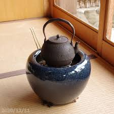
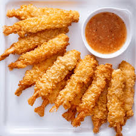
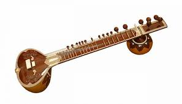
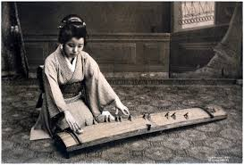
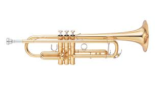
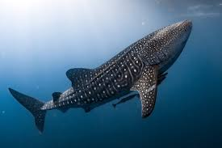
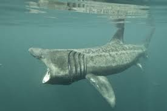
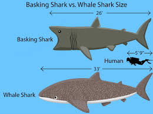

= step 2 - Lesson 24
:toc: left
:toclevels: 3
:sectnums:
:stylesheet: ../../+ 000 eng选/美国高中历史教材 American History ： From Pre-Columbian to the New Millennium/myAdocCss.css

'''

Lesson 24

== part 1. 部分

Brigid: Mrs. Kellerman, why is it that /some children perform much better /than others at school?

[.my2]
布里吉德：凯勒曼夫人，为什么有些孩子在学校的表现比其他孩子好得多？

Mrs. Kellerman: Obviously, it can’t be denied that /certain children are brighter than others, but it’s not as simple as that. A lot of emphasis 强调；重视；重要性 /*is placed on* intelligence /measured by tests — so-called I.Q. tests, which only measure certain types of intelligence.

[.my2]
凯勒曼夫人：显然，不能否认某些孩子比其他孩子更聪明，但事情并非那么简单。人们非常重视通过测试来衡量的智力——所谓的智商。测试，仅测量某些类型的智力。

Brigid: Such as?

[.my2]
布里吉德：比如？

Mrs. Kellerman: Basically linguistic 言的；语言学的 and numerical 数字的，用数字表示的 skills — or reading and mathematics, to put it plainly (坦率地) 说白了 — which is unfortunate /because some children *are bound (a.)一定会；很可能会 to* suffer. A good example was a friend of mine’s son /who *was kept out of* 使不进入；防止进入；把…关在外面 the top class at school /because of his average I.Q. — that’s around 100. His father, though 虽然，尽管 *he had no idea* /his son *was going to be* an architect 建筑师, always said /he was a clever child. Apparently he was able to picture (v.)想象；设想；忆起;描述；描写 things [in his mind] /and *draw accurately* at a very early age. The point is that /`主` his university life /`谓` might not have been so difficult /if his ability had *been recognized* sooner.

[.my2]
凯勒曼夫人：基本上是语言和数字技能——或者说白了，是阅读和数学——这是不幸的，因为有些孩子注定要受苦。一个很好的例子是我的一个朋友的儿子，他因为平均智商而被排除在学校的顶尖班级之外。 ——大约是 100。他的父亲虽然不知道他的儿子会成为一名建筑师，但总是说他是一个聪明的孩子。显然，他很小的时候就能够在脑海中描绘事物并准确地画画。关键是，如果他的能力早点得到认可的话，他的大学生活也许就不会那么艰难了。

Brigid: What you’re saying, then, is that /some children have abilities /that *are* not easy to measure (v.), that *aren’t appreciated* (v.)赏识，重视 by many schools.

[.my2]
布里吉德：那么，你的意思是，有些孩子的能力不容易衡量，很多学校都不欣赏这些能力。

Mrs. Kellerman: Precisely. And if these skills *are not spotted (v.)看见，注意到；发现，挖掘 sufficiently* early, they cannot *be developed*. That’s why, in my view, there are so many unhappy adults in the world. They are not doing the things 后定 they are best at.

[.my2]
凯勒曼夫人：没错。如果没有及早发现这些技能，它们就无法发展。在我看来，这就是为什么世界上有这么多不快乐的成年人。他们没有做他们最擅长的事情。

Brigid: What are these _other kinds of intelligence_, and how can we recognize (v.) them /in our children?

[.my2]
布里吉德：这些其他类型的智力是什么？我们如何在我们的孩子身上识别它们？

Mrs. Kellerman: Well, *take* musical talent. Many children never get the chance /to learn to play an instrument *but*, *while* they might not become great artists or composers 作曲家；作曲者, they may get a lot of pleasure and satisfaction. Musically gifted (a.)有天赋的，有才华的 children *are fascinated* (v.)深深吸引；迷住 by all kinds of sounds — car horns 汽车鸣笛, animal noises *and so on*. And they can easily recognize (v.) tunes 曲调；曲子 /and sing (v.) them in key （钢琴或其他乐器的）键.

[.my2]
凯勒曼夫人：好吧，就拿音乐天赋来说吧。许多孩子从未有机会学习演奏乐器，但虽然他们可能不会成为伟大的艺术家或作曲家，但他们可能会获得很多乐趣和满足。有音乐天赋的孩子会着迷于各种声音——汽车喇叭、动物的叫声等等。他们可以轻松识别曲调并用调唱。

Brigid: How *can* a parent *encourage* (v.) them?

[.my2]
布里吉德：家长如何鼓励他们？

Mrs. Kellerman: Sing (v.) to them / and teach (v.) them new songs. Buy a piano /or even a cheap instrument /such as a recorder 录音机；录像机;竖笛；直笛. If you can afford it, send them to lessons *as soon as possible*. *Play* (v.) recordings (n.)录音机；录像机 of different instruments *to* them.

[.my2]
凯勒曼夫人：给他们唱歌并教他们新歌。购买钢琴，甚至是便宜的乐器，例如竖笛。如果你能负担得起，尽快送他们去上课。给他们播放不同乐器的录音。

Brigid: What about a child /who is good at sport? Could that *be described as* a form of intelligence?

[.my2]
布里吉德：那么一个擅长运动的孩子呢？这可以被描述为一种智力形式吗？

Mrs. Kellerman: Most certainly. We psychologists call (v.) it _'motor' (a.)肌肉运动的；运动神经的, or bodily (a.)人体的；身体的, intelligence_. These children *move (v.) gracefully* 优雅地；温文地 /and *handle (v.) objects skillfully*. +
`主` #A child# /who finds it easy /*to take* things *apart* 拆开 /and use (v.) various tools /`谓` #may# well become an engineer [with the right encouragement].  +
We should *give* them models *to make* /and *take* them *to* science museums. However, unless these children *are also good with* words and numbers, they will probably *not do well* in school examinations.

[.my2]
凯勒曼夫人：当然。我们心理学家称之为“运动智力”或“身体智力”。这些孩子动作优雅，处理物体熟练。一个发现很容易拆开东西, 并使用各种工具的孩子, 在适当的鼓励下, 很可能成为一名工程师。我们应该给他们制作模型并带他们去科学博物馆。然而，除非这些孩子也擅长文字和数字，否则他们在学校考试中可能不会取得好成绩。

Brigid: Is there anything *a parent can do* /to help in this case?

[.my2]
布里吉德：在这种情况下，家长能提供什么帮助吗？

Mrs. Kellerman: Yes. It *may be* worth /spending money on private lessons. But, you know, hardly anyone *is good at* everything. In my opinion /a child *should be judged* on his individual talents. After all, being happy in life /`系` is `表` *putting* your skills *to* good use, *no matter* what they are.

[.my2]
凯勒曼夫人：是的。花钱上私人课程可能是值得的。但是，你知道，几乎没有人在所有事情上都擅长。在我看来，应该根据孩子的个人才能来评判他。毕竟，快乐的生活就是充分利用你的技能，无论它们是什么。

'''

== part 2. 部分

Teacher: I think /there are a lot of reasons /why it’s good for children to read. Er …​ Not just reading for pleasure, but all of the subjects 学科；科目；主题, no matter what subject it is, involve some reading, *even if* it’s just art. (Mmm.)  +

They have to read the directions 用法说明，操作指南 /to do an art project, and …​ ah. _Social Studies_ 社会学科 they have to read. Science they have to read. And *the more* they read, ah, *the easier*, ah, *the more* their vocabulary will expand, and *the better* the …​ they’ll do /in their other subjects. Erm …​ Also for, for pleasure, erm, es, er, especially here in Puerto Ordaz /where there aren’t very many things to do. In …​ instead of being out doing something 后定 they shouldn’t be doing, ah, they can choose reading *as a hobby*.

[.my2]
教师：我认为孩子们阅读有很多好处。嗯...不仅仅是为了愉悦地阅读，而是所有学科，不管是什么学科，都涉及一些阅读，即使是艺术也是如此。(嗯。) 他们必须阅读说明, 来完成艺术项目，而在"社会学"中他们也必须阅读，"科学"也需要阅读。而且，他们阅读得越多，他们的词汇量就会越丰富，他们在其他学科的表现也会更好。嗯...此外，对于愉悦而言，特别是在波多黎各奥达斯，这里没有很多事情可做。与其外出做一些不该做的事情，他们可以选择将阅读视为一种爱好。

Erm …​ It also improves their language tremendously 非常地；可怕地；惊人地. I can read a composition 作文；小论文 /that a student has written /that has, that reads a lot /and *I know*, er, *that* he reads a lot /by ① his use of the language and ② his vocabulary /and ③ a lot of _advanced sentence structure_ /that `主` someone of that age normally `谓` would not, er, be able to handle.

[.my2]
嗯...这也极大地提高了他们的语言能力。我可以阅读学生写的作文，如果他阅读得很多，我就能从他使用的语言、词汇, 和他目前的年龄不该具备的许多高级句子结构中, 知道这一点。

Erm …​ What else? Erm …​ Sometimes /`主` #children# who have very limited experiences, whose families ① don’t *get out* very much, er, ② maybe not have enough money, er, ah, ③ just stay at home a lot, `谓` #have# real limited experiences /and [by reading] they can expand their experiences about what happens in the world /and I’ve had children /who, in a reader 简易读物；读本, see a picture, an exercise /and they see a picture of a lion /and they don’t know what it is, because #either# their parents haven’t read to them, #or# they haven’t read books, or they haven’t been out.   +

And if they haven’t been to a zoo /to see an actual lion /they could have read in a book, or had their parents read to them about, er, lions. And they miss the, the problem, because #they may#, once you tell them what it is, #explain#, they can do the exercise, but because they didn’t know, didn’t have the experience, they weren’t able to do it.

[.my2]
嗯...还有什么？嗯...有时，一些经验非常有限的孩子，他们的家庭不经常外出，可能没有足够的钱，嗯，或者只是在家里呆很多时间，他们的经验非常有限，通过阅读可以扩展他们对世界发生的事情的经验。我曾经有过一些孩子，在阅读器上看到一张狮子的图片，他们不知道那是什么，因为他们的父母可能没有给他们读过书，或者他们自己没有读过书，或者他们没出去过。如果他们没有去动物园看到真正的狮子，他们就可能在一本书中读到，或者他们的父母给他们读过关于狮子的书。由于他们不知道，没有经验，他们无法完成练习。

Erm …​ er …​ *For* survival (n.)生存；存活；幸存 later, too. If you can’t read, erm, a cook-book or a, a manual /to, to repair things, you’re lost 迷失在……中 in that /you have to *rely on* someone else to, always. And you’re not, er, independent.

[.my2]
嗯...还有为了以后的生存。如果你不能阅读，不能阅读烹饪书或修理东西的手册，那么你在那方面就迷失了，你不得不始终依赖别人。而且你不是独立的。

Interviewer: What is it good for children to read?

[.my2]
记者：孩子读书有什么好处？

Teacher: I think children should read everything, that, er, not just *limit it #to#* mystery (n.)疑案小说（或电影、戏剧） books, or just *#to#* science fiction.  +

In fact /there are some children who, who say, 'No, no. *I just want to* read science fiction,' but, er, I think they should read, er, from different areas. Er …​ The newspaper, magazines.  +

The School *subscribes (v.) to* 同意；赞成, even though it’s a small school, we’ve gotten in the budget 预算 /approved to have fifteen magazines come in, and during their _Silent Sustained 持续的，持久的 Reading time_ /can read magazines.

[.my2]
教师：我认为孩子们应该阅读一切，不仅仅局限于悬疑小说或科幻小说。事实上，有些孩子可能会说，“不，我只想读科幻小说”，但我认为他们应该从不同的领域阅读。报纸、杂志。学校订阅了15种杂志，即使是一所小学，我们已经争取到了预算，让这些杂志进来，他们在安静持续阅读的时间, 可以阅读这些杂志。

[.my1]
.案例
====
.SUBˈSCRIBE TO STH
( formal ) to agree with or support an opinion, a theory, etc.同意；赞成 +
SYN believe in sth +
• The authorities no longer *subscribe to* the view /that _disabled (a.) people_ are unsuitable (a.) as teachers.当局不再支持残疾人不适宜做教师的观点。
====

Erm …​ if …​ Anything that’s written down, I think they should read. Whether a sign or newspaper, textbook, everything, and not just *limit it to* one or two things.  +

Erm …​ I think a lot of parents *disagree* (v.) that children, they say /if they’re reading comic books /they’re wasting their time, but if I have a child /who’s a poor student, if he’ll read a comic 喜剧的;连环漫画 book, er, I’m happy /because he’s reading something.  +

Or if he’s, while he’s eating breakfast /he’s reading the back of _the cereal 谷类食物；谷类植物 box_ /he’s still reading something /and I wouldn’t *take it away* from him /and say, 'Stop wasting your time,' Because that is a step /*to go on to* further reading /and if you *limit it to* certain areas, then that will, it sometimes, it will stifle (v.)压制；扼杀；阻止；抑制 them /and they’ll stop reading completely.  +

And they’ll say, 'If I can’t read the comic book /then I don’t want to read anything.' But reading the comic book could, erm, they say, 'Well I enjoyed this /and I understood this, er, I think I’ll try something else,' and that expands (v.) their reading. And they can learn (v.) something /from a comic book.

[.my2]
嗯...任何写下来的东西，我认为他们都应该阅读。无论是标志还是报纸、教科书，一切都应该阅读，而不仅仅局限于一两件事物。我认为很多家长不同意孩子们阅读漫画书，他们说如果他们读漫画书，他们就在浪费时间，但是如果我有一个学习差的孩子，如果他愿意读漫画书，我会很高兴，因为他至少在读一些东西。或者他在吃早餐时读谷物盒的背面，他仍然在读一些东西，我不会拿走他的东西，告诉他“别再浪费时间了”，因为这是继续阅读的一步，如果你局限于某些领域，有时会扼杀他们，他们可能会完全停止阅读。他们会说：“如果我不能读漫画书，那我就不想读任何东西了。”但读漫画书可能会使他们说：“嗯，我喜欢这个，我理解了这个，我想尝试其他东西”，这就扩展了他们的阅读。他们可以从漫画书中学到一些东西。

Erm …​ It’s also important, erm, if a student, if, `主` a lot of the kids `谓` want to play games /and they don’t, it’s a new game /they don’t know how to play, if they can’t read the instructions, then they won’t be able to play the game. Or, if they have a new toy, erm, if they can’t read the instructions, they could possibly break the toy, and, by *not learning* how to use it properly.

[.my2]
嗯...如果一个学生，很多孩子想玩游戏，他们不知道如何玩一个新游戏，如果他们不能阅读说明，那么他们就不能玩这个游戏。或者，如果他们有一个新玩具，如果他们不能阅读说明，他们可能会破坏玩具，因为他们不知道如何正确使用它。

'''

== part 3. 部分

*Ever since* you started to school, and perhaps before, you have been given tests.  +
One type of test /you have probably taken /`系`  is an intelligence test, a test /designed to determine your ability to learn /or your ability to change behavior /on the basis of experience.

[.my2]
自从你上学以来，也许是在上学之前，你就一直在接受测试。您可能参加过的一种测试是智力测试，该测试旨在确定您的学习能力, 或根据经验改变行为的能力。

It is not just test-givers /who make judgements about intelligence, however. `主` Most of us /`谓` make educated guesses or inferences (n.)推断；推理；推论 about how smart or intelligent 后定 a person is /from the way he does certain things.

We usually call people intelligent /if they *learn quickly*, *know* answers to a lot of questions, and can solve difficult problems. When a psychologist *studies* (v.) intelligence, there are many questions /that he wants to answer. But the first question he must ask *is*: What is intelligence?

[.my2]
然而，不仅仅是测试者对智力做出判断。我们大多数人都会根据一个人做某些事情的方式对他的聪明程度做出有根据的猜测或推断。如果人们学得很快，知道很多问题的答案，并且能够解决困难的问题，我们通常称他们为聪明人。当心理学家研究智力时，他想要回答很多问题。但他必须问的第一个问题是：什么是智力？

Most people *think of* intelligence *as* one ability. We say, "Ann is smart". But is intelligence really that simple? Is it only one ability? In trying *to understand* these questions, it might be helpful /*to look at* athletic 运动的，体育的；强壮的，健壮的 ability. If Mitch 人名 is a good basketball player, do we say that /he is a good athlete 运动员，体育健将? *What if* 如果...会怎么样 he is poor in baseball? *What if* he can’t play football? *Even if* a person is good at sports, is he equally good [in all of them]?

[.my2]
大多数人认为智力是一种能力。我们说，“安很聪明”。但智能真的那么简单吗？难道只有一种能力吗？在试图理解这些问题时，了解运动能力可能会有所帮助。如果米奇是一名优秀的篮球运动员，我们是否可以说他是一名优秀的运动员？如果他棒球不好怎么办？如果他不能踢足球怎么办？即使一个人擅长运动，他在所有运动上都同样擅长吗？

This is the same kind of problem we have /when we ask, "What is intelligence?" *What if* Estelle is very good in math, but very poor in spelling? Is she intelligent or unintelligent? Maybe there *is not* just one kind of intelligence, but several different kinds. You probably know people /who are very good in some subjects, but not good in others, and it is likely that /you are the same way. You find some subjects easier than others /and you do better in them. Most people are like that — they are not equally good in everything.

[.my2]
当我们问“什么是智力？”时，我们会遇到同样的问题。如果埃斯特尔数学很好，但拼写很差怎么办？她是聪明还是不聪明？也许智力不只是一种，而是几种不同的。您可能认识一些人，他们在某些科目上非常擅长，但在其他科目上却表现不佳，而且您很可能也是如此。你发现有些科目比其他科目更容易，而且你在这些科目上做得更好。大多数人都是这样——他们并不是在所有事情上都同样优秀。

In trying to understand the nature of intelligence, a psychologist tries to find out /how various abilities *are related to* each other. To do this, he devises (v.)发明；设计；想出 intelligence tests /which have several parts — each part measuring (v.) a different ability. `主` The kinds of abilities /that these tests measure (v.) /`谓` include:

[.my2]
在试图理解智力的本质时，心理学家试图找出各种能力之间的相互关系。为此，他设计了由多个部分组成的智力测试——每个部分测量不同的能力。这些测试衡量的能力类型包括：

[.my1]
.案例
====
.devise
[ VN] to invent sth new or a new way of doing sth发明；设计；想出
====

How well /words *can be defined and understood*;

[.my2]
词语的定义和理解程度如何；

How well /_arithmetic 算术 problems_ *can be done*;

[.my2]
算术问题能做得多好；

How well /facts *can be remembered*.

[.my2]
事实能被记住多少。

Are these abilities *related to* each other? If a student is good at solving arithmetic problems, will he also *be good at* remembering facts? If he can define and understand a lot of words, will he also be good in arithmetic?

To find the answers to these questions, the psychologist *correlates* (v.)显示（两个或多个事实或数字等）的紧密联系 the scores /*from* each part of the test. A correlation is _a mathematical way_ of *finding out* /if these abilities *are related to* each other.

If two abilities are correlated, it means that /if you *are good at* one, you will probably *be good at* the other — or, if you *are poor at* one, you will probably *be poor at* the other.

When two abilities *are not correlated*, it means that /they are not related to each other — they do not go together. It means that /`主` being good at one /`谓` *has nothing to do with* being good at another.  +
For example, success in mathematics /*is not correlated with* success in playing baseball. Some people /who are good baseball players /*are good* in math — others are not.

[.my2]
这些能力彼此相关吗？如果一个学生擅长解决算术问题，他也会擅长记住事实吗？如果他能定义和理解很多单词，他的算术也会好吗？为了找到这些问题的答案，心理学家将测试每个部分的分数关联起来。相关性是一种找出这些能力是否相互关联的数学方法。如果两种能力是相关的，这意味着如果你擅长一种能力，你可能会擅长另一种能力，或者，如果你不擅长一种能力，你可能会不擅长另一种能力。当两种能力不相关时，就意味着它们彼此不相关——它们不会同时出现。这意味着擅长一件事与擅长另一件事无关。例如，数学上的成功与打棒球上的成功并不相关。有些优秀的棒球运动员擅长数学，而另一些人则不然。

[.my1]
.案例
====
.correlate
1.[ V] if two or more facts, figures, etc. correlate or if a fact, figure, etc. correlates with another, the facts are closely connected and affect or depend on each other 相互关联影响；相互依赖 +
• The figures *do not seem to correlate*. 这些数字似乎毫不相干。 +
• A high-fat diet *correlates with* a greater risk of heart disease. 高脂肪饮食, 与增加心脏病发作的风险, 密切相关。

2.[ VN] to show that there is a close connection between two or more facts, figures, etc. 显示（两个或多个事实或数字等）的紧密联系 +
• Researchers are trying *to correlate* the two sets of figures. 研究人员正试图展示这两组数字的相关性。
====

*Think of* all the mental and athletic 运动的，体育的 abilities /shown by your friends and schoolmates 同学. Can you *think of* some abilities and skills /that seem highly correlated? Can you *think of* some abilities /which do not seem *to be correlated*? Why do you think /some abilities *are* correlated (a.) /and others *are not*?

[.my2]
想想你的朋友和同学所表现出的所有智力和运动能力。你能想到一些看起来高度相关的能力和技能吗？你能想到一些看似不相关的能力吗？为什么你认为有些能力是相关的，而另一些则不是？

'''

==  part 4. 部分

There are many factors /*to keep in mind* about _intelligence tests_. It is especially important /to realize that /_intelligence tests_ measure (v.) how well you do [at the time you take the test], but not how well you could do.

There are many reasons /why a student *might not do well* on a test in school. A person *may do poorly* on an intelligence test /because he did not have a proper education /and not because he is stupid. Also, some of the problems and questions of intelligence tests /are not fair 公平的；合理的，公正的 /to certain groups of people.

[.my2]
关于智力测试有很多因素需要牢记。尤其重要的是要认识到，智力测试衡量的是您参加测试时的表现，而不是您可以做得如何。学生在学校考试中表现不佳的原因有很多。一个人在智力测试中表现不佳可能是因为他没有受过适当的教育，而不是因为他愚蠢。另外，智力测试的一些问题和问题对于某些人群来说并不公平。

For example, *suppose (v.)假定；假设；设想 that* /the problems and questions on a test /are about _ice cream cones_ 锥形体, baseball, automobiles and hot dogs. How would a student from another country, where these things do not exist, do [on this test]? Could he do *as well as* an average American boy?

*What if* you took an intelligence test /which asked questions about the hibachi （日）木炭火盆；烤肉炉, tempura 天妇罗（日本菜肴） and saki 日本米酒? Any Japanese boy /could answer these questions, but you probably couldn’t. Does this mean that /you are not intelligent?

*No matter* how intelligent a person is, he will not be able to answer questions /about things he has never seen or heard of. When a test has a lot of "unfair" questions, do the results *tell* us *much about* a person’s intelligence? Why not?

[.my2]
例如，假设测试中的问题和问题是关于冰淇淋甜筒、棒球、汽车和热狗。一个来自其他国家的学生，如果这些东西不存在的话，在这个测试中会表现如何？他能像普通美国男孩一样出色吗？如果你参加了一项智力测试，询问有关火盆、天妇罗和清酒的问题，结果会怎样呢？任何日本男孩都能回答这些问题，但你可能不能。这是否意味着你不聪明？一个人无论多么聪明，他都无法回答他从未见过或听说过的事物的问题。当测试有很多“不公平”的问题时，结果能告诉我们很多关于一个人的智力吗？为什么不？

[.my1]
.案例
====
.hibachi (ひばち)
（日）木炭火盆；烤肉炉 +

.tempura (天ぷら)
在日式菜点中，用面糊炸的菜统称"天妇罗"。天妇罗以"鸡蛋面糊"为最多，"调好的面糊"叫"天妇罗衣".

====

Some questions *would be "unfair"* /to almost all American test takers 接受者. How can you tell /if a test question is "unfair"? Here is one to consider: Which of the following _four musical instruments_ /*is different from* the others /in an important way: VIOLIN, SITAR 锡塔尔琴, KOTO （日）十三弦古筝, TRUMPET 小号；喇叭.

[.my2]
有些问题对几乎所有美国考生来说都是“不公平的”。如何判断测试问题是否“不公平”？这里有一个需要考虑的问题：以下四种乐器中哪一种与其他乐器有重要的不同：小提琴、西塔琴、古筝、小号。

[.my1]
.案例
====
.sitar
a musical instrument from S Asia like a guitar , with a long neck and two sets of metal strings西塔尔（源自南亚形似吉他的弦乐器） +

.KOTO (こと)

.trumpet

====

`主` What makes this question *unfair to* most American boys and girls /`系` is that /two of the four words *are* from foreign languages. The test taker *has no way of* know**ing** what they mean. Therefore, if you don’t know what a word means, how can you decide that /it *is*, or *is not*, different from the other words?

[.my2]
这个问题对大多数美国男孩和女孩不公平的是，这四个单词中有两个来自外语。考生无法知道它们的意思。因此，如果你不知道一个词的含义，你如何判断它与其他词有什么不同呢？

The same question /can be made into a fair intelligence-test question. It can be done very easily /by *adding* pictures *next to* each word /and asking the question again.

[.my2]
同样的问题可以做成一道公平的智力测试题。通过在每个单词旁边添加图片, 并再次询问问题，可以非常轻松地完成此操作。

*To find out* /宾从 if `主` the question 后定 without pictures `系`  is "unfair", ask (v.) people to answer it. Do not let them see the picture next to each word. Ask them /why they gave the answer they did. Now show them the question with the pictures. `主` *Do* #the people# /who are questioned /`谓` *#give#* correct answers *more frequently* [the first time], without pictures, or the second time, with pictures?

[.my2]
要了解没有图片的问题是否“不公平”，请人们回答。不要让他们看到每个单词旁边的图片。问他们为什么给出这样的答案。现在用图片向他们展示问题。被提问者第一次没有图片时给出正确答案的频率更高，还是第二次有图片时给出正确答案的频率更高？

[In what ways] *do* the pictures *help* people answer the question? Is #it# true /#that# the question without pictures is "unfair" /and the one with pictures is "fair"? Can you *think of* a question /that *would be fair* to boys and girls /all over the world? Intelligence *is partly measured* by the ability /to put information together /and use it to answer questions. How does this *apply to* the question on musical instruments? `主` Can the most intelligent person you know /`谓` answer this question: What colour hair *does* each author of this book *have*?

[.my2]
图片以什么方式帮助人们回答问题？难道真的没有图片的问题是“不公平”而有图片的问题是“公平”吗？你能想出一个对全世界男孩和女孩都公平的问题吗？智力在一定程度上是通过将信息组合在一起并用它来回答问题的能力来衡量的。这如何适用于乐器问题？你认识的最聪明的人能回答这个问题：这本书的每位作者的头发是什么颜色的？

'''

== part 5. 部分

====  (Politics)

（政治）

When a party *is elected to* Parliament in Britain /it may not *stay in power* /for more than five years /without *calling an* election. But — now this is an important point — _the Prime Minister_ may '*go to the country*' 重新选举, that’s to say /call an election /*at any time* before the five years are up. This is important /because it gives _the Prime Minister_ in Britain _a lot of power_ — he can choose the best time /to have an election /for his own party. In many other countries /the timing of an election *is fixed* — it must *take place* /on a certain date /every four years, or whatever, and this means that /in these countries /the President or _Prime Minister_ 首相，总理 cannot choose the most convenient time for himself, the way a British Prime Minister can.

[.my2]
在英国，当一个政党当选为议会议员时，如果不举行选举，它的执政时间可能不会超过五年。但是——现在这是很重要的一点——总理可以“下乡”，也就是说在五年期满之前随时召集选举。这很重要，因为它赋予英国首相很大的权力——他可以选择为自己的政党举行选举的最佳时机。在许多其他国家，选举的时间是固定的——必须每四年在某个特定日期举行一次，或者以其他方式举行，这意味着在这些国家，总统或总理无法选择自己最方便的时间，英国首相可以。

[.my1]
.案例
====
.go to the country
to have an election
====

==== (Medicine)

（医学）

`主` One of _the most dramatic examples_ of the effect of _advances in medical knowledge_ /`系`  is _the building of the Panama Canal_. In 1881 /work *was started* on this canal 运河，灌溉渠 /under the supervision 监督，管理 of De Lesseps, the Frenchman who built the Suez Canal. The project had to *be abandoned* /after `主`  _mosquito-borne (a.)蚊媒的,蚊虫传播的 diseases_ of _yellow fever_ and malaria `谓` *had claimed* 16,000 victims among the workers.

At the beginning of this century, the area *was made healthy* /by *#spraying#* _the breeding （为繁殖的）饲养;（动植物的）生育，繁殖 waters_ of the mosquitoes [*#with#* petroleum 石油；原油]. Work was able to *be started again* /and the canal *was finished* in 1914.

[.my2]
医学知识进步的影响最引人注目的例子之一是巴拿马运河的修建。 1881 年，在修建苏伊士运河的法国人德莱赛的监督下，这条运河的工程开始了。在黄热病和疟疾等蚊媒疾病导致 16,000 名工人死亡后，该项目不得不放弃。本世纪初，通过向蚊子的繁殖水域喷洒石油，该地区变得健康。工程得以重新开始，运河于 1914 年竣工。

==== (Sport)

（运动）

By the way, since we *have mentioned* the Olympic Games, you may be interested to know /the following _curious 稀奇古怪；奇特；不寻常 fact_ /about the ancient Olympic Games *as compared to* the Modern Olympics. The ancient games *were held* every four years without interruption /for over 1,000 years. The modern games *have already been cancelled* three times, in 1916, 1940 and 1944, because of world wars.

[.my2]
顺便说一句，既然我们提到了奥运会，您可能有兴趣了解以下关于古代奥运会与现代奥运会相比的有趣事实。古代运动会每四年举行一次，从未间断，已有一千多年历史。由于世界大战，现代奥运会已经在1916年、1940年和1944年三次被取消。

==== (Zoology)

（动物学）

Although 虽然，尽管 it is not [strictly speaking 严格来说]  *relevant to* our topic, perhaps I might say something about sharks /since they are in the news /quite a lot these days. Sharks have got _a very bad reputation_ 名誉，名声 /and probably most people think that /all sharks are killers. This is not the case. In fact, the largest sharks of all, I mean _the Whale Shark_ 鲸鲨 and _the Basking Shark_ 晒暖鲨； 姥鲨, are usually harmless to man.

[.my2]
虽然严格来说这与我们的主题无关，但也许我可以说一些关于鲨鱼的事情，因为这些天它们经常出现在新闻中。鲨鱼的名声很坏，可能大多数人都认为所有的鲨鱼都是杀手。不是这种情况。事实上，最大的鲨鱼，我指的是鲸鲨和姥鲨，通常对人类无害。

[.my1]
.案例
====
.Whale Shark
鲸鲨是最大的鲨, 体长20米左右. 它们经常被科学家用来教育社会大众，不是所有的鲨鱼都会“吃人”。实际上，鲸鲨的个性是相当温和的. +
鲸鲨通常单独活动，除非在食物丰富的地区觅食，否则它们很少群聚在一起。 +

.Basking Shark
姥mǔ鲨. 姥鲨是仅次于鲸鲨的世界第二大滤食鲨。体长一般为7-8米，大者可达15米。姥鲨的生性非常温和，故被称作“姥”鲨，它主要以浮游的无脊椎动物和小型鱼类为食. +

====

'''

== part 6. 部分

Moon River

Moon river wider (a.) than a mile +
I’m crossing you [in style] some day

[.my2]
有一天我会优雅地遇见你

Oh, dream maker 梦想实现者, you _heart breaker_ 令人伤心的人 +
Wherever you're going, I'm going your way

[.my2]
无论你到哪里，我都和你一起

Two drifters 漂流者；流浪者, off to see the world +
There’s such a lot of world to see +
We’re after the same rainbow’s end, Waiting round 在周围；围绕 the bend （尤指道路或河流的）拐弯，弯道

My Huckleberry friend

[.my2]
我的哈克贝利朋友

Moon river and me

[.my1]
.案例
====
.round
(ad.) ( informal ) to or at a particular place, especially where sb lives 到某地，在某地（尤指居住地） +
• *I'll be round* in an hour.我过一个小时就到。 +
• We've *invited the Frasers round* this evening.我们已经邀请了弗雷泽一家今晚过来。
====

'''
