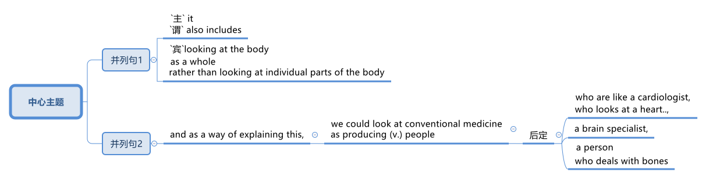
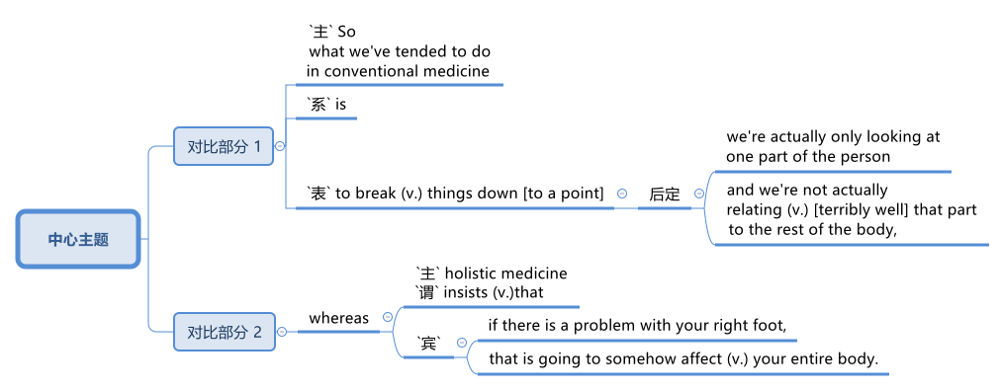
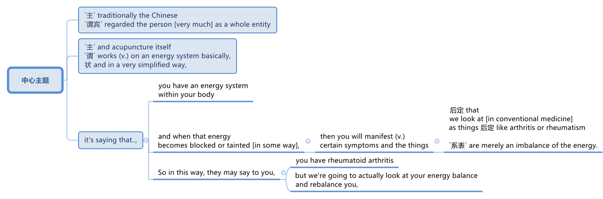
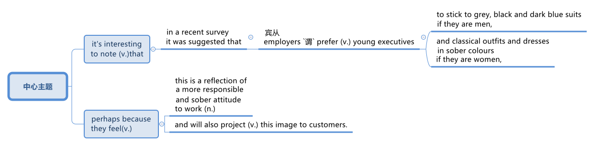

= step 2 - Lesson 27
:toc: left
:toclevels: 3
:sectnums:
:stylesheet: ../../+ 000 eng选/美国高中历史教材 American History ： From Pre-Columbian to the New Millennium/myAdocCss.css

'''

Lesson 27

== part 1

Interviewer: I understand /you’re interested in _holistic 整体的；全面的 medicine_. Can you explain /what _holistic medicine_ is?

[.my2]
采访者：我知道您对整体医学感兴趣。您能解释一下什么是整体医学吗？

[.my1]
.案例
====
.holistic
(a.)
1.( informal ) considering a whole thing /or being to be more than a collection of parts 整体的；全面的 +
- a holistic approach (n.) to life 对生命的全面探讨

2.( medical 医) treating (v.) the whole person *rather than* just the symptoms 症状；症候；病征 (= effects) of a disease 功能整体性的 +
- holistic medicine 整体医学
====

Vivienne: OK. Holistic medicine, um, *takes into consideration* the whole of the person.  +
Now `主` what this means /in, in most holistic systems /`谓` *is regarding* (v.)将…认为；把…视为；看待 the person *as* ① a physical entity, ② a mental (a.)思想的；精神的；思考的；智力的 or emotional person, ③ and also even their _spiritual 精神的；心灵的 side_ of them.

Um, it also includes (v.) *looking at* the body *as a whole* /rather than *looking at* individual parts of the body, and as a way 后定 of explaining this, we could *look at* _conventional 传统的；习惯的 medicine_ *as* producing (v.) people 后定 who are like ① #a cardiologist# 心脏病医生；心脏病学家, who *looks at* a heart, um, ② #a brain specialist# 专家；专科医生, a person who *deals with* bones, er, etc.

[.my1]
.案例
====

====

So `主` what we’ve tended (v.)倾向于，往往会 to do /in conventional medicine /`系` is *break* (v.) things *down to a point* /where we’re actually only *looking at* one part of the person /and we’re not actually *#relating# (v.)联系；使有联系；把…联系起来 [terribly 非常；很 well]* that part /*#to#* the rest of the body, *whereas* （表示对比）但是，然而 _holistic medicine_ *insists (v.) that* /if there is a problem, er, with your right foot, that *is going to* somehow, um, *affect* (v.) your entire body.

[.my2]
薇薇安：好的。整体医学，嗯，考虑到人的整体。现在，在大多数整体系统中，这意味着将人视为一个物理实体、一个精神或情感的人，甚至是他们的精神层面。嗯，它还包括将身体视为一个整体，而不是观察身体的各个部分，作为解释这一点的一种方式，我们可以将传统医学, 视为培养像心脏病专家一样的人，他们会观察心脏，嗯，一位大脑专家，一个处理骨骼的人，呃，等等。所以我们在传统医学中倾向于做的, 是将事情分解到我们实际上只关注人的一个部分, 并且事实上，我们并没有很好地将该部分, 与身体的其他部分联系起来，而整体医学坚持认为，如果你的右脚有问题，呃，那会以某种方式，嗯，影响你的整个身体。

[.my1]
.案例
====

====

Interiewer: Um, your speciality 专业；专长;特产；特色菜 is acupuncture 针灸，针刺疗法. Er, is that a part of _holistic medicine_?

[.my2]
Interiewer：嗯，你的专长是针灸。呃，这是整体医学的一部分吗？

[.my1]
.案例
====
.acupuncture +
-> 词根ac, 尖。puncture, 刺。
====

Vivienne: Acupuncture is very much a holistic system.  +

Um, traditionally /the Chinese *regarded* (v.)the person very much *as* _a whole entity_ /and acupuncture itself *works (v.) on* _an energy system_ basically, and in a very simplified way, it’s saying that, er, you have _an energy system_ within your body /and when that energy *becomes blocked (a.) or tainted* (a.)污染的；感染的 in some way, then you will *manifest* (v.)表明，清楚显示（尤指情感、态度或品质）;显现；使人注意到 certain symptoms /and `主` #the things# /后定 that we *look at* in conventional medicine *as* things 后定 like arthritis 关节炎 or rheumatism 风湿病 /`系` #*are*#, to the Chinese, *merely* an imbalance 衡；不平衡；不公平 of the energy.

So, in this way, they may *say to you*, well, yes, you have _rheumatoid 类风湿病的 arthritis_ 关节炎 /but we’*re going to actually look at* your energy balance /and rebalance (v.)再平衡；调整 you, and, as a result, your symptoms *should disappear*.

[.my2]
Vivienne：针灸在很大程度上是一个整体系统。嗯，传统上中国人将人视为一个整体，而针灸本身基本上是在一个能量系统上起作用，以一种非常简单的方式，它是说，呃，你体内有一个能量系统，当这个能量变成如果受到某种方式的阻塞或污染，那么你就会表现出某些症状，而我们在传统医学中所看到的疾病，如关节炎或风湿病，对中国人来说，只是能量的不平衡。因此，通过这种方式，他们可能会对你说，嗯，是的，你患有类风湿性关节炎，但我们将实际检查你的能量平衡, 并重新平衡你，结果，你的症状应该消失。

[.my1]
.案例
====

====

Interviewer: Um, is acupuncture /essentially a form of preventative medicine?

[.my2]
采访者：嗯，针灸本质上是一种预防医学吗？

Vivienne: Traditionally, it was, very much.  +
Um, in fact, traditionally, in China, people only *used to* 过去常常 pay (v.) the doctor /while they were well /and they *used to* go to their doctor fairly 相当地，颇 regularly on, you know, maybe four or five times a year, and they would only pay the doctor /when they were kept well. +
And if they *got sick* 得病了, they didn’t pay the doctor.  +

And the doctor had various methods /of which #acupuncture# was one, #diet# was another, #exercise# was another, er, of ensuring (v.)保证；确保；担保 that /the person lived a right life style /and their emphasis 强调，加重语气，重读 was on /if you’re living a right life style, if you’re living *in tune （与…）协调,一致 with* the laws of the universe, *going to sleep* /when it’s dark, *waking up* /when it’s light, working, resting, doing all these things properly, then you won’t *get sick*.

Unfortunately, our way of *looking at* life in the West /is very different /in that ① we tend *to struggle (v.) on* /*in spite of* our headache /② and not *take terribly much notice of* our body /when things are not quite right / ③ and we tend *to struggle on* /until we *fall over* 倒下 / ④ and we *get carted (v.)用马车运送；用车装运 off* to hospital /in an ambulance.

And so, acupuncture in the West, unfortunately, in a way, *has come to be* not the preventative medicine /that it *could be* /because we’re not taking responsibility enough for ourselves /in *going along* 继续,进展；发展 and *making sure that* /we stay well.

[.my2]
Vivienne：传统上，是的，非常如此。嗯，事实上，在中国传统上，人们只在健康时才付医生的钱，他们通常每年会定期去看医生，可能是四五次，只有在保持健康时才付医生的费用。如果他们生病了，他们不会付医生的钱。医生有各种方法，其中针灸是一种，饮食是另一种，锻炼是另一种，以确保人们过上正确的生活方式，他们的重点是，如果你过着正确的生活方式，如果你与宇宙法则和谐相处，当天黑时睡觉，天亮时醒来，工作、休息，正确地做所有这些事情，那么你就不会生病。不幸的是，我们西方人看待生活的方式非常不同，我们往往会在头痛时依然奋斗，当身体状态不太对劲时并不特别注意，我们往往会一直挣扎下去，直到倒下去，然后被救护车送到医院。因此，不幸的是，在西方，针灸在某种程度上已经不再是预防性医学，因为我们没有为自己的健康负责, 去确保我们保持健康。

[.my1]
.案例
====
.used to
used to say that sth happened continuously or frequently during a period in the past （用于过去持续或经常发生的事）曾经 +
- You *used to* see a lot of her, didn't you?你过去常见她吧？

.be ˌin/ˌout of ˈtune (with sb/sth)
to be/not be in agreement with sb/sth; to have/not have the same opinions, feelings, interests, etc. as sb/sth （与…）协调╱不协调，一致╱不一致，融洽╱不融洽 +
- These proposals are perfectly *in tune with* our own thoughts on the subject.这些建议, 与我们在这个问题上的想法, 完全一致。 +
- The President *is out of tune /with* public opinion.总统与公众舆论大唱反调。
====

'''

== part 2. 部分

Janice: So you really believe #that# /clothes carry a kind of message for other people /and #that# `主` what we put on /`系` is [in some way] a reflection of what we feel?

[.my2]
珍妮丝：所以你真的相信, 衣服向其他人传达了一种信息，而我们穿的衣服, 在某种程度上反映了我们的感受？

Pauline: Oh yes, very much so. People are beginning now /to take seriously the idea /of a kind of psychology of clothing, to believe that /there is #not# just _individual taste_ /in our clothes /#but also# a thinking /behind what we wear /which is trying to express (v.) something /we may not even *be aware of* ourselves.

[.my2]
宝琳：哦，是的，非常如此。人们现在开始认真对待服装心理学的概念，相信我们的衣服不仅有个人品味，而且还有我们穿着背后的思考，它试图表达一些我们甚至可能没有意识到的东西我们自己。

Janice: But surely /this has always been the case.  +
We all *dress up* 打扮，装饰 /when we want to impress someone, *such as* for a job interview /with a prospective employer; we tend to make an effort /and *put on* something smart.

[.my2]
珍妮丝：但确实情况一直如此。当我们想要给某人留下深刻印象时，例如去面试未来的雇主时，我们都会盛装打扮；我们倾向于做出努力, 并穿上一些聪明的衣服。

Pauline: True, but that’s _a conscious 慎重的；有意的；刻意的 act_.  +
What I’m talking about *is* more of _a subconscious 下意识的，潜意识的 thing_.  +

*Take for example* the student /who is *away from home* at college or university: if he tends *to wrap himself up* /*more than* the others, this is because /he is probably feeling homesick.  +
Similarly, a _general 全体的；普遍的；总的 feeling_ of insecurity /can sometimes *take* (v.) the form of over-dressing /*in* _warmer clothes_ /*than* are necessary.

[.my2]
Pauline：确实如此，但这是一种有意识的行为。我所说的更多的是潜意识的事情。以离家在外的大学生为例：如果他比其他人更倾向于把自己包裹得更紧，这可能是因为他想家了。同样，普遍的不安全感, 有时会表现为穿得过多、过分保暖的衣服。

Janice: Can you *give any other examples* of this kind?

[.my2]
珍妮丝：你还能举出其他类似的例子吗？

Pauline: Yes. I think /`主` people /who are sociable and outgoing 爱交际的，外向的 /`谓` tend to dress (v.) /in an extrovert (n.)性格外向者；活泼自信的人 way, *preferring* brighter or more dazzling 使目眩，使眼花 colours — yellows, bright reds, and so on.

In the same way, what might *be seen as* a parallel 平行的;极相似的；同时发生的；相应的；对应的 with the animal kingdom, _aggressive clothes_ *might indicate* _an aggressive personality or attitude_ to life.  +
*Think about* the threat  威胁，恐吓 displays (n.) /used by animals /when they want *to warn off* 警告某人离开 opponents.

[.my2]
宝琳：是的。我认为善于交际、外向的人倾向于外向的着装，喜欢更明亮或更耀眼的颜色——黄色、鲜红色等。同样，攻击性的衣服可能与动物王国相似，可能表明攻击性的个性或生活态度。想想动物在警告对手时所使用的威胁表现。

Janice: Do you think /`主` the care — or *lack of it* — over the way /后定 we actually wear (v.) our clothes /`谓` has anything to tell us?

[.my2]
珍妮丝：你认为, 我们对实际穿衣方式的关心（或缺乏关心）, 能告诉我们什么吗？

Pauline: Yes, indeed. `主` #The length#, for example, #of# a man’s trousers /`谓` speaks (v.) volumes 量；额 about _his awareness 知道；认识；意识；兴趣 of his own image_. Or, if his trousers are at half-mast 下半旗, all sort of 各种各样的 *hanging down* 下垂, this probably means (v.) /he’*s absorbed* (v.)吸引全部注意力；使全神贯注 by other things.

[.my2]
宝琳：是的，确实如此。例如，一个男人裤子的长度, 就足以说明他对自己形象的认识。或者，如果他的裤子下半旗，有点垂下来，这可能意味着他正在忙于其他事情。

Janice: Really.

[.my2]
珍妮丝：真的。

Pauline: Or, to give you other examples, `主` often #minority groups#, who have perhaps failed to persuade [with words], `谓` #tend# to express (v.) themselves /by wearing unconventional 非传统的,非常规的, or what /后定 some *might consider* (v.) outrageous 骇人的；无法容忍的 clothing, *as a way /of* showing `主` their thoughts and feelings `系` *are* different from the rest, and so /they find an outlet /in this way.

[.my2]
Pauline：或者，举个其他例子，少数群体往往无法用语言说服他们，倾向于通过穿着非常规的服装来表达自己，或者一些人可能认为令人难以忍受的服装，以此来表达他们的想法和感受是不同的。与其他人不同，所以他们通过这种方式, 找到一个出口。

Janice: That surely *spills over into* 溢出；漫出;波及 other things *as well*.

[.my2]
珍妮丝：这肯定也会影响到其他事情。

[.my1]
.案例
====
.spill ˈover (into sth)
(1)to fill a container and go over the edge 溢出；漫出 +
- She filled the glass so full /that the water *spilled over*.她往杯子里倒水倒得太满，都溢出来了。 +
- Her emotions *suddenly spilled over*.她突然就控制不住自己的感情了。

(2)to start in one area and then affect other areas 波及 +
- Unrest *has spilt over into areas* outside the city. 骚乱已经波及城市的周边地区。
====

Pauline: Oh yes, indeed. Haircuts 发型；发式, jewellery, kinds of fabric used — these things *can all be* a form of rebellion.  +
But *to get back to* clothes, I would like to add that /`主` a whole lot about our personality 个性，性格；魅力 /`谓` *is conveyed* (v.)表达，传递（思想、感情等） /in our clothes /and the way we look — aggressiveness, rebelliousness 造反；叛逆性, happiness, sadness, and so on.

These can all *be interpreted*. *Think of* the ageing _pop star_ /who may *be pushing* middle age, he’ll *keep on* dressing up like a rebel 叛乱者；造反者 /to try to prove he’s 'with it' still, and *in touch with* his young fans and current trends.

[.my2]
宝琳：哦，是的，确实如此。发型、珠宝、使用的各种布料——这些东西都可以是叛逆的一种形式。但回到衣服上，我想补充一点，我们的性格, 很大程度上是通过我们的衣服和我们的外表, 来传达的——攻击性、叛逆性、快乐、悲伤等等。这些都可以解读。想想那些可能已经步入中年的流行歌星，他会继续打扮得像个叛逆者，试图证明他仍然“坚持下去”，并与他的年轻歌迷和当前的趋势, 保持联系。

Janice: Do you think that /`主` at _work clothes_ and _general appearance_ /`谓` have any significance?

[.my2]
珍妮丝：你认为工作服装和整体仪表, 有什么意义吗？

Pauline: Definitely 肯定地，当然. We’*ve already spoken* about _job interviews_ a bit, and *it’s interesting /to note (v.) that* /in a recent survey /it was suggested that /employers *prefer* (v.) young executives ① *to stick to* _grey, black and dark blue suits_ /if they are men, ② and _classical outfits 全套装备；一套服装 and dresses_ in _sober 持重的；冷静的;素净的；淡素的 colours_ /if they are women, perhaps because they feel /① this is a reflection of _a more responsible and sober attitude_ to work /② and will also *project* (v.) this image *to* customers.

[.my2]
宝琳：当然。我们已经谈过一些关于工作面试的问题，有趣的是，在最近的一项调查中，雇主更喜欢年轻管理人员在男性中穿灰色、黑色和深蓝色西装，而穿着古典服装和连衣裙。如果她们是女性，则可能会选择清醒的颜色，也许是因为她们觉得这是一种更负责任、更清醒的工作态度的体现，也会将这种形象投射给顾客。

[.my1]
.案例
====

====

Janice: Do you *subscribe (v.)同意；赞成 to* this opinion?

[.my2]
珍妮丝：你同意这个观点吗？

Pauline: I personally think that /too much conservatism 保守主义；守旧性 *defeats* (v.)the object of the clothes industry.  +
They want to create new fashions and colour /to sell clothes, so I can’t really say that /I *go along wholeheartedly 全心全意地，全神贯注地 with* 赞同某事；和某人观点一致 it.  +
There *should be* room for manoeuvre 细致巧妙的移动；机动动作, *leaving* people scope (n.)（做或实现某事的）机会，能力;（题目、组织、活动等的）范围 /*to express* (v.) their individuality /*in* what they are wearing.

[.my2]
Pauline：我个人认为，太多的保守主义会挫败服装行业的目标。他们想创造新的时尚和颜色来卖衣服，所以我不能说我全心全意地支持他们。应该有回旋的余地，让人们在着装上表现自己的个性。

[.my1]
.案例
====
.go aˈlong with sb/sth
to agree with sb/sth 赞同某事；和某人观点一致 +
- *I don't go along with* her views /后定 on private medicine.在私人行医的问题上，我不敢苟同她的观点。
====

'''

== part 3. 部分

We’ve all seen them /on TV commercials  商业广告；宣传, ① looking out at us /from the covers of _glossy 光滑的；光彩夺目的；有光泽的;浮华的；虚有其表的 magazines_ /② or *showing off* 炫耀；卖弄；显示 the latest creations (n.) 后定 from Paris, and it must *have seemed [to us] that* /they *have* lives (n.) /后定 which are all glamour.  +
Jeffrey Ingrams has been *delving (v.)探索；探究；查考 into* the world of the fashion model /and *has come up with* 找到（答案）；拿出（一笔钱等） some interesting facts.

[.my2]
我们都在电视广告中见过他们，从光鲜亮丽的杂志封面上看着我们，或者炫耀来自巴黎的最新创作，在我们看来，他们的生活一定充满魅力。杰弗里·英格拉姆斯（Jeffrey Ingrams）一直在深入研究时装模特的世界，并得出了一些有趣的事实。

[.my1]
.案例
====
.DELVE ˈINTO STH
to try hard to find out more information about sth 探索；探究；查考 +
-> delve: 来自PIE*dhelbh, 挖 to dig
====

Denise: The average model /can earn (v.) *roughly the same as* a top secretary on the basis, that is, that she’s a freelance with an agent who’ll send her out for auditions and interviews and get work for her.

[.my2]
丹尼斯：普通模特的收入, 与高级秘书大致相同，也就是说，她是一名自由职业者，有经纪人派她出去试镜和面试，并为她找到工作。

Jeffrey: Denise Harper is a model agent. The Central Model Agency, in which she’s a partner, is very closely associated with the Metropolitan Academy of Modelling, where dozens of aspiring models have come over the years to pay their money to take a basic course in the techniques of being a model. Just over five years ago, one such aspiring model was eighteen-year-old Margaret Connor, fresh from school.

[.my2]
杰弗里：丹尼斯·哈珀是一名模特经纪人。她是中央模特经纪公司的合伙人，该机构与大都会模特学院关系密切，多年来，数十名有抱负的模特来到该学院付费参加模特技术的基础课程。就在五年前，十八岁的玛格丽特·康纳 (Margaret Connor) 就是这样一位有抱负的模特，她刚从学校毕业。

Margaret: Your mother has told you that you’re a pretty girl and you think that you’re God’s gift. You’re not, of course, but the Academy give you the works, how to do make-up, how to walk, how to do your hair, dress sense, the lot.

[.my2]
玛格丽特：你妈妈告诉过你，你是一个漂亮的女孩，你认为你是上帝的礼物。当然，你不是，但学院给你作品，如何化妆，如何走路，如何做头发，着装品味，等等。

Jeffrey: Now before we go any further I really ought to give you some idea of what Margaret looks like. She’s about 5 feet 8 inches tall, with shoulder-length auburn hair, hazel eyes and a ready smile. Like Margaret, every model has her index card which potential clients can keep in their files to refer to. When not working, Margaret is a rather prettier-than-average girl-next-door, but her photograph alone seemed to show that she can be as versatile and as fashionable as anyone might want. But why did Denise Harper pick her out from the other similar applicants for the modelling course at the Academy?

[.my2]
杰弗里：现在，在我们进一步讨论之前，我真的应该让你了解一下玛格丽特的长相。她身高约 5 英尺 8 英寸，留着及肩的赤褐色头发、淡褐色的眼睛和笑容。像玛格丽特一样，每个模特都有她的索引卡，潜在客户可以将其保存在他们的文件中以供参考。不工作时，玛格丽特是一个比一般人漂亮的邻家女孩，但仅凭她的照片似乎就表明她可以像任何人想要的那样多才多艺和时尚。但为什么丹尼斯·哈珀从其他类似的申请者中挑选了她来参加学院的模特课程呢？

Denise: I always look for personality, poise, good height and, very important, initiative, all of which Margaret has. You try to find above all a girl who you think will work and is not only in it for the money.

[.my2]
丹尼斯：我总是寻找个性、沉着、良好的身高，以及非常重要的主动性，所有这些都是玛格丽特所具备的。最重要的是，你试图找到一个你认为可以工作的女孩，而不仅仅是为了钱。

Jeffrey: Naturally, when they’ve finished the course it doesn’t always mean automatically that they are set for stardom. Margaret occasionally gives classes at the Academy and she told me why some girls just pack in the job.

[.my2]
杰弗里：当然，当他们完成课程时，并不总是意味着他们就注定会成为明星。玛格丽特偶尔会在学院上课，她告诉我为什么有些女孩只是打包这份工作。

Margaret: Sometimes the work is too hard, sometimes it’s too scarce and sometimes you have to push yourself too much. You’ve got to be a saleswoman to be a model, just sitting back and thinking you’re going to be cosseted is no good, you’ve got to go out there and get work. But once you’ve got it, OK, fine.

[.my2]
玛格丽特：有时工作太辛苦，有时工作太稀缺，有时你不得不给自己太大压力。你必须成为一名女售货员才能成为一名模特，只是坐下来认为自己会受到宠爱是不行的，你必须出去工作。但一旦你得到了它，好吧，好吧。

Jeffrey: When work does come along, it could be pretty well anything.

[.my2]
杰弗里：当工作真的出现时，它可以是任何东西。

Margaret: Really it’s a different job every time — it might be TV advertisements, live advertising promotions, a photo session, anything.

[.my2]
玛格丽特：真的，每次都是不同的工作——可能是电视广告、现场广告促销、拍照，等等。

Jeffrey: I asked Margaret to give me some idea of a typical day in her life.

[.my2]
杰弗里：我请玛格丽特给我一些关于她生活中典型的一天的想法。

Margaret: This is the fun thing about it, really. You’ve got no idea what you’ll be doing tomorrow, nothing’s planned ahead. There’s such a variety of ways of spending the day. There’s a sort of 'wake-up at 8 o’clock with the phone ringing' day, and next minute you’re off abroad somewhere, which is everybody’s idea of modelling. Then, other days you have to go round and sell yourself because you’ve got nothing on at all — seeing photographers, magazines, newspapers, generally getting your face around. On a busy day you’ve got to dash from job to job, it’s all very hectic, but basically you’ve always got to have everything literally by the phone, be ready to leave at a moment’s notice. But there’s variety in it. Making TV commercials has in fact now overtaken straightforward fashion as our favourite occupation. It’s more fun than photographic work, where one split second decides whether you look nice or not. In a TV commercial there’s some acting involved, and you have to keep it up for a while, which is more of a challenge.

[.my2]
玛格丽特：这确实是一件有趣的事情。你不知道明天要做什么，没有任何计划。度过这一天的方式有很多种。有一种“八点钟被电话铃声叫醒”的日子，下一分钟你就要去国外某个地方了，这就是每个人对模特的想法。然后，其他时候你必须到处推销自己，因为你什么也没穿——看摄影师、杂志、报纸，通常是到处露面。在忙碌的一天里，你必须从一个工作赶到另一个工作，这一切都非常忙碌，但基本上你总是必须通过电话掌握一切，准备好随时离开。但其中有多样性。事实上，制作电视广告现在已经取代简单的时尚成为我们最喜​​欢的职业。这比摄影工作有趣多了，一瞬间就决定了你好看不好看。电视广告里有一些表演，你得坚持一段时间，这是一个更大的挑战。

Jeffrey: When Margaret said she kept everything by the phone, I wondered what she meant.

[.my2]
杰弗里：当玛格丽特说她把一切都放在电话里时，我想知道她的意思。

Margaret: Definitely your diary, with a pen, waiting for that interview. Then every model has one arm longer than the other (laughs) because of all the things she has to cart around in her bag — spare pairs of shoes, make-up, spare tights, and a book — it can get boring waiting around sometimes. I read such a lot of novels! Umm, everything but the kitchen sink — it all has to be packed in.

[.my2]
玛格丽特：当然是你的日记，带着笔，等待采访。然后，每个模特的一只手臂都比另一只长（笑），因为她的包里必须装满所有东西——备用鞋子、化妆品、备用紧身衣和一本书——有时等待会很无聊。我读了这么多小说！嗯，除了厨房水槽之外的所有东西——都必须装进去。

Jeffrey: Whatever her motivation, it’s quite clear that Margaret enormously enjoys being a model.

[.my2]
杰弗里：无论玛格丽特的动机是什么，很明显她非常喜欢当模特。

Margaret: Yes, I love it! It’s fantastic! I just couldn’t think of doing anything else. It’s always been the glamour that attracted me. To begin with, it’s real hard work to get established, but the variety and excitement of not knowing from one day to the next what’s going to happen has never ceased to give me a thrill.

[.my2]
玛格丽特：是的，我喜欢它！这是梦幻般的！我只是想不出做其他事情。它的魅力一直吸引着我。首先，建立起来确实很辛苦，但是从一天到下一天不知道会发生什么的变化和兴奋从未停止给我带来兴奋。

4. Solving Problems 4. 解决问题
Today I am going to talk about some thoughts that psychologists have had on how people go about solving problems.

[.my2]
今天我要谈谈心理学家对人们如何解决问题的一些想法。

The first point I want to make is that there is no one way of solving all problems. If you think about it you will realize the obvious fact that there are many different kinds of problems which have to be solved in different ways. Let us take two very different examples. A student is sitting in his study, trying to solve a problem in Mathematics. After an hour, still unsuccessful, he gives up and goes to bed. The following morning he wakes up and wanders into the study. Suddenly, the solution comes to him.

[.my2]
我想说的第一点是，没有一种方法可以解决所有问题。如果您思考一下，您就会意识到一个明显的事实：存在许多不同类型的问题，必须以不同的方式解决。让我们举两个截然不同的例子。一名学生坐在书房里，试图解决数学问题。一个小时后，仍然没有成功，他放弃了，上床睡觉了。第二天早上，他醒来，走进书房。突然，他想到了解决办法。

Now for a very different kind of problem. In the Shakespeare play Hamlet, young Hamlet, Prince of Denmark, discovers that his father has been murdered by his uncle. The evidence is based on the appearance of his father’s ghost, urging him to revenge his death by killing his uncle. Should he accept the ghost’s evidence, and kill his uncle? This is obviously a very different kind of problem. Such moral or emotional problems might have no real solution, or at any rate no solution that everyone might agree on.

[.my2]
现在讨论一个非常不同类型的问题。在莎士比亚戏剧《哈姆雷特》中，年轻的丹麦王子哈姆雷特发现他的父亲被叔叔谋杀了。证据是他父亲的鬼魂出现，敦促他杀死叔叔来报仇。他应该接受鬼魂的证据并杀死他的叔叔吗？这显然是一个非常不同的问题。此类道德或情感问题可能没有真正的解决方案，或者至少没有每个人都同意的解决方案。

There are many other different types of problems apart from these two. In this talk, I would like to talk about the first kind of problem: the kind that the student of Mathematics was involved with.

[.my2]
除了这两个问题之外，还有许多其他不同类型的问题。在这次演讲中，我想谈谈第一类问题：数学学生所涉及的问题。

The solution to that kind of problem is sometimes called an 'A-ha' solution, because the solution comes suddenly, out of nowhere as it were, and in English people sometimes say 'A-ha' when a good idea comes to them like that. Another, less amusing, name for it is insight. For a long time the student seems to get no where, and then there is a sudden flash of insight and the solution appears.

[.my2]
这类问题的解决方案有时被称为“A-ha”解决方案，因为解决方案突然出现，不知从何而来，在英语中，当一个好主意出现时，人们有时会说“A-ha”，例如那。另一个不那么有趣的名字是洞察力。很长一段时间，学生似乎一无所获，然后突然顿悟，解决方案出现了。

A classic example of insight is the case of the French mathematician, Poincare. I’ll spell it. P-O-I-N-C-A-R-E, POINCARE. For fifteen days Poincare struggled with a mathematical problem and had no success. Then one evening he took black coffee before going to bed (which was not his usual custom). As he lay in bed, he couldn’t sleep, and all sorts of ideas came to him. By morning he had solved that problem which had baffled him for over a fortnight.

[.my2]
洞察力的一个典型例子是法国数学家庞加莱的例子。我会拼写它。 P-O-I-N-C-A-R-E，庞卡莱。庞加莱花了十五天的时间来解决一个数学问题，但没有成功。然后有一天晚上，他在睡觉前喝了一杯黑咖啡（这不是他平常的习惯）。他躺在床上睡不着，各种想法涌上心头。到早上，他解决了困扰他两个多星期的问题。

What do psychologists have to say about this process of problem solving?

[.my2]
对于这个解决问题的过程，心理学家有什么看法？

A very good and helpful description of the solving process has been made by POLYA, a teacher of Mathematics. I’ll spell his name, too. P-O-L-Y-A, POLYA. Remember that Polya is thinking of insight problems, and in particular, mathematics problems, but his ideas should apply in all sorts of areas.

[.my2]
数学老师 POLYA 对求解过程做了非常好的、有用的描述。我也会拼写他的名字。 P-O-L-Y-A，波利亚。请记住，波利亚正在考虑洞察力问题，特别是数学问题，但他的想法应该适用于各种领域。

Polya’s description has four stages. They are: Stage one: Understanding the problem: At this stage, the student gathers all the information he needs and asks himself two questions: The first question is:
波利亚的描述分为四个阶段。它们是： 第一阶段：理解问题：在这个阶段，学生收集他需要的所有信息并问自己两个问题：第一个问题是：

What is the unknown? What is my goal? In other words, what do I want to find out? The second question is:
什么是未知的？我的目标是什么？换句话说，我想知道什么？第二个问题是：

What are the data and conditions? What is given? In other words: what do I already know? Stage two: Devising a plan: here the student makes use of his past experience to decide on the method of solution. At this stage he asks himself three questions: a) Do I know a problem similar to this one? b) Can I restate the goal in a different way that will make it easier for me to use my past experience? Polya calls restating the goal 'working backwards'. c) Can I restate what is given in a way that relates to my past experience? Polya calls restating what is given as 'working forward'. The student stays at stage two until he has the flash of insight. If necessary he can put the problem to one side for a while and then come back to it. Eventually he will see how the problem can be done. Stage three: Carrying out the plan: the student carries out the plan of solution, checking each step. Stage four: Looking back: the student checks his answer in some way, perhaps by using another method, or whatever. Having done that, he makes it part of his experience by asking himself: 'Can I use this result or method for other problems'?

[.my2]
有哪些数据和条件？给予什么？换句话说：我已经知道什么？第二阶段：制定计划：在这里，学生利用他过去的经验来决定解决方案的方法。在这一阶段，他问自己三个问题： a) 我是否知道与此类似的问题？ b) 我可以用不同的方式重申目标，以便更容易利用我过去的经验吗？波利亚称重申这一目标是“逆向工作”。 c) 我可以用与我过去的经验相关的方式重述所给出的内容吗？波利亚称重申“继续努力”。学生停留在第二阶段，直到他获得顿悟。如果有必要，他可以把问题暂时放在一边，然后再回来解决。最终他会看到如何解决这个问题。第三阶段：执行计划：学生执行解决方案的计划，检查每一步。第四阶段：回顾：学生以某种方式检查他的答案，也许使用另一种方法，或其他什么。完成此操作后，他问自己：“我可以使用这个结果或方法来解决其他问题”，从而将其作为自己的经验的一部分吗？

I will repeat again that not all problems are like the mathematics problems that Polya is thinking about. Not every problem is solvable, and some may even have no satisfactory solution. Nevertheless, it is probably a good idea to do what Polya has done. That is, when you are successful in solving a problem, analyse how you have done it, and remember your method for the next time.

[.my2]
我再说一遍，并不是所有的问题都像波利亚正在思考的数学问题。并不是所有的问题都能得到解决，有的甚至可能没有令人满意的解决方案。尽管如此，像波利亚所做的那样可能是个好主意。也就是说，当你成功解决了一个问题后，分析一下你是如何做到的，并记住你的方法，以供下次使用。

'''
