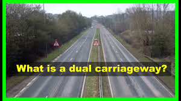
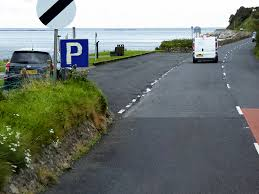
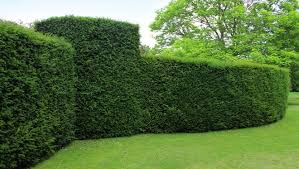

= step 2 - Lesson 30
:toc: left
:toclevels: 3
:sectnums:
:stylesheet: ../../+ 000 eng选/美国高中历史教材 American History ： From Pre-Columbian to the New Millennium/myAdocCss.css

'''

Lesson 30

== part 1

Jane: Now look, er, what’s all this, er, story /about you and this car /I’ve been hearing so much about? Everybody else has been hearing it, but you haven’t told me. (Mhm)

[.my2]
简：现在看看，呃，关于你和我经常听到的这辆车的故事, 是什么？其他人都听到了，但你没有告诉我。 （嗯）

John: Well, I *was driving to* Norwich /with a friend, erm, we teach (v.) there and, erm, I was driving behind _a Lotus Elan sports-car_ 跑车 (Yes) /on dual-carriageway 双向行驶道路  /and, erm, after about, er, three or four miles, er, behind this car, er, we, we *left* (the) dual-carriageway /and, erm, *entered* a two-way 双行的；双向的 road.  +
And, er, this Lotus *suddenly slowed down* for no reason whatsoever 丝毫（用于强调否定句）. (There …​)

[.my2]
约翰：嗯，我和一个朋友开车去诺维奇，嗯，我们在那里教书，嗯，我开在一辆莲花Elan跑车后面，在双车道上行驶，嗯，大约，嗯，三四英里后，嗯，在这辆车后面，我们离开了双车道，嗯，进入了双向道路。然后，这辆莲花突然莫名其妙地慢了下来。(那里……)

[.my1]
.案例
====
.dual-carriageway

.two-way
image:../img/two-way.jpg[,10%]
====

Jane: Not _a side road_ 支线；叉道；旁路 or anything?

[.my2]
简：不是小路之类的吗？

John: No, no, no *turning off* 拐弯；转入另一条路, no lay-bys 路侧停车带, and it just *slowed down*, and, er, I thought, that’s, that’s odd /and, er, I *overtook* (v.)超过；赶上 the Lotus, er, slowly and, erm, *looked over* 查看；检查 at the driver, …​ and as I did, I saw him *slump* 重重地坐下（或倒下） over 从直立位置向下和向外；落下；倒下 the wheel.

[.my2]
约翰:不，不，没有转弯，没有停车，它只是慢了下来，我想，这很奇怪，我超了那辆莲花，嗯，慢慢地，我看了看司机，我看到他摔倒在方向盘上。

[.my1]
.案例
====
.lay-by

image:../img/lay-by 2.png[,30%]
====

Jane: Oh, how awful 骇人听闻的；可怕的;糟透了的情况 !

[.my2]
简：噢，太糟糕了！

John: Yes.

Jane: So /what did you do next?

[.my2]
简：那你接下来做什么了？

John: So, erm, I pulled into the kerb （由条石砌成的）路缘；道牙；马路牙子 /about thirty yards *or so* 大约，左右, er, in front of the Lotus 莲花（汽车品牌） (Yes) and, erm…​my, er, passenger and myself *got out* /and we, we *walked back* towards his car.  +

My friend *was* on the _grass verge_ （路边的）小草地，绿地 /and, er, I was in the middle of the road. We *never even, erm, reached* the car.  +
I was about five yards from the car /when, er, suddenly, erm, there was _a noise of full acceleration_ 加速；加快 /and the car just *shot (v.)射击；发射;（使朝某方向）冲，奔，扑，射，飞驰 forward* — nearly *ran (v.) me down*. +
So I had to *leap* /for my life. +

[.my2]
约翰：嗯，我把车停在离莲花车大约三十码左右的路边（是的），然后，我，呃，和我的乘客下了车，我们朝着他的车走去。我的朋友站在草地的路沿上，而我站在马路中间。我们甚至没有到达车辆。我距离车大约五码远，突然间，呃，听到了全速加速的声音，车子就向前冲了过来 —— 差点把我撞倒。所以我不得不为了自己的生命跳起来。

[.my1]
.案例
====
.verge
( BrE ) a piece of grass at the edge of a path, road, etc.（路边的）小草地，绿地 +
- a grass verge 长了草的路边
====

I *was* absolutely shaken (a.)震惊；烦恼；恐惧 /because the car must *have missed* 未击中，未抓住 me /by about half an inch *or so*, (I mean), (How dread 恐惧；令人惧怕的事物…​) it just *shot (v.) past me* /and I saw my car *smashed* (v.)（哗啦一声）打碎，打破，破碎;（使）猛烈撞击，猛烈碰撞 in front of my eyes. (How dreadful!)  +

Yea, just, just *smashed to* smithereens 碎片, pieces of car *flying* all over the road /and, erm, both cars *locked together* /状 *went down* the road /and there *was* a bend （尤指道路或河流的）拐弯，弯道 at the bottom of the road /and I *thought* well, th…​, the next thing *is going to be* _a head-on (a.)迎头相撞的；正面相撞的 collision_. (Yes, of course.)  +

[.my2]
我绝对吓坏了，因为那辆车差点就撞到了我，（我是说），（多么可怕……）它就这样从我身边飞驰而过，我看到我的车就在我眼前被撞成了碎片。（多么可怕！）是的，完全被撞成了碎片，车的碎片飞到了整个路面，呃，两辆车紧紧相连地沿着路冲下去，路的尽头有个弯道，我想好吧，接下来就要发生正面相撞了。（是的，当然。）

[.my1]
.案例
====
.SMASH, BLOW, ETC. STH TO SMITHEˈREENS
( informal ) to destroy sth completely by breaking it into small pieces 把某物砸（或打等）得粉碎
====

Erm. But, fortunately, nothing *came* [in the opposite direction] /and, erm, and then /both cars *went across* 穿过，越过 the road /and, erm, *up* a grass bank, which …​ it was quite a tall bank /and, erm, and, er, at the top of the bank /there was a large hedge 树篱.  +

[.my1]
.案例
====
.hedge
(n.) a row of bushes or small trees /后定  *planted* close together, usually along the edge of a field, garden/yard or road 树篱 +

====

Well, my car *left* the Lotus a, and literally *took off* （飞机）起飞 /and *shot* (v.) through 穿过 the hedge (Oh, goodness!) /and *landed* in _a ploughed 犁 (地) field_.  +

[.my2]
呃。但是，幸运的是，没有任何东西从对面冲过来，呃，然后两辆车穿过了路，呃，冲上了一个草坡，呃…那是一个相当高的坡，呃，而且，在坡顶上有一片大篱笆。我的车离开了莲花车，简直就像是起飞了，穿过了篱笆（天哪！）然后降落在了一片翻耕的田地里。

(Yes) But the Lotus veered to the left and got stuck in the hedge, in the thick part of the hedge. And, erm, the acceleration was still on full and the back wheels were tearing up the grass verge, throwing mud and soil, earth and grass all over the road, er, it was just, you know, absolutely terrif …​ (How terrify…​) Yes, (Yes) because the Lotus, erm, radiator burst and, and there was steam everywhere; it was like a, like a cloud of steam and smoke, and, er, the first thing, erm, of course, we thought of doing was to get the driver out (Well, of course.) Yes. (Quite) So, erm, we tried to get the passenger door open, (Yes) but it was locked, so we had to climb through the hedge and, er, get round to the driving-door. Well, by that time, there was so much steam we couldn’t see, so it was a matter of fumbling in the, in the steam and smoke and thinking any moment the car was going to explode.

[.my2]
（是的）但是莲花车向左转了方向，并卡在了篱笆里，卡在了篱笆的浓密部分。而且，呃，加速还一直保持在全速，后轮撞起了路沿的草坡，扬起了泥土和土壤，把路面上的草坡，土壤和草全都弄得到处都是，呃，真的，你知道，简直是…（多么恐怖…）是的，（是的）因为莲花车的，呃，散热器爆裂了，到处都是蒸汽；就像是一团蒸汽和烟雾，呃，当然，我们首先想到的是把司机救出来（嗯，当然。）是的。（当然）所以，呃，我们试图打开副驾驶门（是的），但是它被锁住了，所以我们不得不从篱笆上爬过去，呃，走到驾驶座门那边。到那时，蒸汽已经太大了，我们什么都看不见了，所以只能在蒸汽和烟雾中摸索，随时都觉得车要爆炸了。

Jane: Yes, it wasn’t on fire, in fact, that, at that point, was it?

[.my2]
简：是的，事实上，当时它并没有着火，不是吗？

John: No, no, it wasn’t on fire, but, erm, with the noise of the engine, an…​ and all the steam it was just you know, very, frightening. (Oh, how dreadful!) Erm, well we managed to get the driver out, turn the ignition off. We laid him in the mud actually because it was a ploughed field and, (Yes) er, I ran out in the road and shouted for help and, erm …​ er, a car driver told me help, er, was already on its way and, erm, I, er, managed to get blankets from people that had stopped and, er, we tried to make the man comfortable, and erm …​ a man appeared shortly afterwards and he was from a nearby American airbase and, er, he was a medical man, so he was able to, erm, (Examine him) e…​ examine him and, er, I helped him, tried to, you know, er, make the man, er, well, you know, do all we could for the man. Erm …​

[.my2]
约翰：不，不，它没有着火，但是，呃，由于引擎的噪音，和所有的蒸汽，你知道，非常，令人恐惧。（哦，多可怕！）呃，我们设法把司机救了出来，关掉了点火。我们实际上把他放在泥土里，因为那是一片犁过的田地，（是的）呃，我跑到马路上呼喊帮助，呃…一个汽车司机告诉我, 帮助已经在路上了，呃，我，呃，从停下来的人那里拿到了毯子，我们试图让这个人舒服些，呃…不久之后，一个男人出现了，他来自附近的美国空军基地，呃，他是一个医生，所以他能够，呃，（检查他）检查他，呃，我帮助他，努力让这个人，你知道，呃，做一切我们能为他做的事情。呃…

Jane: He was unconscious, was he?

[.my2]
简：他失去知觉了，是吗？

John: Yes, yes; …​ and then the police, a…​ police arrived and (the) fire brigade (Yes) and, er, …​ er, we were told to, er, leave the scene by the police and go to the police station and, erm, there we had to make a statement, (Yes, of course.) and, er, I had to have a breathalyser test, and…​
约翰：是的，是的； ……然后警察，……警察到了，消防队（是的），呃，……呃，警察告诉我们，呃，离开现场，去警察局，然后，嗯，我们必须发表声明，（是的，当然。）而且，呃，我必须进行酒精测试，并且……​

Jane: But they thought you’d been in the car …​ of course they did. Yes.

[.my2]
简：但他们以为你在车里……当然他们确实是这样。是的。

John: Because, because they thought I’d, th…​ they automatically thought I’d been driving the car (Of course. Yes) and, er, when I told them the story they had to apologize for giving me a breathalyser and they said, 'Gosh,' you know, 'how, how incredible'.

[.my2]
约翰：因为，因为他们认为我会，他们自然而然地认为我一直在开车（当然。是的），呃，当我告诉他们这个故事时，他们不得不为给我酒精分析仪而道歉，并且他们说，‘天哪，’你知道，‘多么、多么令人难以置信’。

Jane: So, what happened to the man?

[.my2]
简：那么，那个男人怎么了？

John: And, erm, we were in the middle of making the statements and, erm, the telephone rang and the, the policeman, erm, was told that, that the man was dead, (Oh!) and, erm, and then two days later we had to attend a Coroner’s inquest where we were told that the man had died of a heart attack and, in fact, he was dead, erm, before he crashed into my car.

[.my2]
约翰：呃，我们正在做陈述，呃，电话响了，警察，呃，被告知，那个人死了，（哦！）然后，呃，然后两天后，我们必须参加验尸官的调查，我们被告知该男子死于心脏病，事实上，他在撞上我的车之前就已经死了。

Jane: Oh-h-h! What an alarming story! How dreadful!

[.my2]
简：噢-哈-哈！这是一个多么令人震惊的故事啊！多么可怕啊！

John: Yes. 约翰：是的。

'''

== part 2

Today the Federal Aviation Administration reviewed that five air traffic controllers based in Kansas City have been taken off the job because of drug use. Earlier this month thirteen controllers at the southern California centre were removed from their jobs for off-duty drug use. Also today the FAA continued to investigate alleged drug use at the nation’s sixth largest airlines, US Air. NPR’s Wendy Kaufman reports.

[.my2]
今天，美国联邦航空管理局审查称，堪萨斯城的五名空中交通管制员因吸毒而被停职。本月早些时候，南加州中心的 13 名管制员因下班吸毒而被免职。同样在今天，美国联邦航空局继续调查美国第六大航空公司全美航空涉嫌吸毒的情况。 NPR 的温迪·考夫曼报道。

"Drug use, even off-duty, is banned for controllers under Federal Aviation Administration rules. So far the FAA has conducted investigations into alleged drug use by controllers at two facilities — Palmdale in southern California and now Kansas City.

[.my2]
“根据美国联邦航空管理局的规定，管制员即使在下班时间也禁止吸毒。到目前为止，美国联邦航空局已经对两个设施——南加州的帕姆代尔和现在的堪萨斯城的管制员涉嫌吸毒进行了调查。

In southern California thirty-four controllers were taken off their radar scopes. Pending the outcome of investigation, thirteen tested positive for drugs, and we were told they could quit or enter a treatment program, or opt for treatment. In Kansas City thirty-six controllers were investigated. The five who tested positive for drugs have all agreed to undergo treatment. Three controllers are still under investigation. The proportion of drug users is small. Of the roughly five hundred controllers at the two facilities only seventy were suspect, and of those only eighteen tested positive for drugs. Air traffic control supervisors say they don’t see drug use as a serious problem in their work force. Still as one FAA official put it, one drug user is one too many.

[.my2]
在南加州，34 名管制员的雷达范围被取消。在等待调查结果之前，十三人的药物检测呈阳性，我们被告知他们可以退出或进入治疗计划，或选择治疗。堪萨斯城有 36 名管制员受到调查。五名药物检测呈阳性的人均同意接受治疗。三名管制员仍在接受调查。吸毒者比例较小。在这两个设施的大约 500 名管制员中，只有 70 名有嫌疑，其中只有 18 名毒品检测呈阳性。空中交通管制主管表示，他们并不认为吸毒是其工作人员中的一个严重问题。但正如美国联邦航空管理局 (FAA) 一位官员所说，吸毒者人数过多。

Right now there is no routine drug testing for controllers though that will change around the first of the year. There will be pre-employment urine test and test along with the annual physical exam. According to the FAA, there has never been a fatal accident involving a major US airline in which alcohol or drug abuse was a factor for the controllers or for the pilots. But there have been a sizeable number of fatal accidents in which commuter pilots, air taxi pilots and private pilots had been drinking, and a much smaller number of cases in which drugs were a factor.

[.my2]
目前还没有针对管制员的常规药物测试，不过这种情况将在今年年初左右发生变化。每年体检时都会进行入职前尿检和化验。据美国联邦航空局称，美国大型航空公司从未发生过因管制员或飞行员酗酒或吸毒而导致死亡的事故。但有相当多的致命事故是由通勤飞行员、空中出租车飞行员和私人飞行员饮酒造成的，而由药物引起的事故则要少得多。

On another matter, drug use, or, more precisely, alleged drug use by flight crews at US Air has been front-page news in Pittsburgh, the airline’s operating base. A grand jury is conducting an investigation into alleged drug use, sales and distribution. Over the weekend, a Pittsburgh press newspaper quoted area hospital officials, who said they had treated about twenty US Air flight crew members for cocaine overdoses. US Air acknowledges that one pilot nearly died of an overdose. He had last flown on September 7th, and was taken to the hospital on September 10th. The airline has removed him from flight duty, and the FAA is considering revoking his medical certificate that would mean he could not fly any aircraft. Meanwhile the FAA is conducting an investigation of the airline and is working with the grand jury and the FBI. I’m Wendy Kaufman in Washington.

[.my2]
另一方面，吸毒，或者更准确地说，全美航空机组人员吸毒的指控一直是该航空公司运营基地匹兹堡的头版新闻。大陪审团正在对涉嫌吸毒、销售和分销的行为进行调查。周末，匹兹堡一家报纸援引当地医院官员的话说，他们已经治疗了大约 20 名全美航空机组人员，因为他们服用了过量的可卡因。美国航空承认，一名飞行员因吸毒过量而险些丧命。他最后一次飞行是在 9 月 7 日，并于 9 月 10 日被送往医院。航空公司已将他免职，美国联邦航空局正在考虑吊销他的医疗证明，这意味着他无法驾驶任何飞机。与此同时，美国联邦航空局正在对该航空公司进行调查，并与大陪审团和联邦调查局合作。我是华盛顿的温迪·考夫曼。

3. Lectures and Note-taking
3. 讲授和笔记
Note-taking is a complex activity which requires a high level of ability in many separate skills. Today I’m going to analyse the four most important of these skills.

[.my2]
记笔记是一项复杂的活动，需要在许多单独的技能方面具有高水平的能力。今天我将分析其中四个最重要的技能。

Firstly, the student has to understand what the lecturer says as he says it. The student cannot stop the lecture in order to look up a new word or check an unfamiliar sentence pattern. This puts the non-native speaker of English under a particularly severe strain. Often — as we’ve already seen in a previous lecture — he may not be able to recognize words in speech which he understands straight away in print. He’ll also meet words in a lecture which are completely new to him. While he should, of course, try to develop the ability to infer their meaning from the context, he won’t always be able to do this successfully. He must not allow failure of this kind to discourage him however. It’s often possible to understand much of a lecture by concentrating solely on those points which are most important. But how does the student decide what’s important? This is in itself another skill he must try to develop. It is, in fact, the second of the four skills I want to talk about today.

[.my2]
首先，学生必须理解讲师所说的内容。学生不能为了查找新单词或检查不熟悉的句型而停止授课。这使得非英语母语的人承受着特别严重的压力。通常，正如我们在之前的讲座中已经看到的那样，他可能无法识别言语中的单词，而他可以立即理解印刷品中的单词。他还会在讲座中遇到对他来说完全陌生的单词。当然，虽然他应该尝试培养从上下文中推断其含义的能力，但他并不总是能够成功地做到这一点。然而，他决不能因为这种失败而灰心丧气。通过仅关注最重要的要点，通常可以理解讲座的大部分内容。但学生如何决定什么是重要的呢？这本身就是他必须努力培养的另一项技能。事实上，这是我今天要谈论的四项技能中的第二项。

Probably the most important piece of information in a lecture is the title itself. If this is printed (or referred to) beforehand the student should study it carefully and make sure he’s in no doubt about its meaning. Whatever happens he should make sure that he writes it down accurately and completely. A title often implies many of the major points that will later be covered in the lecture itself. It should help the student therefore to decide what the main point of the lecture will be.

[.my2]
讲座中最重要的信息可能就是标题本身。如果事先打印（或参考）此内容，学生应该仔细研究它并确保他对其含义没有疑问。无论发生什么，他都应该确保准确完整地写下来。标题通常暗示了稍后将在讲座本身中涵盖的许多要点。因此，它应该帮助学生决定讲座的要点是什么。

A good lecturer, of course, often signals what’s important or unimportant. He may give direct signals or indirect signals. Many lecturers, for example, explicitly tell their audience that a point is important and that the student should write it down. Unfortunately, the lecturer who’s trying to establish a friendly relationship with his audience is likely on these occasions to employ a colloquial style. He might say such things as 'This is, of course, the crunch' or 'Perhaps you’d like to get it down'. Although this will help the student who’s a native English-speaker, it may very well cause difficulty for the non-native English speaker. He’ll therefore have to make a big effort to get used to the various styles of his lecturers.

[.my2]
当然，一位好的讲师经常会指出什么是重要的或什么是不重要的。他可以给出直接信号或间接信号。例如，许多讲师明确告诉听众，某一点很重要，学生应该把它写下来。不幸的是，试图与听众建立友好关系的讲师在这些场合很可能采用口语风格。他可能会说“这当然是紧要关头”或“也许你想把它记下来”之类的话。虽然这会对以英语为母语的学生有所帮助，但很可能会给非英语母语的学生带来困难。因此，他必须付出很大的努力来适应讲师的各种风格。

It’s worth remembering that most lecturers also give indirect signals to indicate what’s important. They either pause or speak slowly or speak loudly or use a greater range of intonation, or they employ a combination of these devices, when they say something important. Conversely, their sentences are delivered quickly, softly, within a narrow range of intonation and with short or infrequent pauses when they are saying something which is incidental. It is, of course, helpful for the student to be aware of this and for him to focus his attention accordingly.

[.my2]
值得记住的是，大多数讲师也会给出间接信号来表明什么是重要的。当他们说一些重要的事情时，他们要么停顿，要么放慢语速，要么大声说话，或者使用更大范围的语调，或者他们使用这些手段的组合。相反，当他们说一些偶然的事情时，他们的句子快速、轻柔、语调范围狭窄，并且有短暂或不频繁的停顿。当然，学生意识到这一点并相应地集中注意力是有帮助的。

Having sorted out the main points, however, the student still has to write them down. And he has to do this quickly and clearly. This is, in fact, the third basic skill he must learn to develop. In order to write at speed most students find it helps to abbreviate. They also try to select only those words which give maximum information. These are usually nouns, but sometimes verbs or adjectives. Writing only one point on each line also helps the student to understand his notes when he comes to read them later. An important difficulty is, of course, finding time to write the notes. If the student chooses the wrong moment to write he may miss a point of greater importance. Connecting words or connectives may guide him to a correct choice here. Those connectives which indicate that the argument is proceeding in the same direction also tell the listener that it’s safe time to write 'Moreover', 'furthermore', 'also', etc., are examples of this. Connectives such as 'however', 'on the other hand' or 'nevertheless' usually mean that new and perhaps unexpected information is going to follow. Therefore, it may, on these occasions, be more appropriate to listen.

[.my2]
然而，在整理了要点之后，学生仍然要把它们写下来。他必须快速而清晰地做到这一点。事实上，这是他必须学习培养的第三项基本技能。大多数学生发现为了加快写作速度，缩写很有帮助。他们还尝试只选择那些提供最多信息的单词。这些通常是名词，但有时是动词或形容词。每行只写一个点也有助于学生稍后阅读笔记时理解笔记。当然，一个重要的困难是找到时间写笔记。如果学生选择了错误的写作时机，他可能会错过更重要的一点。连接词或连接词可能会引导他在这里做出正确的选择。那些表明论证正朝同一方向进行的连接词也告诉听众，现在是写“此外”、“进一步”、“也”等的安全时间，就是这样的例子。 “然而”、“另一方面”或“尽管如此”等连接词通常意味着新的、可能是意想不到的信息将会随之而来。因此，在这些场合，倾听可能更合适。

The fourth skill that the student must develop is one that is frequently neglected. He must learn to show the connections between the various points he’s noted. This can often be done more effectively by a visual presentation than by a lengthy statement in words. Thus the use of spacing, underlining, and of conventional symbols plays an important part in efficient note-taking. Points should be numbered, too, wherever possible. In this way the student can see at a glance the framework of the lecture.

[.my2]
学生必须培养的第四项技能经常被忽视。他必须学会展示他所注意到的各个点之间的联系。通过视觉呈现通常比冗长的文字陈述更有效。因此，间距、下划线和传统符号的使用对于高效记笔记起着重要作用。只要有可能，点也应该编号。这样学生就可以一目了然地看到讲座的框架。

4. The Way We Were
4.我们的过去
Memories, light the corners of my mind,
回忆，照亮我心灵的角落，

Misty water colour memories,
朦胧的水彩回忆，

Of the way we were,
我们本来的样子，

Scattered pictures of the smiles we left behind,
散落的我们留下的笑容的照片，

Smiles we gave to one another,
我们互相给予微笑，

For the way we were,
对于我们本来的样子，

Can it be that it was all so simple then,
难道当时的一切就这么简单吗？

Or has time rewritten every line,
或者时间重写了每一行，

If we had the chance to do it all again,
如果我们有机会重来一次

Tell me, would we, could we.

[.my2]
告诉我，我们愿意吗，我们可以吗？

Memories may be beautiful and yet,
回忆或许很美好，但

What’s too painful to remember,
回忆起来太痛苦了，

We simply choose to forget,
我们只是选择忘记，

So it’s the laughter we will remember,
所以我们会记住的是笑声，

Whenever we remember the way we were,
每当我们想起曾经的样子

The way we were.

[.my2]
我们的方式。

'''
