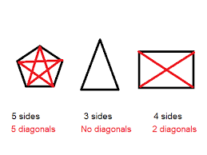
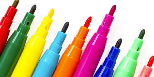
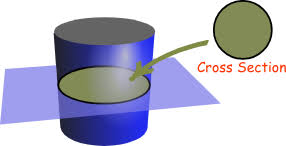
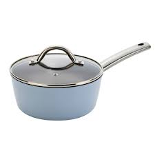

= step 2 - Lesson 31
:toc: left
:toclevels: 3
:sectnums:
:stylesheet: ../../+ 000 eng选/美国高中历史教材 American History ： From Pre-Columbian to the New Millennium/myAdocCss.css

Lesson 31

== part 1

Denise: On the contrary 相反地, I don’t *agree* [at all] *with* people /who say _graphology 笔体学， 笔迹学 （根据笔体推断人的性格） is all nonsense_.  +
I think that /*at last* it is beginning *to be taken seriously /as* a proper 真正的；像样的；名副其实的 science /and not *as* some kind of fairground 露天游乐场,展销会场地 entertainment.

[.my2]
丹尼斯：恰恰相反，我完全不同意那些说"笔迹学完全是胡说八道"的人。我认为它终于开始被认真地视为一门真正的科学，而不是某种游乐场娱乐。

[.my1]
.案例
====
.fairground +
-> fair, 集市，游乐。ground, 地方，地面。
====

Leo: How did you start *to become interested in* graphology?

[.my2]
Leo：你是怎么开始对笔迹学产生兴趣的？

Denise: I’ve always been fascinated by people /and what they are like, and then one day /I was just looking at a book about different styles of handwriting /and I got to thinking that /it must all mean (v.) something, because we all have _a different and individual style_ of our own. So that’s _how I began_.

[.my2]
丹尼斯：我一直对人和他们的样子很着迷，有一天我正在看一本关于不同风格的笔迹的书，我开始想这一定意味着什么，因为我们都有不同的笔迹, 以及我们自己的个人风格。我就是这样开始的。

Leo: What exactly is the connection /*between* the way we write *and* the way we are?

[.my2]
利奥：我们的笔迹方式, 和我们的生活方式之间, 到底有什么联系？

Denise: If you think about it, `主` our handwriting, and our doodling 涂鸦；乱涂；胡写乱画 too, `系` *are* all products (n.) of our brain — a kind of _extension of ourselves_ on paper, so, consciously 有意识地 or unconsciously, we are giving _a kind of 'computer printout'_ of _what we think or feel_ /when we write.   As 因为 `主` the brain `系` *is* where _our thoughts and feelings_ lie (v.), there is every reason to assume (v.) that /our character *is transmitted (v.)传送；输送；发射；播送 into* our handwriting.

[.my2]
丹尼斯：如果你想一想，我们的笔迹和涂鸦, 都是我们大脑的产物——一种我们自己在纸上的延伸，因此，有意识或无意识，我们正在提供一种“计算机打印输出”当我们写作时，我们会思考或感受。由于大脑是我们思想和感情的所在地，因此我们有充分的理由假设我们的性格会传递到我们的笔迹中。

Leo: Now I know that /a number of European firms have used (v.) graphology /to evaluate (v.)评价，评估，估值 potential employees /for some time now, but I believe /it’*s catching on* 受欢迎；流行起来；变得时髦 in America too.

[.my2]
Leo：现在我知道, 许多欧洲公司已经使用笔迹学, 来评估潜在员工一段时间了，但我相信它在美国也正在流行。

Denise: I’m now _running (v.) my own San Francisco-based consultancy firm_, which I started /a decade ago, and now /over two hundred firms *come to me* /for advice on would-be （形容想要成为…的人）未来的 employees.

[.my2]
丹尼斯：我现在在旧金山经营自己的咨询公司，该公司是我十年前创办的，现在有超过 200 家公司向我寻求, 有关未来员工的建议。

Leo: How does it *work out* 解决问题,成功地发展, then? Do they show you _samples of an applicant’s handwriting_?

[.my2]
狮子座：那结果如何呢？他们会向您展示申请人的笔迹样本吗？

Denise: Yes, most companies nowadays require (v.) their new _job applicants_ / to provide (v.) [at least] a one-page writing sample /which *is then passed (v.) over to me* for interpretation.

[.my2]
丹尼斯：是的，现在大多数公司都要求, 新求职者提供至少一页的写作样本，然后交给我进行解释。

Leo: How long does it take you /to analyse (v.) a sample?

[.my2]
Leo：您分析一个样本需要多长时间？

Denise: Oh, anything 后定 *from* three *to* eight hours, *depending on* the amount of detail /后定 required by the client.

[.my2]
丹尼斯：哦，三到八小时不等，具体取决于客户所需的详细信息量。

Leo: And what can you tell from the sample you get?
Leo：从你得到的样本中你能看出什么？

Denise: **A whole range of** personality traits 成功地发展 /can be assessed (v.)成功地发展, such as enthusiasm, ambition, imagination, diligence (n.)勤勉；勤奋；用功, sincerity (n.)真诚，真挚 , secretiveness (n.)隐匿；分泌  — just about everything, in fact.

[.my2]
丹尼斯：一系列的人格特质都可以被评估，比如热情、野心、想象力、勤奋、真诚、神秘——事实上，几乎一切。

Leo: Can you give us some _tell-tale (a.)泄露内情的 clues_ /about the way we write? I’m sure /our listeners will all *be dying* (v.) to hear something.

[.my2]
Leo：你能给我们一些关于我们笔迹方式的线索吗？我相信, 我们的听众都会渴望听到一些东西。

Denise: OK, you just write the letter 't', not a capital /but an ordinary 't', please, Leo.

[.my2]
丹尼斯：好的，你只写字母“t”，不是大写字母，而是普通的“t”，Leo。

Leo: All right. There you are. Now /what can you tell me /from that?

[.my2]
利奥：好吧。你在这。现在你能从中告诉我什么？

Denise: Mmm …​ well, the 't' you’ve written, which is _more or less_ *straight up* /and crossed (v.) [with a diagonal 斜线的；对角线的 stroke （打、击等的）一下，一击; 一笔；一画；笔画 /*from* south-west *to* north-east], as it were, indicates (v.) _an optimistic kind of character_ to me. Would you describe yourself /in that way?

[.my2]
丹尼斯：嗯… 你写的 't'，几乎是笔直的，并且用一条斜线从西南到东北交叉，对我来说表示一种乐观的性格。你会用这种方式来形容自己吗？

[.my1]
.案例
====
.diagonal

====

Leo: Mmm, yes, I think so. Can you describe any other kinds of 't' /*for the benefit of* 为了…的利益；为了…的好处 our listeners?

[.my2]
Leo： 嗯，是的，我想是这样。你能为我们描述其他种类的 't' 吗，让我们的听众也了解一下吗？

Denise: Yes, of course. If, for example, you had written a 't' /but *crossed* it /状 only with a stroke 一笔；一画；笔画 on the left of _the vertical stem_ （花草的）茎；（花或叶的）梗，柄, which didn’t even reach it in fact, that would indicate (v.) _a procrastinating 拖延；耽搁 character_, someone /who *puts things off* 推迟；延迟 until tomorrow.  +

Inefficiency *can be identified* /by a 't' /where there *are* two _vertical strokes_ in the stem, *reaching up to* a rounded 圆形的 point, and then crossed (v.) right through.

Mmm, what else can I say? `主` #A thick cross# /on the left of the stem, *tapering (v.)使逐渐变窄（或尖细）；逐渐减少 to* a point /on the right of the stem, `谓` #tells me# that /the writer is a sarcastic 讽刺的；嘲讽的；挖苦的 kind of person.  +

Another thing is that /a very practical 实际的；明智的；实事求是的 sort of person /always *crosses* his 't' [halfway down the letter], whereas `主` #a 't'# 后定 crossed (v.) high up the stem /`谓` #shows# (v.) a dreamer.

The letters 'm' and 'n' /are also *indicative (a.)表明；标示；显示；暗示 of* personality, *depending on* whether they are rounded 圆形的 or wedge-shaped 楔形的; V 形的.

[.my2]
丹尼斯： 当然可以。比如，如果你写了一个 't'，但是只用一条线从垂直的笔杆的左侧横跨过去，而且实际上甚至没有到达笔杆，那就表示一种拖延的性格，有人会把事情拖到明天再做。效率低下的人的 't' 会有两个垂直的笔画，达到一个圆形的顶点，然后完全穿过。嗯，我还能说什么呢？笔杆左侧有一个粗的十字交叉，逐渐变尖到笔杆右侧，告诉我写字者是一种挖苦的人。另一件事是，一个非常务实的人总是在 't' 的中间横跨，而高横跨的 't' 表示一个梦想家。字母 'm' 和 'n' 也表示个性，取决于它们是圆形还是楔形的。

[.my1]
.案例
====
.wedge-shaped

====

Leo: I see. That’s most interesting.

[.my2]
利奥：我明白了。这是最有趣的。

Denise: One little success story of mine, which I must tell you about, concerns (v.) 涉及，与……相关 _Royal 皇家的；王室的 Office Products_ of New York.  +
They once *took a big chance 冒很大的风险 on* my analysis of an applicant’s writing. His name was Harry Benson, in fact, and he was *after 寻找；追捕 an executive job*, and he was a person /they would never *have taken on* otherwise …​ because he *came across* 给人以…印象；使产生…印象 very badly _orally 口头上地；口述地 and in his appearance_.

[.my1]
.案例
====
.come aˈcross( also ˌcome ˈover )
(1)to be understood 被理解；被弄懂 +
• He spoke for a long time /but his meaning *didn't really come across*. 他讲了很久，但并没有人真正理解他的意思。

(2)to make a particular impression 给人以…印象；使产生…印象 +
• *She comes across well* /in interviews. 她在面试中常给人留下很好的印象。

.come across sb/sth
[ no passive]to meet or find sb/sth by chance （偶然）遇见，碰见，发现 +
• She came *across some* old photographs /in a drawer. 她在抽屉里偶然发现了一些旧照片。

.come aˈcross (with sth)
[ no passive]to provide or supply sth when you need it （需要时）提供，供给，给予 +
• I hoped /she'd *come across /with* some more information. 我希望她能再提供更多的信息。
====

However, *on the strength of* 凭借（或根据）某事物；在某事物的影响下 my interpretation of his writing /they *took him on* 聘用；雇用, and now, only a few years later, he’s already President of the company.

[.my2]
丹尼斯：我要告诉你一个小小的成功故事，我必须告诉你，那就是关于纽约的皇家办公用品公司。他们曾经冒了一次很大的风险，相信了我的对一位申请人书写的分析。实际上，他的名字叫哈里·本森，他当时在申请一份高管职位，他在口头和外表上的表现都非常糟糕，公司本来不会雇佣他的。但是，基于我对他书写的解读，他们录用了他，现在，仅仅几年后，他已经成为公司的总裁了。

[.my1]
.案例
====
.take sb←→ˈon
(1)to employ sb聘用；雇用 +
• *to take on* new staff 雇用新员工

(2)[no passive]to play against sb in a game or contest; to fight against sb（运动或比赛）同某人较量；反抗；与某人战斗 +
• *to take somebody on* at tennis 与某人比赛打网球
====

Leo: I’d like now *to turn to* doodling 涂鸦；乱涂；胡写乱画 /because most of us *doodle (v.) away merrily* 自顾自地；毫无顾忌地;高兴地；愉快地, *quite absentmindedly* 茫然地；精神不集中地, and hear (v.) /what you have to say about that.

[.my2]
Leo：我现在想谈谈涂鸦，因为我们大多数人都在快乐地、心不在焉地涂鸦，听听你对此有何看法。

[.my1]
.案例
====
.merrily
-> 来自merry,高兴，兴奋。
====

Denise: Oh, you can tell a great deal about people /from their doodles /*as well as* their handwriting. The doodle, to my mind, is a message /straight from the subconscious 下意识的；潜意识的. +
`主` The reason /后定 you are feeling the way you are `谓` *is always written* in your doodles.

[.my2]
丹尼斯：哦，你可以从人们的涂鸦和笔迹中, 了解很多关于他们的信息。在我看来，涂鸦是直接来自潜意识的信息。"你感觉自己"的原因, 总是会反应在你的涂鸦上。

Leo: Can you give us some indication of _what you mean_?

[.my2]
Leo：您能告诉我们您的意思吗？

Denise: Take, for example, very angular 有角的 or tangled 缠结的；混乱的；紊乱的 _horizontal lines_ …​ Now, if a person [when doodling] does a lot of them, it is very *indicative (a.)表明；标示；显示；暗示 of* hidden anger and frustration.  +
`主` Arrows, when drawn, `谓` *stand for* 代表，象征 ambition, and when they *are aimed* in a lot of different directions, this will mean (v.) confusion /in reaching goals.

[.my2]
丹尼斯：以非常有棱角或纠结的水平线为例......现在，如果一个人在涂鸦时画了很多这样的线，则非常表明隐藏的愤怒和沮丧。绘制的箭头代表野心，而当它们瞄准许多不同的方向时，这将意味着实现目标的混乱。

Leo: Before we started (v.) the programme, I *happened to be* doodl**ing** 碰巧正在做 /on this pad here. What does that tell you about me? — that’s if you can repeat it! (Laughs).

[.my2]
Leo：在我们开始节目之前，我碰巧在这块本子上涂鸦。这告诉你关于我的什么？ ——如果你能重复的话！ （笑）。

[.my1]
.案例
====
.
happen to do sth 碰巧做什么事情 +
happen to be doing 碰巧正在做 +
happen to have done 碰巧已经做了
====

Denise: Well, let me see. You have drawn _a very detailed and symmetrical 对称的 design_ /which tells me, superficially 表面地；浅薄地 *at any rate* 无论如何，不管怎样, that you are _a very orderly (a.)有秩序的；有条理的 and rather precise person_ — a conformist 顺从者；随波逐流者；循规蹈矩的人, if you like — who doesn’t like chaos /and has to *have everything planned* (v.).

[.my2]
丹妮丝：好吧，让我看看。你画了一个非常详细和对称的设计，至少从表面上看，它告诉我，你是一个非常有秩序和相当精确的人——如果你愿意的话，是一个墨守成规的人——不喜欢混乱，必须把一切都计划好。

Leo: Yes, well, you’re right [to some extent]. I’ve got one or two others here /后定 done by people in the studio. What can you say about them?

[.my2]
狮子座：是的，嗯，在某种程度上你是对的。我还有一两个由工作室里的人完成的作品。对于他们, 你有什么想说的？

Denise: This one here, which has _lots of little stars_ on it — now, they generally represent (v.) hope. And here, on this one, somebody has drawn a human eye, which is *indicative (a.) 表明；标示；显示；暗示 of* a suspicious or distrustful nature.

[.my2]
丹尼斯：这个，上面有很多小星星——现在，它们通常代表着希望。在这里，在这上面，有人画了一只人类的眼睛，这表明了可疑或不信任的本质。

Leo: I’d better *not tell you* who is the artist, then!

[.my2]
Leo：那我最好不要告诉你艺术家是谁！

Denise: Now, in this one, somebody has drawn a little human figure, which probably means (v.) they make friends very easily — and enemies too, incidentally 顺便提一句.

[.my2]
丹尼斯：现在，在这幅画中，有人画了一个小人物，这可能意味着他们很容易交朋友——顺便说一句，也很容易交敌人。

Leo: Does everybody doodle?

[.my2]
Leo：每个人都涂鸦吗？

Denise: Most people do it /because they are bored, but some do it /*more than* others. _Creative people_ like architects or fashion designers /do a great deal of aimless doodling, whereas writers, on the other hand, do very little /because they have a way of expressing themselves in words. I think probably _people with disabilities_ /are the best doodlers, because _their normal outlets_ are blocked.

[.my2]
丹尼斯：大多数人这样做是因为他们感到无聊，但有些人这样做的次数比其他人多。像建筑师或时装设计师这样的创意人士, 会进行大量漫无目的的涂鸦，而作家则很少做，因为他们有一种用语言表达自己的方式。我认为残疾人可能是最好的涂鸦者，因为他们正常的出路被堵住了。

Leo: What about _actual writing implements_ 工具；器具；用具, does it make any difference /what you choose to write with?

[.my2]
Leo：那么实际的书写工具呢？你选择什么书写工具有什么不同吗？

Denise: Indeed, yes. If you give people a choice of _writing implements_ — say a pencil, a _felt 毛毡 tip_ 尖端；尖儿；端 or an ordinary pen — the middle-of-the-roaders 折中主义者 will go for the ordinary pen, `主` #those# /who want to leave the biggest impression *with* the least amount of work /`谓` #will# take the felt tip.

*As for* pencils, I won’t say it’s true /in every case, some pencil users /aren’t very honest; pencils can be erased, you see, so it’s a way /of leaving no traces.  +
Criminals 罪犯 will almost always choose a pencil, although 虽然，尽管 *of course* I’m not suggesting that /all pencil users (n.) are criminals, of course.

[.my2]
丹妮丝：的确，是的。如果你让人们选择一种书写工具——比如铅笔、笔尖或普通钢笔——中间路线的人会选择普通钢笔，而那些想用最少的功夫给人留下最深刻印象的人会选择笔尖。至于铅笔，我不会说这在所有情况下都是正确的，有些铅笔使用者不是很诚实;铅笔是可以擦掉的，所以这是一种不留痕迹的方法。罪犯几乎都会选择铅笔，当然，我并不是说所有使用铅笔的人都是罪犯。

[.my1]
.案例
====
.felt
[ U]a type of soft thick cloth /made from wool or hair /that has been pressed tightly together 毛毡 +

.felt tip

====

Leo: Well, thank you very much, Denise. That was very interesting, and I’m *sure* from now /*on* we’ll all be careful /not to leave (v.) our doodles *lying (v.) around*.

[.my2]
利奥：嗯，非常感谢你，丹妮丝。这非常有趣，我相信, 从现在开始我们都会小心，不要把涂鸦随处可见。

'''

== part 2. 部分

The number of adult smokers /in the United States /keeps going down, down, down, almost twenty percent /in the past decade, according to a new survey /by the American Cancer Society 社团；协会；学会.  +
`主` Their report /based on the government’s statistics /`谓` shows that, #while# more and more women /*are taking up* 继续；接下去;占用（时间）；占据（空间） the smoking habit, more than enough men /are quitting *to make up 弥补，补偿，抵消 for* it.  +

But `主` that news /about the women /`谓` troubles (v.) Dr Ervin Mann, an obstetrician 产科医生 at Paxtang, Pennsylvania /and he decided to do something about it.  +
If you are a pregnant woman /and if you smoke (v.) cigarettes, then Dr Mann will *make you an offer* /that he hopes you can’t refuse.

[.my2]
根据美国癌症协会的一项新调查，在过去十年中，美国成年吸烟者的数量持续下降、下降、下降，几乎百分之二十。他们基于政府统计数据的报告显示，虽然越来越多的女性养成了吸烟的习惯，但有足够多的男性, 正在戒烟, 以弥补这一缺陷。但有关这些女性的消息, 让宾夕法尼亚州帕克斯坦的产科医生欧文·曼博士感到困扰，他决定对此采取一些措施。如果您是一名孕妇并且吸烟，那么曼恩博士将为您提供一个他希望您无法拒绝的提议。

"`主` What we will do `系` *is*, if you will *not smoke* (v.) throughout your pregnancy, then we’ll offer (v.) you one hundred dollars /off the obstetric 产科的；生产的，分娩的 bill."

[.my2]
“我们要做的是，如果您在整个怀孕期间不吸烟，那么我们将为您提供一百美元的产科费用减免。”

"And _how much_ is the typical bill, so _how big_ *is* this discount going to be?"

[.my2]
“一般的账单是多少，那么这个折扣有多大呢？”

"Basically _the obstetric bill_ *is* one thousand two hundred dollars. So it’s a little *less than* ten percent."

[.my2]
“基本上，产科费用是一千二百美元。所以略低于百分之十。”

"What inspired (v.) you /to try this hundred-dollar rebate 退还款;折扣，返还（退还的部分货价）；折扣?"

[.my2]
“是什么促使你尝试这个百元回扣？”

"We know (v.) that /`主` *smoking* during pregnancy `谓` *results in* lower birthrate incense (v.)激怒；使大怒(疑似写错单词?). In other words /*because of* smoking babies *are* small at birth.  And that’s the one thing /we really know. There have been other things /that’ve been implicated that /there *is* increasing (a.) _birth defects_ 缺点，缺陷，毛病 /in smoking women."

[.my2]
“我们知道, 怀孕期间吸烟, 会导致出生率降低。换句话说，因为吸烟，婴儿出生时很小。这是我们真正知道的一件事。还有其他一些因素也表明, 吸烟女性, 会增加"婴儿出生缺陷"。”

"You should *explain to* me, *explain to* our listeners /why that is of a concern （尤指许多人共同的）担心，忧虑 to a doctor, or to a mother and her baby?"

[.my2]
“你应该向我解释，向我们的听众解释, 为什么这会引起医生或母亲和她的孩子的关注？”

"We know that /smaller weight babies /have more difficulty /in thriving in an early life, *so that* it takes both babies /who are light in weight /at the time of birth, will take [at least] a year of _good care_ /before they will *come up to* 接近，靠近;达到，符合 the standards."

[.my2]
“我们知道，体重较小的婴儿, 在生命早期成长起来会更加困难，因此出生时体重较轻的婴儿, 至少需要一年的精心照顾, 才能达到正常水平。标准”。

"So what are the results, does money talk (v.) in this case, or *are* women in your practice *buying* the idea?"

[.my2]
“那么结果是什么？在这种情况下，金钱是万能的吗？还是说，在你的实践中，女性是否认同这个想法？”

"Well, money *partially talks*. We have had seventy-five women /who have completed their pregnancy 怀孕（期），妊娠（期） /who have previously smoked. And of these seventy-five women, thirty-five of them /have gone （事情）进展，进行 without smoking /during the pregnancy."

[.my2]
“好吧，金钱是万能的。我们有 75 名完成怀孕的女性以前吸烟过。在这 75 名女性中，有 35 人在怀孕期间没有吸烟。”

"Ah, so they’re getting the hundred dollars."

[.my2]
“啊，所以他们得到了一百美元。”

"They are getting the hundred dollars back. Certainly we haven’t had any _low birth weight_ 低出生体重 children /in that group of patients."

[.my2]
“他们正在拿回一百美元。当然，我们这组患者中, 没有出生'低体重'的孩子。”

"How do you *know* [for sure 确定地；肯定地] *that* /those thirty-five women /have indeed not smoked [at all]? Maybe they’re misleading you."

[.my2]
“你怎么确定那三十五个女人, 确实根本没有抽烟？也许她们误导了你。”

"It’s all an honor system. Each time /they come for an examination /they reaffirm (v.)重申；再次确定 their refusal (n.)拒绝；回绝 to smoke. And certainly we trust those patients /and feel that /they are following it.  +
Other patients, of course, have stated (v.)陈述，说明 /they have started smoking again.  +
So I think /it’s a pretty good _cross section_ 典型的一群人（或事物）;横截面（图）；剖面（图）；断面（图）."

[.my2]
“这都是一种荣誉制度。每次他们来接受检查时，他们都会重申拒绝吸烟。当然，我们信任这些患者，并觉得他们正在遵守它。当然，其他患者也表示他们又开始吸烟了。所以我认为这是一个非常好的横截面。”

[.my1]
.案例
====
.cross section
1.[ CU]what you see when you cut through the middle of sth so that you can see the different layers it is made of; a drawing of this view横截面（图）；剖面（图）；断面（图） +
2.[ Cusually sing.]a group of people or things that are typical of a larger group典型的一群人（或事物） +
- a representative *cross section* of society 一群具有代表性的社会典型人物

====

"And just one more thing. When, if we come back to you /in a year from now, how much do you think…​" "I can improve those figures."

[.my2]
“还有一件事。如果一年后我们再来找你，你觉得……​”
“我可以改善这些数字多少。”

"Let me ask you this though, How much do you think /you will *be paying* women /to stop smoking?"

[.my2]
“让我问你一个问题，你认为你会付给女性多少钱, 来戒烟？”

"Well, we’ll probably be raising it /*up to* two-hundred or two-hundred-fifty-dollar range, I would think."

[.my2]
“嗯，我想我们可能会将其提高到两百或两百五十美元的范围。”

Ervin Mann is an obstetrician 产科医师 at Paxtang, Pennsylvania.

[.my2]
欧文·曼 (Ervin Mann) 是宾夕法尼亚州帕克斯坦的一名产科医生。

'''

== 3. Marriage Customs

婚俗

Today we are going to look at _the social custom_ of marriage /from a sociological point of view.  +
All societies 社会 *make provisions （为将来做的）准备 for* who may *mate (v.) 交配；交尾 with* whom.  +
The benefits of _the social recognition_ 社会认可 of marriage for children /are obvious.  +
It gives them ① an identity, ② membership of _a socially recognized group_ / ③ and some indication 表明；标示；显示；象征 of _who *must support* (v.) them and their mother_.

[.my2]
今天, 我们将从社会学的角度, 来看待婚姻的社会习俗。所有社会都规定了谁可以与谁结合。婚姻的社会认可, 对子女的好处是显而易见的。它赋予他们身份认同，使他们成为一个被社会认可的群体的成员，并且给出了必须支持他们和他们的母亲的一些迹象。

[.my1]
.案例
====
.provision
(n.)1.[ U][ Cusually sing.] the act of supplying sb with sth that they need or want; sth that is supplied 提供；供给；给养；供应品 +
• *housing provision* 住房供应

2.[ UC]*~ for sb/sth* : preparations that you make for sth that might or will happen in the future （为将来做的）准备 +
• He had already *made provisions for* (= planned for the financial future of) his wife and children /before the accident.意外事故发生之前，他已为妻子、儿女做好了经济安排。

-> 词根词缀： pro-前 + -vis-看见 + -ion名词词尾

.mate
[ V] *~ (with sth)* : ( of two animals or birds一对动物或鸟 ) to have sex in order to produce young 交配；交尾 +
[ VN] *~ sth (to/with sth)* : to put animals or birds together so that they will have sex and produce young 使交配
====

Now almost all societies *have* marriage (n.), but there are wide variations （数量、水平等的）变化，变更，变异 in marriage systems.  +
I will give three of _the important areas_ of variation, and _some details_ of each area.  +

The three areas /I shall deal with /*are*:  +
firstly, the number of mates 配偶；性伴侣 /each _marriage partner_ 结婚伴侣,对象 may have;  +
secondly, the locality （特定的）地方，地区 of the marriage (that is, where *do* _the newly married partners_ /`谓` *set up* home?);  +
and thirdly, what arrangements there are /for _the transfer （使）转移，搬迁 of wealth_ /after the marriage.  +

Let me *deal with* each of these *in turn*.

[.my2]
现在, 几乎所有的社会都有婚姻，但婚姻制度存在广泛的变化。我将讨论三个重要的变化领域，以及每个领域的一些细节。我将依次讨论这三个领域：首先，每个婚姻伴侣可能拥有的配偶数量；其次，婚姻的地点（即，新婚伴侣在哪里定居？）；第三，婚姻后财富转移的安排。让我依次讨论这三个方面。

First, how many mates? In existing human societies /there are three possibilities.  +
Most societies recognize (v.)承认；意识到 POLYGYNY 一夫多妻, and that’s spelt P-O-L-Y-G-Y-N-Y, POLYGYNY, or _the right_ of a man /to take more than one wife.  +

In a few societies (not in Africa) /there is POLYANDRY 一妻多夫（制）, and that’s spelt P-O-L-Y-A-N-D-R-Y, POLYANDRY, in which /a woman *is married to* two or more men /at the same time.  +

Finally, especially in Europe /and societies of _European origin_ 欧洲起源, there is MONOGAMY 一夫一妻（制）, and that’s spelt M-O-N-O-G-A-M-Y, MONOGAMY. Monogamy *limits* (v.) one man *to* one wife /and vice-versa 反之亦然.

[.my2]
首先，多少个配偶？在现存的人类社会中，存在三种可能性。大多数社会承认"一夫多妻"制，即一个男人拥有多个妻子的权利。在少数社会（非洲除外），存在"一妻多夫制"，即一个女人同时与两个或更多个男人结婚。最后，在欧洲和欧洲衍生社会中，特别是在欧洲，存在"一夫一妻制"。"一夫一妻制"限制一个男人只能有一个妻子，反之亦然。

[.my1]
.案例
====
.polygyny
-> poly-,多，复，聚，-gyn,女人，词源同 queen, gynecology (妇科学，妇科医学).

.polyandry
-> poly-,多，复，聚，-ander,男人，人，词源同 android (机器人).

.monogamy
-> mono-,单个的，-gamy,配对，词源同 gamete (配子，配偶子), bigamy (重婚罪，重婚).
====

_The second area_ of variation *is*, as we have said, the locality （特定的）地方，地区 of the marriage.  +
Here there *seem to be* three possibilities: at the husband’s home, at the wife’s home, or in some new place.  +

`主` #The old term# for the arrangement /when a wife *moves to* her husband’s family’s household /`系` #is# _a PATRILOCAL (a.)（婚后）居住在男方的 marriage_, and that’s spelt P-A-T-R-I-L-O-C-A-L, PATRILOCAL;  a more modern term *is* VIRILOCAL (a.)以男方家庭为中心的；居住在男方的, and we spell that V-I-R-I-L-O-C-A-L, VIRILOCAL. +

The opposite, when the man moves, *is termed* 把…称为；把…叫做 MATRILOCAL (a.)（婚后）居住在女方的；入赘的, and we spell (v.) that M-A-T-R-I-L-O-C-A-L, MATRILOCAL, or UXORILOCAL (a.)婚后居住在女方的；入赘的, and that’s spelt U-X-O-R-I-L-O-C-A-L, _UXORILOCAL marriage_.  +

`主` The third possibility /when they *set up* a new household 一家人；家庭；同住一所房子的人 somewhere else /`谓` is called _NEOLOCAL (a.)新居的 marriage_, and that’s spelt N-E-O-L-O-C-A-L, NEOLOCAL.

[.my2]
第二个变化领域是，正如我们所说，婚姻的地点。在这里似乎有三种可能性：在丈夫的家中、在妻子的家中, 或在某个新地方。当妻子搬到丈夫家庭的家中时，这种安排的旧术语称为“父权地方婚姻”；一种更现代的术语是“夫权地方”。当丈夫搬家时，被称为“母权地方”或“妻权地方”的婚姻。第三种可能性是, 当他们在其他地方建立新家庭时，称为“新地方婚姻”。

The last area of variation /*is* _transfer of wealth_ on marriage.  +
Here, once more, we *seem to have* three possibilities.  +

Firstly we have BRIDEWEALTH 聘礼,彩礼, and that’s spelt B-R-I-D-E-W-E-A-L-T-H, BRIDEWEALTH.  +
In this system /wealth *is transferred* by the husband or his relatives /*to* the bride’s family. +

This, of course, is the system /后定 (a.)familiar 熟悉的；常见的 in Africa.  +
We should remember that /the bridewealth 熟悉的；常见的 may *take the form of* 采取……的形式 _the husband’s labour services_ *to* his father-in-law 岳父；公公；丈夫（或妻子）的父亲 /#rather than# giving cattle  牛 or money.

[.my2]
最后一个变化领域是, 婚姻时财富转移。在这里，再次出现了三种可能性。首先，我们有“嫁妆”制度。在这种制度下，丈夫或他的亲属, 将财富转移给新娘的家庭。 +
这当然是非洲熟悉的制度。我们应该记住，嫁妆可能以"丈夫向岳父提供劳动服务"的形式出现，而不是提供牛或金钱。

In some other societies /_the opposite system_ prevails (v.) /and the wife *brings* with her a portion 部分 or DOWRY （新娘的）嫁妆，陪嫁, and that’s spelt D-O-W-R-Y, DOWRY, in the form of money /or other wealth /such as land.  +
This was the system of, for example, traditional European societies, and *is still practised* 经常做；养成…的习惯 /in the Irish countryside  乡村，农村.  +

The third possibility *is* [for _the transfer of wealth_] `表` *to take the form of* gifts /to help (v.) the young couple *set up* the new household.  +
This system *is associated with* the _neolocal (a.)新居的 type of marriage_.  +

In England, these gifts *are called* wedding-presents 结婚礼物.  +
The near kin （统称）家属，亲属，亲戚, that is, the _near relatives_ 近亲, of *both* bride *and* groom 新郎,马夫 *contribute* (v.) /and *so do* friends, neighbours and workmates 同事.  +

The presents *customarily* 通常，习惯上 *take the form of* useful _household goods_ 家庭用品, *such as* saucepans 炖锅；深平底锅, _tea sets_ 茶具套装 or blankets 毛毯；毯子.

[.my2]
在一些其他社会中，相反的制度盛行，妻子带有一部分财富，以金钱或其他形式，例如土地。例如，在传统的欧洲社会，这是一种制度，而且在爱尔兰农村仍然存在。 +
第三种可能性是, 财富转移以"礼物形式", 帮助年轻夫妇建立新家庭。这种制度与"新地方婚姻类型"相关联。在英国，这些礼物被称为"婚礼礼物"。新娘和新郎的近亲，以及朋友、邻居和同事都会做出贡献。这些礼物, 通常采取有用的家庭物品的形式，例如锅碗瓢盆、茶具或毯子。

[.my1]
.案例
====
.saucepan

====

'''
