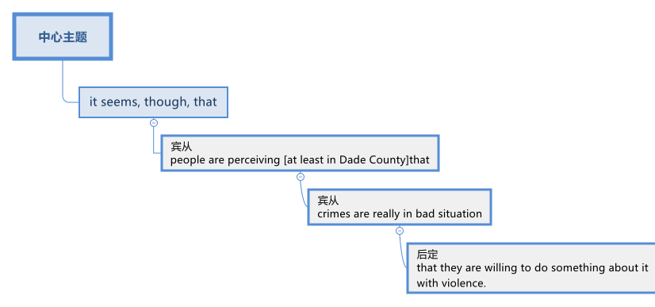

= step 2 - Lesson 36
:toc: left
:toclevels: 3
:sectnums:
:stylesheet: ../../+ 000 eng选/美国高中历史教材 American History ： From Pre-Columbian to the New Millennium/myAdocCss.css

'''
---

Lesson 36

==  part 1. 部分 (这篇文章已经过时了, 就不翻译了)

Just before I give a few details about the — er — fun aspect of computers that is, for use at home and for entertainment — I'd like to mention a couple of facts about the outlook for ISDN — that's the integrated services digital network — and it foresees a world-wide telecommunications network which could transmit telex and voice signals and, indeed, full-colour video images and high-speed computer data. Now, can you just imagine having a meeting with your colleagues around the world without even leaving your office? Well, that's what world-wide video teleconferencing can do, and it's on the cards that internal toll-free telephones may be available and also faster computer transmission with a digital network. And how are all these marvellous things achieved? Well, there are satellite relays, and digital packet switching, and laser devices which transmit over fibre-optic cables. But more about that another time.

[.my2]
就在我详细介绍计算机的——呃——有趣的方面，即用于家庭和娱乐的方面——我想提一下有关 ISDN 前景的几个事实——即综合服务数字网络——它还预见了一个世界范围的电信网络，可以传输电传和语音信号，甚至可以传输全彩色视频图像和高速计算机数据。现在，您能想象足不出户就能与世界各地的同事开会吗？嗯，这就是全球视频电话会议可以做到的，并且可以使用内部免费电话以及通过数字网络进行更快的计算机传输。所有这些奇妙的事情是如何实现的？嗯，有卫星中继、数字分组交换和通过光纤电缆传输的激光设备。但稍后再详细讨论。

And after that slight diversion I'll get back to a totally different aspect of modern technology — home computers, or PCs — that stands for personal computers. First, a bit of background. Some people attribute this growth industry to the recession which led to redundancies and a shorter working week, and this in turn led to more leisure time. So what are people doing with this extra free time that's on their hands? They're indulging in home entertainment, that's what! Hundreds of companies have sprung up to fill this gap, and the sports, DIY and home entertainment industries are achieving phenomenal success. In 1983 in the US, there were four million PCs, and game-playing was the principal use, with educational use a close second; and in third place was the financial function for things like budgeting, balancing cheque books, accounting and forecasting and so on.

[.my2]
在这个小小的转移之后，我将回到现代技术的一个完全不同的方面——家用电脑，或个人电脑——代表个人电脑。首先，介绍一些背景知识。一些人将这一行业的增长归因于经济衰退，经济衰退导致裁员和每周工作时间缩短，而这反过来又带来了更多的休闲时间。那么人们利用这些额外的空闲时间做什么呢？他们沉迷于家庭娱乐，就是这样！数百家公司如雨后春笋般涌现，填补了这一空白，体育、DIY 和家庭娱乐行业正在取得惊人的成功。 1983年，美国有400万台个人电脑，玩游戏是主要用途，教育用途紧随其后；第三位是财务职能，例如预算、平衡支票簿、会计和预测等。

To illustrate this with a few concrete figures, from the States again, in 1983, 52 per cent of the software was for entertainment programs, whereas only 16 percent was educational. Possibly this could be explained by the short life span of computer games, and having teenagers in the home was a decisive factor in the purchase of a personal computer, as households with children in this age-range were 50 per cent more likely to buy them. As far as the interest versus disapproval statistics go, in the 18-19 age-group, 25 per cent expressed interest in PCs and 18 per cent disapproval; and at the other end of the scale, the over-60s showed only 3 per cent interest and a resounding 87 per cent disapproval!

[.my2]
用一些具体的数字来说明这一点，还是从美国来看，1983 年，52% 的软件是用于娱乐程序，而只有 16% 是教育程序。这可能是因为电脑游戏的生命周期较短，而家里有青少年是购买个人电脑的决定性因素，因为有这个年龄段孩子的家庭购买电脑的可能性要高出 50% 。就兴趣与反对统计数据而言，在 18-19 岁年龄组中，25% 的人表示对 PC 感兴趣，18% 的人表示反对；而在天平的另一端，60 岁以上的人只表现出 3% 的兴趣，而 87% 的人强烈反对！

And this trend towards PCs is likely to continue as users become more knowledgeable and want more expensive machines with all kinds of new things. And there's a wide range in sizes, too, as the portable market expands, and now you can buy a featherweight lap-size model that's less than 2 kg, or something larger at around 12 kg but still portable. Just to digress slightly, I'd like to point out that microtechnology has hit other aspects of the home and leisure industry as well. With more time on our hands it seems we're spending more time keeping fit, and fitness has become a real growth industry, and it seems prone to gadgetry as well! There are all sorts of new things on the market these days. Take, for example, the watches that monitor your pulse rate as you jog or do aerobics, or exercise bicycles with sensors in the handgrips to check your pulse rate and then display it on a screen. And for those of you who remember that famous toy of the early 80s — Rubik's cube, the one with six sides, each composed of nine rotating faces, with 43 quintillion combinations — well, anyway, in a lab in the US they're working on a Cubot — that's a self-contained robot using microprocessors and mechanics — to solve it. But I'm getting off the track again, so back to our home computers with a final warning.

[.my2]
随着用户变得更加了解并想要拥有各种新事物的更昂贵的机器，这种个人电脑的趋势可能会持续下去。随着便携式市场的扩大，尺寸也有很大的变化，现在您可以购买重量小于 2 公斤的轻量级膝上型型号，或者更大的型号（约 12 公斤但仍可携带）。稍微离题一下，我想指出微技术也影响了家居和休闲行业的其他方面。随着我们手上的时间越来越多，我们似乎花更多的时间来保持健康，健身已经成为一个真正的增长行业，而且它似乎也很容易受到小玩意的影响！如今市场上有各种各样的新事物。例如，在慢跑或做有氧运动时监测您的脉搏率的手表，或者在手柄中装有传感器的健身自行车来检查您的脉搏率，然后将其显示在屏幕上。对于那些还记得 80 年代初那个著名玩具的人来说——魔方，有六个面，每个面由九个旋转面组成，有 43 千万种组合——好吧，无论如何，他们正在美国的一个实验室里工作在 Cubot 上——这是一个使用微处理器和机械装置的独立机器人——来解决这个问题。但我又偏离了轨道，所以回到我们的家用电脑并发出最后的警告。

The technical innovations of the last couple of decades have led to a host of new words in our vocabulary, and one of these is hacker — that's H-A-C-K-E-R — and it simply means an enthusiast who breaks into computers. And, not so long ago in the States, teenagers who were hackers used their home computers to break into supposedly secure government and business computers, for example in banks, labs and research centres. They just tried out different passwords until they found the right one. And as one seventeen-year-old said, 'It was like child's play.' And all that's needed is a home computer and a modem — that's M-O-D-E-M — which is a device that allows computers to transmit data over the phone lines — and, of course, a basic knowledge of how to operate a computer! And this has led to tangled legal and ethical problems — but we won't go into that here. But, as you can see, home computers are indeed a handy thing to have around, not only for entertainment but also for educational value. And no doubt in future …​

[.my2]
过去几十年的技术创新在我们的词汇中产生了许多新词，其中之一就是黑客，即 H-A-C-K-E-R，它的意思只是闯入计算机的爱好者。而且，不久前在美国，青少年黑客利用他们的家用计算机闯入了所谓安全的政府和商业计算机，例如银行、实验室和研究中心的计算机。他们只是尝试不同的密码，直到找到正确的密码。正如一位 17 岁的年轻人所说：“这就像儿戏一样。”所需要的只是一台家用电脑和一个调制解调器 - 这就是 M-O-D-E-M - 这是一种允许计算机通过电话线传输数据的设备 - 当然，还需要了解如何操作计算机的基本知识！这导致了错综复杂的法律和道德问题——但我们不会在这里讨论这个问题。但是，正如您所看到的，家用计算机确实是一个方便携带的东西，不仅具有娱乐性，而且具有教育价值。毫无疑问，未来……​

'''

== part 2. 部分

Dade County, Florida, which includes the city of Miami, is a dangerous place to be these days, that according to a Miami Herald poll 民意调查，民意测验 /后定 released this week.  +

The survey reports (v.) that /`主` ① forty-two percent of #people# 后定 interviewed 面试；面谈;（常指公开的）记者采访，访谈 ② #or# #their family members# /`谓` #have been# victims of burglary 入室盗窃，入室盗窃罪, robbery (n.)盗窃；抢劫；掠夺 or assault 侵犯他人身体（罪）；侵犯人身罪 in the past five years.  +

Almost one half 二分之一  say /they need guns to feel (v.) safe in Dade County, although most people won't say whether they do own (v.) weapons.  +

The Herald conducted (v.) the survey *in the wake （船只航行时的）尾流，航迹 of* 随…之后而来；跟随在…后 a widely publicized 宣传；推广；宣扬；传播 booby trap 饵雷；诡雷;（为开玩笑而设下的）陷阱 killing, in which /a store owner killed a would-be （形容想要成为…的人）未来的 burglar 入室行窃者，窃贼.  +

And now /the poll suggests (v.) `主` a lot more people `谓` want to take law into their own hands.  +
Herald (n.)预兆;（旧时的）信使，传令官，使者 reporter Andre Vicluchee has been covering (v.)报道；电视报道 the story.

[.my2]
根据迈阿密先驱报本周发布的一项民意调查，包括迈阿密市在内的佛罗里达州戴德县, 如今是一个危险的地方。调查报告称，42% 的受访者或其家人, 在过去五年中遭受过入室盗窃、抢劫或袭击。近一半的人表示，他们需要枪支, 才能在戴德县感到安全，尽管大多数人不会透露他们是否拥有武器。  +
《先驱报》在一场广为人知的诱杀装置杀人事件后, 进行了这项调查，其中一名商店老板杀死了一名潜在的窃贼。现在的民意调查显示，更多的人希望将法律掌握在自己手中。 《先驱报》记者安德烈·维克鲁奇一直在报道此事。

[.my1]
.案例
====
.in the wake of sb/sth
coming after or following sb/sth 随…之后而来；跟随在…后 +
• There have been demonstrations on the streets in the wake of the recent bomb attack. 在近来的炸彈袭击之后，大街上随即出现了示威游行。 +
• A group of reporters followed in her wake. 一群记者跟随在她的身后。 +
• The storm left a trail of destruction in its wake. 暴风雨过处满目疮痍。

.booby trap
a hidden bomb that explodes when the object that it is connected to is touched饵雷；诡雷

.booby
1.( informal ) a stupid person 笨蛋；傻瓜
2. [ usually pl.] ( informal ) a word for a woman's breast, used especially by children （女人的）乳房（多见于儿童用语） +

====

"`主` #The one part# 后定 I think that {`主` that `系` was a little surprising} /`系` #was# the number of people who feel (v.) that /it is okay to shoot (v.), to kill (v.) an intruder 闯入者；侵入者 that comes into your house.  +
We found sixty-three percent feel (v.) that /they should have the right to kill an intruder in their house."

[.my2]
“我认为有点令人惊讶的是，有多少人认为开枪杀死进入你家的入侵者是可以的。我们发现, 百分之六十三的人认为, 他们应该有权杀死闯入他们房子的入侵者。”

"Whether or not the person is armed or not only if …​"

[.my2]
“无论这个人是否携带武器，只要......”

"Whether they know (v.) or not /if the person is armed.  +
It surprised us; we figured (v.)认为，认定（某事将发生或属实） there would be something of a hard-line 坚定的；坚决的 attitude out there. But this was probably above what we expected."

[.my2]
“无论他们是否知道这个人是否携带武器。这让我们感到惊讶；我们认为那里会有强硬态度。但这可能超出了我们的预期。”

"Well, it seems, though, that /people *are perceiving* (v.)将…理解为；将…视为；认为;注意到；意识到；察觉到 at least in Dade County *that* /crimes are really in bad situation 后定 that they are willing to do something about it with violence."

[.my2]
“嗯，不过，至少在戴德县，人们似乎意识到犯罪情况确实很糟糕，他们愿意用暴力来解决这个问题。”

[.my1]
.案例
====

====

"Yes. I went back and questioned `谓` more [at length 长时间；详尽地] `宾` another fifteen or twenty 后定 responded (v.)（口头或书面）回答，回应 from the poll. +
And they all seem to feel (v.) that, if they find themselves in a situation /in which they have to take some action, even if it means (v.) killing somebody, they'll do it."

[.my2]
“是的。我回去详细询问了另外十五或二十人的民意调查结果。他们似乎都觉得，如果他们发现自己处于必须采取某种行动的情况，即使这意味着杀人，他们会做到的。”

[.my1]
.案例
====

.AT ˈLENGTHAT... LENGTH
(1) for a long time /and in detail 长时间；详尽地 +
• He quoted at length from the report. 他大段大段地引用报告中的话。 +
• We have already discussed this matter at great length. 我们已经十分详尽地讨论了这个问题。

(2) ( literary) after a long time 经过一段长时间以后；最后 +
• ‘I'm still not sure,’ he said at length.“ 我还是没把握。”他最后说道。
====

"I'll take it /that Miami Herald poll /and perhaps that `主` a lot of people's feelings about crimes `谓` stem (v.) [in part] from this case of the booby trap 饵雷 victim, a store owner 店主 booby trapped (v.) his variety (a.) store raider 袭击者；抢劫者 in a black neighborhood.  +
Tell us about that case."

[.my2]
“我认为《迈阿密先驱报》的民意调查，也许很多人对犯罪的看法, 部分源于这起诱杀装置受害者的案件，一名商店老板在一个黑人社区, 将他的杂货店袭击者诱入陷阱。告诉我们这件事吧。案件。”

"The man's name is Prentice Raschid. He is a black business man who has a small store in a black high-crime area 犯罪高发地区 of town.  +
He has been burglarized 被盗窃，被入室盗窃, I think, seven or eight times over the past few weeks, had asked for help from the police and had not gotton any answer to his satisfaction （需要或欲望的）满足，达到.  +

So he went ahead /and set up an electrical booby trap in the store.  +
About a week and a half 一周半 ago /one morning, they found a young man dead (v.)  in the booby trap /who had been electrocuted (v.)使触电受伤（或死亡）；用电刑处死 /while trying to carry out 执行，实施 some stuff （泛指）活儿，话，念头，东西 from the store."

[.my2]
“这个人的名字叫普伦蒂斯·拉希德（Prentice Raschid）。他是一名黑人商人，在该镇黑人犯罪率高的地区, 拥有一家小商店。我想，在过去的几周里，他被盗窃了七八次，他要求警方寻求帮助，但没有得到令他满意的答复。于是他继续在店里设置了一个电子诱杀装置。大约一周半前的一天早上，他们发现一名年轻人死在了诱杀装置中。在试图从商店取出一些东西时触电身亡。”

[.my1]
.案例
====
.stuff

( informal ) used to refer in a general way to things that people do, say, think, etc.（泛指）活儿，话，念头，东西 +
- I've got loads of stuff to do /today. 我今天有好多事儿要做。 +
- I like reading and stuff. 我喜欢看书什么的。 +
- This is all good stuff . Well done! 这一切都不错，干得漂亮！
====

"In what has the public reaction been then?"

[.my2]
“当时公众的反应如何？”

"The public reaction has been an overwhelming support for Mr Raschid. He has been charged #with# ① man slaughter (屠宰；宰杀) 过失杀人，非预谋杀人罪, and #with# ② setting up an illegal man trap 捕人陷阱.  +
But our poll found (v.) that /seventy-nine percent of the population here /feel (v.) he should not be prosecuted 被起诉."

[.my2]
“公众的反应是, 对拉希德先生的压倒性支持。他被指控犯有屠杀罪, 和设置非法人员陷阱。但我们的民意调查发现，这里百分之七十九的人认为, 他不应该受到起诉。 ”

"Has this case, this booby trap case, led to inspire (v.) any other similar instances of citizen store-owners /fighting back against burglars?"

[.my2]
“这个案件，这个诱杀装置案件，是否引发了任何其他类似的公民店主, 反击窃贼的事件？”

"I don't know /if it directly inspired (v.) them, but it may have been a coincidence 巧合. +
But in the following week /there were another five incidents 事件 /in which citizens, if you will, turn (v.) the tables 扭转形势；转变局面；转弱为强 on assailants 攻击者；行凶者.  +

[.my1]
.案例
====
.turn the ˈtables (on sb)
to change a situation /so that you are now in a stronger position /than the person /who used to be in a stronger position than you 扭转形势；转变局面；转弱为强
====

In fact /these all six incidents (n.) left (v.) four people dead (v.), four alleged （未经证实而）声称的，所谓的；（在证据不足的情况下）被指控的 criminals dead (v.) /and two others wounded in the hospital."

[.my2]
“我不知道这是否直接启发了他们，但这可能是一个巧合。但在接下来的一周里，又发生了五起事件，如果你愿意的话，公民们扭转了袭击者的局面。事实上，这所有六起事件, 造成四人死亡，四名犯罪嫌疑人死亡，另外两人在医院受伤。”

"Is there #anything# about Dade County /后定 #that# is making it a particularly blood thirsty 嗜杀的；残忍的 place /at the moment, as crime's `表` really on the increase /in Dade County . . ."

[.my2]
“戴德县目前是否有什么因素, 使其成为一个特别嗜血的地方，因为戴德县的犯罪确实在增加……”

"I believe /the situation is, we have a city here /that has grown a lot /in the last few years."

[.my2]
“我相信情况是，我们这里的城市, 在过去几年里发展了很多。”

"In what way? What's been the source of the growth?"

[.my2]
“以什么方式？增长的源泉是什么？”

"Immigration [for the most part], and lot of people /后定 coming in from Cuba, Cuban refugees 古巴难民, a lot of Haitian refugees, and from all over Latin America.  +
`主` What is interesting (a.) about the Raschid case /in this context /`系` is that, as Mr Raschid has pointed out himself, that /although he is a black business man 后定 operating in a black area, his support has come from all groups, Hispanic  西班牙的, white and black."

[.my2]
“大部分是移民，很多人来自古巴、古巴难民、很多海地难民, 以及整个拉丁美洲。在这种背景下，拉希德案件的有趣之处在于，正如拉希德先生所指出的那样他自己表示，虽然他是一名在黑人地区经营的黑人商人，但他的支持来自所有群体，包括西班牙裔、白人和黑人。”

"Andre, do you carry around 随身携带 a gun /when you are doing your reporting?"

[.my2]
“安德烈，你做报道的时候带枪吗？”

"I don't. But I know some reporters that do."

[.my2]
“我不知道。但我知道有些记者是这样的。”

Andre Vigluche is a reporter /for the Miami Herald.

[.my2]
安德烈·维格鲁什 (Andre Vigluche) 是《迈阿密先驱报》的记者。

'''

== Technology and the Future (III)

[.my2]
三、科技与未来（三）

Now I would like to discuss environment, which is very much a function 功能，函数 of transportation and communication. But it is also a function of population.  +
As everybody knows, we are now in a population explosion — but probably around 大约 the turn of the century /this particular explosion will be controlled /and the world population may be shrinking (v.)缩水，收缩；变小 again.

[.my2]
现在我想讨论一下环境，它在很大程度上, 是交通和通讯的功能。但这也是人口的函数。众所周知，我们现在正处于人口爆炸之中——但可能在世纪之交，这种特殊的爆炸将得到控制，世界人口可能会再次萎缩。

Nevertheless, even with a six billion population /there may be more room /than is generally imagined today.  By the twenty-first century, agriculture will be on the way out 即将过时，即将被淘汰.  +
It's a ridiculous 可笑的，荒谬的 process: a whole acre 英亩 is needed /to feed (v.) one person, because growing plants are extremely inefficient devices for trapping (v.)收集；吸收;使落入险境；使陷入困境 sunlight.  +

If we could develop a biological system /working at a mere five per cent efficiency 效率；效能；功效;功率 — today's solar cells 太阳能电池 can double (v.) that — it would require (v.) twenty square feet 平方英尺, not one acre, to feed (v.) one person.

[.my2]
然而，即使有 60 亿人口，空间也可能比今天普遍想象的要大。到二十一世纪，农业将走向灭亡。这是一个荒谬的过程：需要一整英亩的土地才能养活一个人，因为种植植物捕获阳光的效率极低。如果我们能够开发出一种效率仅为 5% 的生物系统（今天的太阳能电池可以将其提高一倍），那么就需要 20 平方英尺（而不是一英亩）来养活一个人。

Food production is the last major industry /to yield (v.)屈服；让步;被…替代；为…所取代 to technology. Only now are we doing something about it, probably too little and too late.

[.my2]
食品生产是最后一个屈服于技术的主要行业。直到现在我们才开始采取行动，但可能力度太小而且太晚了。

One promising field of research /is the production of proteins from petroleum 石油，原油 by microbiological 微生物学的 conversion 转变；转换；转化, which sounds (v.) most unappetizing 引不起食欲的 — but we do use (v.) microbes to make wine.  +

This process gives high-quality proteins, some of them better balanced (v.)使（在某物上）保持平衡；立稳 for human consumption （能量、食物或材料的）消耗，消耗量 than natural vegetable proteins 植物（性）蛋白. +
It would take only three per cent of today's petroleum output /to provide (v.) the total protein needs of the entire human race.

[.my2]
一个有前途的研究领域, 是通过微生物转化, 从石油中生产蛋白质，这听起来最令人倒胃口——但我们确实使用微生物来酿酒。这个过程产生了高质量的蛋白质，其中一些蛋白质, 比天然植物蛋白更适合人类食用。只需要当今石油产量的百分之三, 就能满足全人类的蛋白质总需求。

With the exception of 除了……之外 luxury items — and the Russians, I've heard, have already started to export (v.)出口 synthetic 人造的；（人工）合成的 caviare 鱼子酱 — most foods will be factory-made /in the next century.  +
This will free (v.) vast areas of agricultural land /for other purposes — living, parks, recreation 娱乐；消遣, hunting — above all, for wilderness 未开发的地区；荒无人烟的地区；荒野.

[.my2]
除了奢侈品之外——据我所知，俄罗斯人已经开始出口合成鱼子酱——大多数食品将在下个世纪, 实现工厂化生产。这将释放大片农田, 用于其他目的——生活、公园、娱乐、狩猎——最重要的是，用于荒野。

As a source of raw materials 原材料, the sea seems inexhaustible 用之不竭的；无穷无尽的.  +
`主` Any element 后定 you care to mention `系` is there, in solution溶解（过程）  or lying on the seabed.  +
We will also be forced /to use (v.) it for more and more of our water supply, through desalination （海水的）脱盐 techniques.

[.my2]
作为原材料的来源，海洋似乎取之不尽，用之不竭。你想提到的任何元素都在那里，在溶液中或躺在海底。我们还将被迫通过海水淡化技术, 将其用于越来越多的供水。

I'm sorry to leave (v.) the sea so hastily (ad.)匆忙地；急速地；慌忙地, but space is a lot bigger /and I must spend more time on that.

[.my2]
很抱歉这么匆忙地离开大海，但是太空更大，我必须花更多时间在上面。

Our current ideas of space and its potentialities 潜力；可能性 /are badly distorted by the primitive 原始本能的;发展水平低的；落后的 nature of our techniques. To prove (v.) this, here is a statistic 统计数字，统计资料；统计学 /that will surprise you.

[.my2]
我们当前对空间及其潜力的看法, 因我们技术的原始性质而严重扭曲。为了证明这一点，这里有一个会让你大吃一惊的统计数据。

`主` The amount of energy 后定 needed to lift (v.) a man to the Moon /`系` is about 1,000 kilowatt-hours 千瓦时；一度电（能量单位） /and that costs (v.) only ten to twenty dollars!  +
`主` The difference of nine zeros /between this and the Apollo budget /`系` is a measure 测量；度量 of our present incompetence 无能力；不胜任；不称职.  +

Ultimately  最终，最后；根本上, there's no reason /why `主` space travel should be, in terms of 就…而言；从…角度来看 future incomes, `系` much more expensive than jet flight today.

[.my2]
把一个人送上月球所需的能量大约是1000千瓦时，而这只需要10到20美元!这个预算和阿波罗计划的预算相差9个零，这是我们目前无能的一个衡量标准。最终，就未来的收入而言，太空旅行没有理由比今天的喷气式飞机昂贵得多。

Space communities 社区；团体，群体 will be established first /on the Moon, then on Mars, and later /on other worlds.  +
But much closer 靠近的 to the Earth, `主` orbital （行星或空间物体）轨道的 space stations of many kinds /`谓` will be in wide use (v.) by the year 2000.  +

In May 1967, I was in Dallas to attend (v.) the first conference /on the commercial uses of space — including tourism 旅游业，观光业.  +
Barron Hilton gave a talk /on the Hilton Orbiter Hotel, which he hopes to see /in his lifetime.  +
Space tourism 旅游业，观光业；旅游，观光 is going to be a major industry /in the twenty-first century.

[.my2]
太空社区将首先在月球上建立，然后在火星上，然后在其他星球上建立。但到 2000 年，距离地球更近的多种轨道空间站, 将得到广泛使用。 1967 年 5 月，我在达拉斯参加了第一届关于太空商业用途（包括旅游业）的会议。巴伦·希尔顿 (Barron Hilton) 发表了关于他希望在有生之年亲眼目睹的希尔顿轨道飞行器酒店 (Hilton Orbiter Hotel) 的演讲。太空旅游将成为二十一世纪的主要产业。

Another tremendously 非常地；可怕地；惊人地 important use (n.) of space stations /will be for medical research.  +
`主` One paper /given at Dallas /`谓`  discussed the engineering 工程 problem of a hospital in orbit.

[.my2]
空间站的另一个极其重要的用途, 是用于医学研究。达拉斯发表的一篇论文, 讨论了轨道医院的工程问题。

Which brings a poignant 令人沉痛的；悲惨的；酸楚的 memory to mind.  +
`主` The last letter /I ever received from that great scientist professor J B S Haldane /`谓` was written /when he was dying of 死于 cancer /and in considerable 相当多（或大、重要等）的 pain from his operations.  +

In it, he said /what a boon (n.)非常有用的东西；益处 the weightless 失重的；无重量的 environment of a space hospital would be to patients like himself /not to mention (v.)更不用说 burn victims 烧伤受害者, sufferers (n.) from heart complaints 心脏疾病, and those 后定 afflicted (v.)折磨；使痛苦；困扰 with muscle diseases. +

[.my1]
.案例
====
.boon
(n.) ~ (to/for sb) : something that is very helpful and makes life easier for you非常有用的东西；益处
====

I am convinced 使确信；使相信；使信服;说服，劝说（某人做某事） that /`主` `主` research in space `谓` will open up unguessed 未被猜到的，未被推测到的 regions of medical knowledge /and give us a vast range of new therapies 治疗方法.  +

So I get pretty mad 生气的，气愤的 /when I hear ignorant 无知的 but well-intentioned 好意的，好心的；出于善意的 people ask, 'Why not spend the space budget on something useful — like cancer research?'  +

When we do find a cancer cure, part of the basic knowledge 基础知识 will have come from space.  +
And ultimately /we will find even more important secrets there: perhaps, some day, a cure for death itself …​

[.my2]
这让我想起一段令人心酸的回忆。我从伟大的科学家 J B S Haldane 教授那里收到的最后一封信, 是在他因癌症和手术带来的巨大痛苦而濒临死亡时写的。他在文中表示，太空医院的失重环境, 对于像他这样的患者来说, 是多么大的福音，更不用说烧伤患者、心脏病患者, 和肌肉疾病患者了。我相信, 太空研究将开辟未知的医学知识领域，并为我们提供大量新疗法。 +
因此，当我听到无知但善意的人问“为什么不把空间预算花在有用的事情上——比如癌症研究？”时，我会非常生气。当我们确实找到癌症治疗方法时，部分基础知识将来自太空。最终我们会在那里发现更重要的秘密：也许有一天，可以治愈死亡本身……​

'''

==  Scarborough Fair 4. 斯卡伯勒集市

Are you going to Scarborough Fair

[.my2]
你要去斯卡布罗集市吗

Parsley, sage, rosemary and thyme

[.my2]
欧芹、鼠尾草、迷迭香和百里香

Remember me to one who lives there

[.my2]
请记住我对住在那里的人

She once was a true love of mine

[.my2]
她曾经是我的真爱

Tell her to make me a cambric shirt

[.my2]
让她给我做一件麻布衬衫

Tell her to make me a cambric shirt

[.my2]
让她给我做一件麻布衬衫

(On the side of a hill in the deep forest green)

[.my2]
（森林深处的山坡上）

Parsley, sage, rosemary and thyme

[.my2]
欧芹、鼠尾草、迷迭香和百里香

(Tracing of sparrow on the snow-crested brown)

[.my2]
（在雪冠棕色上追踪麻雀）

Without no seams nor needle work

[.my2]
没有接缝，也没有针线工作

(Blankets and bedclothes the child of the mountain)

[.my2]
（山之子的毯子和床上用品）

Then she'll be a true love of mine

[.my2]
那么她就会成为我的真爱

(Sleeps unaware of the clarion call)

[.my2]
（睡着了，没有意识到号角的号角）

Tell her to find me an acre of land

[.my2]
告诉她给我找一亩地

Tell her to find me an acre of land

[.my2]
告诉她给我找一亩地

(On the side of a hill a sprinkling of leaves)

[.my2]
（山坡上洒满了树叶）

Parsley, sage, rosemary and thyme

[.my2]
欧芹、鼠尾草、迷迭香和百里香

(Washes the grave with silvery tears)

[.my2]
（用银色的泪水洗净坟墓）

Between the salt water and the sea strands

[.my2]
在咸水和海岸之间

(A soldier cleans and polishes a gun)

[.my2]
（一名士兵清洁并擦亮枪支）

Then she'll be a true love of mine

[.my2]
那么她就会成为我的真爱

Tell her to reap it with a sickle of leather

[.my2]
告诉她用皮革镰刀收割它

Tell her to reap it with a sickle of leather

[.my2]
告诉她用皮革镰刀收割它

(War bellows blazing in scarlet battalions)

[.my2]
（猩红军团中战火熊熊）

Parsley, sage, rosemary and thyme

[.my2]
欧芹、鼠尾草、迷迭香和百里香

(Generals order their soldiers to kill)

[.my2]
（将军命令士兵杀戮）

And gather it all in a bunch of heather

[.my2]
将它们全部收集在一堆石南花中

(and to fight for a cause they've long ago forgotten)

[.my2]
（并为他们早已忘记的事业而奋斗）

Then she'll be a true love of mine

[.my2]
那么她就会成为我的真爱

(Repeat) （重复）

'''
