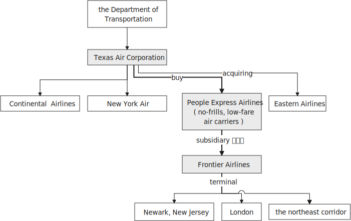
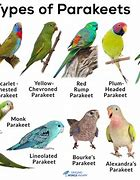
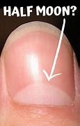

= Lesson 11
:toc: left
:toclevels: 3
:sectnums:

'''

== 简讯目录

Texas Air announced today that it will buy the troubled 麻烦多的；混乱的；扰乱的 People Express  快件服务；快递服务；快运服务 Airlines for about a hundred and twenty-five million dollars.  +

*The proposed deal* would allow most People Express employees to keep their jobs, although the company will eventually lose its identity and become part of Texas Air.  +

Federal officials must approve the merger （机构或企业的）合并，归并.  +

Texas Air is also trying to buy Eastern Airlines.  +

A rally 止跌回升 on Wall Street today *after six consecutive 连续不断的 losing sessions*, the Dow Jones Industrial Average ended the day *up nearly nine points*, to close *at seventeen sixty-seven point fifty-eight*.  +
今天华尔街连续六次下跌后，道指琼斯工业指数当天上涨了近九点，收于1767.58点。 +

`主` What's being called a "Freedom Flight" of seventy former Cuban *Political prisoners* `谓` landed in Miami today *to an ecstatic 狂喜的；热情极高的 reception* 欢迎；反应；反响;接纳；接待；迎接 by thousands of relatives and well-wishers.  +
被称为“自由飞行”的七十名前古巴政治犯在迈阿密登陆，他们受到成千上万名亲人及好心人的欢呼迎接。 +

.案例
====
.reception
the type of welcome that is given to sb/sth 欢迎；反应；反响 +
=> Delegates *gave him a warm reception* as he called for more spending on education. 由于他呼吁增加教育经费，代表们向他报以热烈的欢迎。

====

The plane also carried forty-one relatives of former prisoners.  +
The flight culminated (v.)（以某种结果）告终；（在某一点）结束 nearly two years of negotiations with the Castro regime. +
这架飞机还载着四十一名前囚犯的亲属。此次飞行结束了与卡斯特罗政权近两年的谈判。 +

.案例
====
.culminate
[ V] ~ (in/with sth) ( formal ) to end with a particular result, or at a particular point （以某种结果）告终；（在某一点）结束 +
=> a gun battle *which culminated* in the death of two police officers 一场造成两名警察死亡的枪战 +
=> Months of hard work *culminated* in success. 几个月的艰辛工作终于取得了成功。 +
====

'''

== 航空公司收购

Texas Air Corporation today announced that it has agreed to buy People Express Airlines for one hundred twenty-five million dollars in securities 有价证券,抵押品.  +

Texas Air already owns Continental 大洲的；大陆的 Airlines and New York Air.  +

It is *in the process of* acquiring 购得；获得；得到 Eastern Airlines.  /目前它正在收购东方航空。 +

People Express, one of the first no-frills  （产品或服务）只包括基本元素的；无装饰的, low-fare air carriers, has been in financial trouble lately 最近；新近；近来.  +

It was forced to shut down its subsidiary 附属公司；子公司, Frontier 国界；边界；边境 Airlines.  +

Texas Air now says it will acquire Frontier's assets *as part of* its deal with People Express.  +
德克萨斯航空现在表示，它将收购边境航空资产，作为与人民航空达成协议的一部分。 +

Joining us now from New York, NPR's business reporter Barbara Mantel.  +

"Barbara, it is said this is a very attractive low price, this one hundred twenty-five million dollars in securities.  +

Besides that, why does Texas Air want People Express?" "Well, Frank Lorenzo, who is Chairman of Texas Air, will *get* airplanes *from* People Express, which he might need.  +

He will get the lowest cost work-force in the industry at People Express.  +

He will get a new terminal  航空站；航空终点站 at Newark, New Jersey 后定 that People Express is building.  /他将在新泽西州的纽瓦克, 得到"人民快递公司正在建设的"一个新航站楼。 +

He'll get flights to London, and he will get control (n.) over competition.  +

People Express *competes (v.)竞争；对抗 heavily*, especially in the northeast corridor 走廊，过道，通道;空中走廊, *with* Texas Air." /人民航空公司与德克萨斯航空公司竞争激烈，特别是在东北走廊。

"`主` *This issue of competition* `谓` has been *a sticking point* 分歧点；症结 before /for *the Department of Transportation* 运输业 /when two airlines wanted to get together.  +
此前，当两家航空公司想要合并时，竞争问题一直是交通部的症结所在。 +

How will Texas Air *get around 解决,避开 (规章或法律) it* this time?" "Well, they might not, Texas Air *wanted to acquire* East ..., or wants to acquire, Eastern Airline, and the Department of Transportation said, 'No, not unless 除非…否则不… you *sell* more landing slots, more slots in the northeast corridor *to* Pan Am *so that* we'll have some competition there.' And Texas Air *agreed to that* just last week.  +

这一次德克萨斯航空公司会如何回避这个问题呢？” “嗯，也许他们不会回避。德克萨斯航空公司想要收购东方航空，交通部却说，‘不行，除非……你们将在东北走廊的更多降落点、更多降落槽位出售给泛美航空，这样我们在那里就会有一些竞争。’而德克萨斯航空公司在上周同意了这个条件。”

That may happen again here.  +

The Department of Transportation may require 使做（某事）；使拥有（某物）；（尤指根据法规）规定 that Texas Air *sell* some slots or some gates  登机门；登机口 *to* another airline to ensure that there is still competition in the northeast part of the marketplace.  +

But Texas Air has some leverage 影响力; 杠杆作用；杠杆效力 here with the Department of Transportation because People Express is a failing 衰退的，衰弱的；衰老的;失败 company.  +

And the Department of Transportation may feel, 'Well, we'll let them buy People Express and keep it running, *rather than* 而不是 let it fail and lose all those jobs." "Mm hm.  +

Now, if the deal is approved by the Department of Transportation, *what is it likely to mean* for consumers? If there's less competition *the fares could possibly go up*." "Well, yes.  +

You would think that when you move *from* two competitors in a market *to* just one airliner that prices would just have to go up.  +

But *I want you to keep in mind that* unrestricted fares of the kind 后定 People Express offered (v.), you know, `主` wholesale 大规模的;批发的；趸售的 unrestricted fares, `谓` were being eliminated  (v.)（比赛中）淘汰 and *phased out* 逐步废除 anyway, because they were not profitable.  +
但我要你记住，人民航空所提供的无限制票价，你知道，大规模不受限制的票价，不管怎样，正在遭到淘汰，因为他们盈利性低。 +

And the Department of Transportation theory here is that if you allow mergers to *take place* 发生、举行, or many mergers to take place, you might create more efficiencies and low costs, *leading possibly to* lower fares. /从而可能降低票价 +

And also the Department of Transportation believes that there's a lot of potential competition in *the marketplace* 市场竞争.  +

Airlines can *move planes around* and buy gates, and so that if `主` an airline in a particular market segment `谓` was making a lot of money and raising prices excessively 过分地，过量地；极度, other airlines would move in and prices would be brought down through competition.  +
航空公司可以调动飞机，购买登机口，因此，如果某一特定细分市场的航空公司赚了很多钱，并过度提高价格，其他航空公司就会进入，通过竞争，价格就会降低。 +

So that it's a nice theory, the theory of potential competition *keeping* prices *in line* 使（某人）就范; 使（某人）听从吩咐, but it's sort  种类；类别；品种 of a new idea and *it's not clear that* that's really the way it would work."
这是一个很好的理论，潜在竞争理论使价格保持一致，但这是一个新想法，是否真的会以这样的方式发挥作用尚未明确。” +

"Thanks." From New York, NPR's Barbara Mantel.  +

'''

== 乡村音乐

"My audiences have been very devoted (a.)挚爱的；忠诚的；全心全意的 over the years throughout 各处；遍及;自始至终；贯穿整个时期 the country.  +

And they've expanded and grown /and *the country audience* has been just as kind and *as supportive 给予帮助的；支持的；鼓励的；同情的 as* the *folk audience* has been." /他们已经扩大和成长，乡村听众和民间听众一样友善和支持。 +

"I was thinking though, nonetheless 尽管如此, when I put on 举办 (演出、展览); 提供 (服务) this album, 'The Last of the True Believers,' especially the title cut, that I heard *more* country there *than* I'd perhaps heard before." +
尽管如此，我还是在想，当我放上(播放)这张专辑“最后的真正信徒”，特别是标题剪辑时，我在那里听到的乡村音乐可能比我以前听到的更多

"Well, I guess it has ...  +
I've moved in that direction, mainly because I am playing with the band more.  +
我已经朝那个方向走了，主要是因为我更多地和乐队一起演奏 +

My *natural roots* are there in country and hillbilly (n.)山区乡巴佬 music.  +
我天生就植根于乡村音乐和乡下人音乐 +

And so I think `宾` *that just comes out more* when you put the band with it." +
所以我认为，当你把乐队和它放在一起的时候，这一点就会更好地体现出来 +

"I want to ask you some questions, please, about this album, about the ...  +

*not so much* what's on the inside *right now*, *but* what's on the outside — *a picture on the front of you* in front of a Woolworth store, someplace, I guess, in Texas or Tennessee, and ..." "Houston, Texas." +
与其说是现在里面的东西，不如说是外面的东西——一张在伍尔沃斯商店前面的你正面的照片，我猜是在得克萨斯州或田纳西州的某个地方，还有……”“得克萨斯州休斯顿。” +

"In Houston, Texas? Is it *the Woolworth store* 后定 that has the *hardwood floor* still /and the parakeets 长尾鹦鹉 in the back /and that *sort of thing*?" +
在得克萨斯州休斯顿？是那家仍然铺着硬木地板、后面养着长尾小鹦鹉之类的伍尔沃斯商店吗？ +

.案例
====
.parakeet

====

"Well, `主` this one *that we shot this in front of* in Houston Texas `系` is one of the largest ones in the country.  +
嗯，我们在德克萨斯州休斯顿前面, 拍摄的这张照片, 是全国最大的照片之一 +

It's a two-storey 楼层;有…层的 and it's got the escalator 自动扶梯 *that does a little pinging 发出“砰”的声音 noise* every couple of minutes.  +
这是一座两层楼的楼房，里面有自动扶梯，每隔几分钟就会发出轻微的乒乓声 +

And it takes up a whole city block." "But, why a cover photo 封面照片 in front of Woolworth's?" "Well, that comes from the song 'Love at the Five and Dime （美国、加拿大的）十分硬币，十分钱,' which was a song that Cathy Mattea also cut this year /and had my first, you know, top five country hit 风行一时的流行歌曲（或唱片） with.  +

它占据了整个街区。 +
但是，为什么要在伍尔沃斯的门前放一张封面照片呢？  +
嗯，这首歌来自歌曲 Love at the Five and Dme，这首歌也是凯西·马特亚今年演唱的，你知道，这首歌是我在五大乡村歌曲中的第一首热门歌曲 +

And it deals with the Woolworth store." "There is, on the cover, you are holding a book, and you can't really see.  +

\...  +

What is the name of the book on the cover you're holding?"

"In the Kindness 仁慈；善良；体贴；宽容; 友好（或仁慈、体贴）的举动 of Strangers, the latest Tennessee Williams' biography 传记；传记作品."

"And on the back is Larry McMurtrie's book about a cattle drive 牛仔赶牛  around *the turn of the century*, Lonesome 孤独的；寂寞的 Dove 鸽子." +
背面是拉里·麦克默里(Larry McMurtrie)的书，讲述了世纪之交的一次赶牛活动，名为“孤独的鸽子” +

"He's my main prose 散文 hero."

"Now, why? Why would you do that? Why would you pose with a book?" /你为什么要和一本书摆姿势？

"Well, I have, my audience *consists of*  (以…) 为组成部分 a lot of young people between the ages of, maybe you know, fourteen and twenty-five.  +

And I read a lot, and I also write short stories and have written a novel.  +

And I just feel like young people are *missing out* 错失获利（或取乐等）的机会;不包括…在内；遗漏 because they don't read books.  +
我只是觉得年轻人错失了机会，因为他们不读书 +

And *any time* I have the opportunity to influence the young person to pick up a book and read it, I would try to do that."

"When you hear these lyrics 歌词;抒情的 (诗歌), when the words come to you, are you hearing the stanzas （诗的）节，段 as poetry or as music?" /你是把这些小节当作诗歌还是音乐？ +

.案例
====
.lyric
--> 来自lyra,里拉琴，引申词义抒情的。

.stanza
--> 来自意大利语 stanza,诗节，段，词源同 stand,stance.
====

"Well, I'm hearing them as music. Lyrics usually come to me, and songs come to me as a total picture. And the music and the lyrics come at the same time.  Sometimes they shoot me *straight up* 正直的; 确实的 in bed, you know, in the middle of the night.

The Wing 翅膀，翼 and the Wheel 车轮；轮子;舵轮 ' is a very special song to me. It's probably my favorite song that I've ever written.

And that song was inspired 赋予灵感；引起联想；启发思考  at the Vancouver 温哥华 Folk Festival （音乐、戏剧、电影等的）会演，节 by two people who are from Managua 马那瓜（尼加拉瓜首都）, Nicaragua. They have a duo  一对表演者；搭档 call Duo Guar Buranco. /他们有一个叫Guar Buranco的二人组  +

And just about four o'clock in the morning, I was sitting in my hotel room and listening to them sing in the room next door, and looking out the window at this little *fingernail  手指甲 moon* hanging out over the Vancouver 温哥华（加拿大主要港市） Bay, and that song just came flowing, you know, and was inspired by those two people."

.案例
====
.fingernail moon

====

"Now, that sounds easy."

"Well, it IS easy.  If you listen to yourself and you listen to the inspiration 灵感 that's *bringing on*  使发展，导致（通常指坏事）;帮助（学习者）进步；促使提高;促使（作物、水果等）成长 that particular song, it's easy.  It's just a matter of *getting up* 站起来, 起床 and writing it down."

Nancy Griffith, talking with us in WPLN in Nashville 那什维尔（美国田纳西州首府）.  She is continuing her national tour 巡回比赛（或演出等）；巡视 with the Everly Brothers.  Her latest album is called "The Last of the True Believers." +
她正与埃弗利兄弟一起继续她的全国巡演 +

'''
