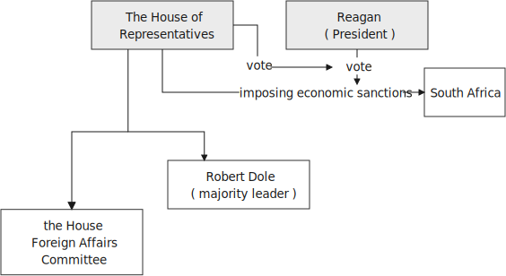
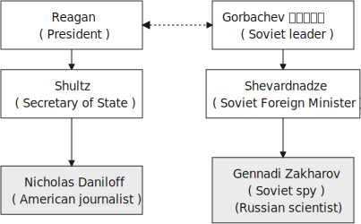
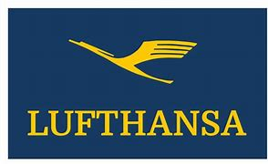
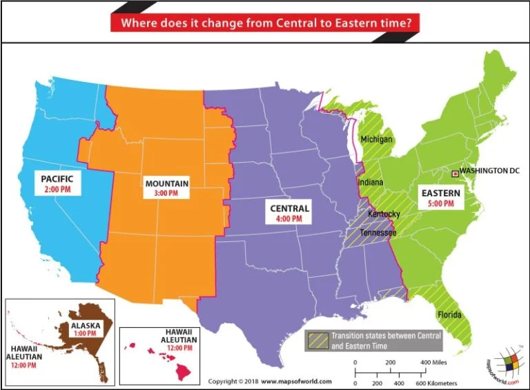
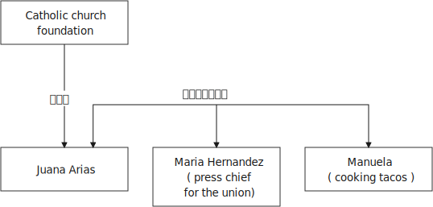

= step 3- Lesson 12
:toc: left
:toclevels: 3
:sectnums:
:stylesheet: ../../+ 000 eng选/美国高中历史教材 American History ： From Pre-Columbian to the New Millennium/myAdocCss.css

'''

== 苏联间谍问题

American reporter Nicholas Daniloff is in Frankfurt, West Germany, on his way home from Moscow after being detained 拘留；扣押 for a month on espionage 间谍活动 charges.  
[.my2]
被以间谍罪名拘留了一个月，现从莫斯科返回家乡。 +

President Reagan in Kansas City *on a campaign swing* (为竞选)四方游说 announced Daniloff's release, denying that *any trade had been agreed* to in order to win his freedom.  +

Asked by reporters if he blinked 眨眼睛 in *staring  盯着看；凝视；注视 down* 向下凝视; 盯得不敢对视 Soviet leader Gorbachev over the Daniloff affair, the President said they blinked.  +

[.my2]
当被记者问及，在丹尼洛夫事件上，在与苏联领导人戈尔巴乔夫对视时，是否避开了对方的眼神，里根总统表示，是他们避开了我的眼神。 +

[.my1]
====
.stare down
V to look at (a person or animal) fixedly until his gaze is turned away 死盯(某人或动物)直到其转移视线
====

The agreement to release Daniloff /*came* after a three-hour meeting last night in New York /*between* Secretary of State George Shultz *and* Soviet Foreign Minister Eduard Shevardnadze.  +

No details of the agreement have been released, and it is not known /if Daniloff's freedom *is the first step in a trade* /involving accused (a.) Soviet spy Gennadi Zakharov.  +

[.my2]
目前还没有公布协议的细节，也不清楚丹尼洛夫的获释, 是否是**与**"被指控的苏联间谍扎哈罗夫"**交易**的第一步。 +

When he arrived in Frankfurt, Daniloff #thanked# President Reagan, *Secretary of State* （美国）国务卿 Shultz, and other US officials #for# "*dotting (v.) all the i's and crossing (v.) the t's*"  （完成任务时）一丝不苟，注重细节 that permitted him to be in Frankfurt tonight.  +
当到达法兰克福时，丹尼洛夫向总统里根，国务卿舒尔茨，以及其他美国官员表示感谢，因他们的“细心安排”，自己今晚才能身在法兰克福。 +

[.my1]
====
.dot your ˌi's and cross your ˈt's
to pay attention to the small details when you are finishing a task （完成任务时）一丝不苟，注重细节 +
原句应为 Don't forget *to dot (v.) your i's* and *cross (v.) your t's*. 直译为：不要忘记在你的“i”上加点和在你的“t”上画横线。
====

'''

== 众议院推翻总统的提案

The House of Representatives *is expected /to vote* 反对；否定;行使否决权 soon /*to override* President Reagan's veto of a bill 后定 *imposing economic sanctions against* South Africa.

[.my2]
预计众议院将很快投票推翻里根总统否决的对南非实施经济制裁的议案。 +
众议院预计将很快推翻"里根总统对一项法案的投票否决"，实施对南非的经济制裁。 (负负得正)+

NPR's Cokie Roberts reports that /the President has promised /to expand economic sanctions *on his own* 独自地；独立地；凭自己力量,主动地 /*in hopes of* getting Congress to sustain 维持（生命、生存） his veto.  +

[.my2]
里根总统自己已经承诺，将扩大经济制裁范围，希望国会保留他的否决权。 +

"Both houses of Congress `谓` *passed (v.) the economic sanctions* against South Africa /*by wide enough margins* （获胜者在时间或票数上领先的）幅度，差额，差数 /*to override* (v.)a presidential veto.  +

[.my2]
国会参众两院以足够大的优势, 通过了对南非的经济制裁，从而推翻了总统的否决。+

And it's expected /the House *will easily garner* (v.)获得，得到，收集（信息、支持等） the two-thirds vote 选票；票  *necessary for override*.  So it's in the Senate *the President is concentrating his efforts*.  +

[.my2]
预计众议院将轻松获得推翻该法案所需的三分之二的投票。因此，在参议院，总统正在集中精力, 加紧努力。

[.my1]
====
.garner
--> 来自granary的拼写变体，词源同grain, 原指谷仓。后用做动词，指收集。
====

Today President Reagan sent a long letter to *majority leader* Robert Dole, *restating 重申；重新表述 his opposition （强烈的）反对，反抗，对抗 to* 'punitive 惩罚性的；刑罚的；处罚的 sanctions /that harm (v.) the victims of apartheid  种族隔离（前南非政府推行的政策）.'  +

[.my2]
今天，里根总统给多数党领袖罗伯特·多尔发了一封长信，重申他反对惩罚性制裁，伤害种族隔离制度的受害者。” +

The letter went on 继而 (做另一件事) *to outline (v.)概述；略述 an executive order* 后定  the President *plans (v.) to sign* /which would impose (v.) some *but* not all of the sanctions 后定 passed by Congress.  +

[.my2]
信中还概述了总统计划签署的一条行政命令，该命令将实施经济制裁，但一些尚未得到国会通过。 +

For example, *there'd be a ban* on some new investments in South Africa, but not all /and a ban on some imports from South Africa, but not *as many as* called for by Congress.

[.my2]
例如，将禁止在南非进行一些新的投资，但不是全部; 禁止从南非进口一些商品，但没有国会要求的那么多。 +

The President hopes *the executive order* will win over the fourteen additional senators he needs to sustain his veto.

[.my2]
总统希望行政命令能再赢得十四名参议员的支持，以维持他的否决决议。 +

The Chairman of the House *Foreign Affairs Committee* said today that /Congress would simply come back next year with tougher sanctions /if the veto is sustained.  +

[.my2]
众议院外交事务委员会主席今天说，如果否决持续下去，国会明年将再次进行更严厉的制裁。 +

I'm Cokie Roberts at the Capitol."

'''

== 美苏交换人质问题

American reporter Nicholas Daniloff was freed today in Moscow.  +

He flew into Frankfurt, West Germany this afternoon /and spoke with reporters gathered at the airport.  +

"It's wonderful to be back in the West.  +

I think *it's obvious to everybody* what has happened over this last month.

[.my2]
我想上个月发生了什么，大家都很清楚。 +

I was arrested without an arrest warrant 执行令；授权令.  +

A case was fabricated 编造；捏造 against me /*with a narrow political purpose* of giving the Soviet Union *some political leverage* over the case of Gennadi Zakharov in New York.  +

[.my2]
整件事情完全捏造，其目的就是为扎哈罗夫的纽约案件施加政治影响力，这就是苏联狭隘的政治目的。 +

The KGB did not punish me; the KGB punished itself.  +

I cannot tell you anything about any other arrangements.  +

*All I know is that* I am free in the West, very grateful, delighted to see you." Nicholas Daniloff.  +

When Daniloff left the Soviet Union today he had been detained there for thirty-one days, facing a possible trial （法院的）审讯，审理，审判 on espionage 间谍活动 charges.  +

Daniloff left Moscow /only hours after *Secretary of State* Shultz and Soviet *Foreign Minister* Shevardnadze met last night in New York /in the latest of *four negotiating sessions* 一场；一节；一段时间 concerning 关于；涉及 the fate of the American journalist.  +

[.my2]
国务卿舒尔茨, 和苏联外长谢瓦尔德纳泽, 昨晚在纽约会面，就美国记者的命运进行最后一轮谈判会议，会议一共进行四轮，而就在几个小时后, 丹尼洛夫离开了莫斯科。 +

But so far *no details have emerged* about the arrangements that brought Daniloff his freedom.  +

[.my2]
但到目前为止，关于此次丹尼洛夫获释的安排，还没有流出任何细节。 +

NPR's Mike Shuster has more from New York. 
[.my2]
更多内容请听NPR记者迈克·舒斯特，从纽约发来报道。 +

`主` Reporters in Moscow who had been *staking out* 监视 the American Embassy there `谓` **first got wind** this morning *that* Daniloff might be released, after he left the Embassy in a car and flashed （快速地）出示，显示 the "V for Victory" sign.  +

[.my2]
今天早上，在莫斯科监视美国大使馆的记者们首先得到消息，丹尼洛夫可能会被释放，此前他开车离开大使馆，并挥舞着“V代表胜利”的手势。 +

[.my1]
====
.flash
(v.)to show sth to sb quickly （快速地）出示，显示 +
=> *He flashed his pass* at the security officer. 他向保安员亮了一下通行证。 +
====

Apparently Daniloff was simply informed that he could leave, and his passport was returned to him.  +

He was then taken to the airport *along with his wife*, and soon thereafter 之后；此后 boarded (v.)上船（或火车、飞机、公共汽车等） a Lufthansa 德国汉莎航空公司 flight to Frankfurt, West Germany.  +

[.my1]
====
.Lufthansa

====

`主` The official American announcement (n.)（一项）公告，布告，通告 of his release /`谓` came from President Reagan *mid-day 中午 today* /as he was campaigning 从事运动,从事竞选活动 in Kansas City, Missouri.  +

[.my2]
总统中午宣布了丹尼洛夫获释的消息，当时他正在堪萨斯州参加竞选活动。 +

"I have *something of a news announcement* I would like to make, that *in case* you haven't heard it already, that at twelve o'clock, twelve o'clock *Central time*  中部时间（指西经90度的时间，是美国中部和加拿大的标准时间）, a Lufthansa Airliner, *left* Moscow bound  *for* Frankfurt West Germany, and on board are Mr. and Mrs.  +

[.my2]
“我有件事要宣布，如果你还没听说过的话，那就是十二点，中部时间十二点。”，一架汉莎航空公司航班，离开莫斯科，飞往西德法兰克福，机上搭载尼古拉斯·丹尼洛夫先生及其夫人。” +

[.my1]
====
.Central time +

====

Nicholas Daniloff." *So far* though 虽然；尽管；即使  *neither* the White House *nor* the State Department has said anything about *the specific agreements* that ended (v.) the negotiations on Daniloff.  +
到目前为止，关于丹尼洛夫一事谈判的具体协议，白宫和国务院均未有任何观点发表。 +

[.my1]
====
.So far though ...
这里的 "though" 在原句中的作用是引入对比或让步，表示**尽管**到目前为止还没有公开谈论具体的协议.
====

And lacking any fuller explanation from the government, many questions remain.  +

First, *what will happen to* the Russian scientist Gennadi Zakharov `主` whose arrest last month in New York for spying `谓` *led to* Daniloff's detention? *No date has been set* for Zakharov's trial in Brooklyn, and `主` *a representative of the Justice Department* in Brooklyn `谓` said today *the US attorney* there *was waiting for instructions* on the handling of Zakharov's case.  +
[.my2]
首先，俄罗斯科学家根纳季·扎哈罗夫的命运,  将如何走向？根纳季·扎哈罗夫上个月在纽约, 因间谍活动遭到逮捕，导致了丹尼洛夫扣押。扎哈罗夫在布鲁克林区的审判日期, 还没有确定，而布鲁克林区司法代表, 今天表示，美国律师正在等待对扎哈罗夫案件的处理指示。 +

*There have been suggestions that* Zakharov might be returned to the Soviet Union *at a later date* in exchange for one or more jailed Soviet dissidents.  +
[.my2]
有人建议，扎哈罗夫可能会在晚些时候被送回苏联，以换取一名或多名被监禁的苏联持不同政见者。 +

*There is also the question of* the American decision *to expel* (v.)把…开除（或除名） twenty-five Soviet personnel （组织或军队中的）全体人员，职员 *from* their United Nations Mission 使团；代表团；执行任务的地点 here.  +
[.my2]
这还涉及一个问题，即美国决定从他们的联合国特派团中, 驱逐二十五名苏联人员。 +

Several have already left New York /and the deadline for **the expulsion  驱逐；逐出 of the rest** is Wednesday.  +

The Soviets *have threatened to retaliate* (v.)报复；反击；复仇 if the order is not rescinded (v.)废除；取消；撤销.  +

*There is no word* 信息；消息 `主` whether the agreement that freed Daniloff `谓` includes anything on the twenty-five Soviets, which naturally leads to the final question: `主` Has Daniloff's release today `谓` *brought* the United States and the Soviet Union *any closer to a summit meeting*? Secretary Shultz has said that /a summit *could not take place* /without Daniloff *gaining his freedom*.  +

[.my2]
释放丹尼洛夫的协议, 是否提到了25名苏联人, 还不得而知，这自然引出了最后一个问题：
丹尼洛夫今日的释放, 会不会让美苏首脑会议更近一步？
国务卿舒尔茨说，如果丹尼洛夫未能获释，峰会绝无可能。 +

*That has now been removed* as an impediment 妨碍；阻碍；障碍 to a summit, but the Soviets `谓` have called *the Zakharov case* and the matter of the twenty-five Soviet diplomats  宾补 *obstacles (n.)障碍；阻碍；绊脚石 to a summit* as well.  +

[.my2]
这一障碍现在已经被移除，但苏联称, 扎哈罗夫案和25名苏联外交官的问题, 也是峰会的障碍。 +

[.my1]
====
.这句话中,  the matter of 后面是不是少了个谓语?
chatGpt:  +
确实在这个句子中，“the matter of” 后面似乎缺少一个谓语。如果加上合适的谓语，句子会更完整。一种可能的修正方式是： +
"but the Soviets have called the Zakharov case and the matter of the twenty-five Soviet diplomats *to be* obstacles to a summit as well."

在这里，加入 "to be" 可以使句子更流畅，表达清晰。修正后的句子意思是: 苏联方面认为扎哈罗夫案和二十五名苏联外交官的问题, 也是峰会的障碍。
====

Until the details *are made public* of the agreement 后定 Shultz and Shevardnadze *worked out*, *it will not be known* /what `主` the prospects 可能性；希望;前景 for a summit `系`  *truly are*.  +

[.my2]
在舒尔茨和谢瓦尔德纳泽达成的协议的细节, 公之于众之前，峰会的前景究竟如何, 还不得而知。 +

[.my1]
====
.Until *the details* are made public (*of* the agreement (Shultz and Shevardnadze *worked out*))

"the details are made public": 这是主句，表达一个动作或状态。在这里，"details" 是主语，"are made" 是谓语动词，表示"被公开"，即"细节被公开"。 +
"of the agreement *Shultz and Shevardnadze worked out*": 这是对 "details" 的限定，说明是哪个协议的细节。"Shultz and Shevardnadze worked out" 是一个定语从句，修饰 "agreement"，表示这个协议是由 Shultz 和 Shevardnadze 共同努力制定的。
====

This is Mike Shuster in New York.  +

'''

== 制衣女工创业

One year ago this month, a powerful earthquake in Mexico City killed more than nine thousand people.  +

Tens of thousands of people lost their jobs because of the massive damage.  +

Among those hardest hit by the quake were women garment （一件）衣服 workers, who worked in sweatshops 血汗工厂 concentrated in the heart of Mexico City.  +

One year after the earthquake, Lucie Conger reports that some of the forty thousand seamstresses 会缝纫的女人；女裁缝 who lost their jobs are changing their attitudes about work.  +

On the fifth floor of a small office building in the heart of downtown, some thirty garment workers are back at work.  
[.my2]
大约30名服装女工回到了工作岗位。 +

Just as before the earthquake /they're working on *an assembly 装配；组装；总成 line* 装配线.  +

Each woman is specialized in one operation, like sewing cuffs 袖口 or putting buttonholes on a fancy *cocktail 鸡尾酒,（常指掺合不太相容的）混合物 dress* （正式社交场合穿的）短裙.  +

[.my1]
====
.cocktail dress

====

But `主` there the similarities 相似之处 with their past work `谓` end. 
[.my2]
但与他们过去工作的相似之处, 也就到此为止了。(即她们的工作和之前有所不同) +

`主` The women here on Uruguay Street `谓` *are running their own cooperative* 合作企业；合作社组织 with machines *they got from their former employer* in a settlement （解决纷争的）协议 *when he closed his factory* which was damaged by the earthquake.  +

[.my2]
在乌拉圭大街上，有一些女工正开办着自己的合作社，而机器是从她们前雇主那里达成了协议获得的，因为前雇主的工厂因那次地震被迫关闭了。 +

About fifteen groups of women *have formed (v.)组织；建立;（使）成形，组成；制作 cooperatives*, *setting up shop* with equipment they received *instead of* an indemnification 赔偿；保护；赦免；补偿金 when factory owners *shut down* their former places of work.  +

[.my2]
开办合作社的约有15组女性群体，当她们前雇主的工厂关闭时，她们没有索要经济补偿，而选择了设备，利用这些设备，她们建起了自己的车间。 +

Running their own business *has meant big changes* for these women.  +

All thirty-five women in this cooperative *agree that* /they *prefer* working without a boss *looking over their shoulder* 对可能即将发生的（坏事）感到焦虑不安；严密监视.  +

[.my1]
====
.look over one's shoulder
对可能即将发生的（坏事）感到焦虑不安；严密监视 +
- He may have escaped the police for now, but *he'll be looking over his shoulder* for the rest of his life. 他可能暂时逃过了警察的追捕，但他余生都对可能发生的事感到焦虑不安。 +
- Major corporations are opposing the legislation, wary (a.)（对待人或事物时）小心的，谨慎的，留神的 of having the government *constantly looking over their shoulder*. 大公司都反对这项立法，担心政府会一直严密监视他们。 +
====

For Juana Arias, who used to cut patterns for dresses, `主` not having a boss `谓` *has given her the chance* to develop new skills.  +

[.my2]
胡安娜·阿里亚斯(Juana Arias)曾经为服装剪裁图案，没有了老板，现在她有了学习掌握新技能的机会。 +

"Well, sometimes it's my job to solve some problems. I decide when to buy things.  For example, when we *run out of* 用完,耗尽 thread 线 and needles, that's my job to decide on things that are needed."

At the same time, since they *set up the cooperative* five months ago, the women *have had the chance to realize that* `主` the old system of working for the patron 老主顾；顾客；常客 or boss man `谓` had its good points.  +

[.my2]
同时，自从五个月前成立了合作社以来，这位妇女就能认识到，为老主顾或老板工作的体制，也有其优点。 +

At the cooperative, the women only get paid when they complete a factory order.  +

Last Friday came and went 来了又去 without a pay-check.

[.my2]
上周五没发工资。 +

Their income is low now, because *they're assembling dresses* /instead of *earning more* by producing ready-made 预制的；已做好的；现成的 dresses of their own design.  +

[.my2]
他们现在的收入很低，因为他们在装配衣服，而没有自己设计成衣，而后者则能赚到更多的钱。 +

There are other concerns as well.

While the seamstresses 女裁缝 are *grateful (a.)感激的；表示感谢的 for* the loans and technical assistance 帮助；援助；支持 /that they're getting from a Catholic church foundation, they worry about *repaying 归还；偿还；清偿 the loans* /and keeping up with 跟上，紧跟 *operation expenses* 营业费用 like rent and phone bills.  +

[.my2]
尽管女工们对天主教堂基金会获得的贷款和技术援助, 表示感谢，但他们对偿还贷款，及房租电话费等运营费用, 表示担心。 +

And `主` *leaving behind 遗弃，抛弃 the tradition of* having a boss `系`  is a difficult transition for Mexican women *who are accustomed* from childhood *to responding 作出反应；响应 to* male authority figures.  +

[.my2]
摒弃老板监工的传统, 是墨西哥妇女的一个艰难转变，因为她们从童年时代起, 就已经习惯了接受男性权威的形象。 +

Paula Socer, a leader at another seamstresses' cooperative.   +

"They don't like us *to tell them what to do*.  Since we are all owners, they think that *we each can do what we want*."

Other garment workers are still working *under the patron* 赞助人，资助者;老主顾；顾客；常客.  +

But after the earthquake, many of the women *began to question (v.) their position at work* /when they saw some factory owners *moving #more# quickly* to salvage (v.)挽救；挽回 machinery （统称）机器 and cash boxes 钱箱；银箱 /*#than#* to rescue (v.) trapped workers.  +

[.my2]
但在地震之后，当她们看到一些厂主，挽救机器和现金的行动速度, 比营救被困工人更快时，许多妇女开始质疑她们在工作中的地位。 +

`主` Dramatic 突然的；巨大的；令人吃惊的 events like these `谓` *moved* some four thousand seamstresses /*to join* the September 19th Garment Worker's Union.  +

The women *blocked traffic* /and *marched to the presidential palace* /before *getting official recognition as* an independent union 后定 *not forced to affiliate (v.)使隶属，使并入（较大的团体、公司、组织） with* the ruling party.  +

[.my2]
女工们堵塞了交通，游行进行开到了总统府，最终官方正式认可工会独立，不必被迫隶属于执政党。 +

Through the union, *the seamstresses are demanding that* factory owners *respect (v.) the law* by *giving overtime pay for* extra work, allowing workers *to take vacation* 假期, and providing *standard benefits*.  +

[.my2]
通过工会，女工要求厂主尊重法律，支付加班费，允许职工休假，并提供标准福利。 +

So far, nine factory owners *have signed agreements with the union* to guarantee workers' rights.  +

But the union continues to face hurdles 难关；障碍.  +

Maria Hernandez worked in an illegal, clandestine 暗中从事的；保密的；秘密的 sweatshop before the earthquake .and is now *press chief* for the union.  +

[.my2]
地震前，玛丽娅·埃尔南德斯在一家非法的秘密血汗工厂工作，现任工会新闻主任。 +

"`主` The bosses and the soldout 背叛信念；背弃原则 unions `谓` *are always pressuring the women* who work here, threatening them, saying that they're going to *close down 停业；关闭；歇业；倒闭 the business*, but that *if they continue to organize*, one day *something is going to happen to their family*.  +

[.my2]
“老板和出卖型工会, 总是向在这里工作的妇女施压，威胁她们，说他们要停业，但如果他们继续组织（抗议活动），总有一天这会降临在他们自己家庭身上。 +

[.my1]
====
.soldout
谷歌上都搜不到这个词, 应该是 =sell ˈout (to sb/sth) +
sell-out :
a situation in which sb is not loyal to a person or group who trusted them, by not doing sth that they promised to do, or by doing sth that they promised not to do 违反诺言；违背原则
====

And then they start firing people 裁员.  +

They offer (v.) them money *to turn in 上交；呈交；提交;把…扭送（到警察局）；使自首 the ones* who are organizing, to tell them who the leaders are." +
他们用钱让她们供出组织者，让他们说出带头人。”

Manuela Purras is a seamstress *who was fired* in May *for* organizing the thirty-five women at the factory where she had worked for thirteen years.  +

Today *she's operating a small business* on the edge of *the empty paved 铺 (路) lot*  （作某种用途的）一块地，场地 where the union has its offices *in temporary quarters* 营房; 驻地 provided by *the municipal 市政的；地方政府的 government*.  +
今天，她经营着一个小型企业，在空地边，那里，工会用临时宿舍搭建了办公室，而这些宿舍是由市政府提供的。 +

[.my1]
====
.lot
an area of land used for a particular purpose （作某种用途的）一块地，场地 +
- a parking lot 停车场 +
- a vacant lot (= one available to be built on or used for sth) 一块空地 +

====

Here, alongside a busy thoroughfare 大街；大道；通衢, Manuela spends her days *cooking tacos* 墨西哥煎玉米粉卷（以肉、豆等作馅） and *selling them to passers-by* to make a living until she can go back to work.  +

[.my2]
在这里，在繁忙的大街两旁，曼纽埃拉每天制作玉米饼，卖给路人谋生，直到她可以回去工作。 +

[.my1]
====
.thoroughfare +
a public road or street used by traffic, especially a main road in a city or town 大街；大道；通衢 +
-> thorough,完全的，fare,行程，道路，词源同 farewell,走好，一路顺风。

.thoroughfare ,  avenue, steet  有什么区别?

- Thoroughfare（大道）： +
Thoroughfare 是一条宽阔的街道或道路，通常被大量车辆使用。 +
*这是一个更通用的术语，可以指任何允许车辆和行人通行的公共道路或通道。* +
Thoroughfare 通常用来描述连接不同区域的主要道路或主干道。 +

- Street（街道）： +
Street是城市、镇或村庄中的公共道路，通常两边有建筑物。 +
**Street 通常以"较窄的宽度"为特征，**可能包括住宅、商业或混合用途的属性。 +

- Avenue（大街）： +
Avenue *是一条宽阔的、带有绿化中央分隔带的街道。* +
**Avenue 通常与"更正式"或"更宏伟"的环境相关联，**通常在城市地区找到。它们可能被树木环绕，有时该术语**用于暗示声望或显赫的感觉。** +

.taco

====

The union is fighting /*to get* Manuela and her co-workers *reinstated* 使恢复原职；使重返岗位 in their jobs.  +

[.my2]
工会在努力抗争，让曼纽埃拉及同事们重新恢复工作。 +

Manuela Purras: "We've joined the union /mostly because we want to see improvements in our working conditions. I think that /it will help us. Well, economically it is helping us, and legally too, because at least *until now* /it's not one of those *soldout unions*." +

[.my2]
嗯，它在经济上帮助我们，法律上也是，因为至少到现在，它不是出卖型工会。 +

The garment workers still *have an uphill  漫长而艰难的，费力的（战斗、斗争、任务等） battle* to fight, *to secure a decent living* for themselves and their children.  +

In the year /since the earthquake, they've made important strides 大步；一步（的距离）;进展；进步；发展 /*in assuring that* they *get a fair shake* 公平的待遇.  +

[.my2]
地震后的一年里，他们在确保获得公平权益方面，取得了重要的进展。 +

University students, lawyers and feminists 女权主义者 have *joined* the seamstresses 女裁缝（复数） /*in* their fight (n.) *to set new terms* at the work place.  +

[.my2]
大学生，律师和女权主义者也加入了纺织女工的斗争，为了在工作场所设置新的保障条款。 +

The creation of new organizations, like cooperatives and unions, and `主` *the forging 锻造；制作;努力加强；稳步前进  of new alliances* 联盟 between educated elites and popular groups `谓` may be the most lasting legacy 遗产 *wrought (v.)使发生了，造成了（尤指变化） from the devastation* （尤指大面积的）毁灭，破坏，蹂躏 left by the earthquake.  +

[.my2]
建立新的组织，如合作社和工会，此外，受过教育的精英与大众群体之间的新联盟，可能是从地震造成的破坏中, 诞生的最持久的遗产。 +

[.my1]
====
.wrought
/rɔːt/ +
(v.)( used only in the past tense 仅用于过去时) ( formal literary) [ VN] caused sth to happen, especially a change 使发生了，造成了（尤指变化） +
HELP *Wrought is an old form of the past tense of work* . wrought是work过去式的旧式。 +
- This century *wrought (v.) major changes* in our society. 本世纪给我们的社会带来了重大变革。 +
- The storm *wrought (v.) havoc* in the south. 这场暴风雨在南方造成了巨大的灾害。 +
====

For National Public Radio, this is Lucie Conger in Mexico City.

'''
