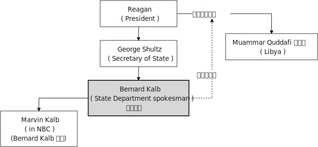
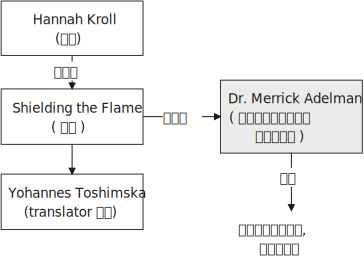

= Lesson 14
:toc: left
:toclevels: 3
:sectnums:

'''

== 简讯目录

https://www.kekenet.com/Article/201804/550807.shtml

State Department spokesman Bernard Kalb resigned 辞职；辞去（某职务） today because of the Reagan Administration's *alleged （未经证实而）声称的，所谓的 disinformation （尤指政府机构故意发布的）虚假信息，假消息 campaign* against Libya.  +
美国国务院发言人伯纳德·卡尔布今日辞职，原因是里根政府涉嫌对利比亚进行虚假情报活动。 +

The Washington Post *reported* last week *that* the administration planted false information about Libya *in an effort* to destabilize 使（制度、国家、政府等）动摇；使不安定；使不稳定 the government of Muammar Quddafi.  +

Kalb today *did not confirm or deny that* such a campaign took place, but he said `主` reports (n.) about it `谓` had damaged the credibility 可信性；可靠性 of the US.  +

The State Department （美国）国务院  would not comment on Kalb's resignation.  +

The State Department today criticized the Nicarguan 尼加拉瓜 government for allegedly 据说，据宣称 refusing to *grant* US officials *access to* Eugene Hasenfus.  +

He's the survivor of *Sunday's plane crash* inside Nicaragua.  +
他在周日尼加拉瓜飞机失事事故中, 得以幸存。 +

State Department spokesman Charles Redmond.  +

"Our representative 代表,代理人 was not received 接待; 迎接 by the Nicaraguan government.  +

And we view this with the utmost 最大的；极度的 seriousness 严重；认真；严肃.  +

The rendering 给予；提供；回报 of consular 领事的 services is *an essential part* of *the function* of an embassy.  +
领事服务, 是大使馆职能的重要组成部分。 +

.案例
====
.render
(v.)~ sth (to sb/sth) | ~ (sb) sth : ( formal ) to give sb sth, especially in return for sth or because it is expected 给予；提供；回报 +
=> to render a service to sb 给某人提供服务

====

The Sandinista government has once again taken action *to make that function difficult* /and *has raised the question of* whether, indeed, a US embassy *can function normally* within Nicaragua.  +
桑德里斯塔政府再次采取行动，使这项职能的行使变得困难，并提出了美国大使馆是否真的可以在尼卡罗伊岛正常运作的问题。 +

*We frankly  坦率地；直率地;（表示直言）老实说 cannot accept* the delay in *granting consular access* /since the Sandinista government has apparently *gone to some lengths* 竭尽全力；不遗余力 to parade 展览；展示;招摇过市；大摇大摆 Mr. Hasenfus *before the press*, and *considering the fact that* a government spokesman *stated (v.) clearly* last night on American television *that* access would be granted." +

.案例
====
.GO TO ANY, SOME, GREAT, ETC. ˈLENGTHS (TO DO STH)
to put a lot of effort into doing sth, especially when this seems extreme 竭尽全力；不遗余力 +
=> She *goes to extraordinary lengths* to keep her private life private. 她竭尽全力, 让自己的私生活不受干扰。 +

坦率地说，我们不能接受领事探视的延迟，因为桑地诺政府显然在媒体面前花了不少功夫让哈森福斯先生露面，考虑到政府发言人昨晚在美国电视上明确表示将允许领事探视。 +
====

Meanwhile President Reagan today denied that `主` *the downed 使倒下；击倒 plane* 后定 allegedly *carrying* arms *to* Contra 反对……；与……相反 rebels 反叛者 `谓` was operating *under official US orders*.  +
与此同时，里根总统今天否认, 被击落的飞机是在美国官方命令下为反对派运送武器的。  +

He also acknowledged 承认（属实） that the government *has been aware that* private American groups and citizens have been helping the anti-government forces in Nicaragua.  +
他还承认，政府已经意识到，美国的私人团体和公民一直在对尼加拉瓜的反政府武装提供帮助。 +

'''

== 白宫公共事务助理部长的辞职

Last week the Washington Post reported that top-level officials had approved a plan to generate real and illusionary 错觉的，幻影的 events *to make* Libya's Colonel 上校 Muammar Quddafi *think* the United States might once again attack.  +
《华盛顿邮报》上周报道称，高层官员已经批准了一项计划，通过制造真假事件，诱使利比亚穆阿迈尔·卡扎菲上校认为美国可能再次发动袭击。 +

Bernard Kalb's resignation is the first *in protest 抗议；抗议书（或行动）；反对 of* that policy.  +
伯纳德·卡尔布通过辞职, 率先对该政策提出抗议。 +

A similar resignation occurred at the White House in 1983 when a deputy 副手；副职；代理 quit (v.) *to protest (v.) misleading 误导的；引入歧途的 statements* given to the press /*shortly before* the American invasion of Grenada 拉丁美洲一岛国.  +
1983年，白宫也发生过类似的辞职事件，当时一名副手辞职，以抗议美国在入侵格林纳达前不久向媒体发表的误导性声明。 +

NPR's Bill Busenberg has more on today's announcement.  +

Bernard Kalb had been a veteran (n.)经验丰富的人；老手 *diplomatic  (a.)外交的；从事外交的 correspondent* 记者；通讯员 for CBS and NBC before *being picked* two years ago by Secretary of State George Shultz *to be* the Department's chief spokesman, officially 正式地；官方地；公开地;依据法规等 an Assistant Secretary 助理秘书 for Public Affairs.  +
伯纳德·卡尔布曾是CBS和NBC的资深外交记者，两年前被国务卿乔治·舒尔茨提拔为该部门的首席发言人，正式担任公共事务助理部长。 +

His brother, Marvin Kalb, is still with NBC.  +

Today, Bernard Kalb surprised *his former colleagues in the news media* by quitting *over the issue of* the administration's disinformaton program.  +
今天，伯纳德·卡尔布因政府发布虚假信息一事，辞去职务，此举令其以前的媒体同事们大为震惊。 +

Kalb would not confirm that there was such a program, but he said he faced a choice of remaining silent or *registering （正式地或公开地）发表意见，提出主张 his dissent* （与官方的）不同意见，异议.  +
卡尔布不会对计划的存在予以证实，但他说他面临着保持沉默还是提出异议的抉择。 +

.案例
====
.register
(v.)[ VN] ( formal ) to make your opinion known officially or publicly （正式地或公开地）发表意见，提出主张 +
=> China has registered a protest over foreign intervention. 中国对外国干涉正式提出了抗议。 +
====

And even though the issue appeared 显得；看来；似乎 to be fading from the news, Kalb *grappled with it privately* 私下地；秘密地 and decided he had to act.  +
即便这个问题会渐渐淡出新闻视野，但卡尔布仍会在私下进行跟踪，决定必须采取行动。 +

"The controversy （公开的）争论，辩论，论战 may vanish 不复存在；消亡；绝迹, but when you are sitting alone, it does not go away. And so *I've taken the step of* stepping down 退位."  +
“争论可能会平息，但是当你独自一人坐下，它却仍在耳畔，所以我已经辞职。” +

The State Department has reportedly *been involved in* the disinformation issue, but Kalb said *his guidelines have always been* not to lie or *mislead 误导；引入歧途；使误信 the press*, and *he has not done* so.  +
据报道，国务院对虚假信息一事也有参与，但卡尔布说，他的指导方针一直都不是谎言或误导媒体，他没有这样做。 +

Kalb *went out of his way* 特地，刻意,不怕麻烦地 today to praise Secretary Shultz, *a man*, he said, *of* *such* overwhelming 巨大的；压倒性的；无法抗拒的 integrity (n.)诚实正直 *that* he allows other people to have their own integrity.  +
今日，卡尔布对国务卿舒尔茨大加赞赏，他说，这是一位具有**如此**压倒性力量的正直男人，**以至于**他人也不由得因他正直了起来。  +

"In taking this action, *I want to emphasize that* I am not dissenting （对官方意见）不同意，持异议 from Secretary Shultz, a man of credibility 可信性；可靠性, *rather* I am dissenting from the reported disinformation program."  +
“在采取这一行动时，我想强调，我并没有对国务卿舒尔茨提出异议，他是一个有信誉的人，相反，让我提出异议的是报道中的虚假信息事件。” +

*Kalb's comments* suggested `主` Shultz `谓` perhaps did not *go along with* 赞同;遵从 the disinformation program, but in public, the Secretary of State has defended 防御,保卫;辩解,辩白 the administration's policies against Libya, saying in New York last week: "*I don't have any problems with* the little *psychological warfare* 战；作战；战争 against Quddafi."  +

卡尔布的评论暗示, 舒尔茨也许不赞同虚假信息计划，但在公开场合，国务卿为政府对利比亚的政策辩护，上周在纽约说:“我对针对卡扎菲的小小心理战没有任何问题。”  +

He also *quoted* Winstion Churchill *as saying*, "In time of war *truth is so precious*, *it must be attended 伴随发生;随同；陪同 by* a bodyguard of lies."  +
他还援引温斯顿·丘吉尔的话说：“在战争时期，真相如此珍贵，它必须有一个谎言作为保镖。” +

Shultz was asked about the disinformation effort 有组织的活动 last Sunday on ABC.  +
有人向舒尔茨问及，上周日ABC的虚假信息事件。 +

"I don't lie.  I've never *taken part in* any meeting 后定 in which *it was proposed (v.)提议；建议 that* we *go out* and *lie to the news media* for some effect.  +
“我不撒谎，我从来没有参加过任何"建议我们出去撒谎，并向媒体撒谎，以取得一些效果"的会议。 +

And if somebody did that, he was doing it against policy.  +

Now having said that, `主` *one of the results* of our action against Libya, from all the intelligence we've received, `系` *was* quite a period of disorientation 迷失方向；迷惑 *on the part of* Quddafi.  +
现在我们已经说过，根据我们收到的情报，我们对利比亚采取行动的其中一个结果是，这段时期是卡扎菲方面一段迷失的日子。 +

So, *to the extent* 到…程度；在…程度上 we can *keep* Quddafi *off balance* by one means 方法，手段 or another, including the possibility that we might make another attack, I think that's good."
所以，在某种程度上，我们可以通过这样或那样的手段, 让卡扎菲失去平衡，包括我们可能发动另一次袭击的可能性，我认为这是好的。”  +

In a sometimes emotional session 一场；一节；一段时间;（法庭的）开庭，开庭期；（议会等的）会议，会期 with reporters today, Bernard Kalb said that `主` *neither* he personally *nor* the nation *as a whole* `谓` can stand any policy of disinformation.  +
在今天与记者的见面会上，激动情绪时有发生，伯纳德·卡尔布说，他个人与整个国家都不能承受任何虚假信息的政策。 +

.案例
====
.In *a sometimes emotional session* with reporters today
chatGpt:  +
"In a sometimes emotional session" 的意思是在与记者的交流中，有时候会有情绪表达的时刻。"Sometimes" 表示并非整个会话过程都是情绪激动的，而是存在一些情感表达的瞬间。因此，Bernard Kalb 在与记者的交流中，*经历了情感高涨, 或在某些时刻表达情感的情况*。
====

"I'm concerned about *the impact* of any such program *on* the credibility of the United States.  Faith, faith in the word of America, is the *pulse 脉搏；脉率 beat* of our democracy. Anything that hurts America's credibility hurts America.  +

我担心任何此类计划会对美国公信力造成影响。诚信，蕴含在美国的信仰中，跳动在民主的脉搏里。任何伤害美国信誉的东西都会伤害美国。 +

*And then* on a much, much, much lower level, there's question of my own credibility 可信性；可靠性, *both* as a spokesman *and* a journalist, a spokesman for a couple of years, a journalist for more years than I want to remember.  +
然后在较低的层面上，还有个人信誉问题，无论是作为发言人还是记者，我作了这么多年的发言人，作记者的时间更长，长得我都想不清了。 +

In fact, *I sometimes privately thought of myself as* a journalist *masquerading 冒充;假扮；乔装；伪装 as* a spokesman.  +
事实上，我有时私下认为自己是伪装成发言人的记者。” +

In any case, I do not want my own credibility to be caught up 被卷入；陷入, to be subsumed 将…归入（或纳入） in this controversy." `主` The timing of Kalb's action today `系`  is likely to *add to* 使（数量）增加；使（规模）扩大 the controversy （公开的）争论，辩论，论战 over government deception 欺骗；蒙骗；诓骗.  +
无论如何，我不希望自己的信誉受到牵连，被卷入这场争论。人们对政府诈骗行为的争议, 或将因为卡尔布的行动时机, 而倍增。 +

.案例
====
.subsume
/səbˈsuːm/ +
[ VNadv./prep.] [ usually passive] ( formal ) to include sth in a particular group and not consider it separately 将…归入（或纳入） +
=> All these different ideas *can be subsumed under just two broad categories*. 所有这些不同的想法可归为两大类。

.be/get ˌcaught ˈup in sth
to become involved in sth, especially when you do not want to be 被卷入；陷入 +
=> Innocent passers-by *got caught up in the riots*. 无辜的过路人被卷入了那场暴乱。  +

.ADD TO STH
to increase sth in size, number, amount, etc. 使（数量）增加；使（规模）扩大 +
=> The bad weather *only added to our difficulties*. 恶劣的天气只是增加了我们的困难。 +
=> *The house has been added to* (= new rooms, etc. have been built on to it) from time to time. 这座房子一次又一次地在扩建。 +
====

And *it comes at an awkward moment* for the Reagan Administration, *just days before* an important pre-summit 峰会前的 meeting with the Soviets in Iceland /and *in the wake （船只航行时的）尾流，航迹 of* 随…之后而来；跟随在…后 official denials (n.) about a downed *guerrilla  游击队员 resupply (n.v.)向…再供给（所需物品）；（以另一形式）重新提供 plane* in Nicaragua.  +
这对里根政府来说是一个尴尬的时刻，就在与苏联在冰岛举行峰会前重要会议的几天前，在官方否认尼加拉瓜游击队补给飞机被击落之后。 +

.案例
====
.wake
(n.) the track that a boat or ship leaves behind on the surface of the water （船只航行时的）尾流，航迹

. in the wake （船只航行时的）尾流，航迹 of sb/sth
coming after or following sb/sth 随…之后而来；跟随在…后  +
=> There have been demonstrations on the streets *in the wake of* the recent bomb attack. 在近来的炸彈袭击之后，大街上随即出现了示威游行。  +
=> A group of reporters *followed in her wake*. 一群记者跟随在她的身后。  +
=> The storm left a trail of destruction *in its wake*. 暴风雨过处满目疮痍。
====

One American was captured and others were killed in that action, but officials have said the flight was *in no way* 一点也不;绝不 connected with the US government.  +
在那次行动中，一名美国人被俘，其他人被杀，但官员们表示，航班与美国政府没有任何关系。 +

Kalb said his resignation today *had nothing to do with* 与…无关 any other incident.  +
卡尔布说, 他今天的辞职与任何其他事件无关。 +

I'm Bill Busenberg in Washington.  +

'''

== 关于犹太人大屠杀的书

The history of Jews in Poland *is not always thoroughly  非常；极其；彻底；完全 told* in the country.  +
波兰犹太人的历史, 并不总是在这个国家被彻底讲述。 +

And the story of the World War II *freedom fighters* in *the Jewish 犹太人的 ghetto （相同种族或背景人的）聚居区；贫民区;（昔日城市中的）犹太人居住区  of Warsaw* is one of the saddest chapters.  +
二战期间华沙犹太区自由战士的故事, 是最悲伤的篇章之一。 +

The Nazis *took* hundreds of thousands of Jews *to their deaths*, and seven thousand more died *defending the area* when the Germans invaded.   +
纳粹杀害了数十万犹太人，德国入侵时，还有七千人为保卫该地区而牺牲。 +

Dr. Merrick Adelman is one of the very few who survived.  +
梅里克·阿德尔曼博士是极少数幸存者之一。 +

A book called *Shielding 保护某人或某物（免遭危险、伤害或不快）;给…加防护罩 the Flame* 火焰；火舌 is his story.  It was written in Poland *ten years age* by Hannah Kroll. It is now available in this country in English.  +
一本名为《屏蔽火焰》的书就是他的故事。这是汉娜·克罗尔十岁时在波兰写成的。现在该国家/地区有英文版。 +

.案例
====
.flame +
[ CU] *a hot bright stream of burning gas* that comes from sth that is on fire 火焰；火舌
====

Yohannes Toshimska is one of the translators. She says that `主` Merrick Adelman's view of *the ghetto （相同种族或背景人的）聚居区；贫民区 uprising* (n.)起义；暴动；造反 `谓` *is regarded as* unconventional.  +
约翰内斯·托希姆斯卡 (Yohannes Toshimska) 是其中一位译者。她说，梅里克·阿德尔曼对贫民窟起义的看法被认为是非传统的。 +

"He doesn't use the language or even he doesn't have the attitude *people usually have* to the holocaust （20世纪30年代和40年代纳粹对数百万犹太人的）大屠杀;（尤指战争或火灾引起的）大灾难，大毁灭 and to the ghetto （相同种族或背景人的）聚居区；贫民区 uprisings.  +
他不用那种词，甚至人们对于大屠杀，以及犹太区反抗斗争的通常态度，在他那里也难觅踪迹。 +

`主` One thing *he's consistently talking about* `系` is the fact that people thought was the arms in the ghetto. It wasn't heroic 英勇的；英雄的; it was easier than to die going to the train cars 火车车厢.   +
他一直谈论的是人们在犹太区的武装斗争。(他一直在谈论的一件事是，人们认为是贫民窟里的武器。) 这不算是英勇之举；它比坐着火车，前往死亡集中营要容易。 +

And `主` that people who *participated in* the ghetto uprising `系` were actually, in a sense, lucky.  +
在某种意义上，参加了犹太武装斗争的人们实则幸运。 +

They had arms; they could do something about *what was going on* 正在发生的事情 while `主` those hundreds of thousands *who were led to the train cars* `系` were equally heroic, but their death was much more difficult."  +
他们有武器；他们能有所作为，而那些被带上火车的数十万人同样英勇，然而死得更加艰难。 +

"Dr. Adelman was stationed 派驻；使驻扎 ...  he was working in a clinic; he was not a doctor then; but he was working in a clinic that was nearby the train station where the Jews were taken *to go* off  离开（某处）；（在时间或空间上）距，离 *to* the concentration camps." +
阿德尔曼医生驻扎下来。他在一个诊所工作；那时他还不是医生；但是他工作的诊所在火车站附近，犹太人从那里(离开off那里, 再去to)被带进集中营。  +

"Yes. He had an amazing position. He was standing at the gate to the Hmflat Platz, which was the place *from where* the Jews were taken into the train cars.  +
“是的，他的位置极佳。他在赫姆弗莱特广场的入口，从那里犹太人就被带上火车。 +

He was a member of the underground 秘密政治组织；（反政府）地下组织 in the ghetto, and he was choosing the people who were needed by the underground.  +
他是犹太地下党的一员，他为地下组织挑选需用之人。 +

They were perhaps one or two in many thousands of them *led* every day *to* the cars.  +
每天成千上万的人被带上火车，他们那一两个人或许就身在其中。 (他们可能是成千上万每天被带到车上的人中的一两个。) +

And he would pick these people up, and then young girls who were students at the nurses' school would disabilitate (查不到这个词,似乎应该为 disable ) these people.  +
他把这些人挑出来，然后那些在护士学校的年轻女孩, 就会将这些人弄残。 +

He describes in the book, it's a very powerful （对身心）有强烈作用的，效力大的 scene, how these girls, who were wearing beautiful clean white uniforms of nurse students, would take two pieces of wood and with these two pieces of wood would break legs of the people who were supposed to be saved for the Jewish underground.  +
他在书中描述到，这种场面十分骇人，那些女孩们都是学生，穿着漂亮洁白的护士服，拿着两块木头，用这两块木头打折犹太区地下组织需要拯救的人的腿。 +

But the Germans 德国人(复数), to the last moment, *wanted to maintain the fiction 虚构的事；假想之物;小说 that* `主` people who were taken to the trains `谓` were being taken for work.  +
但是德国人，直到最后一刻，都在维持这个谎言，谎称他们带人上火车是去劳动。 +

And obviously a person with a broken leg couldn't work. So breaking a leg *would temporarily save* that person *from* being taken into gas." +
显然，一个断腿的人是不能劳动的。所以断条腿暂时拯救了即将被带进毒气室的人。” +

"So he saw in all, I believe he says four hundred thousand people, *go aboard* 登上（船、飞机等） the train." "Yes. He stood there *from the very beginning of* the extermination 消灭；根绝  action *to the end*."  +
"所以他看见了一切". “我相信他说，他总共看到了40万人上了火车。”“是的，从一开始他就在那里，直到灭绝行动结束。” +

"*With regard to* 关于；就……而言；至于 what you were saying earlier, there's a dialogue *that develops  详尽阐述；阐明 in the book* between an American professor who comes to visit the doctor many years later, and is *critical (a.)批评的；批判性的；挑剔的 of* what happened.  +
关于你之前所说的，书中有一段对话是一位美国教授多年后去看医生，他对所发生的事情持批评态度。 +

.案例
====
.develop
[ VN] *to make* an idea, a story, etc. *clearer* by explaining it further 详尽阐述；阐明
SYN elaborate on +
=> *She develops the theme more fully* in her later books. 她在后来写的书中更详尽地阐明了这个主题。

.critical
(a.)~ (of sb/sth)expressing disapproval of sb/sth and saying what you think is bad about them 批评的；批判性的；挑剔的 +
=> a critical comment/report 批判性的评论╱报道 +
=> Tom's parents *were highly critical of* the school. 汤姆的父母对学校提出了强烈的批评。
====

He says of the Jews, 'You were *going* like sheep *to* your deaths.' The professor had been in World War II; he'd landed on a French beach, and he said that 'Men should run, men should shoot. You were going like sheep.' +
他对犹太人说:“面对死亡，你们就像待宰的羔羊。”这位教授曾参加过二战；他在法国的海滩上登陆，他说：“男人应该逃跑，男人应该开枪。而你们却像羊一样。”

And Adelman explains this, and let me quote him.  'It is a horrendous (a.)令人震惊的；骇人的 thing when one is going so quietly to one's death.  *It is infinitely  非常;极其；无限地 more difficult* than to go out shooting.  After all, it is much easier to die firing.  +
阿德尔曼解释了这一点，让我引用他的话。 “当一个人如此安静地走向死亡时，这是一件可怕的事情。这比走出去抗争(用枪战斗)要困难无数倍。毕竟，在战场上被枪打死要容易得多。 +

For us, it was much easier to die *than* it was for someone who first boarded a train car, then rode （ride 的过去式） the train, then dug a hole, then undressed naked.'  +
对我们而言，被枪打死比登上火车，坐上火车，然后挖坑，最后脱光衣服的人死得要容易地多。 +

That's difficult to understand, but then Hannah Kroll says that *she understands it* because *it's easier for people* who are watching this *to understand*, when the people are dying shooting." +
这很难理解，但汉娜·克罗尔说她理解这一点，因为当人们亲眼目睹这一切的时候，一切显而易见。 +

"It is something *probably easier to comprehend* because `主` the kind of death *most of the people* from the ghetto *encountered* (v.) `系` is just beyond comprehension."  +
“理解这点可能更加容易，因为犹太区里大多数人所遭遇的那种死法, 让人们难以理解。” +

"Explain *the context （事情发生的）背景，环境，来龙去脉; 上下文；语境 of the title* for Shielding the Flame ; it *comes up* 被提及; 被讨论;出现 a bit *later on*  后来；以后；其后；随后. It *has to do with* 与……有关；与……有联系 the reason that Dr. Adelman becomes a physician, a cardiologist 心脏病医生；心脏病学家, after the War, is that *he wants this opportunity* to deal with people who are in a life-or-death 生死攸关的 situation."   +
请解释《屏蔽火焰》片名的背景;它稍后会出现。这与阿德尔曼医生在战后成为一名内科医生和心脏病专家的原因有关，他希望有机会, 与处于生死关头的人打交道。 +

.案例
====
.later ˈon
( informal ) at a time in the future; after the time you are talking about 后来；以后；其后；随后 +
=> I'm going out *later on*. 我过一会儿要外出。
====

"He says `主` *at some point* that ① *what he was doing* at Hmflat Platz and ② what he was doing *later on* as a doctor `系` is like *to shield (v.) the flame from God* who wants to blow this little tiny flame and kill the person, that `主` *what he was doing* during the War and after the War `谓` *was*, in a way, doing God's work or doing something against God, even if the God existed."  +
他说，在某种程度上，他在赫弗莱特广场所做的，以及他后来作为一名医生所做的，就像保护火焰不受上帝的伤害，上帝想要吹起这小小的火焰，杀死那个人，他在战争期间和战后所做的，在某种程度上，是在做上帝的工作，或者是在做反对上帝的事情，即使上帝存在。 +

"Do you think this book *is going to be accessible to* the Western reader *reading it in English*? It is a bit free *in form* and *in style*.  It lacks a chronology 按事件发生的年代排列的顺序；年表; certain details are not there /or *are pre-supposed (v.)预先假定，假设；以……为前提 that* one knows." +
你认为这本书会有西方读者吗? 它在形式和风格上都有些随意。它缺少年代顺序；某些细节不详, 或会假定读者已经知道。 +

"This book *is a little bit like* a conversation of two people *who aren't that much aware of the fact that* someone else is listening to it.  And *they don't care about* this other person who might be listening to it.  They don't help this person to follow it.  +
这本书有点像两个人的对话，他们不太在意听者。他们也不关心潜在的听众。语言晦涩难懂。 +

*I had a hard time* even when I read it *for the first time* in Polish.  However, for me, it has *magnetic 像磁铁的；有磁性的;富有吸引力的；有魅力的 power* and, despite the confusion, I always wanted to go back and to go on." +
甚至，当我第一次阅读这本书的波兰版本时，我很难过。然而，对我来说，它有磁力，尽管困惑，我总想回去继续阅读。” +

Yahannes Tashimska, the translator, *along with* Lawrence Weshler, of *Shielding the Flame* by Hannah Kroll. +
Shielding the Flam，作者 : Hannah Kroll ；译者 :Yahannes Tashimska 和 Lawrence Weshler。 +

'''

