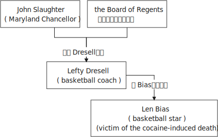
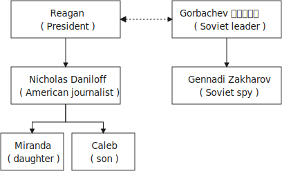
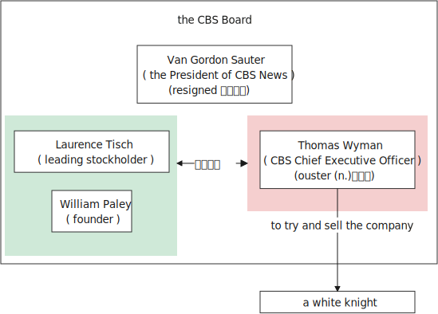

= Lesson 15
:toc: left
:toclevels: 3
:sectnums:

'''

American reporter Nicholas Daniloff arrived back in the United States today, and `主` accused  Soviet spy, Gennadi Zakharov, `谓` left for the Soviet Union.  +
美国记者尼古拉斯·丹尼洛夫今日回到美国，受到指控的苏联间谍杰纳迪·扎哈罗夫返回苏联。 +

.案例
====
注意: 这里的 accused 似乎不能当做谓语动词来理解, 而应该当做adj. , 因为 如果当做动词的话, 应该是 accuse  sb (of sth) 的说法, 而上文中没有 of 存在.
====

Administration officials insisted that *there is no connection between the two* as they announce plans (n.) for a meeting in Iceland, October 11th and 12th, between President Reagan and Soviet leader Gorbachev.  +
政府官员坚称，宣布里根总统及苏联领导人戈尔巴乔夫10月11日及12日冰岛会晤的计划, 与此事无关。

We have two reports on today's developments （新的）发展事态，进展情况，发展阶段.  +
今天我们将带来两篇报道。

First, NPR's Jim Angle *at the White House*.  +
首先，NPR记者吉姆·盎格鲁，白宫报道。

"`主` The preparatory 预备的；筹备的 meeting in Iceland `谓` was proposed 提议；建议 by Secretary Gorbachev in a letter to President Reagan September 19.  +
在冰岛举行筹备会议, 是戈尔巴乔夫国务卿在9月19日致里根总统的信中提议的。 +

.案例
====
.preparatory
(a.)( formal ) done in order to prepare for sth 预备的；筹备的 +
=> preparatory meetings 预备会议 +
=> Security checks had been carried out *preparatory (a.) to* (= to prepare for) the President's visit. 为迎接总统来访，当局已预先进行了安全检查。 +
====

Secretary Shultz said, today, the meeting will *give* the two leaders *an opportunity* to give a special push to *preparations (n.) for a full-fledged 成熟的；完全合格的;有充分资格的；羽毛生齐的;全面发展的 summit* later this year in the United States.  +
舒尔茨国务卿表示，今天的会议将为两国领导人提供一个机会，特别推动今年晚些时候举行的正式峰会的准备工作。

.案例
====
.fledge
(v.)to feed and care for (a young bird) until it is able to fly 养(小鸟)到能飞
====

President Reagan *made clear* his agreement to the meeting *came after an agreement* between the two nations *on* how to resolve the Daniloff affair.  +
里根总统明确表示，在两国就如何解决达尼洛夫事件达成一致之后，他同意举行这次会议。 +

'The release of Daniloff *made the meeting possible*.  I could not have accepted and *held 召开；举行；进行 that meeting* if he was still being held.' +
释放丹尼洛夫，才有可能召开会议。如果他仍处关押，接受并召开这个会议绝无可能。 +

But the President and others *insisted that* Daniloff's release without trial *had no connection with* Gennadi Zakharov, the accused Soviet spy who was allowed to plead (v.) （向法庭）陈述案情;（在法庭）申辩，认罪，辩护 *no contest （控制权或权力的）争夺，竞争;争辩；就…提出异议 to espionage charges* today and *ordered (v.) out of the country*.  +
但是总统及其他人都坚称，丹尼洛夫未经审判就得释放，与杰纳迪·扎哈罗夫一事无关，今天受到指控的苏联间谍获准不以间谍罪起诉，并被驱逐出境。

.案例
====
.plead
- (v.) to state in court that you are guilty or not guilty of a crime （在法庭）申辩，认罪，辩护 +
[ V-ADJ] +
=> to plead guilty/not guilty 认罪；不认罪 +
=> He advised his client *to plead insanity* (= say that he/she was mentally ill and therefore not responsible for his/her actions) . 他建议他的当事人以精神不正常作为辩护理由。 +

- [ VN] to present a case to a court （向法庭）陈述案情 +
=> They hired a top lawyer *to plead their case*. 他们聘请了一位最好的律师帮他们陈述案情。
====

Secretary Shultz *tied* Zakharov's departure *to* the Soviet agreement to release human rights' activist, Yuri Orlov, and allow him and his wife to emigrate (v.)移居国外；移民.  +
国务卿舒尔茨, 将扎哈罗夫的释放, 与"苏联同意释放人权活动家尤里·奥洛夫，并允许他及妻子移居国外"联系在一起。 +

I'm Jim Angle, at the White House."

The Vatican  梵蒂冈（罗马天主教教廷） today *denounced* (v.)谴责；指责；斥责 all homosexual activity *as* morally evil /and said homosexuals *should be taught that* their sexual practices are unacceptable to the Catholic church.  +
今天，梵蒂冈谴责所有同性恋活动有违道德，并称同性恋者应该被告知，他们的性行为，天主教无法容忍。 +

The document was relayed 转送，转发（信息、消息等） to Catholic bishops and *restates the church's position that* homosexual tendencies *are not sinful* but activity is.  +
该文件转达给了所有天主教主教，文件重申了教会立场，称同性恋倾向不是罪孽，但同性恋行为则是。

This is NPR in Washington.

'''

== 马里兰州篮球总教练 辞职

University of Maryland *basketball coach* （体育运动的）教练 Lefty Dresell resigned today, another victim of *the cocaine-induced 引起 death* of basketball star Len Bias.  +
马里兰大学篮球教练莱夫蒂·德雷塞尔, 今天辞职，他是"篮球明星莱恩·拜亚斯因可卡因致死案"的另一名受害者。 +

Paul Guggenheimer reports.  +

"Dresell's resignation *came as no surprise* 不出所料 today.  +
今天德雷塞尔的辞职在人意料之中。 +

In recent weeks, advisors to Maryland Chancellor (用于英国某些高级政府官员的头衔) John Slaughter and some members of *the Board of Regents* 摄政者；摄政王;州立大学董事会董事 were pushing for Dresell's removal  免职；解职.  +
最近几周，马里兰大学校长约翰·斯劳特(John Slaughter)的顾问, 和校董会的一些成员, 都在推动德雷塞尔下台。 +

This morning, at Maryland's Cole Field House, Dresell *made it official*.  +
今天早上，在马里兰州的Cole Field House，德雷塞尔正式宣布辞职。 +

'I want to announce that *I am stepping down 退位 as the* head basketball coach at Maryland.  I will remain at Maryland *in the position of* Assistant Athletic 运动的; 运动员的 Director.  +
我想宣布，我将辞去马里兰州篮球总教练一职。我将继续留在马里兰大学，担任体育总监助理。 +

The University has agreed *to honor (v.)信守，执行（承诺） the financial terms* of my contract, which has 8 years remaining.'  +
这所大学已经同意履行我合同内的财政条款，任期还有8年。 +

Dresell *coached (v.)（对体育运动、工作或技能进行）训练，培养，指导 basketball* at Maryland for 17 years, but following Bias's death, Dresell *told* a Grand Jury *that* he ordered an assistant *to remove evidence of* drug use *from* Bias's room, and `主` subsequent revelations (n.)被暴露的真相；被曝光的秘闻 后定that *his players were having academic 学业的，教学的，学术的（尤指与学校教育有关） problems* `谓` proved to be Dresell's undoing 失败的原因.  +

德雷塞尔在马里兰州执教篮球已有17年，但拜厄斯死后，德雷塞尔告诉大陪审团，他让一名助手到拜厄斯房间取走了药物使用的证据，随后发现球员的成绩不理想，实为雷德赛尔管教不严。 +
(但在拜厄斯去世后，德雷塞尔向大陪审团表示他曾命令一名助手, 清理拜厄斯房间内的药物使用证据。而随后曝光的他的球员学业问题, 证明成为德雷塞尔的噩运。) +

For National Public Radio, I'm Paul Guggenheimer in Washington."

'''

== 美苏谈判后, 美国记者被苏联释放

American journalist, Nicholas Daniloff, returned to the United Stated today, a free man.  +

*He walked off a plane* at Dulles Airport outside Washington *late this afternoon* after a month's detention in the Soviet Union.  +
在苏联被拘留一个月后，他于今天下午晚些时候, 在华盛顿郊外的杜勒斯机场走下飞机。 +

Daniloff *had these words* for members of his family and journalists at the airport: "There is always a silver lining  衬层；内衬；衬里;（身体器官内壁的）膜 in every cloud. In Russian, Nyet Kuda bisdabra.   +
达尼洛夫在机场对他的家人和记者说：“每片乌云中总有一线希望。俄语的意思是 Nyet Kuda bisdabra。

And I believe that the cloud *that hung over Soviet-American affairs* is dissipating （使）消散，消失；驱散.  I understand that the President *is going to meet with* Mr.  Gorbachev shortly 不多时；不久 in Iceland, and this to me, is a wonderful thing.  +
我相信笼罩在苏美事务上的乌云正在消散。我我知道总统不久将在冰岛会见戈尔巴乔夫先生，这对我来说是一件美妙的事情。 +

In my case, `主` the investigation into the charges against me `谓` was concluded.
There was no trial, and I left as an ordinary, free American citizen.  +
就我而言，对我的指控的调查已经结束。没有进行审判，我作为一名普通、自由的美国公民。  +

In Zakharov's case, there was a trial, and he received a sentence 判决；宣判；判刑.  I'm sorry I don't remember *the exact terms 词语；术语；措辞 of the sentence*, and he left.  I do not believe that these two things are *in any way* equivalent."  +
扎哈罗夫的案件经过审判，他被判刑。抱歉，我不记得这句话的具体内容了，然后他就离开了。我不认为这两件事是等同的。”

NPR's Richard Gonzalez is at Dulles Airport now.  +

"Richard, what was the mood of Daniloff and his family when he arrived?"  +
“理查德，到达时丹尼洛夫和他的家人的心情如何？”

"Well, the Daniloffs enjoyed a rather emotional reunion here at Dulles Airport. Daniloff was cheerfully 高兴地 greeted 和（某人）打招呼（或问好）；欢迎；迎接 by his daughter Miranda and his son, Caleb. They celebrated his arrival with a bottle of champagne.  And they bought a dozen of yellow roses for their father.  +
丹尼洛夫夫妇在杜勒斯机场欢聚一堂。丹尼洛夫受到女儿米兰达和儿子凯莱布的热烈欢迎。他们用一瓶香槟酒庆祝他的到来。他们给爸爸买了一打黄玫瑰。 +

Caleb presented  把…交给；颁发；授予 his father with a T-shirt that had been printed to say "Free Nick Daniloff" and now had been amended to say "Freed (v.)解放，使自由(free的过去式和过去分词) Nick Daniloff", which Daniloff *displayed* with obvious relish (n.)享受；乐趣 *to* the cameramen and photographers who were gathered there." +
凯莱布向父亲展示了之前印有“释放尼克·丹尼洛夫”字样的T恤，而现在已经改成“释放了的尼克·丹尼洛夫”，
而丹尼洛夫也向周围的摄影记者们, 展示了这件有着明显特殊意味的衣服。 +

"What seemed *most on Daniloff's mind* when he spoke with reporters today?" "Well, as you heard him say, Daniloff seemed very, very believed that `主` his own personal honor and integrity  诚实正直 as a journalist `谓` had been preserved in the negotiations that had freed him.  +
“丹尼洛夫今天接受记者采访时，内心最关注什么？”
“正如你们所听到的，丹尼洛夫看起来非常，非常坚信自己作为一名记者所具备的个人荣誉以及正直品质在谈判中得以保存，这场谈判最终促成了他的释放。 +

And *he repeated once or twice that*  he felt that he had not been traded for Zakharov as a spy." +
他一再强调，自己不是间谍扎哈洛夫获释交易的筹码。”

"*Is there any chance* `主` Daniloff who is completing a second tour as a journalist in Moscow `谓` will return to the Soviet Union?"  +
"Well, Daniloff told us that he left the Soviet Union with his passport and just as importantly with his multiple-entry 多次入境 visa, 'which is still valid,' he said.  +
“正在莫斯科完成第二次记者之旅的达尼洛夫有没有可能返回苏联？” “好吧。丹尼洛夫告诉我们，他带着护照离开了苏联，同样重要的是，他带着多次入境签证离开了苏联，“签证仍然有效”，他说。 +

And he ended his *news conference* by telling reporters that /yesterday in Moscow, feeling that he might be leaving the Soviet Union soon, he had *placed* new flowers *on* the grave of his great grandfather 曾祖父 who was buried in Moscow.  +
他在新闻发布会结束时告诉记者，昨天在莫斯科，他感觉自己可能很快就会离开苏联，在埋葬在莫斯科的曾祖父的坟墓上, 献上了新花。 +

And he said, 'I'm hopeful that I'll be able to do that again, some time.'" "But who knows what will happen? What else can you tell us about what the scene looked like there?"  +
他说，‘我希望有一天我能再次做到这一点。’” “但是谁知道会发生什么？你还能告诉我们那里的场景吗？”

"Well, I can tell you that there were throngs  聚集的人群；一大群人 of reporters here too, some of whom wanted to greet  和（某人）打招呼（或问好）；欢迎；迎接 Mr. Daniloff with applause, and that *it took a while* for Daniloff *to get their attention* so that he could tell them what they wanted to hear.  +
“嗯，我可以告诉你，这里也有一大群记者，其中一些人想用掌声欢迎丹尼洛夫先生，丹尼洛夫花了一段时间才引起他们的注意，这样他就可以告诉他们他们想听的话了。 +

I think that *the most obvious thing is that* he had a lot of friends here, among the press corps （从事某工作或活动的）一群人，一组人, that were very happy to see him, and I think that he really … he had a sparkle 闪烁（或闪耀）的光 in his eye that said, 'Well, I'm finally home.'" "So he seemed a lot more rested (a.)休息后精力恢复（或精神振作）的 perhaps than in Frankfurt?" "Rested, relieved (a.)感到宽慰的；放心的；显得开心的, and I'd have to say well scrubbed 擦洗；刷洗." "(Laugh).  +

我认为最明显的事情是，他在这里有很多朋友，在记者团中，他们很高兴见到他，我认为他真的……他的眼睛里闪烁着光芒，说，‘好吧，我终于到家了。’” “所以他看起来可能比在法兰克福休息多了？” “休息了，松了口气，而且我不得不说擦洗得很好。” “（笑）。  +

(我想最显而易见的事情莫过于他朋友众多，包括来自新闻界的，见到他全都喜出望外，
而且我想他真的，他的眼中闪着泪花，仿佛在说：“我终于回家了。”
“所以看起来他比在法兰克福的时候轻松多了？”
“放松，完全没有负担，简直可以说是焕然新生。”) +

NPR's Richard Gonzalez talking with us from Dulles Airport."

'''

== CBS 董事会成员之争

Today, Van Gordon Sauter, the President of CBS News resigned 辞职；辞去（某职务） from his job.  +

`主` This resignation, *the latest move* in a CBS shake-up (n.)（机构的）重大调整，重组, which yesterday `谓` *brought the ouster 罢免；废黜；革职 of* CBS Chief Executive Officer Thomas Wyman.  +

He was replaced by Laurence Tisch, the company's leading stockholder.  +

今日，CBS总裁Van Gordon Sauter辞职。
Van Gordon Sauter的辞职，是CBS改革的最新举措，此举在昨日导致了CBS首席执行官托马斯·怀曼的下台。
CBS主要股东劳伦斯·蒂施接替了他的职务。 +

Also, yesterday, the 82-year-old founder （组织、机构等的）创建者，创办者，发起人 of CBS, William Paley, came out of 由…产生（或形成） retirement to become the company's Chairman.  +
退休的威廉·佩利(William Paley)复出，再次成为该公司的董事长。 +

Writer Ken Aleter says the CBS Board probably *put the changes into motion* even before the Board meeting yesterday.  +
作家肯·阿莱特（Ken Aleter）表示，哥伦比亚广播公司董事会, 可能会昨天甚至在董事会会议之前, 就将这些变化付诸实施。 +

"There was a regularly scheduled (a.) Board dinner, an informal dinner the night before, *which is normal* for a monthly Board meeting.  +
董事会定期举行晚宴，前一天晚上举行非正式晚宴，这对于每月一次的董事会会议来说是正常的。 +

And Wyman cancelled it, feeling that the Board was so polarized (v.)使两级分化; 两级分化 in the battle between Laurence Tisch and Paley *on one side*, and Thomas Wyman and some of the Board members who are supporters of his *on the other*.  +
怀曼取消了它，因为他觉得董事会在劳伦斯·蒂施和佩利之间的斗争中两极分化，一方面是托马斯·怀曼和他的支持者托马斯·怀曼和一些董事会成员。 +

But the Board decided to meet (v.) anyway without Tisch or Paley or Wyman, and they apparently met (v.) till quite late, which would be Tuesday night.  +
但董事会还是决定, 在没有蒂施、佩利或怀曼的情况下召开会议，而且他们显然开会到很晚，也就是周二晚上。 +

Then at the meeting yesterday, Mr. Wyman *presented a budget* as planned, and apparently, the Board unanimously 全体意见一致地,无异议地 *was dissatisfied with* that budget presentation.  +
然后在昨天的会议上， 怀曼按计划提交了一份预算，显然，董事会一致对该预算提交不满意。 +

And then *it was learned that*, in fact, there had been, at least I'm informed, that there were overtures （歌剧或芭蕾舞的）序曲，前奏曲;友好姿态；建议 made by Wyman and by others aligned with him *to try and sell the company*, try and find a white knight to *stave off* 暂时挡住（坏事）；延缓，推迟（某事物） Laurence Tisch and Bill Paley." +
后来人们了解到，事实上，至少我是被告知，怀曼和其他与他结盟的人, 曾提出过试图出售公司的提议，试图找到一位白衣骑士来阻止劳伦斯·蒂施和比尔·佩利。 +

.案例
====
.overture
(n.) [ usually pl.] ~ (to sb) : a suggestion or an action by *which sb tries to make friends, start a business relationship, have discussions, etc.* with sb else 友好姿态；建议 +
=> *He began making overtures to* a number of merchant banks. 他开始主动同一些投资银行接触。
====

"Last minute scrambling  争抢；抢占；争夺; 扰乱（思维） by Wyman?" "Yes, and in the end, the Board asked Tisch and Paley to leave, and then they asked Wyman to leave.  +
“怀曼在最后一刻扰乱？” “是的，最后，董事会要求蒂施和佩利离开，然后他们又要求怀曼离开。 +

So the 3 principal (a.)最重要的；主要的 actors in this drama were out of the room when the Board discussed it, and I'm told, *unanimously 一致同意 reached the judgment* that it was time for a change. "  +
因此，当董事会进行讨论时，这部剧的三位主要演员都离开了房间，据我所知，一致认为是时候做出改变了。 ”  +

"So *it's not really fair to say that* Laurence Tisch came rolling into that meeting and just took it over." +
 所以说是"劳伦斯·蒂施参加了那次会议, 并接管了会议"，这样说是不太公平的。 +

"Well, apparently the Board *took it over* 接收，接管（企业、公司等，尤指通过购买股份）.  What happened was, *as of* 从……开始，截至…… late last week, this Board was ready to support Tom Wyman.  +
Something happened in the last several days to turn this Board around.  +
嗯，显然是董事会接管了会议。截至上周晚些时候，董事会已准备好支持汤姆·怀曼。过去几天发生的一些事情扭转了董事会的局面。 +

And *I think*, in part, *that* something that happened was *a growing sense of dissatisfaction* with Wyman.  +
我认为，部分原因是人们对怀曼的不满情绪日益强烈。 +

And I suspect also, a sense *that the Board probably had* that `主` the continued blood-letting 血拼; 流血事件; 尤指敌对军队双方的暴力或杀戮; (同一个组织内部两队人马之间发生的)互不相让的激烈争吵 in the press, `谓` would only continue if Wyman remained the helm 舵柄；舵轮, and they had to stop it."  +
我也怀疑，董事会可能有这样一种感觉，如果怀曼继续掌舵，媒体中持续的内斗流血事件只会继续，他们必须阻止它。 +

"Yeah.  Let me *ask* you *for* a very simplistic （把问题、局面等）过分简单化的 answer to a complicated question here. CBS *got into this sort of trouble* because of problems *endemic (a.)地方性的；（某地或某集体中）特有的，流行的，难摆脱的 to* the television industry now, or because of mismanagement of CBS?"  +
是的。让我在这里向您询问一个复杂问题的非常简单的答案。哥伦比亚广播公司陷入这样的麻烦, 是因为现在电视行业普遍存在的问题，还是因为哥伦比亚广播公司管理不善？ +

"Both. Clearly, *same thing is happening* in all the networks.  They're facing a future, at least the immediate 立即的；立刻的 future, where *revenues no longer grow* (v.) at the same rate they used to, which is 10, 12, 14 percent a year.  +
两者都有。显然，所有网络都在发生同样的事情。他们面临着一个未来，至少是在不久的将来，收入不再以以前的速度增长，即每年 10%、12%、14%。 +

Revenues are declining at all three networks.  +
Advertisers are finding other outlets for their money, more efficient outlets, cheaper outlets for their money.  +
There's new competition from the 4th network, from technology, from cable.  +
所有三个网络的收入都在下降。 广告商正在寻找其他的渠道，更高效的渠道，更便宜的渠道。来自第四网络、技术和有线电视的新竞争。 +

Second, there was a feeling that, `主` Wyman, though *he was a good manager* on paper and *had a good strong managerial (a.)经理的；管理的 background*, `系` was not a people manager.  +
其次，人们有一种感觉，尽管怀曼在纸面上是一位优秀的经理，并且拥有良好的强大管理背景，但他并不是一位职能经理。 +

Television is populated (v.)居住于；生活于；构成…的人口 by a lot of famous people, who have rather large egos 自我价值感.  They're also rather large talents.  But in any case, those egos require (v.) some stroking 轻抚，抚摩（动物的毛皮）;待（某人）非常好；（尤指）顺着（某人）以便为自己办事.  +
电视上充斥着许多自负的名人。他们也是相当大的人才。但无论如何，这些自负需要一些抚慰。 +

Tom Wyman was not was not a stroker 安抚者；抚摩者.  He was a go-by-the-book 按照规定或标准行事，不偏离规定或标准 kind of manager.  +
汤姆·怀曼不是一名击球手。他是一位循规蹈矩的经理。 +

So he was a stranger, for instance, to the most important division of CBS, not the division that produces the most money, but the one that produces the most prestige 威信；声望；威望, and that's the news division. " +
例如，他对哥伦比亚广播公司最重要的部门很陌生，不是产生最多金钱的部门，而是产生最大声望的部门，那就是新闻部门。 +

"The CBS News people, as you mention, have been disenchanted (v.)使失望; 使幻想破灭 of late, and they're probably encouraged by this move, but specifically, what were they fussing （为小事）烦恼，忧虑; 瞎忙一气；过分关心（枝节小事） about? How have they been mismanaged? Can anyone say?"  +
正如你提到的，哥伦比亚广播公司新闻部的人最近已经不再抱有幻想了，他们可能会受到这一举动的鼓舞，但具体来说，他们在烦恼什么？他们是如何管理不善的？谁能告诉我？ +

"Well, I think there are probably a thousand different stories. One story that's received a lot of prominence (n.)重要；突出；卓越；出名 in the last week is Bill Moyer's story, which is a feeling that the entertainment values at CBS have been enshrined at the expense of news values.  +
嗯，我想可能有一千个不同的故事。上周备受关注的一个故事是比尔·莫耶 (Bill Moyer) 的故事，它让人感觉哥伦比亚广播公司 (CBS) 的娱乐价值被奉为圭臬，而牺牲了新闻价值。 +

.案例
====
.prominence
(n.) +
[ Using.] the state of *being important, well known or noticeable* 重要；突出；卓越；出名 +
=> a young actor who has recently *risen to prominence* 最近崭露头角的一名年轻演员 +
=> The newspapers *have given undue (a.)不适当的；过分的；过度的 prominence to* the story. 报章对这件事的报道太多了。 +
=> *She has achieved a prominence* she hardly deserves. 她实在不配享有这么大的名声。 +
====

That, however, is probably also a little simplistic （把问题、局面等）过分简单化的 if you go back to Edward R. Morrow, the late 已故的 sainted 被视为圣人的；被正式封为圣徒的 Edward R. Morrow, who's a wonderful journalist, but who was also a journalist who sometimes enshrined (v.)把（法律、权利等）奉为神圣；把…庄严地载入 entertainment values, for instance, if you go back and look at person-to-person 通过个人接触的；个人之间的 interviews *that he did* on a program called 'Person to Person', it was a kind of a 'Gee （表示惊奇、感动或气恼）哇，啊，哎呀, whiz, oh gosh, it's so nice to *be invited into your home*' kind of an atmosphere, and hardly hard news.  +
然而，如果你回到爱德华·R. 已故的爱德华·r·莫罗，他是一名出色的记者，但他也是一名记者，他有时也推崇娱乐价值，例如，如果你回顾一下他在一个名为“人对人”的节目中所做的个人对个人的采访，那是一种“哇，哇，哦，天哪，被邀请到你家真是太好了”的氛围，几乎没有硬新闻。 +

But I think *Moyers' complaint* suggests (v.) how polarized *the situation* at CBS *is*." "Ken Aleter.  +
但我认为, 莫耶斯的抱怨, 表明哥伦比亚广播公司的情况是多么两极分化。 +

He's the author of the book, Greed and Glory on Wall Street , talking with us in n New York."

'''
