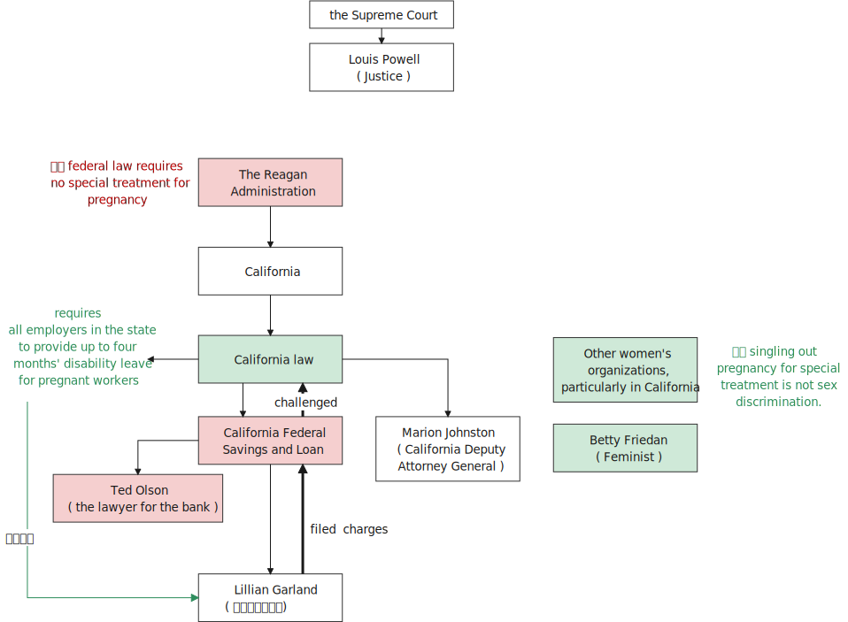

= step 3- Lesson 16
:toc: left
:toclevels: 3
:sectnums:
:stylesheet: ../../+ 000 eng选/美国高中历史教材 American History ： From Pre-Columbian to the New Millennium/myAdocCss.css

'''

https://www.kekenet.com/Article/201805/553448.shtml

== 美苏交换人质

President Reagan announced today that he and Soviet leader Gobachev will meet in Iceland October 11th and 12th *to prepare for a summit* between the two leaders in the United States later this year.  +

The announcement came after *the release* yesterday
from Moscow *of American reporter Nicholas Daniloff* and a court 法院；法庭；审判庭 appearance in New York this morning by accused Soviet spy Gennadi Zakharov, who pleaded no contest to espionage charges and was told to leave the United States within twenty-four hours.  +

Zakharov is now *on his way* back to the Soviet Union and Daniloff has arrived back in the United States.  +

The movement of Daniloff and Zakharov and *plans for the meeting in Iceland* were also announced today in Moscow.  +

The BBC's Peter Ruff reports.  +

"The announcement *makes it clear that* this was at Mr. Gorbachev's invitation, and *it's also pointed out that* this is simply a preparatory meeting to a possible summit.  +
 声明明确表明, 这是应戈尔巴乔夫先生的邀请，并指出这只是一次可能举行的峰会的筹备会议。 +

*It's pointed out here that* it will enable the Soviet Union to focus on arms issues, particularly the Strategic Defense Initiative 倡议；新方案, or Star Wars program, President Reagan's refusal (n.) to join a test moratorium (n.)暂停，中止（尤指经官方同意的）, and a possible *arms deal* involving medium-range missiles in Europe.  +
这里指出，这将使苏联能够专注于武器问题，特别是战略防御倡议，或星球大战计划，里根总统拒绝加入暂停试验，以及可能涉及欧洲中程导弹的武器交易。 +

In a separate announcement, the official news agency 通讯社 Tass *revealed that* Gennadi Zakharov had, *as they put it* 正如某人所说的那样, been released from custody （尤指在候审时的）拘留，拘押，羁押 and was returning home.  +
在另一份声明中，官方通讯社塔斯社(Tass)透露，正如他们所说，根纳迪·扎哈罗夫(Gennadi Zakharov)已被释放，正在回家。  +

*It made no mention of the fact that* he'd pleaded no contest  争辩；就…提出异议 in a court in New York.  +
声明没有提及他在纽约法庭, 未对"间谍指控"进行抗辩的事实。 +

Then came the first official confirmation 证实；确认书；证明书 from the Soviet Union that the American reporter Nicholas Daniloff had been expelled.  +
随后，苏联发出第一份官方声明，证实美国记者尼古拉斯·丹尼洛夫已被驱逐出境。 +

The news item did not *refer to* 提到；谈及；说起 him *as* a spy but *as* someone who'd been engaged in inadmissible （尤指法庭上）不允许的，不能采纳的 activity." +
这条新闻并未声称他是间谍，而是声称他从事了不可接受的活动。 +

.案例
====
.REˈFER TO SB/STH (AS STH) +
to mention or speak about sb/sth 提到；谈及；说起 +
=> You know *who I'm referring to*. 你知道我指的是谁。 +
=> She always *referred to* Ben *as* ‘that nice man'. 她总是称本为“那个大好人”。 +
====

BBC correspondent Peter Ruff in Moscow.

There was no mention in the Soviet press today that prominent Soviet dissident  持不同政见者 Yuri Orlov and his wife will be allowed to leave for 出发前往 the United States by October 7th.  +
今天苏联新闻界并没有提到，苏联将允许著名不同政见者尤里·奥洛夫及其妻子, 在10月7日以前，离苏赴美。 +

.案例
====
.dissident +
--> dis-, 不，非，使相反。-sid, 坐，词源sit,president. 即分开坐的，引申词义政见不和者。
====

Secretary of State Shultz *made that announcement* in Washington 状 saying *Orlov was the driving force* behind the Helsinki Monitoring 监视,监控 Group of Civil Rights Activists.  +
国务卿舒尔茨在华盛顿发表声明称，奥洛夫是赫尔辛基民权活动家监督小组的幕后推手。 +

In 1978, Orlov *was sentenced to seven years* in a prison camp, *to be followed by* five more years in internal 内政的；国内的 exile 流放；流亡；放逐.  +
1978年，奥洛夫被判处7年监禁，随后又遭国内流放，时长超过5年。 +

.案例
====
.follow by 紧随其后;后面有
=> A middle-aged woman come over, *follow by* a group of children.
一位中年妇女走进来，后面跟着一群孩子。 +
=> The storm *was followed by* heavy rain. 暴风雨之后紧接着有大雨 (*strom 被 rain 跟着*, 跟在后面, 所以 strom在前, 后面跟着rain.) +
====

Shultz said Orlov's release was *in exchange for* that Zakharov and *had nothing to do with* Daniloff's freedom.  +
舒尔茨说释放奥洛夫是为了交换扎哈洛夫，与丹尼洛夫的自由无关。 +

In just eleven days President Reagan and Soviet leader Gorbachev will meet in Iceland for *what is described* by the two sides *as* an *interim  暂时的；过渡的 summit* or a *preparatory summit*.  +
在短短十一天内，里根总统将与苏联领导人戈尔巴乔夫在冰岛会面，召开双方称为临时峰会或筹备峰会的会议。 +

The announcement *was made* at the White House this morning *at a news conference* held by President Reagen and Secretary of State George Shultz *called to discuss* the Iceland meeting and the negotiations which had *led up to* 导致;逐渐引到 (某一个话题) the release of Nicholas Daniloff yesterday.  +
今天上午，里根总统及国务卿乔治·舒尔茨举行白宫新闻发布会，会上对冰岛会议以及推动尼古拉斯·丹尼洛夫昨日释放的谈判进行了讨论。 +

Negotiations for the release of Daniloff *went on* for over a month.  +
关于释放丹尼洛夫的谈判持续了一个多月。 +

Today, *at the same time* that the White House news conference was going on, Soviet Foreign Minister Shevardnadze *met (v.) with* the press in New York.  +
今天，在白宫新闻发布会召开的同时，苏联外交部长谢瓦尔德纳泽在纽约会见了新闻记者。 +

NPR's Jim Angle was at the White House, and Mike Shuster was with the Soviet Foreign Minister.  +
NPR记者吉姆·盎格鲁当时就在白宫，而迈克·舒斯特参加了苏联外交部长的新闻会议。 +

"Jim, since Daniloff was only released yesterday, and `主` the details of the negotiations *leading up to* his release `谓` were not known yesterday, didn't `主` announcement of a summit 后定 *announced before* any discussion of the Daniloff affair `谓` come as a surprise?"
吉姆，因为丹尼洛夫昨天才获释放，具体谈判细节昨天还不知道，在没有讨论丹尼洛夫事件之前就宣布召开峰会，这难道不让人感到意外吗？ +

"*What was a surprise is that* we did not know it was coming.  *It is not a surprise* if you look at the overall context （事情发生的）背景，环境，来龙去脉 of preparations for a summit and the discussions so far.  +
令人惊讶的是，我们根本对此毫无预期。如果你看一下峰会筹备的总体情况和到目前为止的讨论，就不会感到奇怪了。 +

Of course, the US had said *it would not attend a summit* until the Daniloff case was resolved, and the President said today that *he could not have accepted this pre-summit preparatory meeting* if Daniloff were still being held.  +
当然，美方曾经表态，丹尼洛夫一案解决之前，不会出席峰会。
总统今天表示，如果丹尼洛夫仍未获释，他不可能召开这次峰会的筹备会议。 +

.案例
====
.he could not have accepted 和 he could not accept
- He could not have accepted 这是"过去完成时"的结构，*强调了"在过去某个时间点或事件发生之前"，这表明在 Daniloff 在释放之前，总统无法接受那个会议。*
- He could not accept *表达的是总统"在过去某个时间点"无法接受那个准备会议，而不强调在 Daniloff 仍然被拘留的情况下。*
====

Today the matter was resolved.  +

At least we heard that the other details of the matter's resolution, including the fact that Gennadi Zakharov, the accused Soviet spy, was allowed to plead no contest in a New York court and allowed to leave the United States.  +
至少我们听到了这件事情解决背后的其他细节，包括禁止被控苏联间谍根纳迪·扎哈洛夫，在纽约法院进行申辩，但准许其离开美国。 +

The resolution of that matter *cleared the way for* summit preparations.  +
此事的解决为首脑会议的筹备工作扫清了障碍。 +

The meeting, of course, this pre-summit meeting, was proposed by Secretary Gorbachev, in a letter *delivered to* President Reagan by Soviet Foreign Minister Shevardnadze on September 19th.  +
这次会议，当然是筹备峰会，由总书记戈尔巴乔夫提出，并由苏联外交部长谢瓦尔德纳泽, 在9月19日向里根总统递交了一封信中, 做出了阐述。 +

`主` The announcement of this meeting today *at the same time* as the resolution of Zakharov's status `系` is a way of *both sides saying ① that* they consider (v.) the Daniloff matter resolved (v.) 伴随状 *with the exception of* one or two details ② *and that* no obstacles now exist (v.) in the preparations for summit later this year in the US." +
今天宣布召开这次会议，与解决扎哈罗夫的身份问题同时进行，是双方表明他们认为"达尼洛夫的事务已解决，只有一两个细节有待解决，并且在今年晚些时候在美国召开峰会的准备工作中, 现在不存在任何障碍"的一种方式。 +

"At the news conference this morning /both President Reagan and Secretary of State Shultz *stress that* there had been no trade for Nicholas Daniloff.  +
在今天上午的新闻发布会上，里根总统和国务卿舒尔茨都强调，在尼古拉斯·丹尼洛夫一事上并不存在任何交易。 +

Jim, was this a trade?"  +
吉姆，这是一场交易吗？ +

"Well, clearly, `主` Daniloff's release, Zakharov's quick trial and departure 离开；起程；出发, and the release of the Soviet dissident `系` were all part of one package.  +
“嗯，很明显，丹尼洛夫获释，扎哈洛夫得到了快速审判并离开了美国，还有苏联那个持不同政见者的释放都是整个计划的一部分。 +

But *to the extent that* definitions are important, especially in the diplomatic world and *in terms of* principles and precedents 先前出现的事例；前例；先例, the US has insisted that there was no trade involved here.  +
从某种程度上来讲，定义很重要，特别在外交领域，从原则和先例方面看，美方坚称这里不存在交易。 +

They say Daniloff was released without a trial, an implicit 含蓄的；不直接言明的 acknowledgement （对事实、现实、存在的）承认, if you will, by the Soviet, that he is not a spy.  +
他们说丹尼洛夫没有遭受审判就获得了释放，这就表明苏联暗自承认他不是间谍。 +

Zakharov, on the other hand, in pleading *no contest to* espionage charges, *allows*, in a sense, the US assertion 明确肯定；断言 that he was a spy *to stand*.  +
另一方面，扎哈罗夫没有对间谍指控提出抗辩，从某种意义上说，这让美国关于他是间谍的说法站得住脚。 +

President Reagan sought (=seek) *to emphasize* today in his remark at the White House *that* these were separate matters.  +
里根总统今天在白宫的讲话中, 试图强调这些是不同的事情。 +

"There is no connection between these two releases. And I don't know just what you have said so far about this. But there were other arrangements *with regard to* 关于；就……而言 Zakharov that *resulted in* his being freed."  +
这两次释放之间没有联系。我不知道你到目前为止对此说了些什么。但是关于扎哈罗夫还有其他安排, 导致他被释放。 +

Margo, the President's *referring* there *to* what the US *sees (v.) as* the only trade involved in this whole package, and that is the Soviet agreement to allow Soviet *human rights activist* Yuri Orlov and his wife to leave the Soviet Union by October 7th."  +
马戈，总统在这里提到了美国认为整个一揽子计划中涉及的唯一贸易，那就是苏联同意允许苏联人权活动人士尤里·奥尔洛夫和他的妻子, 在 10 月 7 日之前离开苏联。 +

'''

== 产假争议

Today in *the Supreme （级别或地位）最高的，至高无上的 Court* of the United States, a case involving *maternity (n.)母亲身份；怀孕 leave*: at issue 重要议题；争论的问题 whether states (n.) *may require employers to guarantee that* pregnant workers are able to return to their jobs after a limited period of unpaid disability （某种）缺陷，障碍 leave.  +
美国最高法院，涉及产假的案件：各州是否可以要求雇主保证怀孕工人能够在一段有限的无薪伤残假后, 重返工作岗位的问题。 +

NPR's Nina Totenberg reports.  +

Nice states *already have laws or regulations* that require all employers to protect the jobs of workers who are disabled by pregnancy or childbirth.  +
此前九个州份已经出台相关法律法规，要求所有雇主必须确保员工在怀孕或分娩后, 仍维持工作岗位。 +

*Depending on* what the Supreme Court rules (v.)决定；裁定；判决 in the case *it heard today*, those laws will *either* die *or* flourish.  +
这些法律是废是留，取决于最高法院对今日审理案件的判决。 +

The *test case* （判决同类案件可援用的）判例 is from California.  +

.案例
====
.test case
a legal case or other situation *whose result will be used as an example* when decisions are being made on similar cases in the future （判决同类案件可援用的）判例
====

It began with Lillian Garland, the receptionist  (办公室或医院) 接待员 at California Federal 联邦党的; 联邦制的  Savings and Loan. In 1982, she returned to work after having a child and found she had no job.  +
一切从加利福尼亚州联邦储蓄贷款银行的接待员莉莲·加兰开始。
1982年，她生完孩子后意欲重返工作岗位，却发现自己丢了工作。 +

"After working for California Federal for over three and a half years, I was told at that time they no longer had a position available for me. My question was, 'Well, what about the job that I've had for so many years?'
此前我已在加利福尼亚州联邦储蓄贷款银行工作了三年半多，但他们告诉我，职位已经没了。
那我想问，“那么，我做了这么多年的工作呢？ +

And they said, 'We hired the person that you trained in your place.' I was in shock." Officials at California Federal say Garland 花环；花冠(本文这里是人名) should not have been surprised, that *she'd been told* at the time 后定 (she took pregnancy leave) *that* her job was not guaranteed.  +
他们说：“我们雇了你之前在那里培训的人。”我震惊了。加利福尼亚州联邦储蓄贷款银行的官员称加兰不该感到惊讶，她在怀孕期间，我们已经告知她，并不保证她回来后，职位还为她保留。 +

*But the fact is that* California law requires (v.) all employers in the state to provide *up to* four months' disability leave for pregnant workers.  +
但事实是，加利福尼亚州法律要求该州所有雇主, 应为怀孕员工提供长达四个月的休假。 +

The leave time is unpaid, and it is only available to women who, because of pregnancy or childbirth, are physically unable to work.  +
休假期间工资不再支付，它只适用于那些因怀孕或分娩而无法工作的妇女。

*The law does require that* such workers get back the same job unless business necessity makes that impossible.  +
法律的确规定，除非商业必要性促使工作无法完成，否则这些工人必须恢复休假前的工作。

So when Lillian Garland was told she couldn't have her old job back, *she filed 提起（诉讼）；提出（申请）；送交（备案） discrimination  区别对待；歧视；偏袒 charges* against the bank.  +
所以当莉莲·加兰被告知她无法重返原来的工作岗位时，她对银行提出歧视指控。

The bank then *challenged the California pregnancy disability law* in court, claiming that the state law *amounted 等于；相当于 to* illegal sex discrimination.  +
银行随即在法庭上, 质疑加利福尼亚州的怀孕保障法律，声称"州法律"等同于"非法的性别歧视"。

The bank's reasoning *went like this*: Federal law bans (v.) discrimination in employment based on pregnancy, but the state law *mandates* (v.)授权;强制执行；委托办理 disability leave *to* women for pregnancy while denying the same leave time to men who are disabled by other ailments 轻病；小恙, such as heart attacks and strokes.  +
银行的逻辑是这样的：联邦法律禁止以怀孕为基础的就业歧视，但是州法律却规定怀孕妇女在怀孕期间可以休假，而休假时间却与因其他疾病无法工作的男性不同，比如心脏病和中风。 +

.案例
====
.mandate
(v.) +
1.( especially NAmE ) to order sb to behave, do sth or vote in a particular way 强制执行；委托办理 +
[ V that] +
=> The law mandates that imported goods be identified as such. 法律规定进口货物必须如实标明。  +
[ also VN to infalso VN ] +

2.[ VN to inf] *to give sb*, especially a government or a committee, *the authority to do sth* 授权 +
=> The assembly was mandated to draft a constitution. 大会被授权起草一份章程。 +
====

California counters (v.)反驳；驳斥 that the state law does not discriminate (v.) between men and women, that it *treats* them both *the same as* to all ailments, but *grants* disability leave *only to* pregnant workers.  +
加利福尼亚州政府称, 州法律并没有造成性别歧视，他们对所有的疾病都一视同仁，但只给予怀孕员工以休假权利。 +

Moreover, California argues that the state law in fact equalizes (v.) the situation between man and woman, allowing them both to have children without losing their jobs.  +
此外，加利福尼亚州政府认为，州法律实际上均衡了男女之间的状况，让他们有孩子而不失去工作。 +

The pregnancy disability case has produced some strange bedfellows （常指意外的）伙伴，同伴，相伴之物.  +
怀孕休假案激发了一些奇怪的共鸣。 +

.案例
====
.bedfellow +
(n.) a person or thing that is connected with or related to another, *often in a way that you would not expect* （常指意外的）伙伴，同伴，相伴之物 +
=> strange/unlikely bedfellows 奇怪的伙伴；先前看似不大可能做伙伴的人 +
--> 同床者（等于bedmate）

chatGpt : "Bedfellow" 是一个合成词，由 "bed"（床）和 "fellow"（伙伴）组成。这个词通常用来形容在某个共同目标或情境下，两个不同或不太可能一起出现的事物或人。 +
例如，"Politics makes strange bedfellows" 这个表达意味着在政治上，一些不同阵营或立场的人可能会因为共同的目标而暂时合作，即使他们在其他方面可能并不一致。 +

总的来说，*"bedfellow" 更强调不同或不寻常的组合*，而 "fellow" 则更广泛地用来表示同类、同伴或同事。
====

The Reagan Administration *is siding with* 支持某人（反对…）；和某人站在一起（反对…） the California business community *in arguing that* federal law requires (v.)使做（某事）；使拥有（某物）；（尤指根据法规）规定;需要；依靠；依赖 no special treatment for pregnancy.  +
里根政府与加利福尼亚商界合作，认为联邦法律无需对怀孕员工进行特殊照顾。

.案例
====
.side (v.) with sb (against sb/sth)
to support one person or group in an argument against sb else 支持某人（反对…）；和某人站在一起（反对…） +
=> The kids *always sided with* their mother *against* me. 孩子们总是和妈妈站在一边，跟我唱对台戏。
====

Many of the major *national women's organizations* agree (v.), but argue that the way *to cure the problem* is to give everybody *unpaid disability leave* in case of illness.  +
许多主要的全国妇女组织也都赞同，但认为解决这个问题的方法, 是在每个人生病的情况下, 给他们无薪伤残假。 +

Other women's organizations, particularly in California, argue that `主` *singling (V.) out* 单独挑出 pregnancy *for* special treatment `系` is not sex discrimination.  +
其他妇女组织，特别是在加利福尼亚的妇女组织，认为"对孕期的特别照顾"不是"(对男性的)性别歧视"。

.案例
====
.single sb/sth←→ˈout (for sth/as sb/sth)
to choose sb/sth from a group for special attention 单独挑出 +
=> *She was singled out* for criticism. 把她单挑出来进行批评。
====

Feminist Betty Friedan defends the California law.  +
女权主义者贝蒂·弗莱顿, 为加利福尼亚州法律申辩。

"虚拟主语 It's not discrimination against men 实际主语 *to do something about the fact that* women give birth to children.  It's a fact of life.  If men could carry the baby, if men could *go through* 经历 (尤为艰难时期) the nine months, if men could have the labor 分娩期；分娩；生产 pain, you know, they also should *have coverage  提供的数量；覆盖范围（或方式） for pregnancy*.  +
对女人生孩子这件事做点什么, 并不是对男人的歧视。
这是生活的事实。如果男人能带着孩子，如果男人能经历那九个月，
如果男人有分娩痛苦，你知道，他们也应该享有怀孕保险。 +

You're not discriminating against men; you're recognizing a fact of life: that women are *different than* men."
你不是在歧视男人，你是在认识生活的事实：女人和男人不同。

.案例
====
.different (from/to/than sb/sth)
not the same as sb/sth; not like sb/sth else 不同的；有区别的；有差异的
====

On the other side, the lawyer for the bank, Ted Olson, argues that *special treatment for pregnancy* is obviously discrimination, and that *California companies risk* being sued (v.)控告；提起诉讼 by one group of people if they follow federal law /and *by another group of people* if they follow (v.) state law.  +
另一方面，银行的律师泰德·奥尔森(Ted Olson)辩称，对孕妇的特殊待遇, 显然是歧视，加州的公司如果遵守联邦法律，可能会被一群人起诉，而如果遵守州法律，可能会被另一群人起诉。 +

"The California law requires special treatment of pregnancy; the federal law requires equal treatment of pregnancy. An employer is entitled (v.)使享有权利；使符合资格 to know which law it must follow." +
加利福尼亚州法律要求"对怀孕员工进行特殊照顾"；而联邦法律要求"平等对待妊娠"。雇主有权知道他们到底应须遵守哪个法律。

.案例
====
.entitle
(v.)~ sb to sthto give sb the right to have or to do sth 使享有权利；使符合资格 +
=> Everyone's entitled (v.) to their own opinion. 人人都有权发表自己的意见。
====

The fact is, though, that much of the California business community objects, most of all, to being told that it has to provide any disability leave.  +
事实上，加利福尼亚商业实体，大多数都被告知他们必须提供任何无法在岗的休假。

Here is Don Butler, President of the Merchants and Manufacturers Association, which is a party （契约或争论的）当事人，一方 to this law suit.  +
这是唐·巴特勒，商人和制造商协会主席，这起法律诉讼的当事方。

"What we have to *get back to* 重新开始,回到某事上, though, is who's going to set the disability leave policies.  Is the federal government, is the state of California, or are we, the employers, going to set? You, the employee, have the choice of *working for our company* under the following conditions or working for another company under other conditions.  +
但我们必须重新考虑的是，谁将设立这个假期。
是联邦政府，是加利福尼亚州，还是我们，雇主，将设立？
你，雇员，可以选择在我们所设立的条件下, 为我们公司工作，也可以选择在别人所设立的条件下, 为别的公司工作。 +

And I believe that *that was* what built this country to be a great free enterprise system. And if we're going to legislate it, then we're going to destroy a lot of the incentives (n.)鼓励 to ..."  +
我相信, 这正是"这个国家能成就伟大自由的企业制度"的原因。如果我们要立法，那么我们就要破坏很多激励机制…

"But basically you don't want to be told to have a disability policy at all." "Right."  +
“但基本上你不想被告知存在这种政策。”“是的。”

In the Supreme Court this morning, perhaps the pivotal 关键性的；核心的 question was asked by Justice Louis Powell, who *posed* a hypothetical 假设的；假定的 situation *to* California Deputy *Attorney 律师（尤指代表当事人出庭者）;（业务或法律事务上的）代理人 General* 总检察长 Marion Johnston.  +
今天早上在最高法院，也许路易斯·鲍威尔法官提出了一个关键问题，
他对加利福尼亚副检察长玛丽恩·庄士敦提出了一个假设。 +

"Let assume, " said Jusstice Powell, "that a man and a woman in the same company leave their jobs on the same day: he, because he is ill; she, because she's about to have a child.  And they return on the same day, but under the California law she gets her job back and he does not. Is that fair?" asks Justice Powell.  +
“让我们假设，”鲍威尔法官说。
“同一家公司的一男一女在同一天辞去工作，因为男的病了，女的快要生孩子了。
而他们又在同一天回来了，但根据加利福尼亚州的法律，女的得到了她的工作，而男的没有。
这公平吗？”鲍威尔法官问道。 +

Lawyer Johnston responded, "It may not be fair, but it's legal.  California law," she said, "simply requires that employers treat all their employees, men and women, in the same way with respect to pregnancy. But, since men don't get pregnant, they don't get the time off 获得休假时间."  +
律师庄士敦回答说：“这可能不公平，但它合法。
加利福尼亚州的法律，“她说，“只是要求雇主对于所有的男性和女性雇员尊重妊娠，一视同仁。
但是，因为男人不会怀孕，所以他们没有休息时间。” +

A decision in the California case is not expected until next year.  +
加州案件的判决, 预计要到明年才会做出。

I'm Nina Totenberg in Washingtom.

'''
