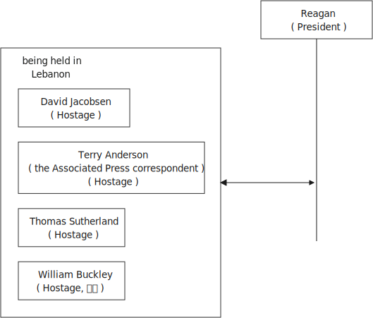
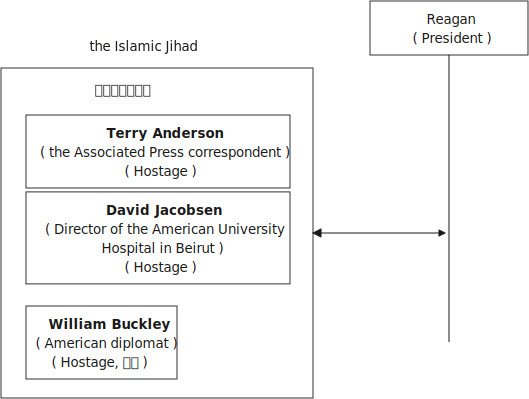
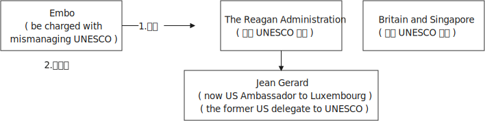

= step 3- Lesson 17
:toc: left
:toclevels: 3
:sectnums:
:stylesheet: ../../+ 000 eng选/美国高中历史教材 American History ： From Pre-Columbian to the New Millennium/myAdocCss.css

'''

https://www.kekenet.com/Article/201805/554061.shtml

== 简讯目录

`主` Two of #the American hostages# /being held in Lebanon /`谓` #appeared# in a videotape /released today, *appealing 呼吁；吁请；恳求 to* the Reagan Administration /to work (v.) *as hard* for their release *as it did* /to get Nicholas Daniloff out of the Soviet Union.  +

[.my2]
今天发布的一盘录像带中, 出现了两名在黎巴嫩被扣押的美国人质，呼吁里根政府像努力让尼古拉斯·达尼洛夫离开苏联一样, 努力释放他们。

Hostage 人质 David Jacobsen: "*Don't we also deserve* 值得；应得；应受 _the recognition_ 承认；认可, 赞誉；赏识；奖赏, _the respect_ and _the honorable treatment_ by the United States government? *Don't we deserve* the same attention and protection /that you gave Daniloff?" Jacobsen, who *works for* the American University Hospital in Beirut, has been held /for sixteen months.  +

[.my2]
人质大卫·雅各布森：“我们难道不应该得到美国政府的认可、尊重和光荣待遇吗？难道我们不应该得到你们给予丹尼洛夫的同样的关注和保护吗？”在贝鲁特美国大学医院工作的雅各布森, 已被关押了十六个月。

Also *appearing (v.) on the videotape* /was _the Associated Press_ correspondent 记者；通讯员 Terry Anderson, the first time he's been seen /*since* his capture eighteen months ago.  +

[.my2]
出现在录像带上的, 还有美联社记者特里·安德森（Terry Anderson），这是自十八个月前被捕以来, 第一次见到他。

Anderson and Jacobsen had said /they were also speaking *on behalf of* hostage 人质 Thomas Sutherland.  And they *spoke of* the death of William Buckley /whom _Islamic Jihad_ has claimed to have killed.  +

[.my2]
安德森和雅各布森曾表示，他们也代表人质托马斯·萨瑟兰发言。他们还谈到了"伊斯兰圣战组织声称杀害的威廉·巴克利"的死。

Sutherland *blamed* President Reagan *for* Buckley's murder.  +

[.my2]
萨瑟兰指责里根总统谋杀了巴克利。

"President Reagan *made his first mistake* in the hostage crisis /and Buckley died (v.).  Mr. President, are you going to make another mistake /*at the cost of* our lives?"  +

[.my2]
“里根总统在人质危机中犯了第一个错误，巴克利死了。总统先生，你打算再犯一个错误，以我们的生命为代价吗?”

President Reagan today *defended* his efforts /to gain the hostages' release. *Speaking to* reporters /as he *left for* 动身前往某个地方 Camp David, Mr. Reagan said /there has never been a day /that the administration has not been trying (v.) every channel.  +

[.my2]
里根总统今天为他为人质获释所做的努力, 进行了辩护。里根在前往戴维营时对记者表示，政府没有一天没有尝试过每一个渠道。

But he said /there was no comparison 比较 /*between* the case of Nicholas Daniloff *and* the hostages in Lebanon /"because he was held by a government /and we don't know who's holding the hostages."  +

[.my2]
但他表示，尼古拉斯·达尼洛夫的案件, 与黎巴嫩的人质事件, 没有可比性，“因为他是被政府扣押的，而我们不知道是谁扣押了人质。” +

Daniloff himself *commented on* the hostages' appeal, saying *his heart goes out to them* and they will not be forgotten. +
达尼洛夫本人对人质的呼吁发表了评论，称他的心与他们同在，他们不会被忘记。

The White House today /gave its view of _the upcoming meeting_ *between* President Reagan *and* Soviet leader Mikhail Gorbachev in Iceland.  And officials *made it clear that* /the US intends (v.) to pursue (v.) a *much broader* agenda （会议的）议程表，议事日程 /*than* the Soviets are proposing.  +

[.my2]
白宫今天对里根总统和苏联领导人戈尔巴乔夫即将在冰岛举行的会议, 发表了看法。 官员们明确表示，美国打算推行比苏联提议的更广泛的议程。 +

NPR's Jim Angle reports (v.).  +

'''

== 美国不在冰岛会议上谈论军备控制

"_White House spokesman_ Larry Speakes *emphasized* today /the US does not *see* the Iceland meeting *as* a discussion 后定向前推进 primarily about _arms control_.  +

[.my2]
白宫发言人拉里·斯皮克斯今天强调，美国并不认为冰岛会议, 主要是关于军备控制的讨论。

'That issue is important to *both* nations *and* the world, ' he said, ' and the US /will *be diligent* (a.)孜孜不倦的；勤勉的；刻苦的 in its efforts /to seek _common ground_ （争论双方的）共同基础；一致之处 /that could *be* the basis for progress in arms talks.'  +
Speakes *emphasized*, however, *that* /the US agenda *will be broader than that*, even though Soviet statements about the meeting *have focused* largely on arms control.  +

[.my2]
“这个问题对两国和世界都很重要，”他说，“美国将勤奋努力”寻求共同点，这可能成为军备谈判取得进展的基础。”然而，斯皮克斯强调，美国的议程将比这更广泛，尽管苏联关于这次会议的声明, 主要集中在军备控制上。

Speakes says /the US will *raise (v.)提及；提起（课题） all the issues* /as it usually does, including _regional conflicts_ and _tensions in Afghanistan, Africa, the Caribbean, the Middle East, and Southeast Asia_.  +

[.my2]
斯皮克斯表示，美国将像往常一样提出所有问题，包括地区冲突和阿富汗紧张局势、非洲、加勒比、中东和东南亚。

Speakes said that /the US will also *raise (v.) its concern /over* human rights issues.  +

[.my2]
斯皮克斯表示，美国也会提出对人权问题的关注。

`主` _Speakes' statement_ on _the Iceland meeting_ today /`谓` sought to keep expectation  预料；预期；期待 to its minimum.  +
The President's goal, he said, is that /both sides *gain a better understanding of* each other's position at this time /and *move forward toward* a summit /in the United States.  +

[.my2]
今天斯皮克斯在冰岛会议上的声明, 试图将期望降到最低。总统的目标，他斯皮克斯表示，双方此时应该更好地了解彼此的立场，并朝着在美国举行峰会的方向迈进。 +

But Speakes said that /the US will *be satisfied with* the meeting /if we accomplish (v.) better understanding.  +

[.my2]
但斯皮克斯表示，如果我们能够更好地了解，美国将对这次会面感到满意。

If no date *is set* for a summit in the US, he said, that could *be done* later.  +

[.my2]
如果没有具体日期他说，峰会定于在美国举行，这可以稍后举行。

I'm Jim Angle /at the White House."

'''

== 被伊斯兰圣战组织绑架的美国人质, 向美国政府喊话

From Beirut today, _the tired voices_ of two American hostages, `主` _a crudely 粗糙地；天然地；粗鲁地；不成熟地 made videotape_ of journalist Terry Anderson and _American University employee_ David Jacobsen /`谓` was released this morning /by their captor 捕获…者；捕捉者；劫持者, the Islamic Jihad. +

[.my2]
今天从贝鲁特传来两名美国人质疲惫的声音，绑架者伊斯兰圣战组织, 今天早上发布了一段粗制滥造的录像带, 内容是关于记者特里·安德森, 和美利坚大学雇员大卫·雅各布森的。

The two men read (v.) from texts /that seemed to have been written by the captors. +

[.my2]
两人朗读的文字, 似乎是绑架者写的。

*They sounded bitter* /as they assailed (v.) 攻击；抨击；袭击 what they called _the Reagan Administration's refusal_ (n.) to act (v.) /to secure their release. +
他们指责里根政府拒绝采取行动, 确保他们获释，语气中充满了痛苦。

And Anderson confirmed (v.) _the death_ of his fellow hostage, American diplomat, William Buckley. +

[.my2]
安德森证实了他的人质同伴、美国外交官威廉·巴克利的死亡。

Islamic Jihad *claims* /it murdered (v.) Buckley /in October of last year, but `主` no _conclusive (a.)结论性的；不容置疑的；确凿的 proof_ of his death /`谓` *has ever been found*. +

[.my2]
伊斯兰圣战组织声称, 去年 10 月谋杀了巴克利，但尚未找到确凿的死亡证据。

From Beirut, the BBC's Jim Muir reports (v.). +

[.my2]
BBC 的吉姆·缪尔在贝鲁特报道。

"This was the first time /since he was kidnapped by gunmen /in March last year /that `主` #Terry Anderson#, 后定向前推进 the Beirut 黎巴嫩一港口名 _Bureau  （提供某方面信息的）办事处，办公室，机构;（美国政府部门）局，处，科 Chief_ of _the Associated Press_ （美国）联合通讯社；美联社, /`谓` #has been seen# on video. +

[.my2]
“自去年3月被枪手绑架以来，这是美联社贝鲁特分社社长特里·安德森, 首次出现在视频中。

[.my1]
====
.that Terry Anderson 中的 that
是一个定语从句，修饰先行词 "the first time", 用来说明是在哪个时候是第一次。
====

He looked fit /but thinner and paler （脸色）更苍白的 /*than* when he was abducted 诱拐；劫持；绑架. +

[.my2]
他看起来很健康，但比被绑架时更瘦、更苍白。

He *bitterly 极其；非常;伤心地；愤怒地 accused* the Reagan Administration *of* ignoring (v.) the plight 苦难；困境；苦境 of the American hosetages in Beirut /#while# **surrendering (v.)投降; 屈服 to** the Russians /over the Daniloff case."  +

[.my2]
他严厉指责里根政府无视美国在贝鲁特的困境，同时就丹尼洛夫案, 向俄罗斯人投了降。

[.my1]
====
.plight
-> pleat, plait和plight本质上是同一个词,来源于拉丁语动词plic.are(折叠,卷绕)过去分词的名词用法plicitum或plictum(折叠),经古法语pleit派生而来。 -plic-折叠 → plight 同源词：pleat, plait
====

"'How can any official *justify* (v.)证明…正确（或正当、有理）; 对…作出解释；为…辩解（或辩护） _the interest, and attention and action_ 后定 given that case /and _the inattention_ 不注意；不经心 given ours?  +

*Do* the American people *know* /why we are in captivity 监禁；关押；困住? Why the marines 海军陆战队士兵 and others *were killed in bombings* at Beirut Airport and the Embassy 大使馆；（统称）使馆官员 building?  +

Why they can't *roam  徜徉；闲逛；漫步 freely* about the Middle East /but are always in danger?  +
All this *is* the result of Reagan's policy, a policy against the people of the Middle East. +

[.my2]
“任何官员如何证明对那个案子的兴趣、关注和行动，以及对我们的不关注是合理的呢?”美国人民知道我们为什么被囚禁吗?为什么海军陆战队员和其他人, 在贝鲁特机场和大使馆大楼的炸弹袭击中丧生?为什么他们不能在中东自由漫游，却总是处于危险之中?这一切都是里根政策的结果，这是一项反对中东人民的政策。 +

[.my1]
====
inattention +
(n.) [ U] ( usually disapproving) lack of attention 不注意；不经心
====

Our captivity is one part of the result of this policy. +
William Buckley's murder /and the killings of many, many others /are another part. +
Your lack of freedom to travel /is another result of that policy. +

[.my2]
我们的被囚禁, 是这项政策的结果之一。威廉·巴克利被谋杀, 以及许多其他人被杀, 是另一部分。缺乏旅行自由, 是该政策的另一个结果。

We are not surprised /that Mr. Reagan *is not paying attention to* our case. +
More than four hundred Americans *have been killed in Beirut* /without causing him *to feel any responsibility* or *to change that policy*. +

[.my2]
对于里根先生不关注我们的案件，我们并不感到惊讶。四百多名美国人在贝鲁特被杀，但他却没有感到任何责任, 或改变这一政策。

*We are surprised that* /the American government ① *has put pressure on* some of the European governments /*not to negotiate in such cases 后定 as ours* /② and *has surrendered itself* in the Daniloff case, releasing (v.) a Russian spy, Zakharov, who *was working against* our people. +

*We are more surprised that* /the American people still *listen to* what Reagan says. +

[.my2]
我们感到惊讶的是，美国政府向一些欧洲政府施加压力，要求它们不要在我们这样的案件中进行谈判，并在达尼洛夫案中投降，释放了一名与我们人民作对的俄罗斯间谍扎哈罗夫。 +
更令我们惊讶的是，美国民众仍然听里根的话。

*How long* must we stay in captivity? How long will the American government not pay attention?'  The same message *was put across 描述清楚; 解释明白 strongly* /by one of Mr. Anderson's fellow captives (n.)被囚禁者,囚徒；俘虏；战俘, Mr. David Jacobsen, Director of _the American University Hospital_ in Beirut, who was kidnapped /in May last year. +

[.my2]
我们要被囚禁多久?美国政府还能关注多久?” 安德森先生的另一名被俘者、贝鲁特美国大学医院主任戴维·雅各布森先生, 强烈表达了同样的信息，他于去年5月被绑架。

[.my1]
====
.put across
PHRASAL VERB When you *put something across* or *put it over*, you succeed in describing or explaining it to someone. 描述清楚; 解释明白 +
=> He has taken out a half-page advertisement in his local paper *to put his point across*.
 他拿出了当地报纸上的半版广告来阐释他的观点。
====

He said that /the conditions of the hostages *were very bad* /and *had worsened* over the past two months. +
But he said /the worst pain *came from* being ignored by his government. +

[.my2]
他说，人质的状况非常糟糕，并且在过去两个月里情况进一步恶化。但他表示，最严重的痛苦来自于被政府忽视。

The Islamic Jihad is demanding the release of a group of _Moslem
穆斯林,伊斯兰教的 extremists_  极端主义者；极端分子；过激分子 /jailed for _bomb attacks_ in Kuwait. +
But both Washington and Kuwait itself /have refused to negotiate (v.) over their release." From Beirut, the BBC's Jim Muir. +

[.my2]
伊斯兰圣战组织要求释放一群穆斯林极端分子, 后者因科威特炸弹袭击而被监禁。
但华盛顿和科威特本身, 都拒绝就他们的释放进行谈判。” 来自贝鲁特的 BBC 记者吉姆·缪尔 (Jim Muir)。

'''

== 联合国教科文组织领导人, 被迫辞职

Embo has been a controversial 引起争论的；有争议的 leader *charged with* mismanaging (v.)对…处置不当 UNESCO /#while# taking the agency *in* an anti-Western *direction*. +
The Reagan Administration *cited 提及（原因）；举出（示例）；列举 those reasons* /when *pulling* the US *out of* UNESCO /in 1984. +

[.my2]
恩博一直是一个备受争议的领导人，被指责管理联合国教科文组织不善，并将该机构引向反西方的方向。里根政府在1984年退出联合国教科文组织时引用了这些理由。

[.my1]
====
.UNESCO
( Unesco ) United Nations *Educational, Scientific* and *Cultural* Organization 联合国教科文组织；联合国教育、科学及文化组织
====

Last year, the same charges *were* behind _Britain and Singapore's decision_ (n.) to withdraw (v.). +
Those three defections 脱离，退出，叛逃 *forced* UNESCO *to cut its budget* by thirty percent /and *intensified （使）加强，增强，加剧 the crisis* around Embo's leadership. +

[.my2]
去年，相同的指控是英国和新加坡决定退出的原因。这三个缺席使联合国教科文组织不得不削减其预算百分之三十，并加剧了围绕恩博领导的危机。

Jean Gerard, now _US Ambassador_ to Luxembourg, is the former _US delegate to UNESCO_. +
Gerard recommended (v.) the US withdraw, because she felt /UNESCO's programs *were moving away 远离迁离从…离开 /from* international cooperation *toward* confrontation 对抗，冲突. +

[.my2]
现任美国驻卢森堡大使Jean Gerard是前美国代表团成员。杰拉德建议美国退出，因为她认为联合国教科文组织的项目正在远离国际合作，转向对抗。

"*Take*  以…为例；将…作为例证, for example, *the New World Information Order* 秩序, where in their documents /they say that /the press should be an instrument 受利用（或控制）的人；工具 of the state. +
Now this, of course, *is totally contrary (a.)与之相异的；相对立的；相反的 to* our concept of a free press. +

[.my2]
“举个例子，可以看看新世界信息秩序，他们在文件中说新闻应该成为国家的工具。现在，这显然与我们对自由新闻的概念完全相反。

[.my1]
====
.new world information order
世界信息新秩序
====

There are more and more programs /which *emphasize* _statist (a.)计划经济的;统计学者；中央集权论者；中央经济统制论者 type of solutions_ to problems. +
In education, for example, in _the teacher-training program_ in Afghanistan, it's run (v.) *solely 仅；只；唯；单独地 by* Soviet teachers *with* a Soviet coordinator 协调人，统筹者. +

[.my2]
越来越多的项目, 强调国家主义类型的问题解决方案。
例如，在教育领域，阿富汗的教师培训项目, 完全由苏联教师和苏联协调员负责。

So, in essence 本质；实质；精髓, we *were paying for* the indoctrination 教化；灌输;教导 of the Afghan people, which again *is not* my idea of _what an international organization *ought to* be doing_." +

[.my2]
因此，实质上，我们正在为"(苏联)对阿富汗人民的洗脑"买单，而这绝非我对国际组织应该做的事情。”

"To what extent /do you think Embo *is responsible for* the directions /that you *disproved (v.)证明…是错误（或虚假）的 of* in UNESCO?" +

[.my2]
“在你看来，恩博在你反对的联合国教科文组织方向上负有多少责任？”

"I think some of them, of course, were already there, but I think they have been very much accentuated (v.)着重；强调；使突出 /under his tenure （尤指重要政治职务的）任期，任职.  +

And *instead of* 代替，而不是 taking the opportunity /to reform (v.) the organization, to make it *work (v.) more efficiently* /and *in a more unbiased 公正的；不偏不倚的；无偏见的 way*, when we gave our notice 通告；布告；通知 of withdrawal, there was a great clamor 喧闹声；嘈杂声；吵闹;民众的要求 /that there was no crisis /and initially (ad.)开始；最初；起初 very little need for reform /*aside from* 除了……之外 some _cosmetic 装门面的；表面的 reform_, and a general resentment (n.)愤恨；怨恨 of the idea."  +

[.my2]
“我认为其中一些问题当然已经存在了，但我认为在他任职期间已经被极大地强调了。 +
而且，在我们(美国)提出通知, 要退出该组织时，他们没有借此对组织进行改革，使其更有效地运作，并以更加公正的方式运作，反而当时出现了强烈的呼声，他们声称没有危机，最初几乎没有改革的必要，除了一些表面改革外，他们还对这个(要求他们改革的)想法普遍存在一种强烈的怨恨。”

[.my1]
====
.accentuate
[ VN] to emphasize sth or make it more noticeable 着重；强调；使突出
====

"Can you *describe* Embo *as* a leader, what his personality 性格；个性；人格 was like, what his characteristics 特征；特点；品质 *were* /as a leader?"  +

[.my2]
“你能描述一下恩博作为一个领导者，他的个性是什么样的，作为领导者他的特点是什么？”

"I would say /he's certainly very dynamic (a.)充满活力的；精力充沛的；个性强的. He has _a great deal of_ 大量；很多 charm, he has _a very personal type_ of _management style_, and, I think, he tended to *take* criticism (n.)批评，批判 *personally*. +

[.my2]
“我会说他确实非常有活力。他非常有魅力，有一种非常个人化的管理风格，我认为, 他倾向于将批评当作个人攻击。

When we *had discussions* (v.) with him /*about* the budget, the Assistant _Secretary of State_ and myself /in 1983, since we **pointed out that** /his figures *were* very different from the figures /后定 that we had under discussion, he then said #that# /the United States, in essence, was behaving (v.) *in a racist 种族主义的 manner*, #that# we had deep (a.) psychological problems." +

[.my2]
当我们在1983年与他讨论预算时，美国国务院助理和我自己，因为我们指出他的数字与我们讨论的数字非常不同，他随后说，实质上，美国的行为是种族主义的，我们有深层心理问题。”

"Do you think /his resignation *is* a sign /that UNESCO *wants* the United States and England *back*?"  +

[.my2]
“你认为他决定辞职, 是联合国教科文组织想要美国和英国回来的一个迹象吗？”

"*It's not*, as I understand it 根据我的理解,就我理解而言, *a resignation*. It was a statement /*saying that* he would not seek a third term.  +
That does not *#preclude#* (v.)使行不通；阻止；妨碍；排除, of course, some countries *#from#* urging (v.) him to be the candidate, and _the Executive Board_ *nominates* (v.) the candidate *to* the general conference." +

[.my2]
“就我所理解的情况而言，这不是一份辞职书。这是一份声明，说他不会寻求第三个任期。当然，这并不排除一些国家敦促他成为候选人，执行委员会向大会提名候选人。”

[.my1]
====
.preclude
[ V -ing] *~ sth ~ sb from doing sth* :  ( formal ) to prevent sth from happening or sb from doing sth; to make sth impossible 使行不通；阻止；妨碍；排除 +
=> Lack of time *precludes any further discussion*. 由于时间不足，不可能进行深入的讨论。 +
=> His religious beliefs *precluded him/his serving in the army*. 他的宗教信仰不允许他服兵役。
====

"Do you know /if there was any direct pressure on Embo /to not seek (v.) a third term?" +

[.my2]
“你知道是否有任何直接压力, 使恩博不寻求第三个任期吗？”

"I know (v.) /`主` quite a few countries in their governments `谓` have been saying that /they do not favor (v.)较喜欢；选择 his having a third term. That includes the Nordics 北欧人的, who *went* and *informed (v.) him of that* /a few months ago. That includes Japan.  +
And so /if you call that pressure, there certainly were several countries /that indicated (v.)表明；显示;指示；指出 that /they were not *in favor of* 支持；赞同；偏向于 his having a third term." +

[.my2]
“我知道相当多的国家在他们的政府中已经表示他们不赞成他有第三个任期。这包括几个月前前往通知他的北欧国家。包括日本在内。因此，如果你把这种情况称为压力，那么确实有几个国家表示不赞成他有第三个任期。”

"*Does* Embo's decision /to not seek (v.) a third term /`谓` *represent* a success for _the US's decision_ 后定 *to pull out of* UNESCO?"  +

[.my2]
恩博决定不再谋求第三任期，是否代表了美国退出联合国教科文组织的决定取得了成功?

"I wouldn't say it [in those words] frankly. I think /*it's a pity* 遗憾的事 /he didn't take the opportunity /to be the champion 斗争者；捍卫者；声援者；拥护者 of reform. On the other hand, that's his decision." +

[.my2]
“坦白地说，我不会这么说。我认为他没有抓住机会成为改革的拥护者，这是一个遗憾。另一方面，这是他的决定。”

"What would it *take* 需要；要求 [for you] *to recommend 劝告；建议 to* the United States *that* /this country rejoin (v.) UNESCO?"  +

[.my2]
“你认为, 美国再次加入联合国教科文组织, 需要什么条件？”

"I think /#to have# a good _Director General_ 署长；局长；（尤指公共机构的）总管, #to see# `主` _a serious constructive reform_ `谓` *take place* both in the management and in the programs. I think /that's the kind of thing 后定 that would influence (v.) many people /to take another look at it."  +

[.my2]
“我认为需要一个好的总干事，看到管理和项目都进行了严肃的建设性改革。我认为这种情况会影响很多人重新审视它。”

[.my1]
.案例
====
.director general
( especially BrE ) the head of a large organization, especially a public organization 署长；局长；（尤指公共机构的）总管 +
• _the director general_ of the BBC 英国广播公司总裁
====

From Luxembourg, _Ambassador_ 大使；使节 Jean Gerard, former _US delegate_ (n.)代表；会议代表 to UNESCO +

[.my2]
来自卢森堡的 美国前驻"联合国教科文组织"代表 让·杰拉德大使

'''
