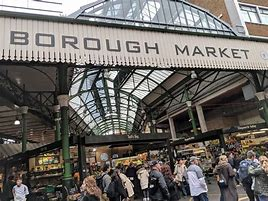

= Lesson 19
:toc: left
:toclevels: 3
:sectnums:

'''

==

Soviet *Foreign Minister* Eduard Shevardnadze said today that some Soviet troops will begin pulling out of Afghanistan within a few days. +
苏联外交部长爱德华·谢瓦尔德纳泽今天表示，部分苏联军队将在几天内开始从阿富汗撤军。

The remarks came during 在……期间 *a news conference* held in Ottawa. +
上述言论是在渥太华举行的新闻发布会上发表的。

Shevardnadze told reporters, "We would like *to see our boys back home* as soon as possible." Shevardnadze is now in Mexico where he will meet with top government officials over the weekend. +
谢瓦尔德纳泽告诉记者：“我们希望尽快看到我们的孩子们回家。”谢瓦尔德纳泽目前正在墨西哥，他将在周末与政府高级官员会面。

The next space shuttle mission *is planned for lift-off* （航天器的）发射，起飞，升空 on February 18th, 1988. +
下一次航天飞机任务, 计划于 1988 年 2 月 18 日升空。

Today NASA announced its *schedule of launches* for the next 7 years. +
今天，NASA 公布了未来 7 年的发射时间表。

NPR’s Daniel Zwerding reports: "The new *launch schedule* is *pretty much* 几乎；差不多 what NASA’s been predicting 预言；预告；预报 since *shortly after* 不久之后 the challenger exploded, NASA administrator James Fletcher said *the agency will shoot* for only five shuttle launches the first year, 1988, and that’s *less than* half the number that NASA had been planning for this year until the accident happened. +

据NPR新闻的丹尼尔·茨沃丁报道:“新的发射时间表, 与NASA在挑战者号爆炸后不久所预测的基本一致，NASA局长詹姆斯·弗莱彻表示，该机构将在1988年的第一年只发射5次航天飞机，这还不到NASA今年计划发射次数的一半，直到事故发生。

.案例
====
.pretty ˈmuch/ˈwell
( BrE also also pretty ˈnearly ) ( NAmE also also pretty ˈnear ) ( informal ) almost; almost completely 几乎；差不多 +
=> One dog *looks pretty much like* another to me. 在我看来，狗长得都差不多。
====

Fletcher said NASA will slowly *work its way* 缓慢或困难地将自己移入或移出特定位置 up to 16 launches a year in the early 1990s. +
弗莱彻表示，NASA 将在 20 世纪 90 年代初慢慢将发射次数增加到每年 16 次。

.案例
====
见韦氏词典 +
https://www.merriam-webster.com/dictionary/work%20one%27s%20way

.work one's way
1: to move oneself into or out of a particular position slowly or with difficulty
：缓慢或困难地将自己移入或移出特定位置 +
=> I worked my way to the center of the crowd. 我努力走到人群中央。 +
=> They started *working their way* cautiously down the side of the mountain. 他们开始小心翼翼地走下山坡。 +
=> He had worked his way into her heart. 他已经用自己的方式走进了她的心里。 +
=> She is slowly working her way to the top of the company. 她正在慢慢地走向公司的高层。 +

2: to have a job that helps pay for expenses while going to college/school
：有一份工作可以帮助支付上大学/学校的费用 +
=> She is working her way through law school. 她正在法学院学习。
====

And *as* administration officials have been predicting, those shuttles will carry a much different mix of cargoes than the shuttles of the past. +
正如政府官员预测的那样，这些航天飞机将运载与过去的航天飞机截然不同的货物组合。

For at least the first three years, military projects will fill more than half the flight. +
至少在前三年，军事项目将占据一半以上的航班。

The Pentagon is *way (ad.)很远；大量 behind* 远远落后 launching secret Star Wars tests and military *communication satellites*.  +
五角大楼在发射秘密星球大战测试和军事通信卫星方面, 远远落后了。

NASA space exploration projects will get next priority (n.)优先事项；最重要的事；首要事情, such as the Galileo and Ulysses 希腊神话中男子名 satellites to study Jupiter and the sun. +
美国宇航局的太空探索项目, 将成为下一个优先事项，例如研究木星和太阳的伽利略和尤利西斯卫星。

And commercial business satellites, which were originally supposed （根据所知）认为，推断，料想 to be the financial backbone of the shuttle program, will get only a small fraction 小部分；少量；一点儿 of the space in the shuttle cargo bays 分隔间（户外或室内的，用以停放车辆、存放货物等）. +
商业卫星原本是航天飞机项目的经济支柱，但现在只占航天飞机货舱空间的一小部分。

I’m Daniel Zwerdling in Washington.  +
我是华盛顿的丹尼尔·兹韦德林。

'''

There are reports today that John Zaccaro, husband of former presidential candidate, Geraldine Ferarro, has been indicted 控告；起诉 by a local *grand jury* 大陪审团 in Queens, New York. +
今天有报道称，前总统候选人杰拉尔丁·费拉罗的丈夫约翰·扎卡罗, 已被纽约皇后区当地大陪审团起诉。

*The Associated Press* and *United Press International* 合众国际社（美国的私营通讯社） quote a source 后定 *close to* a criminal 刑法的；刑事的;犯罪的 investigation of Zaccaro, saying the indictment 控告；起诉;刑事起诉书；公诉书 is the result of *a probe 探究；详尽调查 of bribery allegations* （无证据的）说法，指控 in the awarding 颁奖 of *cable television* contracts 合同，契约. +
美联社和合合社国际社, 援引接近对扎卡罗进行刑事调查的消息人士的话说，对扎卡罗的起诉, 是对"他在授予有线电视合同过程中涉嫌受贿"的调查的结果。

The *grand jury* has been investigating the activities of Zaccaro and Michael Nussbaum, *Campaign Manager* of the late 已故的 Queens Borough  自治市镇；（城市）行政区 President, Donald Mannis. +
大陪审团一直在调查扎卡罗和迈克尔·努斯鲍姆的活动，后者是已故皇后区区长唐纳德·曼尼斯的竞选经理。

.案例
====
.borough
n./ˈbʌrə/ a town or part of a city that has its own local government 自治市镇；（城市）行政区

====

If you want to watch the next space shuttle take-off, mark your calendar for February 18th, 1988. +
如果您想观看下一次航天飞机的起飞，请将您的日历标记为 1988 年 2 月 18 日。

That is according to NASA’s official new 7-year space shuttle schedule announced today. +
这是根据 NASA 今天公布的官方新的 7 年航天飞机时间表得出的。

NPR’s Daniel Zwerdling reports: "During the first year, 1988, the agency plans (v.) to launch only 5 shuttles, less than half the number they’d been planning to launch this year until the Challenger accident happened. +
据NPR新闻的丹尼尔·茨沃德林报道:“在1988年的第一年，该机构计划只发射5架航天飞机，不到今年计划发射数量的一半，直到挑战者号事故发生。

In 1989, they’ll launch 10 shuttles, and then slowly *work their way* up to 16 flights a year in the early '90s. +
1989 年，他们将发射 10 架航天飞机，然后在 90 年代初慢慢增加到每年 16 架次。

By then, the Agency officials said today, they’ll have built the new 4th safer shuttle *although* they don’t know yet  （用于否定句和疑问句，谈论尚未发生但可能发生的事） exactly where they’ll get the money and they’ll start building a permanent space station. +
该机构官员今天表示，到那时，他们将建造第四艘更安全的新航天飞机，尽管他们还不知道具体从哪里获得资金，并且他们将开始建造一个永久性空间站。

.案例
====
.yet
(ad.)used in negative sentences and questions to talk about sth that has not happened but that you expect to happen （用于否定句和疑问句，谈论尚未发生但可能发生的事）
( BrE ) +
=> I *haven't received* a letter from him *yet*. 我还没有收到他的信呢。 +
=> ‘Are you ready?’ ‘No, *not yet*.’ “你准备好了吗？”“还没有。” +
=> We *have yet to decide* what action to take (= We *have not decided* what action to take) . 我们尚未决定采取何种行动。
====

The new shuttle program looks a lot more sober than the previous one did.
新的航天飞机计划看起来比之前的要清醒得多。

"No," said NASA administrator James Fletcher, "there are no specific plans to send up another teacher or journalist.
“不，”美国宇航局局长詹姆斯·弗莱彻说，“没有具体计划派出另一名教师或记者。

Until the Challenger exploded, of course, NASA was holding a widely publicized competition to send a reporter into space." "There’s a lot of opposition from some quarters to flying any so-called civilians in space, but my bias is, that yes, in time, civilians will be flying again back in space, but certainly not in the first year.
当然，在挑战者号爆炸之前，美国国家航空航天局(NASA)举办了一场广为人知的竞赛，要求派遣一名记者进入太空。”随着时间的推移，平民将再次飞回太空，但肯定不是在第一年。

I think we want to get our act together first before we start taking a risk of that sort.
我认为，在我们开始承担此类风险之前，我们首先要齐心协力。

And as administrative officials have been predicting, the shuttles will carry a much different mix of cargoes than NASA had been planning until the accident.
正如行政官员所预测的那样，航天飞机将运载的货物组合与美国宇航局在事故发生前的计划截然不同。

The military will be much more prominent than ever before.
军队将比以往任何时候都更加突出。

For at least the first two years, the Pentagon will fill more than half the shuttle flights with secret Star Wars tests and military communication satellites.
至少在前两年，五角大楼将在超过一半的航天飞机飞行中进行秘密星球大战测试和军事通信卫星。

NASA space exploration projects will get next priority, such as the Hubble Telescope, which will see closer to the edges of the universe than any telescope in the past.
美国宇航局的太空探索项目将得到下一个优先考虑，例如哈勃望远镜，它将比过去的任何望远镜都更接近宇宙的边缘。

As for commercial business satellites, which were originally supposed to be the financial backbone of the program, most of them will be bumped for lack of space.
至于商业卫星，原本是该计划的财务支柱，但大多数都将因空间不足而被搁置。

Under President Reagan’s orders, all commercial space cargo launched in the US will eventually have to fly on private industries' own rockets.
根据里根总统的命令，所有在美国发射的商业太空货物最终都必须使用私营企业自己的火箭飞行。

I’m Daniel Zwerdling in Washington." Forbes magazine yesterday published its annual list of the 400 wealthiest people in America.
我是华盛顿的 Daniel Zwerdling。”《福布斯》杂志昨天公布了年度美国 400 名最富有的人名单。

Sam Moore Walton, founder of the Wal-Mart Department Store chain heads the list for the second year in a row with a total worth of 4.5 billion dollars.
沃尔玛百货连锁店创始人萨姆·摩尔·沃尔顿（Sam Moore Walton）连续第二年位居榜首，总资产达 45 亿美元。

Other familiar names on the list include chicken producer Frank Perdue; fashion designer Ralph Lauren, and TV producers Merv Griffin and Dick Clark, each worth more than the minimum $180,000,000 needed to get on the list.
名单上其他熟悉的名字包括鸡肉生产商弗兰克·珀杜 (Frank Perdue)；时装设计师拉尔夫·劳伦 (Ralph Lauren)、电视制片人梅尔夫·格里芬 (Merv Griffin) 和迪克·克拉克 (Dick Clark) 的身价都超过了上榜所需的最低 1.8 亿美元。

That minimum figure was up from 150,000,000 last year.
这一最低数字高于去年的 1.5 亿。

Also the number of billionaires jumped from 14 to 26.
亿万富翁的数量也从 14 人跃升至 26 人。

We asked Forbes' Editor Harry Seneker to help us interpret those figures.
我们请《福布斯》编辑 Harry Seneker 帮助我们解读这些数据。

"Well, it shows that the rich do get richer, and it also shows that we’ve been doing a little more of our homework each year.
“嗯，这表明富人确实变得更富，也表明我们每年都做了更多的功课。

It’s quite a lot of work to refine your estimates of what people’s assets are worth when they are not very eager to co-operate with you.
当人们不太愿意与你合作时，要完善你对他们资产价值的估计需要做大量的工作。

And each year we get a little better.
每年我们都会变得更好一点。

Each year we find a few new ones that we’d missed before." "And some people are left off this list because they don’t co-operate, Malcolm Forbes, for one." "Oh no, he’s in there.
每年我们都会发现一些以前错过的新内容。” “有些人被排除在这个名单之外是因为他们不合作，马尔科姆·福布斯就是其中之一。” “哦不，他就在那里。

It’s just that we wouldn’t for the life of us, say exactly where." "You started this list about 5 years ago.
只是我们一辈子都不愿意说出具体地点。” “你大约 5 年前开始列出这个清单。

Why did it start? Why do you continue to do it?" "Why? Well, it started … the short answer for why it started is that Malcolm Forbes thought that people would be interested in it and insisted on us doing it and doing it right." "But he didn’t want to cooperate himself." "Well, you run into certain problems with the IRS and inheritance taxes if you put a number on yourself.
为什么开始呢？你为什么还要继续这样做？” “为什么？嗯，它开始了……对于它开始的原因的简短回答是，马尔科姆·福布斯认为人们会对它感兴趣，并坚持要求我们这样做，并且做得正确。” “但他自己不想合作。” “好吧，如果你给自己加上一个数字，你会遇到国税局和遗产税的某些问题。

You want to negotiate that figure, or your heirs do." "Is there any commonality to how these people have achieved such wealth? Did they earn it the old-fashioned way?" "Well, at some point, everybody, every fortune had to be earned the old-fashioned way.
你想要协商这个数字，或者你的继承人想要协商。” “这些人如何获得如此财富有什么共同点吗？他们是用老式的方式赚来的吗？” “嗯，在某个时刻，每个人、每一份财富都必须用老式的方式来赚取。

And the old-fashioned way is, you set up a business that can be multiplied indefinitely beyond the limitations of your own personal efforts.
老式的方式是，你建立了一家可以无限倍增的企业，超越你个人努力的限制。

It can be an oil business, like John D.
它可以是石油业务，就像约翰·D.

Rockefeller did with the Standard Oil Trust.
洛克菲勒与标准石油信托公司就是这么做的。

It could be, you know, an organization that can produce dozens of game shows like Merv Griffin." "But of most of them that are on the list, say, this year, are they new to the list, new wealth, or is this mostly inherited fortunes?" "There’s a mix of both.
你知道，它可能是一个可以制作几十个像梅尔夫·格里芬那样的游戏节目的组织。”这主要是继承的财富？” “两者都有。

You know, the new arrivals are mostly new wealth.
要知道，新来的大多是新富。

Every once in a while, we find a branch of an old family that we really should have included.
每隔一段时间，我们就会发现一个我们确实应该包括在内的古老家族的分支。

And this year we found a few Melons out there in Pittsburgh." "Who’s the youngest on the list this year?" "One of those.
今年我们在匹兹堡发现了一些甜瓜。” “今年名单上最年轻的是谁？” “其中一个。

His name is Michael Carrier.
他的名字叫迈克尔·开利。

But, you know, he goes back to the Melons on his mother’s side." "And he is how old?" "He’s twenty-five." "And how much is he worth?" "On the order of a couple of hundred million dollars.
但是，你知道，他回到了他母亲那一边。” “他多大了？” “他二十五岁了。” “他值多少钱？” “大约几百块钱。百万美元。

You should understand with people like the Melons, it is enormously hard to get a sense of just how much is out there.
你应该明白，对于像 Melons 这样的人来说，要了解外面到底有多少东西是非常困难的。

We think we’re being conservative with that figure." "What about the oldest? Who’s the oldest on the list?" "The oldest is a lady named Dorothy Stimson Bullit.
我们认为我们对这个数字比较保守。” “那最年长的呢？名单上最年长的是谁？” “最年长的是一位名叫多萝西·史汀生·布利特 (Dorothy Stimson Bullit) 的女士。

And she’s known out in the Washington State.
她在华盛顿州很有名。

She has some radio stations and real estate out there.
她在那里有一些广播电台和房地产。

The lady is ninety-four." "Do you get any mail response from this? People write in and have comments about it?" "We get people writing in saying, 'Gee, you missed so-and-so.' Once in a while, we get somebody who writes in and says, 'You missed me.' He’s usually exaggerating." Harry Seneker, Senior Editor of Forbes magazine.
这位女士九十四岁了。” “你收到邮件回复了吗？人们写信并对此发表评论？”“我们收到人们写信说，‘哎呀，你错过了某某。’偶尔，我们会收到有人写信说：“你想念我。”他通常很夸张。”哈里·塞内克，《福布斯》杂志高级编辑。

'''
