= step 3- Lesson 20
:toc: left
:toclevels: 3
:sectnums:
:stylesheet: ../../+ 000 eng选/美国高中历史教材 American History ： From Pre-Columbian to the New Millennium/myAdocCss.css

'''

== 苏联的假撤军

The Pentagon today *called on* 呼吁; 公开请求 the highly publicized 宣传；推广；宣扬；传播 withdrawal of Soviet troops from Afghanistan *a sham* 假象；假情假义；伪善；伪装. +
五角大楼今天呼吁, 大肆宣传的苏联军队从阿富汗撤军是一场骗局。

Moscow *announced* earlier this month *that* it would complete the withdrawal of 6,000 men from Afghanistan by the end of October. +
莫斯科本月早些时候宣布，将在10月底之前完成从阿富汗撤出6000人的任务。

NPR's Allen Burlow has the story. +
NPR 的艾伦·伯洛 (Allen Burlow) 讲述了这个故事。

"The head of *the Defense Intelligence Agency*, *Lieutenant （陆军）中尉；（海军或空军）上尉 General* 陆军中将 Leonard Perutz said the Pentagon *has developed clear and convincing 令人信服的；有说服力的 evidence that* the Soviet troop withdrawals are a deception 欺骗；蒙骗；诓骗. +
“国防情报局局长伦纳德·佩鲁茨中将表示，五角大楼已经掌握了明确且令人信服的证据，证明苏联撤军是一种欺骗。

Perutz said the Soviets deliberately *inserted* additional tank and rifle 步枪；来复枪 regiments （军队的）团 *into* Afghanistan for no reason *other than* 除……之外 to withdraw them. +
佩鲁茨表示，苏联故意向阿富汗派遣更多的坦克和步枪团，除了撤军之外没有其他原因。

'*What the Soviets have done* is to remove some unneeded units and to substitute （以…）代替；取代 others, *so that* the number of military useful troops in Afghanistan *is basically unchanged*.' +
“苏联所做的, 就是撤掉一些不需要的部队, 并替换其他部队，从而使阿富汗的军事有用部队数量基本保持不变。”

Perutz said *half of the Soviet units withdrawn* were for air defense. +
佩鲁茨说，撤出的苏联部队中, 有一半是防空部队。

Since the Afghani Mujahidin rebels *have no air force*, Perutz said, the Soviet withdrawals *have no military significance*. +
佩鲁茨说，由于阿富汗圣战者叛乱分子没有空军，因此苏联的撤军没有军事意义。

Perutz said *the withdrawals* were designed *to enhance General Secretary Gorbachev's image* at home and abroad. +
佩鲁茨表示，撤军是为了提升戈尔巴乔夫总书记在国内外的形象。

He said about 116,000 Soviet troops *remain in Afghanistan*. +
他说，大约有116,000名苏联士兵仍留在阿富汗。

I'm Allen Burlow in Washington."  +
我是华盛顿的艾伦·伯洛。”

'''

== 矿工罢工

South African's *black miners* have observed 遵守（规则、法律等）;庆祝；庆贺；欢度 a one-day strike *to mourn (v.)（因失去…而）哀悼，忧伤 the death of* one hundred and seventy-seven of their co-workers *killed in a fire* at the Kinross *gold mine* last month. +
南非黑人矿工举行了为期一天的罢工，悼念上个月在金罗斯金矿火灾中丧生的 177 名同事。

Workers in other industries also *participated in* the symbolic 使用象征的；作为象征的；象征性的 action. +
其他行业的工人也参加了这一象征性行动。

Nigel Rench reports from Johannesburg. +
奈杰尔·雷奇从约翰内斯堡报道。

"More than *a quarter of a million* black miners *were on strike* to protest （公开）反对；抗议 their colleagues' deaths, about half the country's total of 600,000 gold and coal miners, costing 使丧失；使损失 *the mining industry* an estimated $4,000,000. +
“超过 25 万黑人矿工举行罢工，抗议同事的死亡，约占全国 60 万名金矿和煤矿工人的一半，采矿业损失估计为 400 万美元。

The stay-away was total at the Kinross *gold mine* where last month's disaster occurred. +
在上个月发生灾难的金罗斯金矿，人们完全没有离开。

Black miners *stayed inside* their barrack-like 营房；兵舍 hostels 宿舍，招待所（提供廉价食宿服务）;临时收容所；慈善收容所. +
黑人矿工住在营房般的宿舍里。

.案例
====
.hostel

====

Reporters were barred from the mine. +
记者被禁止进入矿井。

In central Johannesburg, *a protest meeting* was held by the Black National need never Union of Mineworkers *which called the strike action*. +
在约翰内斯堡市中心，全国黑人矿工联盟举行抗议会议，号召罢工行动。

A union spokesman *said* miners had gathered *not to mourn*, but *to commit 承诺，保证（做某事、遵守协议或遵从安排等） themselves to* liberation (n.)解放，解放运动；解脱；释出，放出 from apartheid (n.)种族隔离（前南非政府推行的政策） and *economic exploitation* 剥削；榨取. +
一位工会发言人表示，矿工们聚集在一起并不是为了哀悼，而是为了致力于摆脱种族隔离和经济剥削。

White church leader, Bayers Nordea, told the crowd, 'The accident at Kinross *need never 永远不需要 have occurred*, and the one hundred and seventy-seven men *need not have died*.'   +
白人教会领袖拜尔斯·诺迪亚 (Bayers Nordea) 告诉人群，“金罗斯的事故本来就不会发生，一百七十七人也不一定会死。”

For National Public Radio, this is Nigel Rench in Johannesburg." +
我是国家公共广播电台的奈杰尔·伦奇 (Nigel Rench)，在约翰内斯堡。”

'''

== 阿拉伯的前石油部长 Sheik Ahmed Zaki Yamani

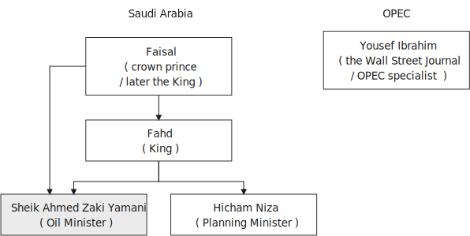

The King of Saudi Arabia *has removed* Sheik Ahmed Zaki Yamani *as* Saudi Arabia's *Oil Minister*. +
沙特阿拉伯国王, 已解除谢赫·艾哈迈德·扎基·亚马尼 (Sheik Ahmed Zaki Yamani) 的沙特阿拉伯石油部长职务。

Yamani had *held the job* for twenty-four years. +
亚马尼担任这一职务已经二十四年了。

Although *it's been rumored* 谣传；传说 for a few years *that* Yamani was *out of favor 失宠于……；不受……的欢迎 with* the King, *his firing* shocked (v.) the oil market. +
尽管几年来一直有传言称亚马尼不受国王青睐，但他的解雇震惊了石油市场。

Yamani's replacement （尤指工作中的）接替者，替代者, Hicham Niza, is Saudi Arabia's *Planning Minister*. +
亚马尼的继任者希查姆·尼扎 (Hicham Niza) 是沙特阿拉伯的计划部长。

NPR's Barbara Mantell has details. +
NPR 的芭芭拉·曼特尔 (Barbara Mantell) 提供了详细信息。

"`主` Oil traders here in New York on *the mercantile 商业的；贸易的 exchange* `谓` said *they had no idea that* 不知道,不清楚 Yamani was about to be fired, but they *took it as a sign* that world oil prices *would start to rise*. +
“纽约商品交易所的石油交易商表示，他们不知道亚马尼即将被解雇，但他们认为这是世界石油价格将开始上涨的迹象。

Yamani had been leading (v.) OPEC *in a price war* over the past ten months. +
过去十个月，亚马尼在价格战中一直领先欧佩克。

Saudi Arabia, *the largest producer* in the cartel 卡特尔，企业联盟（通过统一价格、防止竞争来增加共同利润）, had raised its production and *created an oil glut* (n.)供应过剩；供过于求. That *lowered* (v.) the price of oil *by 50%*. +
该卡特尔中最大的生产国沙特阿拉伯, 提高了产量, 并造成了石油过剩。这使得石油价格下降了 50%。

Analysts say Saudi Arabia's King Fahd's supposedly 据信；据传；据说 *had enough of* the price war and *of* Yamani.
分析人士称，沙特阿拉伯法赫德国王应该已经受够了价格战和亚马尼。

King Fahd *has said that* he would like to see the price of oil *rise to about $18 a barrel*. +
法赫德国王曾表示，他希望看到油价升至每桶 18 美元左右。

And *at noon* today, New York time, when Saudi Arabia's new Oil Minister *called for* an emergency OPEC meeting, traders at the *mercantile exchange* frantically 紧张忙乱地；发狂似地，情绪失控地 *bid 出（价）；（尤指拍卖中）喊价 up* oil prices. +
纽约时间今天中午，当沙特阿拉伯新任石油部长呼吁召开欧佩克紧急会议时，商品交易所的交易员疯狂抬高油价。

*They were betting 下赌注（于）；用…打赌 that* King Fahd and his new Minister *were going to try to set a new policy* of higher prices in motion 动议；提议. +
他们押注"法赫德国王和他的新部长将尝试制定一项提高价格的新政策"。

I'm Barbara Mantell in New York."  +
我是纽约的芭芭拉·曼特尔。”

Sheik Ahmed Zaki Yamani *is generally regarded as* the mastermind （极具才智的）决策者；主谋；出谋划策者 behind the Arab oil strategy of the 1970s. +
谢赫·艾哈迈德·扎基·亚马尼 (Sheik Ahmed Zaki Yamani) 通常被认为是 20 世纪 70 年代阿拉伯石油战略的幕后策划者。

The man who *introduced* the word "petro-dollars" *into* our vocabulary, and who helped *bring about* 引起，导致，促成 one of the most dramatic shifts of international economic and *political power* in this century. +
他将“石油美元”一词引入了我们的词汇，并帮助实现了本世纪国际经济和政治力量最戏剧性的转变之一。

NPR's Elizabeth Coulton has a report: Yamani *was appointed to* the post of Saudi *Minister of Petroleum 石油；原油 and Mineral Resources* in 1962, and *it was then* he began leading the campaign *to wrest* (v.)攫取，抢夺（权力） control of Arab oil resources *from* foreign-owned companies. +
美国国家公共广播电台的伊丽莎白·库尔顿报道称，亚马尼于1962年被任命为沙特石油和矿产资源部长，从此他开始领导"从外资公司手中夺取阿拉伯石油资源控制权"的运动。

.案例
====
.WREST STH FROM SB/STH
( formal ) +
(1) to take sth such as power or control from sb/sth with great effort 攫取，抢夺（权力） +
(2) to take sth from sb that they do not want to give, suddenly or violently 抢，夺（物品）
====

He was only thirty-two years old /when he *took over* 接管 (公司),接替 his country's oil ministry.
他接管国家石油部时年仅三十二岁。

But he was then among the few Saudis *to have had higher western education*, including, in his case, *legal training* at Harvard. +
但他是当时少数接受过西方高等教育的沙特人之一，其中包括在哈佛大学接受过法律培训。

Although Yamani *was only a commoner* 平民 in the Kingdom, `主` some members of the royal family `谓` *had begun to recognize the contribution* 后定向前推进 such a technocrat *could make to* the Saudi government. +
尽管亚马尼只是沙特王国的一个平民，但一些王室成员已经开始认识到, 这样一个技术官僚可以为沙特政府做出的贡献。

Then *crown  王冠；皇冠；冕 prince* 王储，皇太子 Faisal , later the King, championed  为…而斗争；捍卫；声援 young Yamani and *gave him a clear mandate* （政府或组织等经选举而获得的）授权; 委托书；授权令 to do *whatever necessary* to keep his country's oil benefits *home (v.) in* Saudi Arabia. +
当时的王储费萨尔（后来的国王）支持年轻的亚马尼，并明确授权他采取一切必要措施，将国家的石油利益留在沙特阿拉伯。

.案例
====
.home (v.) ˈin on sth
(1) to aim at sth and move straight towards it 朝向，移向，导向（目标） +
• The missile *homed (v.) in on the target*. 导弹正向目标飞去。

(2) to direct your thoughts or attention towards sth 把（思想、注意力）集中于 +
• *I began to feel* I was really *homing (v.) in on the answer*. 我开始觉得我快找到答案了。
====

A natural diplomat  外交官;善于交际的人, Yamani quickly became *the unproclaimed 尚未正式宣布的 leader* of the Organization of Arab Petroleum 石油，原油 Exporting Countries *as well as* the global cartel, OPEC. +
作为一名天生的外交官，亚马尼很快成为阿拉伯石油输出国组织以及全球卡特尔 OPEC 的秘密领导人。

In November and December of 1973, Sheik Yamani *toured (v.) western capitals* to explain OPEC's *radical policies*, including *why oil prices were going to go up by 70%*. +
1973 年 11 月和 12 月，谢赫·亚马尼 (Sheik Yamani) 访问西方国家首都，解释 OPEC 的激进政策，包括为什么油价将上涨 70%。

His announcement *shocked the world* and his name *became an international household (a.)家喻户晓的 word*. +
他的宣布震惊了世界，他的名字也成为国际家喻户晓的词。

In London, one journalist *wrote* at the time *that* Sheik Yamani of Saudi Arabia was *the most formidable 可怕的; 令人敬畏的 eastern emissary* 特使；密使 to arrive (v.) in Europe since the Tartars 鞑靼人 *swept into* Russia /or the Muslim hordes 一大群人 reached (v.) the walls of Vienna 维也纳（奥地利首都） in the Middle Ages. +
在伦敦，一位记者当时写道，自中世纪鞑靼人入侵俄罗斯, 或穆斯林游牧部落攻入维也纳城墙以来，沙特阿拉伯的谢赫·亚马尼是到达欧洲的最强大的东方使者。

In 1975, Yamani *was the target* when terrorists seized OPEC headquarters in Vienna and *took* the ministers *hostage* for several days. +
1975年，恐怖分子占领了维也纳欧佩克总部，并将部长们扣为人质几天，亚马尼成为目标。

Ever since, then, Yamani *surrounded himself with* tough British bodyguards 保镖，警卫, and he *kept his movements secret*. +
从那时起，亚马尼就被强硬的英国保镖包围着，他对自己的行踪保密。

Whenever he was seen abroad, he appeared *as a superstar* with his entourage （统称）随行人员，随从. +
每当他在国外露面时，他都会以超级巨星的姿态与随行人员一起出现。

At home, in the royal kingdom however, his position was somewhat different. +
但在国内，在王国，他的地位却有些不同。

He *remained a commoner* and, consequently 因此；所以, always *an outsider*, useful to the monarchy 君主制；君主政体;君主国; 君主及其家庭成员 only *as a technocrat* 技术专家官员；技术官僚 who could *manage* Saudi wealth *for* the true owners, the royal family. +
他仍然是一个平民，因此始终是一个局外人，只有作为一个技术官僚才能对君主制有用，他可以为真正的所有者王室管理沙特的财富。

Sometimes, at OPEC meetings, he would *have to* fly back home *to consult （与某人）商议，商量（以得到许可或帮助决策） with* the King before proceeding (v.)继续做（或从事、进行） with negotiations. +
有时，在欧佩克会议上，他必须飞回国内与国王协商，然后再进行谈判。

At such times, `主` ministers from *revolutionary  革命的 member* states (n.), like Iran, `谓` would *criticize* Yamani *for* being only a lackey 仆人；用人;被当作仆人看待者；卑躬屈膝的人；狗腿子 with no power *to make decisions on his own*. +
在这种时候，伊朗等革命成员国的部长们就会批评亚马尼只是一个"没有权力自己做决定的走狗"。

At the same time, many observers *believe that* Yamani's ouster (n.)罢免；废黜；革职 yesterday *was caused by* King Fahd's irritation 恼怒，生气 with Yamani's power 后定向前推进 *base outside the kingdom*. +
与此同时，许多观察家认为，亚马尼昨天被罢黜, 是因为法赫德国王对亚马尼在王国之外的权力基础感到恼火。

OPEC specialist, Yousef Ibrahim of the Wall Street Journal , say Yamani *got caught between demands*. +
欧佩克专家、《华尔街日报》的优素福·易卜拉欣表示，亚马尼陷入了各种要求之间。

Yamani is also said to be *an extremely sensitive and religious man*. +
据说亚马尼也是一位极其敏感和虔诚的人。

*He has been concerned 让（某人）担忧 that* peoples of the world should try to understand each other.
他一直忧虑并希望世界各国人民应该努力相互理解。

For example, in a conversation  （非正式）交谈，谈话 once with this reporter, Sheik Yamani said `主` he believed all world leaders, like himself, `谓` should *have at least an introductory  入门的；初步的 course* in social anthropology 人类学 *in order to* be tolerant (a.) of other cultures. +
例如，谢赫·亚马尼在接受本报记者采访时表示，他认为所有世界领导人都像他自己一样，至少应该学习社会人类学入门课程，以便能够包容其他文化。

The cosmopolitan 接触过许多国家的人（或事物）的；见过世面的；见识广的 Sheik Yamani *will be remembered as* not only a wizard 行家；能手；奇才;（传说中的）男巫，术士 of oil economics, but perhaps more *as* a leading diplomat who *brought the Arab world into the fore again*, and *changed the course of* late twentieth century history. +
国际化的谢赫·亚马尼, 不仅会被人们铭记为一位石油经济奇才，或许更会被视为一位杰出的外交家，他再次将阿拉伯世界推向前台，并改变了二十世纪后期的历史进程。

I'm Elizabeth Coulton in Washington. +
我是华盛顿的伊丽莎白·库尔顿。

'''

== 菲律宾的美军基地

https://www.kekenet.com/Article/201806/557482.shtml

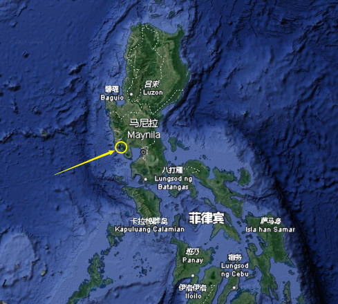

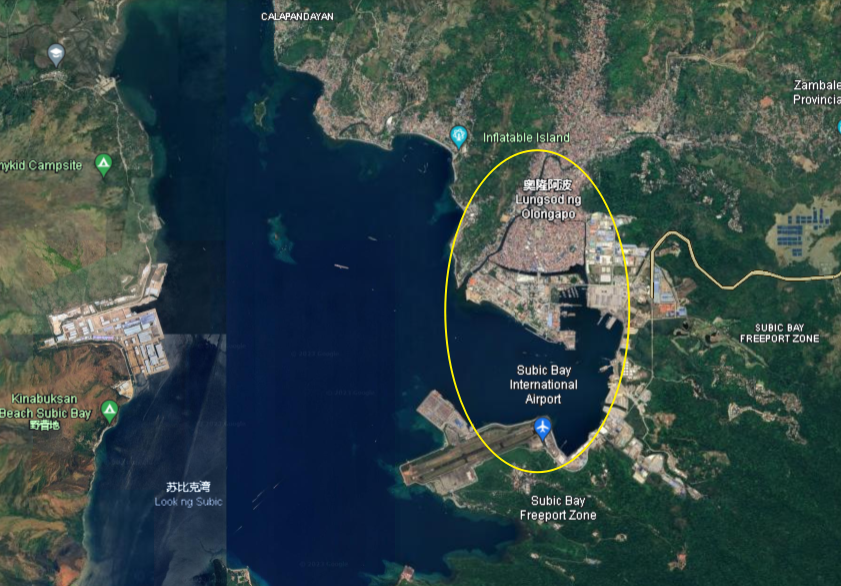

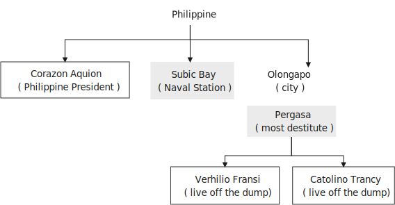

This week in the United States, the Senate voted to reject the $200,000,000 in additional aid to the Philippines. +
本周，美国参议院投票否决了向菲律宾提供的 2 亿美元额外援助。

*That money was approved by the House* after President Corazon Aquion *delivered 发表；宣布；发布 an emotional address to* a *joint session of Congress* 国会的联席会议 during her visit a few weeks ago. +
几周前，总统科拉松·阿奎翁访问期间，在国会联席会议上发表了激动人心的讲话后，这笔资金获得了众议院的批准。

In that speech, Aquion thanked those law-makers who, she said, had *balanced* 平衡;使抵消，均衡 US strategic interests *against* human concerns /and *turned* US policy *against*  (使)转为反对 Ferdinand Marcos. +
在那次演讲中，艾奎诺感谢议员们在美国利益与人道主义关切之间做了平衡，制定政策反对了费迪南德·马科斯。

However, `主` the conflict *between* strategic US defense interests *and* the everyday human needs of Filipinos `谓` remains at the heart of US-Philippine relations. +
然而，美国的战略国防利益, 与菲律宾人的日常需求之间的冲突, 仍然是美菲关系的核心。

*It was a major issue* in the Senate debate *over* increased economic aid *when concerns were raised* about *the Philippines' commitment* to retaining  保持；持有；保留；继续拥有 two major US military bases. +
在参议院关于增加经济援助的辩论中，这是一个主要问题，当时有人对"菲律宾承诺保留两个主要的美国军事基地"表示担忧。

*Nowhere* is this conflict more tangible 可触摸的；可触知的；可感知的 /*but* 除了；除…之外 in Philippine base towns themselves.
除了菲律宾的基地城镇本身之外，这种冲突在任何地方都最为明显。(换言之, 就是除了菲律宾基地城镇以外, 在其他地方的冲突都是非常明显的) /这个冲突在美国军事基地所在的城镇, 表现的最为明显了。

NPR's Allen Burlow has a report: `主` *The frightening roar* and *fearful symmetry* 对称 of *an F-4 Phantom 鬼魂；幽灵;幻觉；幻象 Fighter plane* `谓` *racing （使）快速移动，快速运转 down* 疾驰而下 the runway of Subic Bay （海或湖的）湾 Naval Station, *are quickly lost* in wonder *as the 23-ton Phantom arches (v.)（使）成弓形 gracefully into the blue morning sky* and *disappears among the clouds of* the South China Sea. +
NPR 的艾伦·伯洛 (Allen Burlow) 发表了一篇报道：一架 F-4 幻影战斗机, 有着令人恐惧的轰鸣声, 和可怕的对称性, 在苏比克湾海军基地跑道上高速滑下，并且在人们的惊叹声中，这架 23 吨重的幻影战斗机, 很快又带着拱形的飞翔轨迹, 优雅地飞入清晨的蓝色天空中，消失在南海的云层之中。

.案例
====
.arch
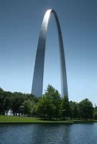

.F-4 Phantom Fighter plane
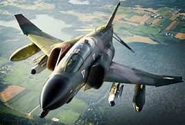

.Subic Bay
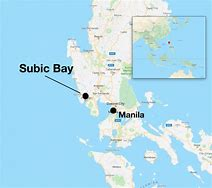
====

*The exact nature 基本特征；本质；基本性质 of today's mission* is unknown. +
今天任务的确切性质尚不清楚。

Perhaps it is *a routine 常规的；例行公事的；日常的 exercise*, or *training hours* for a young pilot on *one of the more than 200 daily flights* from Subic Bay. +
也许这是一次例行演习，或者是一名年轻飞行员在每天从苏比克湾起飞的 200 多个航班中的一个的训练时间。

*It is impossible to say* what thoughts occupy (v.) this pilot's mind, whether they *pertain 存在；适用 to* 与…相关；关于 the endless briefings 传达指示会；情况介绍会;详细指示；详情介绍 on *the strategic importance* of Subic Bay, *to* the threat of communism, *to* the issues of nuclear war, or *to* the *theoretical 理论上的 battles* of superpower strategists  战略家 who *have* him *racing through the heavens* away from the city of Olongapo. +
不可能说清楚这位飞行员脑子里在想什么，无论是在想 关于苏比克湾战略重要性的无休止的简报、共产主义的威胁、核战争问题，还是超级大国战略家的理论斗争。正是这些理论家, 让他从Olongapo起飞, 来到这里。

.案例
====
.PERTAIN TO STH/SB
( formal ) to be connected with sth/sb 与…相关；关于 +
• the laws *pertaining to adoption* 有关收养的法律
====

`主` Olongapo, located about 50 miles northwest of Manila, `系` *is the city* just outside the Sublic Bay Naval Station. +
奥隆阿波位于马尼拉西北约 50 英里处，是苏布利克湾海军基地外的城市。

Olongapo is *where the Filipinos live* and *where the Americans come to play*. +
奥隆阿波是菲律宾人居住的地方，也是美国人来玩耍的地方。

In a way 在某种程度上；不完全地, Olongapo is *a microcosm 缩影；具体而微者 of the tensions* in US-Philippine relations. +
某种程度上，奥隆阿波事件是美菲关系紧张的一个缩影。

.案例
====
.in a ˈway | in ˈone way | in ˈsome ways
to some extent; not completely 在某种程度上；不完全地 +
• *In a way* it was one of our biggest mistakes. 从某种意义上来说，这是我们所犯的最大错误之一。
====

Before *the Subic Bay installation* was built, Olongapo was *little more than* 只不过是 a fishing village. +
在苏比克湾设施建成之前，奥隆阿波只不过是一个渔村。

Today, the local economy benefits from tens of millions of dollars spent there annually. +
如今，当地经济每年受益于数千万美元的支出。

At the same time, `主` *the extraordinary  意想不到的；不平常的；不一般的；非凡的；卓越的 and pervasive 遍布的；充斥各处的；弥漫的 influence* of Sbic Bay *on the economy and culture of Olongapo* and *the Philippines 菲律宾 as a whole* `谓` has led many Filipinos to question (v.) *whether the base should be allowed to stay*. +
与此同时，Sbic湾对奥隆阿波乃至整个菲律宾的经济和文化, 产生了非凡而普遍的影响，这让许多菲律宾人质疑是否应该允许该基地留下来。

On any given day, there are 10,000 Americans at Subic Bay. They *deal with* the big issues like nuclear war and communism. +
每一天，苏比克湾都有一万名美国人。他们处理核战争和共产主义等重大问题。

But Philippine President Corazon Aquino *must deal with more mundane 单调的；平凡的 matters*, like *the economic crisis* her country faces *in places like* Olongapo and *places like* Pergasa. +
但菲律宾总统科拉松·阿基诺, 必须处理更平凡的事务，比如菲律宾在奥隆阿波和佩尔加萨等地面临的经济危机。

Pergasa *is the barrel* where the city of Olongapo *dumps its garbage*. It is also home for *the city's most destitute* (a.)贫困的；贫穷的；赤贫的. +
Pergasa 是奥隆阿波市倾倒垃圾的桶。即, 它也是该市最贫困人口的家园。

.案例
====
.destitute
--> de-, 不，非，使没有。-stit, 站，词源同stand, institute.即使无立足之地，引申义贫困。
====

While Pergasa *is separated from* the Subic Bay Naval Station *by only a few yards*, `主` a moat  护城河 of *raw  未经加工的；自然状态的;未经处理的；未经分析的；原始的 sewage* （下水道的）污水，污物, and a fence of *barbed 有倒钩的; 挖苦的；伤人的；带刺的 wire*, the concerns of its residents `谓` *could not be more* distant 再遥远不过了;再也不能更……了. +
虽然珀加萨离苏比克湾海军基地只有几码远，但污水沟、铁丝网和居民的担忧, 让这两个地方犹如万里之隔。

.案例
====
.barbed wire
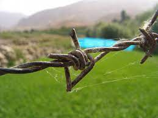
====

Verhilio Fransi has lived here almost 10 years. +
Verhilio Fransi 在这里住了近 10 年。

He, his wife, and 8 children, occupy 使用，占用（空间、面积、时间等） a one-room *scrap 废料；废品;碎片，小块（纸、织物等） wood shack* 简陋的小屋；棚屋. +
他、他的妻子和 8 个孩子住在一间只有一间房间的废木棚屋里。

.案例
====
.shack
a small building, usually made of wood or metal, that has not been built well 简陋的小屋；棚屋 +
--> 可能来自 shake 方言变体，引申词义棚屋，摇晃的破屋。

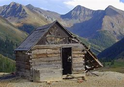
====

They *live off* 依赖 (某人) 生活 the dump 垃圾场；废物堆, collecting bottles and plastic cartons （尤指装食品或液体的）硬纸盒，塑料盒，塑料罐；硬纸盒（或塑料盒）所装物品. +
他们靠垃圾场为生，收集瓶子和塑料纸盒。

.案例
====
.carton
a light cardboard or plastic box or pot for holding goods, especially food or liquid; the contents of a carton （尤指装食品或液体的）硬纸盒，塑料盒，塑料罐；硬纸盒（或塑料盒）所装物品 +
--> 来自词根cart, 卡片，词源同card, chart. +
• a milk carton/a carton of milk 牛奶盒；一盒牛奶

====

"In one day, we get almost forty-five, fifty pesos 比索（多个拉美国家和菲律宾货币单位）, in one day." +
“一天之内，我们几乎赚了四十五、五十比索。”

.案例
====
.peso
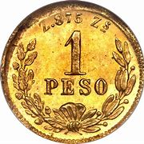
====

"And who does the work, you or all your children?" "All of us." +
 “谁来做这项工作，你还是你所有的孩子？” “我们所有人。”

"All of you together. You make forty-five pesos." "All of us in one day." +
“你们大家一起。你赚四十五比索。”“我们所有人一天。”

"And do you also find food here or not?" "We got … ​we found food, but it's canned 罐装的；听装的 foods." +
“你也在这里找到食物吗？”“我们有…… ​我们找到了食物，但都是罐头食品。”

"Can you eat that food?" "Sometimes, but when it tastes no good, we throw it."  +
“你能吃那种食物吗？”“有时，但当味道不好时，我们就会把它扔掉。”

Fransi says *some days* his children go hungry. `主` *The earnings* he mentioned *for his family of ten* `谓` come to about $2 a day. +
弗兰西说，有时他的孩子们会挨饿。他提到他一家十口人的收入约为每天 2 美元。

In the local dialect  地方话；土话；方言, Pergasa means hope. +
在当地方言中，Pergasa 的意思是希望。

Last year, Verhilio Fransi found a *solid 纯质的；纯…的；全…的 gold bracelet* 手镯；手链；臂镯 in the dump 垃圾场；废物堆. He sold it for about $10. +
去年，Verhilio Fransi 在垃圾场发现了一条纯金手镯。他以大约 10 美元的价格出售了它。

In Pergasa, you breathe (v.) the unmistakable 不会弄错的；确定无疑的；清楚明白的 *acrid （气、味）辛辣的，难闻的，刺激的 smoke* of smouldering （无明火地）阴燃，闷燃 garbage 后定向前推进 *coughed 咳嗽 up*  （从喉咙或肺中）咳出 by fires that never *go out*  (燃烧物) 熄火. +
在佩尔加萨，你会呼吸到由永不熄灭的大火所产生的阴燃垃圾, 所带来的明显辛辣烟雾。

In Pergasa, there are *thick clouds of* flies, millions of flies humming 哼（曲子） their *monotonous 单调乏味的 song of* decay 腐烂；腐朽 as they *swarm 成群地飞来飞去;成群地来回移动 about* the mountains of garbage 后定向前推进 rising ten, fifteen, thirty feet into the air. +
在佩尔加萨，有厚厚的苍蝇云，数以百万计的苍蝇在高十、十五、三十英尺高的垃圾山上蜂拥而至，嗡嗡着单调的腐烂之歌。

Catolino Trancy, his wife and nine children *live off* 依赖 (某人) 生活;靠…过日子 the dump. +
卡托利诺·特兰西、他的妻子和九个孩子, 住在垃圾场附近。

Near the entrance to their mud-floor shack, there is a pan 平锅；平底锅 with eight pigs and an oil drum （装油或化学剂的）大桶 *filled* above its rim （圆形物体的）边沿 *with* blood-stained 血污的 bones. +
在他们泥地小屋的入口附近，有一个平底锅，里面有八头猪，还有一个油桶，油桶里沾着血的骨头堆得高耸出了桶的边沿。

I asked Mr. Trancy why he collected these.   +
我问 Trancy 先生为什么要收集这些。

"There is a … ​that skulls  颅骨；头（盖）骨 and bones." "And how much money do you get for skulls and bones?" "About seventy-five centavos 分（菲律宾以及拉丁美洲的货币单位）; (拉美非洲等多国的)辅币; 等于主币的百分之一 a kilo 千克，公斤."  +
“有个地方回收骨头。” “那么头骨和骨头能卖多少钱？” “大约七十五分/一公斤。”

There is a dumpster 大型垃圾装卸卡车；垃圾大铁桶 *in front of Trancy's house* that says "*Donated to* Olongapo city by the US navy". +
 特兰西家门前有一个垃圾箱，上面写着“美国海军捐赠给奥隆阿波市”

.案例
====
.dumpster
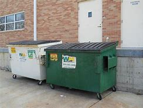
====

Another sign bears  (v.)携带;显示；带有;有（某个名称） one of the slogans of a former mayor. It reads 写着；写成, "*It's forbidden (a.) to be lazy* in this city." +
另一个标牌上写着一位前市长的口号。上面写着：“这座城市禁止偷懒。”

Some two hundred families live (v.) here in Pergasa. Chickens and dogs and rats can be seen running about. +
大约有 200 个家庭居住在佩尔加萨。可以看到鸡、狗和老鼠到处乱跑。

A little girl *walks through* the flattened （使）变平；把…弄平 cans (n.) and the bottle caps （钢笔、瓶子等的）帽，盖, *dragging* a plastic bag *on a string* 细绳；线；带子 or *a sort of kite* 风筝. She falls into the broken glass and ashes and doesn't cry. +
有个小姑娘走过压扁了的易拉罐和瓶盖，用绳子或者风筝线一类的东西牵引着塑料袋。她掉进碎玻璃和灰烬里，但没有哭。

In the Pergasa, the houses are *of wood, tin and cardboard boxes* that say things like "This side up" or "Fragile". +
在佩尔加萨，房子是用木头、锡和纸板箱建造的，上面写着“此面朝上”或“易碎”等字样。

There's a house with a faded green "Merry Christmas" sign, another that says "God bless you". +
有一座房子挂着褪了色的绿色“圣诞快乐”牌子，另一座房子上写着“上帝保佑你”。

There is irony here for journalists, but there is no electricity or basic services. +
对于记者来说，这里很讽刺，但这里没有电力或基本服务。

The US navy is in Olongapo because it is one of the best naturally protected harbors in the world. +
美国海军驻扎在奥隆阿波，因为它是世界上自然保护最好的港口之一。

It is there because the Pentagon thinks Subic Bay is essential (a.)完全必要的；必不可少的；极其重要的 to protecting US *security interests* in Asia, the Pacific and the Indian Ocean. +
之所以在那里，是因为五角大楼认为苏比克湾对于保护美国在亚洲、太平洋和印度洋的安全利益至关重要。

But `主` whether the US will be allowed to remain in Olongapo `谓` will eventually be decided by Filipinos. +
但美国是否被允许留在奥隆阿波, 最终将由菲律宾人决定。

In a *national referendum* 全民投票；全民公决 promised by President Aquino, they will be asking *what kind of friend* the US had been, if `主` the bases `谓` *serve (v.) Philippines' security interests* as well as 和，以及 very real *human needs* of their country, if `主` the income from the base `谓` *offsets (v.)抵消；弥补；补偿 the damage* done to the structure of Philippine society and to Philippine sovereignty 主权；最高统治权；最高权威. +
在阿基诺总统承诺的全民公投中，他们将询问美国曾经是一个什么样的朋友，这些基地是否服务于菲律宾的安全利益以及该国真正的人类需求，该基地的收入是否抵消了损害这对菲律宾社会结构和菲律宾主权造成了影响。

.案例
====
.referendum
--> 来自拉丁语 referendum,参考对象，来自 referre,拿回，参考，词源同 refer.-end,动名词后缀， -um,中性格。后引申词义全民公决。
====

As this debate *heats up*, the United States *faces a difficult task* in convincing 使确信；使相信；使信服 people that its concerns *extend (v.) beyond* global issues of security *down to* the very real everyday problems faced by ordinary Filipinos. +
随着这场辩论的升温，美国面临着一项艰巨的任务，即让人们相信，它的担忧不仅限于全球安全问题，还涉及普通菲律宾人面临的非常现实的日常问题。

I'm Allen Burlow reporting. +
我是艾伦·伯洛报道。

'''
