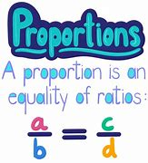
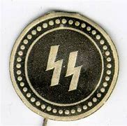
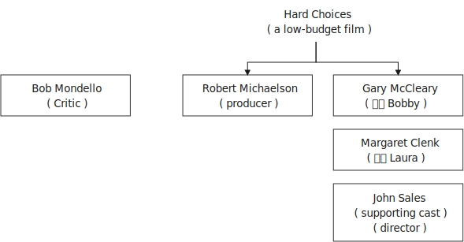
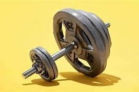

= step 3- Lesson 21
:toc: left
:toclevels: 3
:sectnums:
:stylesheet: ../../+ 000 eng选/美国高中历史教材 American History ： From Pre-Columbian to the New Millennium/myAdocCss.css

'''

== 简讯目录

A committee of scientists is *calling on* 呼吁; 公开请求 President Reagan to launch a billion-dollar information campaign *to keep* the AIDS epidemic *from* spreading to catastrophic 灾难性的 proportions 面积；体积；规模；程度;比例；倍数关系. +

[.my2]
一个科学家委员会, 呼吁里根总统发起一项耗资十亿美元的宣传活动，以防止艾滋病流行蔓延至灾难性的程度。

.案例
====
.proportion

====

The National Academy of Sciences *convened (v.)召集，召开（正式会议） the panel* which says education efforts must be used because `主` effective treatment and a vaccine `谓` *appear to be* years away. +

[.my2]
美国国家科学院召集了一个小组，表示必须采取教育措施，因为有效的治疗方法和疫苗, 似乎还需要数年时间。

The report urges (v.) the establishment of *a new federal office* to head (v.) a nationwide education effort *as well as* an advisory commission for research and education. +

[.my2]
该报告敦促建立一个新的联邦办公室, 来领导全国教育工作, 以及一个研究和教育咨询委员会。

The scientists say /the White House *should lead (v.) an action campaign* 方式状 the way *it has led (v.) a new crackdown  严惩措施; 镇压 on* illegal drugs. +

[.my2]
科学家们表示，白宫应该像领导新一轮打击非法毒品的方式一样, 领导一场行动。

Gunmen kidnapped *a French television photographer* today /as he *drove from* the Christian east *to* the Muslim western sector of Beirut. +

[.my2]
今天，一名法国电视摄影师从贝鲁特的基督教东部地区, 驾车前往穆斯林西部地区时，持枪歹徒绑架了他。

Jean Marc Srucie is the 9th French National missing and *presumed abducted* 绑架 in Beirut. +

[.my2]
让·马克·斯鲁西 (Jean Marc Srucie) 是第九位"在贝鲁特失踪, 并被推测为被绑架的"法国国民。

Two women were in the car with him *but were released*. +

[.my2]
车里有两名女子与他同在，但随后被释放。

No one has claimed responsibility. +

[.my2]
没有人声称对此负责。

'''

== 以色列起诉一名德国党卫军逃犯

*An Israeli court* has indicted (v.)控告；起诉 a retired *auto worker*, alleging （未提出证据）断言，指称，声称 he was *a Nazi death camp worker* known as "Ivan the Terrible 非常讨厌的；令人极不快的；可怕的". +

[.my2]
以色列法院起诉一名退休汽车工人，指控他是纳粹死亡集中营的工人，绰号“伊凡雷帝”。

Jam Demjanjuk is *in jail* in Israel /after being extradited  引渡（嫌犯或罪犯） and maintains *his is a case of mistaken identity*. +

[.my2]
贾姆·德米扬鲁克 (Jam Demjanjuk) 被引渡后被关押在以色列监狱，并坚称自己的身份是错误的。

.案例
====
.extradite
--> ex-出 + tra-转变,转换 + -dit-给 + -e
====

The BBC's Paul Reynolds *has more* in this report from Jerusalem. +
BBC 的保罗·雷诺兹, 在这篇来自耶路撒冷的报道中, 提供了更多信息。

"The indictment 控告；起诉 *charges* (v.) Demjanjuk *with* crimes against the Jewish people, against humanity, and with war crimes. +

[.my2]
“起诉书指控德米扬鲁克犯有反犹太人罪、反人类罪和战争罪。

He's said *to have been responsible for* herding  (v.)牧放（牲畜、兽群）;（使）向…移动 Jews into *the gas chambers* and often *stabbed (v.)（用刀等锐器）刺，戳，捅 or whipped (v.)鞭打；鞭策；以鞭打责罚；鞭笞 flesh from them* as they went in. +

[.my2]
据说他负责将犹太人赶进毒气室，并经常在他们进入毒气室时, 刺伤或鞭打他们的肉。

It's said that *he personally turned on the motors* 发动机；马达 to discharge  释放; 排出；放出；流出 the poison gas. +

[.my2]
据说，他亲自启动发动机，释放毒气。

The state of Israel *will be calling* eight former Treblinka 波兰东部一村庄名(灭绝营) inmates （监狱或精神病院等处）同住者；同狱犯人；同病房者 and *an SS guard* who will *identify* (v.) Demjanjuk *as* "Ivan the Terrible". +

[.my2]
以色列国, 将传唤八名前特雷布林卡囚犯和一名党卫军警卫，他们将指称德米扬鲁克为“伊凡雷帝”。

.案例
====
.Schutzstaffel 简称SS : 党卫队. +

[.my2]
党卫队（Schutzstaffel），为德文 Schutz（护卫、防护、亲卫）与德文 Staffel（团队、编群、队伍）的组合词，英文普遍简称为SS. +

[.my2]
为德国纳粹党内, 负责监察党纪及对党魁个人忠诚、以及执行党中央（党魁）决策命令的分部。 +

[.my2]
以此亲卫队所掌握的“治安警察”（刑事警察与盖世太保）、“秩序警察”（防暴、消防）、保安处（情报搜集）、集中营（监禁、处决）4大领域为纳粹党控制德国权力基石。

====

Demjanjuk's defense, though 不过，可是，然而, will be quite simple. He'll say he's somebody else. +

[.my2]
不过，德米扬鲁克的防守策略非常简单。他会说他是别人。

His American lawyer has been *seeking out* other camp survivors who can't support the identification, and the whole trial will resolve around this question. +

[.my2]
他的美国律师一直在寻找其他无法支持身份鉴定的集中营幸存者，整个审判将围绕这个问题解决。

Demjanjuk's trial is expected to begin at the end of the year and could take *as long as* six months. +

[.my2]
德米扬鲁克的审判预计将于今年年底开始，可能需要长达六个月的时间。

'''

== 美国一科学家小组, 呼吁美国政府关注艾滋病流行问题

Today, a panel of the nation's leading scientists and physicians *issued a major review* of the government's response (n.) to the AIDS epidemic. +

[.my2]
今天，一个由美国顶尖科学家和医生组成的小组, 对政府应对艾滋病流行的措施, 进行了重大审查。

The panel was convened  召集，召开（正式会议）;（为正式会议而）聚集，集合 by the National *Academy of Sciences*. +

[.my2]
该小组由美国国家科学院召集。

The scientists *called for* massive increases in funding for AIDS research and education. +

[.my2]
科学家们呼吁大幅增加艾滋病研究和教育的资金。

They also urged President Reagan to lead the fight against disease. +

[.my2]
他们还敦促里根总统领导抗击疾病的斗争。

NPR's Richard Harris *has the story*: Six months ago, the Academy decided that AIDS was so serious a problem that they needed to review that nation's fight against the disease. +
NPR 的理查德·哈里斯 (Richard Harris) 讲述了这样一个故事：六个月前，学院认为艾滋病是一个非常严重的问题，因此他们需要审查该国与该疾病的斗争。

They *chose* Nobel laureate, David Baltimore *to head (v.) their panel* and enlisted 争取，谋取（帮助、支持或参与）;（使）入伍；征募；从军 *the cooperative (n.)合作的；协作的；同心协力的 of* leading (a.) health researchers. +

[.my2]
他们选择诺贝尔奖获得者大卫·巴尔的摩来领导他们的小组，并招募了领先的健康研究人员合作。

The Academy has no control over the federal budget, but they have considerable 相当多（或大、重要等）的 prestige 威信；声望；威望. +

[.my2]
该学院无法控制联邦预算，但拥有相当高的威望。

And they *banked on* 依靠；指望 that prestige today /when they *called for* a billion dollars a year *for AIDS research* by 1990. +

[.my2]
他们今天依赖着这种声望，呼吁在1990年之前每年投入十亿美元来用于艾滋病研究。

That *translates into* a four-fold increase in funding *over the next three years*. +

[.my2]
这意味着未来三年的资金将增加四倍。

Today, Chairman David Baltimore said the country should spend another billion dollars a year for AIDS education. +

[.my2]
今天，主席戴维·巴尔的摩表示，国家每年应该再花费十亿美元用于艾滋病教育。

"We are saying that `主` a program that is at all responsive (a.) 反应敏捷；反应积极 to the needs of the situation `谓` will cost billion dollars. +

[.my2]
“我们是说，一个完全满足形势需要的计划, 将花费数十亿美元。

And *we are not specifying* (v.)具体说明；明确规定；详述；详列 where that billion dollars should come from because *it's made up of* whole lot of little pieces," pieces *that should be shared by* local government and private industry. +

[.my2]
我们没有具体说明这十亿美元应该从哪里来，因为它是由很多小块组成的，”这些小块应该由地方政府和私营企业共享。

*The panel said* education efforts so far have been, *as they put it* 正如某人所说, "woefully 糟糕地；严重地；不合意地;悲惨地；忧伤地 inadequate", inadequate because officials have spent 1/8 as much money as they should have, and inadequate, they said, because health officials have been too squeamish (a.)易心烦意乱的；易恶心的；神经脆弱的 to talk about sex or to promote the use of condoms 安全套，避孕套. +

[.my2]
该小组表示，到目前为止，教育方面的努力，用他们的话说，“严重不足”，不足是因为官员们只花了应有资金的八分之一，不足是因为卫生官员过于拘谨，不愿谈论性问题，也不愿推广使用避孕套。

.案例
====
.squeamish
(a.) +
1.*easily upset*, or made *to feel sick* by unpleasant sights or situations, especially when the sight of blood is involved 易心烦意乱的；易恶心的；神经脆弱的 +

2.not wanting to do sth that might be considered dishonest or immoral 诚实谨慎的；正派的 +

3.the squeamish [ pl.] people who are squeamish 易心烦意乱的人；神经脆弱的人 +

[.my2]
• This movie is not for the squeamish. 这部电影不是给神经脆弱的人看的。
====

Baltimore said *these attitudes must change now*, because the AIDS epidemic is at critical point. +

[.my2]
巴尔的摩表示，这些态度现在必须改变，因为艾滋病流行正处于关键时刻。

"The virus has now spread widely *as far as we know* 据我们所知 outside of the high-risk groups. +

[.my2]
“据我们所知，该病毒现在已在高危人群之外, 广泛传播。

We are afraid, in fact *there is perfectly good evidence, that* such spread is possible, and are *calling for* people *to take precautions 预防措施；预防；防备 in situations* where they may not have *though 不过，可是，然而 they were at risk*."  +

[.my2]
我们担心，事实上已经有充分的证据表明这种传播是可能的，我们呼吁人们采取预防措施，即使他们目前的情况下还没得病, 但他们仍然处在风险中.

Baltimore said that `主` anyone who has sexual relations with more than one partner `谓` should take precautions against *exposure to the AIDS virus*.  +

[.my2]
巴尔的摩说，任何与不止一个伴侣发生性关系的人, 都应该采取预防措施，防止接触艾滋病病毒。

The panel said condoms are one way to avoid infection. +

[.my2]
该小组表示，避孕套是避免感染的一种方法。

The report *does not predict that* AIDS will spread rapidly *by heterosexual 异性恋者 contact* in the next five years, but *recurring 再发生；反复出现 theme* （演讲、文章或艺术作品的）题目，主题，主题思想 in the report is that *now is the time* to prevent the epidemic from becoming even worse. +

[.my2]
报告并未预测艾滋病将在未来五年内通过异性接触迅速传播，但报告中反复出现的主题是，现在是防止疫情进一步恶化的时候了。

Already more than 25,000 Americans *have been diagnosed 诊断（疾病）；判断（问题的原因） with* AIDS.

[.my2]
已有超过 25,000 名美国人, 被诊断出患有艾滋病。

Baltimore *called on* President Reagan *to declare war on* AIDS *the way* he declared war on illegal drugs. +

[.my2]
巴尔的摩呼, 吁里根总统像向非法毒品宣战一样向艾滋病宣战。

"We are talking about President *taking that form of leadership*, and *it's clear that* when the President *speaks out* on an issue *in such forceful terms* 表达方式；措辞；说法, that the whole nation *sees it in the different way*."  +

[.my2]
“我们正在谈论总统采取这种形式的领导，很明显，当总统以如此强有力的措辞就一个问题发表讲话时，整个国家都会以不同的方式看待它。”

The National Academy report, like the *Surgeon  外科医生 General's* （美国）卫生局局长，军医处长 recommendations last week, *gives* the president *a convenient 实用的；便利的；方便的；省事的 way* to take on 决定做；同意负责；承担（责任） AIDS as an issue. +

[.my2]
国家科学院的报告，就像卫生局局长上周的建议一样，为总统提供了一种便捷的方式来解决艾滋病问题。

.案例
====
.ˌtake sth/sb←→ˈon
(1) to decide to do sth; to agree to be responsible for sth/sb 决定做；同意负责；承担（责任） +

[.my2]
• I can't *take on any extra work*. 我不能承担任何额外工作。  +

[.my2]
• We're not **taking on any new clients** at present. 目前我们不接收新客户。  +

(2) ( of a bus, plane or ship 公共汽车、飞机或船只 ) to allow sb/sth to enter 接纳（乘客）；装载 +

[.my2]
• The bus stopped *to take on more passengers*. 公共汽车停下让其他乘客上车。  +

[.my2]
• The ship *took on more fuel* at Freetown. 轮船在弗里敦停靠加燃料。  +
====

Both reports *stress that* AIDS is not just a disease that can infect gay men and drug abusers 滥用者；施虐者. +

[.my2]
这两份报告都强调，艾滋病不仅仅是一种可以感染男同性恋者和吸毒者的疾病。

They say now AIDS is *a sexually transmitted 传播 (疾病) disease* that can affect anyone. +

[.my2]
他们说现在艾滋病是一种性传播疾病，可以影响任何人。

In Washington this is Richard Harris. +

[.my2]
我是华盛顿的理查德·哈里斯。

'''

== 电影 <Hard Choices>

Hard Choices is *a low-budget film* that has been well received by many critics this past summer, but that does not make it *a runaway 轻易的；迅速的；难以控制的 hit*  很受欢迎的人（或事物）. +

[.my2]
《艰难的选择》是一部低成本电影，去年夏天受到了许多影评人的好评，但这并不意味着它会大受欢迎。

In fact, its thirty-four-year-old producer, Robert Michaelson, has been found at the film's openings *passing out fliers* 小（广告）传单 in front of the theaters. +

[.my2]
事实上，人们发现, 该片 34 岁的制片人罗伯特·迈克尔森 (Robert Michaelson) 在影片开场时, 在影院前散发传单。

Critic Bob Mondello says *he shouldn't have to do that*. +

[.my2]
评论家鲍勃蒙德罗说他不应该这样做。

In a perfect world, `主` *little movies* about Tennessee kids who *get caught* on the wrong side of the law `谓` would get the publicity  （媒体的）关注，宣传，报道 they need, and film companies would *stop hyping* (v.)夸张地宣传（某事物） pre-sold blockbusters 一鸣惊人的事物；（尤指）非常成功的书（或电影） about *psychotic 精神病患;精神病的 cops*. +

[.my2]
在一个完美的世界中，关于"田纳西州孩子们陷入法律漩涡"的小电影, 会得到它们所需的宣传，电影公司也会停止过度宣传关于"精神错乱警察"的预售大片。

.案例
====
.caught
catch

.blockbuster
( informal ) something very successful, especially a very successful book or film/movie 一鸣惊人的事物；（尤指）非常成功的书（或电影） +
--> block，大块。buster, 炸开，来自burst, 爆裂，字母r脱落。
====

This is not, however, a perfect world. +

[.my2]
然而，这并不是一个完美的世界。

And *I don't want to imply (v.)含有…的意思；暗示；暗指 that* Hard Choices is a perfect movie, either. +

[.my2]
我也不想暗示《艰难的选择》是一部完美的电影。

But it's so much more involving 使陷于 and suspenseful  (故事)充满悬念的 and just *plain (ad.)（用于强调）简直，绝对地 interesting* than most of the junk Hollywood *puts out* that it makes you want to do hand flips （使）快速翻转，迅速翻动. +

[.my2]
但它比大多数好莱坞的垃圾片, 更引人入胜、更有悬念，而且更有趣，让你想翻手。

.案例
====
.plain
(ad.)( informal ) used to emphasize how bad, stupid, etc. sth is （用于强调）简直，绝对地 +

[.my2]
• *plain stupid/wrong* 简直愚蠢至极；绝对错误
====

It's the story of a rural sixteen-year-old, named Bobby, *played winningly 吸引人地；动人地；迷人地；可爱地 by* new comer （对某事尤指比赛）感兴趣的人，到场者，参加者;可能成功者 Gary McCleary, who *goes along* 与某人一起去或旅行 for the ride one evening *with* his hell-raising 引起麻烦的行为;爱胡闹的 older brothers. +

[.my2]
这是一个十六岁乡村男孩鲍比的故事，由新人加里·麦克利里出色地饰演，一天晚上，鲍比和他那些调皮捣蛋的哥哥们一起去兜风。

.案例
====
.go aˈlong with sb/sth
to agree with sb/sth 赞同某事；和某人观点一致
====

When they decide to rob a local pharmacy  药房；药店；医药柜台, Bobby stays out in the truck, and *that's where he is* when one of his brothers panics (v.)（使）惊慌，惊慌失措 and kills a policeman. +

[.my2]
当他们决定抢劫当地一家药店时，鲍比呆在卡车里. 当他的一个兄弟出于恐慌并杀死了一名警察时，他就在卡车里。

Bobby's soon on the run with his brothers, and soon in jail. +

[.my2]
鲍比很快就和他的兄弟们一起逃亡，并很快入狱。

Now, *up to this point* 到目前为止,迄今为止, this could be *any of* a dozen rebel-rousing teen movies, but Bobby's not your average teen protagonist （戏剧、电影、书的）主要人物，主人公，主角. +

[.my2]
现在，到目前为止，这可能是十几部激发叛逆的青少年电影中的任何一部，但鲍比并不是普通的青少年主角。

.案例
====
.rebel

[.my2]
叛逆者；不守规矩者

.protagonist
--> prota-,第一的，-agon,做，表演，词源同act,agent.
====

He's a sweet kid, *so* innocent 无辜的；清白的；无罪的 in fact, *that* he can't even lie to his mother, who's a bit innocent herself. +

[.my2]
他是个可爱的孩子，事实上很天真，他甚至不能对他的母亲撒谎，而他的母亲本身也有点天真。

"Bobby, **how come **为什么；怎么会 everybody says you boys took drugs? I know you wasn't sick （人）变态的，病态的." "Cause it's true. We did."

[.my2]
“博比，为什么大家都说你和哥哥抢了药呢？我不相信你们会这样做。” “因为大家说的是真的，我们确实抢了药。”

Now, `主` *talking about* the innocence of a kid who *takes drugs* `谓` may seem a little odd, but `主` what made Hard Choices such a compelling  引人入胜的；扣人心弦的;令人信服的 movie `系` is that it doesn't *settle 结束（争论、争端等）；解决（分歧、纠纷等） for* 勉强接受；将就 easy answers. +

[.my2]
现在，说一个抢了药店的孩子是纯真的, 似乎有点奇怪，但《艰难的选择》之所以成为一部如此引人注目的电影，是因为它不满足于简单的答案。

.案例
====
.settle for sth
(v.) to accept sth that is *not* exactly what you want *but* is the best that is available 勉强接受；将就 +

[.my2]
• In the end *they had to settle for a draw*. 最后，他们只好接受平局的结果。  +

[.my2]
• I couldn't afford the house I really wanted, so *I had to settle for* second best . 我真心想要的房子我买不起，所以只得退而求其次了。
====

`主` Having Bobby sit in jail `谓` is clearly not in anyone's best interests. +

[.my2]
让鲍比入狱显然不符合任何人最期待的结局。

So when his case is taken by Laura, a young social worker played by Margaret Clenk, you're mightily relieved. +

[.my2]
因此，当玛格丽特·克伦克（Margaret Clenk）饰演的年轻社会工作者劳拉（Laura）接手他的案子时，你会松一口气。

Unfortunately this kid isn't very lucky in the folks who *take a shine 光亮；光泽 to*  一眼就看上；一见钟情 him. +

[.my2]
不幸的是，在那些喜欢他的人中, 这个孩子也并没得到很幸运的结局。

.案例
====
.take a ˈshine to sb/sth
( informal ) to begin to like sb very much as soon as you see or meet them 一眼就看上；一见钟情
====

Clenk, who's probably best known as Edwena Louis in the soap opera "One Life to Live 生命只有一次", *makes* Laura *a tired activist* who's so *won over* 赢得…的支持；说服；把…争取过来 by Bobby's *lopsided 一侧比另一侧低（或小等）的；向一侧倾斜的；不平衡的 grin* and optimism (n.)乐观；乐观主义, she's soon doing something supremely 极其；极为 dumb 愚蠢的；傻的；笨的: pointing pistol at the Sheriff 县治安官，城镇治安官（美国民选地方官员）. +

[.my2]
克伦克最出名的角色可能是肥皂剧《一生一世》中的埃德温娜·路易斯，她让劳拉成为一名疲惫的活动家，她被鲍比歪着的笑容和乐观主义所征服，很快她就做出了一件极其愚蠢的事情：用手枪指着警长。

.案例
====
.win sb aˈround/ˈover/ˈround (to sth)
to get sb's support or approval by persuading them that you are right 赢得…的支持；说服；把…争取过来 +

[.my2]
• She's against the idea /but I'm sure *I can win her over*. 她反对这一想法，但我相信我能把她争取过来。

.lopsided
(a.) *having one side lower, smaller, etc. than the other* 一侧比另一侧低（或小等）的；向一侧倾斜的；不平衡的 +
--> lop,垂下，耷拉，side,边。即向一侧倾斜的。 +

[.my2]
• *a lopsided grin/mouth* 撇着嘴笑；撇嘴 +
( figurative ) +

[.my2]
• The article *presents a somewhat lopsided view of events*. 这篇文章对事情的看法显得有些片面。

====

Woman: Do you have a gun, Bobby?  +
Bobby: It's on the wall. +

[.my2]
女人：鲍比，你有枪吗？ +

[.my2]
鲍比：在墙上。

Woman: Go get it. +
Bobby: Wait a minute. +

[.my2]
女：去拿吧。 +

[.my2]
鲍比：等一下。

Woman: Go get the gun!  +
Man: Bobby, don't do it. You're making a big mistake. I'm going to have to come and get you. +

[.my2]
女：去拿枪！ +

[.my2]
男人：鲍比，别这么做。 你拿了就是铸成大错。我必须要现在将你缉拿归案。 +

Woman: Don't you want to be free? Since he's being tried 试图，努力 as an adult, that is a hard choice. +

[.my2]
女：你不想自由吗？由于他是作为成年人接受审判，这是一个艰难的选择。

Now, this may *remind you of* a real life story recently in which a lawyer in Tennessee *fell in love with* her client and helped him escape, or it may just generally *remind you of* real life. +

[.my2]
现在，这可能会让您想起最近的一个现实生活故事，田纳西州的一位律师爱上了她的委托人, 并帮助他逃跑，或者它可能只是一般地让您想起了现实生活。

One of the best things about Hard Choices is that *everything in it* seems so utterly 完全地; 彻底地 natural. +

[.my2]
《艰难选择》最好的事情之一, 就是其中的一切看起来都那么自然。

The *supporting cast* 配角, for instance, which includes *Secaucus Seven* director, John Sales. +

[.my2]
例如，配角包括《锡考克斯七号》导演约翰·赛尔斯。

It's generally terrific  极好的；绝妙的；了不起的, which *you could also say about* Rick King's *casually suspenseful (故事)充满悬念的 direction* 方向；方位;（电影导演的）指点，指示. +

[.my2]
总体来说，这部影片悬疑性很强，是匹克·金"随意就能吊人胃口"的风格。

He *keeps* you *just a little off balance*, which is wonderful. +

[.my2]
他让你有点失去平衡，这太棒了。

Unfortunately, his movie seems to *have* its Hollywood's sponsors *a little off balance*, too. +

[.my2]
不幸的是，他的电影似乎也让好莱坞的赞助商有点失衡。

Despite reviews that called *the sleeper of the summer* 黑马；意外成功的人（或事物）, Lorimar Pictures can't seem to *get handle  弄懂；理解；搞明白 on* how to sell it.

[.my2]
尽管有评论称其为夏季卧铺片，但洛里玛影业似乎不知道如何出售它。

.案例
====
.the sleeper of the summer

[.my2]
黑马；意外成功的人（或事物）：chiefly US, informal : someone or something that suddenly becomes successful in a way that was not expected. +

1.*A sleeper* is also called *a sleeper hit* in the movie,or film industry. +
2.*A sleeper*,or *a sleeper hit* is an unexpected success, esp. a film or play originally ignored or considered a failure,or unpromising or unnoticed that suddenly attains prominence or value.

[.my2]
英语 a dark horse 是中文“黑马”的话，英语 a sleeper (hit) 就是中文“爆冷门”了。

.get/have a ˈhandle on sb/sth
( informal ) to understand or know about sb/sth, especially so that you can deal with it or them later 弄懂；理解；搞明白 +

[.my2]
• *I can't get a handle on* these sales figures. 我搞不懂这些销售数字。
====

And frankly, with *major media advertising* (n.) costing what it does, if a film can't be described in a phrase of six words or less, like "crime is the disease, cobra's 眼镜蛇 the cure  药；药物；疗法". +

[.my2]
坦率地说，由于主要媒体的广告成本很高，如果一部电影不能用六个字或更少的短语来描述，比如“犯罪是疾病，眼镜蛇是治疗方法”。

Tuisel Town often has to *throw up its hands*.

[.my2]
图伊塞尔镇常常不得不举手投降。

*The thing is that* Hard Choices is just what Hollywood needs *right now*. +

[.my2]
问题是《艰难的选择》正是好莱坞现在所需要的。

*With* idiotic 十分愚蠢的；白痴般的 fantasies about talking ducks *costing* (v.) as much as $40,000,000, this is practically *the definitive  最后的；决定性的；不可更改的 small movie*, made for what most Hollywood epics 叙事诗；史诗 spend on catering （会议或社交活动的）饮食服务，酒席承办. +

[.my2]
现在很多搞噱头的影片，成本高达4000万。跟这些影片相比，这部电影绝对是小成本电影了，成本只相当于前者的伙食费。

I don't want to oversell (v.)吹嘘；过分颂扬 it. It's certainly not perfect. But it sure *makes the adrenaline 肾上腺素 flow*  流；流动. +

[.my2]
我不想过度推销它。这当然不完美。但它确实会让肾上腺素激增。

And when you *take* its budget *into account*, it's *nothing less than* 不亚于；不低于；绝不少于 amazing. +

[.my2]
当你考虑到它的预算时，你会发现它简直令人惊叹。

If the studios can't *figure out* 想出; 弄明白 how to make a picture like this work, they deserve disasters like Howard the Duck . +

[.my2]
如果制片厂不知道如何制作出这样的作品，他们遭遇像《霍华德鸭子》那样的烂片灾难, 也是应得的。

The problem is, if you want to see it, you may have to search for Hard Choices because it's not being released all at once. There are only a few prints. +

[.my2]
问题是，如果你想看它，你可能必须搜索“艰难的选择”，因为它不会立即全部发布。只有几张印刷品。

But *it's worth* asking your *local theater owner* to book (v.). +

[.my2]
但值得请当地剧院老板预订。

With summer hold-overs （在下届政府中）留任的官员 as the alternative 可供选择的事物, it makes your September movie *going an easy choice*. +

[.my2]
有了夏季的保留片作为选择，它使你的九月电影成为一个容易的选择。

Hard Choices opens (v.) tomorrow in Chicago and Minneapolis. Next weekend in San Francisco and at the Boston Film Festival. +

[.my2]
《艰难选择》明天将在芝加哥和明尼阿波利斯开幕。下周末在旧金山和波士顿电影节。

Bob Mondello was the film critic (n.)批评家；评论家；评论员 for "All Things Considered". +

[.my2]
鲍勃·蒙德罗是《考虑到一切》的影评人。

'''
