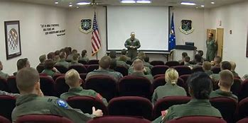
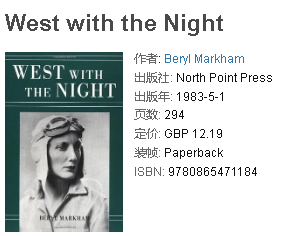
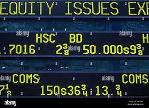
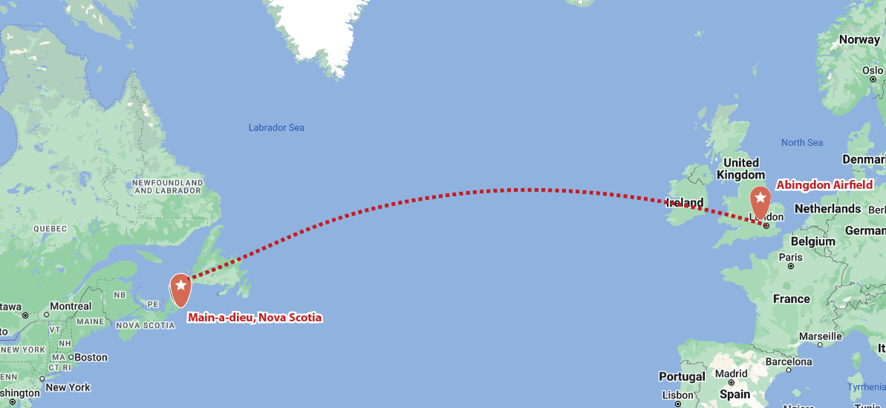

= Lesson 22
:toc: left
:toclevels: 3
:sectnums:

'''

https://www.kekenet.com/Article/201807/558819.shtml

== 国债债券

The Treasury Department announced today that it is lowering *the guaranteed 肯定的，保障的；（贷款）有担保的 interest rate* on some US *savings bonds* 储蓄债券. +
美国财政部今天宣布, 降低部分美国储蓄债券的保证利率。

.案例
====
.guaranteed interest
保本利息
====

NPR’s Barbara Mantell reports that the 1.5 point decline to 6% *came as no surprise to* investors. +
NPR 的芭芭拉·曼特尔 (Barbara Mantell) 报道称，投资者对这一比例下降 1.5 个百分点至 6% , 并不感到意外。

"The Treasury said *it is lowering (v.) the rate on savings bonds* to bring it *in line with* other *market interest rates* which have been falling all year. +
“财政部表示，将降低储蓄债券利率，使其与全年一直下降的其他市场利率, 保持一致。

For instance, money market *mutual 相互的；彼此的;共有的；共同的 funds* are now yielding 出产（作物）；产生（收益、效益等）；提供 just over 5%; five-year *treasury notes* (纸币) 国库券 are trading (v.)做买卖；做生意；从事贸易 at about 6.5%. +
例如，货币市场共同基金的收益率, 目前略高于 5%；五年期国债的交易价格约为 6.5%。

.案例
====
.mutual
(a.) +
1.used to describe feelings that two or more people have for each other equally, or actions that affect two or more people equally 相互的；彼此的 +
• *mutual respect/understanding* 相互的尊敬╱理解 +
• *mutual support/aid* 相互的支持╱帮助 +
• I don't like her, and I think the feeling is mutual (= she doesn't like me either) . 我不喜欢她，我觉得她也不喜欢我。 +

2.[ only before noun] shared by two or more people 共有的；共同的 +
• We met at the home of *a mutual friend*. 我们在彼此都认识的朋友家中会面。  +
• They soon discovered *a mutual interest* in music. 他们很快发现对音乐有着共同的兴趣。  +
====

So the government has been *paying* a premium 额外费用；附加费;额外费用；附加费 *to* people buying savings bonds, and *it’s turned out to be* an expensive way to finance (v.)提供资金 the public debt. +
因此，政府一直在向购买储蓄债券的人们支付溢价，事实证明这是一种昂贵的公共债务融资方式。

*The relatively generous 慷慨的；大方的；慷慨给予的 7.5% rate* on the bonds have made them very popular in the past few months. +
相对慷慨的7.5%利率, 使其在过去几个月非常受欢迎。

Since the beginning of August, sales have been about double (v.) the usual pace （移动的）速度；步速. +
自八月初以来，销售额约为平时的两倍。

And this week, the rush to buy savings bonds intensified (v.)（使）加强，增强，加剧 because of reports (n.) that *the Treasury* 财政部 was going to cut the rate *any day* 任何一天，任何时候, and people wanted to lock in the old rate. +
本周，由于有报道称, 财政部将随时降息，人们希望锁定旧利率，因此购买储蓄债券的热潮加剧。

Savings bonds *bought (v.) before tomorrow*, the day *the cut goes into effect*, will still yield 7.5%. I’m Barbara Mantell in New York."  +
明天之前购买的储蓄债券，也就是削减生效的那一天，收益率仍将达到 7.5%. 我是纽约的芭芭拉·曼特尔。”

'''

== 莫桑比克总统死于空难

After a meeting today of southern Africa’s *front line states*, Zambian President Kenneth Kaunda said a number of front line leaders *hold* South Africa *directly responsible* for the plane crash that killed Mozambique President Samora Machel. +
今天在南部非洲前线国家举行会议后，赞比亚总统肯尼思·卡翁达表示，一些前线国家领导人认为, 南非对莫桑比克总统萨莫拉·马谢尔遇难的空难, 负有直接责任。

Kaunda said *there was circumstantial 按情况推测的；视情况而定的；间接的 evidence* linking South Africa to the crash, but he didn’t say what that evidence was. +
卡翁达表示，有间接证据表明南非与这起事故有关，但他没有透露这些证据是什么。

.案例
====
.circumstantial
(a.) +
( law 律) containing information and details *that strongly suggest that sth is true* but do not prove it 按情况推测的；视情况而定的；间接的 +
• circumstantial evidence 情况证据 +
• The case against him was *largely circumstantial*. 对他不利的案情, 大多为间接推测的。  +

2.( formal ) connected with particular circumstances 与特定条件（或环境、情况）有关的 +
• Their problems were *circumstantial* rather than personal. 他们的困难是环境而非个人所致。  +
====

He said it’s *up to* 是……义不容辞的，是……的职责 the Pretoria government to prove to *the contrary* (n.)相反的事实（或事情、情况）. +
他说，需要比勒陀利亚政府证明事实并非如此。

.案例
====
.用于up to sb. to do sth 结构（置于系动词be之后）
1）表示“应由某人做某事”，或“某人有责任或义务做某事”。 +
- *It is up to us* to do our best to the tough problem now. 我们现在务必要尽最大努力来解决这一棘手的问题。 +
- The furniture is all ready for the room, and *it is now up to you* how the layout of it. 房间里的家具都有齐全了，现在就看你怎么来布置它了。 +

2）表示“应由某人定某事”。 +
- *It is up to you to decide* how much you should pay her for the job. 她做这项工作应该付给她多少钱，这得由你来定。 +
====

Official Soviet radio said today all clues *point to* Soviet-South African *complicity (n.)同谋；共犯；勾结 in* the death of Machel. +
苏联官方电台今天表示，所有线索都表明苏联和南非在马谢尔之死中串通一气。

'''

== 里根总统任命一名黑人职业外交官, 为美国驻南非大使

President Reagan today named (v.) a black *career (n.)生涯；职业 diplomat* to be US Ambassador to South Africa. +
里根总统今天任命一名黑人职业外交官, 为美国驻南非大使。

Edward Perkins, now Ambassador to Liberia, would succeed (v.)接替；继任；随后出现 retiring Ambassador Herman Nickel. +
现任驻利比里亚大使爱德华·帕金斯, 将接替即将退休的赫尔曼·尼克尔大使。

NPR’s Phyllis Crockett has more: "Perkins is *the third man* President Reagan has considered in three months *in his attempt* to appoint (v.) a black to this sensitive post. +
NPR新闻的菲利斯·克罗克特, 将带来详细报道:“珀金斯是三个月来, 里根总统试图任命黑人担任这一敏感职位的第三位人选。

North Carolina businessman, Robert Brown, *turned down 拒绝，顶回（提议、建议或提议人） the job* after *questions were raised* about his *business dealings* (n.) while he served in the Nixon Administration. +
北卡罗来纳州商人罗伯特·布朗, 在尼克松政府任职期间，由于有人对他的商业交易提出质疑，他拒绝了这份工作。

Then Terrance Todman, Ambassador to Denmark, turned down the job, apparently because he disagrees (v.) with *the Reagan Administration policy* towards South Africa. +
随后，驻丹麦大使特伦斯·托德曼拒绝了这份工作，显然是因为他不同意里根政府对南非的政策。

Perkins has been a foreign service officer for twenty-eight years. +
珀金斯担任外交官员已经二十八年了。

He’s fifty-eight years old and has served in Taiwan, Thailand, Ghana and at the State Department before becoming *Deputy  副手；副职；代理 Chief of the US Embassy* in Liberia in 1981. +
他现年 58 岁，曾在台湾、泰国、加纳和国务院任职，1981 年成为美国驻利比里亚大使馆副馆长。

He became Ambassador in 1985. +
1985年出任大使。

`主` Black and white South Africans *as well as* many in this country `谓` have said that *naming a black ambassador is meaningless* as long as 只要 `主` US policy toward the white-ruled government `谓` remains the same. +
南非黑人和白人以及该国许多人都表示，只要美国对"白人当道的南非政府"的政策保持不变，任命黑人大使就毫无意义。

I’m Phyllis Crockett in Washington."  +
我是华盛顿的菲利斯·克罗克特。

President Reagan today nominated *a career foreign service officer* to become the first black US ambassador to South Africa. +
”里根总统今天提名了一名职业外交官员，成为第一位美国驻南非黑人大使。

`主` *The long expected move (n.) `谓` comes* as the Senate *get set* 准备就绪;预备开始 to vote 投票（赞成╱反对）；表决（支持╱不支持）；选举 tomorrow on *overriding President Reagan’s veto of a bill* that would impose more economic sanctions on South Africa. +
这一期待已久的举措出台之际，参议院将于明天投票推翻里根总统"对一项'对南非实施更多经济制裁的法案'的否决"。

The newly named envoy 使者；使节；（谈判等的）代表 is Edward Perkins. +
新任命的特使, 是爱德华·帕金斯。

He is now the American Ambassador to the west African nation of Liberia. +
他现在是美国驻西非国家利比里亚大使。

NPR’s Phyllis Crockett has a report: It’s been three months since President Reagan *first indicated 表明；显示;暗示；间接提及；示意 his desire* to appoint a black to this sensitive post. +
NPR 的菲利斯·克罗克特 (Phyllis Crockett) 有一篇报道：距离里根总统首次表示希望任命一名黑人担任这一敏感职位, 已经过去了三个月。

Perkins is the President’s third choice. +
帕金斯是总统的第三选择。

In July, the President had planned *to name (v.) a black ambassador* during a televised speech on South Africa. +
七月，总统计划在关于南非的电视讲话中, 任命一名黑人大使。

But the man *under consideration*, businessman and former Nixon-aide （尤指从政者的）助手 Robert Brown, *withdrew his name* after *questions were raised* about his business dealings. +
但正在考虑的人是商人、尼克松前助手罗伯特·布朗，在他的商业交易受到质疑后，他撤回了自己的名字。

Then, the administration’s next choice, Terrence Todman, Ambassador to Denmark, *turned down* the job, apparently because he disagrees (v.) with the Reagan Administration policy towards South Africa. +
然后，政府的下一个选择，驻丹麦大使泰伦斯·托德曼拒绝了这份工作，显然是因为他不同意里根政府对南非的政策。

.案例
====
.turn sb/sth←→ˈdown
(v.) to reject or refuse to consider an offer, a proposal, etc. or the person who makes it 拒绝，顶回（提议、建议或提议人） +
=> *He has been turned down* for ten jobs so far. 他迄今申请了十份工作都遭到拒绝。 +
=> He asked her to marry him *but she turned him down*. 他请求她嫁给他，但是她回绝了。 +
====

*In contrast to* the President’s plan to name (v.) his first choice in a national speech, today’s announcement *came with no fanfare* (n.)号角花彩，号角齐鸣（欢迎仪式等上奏的响亮短曲）;（为庆祝而在媒体上的）喧耀. +
与总统计划在全国演讲中提名他的第一人选相反，今天的宣布并没有大张旗鼓。

.案例
====
.fanfare
(n.) +
1.[ C] *a short loud piece of music* that is played to celebrate sb/sth important arriving 号角花彩，号角齐鸣（欢迎仪式等上奏的响亮短曲） +
2.[ UC] *a large amount of activity and discussion* on television, in newspapers, etc. *to celebrate sb/sth* （为庆祝而在媒体上的）喧耀 +
• The product was launched amid much fanfare worldwide. 这个产品在世界各地隆重推出。 +
--> 拟声词，模仿号角齐鸣的声音。

====

There was no *news conference*, no *press briefing* 传达指示会；情况介绍会, no opportunity for questions today. +
今天没有新闻发布会，没有新闻发布会，没有提问的机会。

.案例
====
.briefing
(n.)[ C] a meeting in which people are given instructions or information 传达指示会；情况介绍会 +
• a press briefing 新闻发布会

====

Instead, *a notice was handed out to reporters* at the White House *that* Perkins was the President’s choice. +
相反，白宫向记者发出了一份通知，称帕金斯是总统的选择。

Apparently, the *low key* 低调的 announcement was a response to *the earlier embarrassment 窘迫；愧疚；难堪 of* some top White House officials who felt *the first two names* became public *before adequate (a.)足够的；合格的；合乎需要的 scrutiny* 仔细检查；认真彻底的审查. +
显然，这一低调的宣布, 是对一些白宫高级官员早些时候感到尴尬的回应，他们认为, 前两个名字在充被分审查之前, 就被公开出去了。

.案例
====
.adequate
(a.)*~ (for sth)~ (to do sth)* : enough in quantity, or good enough in quality, for a particular purpose or need 足够的；合格的；合乎需要的 +
• *an adequate supply* of hot water 热水供应充足 +
• The room was small but adequate. 房间虽小但够用。 +
• He didn't give *an adequate answer* to the question. 他没有对这个问题作出满意的答复。
====

They expect 预料；预期；预计 Perkins *to be easily confirmed* by the Senate. +
他们预计, 帕金斯将很容易获得参议院的批准。

Perkins has been *a foreign service officer* for twenty-eight years. He has served in Taiwan, Thailand, Ghana and in Washington, D.C. +
珀金斯担任外交官员已经二十八年了。他曾在台湾、泰国、加纳和华盛顿特区任职。

In 1981, he became the 2nd in command  控制；管辖；指挥 at the US Embassy in Liberia. In 1985, he became Ambassador. +
1981年，他成为美国驻利比里亚大使馆二把手。1985年出任大使。

.案例
====
.in command of 后通常接集体、团体、组织或人的名词，表示“指挥”的主动意义
He is *in command of* the First Division. (=The First Division is under (the) command of him.) 他指挥着第一师。（或者译为：第一师由他指挥。）

.under (the) command of 后通常接职务、职称、称呼或人的名词，表示“由……指挥”的被动含义
The army is now under the command of Zhang. 陆军现由张将军统率。

====

He is fifty-eight years old. His wife is Chinese. They have two children. +
他今年五十八岁。他的妻子是中国人。他们有两个孩子。

When President Reagan first indicated his intention to appoint a black ambassador, blacks and whites in South Africa said that naming (v.) a black will make little difference if US policy remains the same. +
当里根总统首次表示打算任命一位黑人大使时，南非的黑人和白人表示，如果美国政策保持不变，任命黑人不会有什么影响。

The Perkins announcement comes (v.) one day after President Reagan offered *to impose strong sanctions* against the South African government if Congress *drops (v.)停止；终止；放弃 its stronger sanctions*. +
帕金斯宣布这一消息的一天前，里根总统提出，如果国会放弃更严厉的制裁，他将对南非政府实施严厉制裁。

Secretary of State, George Shultz, *told* Republican senators today *that* `主` a vote *to override the President’s veto of a sanctions bill* `谓` would undermine  (v.)逐渐削弱（信心、权威等）；使逐步减少效力 his *negotiating position* in next month’s *summit meeting* with Soviet leader Mikhail Gorbachev. +
美国国务卿乔治·舒尔茨, 今天告诉共和党参议员，投票推翻"总统对制裁法案否决"这个行动, 将损害他在下个月与苏联领导人米哈伊尔·戈尔巴乔夫举行的峰会上的谈判地位。

The House *overrode (v.) the veto* yesterday. The Senate is expected to *take it up* 继续（他人未完成的事）；接着讲（以前提过的事） tomorrow. +
昨日，众议院已否决里根总统的反对。参议院将于明天进行投票。

.案例
====
.take sth←→ˈup
(v.)to continue sth that sb else has not finished, or that has not been mentioned for some time 继续（他人未完成的事）；接着讲（以前提过的事） +
• *I'd like to take up the point* you raised earlier. 我想继续谈一谈你早些时候提出的问题。
====

I’m Phyllis Crockett in Washington. +
我是华盛顿的菲利斯·克罗克特。

'''

== 飞越大西洋的第一人

Fifty years ago, British aviator 飞行员 Beryl Markham became the first person to *fly* alone *across* the Atlantic Ocean, from east to west. +
五十年前，英国飞行员贝里尔·马卡姆成为独自从东到西飞越大西洋的第一人。

Her achievement was marred (v.)破坏；毁坏；损毁；损害, though, *as were* many of her accomplishments. +
然而，她的成就和她的许多成就一样，受到了损害。

.案例
====
.mar
(v.) [ VN] to damage or spoil sth good 破坏；毁坏；损毁；损害
SYN blight ruin +
• *The game was marred* by the behaviour of drunken fans. 喝醉了的球迷行为不轨，把比赛给搅了。
====

Markham had *set out* 启程; 出发 to fly from London to New York. She *ended up* 最终到达,陷入 flying from London to Nova Scotia. +
马卡姆原定从伦敦飞往纽约。她最终从伦敦飞往新斯科舍省。

That flight and other aspects of her *extraordinary 不平常的；不一般的；非凡的；卓越的;意想不到的；令人惊奇的；奇怪的 life* are told in Markham’s book *West with the Night* . +
马卡姆的著作《夜西》讲述了那次飞行和她非凡生活的其他方面。

.案例
====
.West with the Night

.Beryl Markham
1902年10月26日—1986年8月3日. 英国女飞行员. 她的人生的主要经历（训马经历、飞行经历）都以非洲肯尼亚为中心，她也是第一位完成从英格兰到布列塔尼岛, 从东到西横越北大西洋单机飞行的人(1936年)。其回忆录<夜航西飞>.

====

This week, many public *television stations* will broadcast a documentary 纪录影片；纪实广播（或电视）节目 about Markham called "World without Walls". +
本周，多家公共电视台将播放一部关于万锦市的纪录片，名为《没有围墙的世界》。

NPR’s Susan Stanberg tells (v.) Beryl Markham’s story. +
NPR 的苏珊·斯坦伯格讲述了贝丽尔·马卡姆的故事。

New York City, September 6th, 1936, a ticker-tape  (自动收报机用)窄长纸带; (欢庆时从楼窗抛下的)彩带 parade 游行, and Mayor Fiorello LaGuardia greeting (v.)和（某人）打招呼（或问好）；欢迎；迎接 a tall, blond English woman who, just the day before, had completed a 21-hour-and-25-minute flight *across* the Atlantic, Ebbingdon, England *to* a nameless swamp 沼泽（地）, non-stop. +
1936年9月6日，纽约市，游行队伍中，市长菲奥雷洛·拉瓜迪亚向一位身材高个、金发碧眼的英国女子致意。就在前一天，她刚刚完成了21小时25分钟的飞行，飞越了大西洋，从英国的艾宾登出发, 终点是到达了一个无名的沼泽，全程不间断。

.案例
====
.ticker-tape
N-UNCOUNT *Ticker tape* consists of long narrow strips of paper on which information such as stock exchange prices is printed by a machine. In American cities, people sometimes throw *ticker tape* or other paper from high windows as a way of celebrating and honouring someone in public. (自动收报机用)窄长纸带; (欢庆时从楼窗抛下的)彩带 +

.The Flight Across The Atlantic

====

"Miss Markham, may I, *on behalf of*  代表（或代替）某人 the city of New York, *extend 提供；给予 to you, a sincere welcome* and *our congratulations* on your splendid 极佳的；非常好的 flight across the ocean."  +
“马卡姆小姐，我谨代表纽约市向您表示诚挚的欢迎，并祝贺您实现跨越大洋的精彩飞行。”

"Thank you so much. I’m so happy to be here. Thank you so much."  +
“太感谢了。我很高兴来到这里。非常感谢。”

Nine years after Lindbergh 人名(1927年飞跃大西洋), and going *in the other direction*, his *Spirit of Saint Louis*, soloed (v.)独奏，独唱；单独飞行 New York to Paris, Beryl Markham, thirty-four years old, had flown seventeen of *the twenty-one and a half hours* in fog and darkness, with no *fuel gauge* 测量仪器（或仪表）；计量器, no radio, no idea *where she was* most of the time, to crash land, after *the engine of her monoplane* died (V.) in a bog 沼泽（地区） on Cape Breton Island, Nova Scotia. +

林德伯格之后九年，也就是他的“圣路易斯精神号”从纽约飞到巴黎的另一个方向，34岁的贝丽尔·马卡姆，在21个半小时的飞行中，有17个小时是在雾和黑暗中飞行的，没有燃油表，没有无线电，大部分时间都不知道自己在哪里，在她的单翼机引擎在新斯科舍省布雷顿角岛的一个沼泽地里熄火后, 紧急降落。

The next day, she was being cheered in New York. +
第二天，她在纽约受到欢呼。

"It was a hard battle against the elements above the ocean, fog and storm, but pluck 胆识；胆量；意志 and endurance crowned (v.)为…加冕;（尤指通过增添成就、成功等）使圆满，使完美 one of the most grueling 使人精疲力尽的；艰辛的；让人受不了的 flights on record."  +
“这是一场与海洋、大雾和风暴等因素的艰苦战斗，但勇气和耐力成为有记录以来最艰苦的飞行之一。”

.案例
====
.pluck
(n.)[ U] ( informal ) courage and determination 胆识；胆量；意志 +
--> 自古英语pluccian,拔出，拉，扯，来自West-Germanic*plokken,拔，借自拉丁语pilare,拔 头发，来自pilus,头发，词源同pile,depilatory.

.grueling
--> 来自PIE*ghreu, 刮，磨，词源同grit, grind. 引申义折磨人的。
====

"I am so pleased (a.)高兴；满意；愉快 to have got here; I only wish I could come *in my own machine*." +
 “我很高兴来到这里；我只希望我能乘坐自己的飞机来。”

"And now, onto a New York hotel, to *be interviewed* by a movie maker 电影制作人, Mrs. Markham, just *what were you thinking about* while flying through all that fog and storm?" +
“现在，在纽约的一家酒店，接受电影唤醒者的采访，夫人。马卡姆，当你飞过那些大雾和暴风雨时，你在想什么？”

"Well, my one thought and ambition was to get to America."  +
“嗯，我的一个想法和野心就是去美国。”

"When above the sea, what did you eat or drink?"  +
"I didn’t have anything *until the last half hour* when I had a taste of 尝了尝,品尝 brandy."  +
“当在海上时，你吃了什么或喝了什么？” “我直到最后半个小时才进了点儿食，喝了口白兰地”

"Just one?" "No, two, I’m afraid." +
“只有一杯？” “不，恐怕是两杯。”

Aviation  航空 was very young then. Every single day *without fail* 毫不例外;一定会；必定会, there were two or three articles in the newspapers about people being killed in aircraft. It was completely new sport. +
那时航空业还很年轻。报纸上每天都会无一例外地刊登两三篇有关人员在飞机上丧生的文章。这是一项全新的运动。

Mary Lovell has just completed a biography of Beryl Markham. The book will be published next spring. +
玛丽·洛弗尔刚刚完成了贝丽尔·马卡姆的传记。该书将于明年春天出版。

The engines were not very reliable. +
发动机不太可靠。

All she had was a compass and some kind of direction-finding equipment that didn’t work very well. +
她只有一个指南针和某种不太好用的测向设备。

She really didn’t know *where she was* for a long time. +
她真的很长一段时间, 都不知道自己身在何处。

She had no idea *how far off the coast* she was, whether her fuel would last (v.). +
她不知道自己距离海岸有多远，也不知道她的燃料是否还能用。

I think *the one time in her life she has been frightened* was then. +
我想她一生中唯一一次感到害怕就是那时。

For most of her eighty-three years, Beryl Markham was indeed fearless. +
在贝丽尔·马卡姆八十三年的大部分时间里，她确实无所畏惧。

As a child growing up in Africa, she *faced down* （威风凛凛地）把某人压制下去 a marauding  (a.)(人)四处劫掠的; (动物)四处攫食的 lion. +
作为一个在非洲长大的孩子，她曾面对过一头掠夺性的狮子。

.案例
====
.face sb←→ˈdown
*to oppose or beat sb* by dealing with them directly and confidently （威风凛凛地）把某人压制下去

.marauding
--> 来自中古法语maraud,无赖，恶棍，来自mar,损害，损毁，-aud,人，含贬义，来自wield,挥舞。引申词义打劫的，劫掠的。
====

As a trainer, she forced *high-strung 高度紧张的; 易焦躁的 racehorses* 赛马 to obey her. +
作为一名驯马师，她强迫高度紧张的赛马服从她。

.案例
====
.strung
(string)的过去式和过去分词
====

As an old woman, she drove her car through a machine gun fire during an attempted coup 政变 in Kenya. She wanted to keep a luncheon date. +
在肯尼亚的一次未遂政变中，作为一名老妇人，她驾驶着自己的汽车冲过机关枪的扫射。只是为了赴约午餐。

It was simply her nature to confront danger. +
面对危险只是她的本性。

"There’s a coolness 冷静；冷漠 to her. +
“她有一种冷静。

She’s not a very trusting 轻信的；轻易信赖别人的 person." Writer Judith Theuman.
她不是一个很容易信任人的人。” 作家朱迪思·休曼写道。

"I think *any person who’s lived by her wits* would probably have developed that coolness. +
“我认为任何靠她的智慧生活的人, 都可能会发展出那种冷静。

Look at the astronauts. +
看看宇航员。

I mean, it’s a quality *that you see it* in fliers 飞行员. +
我的意思是，你可以在飞行员身份的人中, 看到这种品质。

*You see it* in sailors, or *you see it* in hunters, and Beryl was *of that stamp* 特征；痕迹；烙印; 印；章；戳;类型，种类（尤指人）."  +
你可以在水手身上看到这一点，或者在猎人身上看到这一点，而贝丽尔就是这样的人。”

There were other interpretations of Markham’s coolness. +
对于马卡姆的冷静, 还有其他的解释。

Some said she lacked the sense to be afraid. +
有人说她缺乏害怕的意识。

People often said nasty  极差的；令人厌恶的；令人不悦的;不友好的；恶意的；令人不愉快的 things about Beryl Markham, especially other women. +
人们经常说贝丽尔·马卡姆的坏话，尤其是其他女性。

It’s easy to *figure out* 弄懂；弄清楚；弄明白 why. "She was beautiful.“ She was very seductive 诱人的；迷人的；有魅力的；性感的;有吸引力的；令人神往的. She was well born. And she was strong and ambitious and fearless and smart. So, you know, it’s a lot to take 以…为例；将…作为例证." +
很容易找出原因。她很漂亮。她非常迷人。她出生得很好。她坚强、雄心勃勃、无所畏惧、聪明。所以，你知道，可以举出很多原因。”

.案例
====
.seductive
(a.) sexually attractive 诱人的；迷人的；有魅力的；性感的

.take
[ VN] used to introduce sb/sth as an example 以…为例；将…作为例证 +
• Lots of couples have problems in the first year of marriage. *Take* Ann and Paul. 在婚后头一年里，许多夫妇都出现一些问题。安和保罗就是个例子。
====

Ironically, recognition 承认；认可 did come to Beryl Markham, but only *in the last years* of her life. +
具有讽刺意味的是，贝丽尔·马卡姆确实得到了认可，但只是在她生命的最后几年。

Since *West with the Night* was reissued  重新发行；再版 three years ago, it’s sold briskly 快地；敏捷地；忙碌地. +
《夜航西飞》自三年前重新发行以来，销量十分火爆。

.案例
====
.brisk
(a.) quick; busy 快的；敏捷的；忙碌的 +
• a brisk walk 轻盈的步履 +
• Ice-cream vendors were doing *a brisk trade* (= selling a lot of ice cream) . 冰激凌小贩的生意很红火。
====

There are 300,000 copies in print now, and `主` royalties 版税 from the book `谓` gave much needed financial security. +
目前已经印刷了 300,000 册，这本书的版税, 为...提供了急需的财务保障。

*More recognition will come* with *the showing* on public television this week, *of* the documentary about her. +
本周有关她的纪录片在公共电视上播出后，将会获得更多认可。

More recognitions still, when Mary Lovell’s biography *comes out* next spring. +
当玛丽·洛弗尔的传记, 明年春天出版时，还会获得更多认可。

And another biography is *in the work* for publication in a few years. +
另一本传记即将在几年内出版。

So `主` the story of the woman who *flew (v.) west* on that difficult, dangerous night in 1936 `谓` will be told and re-told. +
因此，1936 年那个艰难、危险的夜晚，那位妇女向西飞行的故事将会被讲述和重述。

Through the darkness, *wedged 将…挤入（或塞进、插入）;把…楔牢（或楔住） between* extra fuel tanks *that had been fitted  安置，安装（在某处）;（大小、式样、数量适合）可容纳，装进 into the cabin* for the long journey, her small plane bucking (v.)猛然震荡；猛烈颠簸;抵制；反抗 fog and storms and headwinds 逆风；顶风, the Atlantic Ocean black beneath her, Beryl Markham flew west with the night, completely alone. +
穿过黑暗，贝里尔·马卡姆（Beryl Markham）挤在额外的油箱之间, 这些邮箱是为了长途旅行, 而安装在机舱内的，她的小飞机顶着雾气、暴风雨和逆风，下面是黑色的大西洋，贝里尔·马卡姆（Beryl Markham）在夜色中向西飞行，完全孤独。

.案例
====
.buck
(v.) +
1.[ V] ( of a horse 马 ) to jump with the two back feet or all four feet off the ground 尥起后蹄跳跃；弓背四蹄跳起 +

2.[ V] to move up and down suddenly or in a way that is not controlled 猛然震荡；猛烈颠簸 +
• The boat *bucked and heaved* (v.)（用力）举起，拖，拉，抛 beneath them. 小船在他们脚下猛烈颠簸着。 +

3.[ VN] ( informal ) to resist or oppose sth 抵制；反抗 +
• One or two companies *have managed to buck (v.) the trend of the recession*. 有一两家公司顶住了经济滑坡的势头。 +
• He admired *her willingness to buck (v.) the system* (= oppose authority or rules) . 他赞赏她反抗现存体制的主动性。 +

====

"You can *live a lifetime* and, at the end of it, know *more* about other people *than* you know about yourself. +
“你可以活一辈子，到最后，对别人的了解比对自己的了解还要多。 /一个人可以选择这样过一生：看过许多人，对他人的了解比对自己还多。

You learn to watch other people, but you never watch yourself because *you strive against loneliness*. +
你学会观察别人，但你从不观察自己，因为你与孤独作斗争(即你不喜欢孤独, 更喜欢与人交往, 所以也不去做内视自省)。

If you read a book or *shuffle a deck of cards*, or *care for* a dog, you are avoiding yourself. +
无论是读书、玩扑克还是照顾狗狗，其实都是在回避自己。

The abhorrence （尤指因道德原因的）憎恨，厌恶，憎恶 of loneliness is *as natural as* wanting to live at all. +
"对孤独的厌恶", 就像"对生活的渴望"一样是自然的。/厌恶孤独是人与生俱来的。

If it were otherwise, men would never have bothered *to make an alphabet*, nor *to have fashioned* (v.)（尤指用手工）制作，使成形，塑造 words *out of* what were only animal sounds, nor *to have crossed continents*, each man *to see* what the other looked like. +
如果不是这样，人类就不会费心去创造字母表，也不会用动物的声音来创造单词，也不会跨越大陆，互相看看对方长什么样。  +
/正是因为孤独，人类不厌其烦地创造了字母，
又从仅仅是动物的声音里抽离出文字；正是因为孤独，人类在洲际间跨越，想要看看未曾见过的人。

Being alone in an aeroplane, for *even so short a time* as a night and a day, irrevocably 不能取消地；不能撤回地 alone, with *nothing to observe* but your instruments and your own hands in semi-darkness. +
独自一人在飞机上，即使是短暂的一天一夜，也无法挽回地孤独，除了你的仪器和半黑暗中的双手之外，没有什么可观察的。

Nothing to contemplate (v.)考虑；思量；思忖;端详；凝视 but the size of your small courage. +
除了你小小的勇气有多大之外，没有什么值得考虑的。

.案例
====
.contemplate
(v.)to think about whether you should do sth, or how you should do sth 考虑；思量；思忖 +
SYN consider think about/of
====

*Nothing to wonder about* but the beliefs, the faces and hopes *rooted in your mind*. +
除了根植于你脑海中的信念、面孔和希望之外，没有什么值得好奇的。

Such an experience can be *as startling  惊人的；让人震惊的 as* the first awareness of stranger *walking (v.) by your side* at night. You are the stranger." +
这种经历就像晚上第一次意识到"陌生人在你身边走过"一样令人震惊。你就是是那个陌生人。”

Beryl Markham *died in Kenya* this past August. She was eighty-three. +
Beryl Markham 今年八月在肯尼亚去世。 她八十三岁了。

Her ashes 骨灰，灰烬 were scattered 撒；撒播 *from a light aircraft* over the hills at Inguro — her beloved childhood home. +
她的骨灰被一架轻型飞机撒在她心爱的童年故乡因古罗的山上。

In Washington, I’m Susan Stanberg. +
在华盛顿，我是苏珊·斯坦伯格。

'''
