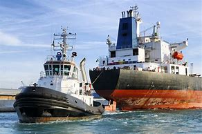
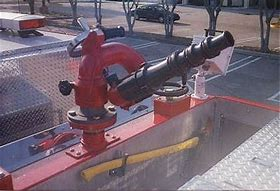
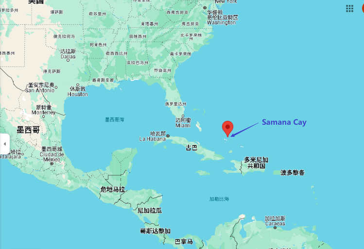
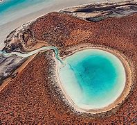

= Lesson 23
:toc: left
:toclevels: 3
:sectnums:

'''

https://www.kekenet.com/Article/201807/559711.shtml

== 简讯目录

Soviet officials have confirmed that a crippled (a.)使残疾，使伤残 nuclear submarine sank (v.)下沉；下陷；沉没 in the Atlantic early today. US officials believe the sub 潜艇 carried at least sixteen nuclear missiles. +
苏联官员证实，一艘受损的核潜艇今天早些时候在大西洋沉没。美国官员相信该潜艇至少携带十六枚核导弹。

Explosion and fire on the vessel 大船；轮船 last Friday killed three crewmen 乘务员; 船员. The rest of the crew was successfully evacuated  （从危险的地方）撤出，搬出，撤空 before the vessel sank.
+
上周五船上发生爆炸和火灾，导致三名船员死亡。其余船员在船只沉没前成功撤离。

Soviet officials say no radiation leaked (v.)漏；渗漏；泄漏 in the air or the ocean. *It’s unclear* what may have caused the explosion that led to the sinking.  +
苏联官员表示，没有辐射泄漏到空气或海洋中。目前还不清楚是什么原因导致了爆炸并导致沉没。

A news agency in Beirut *released a videotape* today with pleas from three Frenchmen *held* for more than a year *by the Islamic Jihad*. +
贝鲁特一家新闻机构今天发布了一段录像带，其中收录了被伊斯兰圣战组织关押一年多的三名法国人的请求。

Each hostage *called on* the French government *to change its policy* in the Middle East. +
每名人质都呼吁法国政府改变其中东政策。

Melody Walker reports from Paris. +
梅洛迪·沃克从巴黎报道。

'''

== 伊斯兰圣战组织扣押的法国人质

"During the twenty-eight-minute recording, the three hostages *criticized* the French government *for* failing to gain 获得；赢得；博得；取得 their release, and said *they had the impression* 印象；感想 they were being forgotten.
“在二十八分钟的录音中，三名人质批评法国政府未能释放他们，并表示他们有一种被遗忘的感觉。

*Taking turns* 轮流做 reading (v.) prepared texts, the two diplomats and one journalist *looked physically exhausted and emaciated* (a.)（常指因疾病或缺少食物而）消瘦的，憔悴的，虚弱的. +
两名外交官和一名记者, 轮流朗读准备好的文本，看上去疲惫不堪、憔悴不堪。

.案例
====
.take turns
作为“轮流”讲，应该要用 take turns（复数）， +
用法是： take turns to do sth；take turns in 或 at doing sth （in或at也可以省略，而直接接doing）。 +
- We *took turns* (in/at) guarding the treasure.(我们轮流守护那些珍宝)。 +
- We *took turns* to guard the treasure. +

.emaciated
(a.)thin and weak, usually because of illness or lack of food （常指因疾病或缺少食物而）消瘦的，憔悴的，虚弱的 +
--> e-（=ex-"out"出来）+ maci-（=long，thin长，瘦）+ -ate（动词后缀）+ -ed（形容词后缀）；瘦的骨头都露出来啦，真的是很消瘦，很憔悴了。 emaciate：[i'meisieit] v. 使憔悴，使消瘦
====

Declaring that *he was at the end of his rope*, one of the hostages said that *the government forgot about the remaining hostages* after the release of two Frenchmen in June. +
其中一名人质宣称自己已经束手无策，他说政府在六月释放两名法国人后就忘记了剩下的人质。

A total of seven French citizens *are currently held hostage* in Lebanon. +
目前共有七名法国公民在黎巴嫩被扣为人质。

`主` A communiqué （尤指对报界发布的）公报 from the Islamic Jihad *which accompanied the video cassette* `谓` *calls on* France to negotiate the release of seventeen Shi’ite prisoners 后定 jailed in Kuwait. +
录像带随附的伊斯兰圣战组织公报呼吁, 法国就释放被关押在科威特的 17 名什叶派囚犯, 进行谈判。

.案例
====
.communiqué
(n.) an official statement or report, especially to newspapers （尤指对报界发布的）公报 +

====

The French Minister for Foreign Affairs did not comment on the content of the video cassette or the demands, but said tonight that the government was doing everything possible to free the hostages. +
法国外交部长没有对录像带的内容或要求发表评论，但今晚表示政府正在尽一切努力释放人质。

For National Public Radio, this is Melody Walker in Paris."  +
国家公共广播电台报道，我是巴黎的梅洛迪·沃克。”

'''

== 洪水

*Skies are clearing over Oklahoma* where heavy rains have produced what’s being called "the worst flooding in the history of that state." Thousands of people began *returning to their homes* and officials began the task of *assessing the damage*. +
俄克拉荷马州的天空正在放晴，暴雨造成了所谓的“该州历史上最严重的洪水”。数千人开始返回家园，官员们开始评估损失。

Floods have caused millions of dollars in damage, but *specific estimates (n.) may not come* until tomorrow when *clean-up 清扫；清除（污染物）；清理；整顿 operations* are expected to start. +
洪水已造成数百万美元的损失，但具体的估计可能要到明天清理工作开始时才能得出。

'''

==  苏联核潜艇沉没

Tonight, a Soviet nuclear submarine is on the bottom of the Atlantic Ocean, damaged three days ago by a fire on board. +
今晚，一艘苏联核潜艇停泊在大西洋海底，三天前因船上起火而受损。

Officials in Washington and Moscow confirmed this morning’s sinking. +
华盛顿和莫斯科的官员今天上午证实了沉船事件。

Officials in both countries also said `主` the loss of the vessel `谓` presents no atomic threat *despite* the presence  在场；出席;存在；出现 of *both* nuclear missiles *and* a nuclear power reactor 核反应堆 on the submarine. +
两国官员还表示，尽管潜艇上装有核导弹和核动力反应堆，但该船的损失并不构成原子威胁。

NPR’s Daivd Malthus has a report: Pentagon officials say *the crippled Soviet submarine*, which normally carries sixteen nuclear missiles, each with two warheads （导弹的）弹头, *went down* （船等）下沉，沉没 just *before dawn* six hundred and eighty miles northeast of Bermuda. +
NPR 的戴夫德·马尔萨斯 (Daivd Malthus) 有一篇报道：五角大楼官员称，这艘受损的苏联潜艇通常携带 16 枚核导弹，每枚核导弹各有两枚弹头，在黎明前夕, 在百慕大东北六百八十英里处沉没。

The Soviets *put* the precise time of sinking *at 4:03 am* eastern time, and Moscow says *there was no further loss of life* aside from the three crewmen killed *when a fire broke out* Friday. +
苏联人将沉没的准确时间, 定为东部时间凌晨 4 点 03 分，莫斯科表示，除了周五发生火灾时丧生的三名船员外，没有其他人丧生。

American *surveillance （对犯罪嫌疑人或可能发生犯罪的地方的）监视 planes* observed (v.) that *towing （用绳索）拖，拉，牵引，拽 efforts were halted* （使）停止，停下 shortly after midnight. +
美国侦察机观察到，拖曳工作在午夜过后不久就停止了。

About three hours later, *the remaining crew members* were observed *abandoning ship* in an orderly and planned fashion, according to American officials. +
据美国官员称，大约三小时后，剩下的船员被发现有秩序、有计划地弃船。

The crew was rescued from *life rafts* 橡皮艇；充气船;木排；筏 by five Soviet *surface ships* in the area. +
船员们被该地区的五艘苏联水面舰艇, 从救生筏上救起。

Pentagon officials say a US *ocean-going  远洋航行的；远洋的 tugboat* 拖船 was nearby and ready to assist, but the Soviets refused any help. +
五角大楼官员表示，一艘美国远洋拖船就在附近并准备提供援助，但苏联拒绝提供任何帮助。

.案例
====
.tugboat +
A tugboat or tug is a marine vessel *that manoeuvres (V.)（使谨慎或熟练地）移动，运动；转动; 操纵；控制；使花招 other vessels* by pushing or pulling them, with *direct contact* 直接接触 or *a tow line* 拖绳.  +
These boats typically *tug (v.) ships* in circumstances where they cannot or should not move under their own power, such as in crowded harbors or narrow canals, or cannot move at all, such as barges  驳船（运河、河流上运载客货的大型平底船）, disabled  丧失能力的；有残疾的；无能力的 ships, log rafts 木筏, or oil platforms.  +
Some are ocean-going, and some are icebreakers or *salvage （对财物等的）抢救 tugs* 救助拖船.  +
Early models were powered by *steam engines*, which were later superseded  (v.)取代，替代（已非最佳选择或已过时的事物） by *diesel  柴油 engines*.  +
Many have *deluge 暴雨；大雨；洪水 gun* 水炮 water jets (n.)喷射流；喷射口；喷嘴, which help in firefighting (n.)消防; 救火, especially in harbours. +

拖船, 是一种通过"直接接触"或"拖缆"来操纵其他船只的海上船只。这些船只通常在一些情况下牵引其他船只，例如在拥挤的港口或狭窄的运河中，或者在一些情况下，被拖的船只不能或不应该靠自己的动力移动，比如驳船、失事船只、原木筏或石油平台。有些拖船是远洋船，有些是破冰型拖船, 或救援型拖船。早期的型号由蒸汽发动机驱动，后来被柴油发动机取代。许多拖船配备了灭火炮水射流，特别是在港口进行消防工作时, 起到帮助作用。

.deluge gun

====

Pentagon sources *do not rule out 不考虑; 排除 the possibility* that the Soviets *scuttled (v.)凿沉（船） their sub* once *it became clear that* leaks could not be controlled. +
五角大楼的消息来源, 并不排除一旦发现泄漏无法控制，苏联就会凿沉潜艇的可能性。

The Soviets have not explained the cause of the damage to the ship, but Pentagon officials say there was an explosion in one of the missile tubes *that blew a big hole* in the deck. +
苏联尚未解释这艘船受损的原因，但五角大楼官员表示，其中一根导弹管发生爆炸，在甲板上炸出了一个大洞。

*Vice Admiral* 海军将官；海军上将；舰队司令 Powell Carter *describes the damage this way*: "You’re talking about a structure *that’s enormously strong* up there 在那里. +
鲍威尔·卡特中将这样描述损坏情况：“你谈论的是那里的一个非常坚固的结构。

.案例
====
.up there 在那儿
- I did field research *up there* a couple of winters. 我在那里, 做过几个冬天的实地调查。
====

It’s like, each of those *missile tube doors* that shuts *is just like* a safe vault （尤指银行的）金库，保险库. +
每个关闭了出口的导弹管, 都像个保险库一样。

And then it *shuts (v.)and locks* (v.) with a big *rotating ring* 旋转环, and that’s been *torn (v.)撕裂；撕碎；扯破；戳破 completely loose* and *bent like a pretzel 椒盐卷饼（常作小吃） back*. So the force of the explosion was enormous."  +
然后它会关闭, 并用一个大旋转环锁定，但它现在已被完全撕开, 并像椒盐卷饼一样弯曲。所以爆炸的威力是巨大的。”  +
/像旋转环一样锁死了的导弹管出口, 居然被彻底扯动松了，像卷饼一样回弯着。 +

.案例
====
.rotating ring +

.pretzel +
/ˈpretsl/ +
a crisp salty biscuit in the shape of a knot or stick, often served with drinks at a party 椒盐卷饼（常作小吃）
--> 词源同brace,embrace.比喻用法，因这种小甜卷饼如同胳膊抱在一起而得名。

====

While Pentagon officials say *they don’t know* what caused the missile tube explosion, they *point out* that Soviet missiles use (v.) *highly volatile* 易挥发的；易发散的; 可能急剧波动的；不稳定的；易恶化的 liquid fuel, and *a fuel leak* could have caused the eruption 喷发；（战争、怒气等的）爆发；发疹. +
虽然五角大楼官员表示，他们不知道是什么原因导致了导弹管爆炸，但他们指出，苏联导弹使用高挥发性液体燃料，燃料泄漏可能导致爆炸。

Again, Admiral (n.)海军将官；海军上将；舰队司令 Carter: "These *liquid fuel systems* are very, very dangerous; they’re very unstable. +
卡特海军上将再次强调：“这些液体燃料系统非常非常危险；它们非常不稳定。

That’s why, very early *in our missile program* as pushing a *leading edge* （某活动领域的）最重要位置，领先地位；（尤指技术上的）前沿，尖端 of technology, we *moved to* solid fuel missiles, *early on* 在早期 just for that fact, because liquid fuel is extremely dangerous." +
这就是为什么，在我们的导弹计划的早期，为了推动技术的前沿，我们很早就转向了固体燃料导弹，只是为了这个事实，因为液体燃料极其危险。” +
/这就是为什么在我们的导弹计划中的早期阶段，作为技术的前沿，我们迅速转向了固体燃料导弹，最初就是因为液体燃料极为危险的事实。

.案例
====
.early on
《朗文当代高级英语辞典》： +
*early on〔关系、过程等〕在初期，开始不久* +
- *I realized early on* I’d never pass the exam. 开始不久我便意识到，我绝对通不过考试。

《韦氏高阶英汉双解词典》： +
early on 起源于英国英语，一些美国作家反对使用这一短语，不过现在该短语在美国也很常用。注意，与 early不同的是，*early on 可以用在句首*。 +
- *Early on*, the project was in trouble. 这个项目在初期碰到了麻烦。

网上的说法:
"early on" 这个短语通常用作副词短语，可用于描述某个事件、行动或情况发生的早期阶段。 +
- She knew *early on* that he was the one for her. 她很早就知道他是她的真命天子。 +
- *Early on* in his career, he struggled to find his footing. 他的职业生涯早期，他很难找到立足之地。

"early on" 的近义词包括 "at the outset"、"at the beginning"、"in the early stages" 等。这些短语都可以用来描述某个事件或情况的早期阶段。

====

Admiral Carter said *it was possible* the nuclear warheads on top of the missile *burned in the fire*, or *were thrown out into the water* and sunk to the bottom 18,000 feet below. +
卡特海军上将表示，有可能导弹顶端的核弹头, 在大火中受到烧灼，或者被抛入水中并沉入 18,000 英尺以下的海底。

He said *the other missiles and warheads* might have been damaged by pressure *as the sub sank*, but there was no chance of a nuclear detonation  爆炸；起爆；引爆 or serious *radiation leakage*. +
他说，潜艇沉没时，其他导弹和弹头可能因压力而损坏，但不存在核爆炸或严重辐射泄漏的可能性。

The submarine’s *nuclear reactors*, officials say, are self-contained （指事物）自给的，独立的; 独门独户的；设施齐全的 in what *amounts (v.) to*  等于；相当于 rust-proof 防锈的 *metal vaults* 拱顶；穹隆;（尤指银行的）金库，保险库, and the Soviet say the reactors were shut down *prior (a.) 在前面的;先前的；较早的；在前的 to* sinking.
官员称，这艘潜艇的核反应堆是独立的，位于防锈金属拱顶内，苏联表示，这些反应堆在沉没前已关闭。

.案例
====
.aˈmount (v.) to sth +
(1) to add up to sth; to make sth as a total 总计；共计 +
(2) to be equal to or the same as sth 等于；相当于 +
• Her answer *amounted to* a complete refusal. 她的答复等于完全拒绝。
====

US officials say *preliminary (a.)预备性的；初步的；开始的 tests of the air and sea* in the area *have produced no signs of* radioactive release. +
美国官员表示，对该地区空气和海洋的初步测试, 没有发现放射性物质释放的迹象。

Pentagon officials say the US will not *make any attempt* to recover 找回；寻回；找到 the Soviet sub. "It’s Soviet property," says the Navy. +
五角大楼官员表示，美国不会尝试打捞这艘苏联潜艇。“这是苏联的财产，”海军说。

Retired *submarine Captain* 船长；机长 James Bush of *the Center for Defense Information* says *a salvage （对财物等的）抢救 effort* just *isn’t warranted* (v.)使有必要；使正当；使恰当 in this case with the submarine that was designed in the 1960s. +
国防信息中心的退役潜艇艇长詹姆斯·布什表示​​，对于这艘 20 世纪 60 年代设计的潜艇来说，没有必要进行打捞工作。

"It’s an old submarine with old missiles. +
“这是一艘装有旧导弹的旧潜艇。

*I don’t know that* we would consider *it worthwhile to have them to look at* for *the amount of money* 后定 involved. +
我不知道我们是否会认为值得, 让他们为了已经投入的资金, 而去打捞。

Now, *it would probably be worthwhile* if we could, get their *communications equipment* and their *coding equipment*, their *key lists* 密钥表, and *things like that* to decode messages. +
现在，如果我们能够获得他们的通信设备、编码设备、密钥列表, 以及诸如此类的东西, 来解码消息，那可能是值得的。

But *I’m sure that* the Soviets, with the time 后定 *that they had prior to the submarine sinking*, should have *gotten* all of that material *off*."  +
但我确信苏联人在潜艇沉没之前的时间里, 应该已经把所有这些材料都拿走了。”

Pentagon officials say *the sub loss* should not be a serious setback 挫折；阻碍 for the Soviets, but some analysts disagree. +
五角大楼官员表示，潜艇的损失对苏联来说不会是一个严重的挫折，但一些分析人士认为不同意。

*Pentagon consultant* Norman Freedman says the Soviets have to be worried about *liquid fueled missiles* on other subs. +
五角大楼顾问诺曼·弗里德曼表示，苏联必须担心其他潜艇上的液体燃料导弹。

"These things are time bombs," Freeman says. "They should all *be called in* 叫…来 (帮忙); (给工作单位、电台或电视台) 打电话 and *checked out*." +
“这些东西都是定时炸弹，”弗里曼说。“他们都应该被叫进来并检查一下。”

I’m David Malthus in Washington. +
我是华盛顿的大卫·马尔萨斯。

'''

== 哥伦布的准确登陆地点之谜

"*We think that* we have solved this most venerable （因年高、显要、智慧等）令人尊重的，值得敬重的，受敬佩的 and grand 壮丽的；堂皇的；重大的 of geographic mysteries." With those words, Joseph Judge 人名 of National Geographic magazine announced a major discovery in American history — *the true spot* where Christopher Columbus first landed in the new world. +
“我们认为我们已经解决了这个最古老、最伟大的地理之谜。”国家地理杂志的约瑟夫·贾奇用这句话宣布了美国历史上的一项重大发现——克里斯托弗·哥伦布首次登陆新大陆的真正地点。

And the Geographic 's declaration *upsets (v.) 打乱；搅乱;使烦恼；使心烦意乱；使生气 the orthodox 普遍接受的；正统的；规范的 assertions 明确肯定；断言;声称；使用；主张 of* nearly every American history textbook. +
《地理》杂志的声明, 颠覆了几乎所有美国历史教科书的正统主张。

NPR’s Frank Browning has this story. +
NPR 的弗兰克·布朗宁有这样的故事。

`主` *The orthodox explanation* of where Columbus first landed `谓` was carved in textbook stone *more than forty years ago* by the dean （大学的）学院院长，系主任 of Columbus historians, Samuel Elliot Morrison.
四十多年前，哥伦布历史学家泰斗塞缪尔·埃利奥特·莫里森, 在教科书上刻下了关于哥伦布首次登陆地点的正统解释。

Morrison *declared incontrovertible  无可争辩的；不能否认的；无可置疑的 the evidence* that Columbus first *set foot on Watling Island* in the eastern Bahamas. +
莫里森宣称，哥伦布首次登上的地方是巴哈马东部的沃特灵岛，这一证据是无可辩驳的。

But if *the question were closed* for Professor Morrison, now dead, *it was not* for numerous other students on nautical 航海的；海员的；船舶的 history. +
但如果这个问题对于现已去世的莫里森教授来说, 已经结束了，那么对于许多其他航海史学生来说, 却不是这样。

.案例
====
.nautical
(a.) connected with ships, sailors and sailing 航海的；海员的；船舶的 +
--> 来自拉丁语naus,船，词源同navigate,navy.引申词义航行的，航海的。
====

For the last five years, the National Geographic 's Joseph Judge, has dispatched 派遣；调遣；派出 teams of historians, oceanographers 海洋学家；海洋研究者, archaeologists 考古学家 and translators *to find the true location* and thereby to *set straight* 整理,纠正 the first footsteps of the American saga. +
在过去的五年里，《国家地理》杂志的约瑟夫·贾奇, 派遣了由历史学家、海洋学家、考古学家和翻译人员组成的团队, 去寻找真正的地点，从而踏上美国传奇的第一步。

.案例
====
.*set/put (something) straight*
韦氏 : +
(v.) to put everything in its proper place in (something) : to organize (something) +
- After supper, the kids helped *set/put the kitchen straight*.

朗文:
*set/put somebody straight* : to make someone understand the true facts about a situation +
- Tell him to ask Ruth – she’ll *put him straight*.
====

"The famous fleet 舰队 of Columbus — the Nina, the Pinta and the Santa Maria — *made its first landfall* （航海或飞行后）初见陆地，踏上陆地 and *its landing in the new world* in 1492 *at a small island* in the eastern Bahamas, named today, Samana Cay." *The basic problem* in identifying Columbus' landing point, which he named San Salvador in 1492, *is that* he left (v.) no clear markings. +
“哥伦布著名的舰队——尼娜号、平塔号和圣玛丽亚号——于 1492 年在巴哈马群岛东部的一个小岛首次登陆, 并登陆新世界，该岛今天命名为萨马纳岛。”哥伦布于 1492 年将登陆点, 命名为圣萨尔瓦多，识别登陆点的基本问题是, 他没有留下明显的标记。

.案例
====
.Samana Cay

====

Moreover, *the log of Columbus' voyage* now exists only in a transcription  抄写；誊写；打印 made by the Spaniard 西班牙人 Bartolomay de las Casas, and many of the descriptions are *either* vague 不具体的；不详细的；粗略的 *or* use archaic 古体的；已不通用的;早已过时的；陈旧的 terminology （某学科的）术语; 有特别含义的用语；专门用语. +
此外，哥伦布航海日志, 现在只存在于西班牙人巴托洛梅·德拉斯·卡萨斯的抄本中，许多描述要么含糊不清，要么使用古老的术语。

.案例
====
.terminology
--> termin-,边界，终端，-logy,学说。引申词义边界，术语，专门用语。

====

Professor Morrison had *based* his conclusions *on* a straightforward reading of the log. +
莫里森教授是根据对日志的直接阅读, 得出的结论。

But he *took no account of* how Columbus' route would have been affected by constant ocean currents and winds. +
但他没有考虑到哥伦布的路线, 会如何受到持续洋流和风的影响。

When the Geographic team *took the same data* and then *adjusted (v.) them* for the effect of wind and current, they arrived at Samana Cay, to the southeast of Watling Island. +
当地理团队获取相同的数据, 并根据风和海流的影响进行调整时，他们到达了沃特林岛东南部的萨马纳礁。

Then to collaborate 合作；协作 their findings, they went to points (n.) further down on Columbus' voyage, then backtracked (v.)原路返回；折回；折返 according to the log notations （数学、科学和音乐中的）符号，记号，谱号, and again found that they landed not on Professor Morrison’s Watling Island, but on Samana Cay.
然后，为了配合他们的发现，他们去了哥伦布航行的更远的地方，然后根据航海记录符号回溯，再次发现他们登陆的不是莫里森教授的沃特林岛，而是萨马纳岛。

Once on Samana, the team then returned to Columbus' log, *to compare* what they saw *to* Columbus' own visual description, recounted (v.)讲述，叙述（亲身经历） here by writer Judge in a film clip: "You need sediments  沉淀物,沉积物 on a ridge 山脊；山脉 behind the beach. Here is the beach, right here. +
到达萨马纳后，研究小组返回哥伦布的航海日志，将他们所看到的内容, 与哥伦布自己的视觉描述进行比较，作家贾奇在一段视频中对此进行了描述：“海滩后身儿的山脊上应该有沉积物才对。这里是海滩，就在这里。

You need a lagoon 舄湖；环礁湖；濒海湖 with a very narrow entrance and that you have there. +
你需要一个入口非常狭窄的泻湖，而就在那里, 你确实拥有它。

.案例
====
.lagoon +
a lake of salt water that is separated from the sea by a reef  礁；礁脉 or an area of rock or sand 舄湖；环礁湖；濒海湖 +
--> 词源同lake,湖，-oon,大词后缀。用来指环礁湖。

====

You need a piece of land *shaped like an island that is not*, and that you have there. +
你需要一块"形状像岛屿,而实际上并非真正岛屿"的土地，而就在那里, 你确实拥有它。

In other words, `主` every piece of geography that you’re seeing before your eyes in this island `谓` is described in the Columbus' log."  +
换句话说，你在这个岛上看到的每一片地理, 都在哥伦布的航海日志中描述过。”

Moreover, Judge’s team found *archaeological traces of a settlement* 后定 Columbus had mentioned *finding* on the actual island. +
此外，贾奇的团队, 还发现了哥伦布所提到过的, 他(哥伦布自己)在他实际登录的岛屿上所发现的"定居点的考古痕迹"。

So far, *it is too early to know* how the Geographic 's discoveries will affect the literature  （某学科的）文献，著作，资料 of professional history. +
到目前为止，要知道《地理学》的发现将如何影响专业历史文献, 还为时过早。

But for those who *worry about* what may *become of* the site *in an age of overnight historical theme parks*, Bahamian *Minister of Education*, Paul Adderly, who attended the press conference, *assured questioners （广播节目或公开辩论等的）提问人 that* the island will be safe. +
但是，在当今这个历史遗址可以一夜间变身主题公园的时代， 有些人担心，该遗址也会遭遇不幸。巴哈马教育部长保罗·阿德利(Paul Adderly)出席了新闻发布会，他向提问者保证，这个岛屿将是安全的。

.案例
====
.become of
这个短语的意思是“发生了什么事，结果如何”. 通常用来询问或者描述一个人或者一件事的下落或者结局。 +
- *What became of him* after he graduated from high school? 他高中毕业后去了哪里？ +
- Nobody knows **what became of the treasur**e. It remains a mystery. 没有人知道那些宝藏去了哪里。这仍然是一个谜。
====

In Washington, I’m Frank Browning reporting. +
我是弗兰克·勃朗宁，在华盛顿报道。

'''
