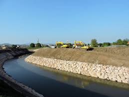
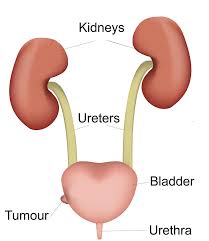
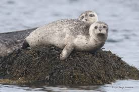
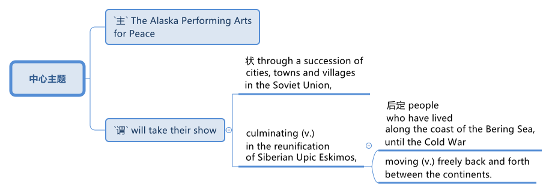
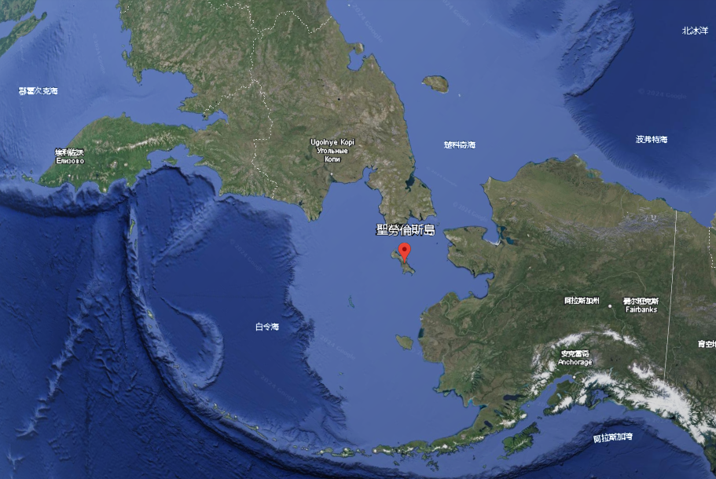
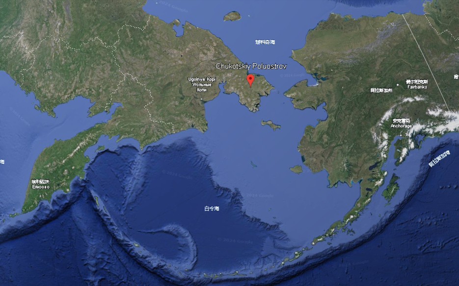

= step 3- Lesson 27
:toc: left
:toclevels: 3
:sectnums:
:stylesheet: ../../+ 000 eng选/美国高中历史教材 American History ： From Pre-Columbian to the New Millennium/myAdocCss.css

'''

The Soviet _news agency_ TASS reports (v.) that /an American _cancer researcher_ *has defected (v.)背叛；叛变；投敌 to* the Soviet Union. +
*According to* TASS, `主` Arnold Loskin, his wife and three children /`谓` arrived in Moscow today /after *being granted* (v.) _political asylum_ (n.)（政治）庇护，避难. +
TASS said /Loskin has defected (v.) /after *being fired (v.) from* his job, because he opposed (v.) US foreign policy.

[.my2]
苏联通讯社塔斯社报道称，一名美国癌症研究人员叛逃到苏联。
据塔斯社报道，阿诺德·洛斯金、他的妻子和三个孩子, 在获得政治庇护后, 于今天抵达莫斯科。
塔斯社称，洛斯金因反对美国外交政策, 而被解雇后叛逃。

[.my1]
.案例
====
.asylum
-> 前缀a-, 不，非。-syl, 同词根sal, 跳，攻击，见assail. 指宗教圣殿，避难所。
====

'''

==

The upcoming summit *is having an impact /on* _the budget debate_ on Capitol Hill.

[.my2]
即将举行的峰会, 将对国会山的预算辩论产生影响。

President Reagan *accused* (v.) Congress *of* /helping (v.) Soviet leader Mikhail Gorbachev /by *attaching* (v.) _arms control demands_ *to* the spending bill （提交议会讨论的）议案，法案.

[.my2]
里根总统指责国会"在开支法案中, 附加'军备控制'要求"，是在帮助苏联领导人戈尔巴乔夫。

The House wants (v.) the President /to continue (v.) *to abide (v.)遵守，遵循（法律、协议、协定等） by* the terms of _the ungratified  不满足的  SALT II Treaty_, among other things 除其他事项外.

[.my2]
除其他事项外，众议院希望, 总统继续遵守尚未履行的 SALT II 条约的条款。

[.my1]
.案例
====
.ABIDE (v.) BY STH
(v.) to accept and act according to a law, an agreement, etc.遵守，遵循（法律、协议、协定等）

.SALT II
The Strategic Arms Limitation Talks II  第二次战略武器限制谈判
====

House leaders say /the President is threatening (v.) *to shut down* the government /unless he gets his way on arms issues.

[.my2]
众议院领导人表示，总统威胁要关闭政府，除非他在武器问题上如愿以偿。

The House today approved (v.) _a compromise 协；折中 anti-drug 禁毒的；反毒品的 bill_ /that would *institute (v.)建立，制定（体系、政策等）；开始；实行 the death penalty* for _drug related murders_.

[.my2]
众议院今天批准了一项妥协的反毒品法案，将对与毒品有关的谋杀案判处死刑。

A provision （为将来做的）准备 *threatened (v.) a filibuster* (n.)（议会中为拖延表决的）冗长演说 /to keep it from passing.

[.my2]
一项行动威胁要对其进行阻挠, 以阻止其通过。

[.my1]
.案例
====
.provision
1.(n.)*~ for sb/sth* : preparations that you make for sth that might or will happen in the future（为将来做的）准备 +
• He had already *made provisions for* (= planned for the financial future of) his wife and children /before the accident. 意外事故发生之前，他已为妻子、儿女做好了经济安排。 +

2.[ C]a condition or an arrangement in a legal document （法律文件的）规定，条款 +
• Under _the provisions of the lease_, the tenant *is responsible for* repairs. 按契约规定，房客负责房屋维修。
====

Representatives *dropped* (v.) the provision （法律文件的）规定，条款 *from* the original bill /that would require (v.) the use of the military 军人；军队；军方 /to patrol (v.) 巡逻；巡查 the border /against drug smuggling.

[.my2]
代表们删除了最初法案中"要求使用军队巡逻边境, 打击毒品走私"的条款。

'''

== 美国洪水

It hasn't rained (v.) /until …​ since Saturday /in Eastern Missouri, but _flooding problems_ *continue to intensify* (v.)（使）加强，增强，加剧 along _the Missouri_ and _Mississippi Rivers_ /north of St. Louis. +
Thousands *have been forced to leave their homes* /as _flood waters_ continue to rise.

[.my2]
自周六以来，密苏里州东部一直没有下雨，但圣路易斯以北的密苏里河和密西西比河沿岸的洪水问题, 继续加剧。由于洪水继续上涨，数千人被迫离开家园。

Jim Dryden of _member station KWMU_ in St. Louis *reports* (v.).

[.my2]
圣路易斯KWMU成员站的吉姆·德莱顿报道。

"In St. Charles Counry /just to the north of St. Louis, flooding *is worse (a.) now than* at any time in recent history.

[.my2]
“在圣路易斯北部的圣查尔斯县，现在的洪水, 比近代史上任何时候都严重。

`主` All of the levees 防洪堤 along _the Missouri River_ /`谓` have broken, and the towns of _Portage Des Sioux_ and _Westalton_, which sit (v.) at the confluence （河流的）汇合处，汇流处，交汇处 of the Missouri and Mississippi Rivers, have been completely isolated (v.) by water.

[.my2]
密苏里河沿岸的所有堤坝, 都已决堤，位于密苏里河和密西西比河交汇处的波蒂奇德苏克斯镇, 和韦斯塔尔顿镇, 已完全被水隔离。

[.my1]
.案例
====
.levee
-> 来自拉丁语levare,升起，举起，词源同lever.引申词义防洪堤，码头。早朝义来自法语，原义为起床，代指君主接见朝臣的早会。 +

.confluence
->  con-共同 + -flu-流 + -ence名词词尾
====

Ray Camp 人名 of _the St. Charles_ County Office of _Emergency Management_ says (v.) /`主` levees and dikes 堤坝 north of _the confluence （河流的）汇流点 of the two rivers_ /`谓` *are causing* those rivers *to seek out* new channels. +
Westalton is now under _the water of one such new channel_.

[.my2]
圣查尔斯县应急管理办公室的雷·坎普说，两条河流汇合处以北的堤坝和堤防, 导致这些河流寻找新的渠道。韦斯顿现在就在这样一条新航道的水下。

[.my1]
.案例
====
.west alton
image:../img/west alton.png[,50%]
====

That town is being evacuated (v.)疏散；撤出；排泄 this evening /after `主` _desperate (a.)（因绝望而）不惜冒险的，不顾一切的，拼命的 attempts_ to sandbag (v.) 在…堆沙袋；用沙袋封堵 it /`谓` *failed* (v.).

[.my2]
在拼命用沙袋包裹该城镇失败后，该镇将于今晚被疏散。

Almost `主` _the entire peninsula_ 半岛 which sits (v.) at the confluence of the two rivers /`系`  is under *as much as* fifteen feet of water, and is now accessible (a.) only by boat.

[.my2]
位于两条河流交汇处的几乎整个半岛, 都在深达十五英尺的水下，现在只能乘船到达。

And *even though* the Missouri River *reached (v.) its crest* (n.)山顶；顶峰；波峰；浪尖 this morning /and the Mississippi *is expected to crest* (v.)到达洪峰；达到顶点 tomorrow, _emergency management officials_ say (v.) /it will be quite (ad.) some time /before `主` residents of the flooded area `谓` will be able to return home.

[.my2]
尽管密苏里河今天早上达到了最高水位，密西西比河预计明天也会达到最高水位，但应急管理官员表示，洪水地区的居民, 需要相当长的时间才能返回家园。

[.my1]
.案例
====
.crest
-> 来自拉丁词crista, 羽毛，鸟冠，词源同crisp, 卷的，卷羽。词义引申为顶峰。
====

For _National Public Radio_, I'm Jim Dryden in St.Louis."

[.my2]
我是国家公共广播电台的吉姆·德莱顿，来自圣路易斯。

'''

==  众议院多数党领袖 Jim Wright 掣肘美国总统 对苏联的谈判

As _President Reagan_ *gets ready for* this weekend's meeting (n.) with Soviet leader Gorbachev, commentator (电台、电视台或报刊的）评论员 Cal Thomas *thinks* that /House Democrats 众议院民主党 *are depriving* (v.) the President *of* the most important thing /he could take to Iceland — a clear control /over US foreign policy.

[.my2]
里根总统正在为本周末与苏联领导人戈尔巴乔夫的会晤做准备，对此，评论员卡尔·托马斯认为，众议院的多位民主党议员, 正在架空里根总统冰岛之行中最为重要的一项权利：对美国外交政策的明确控制权.

`主` _House majority leader_ Jim Wright `系` *isn't* even _Speaker of the House_ yet, and already he *is acting as if* he were President.

[.my2]
众议院多数党领袖吉姆·赖特, 甚至还不是众议院议长，但他的表现就好像他是总统一样。

Wright *has offered* (v.) President Reagan *a deal*. +
He says /he and House Democrats *will delay* (v.) a showdown 摊牌；决出胜负的较量；最后的决战 with the White House /over _arms control_ /until next year /if the President will *agree to* terms （协议、合同等的）条件，条款 for _future consideration_ of  ① _constraints (n.) on strategic weapons_ and  ② _other House *arms control* strategies_.

[.my2]
赖特已向里根总统提出一项协议。
他表示，如果总统同意未来考虑"限制战略武器"和"其他众议院军备控制战略"的条款，他和众议院民主党人, 将把"与白宫在军备控制问题上的摊牌", 推迟到明年。

These would include (v.) *abiding by* _weapons limits_ in _the unratified SALT II Treaty_, which the Soviets *have repeatedly violated* (v.)违反.

[.my2]
其中包括, 遵守未经批准的《第二阶段限制战略武器条约》中的武器限制，而苏联已多次违反该条约。 +
其中包括：遵守"二期削减战略武器条约"中有关"军备限制"的内容，而这是苏联多次违背的条款.

`主` This type of behavior /on the eve of a meeting (n.) in Iceland /between the President and Mikhail Gorbachev /`系`  would *be unseemly (ad.)不得体地；不适宜地 enough* (a.) for any member of Congress. +
But for _major Democratic leader_ 民主党主要领袖 /it is unconscionable (a.)违背良心的.

[.my2]
里根总统与戈尔巴乔夫在冰岛会晤前夕, 出现这种行为, 很不得体，实在让国会议员忍无可忍. 但对于主要的民主党领袖来说，这是极不得体的行为.

Why *should* Gorbachev *feel* (v.) any need /*to negotiate (v.) with* the President /if `主` House Democrats 后定  *led* (v.) by Jim Wright /`谓` are doing his job for him?  +
Gorbachev, of course, is *under no such pressure* /since `主` members of the Politburo （共产党中央委员会的）政治局；类似政治局的决策控制机构 in one-party Russia `谓` *compete* (v.)竞争；对抗 *only for* the privilege 特权，特殊待遇；荣幸，光荣 of being (v.) the loudest ratifier 赞成者 of Gorbachev policies 政策，方针，策略.

[.my2]
如果吉姆·赖特领导的众议院民主党人正在为戈尔巴乔夫做他的工作，为什么戈尔巴乔夫会觉得有必要与总统谈判呢？当然，戈尔巴乔夫并没有面临这样的压力，因为一党制俄罗斯的政治局成员, 只是为了成为戈尔巴乔夫政策最响亮的批准者的特权, 而竞争。 +
戈尔巴乔夫方面当然是毫无压力了，因为苏联政治局是一党专政, 所以议员满心想的都是如何为戈尔巴乔夫的政策溜须吹马.

[.my1]
.案例
====
.ratifier
(n.) someone who expresses (v.) strong approval
====

Wright 赖特（姓氏）, who was a co-signer 共同签署者 of a 1984 "Dear Commandant 司令官，指挥官" letter /to Nicaragua's _Marxist (a.n.)马克思主义的,马克思主义者 dictator_ 独裁者；专横的人 Daniel Ortega, in which, among other things 除其他事项外, he deplored (v.)公开谴责；强烈反对 his own country's policies against the Central American nation, apparently believes that /`主` *cutting a deal 達成協議 with* the Soviets /in which we all *will live in* a safer world /`系`  is like _a mating 交尾；交配 game_ 求偶游戏.

[.my2]
赖特是1984年致尼加拉瓜马克思主义独裁者丹尼尔·奥尔特加(Daniel Ortega)的一封“亲爱的指挥官”(Dear commander)信的共同签名者，在信中，他谴责了自己国家对这个中美洲国家的政策，显然，他认为与苏联达成协议，让我们都生活在一个更安全的世界里，就像一场婚姻游戏。

One must make the right moves /before _the other party_ *shows* any interest.

[.my2]
在对方表现出兴趣之前，一方必须采取正确的行动。

The Soviets *are pressing ahead 坚决继续进行；匆忙前进；加紧 /on* all fronts 前方；方面，领域, _offensive and defensive weapons_ and _laser technology_, even while they *denounce* (v.)谴责，痛斥 the United States *for* conducting (v.) research on its own _strategic defense initiative_ 倡议；新方案.

[.my2]
苏联在进攻性和防御性武器, 以及激光技术等各个方面, 都在推进，尽管他们谴责美国在进行战略防御计划研究。(意思就是苏联是双标的)

[.my1]
.案例
====
.press aˈhead/ˈon (with sth)
to continue doing sth /in a determined way; to hurry forward 坚决继续进行；匆忙前进；加紧 +
• The company *is pressing ahead /with* its plans for a new warehouse. 这家公司正加紧推动设置新仓库的计划。 +
• ‘Shall we stay here for the night?’ ‘No, let's *press (v.) on*.’ “我们今晚在这里住下好吗？”“不，咱们继续走。”
====

Will they *be impressed* by _the good will_ 后定 Congressman Wright *thinks* (v.) /he is displaying /by trying *to tie (v.) the President's hands* before Iceland? Hardly.

[.my2]
苏联人他们会对"赖特议员认为, 他试图在冰岛面前束缚总统的手脚, 所表现出的善意", 印象深刻吗？几乎不。

Gorbachev will try *to tie (v.) the President's feet* as well.

[.my2]
戈尔巴乔夫也会试图绑住总统的脚。

`主` #The history# of this country /before the Vietnam War /`系` #was# that /the President of the United States set (v.) American foreign policy.

[.my2]
越南战争之前这个国家的历史, 是美国总统制定美国的外交政策。

The Congress *advised (v.)出主意；提出建议；提供咨询 and debated*, but in the end /it *was* the President who prevailed (v.)（尤指长时间斗争后）战胜，挫败 /if differences arose (v.).

[.my2]
国会提出建议并进行辩论，但如果出现分歧，最终总统获胜。

Now it is the Congress /that is making foreign policy: on South Africa, on Central America, and, on the most dangerous level of all, with our _chief adversary_ （辩论、战斗中的）敌手，对手, the Soviet Union.

[.my2]
现在，国会正在制定外交政策：针对南非、针对中美洲，以及在最危险的层面上针对我们的主要对手苏联。

There is no room for mistakes (n.) *in dealing with* the Soviets, but Jim Wright and _the House Democrats_ *are making them*.

[.my2]
与苏联打交道时不允许犯错误，但吉姆·赖特和众议院民主党人却犯了错误。

Gorbachev will *arrive* (v.) in Reykjavik [*well rested*], *knowing* that /much of his work *will have already been done* for him /by Jim Wright. +
**No wonder **he's bringing (v.) his wife.
[.my2]
戈尔巴乔夫将在休息良好的情况下, 抵达雷克雅未克，因为他知道吉姆·赖特已经为他完成了大部分工作。
难怪他会带上他的妻子。

There will *be* _plenty of spare time_ for socializing 交往，交际.

[.my2]
将会有充足的空闲时间进行社交。

Cal Thomas *is* a columnist for _the Los Angeles Times Syndicate_.

[.my2]
卡尔·托马斯是《洛杉矶时报辛迪加》的专栏作家。

[.my1]
.案例
====
.syndicate
a group of people or companies /who work together /and help each other /in order to achieve a particular aim 辛迪加；企业联合组织；财团；私人联合会
====

'''

== 阿拉斯加人前往苏联, 进行和平表演艺术

_The Superpower leaders_ left (v.) Iceland this weekend /without *moving* (v.) their nations *noticeably closer to* peace.

[.my2]
超级大国领导人, 本周末离开了冰岛，但并没有让他们的国家明显更接近和平。

But at the same time /another interaction 互动，交流 between Americans and Soviet citizens /was just getting started (v.) in the USSR.

[.my2]
但与此同时，美国人和苏联公民之间的另一场互动, 才刚刚在苏联开始。

It is a meeting of Northern people, _an Arctic 北极的,极冷的；严寒的 attempt_ at understanding.

[.my2]
这是北方人民的一次聚会，是一次北极理解的尝试。

From Anchorage, reporter Joanna Urick has more /on _the Alaska Performing Arts_ for Peace.

[.my2]
来自安克雷奇的记者乔安娜·尤里克 (Joanna Urick) 报道了有关阿拉斯加和平表演艺术的更多信息。

Before** Leaving for** the Soviet Union, `主` sixty Alaskans from throughout the state /`谓` *gathered* in a log cabin /on a lake outside of Anchorage （船的）锚地，停泊处 /*to rehearse* (v.)排练；排演.

[.my2]
在前往苏联之前，来自全州的 60 名阿拉斯加人, 聚集在安克雷奇郊外湖边的一间小木屋里, 进行排练。

"I see people from Moscow. I see people from Leningrad 地名." As John Pingyer, a Upic Eskimo 爱斯基摩人 *reads* (v.) his lines, he'*s thinking about* _an ancient Upic ceremony_ /called "the Bladder 皮囊，气囊（如球胆）,膀胱 Festival," in which `主` people from different villages `谓` *gather together*.

[.my2]
“我看到来自莫斯科的人。我看到了来自列宁格勒的人。”当乌匹克爱斯基摩人约翰·平耶（John Pingyer）念出他的台词时，他想到了一种古老的乌匹克仪式，称为“膀胱节”，来自不同村庄的人们聚集在一起。

[.my1]
.案例
====
.bladder
->来源于日耳曼语blœ-。 同源词：blow +

====

At the end of the week-long rituals 典礼；宗教仪式；固定程序 /they *take* the bladders from seals 海豹 /后定 their hunters 猎人 *have taken* during the past year /and *inflate* (v.)使充气；膨胀 them /so they'll *float*. +
Then they *return* the seal bladders *to* the ocean.

[.my2]
在为期一周的仪式结束时，他们会从猎人在过去一年中捕获的海豹身上取出膀胱，然后给它们充气，这样它们就能漂浮起来。
然后他们将海豹膀胱放回海洋。

[.my1]
.案例
====
.seal

====

"There's a lot of symbolism （尤指文艺中的）象征主义，象征手法 /behind the ceremony. +
And `主` #one of the strongest symbolism# /that we're using (v.) in this Bladder Festival /`系` #is# …​

[.my2]
“仪式背后有很多象征意义。我们在这个膀胱节中使用的最强烈的象征意义之一是……​

togetherness (n.)和睦相处，亲密无间，友爱情谊 of people, as *one part of* one big village or a community, and then /we *use* (v.) it *to portray* (v.)描绘；描画；描写 the closeness 亲密；接近 of people, which is the peace."  +
The Bladder Festival *forms* (v.)（使）成形，组成；制作 the dramatic framework /*for* a show 后定 *involving* more than sixty people from Alaska.

[.my2]
人们团结在一起，作为一个大村庄或一个社区的一部分，然后我们用它来描绘人们的亲密关系，这就是和平。”膀胱节, 为一场由来自阿拉斯加的 60 多人参与的表演, 提供了戏剧性的框架。

The Alaska _Performing Arts_ 表演艺术 for Peace /`谓` will *take* their show /*through* _a succession of_ cities, towns and villages /in the Soviet Union, *culminat##ing##* (v.)（以某种结果）告终；（在某一点）结束 in the reunification 重新统一 of Siberian Upic Eskimos, 后定 #people# /who have lived (v.) along _the coast of the Bering Sea_, until the Cold War /*mov##ing## freely back and forth* between the continents.

[.my2]
阿拉斯加和平表演艺术, 将在苏联的一系列城市、城镇, 和村庄进行演出，最终使西伯利亚乌皮克爱斯基摩人重新统一，这些人一直生活在白令海沿岸，直到冷战结束。在各大洲之间自由来回。

[.my1]
.案例
====

====

At times, they can see one another /hunting on the ice, but _actual contact_ has been forbidden /since the coming of _military installations_ 设施；装置 *following* (v.) World War II.

[.my2]
有时，他们可以看到彼此在冰上狩猎，但自从二战后军事设施出现以来，实际接触就被禁止了。

_The Alaska villages of Wonga_ on _St.Lawrence Island_ /`系` *is* actually closer to Siberia /*than* to the US mainland.

[.my2]
阿拉斯加圣劳伦斯岛上的 Wonga村庄, 实际上离西伯利亚, 比离美国大陆更近。

[.my1]
.案例
====
.St.Lawrence Island

====

`主` Seventy-year-old Aura Gologrogin, who accompanies (v.) the Wonga _comedy 喜剧；喜剧片 players_ on the tour, `谓` remembers (v.) the last time /she visited friends and relatives /on the Siberian coast. +
She'*s looking forward to* meeting (v.) them again.

70 岁的奥拉·戈洛罗金 (Aura Gologrogin) , 陪同旺加 (Wonga) 喜剧演员进行巡演，她还记得上次去西伯利亚海岸, 拜访朋友和亲戚的情景。
她期待着再次见到他们。

"Yeh, it is like a big family reunion. +
I was thinking /if I could meet some of the people /that I know long time ago, since I have been there /when I was younger.

[.my2]
“是的，这就像一个大家庭聚会。
我在想, 我是否可以见到一些我很久以前就认识的人，因为我年轻时就去过那里。

In 1940 /I *go over* 从一处到（另一处） and *stay there* for nine days /and they were so nice people. And I want to meet them again."

[.my2]
1940 年，我去那里呆了九天，他们都是非常好的人。
我想再次见到他们。”

This tour is not just an Eskimo reunion. `主` *Along with* 除…以外（还）；与…同样地 some thirty Eskimos /`系` *are* chorus 歌舞队, cloggers 木屐匠, fiddlers 小提琴手 and black gospel 福音（耶稣的事迹和教诲）;（个人的）信念，信仰 singers. +
"Each culture has something unique (a.) /to offer (v.), and that's _what we have_ here.  +
Each culture has something unique to offer, and that uniqueness (n.)独特性；独一无二 will *be pulled (v.) together* as one.

[.my2]
这次旅行不仅仅是爱斯基摩人的聚会。除了大约三十名爱斯基摩人之外，还有合唱团、木鞋匠、小提琴手和黑人福音歌手。
“每种文化都有其独特之处，而这正是我们这里所拥有的。
每种文化都有其独特之处，而这种独特性将被整合为一个整体。

[.my1]
.案例
====
.gospel
-> 来自good spell的缩写。spell, 符咒，音讯。

.fiddler
-> 词源同violin, 来自罗马欢乐和胜利女神Vitula.引申词义不停摆弄。
====

And that one body *is* what we *are sharing (v.) with* the Soviet Union." Shirley Staten is one of five gospel singers from Anchorage /*looking forward to* another reunion /with the small group of Russians, descendants (n.)后代，晚辈 of Black Americans /who *emigrated (v.)移居，移民 to* Moscow /during the Depression.

[.my2]
而这个身体就是我们与苏联分享的。”雪莉·斯塔顿是来自安克雷奇的五位福音歌手之一，他们期待着与一小群俄罗斯人再次团聚，这些俄罗斯人是在大萧条期间移民到莫斯科的美国黑人的后裔。

"And we're going to sit around /and sing gospel music, and I am just …​ I mean /that's the highlight of the trip."  +
"We are going to sing in chorus 副歌,合唱曲. Then we can start (v.) together in Russian. It seems like /that's the way it's going to work."

[.my2]
“我们会围坐在一起唱福音音乐，而我只是……​我的意思是，这是这次旅行的亮点。”  +
“我们要合唱。然后我们可以一起从俄语开始。似乎这就是它的工作方式。”

Organizer Digby Belger says /it's taken two difficult years /*to make* the tour of _the Alaska Performing Artists for Peace_ *a reality*. +
And in that time, there have been _dramatic ups and downs_ 起起落落 in US-Soviet relations.

[.my2]
组织者迪格比·贝尔格表示，阿拉斯加和平表演艺术家的巡演, 花了两年的时间才成为现实。在那段时间，美苏关系经历了剧烈的起伏。

"In some way, this *might be* a nice time /to go. And you know, if …​ I really feel that /*the more tension* between us, *the more* that we really need to communicate. And _people to people exchange_ *is* a very good way /to do that."

[.my2]
在某种程度上，这可能是一个离开的好时机。你知道，如果……我真的觉得我们之间越紧张，我们就越需要沟通。人与人之间的交流, 是实现这一目标的一个很好的方式。

The Alaska _Performing Artists for Peace's_ month-long tour /will take them /*from* Moscow in the west /*to* _the Chukchi Peninsula_ in the east coast of Siberia.
They'll *return to* the United States /November 2nd.

[.my2]
阿拉斯加和平表演艺术家为期一个月的巡演, 将把他们从西部的莫斯科, 带到西伯利亚东海岸的楚科奇半岛。
他们将于11月2日返回美国。

[.my1]
.案例
====
.the Chukchi Peninsula

====

In Anchorage, this is Joanna Urich.

[.my2]
我是安克雷奇的乔安娜·乌里希。

'''
