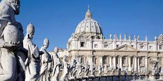
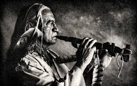
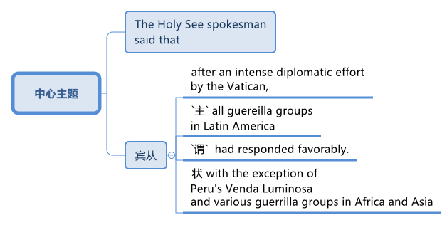
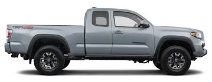
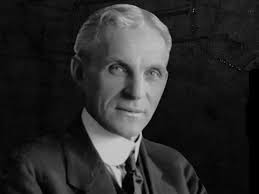
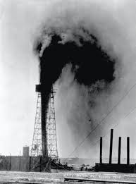
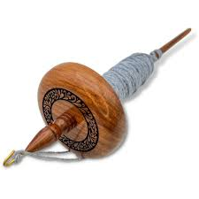
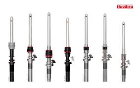
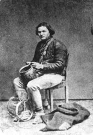

= step 3- Lesson 36
:toc: left
:toclevels: 3
:sectnums:
:stylesheet: ../../+ 000 eng选/美国高中历史教材 American History ： From Pre-Columbian to the New Millennium/myAdocCss.css

'''

== part 01

An arbitrator 仲裁人；公断人 today /blocked _a National Football League  联盟，同盟 plan_ (n.) /*to randomly test* (v.) NFL players /for _illegal drugs_.

[.my2]
今天，一名仲裁员, 阻止了国家橄榄球联盟对 NFL 球员进行"非法药物随机检测"的计划。

`谓` #Arbitrator# Richard Casher /后定 *responding (v.) to* a grievance (n.)不平的事；委屈；抱怨；牢骚 /后定 *filed* (v.)提起（诉讼）；提出（申请）；送交（备案） by _the NFL Players Association_ /`谓` *#said#* /the plan *violates* (v.) the players' contract.

[.my2]
仲裁员理查德·卡舍尔, 在回应 "NFL 球员协会"提出的申诉时表示，该计划违反了球员合同。

The Commissioner （委员会的）委员，专员，特派员 Pete Rozelle /*had announced* _the drug testing proposal_ /in July.

[.my2]
专员皮特·罗泽尔 (Pete Rozelle) , 于 7 月宣布了"药物测试"提案。

It *called for* two _surprise tests_ 突击考试,突击测试 /during the football season, but Casher *said* /Rozelle *lacks* (v.) the power /*to implement* the plan /without *going through* the _collective bargaining_ 集体谈判 process.  +
NASA today *gave* an update /*on* its efforts /后定 *to remodel* (v.)改变…的结构（或形状） space shuttle _booster rockets_ 助推火箭.

[.my2]
它要求, 在足球赛季期间, 进行两次突击测试，但卡舍尔表示，罗泽尔缺乏在不经过"集体谈判程序"的情况下, 实施该计划的权力。美国宇航局, 今天公布了其改造航天飞机"助推火箭"的最新进展。

[.my1]
.title
====
.booster rocket
====

A faulty 有错误的；有缺陷的 booster /`谓` *caused* _the shuttle Challenger_ /*to explode* in January.

[.my2]
一月份，一个有故障的助推器, 导致"挑战者号"航天飞机爆炸。

NPR's Richard Harris *has* details.

[.my2]
NPR 的理查德·哈里斯 (Richard Harris) 提供了详细信息。

"_NASA engineer_ John Thomas *says* /the rocket _testing program_ *is progressing* (v.) [just about 差不多,几乎] on schedule 按时；按照预定时间.

[.my2]
“美国宇航局工程师约翰·托马斯表示，火箭测试计划, 正在按计划进行。

[.my1]
.title
====
.just about
( informal ) +
(1) almost; very nearly 几乎；近乎；差不多 +
- I've met *just about* everyone.我几乎每个人都见到了。 +
- ‘Did you reach your sales target?’ ‘*Just about*.’“你的销售目标达到了吗？”“差不多了。”

(2) approximately 大概；大约 +
- She should be arriving *just about now*. 她现在该到了。
====

He says /redesign _booster rockets_ *should be available* /for _a space shuttle launch_ in February 1988.

[.my2]
他说, 重新设计的助推火箭, 应该可以用于 1988 年 2 月的航天飞机发射。

Engineers *have simulated* the exact problem /the(疑似that?) *caused* (v.) _the shuttle 梭子;航天飞机 disaster_ in January.

[.my2]
工程师们模拟了导致一月份航天飞机灾难的确切问题。

They'*ve also started* testing (v.) the remodeled 改造的；改制的 components.

[.my2]
他们还开始测试改造后的组件。

Thomas *admitted that* /`主` testing `谓` *could take longer* /if NASA *follows* the advice of _independent engineers_ at _the National Research Council_ （顾问、立法、研究、基金等）委员会.

[.my2]
托马斯承认，如果美国宇航局, 遵循"国家研究委员会"独立工程师的建议，测试可能需要更长时间。

[.my1]
.title
====
.council
a group of people /chosen to give advice, make rules, do research, provide money, etc.（顾问、立法、研究、基金等）委员会
====

Those engineers *suggested* _additional tests_ /后定 *beyond* what NASA *has planned*.

[.my2]
这些工程师建议, 进行超出美国宇航局计划的额外测试。

But Thomas *said* /NASA *might run* some of those tests /*after* the first shuttle flight.

[.my2]
但托马斯表示，美国宇航局可能会在第一次航天飞机飞行后, 进行一些测试。

For example, NASA *might delay* tests (n.) /for _unusually hot or cold_ launch conditions.

[.my2]
例如，美国宇航局可能会推迟"针对异常炎热或寒冷的发射条件"的测试。

He *said* /NASA *would just make sure* /`主` the weather `系`  *was mild* at lift-off (n.) （航天器的）发射，起飞，升空 /until those tests *were completed*.

[.my2]
他说，美国宇航局只会确保升空时, 天气温和，直到这些测试完成。

This is Richard Harris /in Washington."

[.my2]
我是华盛顿的理查德·哈里斯。”

_Religious leaders_ 宗教领袖 from around the world /`谓` *joined* _Pope 罗马教皇 John Paul II_ today /in _a day of prayer_ (n.) *for* peace.

[.my2]
今天，来自世界各地的宗教领袖, 与教皇约翰·保罗二世一起祈祷和平。

The leaders `谓` *gathered* at _the birthplace_ 出生地 of _Saint Francis of Assisi_ in Italy /*to pray* (v.) /状 *according to* their own rites 仪式.

[.my2]
领导人聚集在意大利阿西西圣方济各的出生地，按照自己的仪式, 进行祈祷。

[.my1]
.title
====
.Saint Francis of Assisi
天主教"方济各会"和"方济各女修会"的创始人。*此派修道士的特点是：将所有财物都捐给穷人、靠布施行乞过生活、直属罗马教宗的管辖.* 方济会效忠罗马教廷，重视学术研究和文化教育事业，**反对异端，**为传扬福音而到处游方。

1289年，"*方济会*"会士"孟高维诺"总主教，受罗马教廷派遣, 前往时值"元朝"统治的中国。*是为最早期的来华"天主教"传教士（当时尚未有"基督新教"）。*

圣方济各的圣痕, 也是罗马教廷唯一官方承认的圣痕。为了纪念他，美国旧金山使用他的名字（即"圣弗朗西斯科"）作为城市名。

Assisi 意大利城镇名.

====

`主` One hundred sixty people /后定 *representing* (v.) twelve of _the world's major religions_ /`谓`  *gathered* (v.) today /*in* the central Italian town of Assisi /*for* _an unprecedented (a.)前所未有的；空前的；没有先例的 day of prayer_ (n.) for peace.

[.my2]
今天，代表世界十二个主要宗教的一百六十人, 聚集在意大利中部小镇阿西西，参加史无前例的和平祈祷日。

The initiative 倡议；新方案 *was proposed* by Pope _John Paul II_ /*to commemorate*  (v.)（用…）纪念；作为…的纪念 _the United Nations_' International Year of Peace.

[.my2]
该倡议是由教皇约翰·保罗二世, 为纪念"联合国国际和平年"而提出的。

The Pontiff 教皇；宗座 also *appealed for* a twenty-four-hour of truce (n.)停战协定；休战；停战期 /in the world's conflicts, and several _revolutionary groups_ */agreed (v.) to honor* 尊敬，尊重（某人） the cease-fire.

[.my2]
教宗还呼吁, 在世界冲突中, 实行二十四小时停火，一些革命团体也同意遵守停火协议。

[.my1]
.title
====
.pontiff
( formal ) the Pope (= the leader of the Roman Catholic Church) 教皇；宗座

-> 在词典中，pontiff 既表示“主教”，也可以表示“教宗”、“罗马教皇”。 +
"主教"和"教皇"应该不是同一层次的职务，怎么能用同一个词表示呢？原来，**pontiff 的本意**既不是“主教”，也不是“教皇”，而**是指基督教兴起之前古罗马宗教中的"高级祭司"，**拉丁语为pontifex（意为bridge-maker或path-maker），可译为“大祭司”，相当于基督教中的“主教” （bishop）。

高级祭司中的首脑被称为 Pontifex Maximus，（大祭司长），地位相当于教皇。 +
*在基督教成为罗马国教之前，Pontifex Maximus，（大祭司长）一职通常由罗马皇帝兼任。*

英语单词 *pontiff* 来自拉丁语pontifex，相当于bishop，但人们很少用它来表示“主教”，直到17世纪才开始使用，但**一般都是特指“the bishop of Rome”（罗马主教），也就是位于罗马的教皇了。** +
pontiff：['pɒntɪf] n.主教，罗马教宗，教皇，大祭司 pontifical：adj.主教的，罗马教宗的
====

From Assisi, Sylvia Perjoli *reports*.

[.my2]
Sylvia Perjoli 从阿西西报道。

_The narrow cobblestoned (a.)鹅卵石；圆石 streets_ and _the pink toned (a.)年久变色的；有声调的，具有……音质的 medieval churches_ of Assisi /`系`  *were* the backdrop （舞台的）背景幕布;（事件发生时）周围陪衬景物 today of _one of the most colorful and spectacular 壮观的；壮丽的；令人惊叹的 events_ /后定 *organized* by Pope _John Paul II_ /since he *assumed (v.)承担（责任）；就（职）；取得（权力） the Papacy* 教皇的职位（或权力）;（某教皇）任职的时期 /eight years ago.

[.my2]
今天，狭窄的鹅卵石街道, 和粉红色的阿西西中世纪教堂, 成为教皇约翰·保罗二世自八年前就任教皇以来, 组织的最丰富多彩、最壮观的活动之一的背景。

[.my1]
.案例
====
.cobblestone

====

The ceremony *spanned (v.)持续；贯穿 eight hours* /and *was divided into* three parts.

[.my2]
仪式持续八个小时，分为三个部分。

This morning /at a basilica 大教堂，大殿，廊柱会堂（一端呈半圆形，内设两排廊柱） outside the town, the Pope *received* _religious leaders_ /后定 *representing* Christianity 基督教, Judaism 犹太教；犹太主义；（总称）犹太人, Islam 伊斯兰教, Buddhism 佛教, Shintoism 日本之神道教, Hinduism 印度教, *as well as* Sikhs 锡克人；锡克教徒, African animists 万物有灵论者, Byes, Zorastrians, Jane and native Americans.

[.my2]
今天早上，教皇在城外的一座大教堂, 接见了代表基督教、犹太教、伊斯兰教、佛教、神道教、印度教以及锡克教徒、非洲万物有灵论者、拜斯教徒、琐拉斯特教徒、简和美洲原住民的宗教领袖。

[.my1]
.案例
====
.basilica
/bəˈzɪlɪkə/  +
a large church or hall /with a curved end /and two rows of columns inside 大教堂，大殿，廊柱会堂（一端呈半圆形，内设两排廊柱） +

====

The Pope *#told#* his guests, 后定 some *attired* (v.)着装 in formal _religious robes_ 长袍；礼服, others in _traditional costumes_ 服装, *#that#* he chose (v.) Assisi /*because of* its particular significance  重要性，意义 /*as* the birthplace of Saint Francis, who *is revered as* a symbol of __peace, reconciliation 调解；和解 and brotherhood __兄弟关系；手足情谊.

[.my2]
教皇告诉他的客人，其中一些人穿着正式的宗教长袍，另一些则穿着传统服装，他选择阿西西, 是因为它作为"圣方济各"的出生地, 而具有特殊的意义，"圣方济各"被尊为"和平、和解与兄弟情谊"的象征。

[.my1]
.案例
====
.attire
/əˈtaɪ-ə(r)/  +
[ U] ( formal ) clothes 服装；衣服 +
- dressed (v.) in *formal evening attire* 穿着晚礼服 +

.robe

====

For _the second moment_ of the day, each _religious delegation_ 代表团;委托；委派 /*went to* _an assigned (a.)指定的；已分配的 place_ /*to hold* its own prayers.

[.my2]
当天的第二个时刻，各个宗教代表团, 前往指定地点, 进行各自的祈祷活动。

_The Jewish 犹太人的；犹太教的 delegation_ 代表团 *convened* 召集，召开（正式会议）;（为正式会议而）聚集，集合 on the site of _a fourteenth-century synagogue_ 犹太会堂；犹太教堂.

[.my2]
犹太代表团, 在一座十四世纪的犹太教堂旧址上, 召开会议。

[.my1]
.案例
====
.synagogue +
/ˈsɪnə-ɡɒ-ɡ/
-> 来自希腊语 synagoge,集会地，犹太教堂，来自syn-,一起，-agog,引导，词源同 demagogue, pedagogue.
====

Some groups *prayed* (v.) in _Catholic churches_, others in _municipal (a.)市政的；地方政府的 buildings_, and still others, *such as* the Shintoists 神道信徒, *prayed* in squares 广场.

[.my2]
一些团体在天主教堂祈祷，另一些团体在市政建筑中祈祷，还有一些团体，例如神道教徒，在广场祈祷。

[.my1]
.案例
====
.municipal
-> -mun-防御,公共 + -cip-拿 + -al形容词词尾 +
词源同common,mutual.-cep,承担. 词源同capable,accept.
====

The day's final event *came* this afternoon /when the participants /who *had observed* (v.)看到；注意到；观察到 a fast marched /in a procession to _the square_ of _the Basilica of Saint Francis_.

[.my2]
当天的最后一项活动, 是在今天下午，参加游行的人, 参加了前往"圣弗朗西斯大教堂广场"的游行。

The delegates *sat* (v.) on a large podium 讲台；讲坛；（乐队的）指挥台, the Pope *in the center* /with the Christians and Jews *on his right*, and the other religions 宗教，宗教信仰 /*on his left*.

[.my2]
代表们坐在一个大讲台上，教皇坐在中间，基督徒和犹太人在他的右边，其他宗教在他的左边。

[.my1]
.案例
====
.podium
a small platform /that a person stands (v.) on /when giving a speech /or conducting (v.) an orchestra , etc. 讲台；讲坛；（乐队的）指挥台 +
-> pod-,足，脚，-ium,表地点。即站脚的地方，引申词义讲台，讲坛。 +

====

The final part of the ceremony `谓` *began* /with each group *reciting* (v.)背诵；朗诵 their won prayers (n.) /*in the presence of* 在…面前；有…在场 others.

[.my2]
仪式的最后部分开始，每个小组在其他人在场的情况下, 背诵他们赢得的祈祷文。

The Buddhists *were* first.

[.my2]
首先是佛教徒。

One of the most colorful _prayer services_ 祷告仪式 /*was* that of _the native Americans_.

[.my2]
最丰富多彩的祈祷仪式之一, 是美洲原住民的祈祷仪式。

John Pretty-on-Top /and his nephew Burton /of _the Crow Indian tribe_ 部落，宗族 of Montana 美国州名 /wore *feathered* (v.)用羽毛装饰 headdresses （特殊场合戴的）头巾，头饰 /and *inhaled (v.)吸入 deeply* from a long _peace pipe_ 和平烟斗（美洲土著作为和平象征请人抽的） /which they *offered*  提供，给予 _the great spirit_ of _the Mother Earth_.

[.my2]
来自蒙大拿州克罗印第安部落的约翰·普雷蒂-上衣, 和他的侄子伯顿, 戴着羽毛头饰，从长长的和平烟斗中, 深深地吸了一口气，向他们献上了大地母亲的伟大精神。

[.my1]
.案例
====
.headdress +
a covering worn on the head on special occasions（特殊场合戴的）头巾，头饰 +

.peace pipe
a tobacco pipe /后定 offered (v.) and smoked (v.) /as a symbol of peace /by Native Americans 和平烟斗（美洲土著作为和平象征请人抽的） +

====

After the prayer, young men and women /*distributed* (v.)分发；分配 _olive branches_ 树枝 /while a choir 唱诗班，合唱团 *sang  (v.) a hymn* 赞美诗，圣歌 in Greek.

[.my2]
祈祷结束后，年轻男女分发橄榄枝，唱诗班用希腊语唱赞美诗。

The Pope then *delivered* his elocutions 演讲技巧；演说术, in which he *stressed that* /#despite# their differences, the world's religions *have* a common ground 地；地面;（兴趣、知识或思想的）范围，领域.

[.my2]
罗马教皇随后发表演讲，强调世界宗教尽管存在差异，但仍有共同点。

[.my1]
.案例
====
.elocution
[ U]the ability /*to speak clearly and correctly*, especially in public /and *pronouncing* the words /in a way /that *is considered* to be socially acceptable 演讲技巧；演说术 +
->  e-出 + -locut-说 + -ion名词词尾
====

"Besides, we also *make* the world *looking at* us /through the media, moreover, of _the responsibilities of religion_ /后定 *regarding* 关于；至于 problems of war and peace."  +

The ceremony ended (v.) with _the release of hundreds of doves_ 白鸽 /as _the choir **sang**_ (v.) "Saint Francis Canticle 颂歌；圣歌 *to* _Father Sun_ and _Sister Moon_."  +
As the ceremony *was coming to a close*, the Vatican 罗马教廷；梵蒂冈 *announced that* /`主` the Pope's #appeal# (n.) /for _a truce_ of all conflicts /raging (v.)迅速蔓延；快速扩散 throughout the world /`谓` #had been widely respected#.

[.my2]
“此外，我们还通过媒体, 让世界关注我们宗教, 在战争与和平问题上的责任。”仪式以数百只鸽子被释放而结束，唱诗班唱着“圣弗朗西斯颂歌给太阳父亲和月亮姐妹”。仪式即将结束时，梵蒂冈宣布, 教皇关于世界各地所有冲突停战的呼吁, 已得到广泛尊重。

The _Holy See_ 罗马教廷;圣座，宗座（指教皇的职位或权力） spokesman *said that* /after an intense diplomatic effort /by the Vatican, `主` all #guerrilla 游击队员 groups# /in Latin America /*with the exception 一般情况以外的人（或事物）；例外 of* _Peru's 秘鲁 Venda Luminosa_ /and various 各种各样的；迥异的 _guerrilla groups_ in Africa and Asia /`谓` *#had responded# (v.)（口头或书面）回答，回应 favorably* 顺利地；亲切地；好意地.

[.my2]
罗马教廷发言人表示，经过梵蒂冈的大力外交努力，除秘鲁的“文达·卢米诺萨”游击队, 以及非洲和亚洲的各个游击队外，拉丁美洲所有游击队, 都做出了积极回应。

[.my1]
.案例
====
.Holy See
1.the job or authority /of the Pope 圣座，宗座（指教皇的职位或权力） +
2.the Roman Catholic court /at the Vatican in Rome 罗马教廷（设在梵蒂冈）

====

In the Middle East,`主`  _the warring (a.)战争的；交战的；敌对的 factions_ （大团体中的）派系，派别，小集团 in Lebanon, *as well as* _PLO leader_ Yasser Arafat /and _Iraq's President_ Saddam Hussein, `谓` also welcomed (v.) the appeal.

[.my2]
在中东，黎巴嫩交战各派, 以及巴解组织领导人亚西尔·阿拉法特, 和伊拉克总统萨达姆·侯赛因, 也对这一呼吁表示欢迎。

[.my1]
.案例
====
.PLO
abbr. 巴勒斯坦解放组织（Palestine Liberation Organization）
====

But in Mozambique, Afghanistan, Iran, Vietnam, and some of _the Communist guerrillas_ in the Philippines /`谓` *did not reply* /or refused (v.) *to observe (v.)遵守（规则、法律等） a truce*.

[.my2]
但莫桑比克、阿富汗、伊朗、越南和菲律宾的一些共产党游击队, 没有做出答复, 或拒绝遵守停战协议。

Tomorrow /it will *be known* /if `主` the message from _the largest gathering_ of religions /`谓` was carried out.

[.my2]
明天就会知道, 最大的宗教集会所传达的信息, 是否得到落实。

For _National Public Radio_, this is Sylvisa Perjoli in Assisi.

[.my2]
我是国家公共广播电台的西尔维萨·佩尔乔利 (Sylvisa Perjoli)，来自阿西西。

'''

== part 02

====  Yutaka Katayama 片山丰

The "American Century" *has become* the "American Crisis," and that happened /in just twenty-five years.

[.my2]
“美国世纪”已经变成了“美国危机”，而这仅仅在二十五年后就发生了。

That's _the theme_ of _David Halberstam's latest book_ /called _The Reckoning_ (n.)估计；估算；计算;最后审判日；算总账.

[.my2]
这是大卫·哈尔伯斯坦最新著作, 《清算》的主题。

[.my1]
.案例
====
.reckoning
(n.) [ UC] the act of calculating sth, especially in a way /that is not very exact 估计；估算；计算 +
- *By my reckoning* (n.) /you still owe (v.) me ￡5. 我算计着，你还欠我5英镑。

2.[ C][ usually sing.U] a time /when sb's actions will be judged to be right or wrong /and they may be punished 最后审判日；算总账 +
- *In the final reckoning* /truth is rewarded. 在最后算总账的时候，诚实的人会有好报。 +
- `主` Officials /后定 concerned (v.) with environmental policy /`谓` predict that /*a day of reckoning* will come.  担心环境政策的官员们预言, 总有一天人们会受到报应。
====

It's the story /of _the Ford Motor Company_ /and the story of _Nissan_, a Japanese car maker /since the late 1930s.

[.my2]
这是福特汽车公司和 20 世纪 30 年代末以来的, 日本汽车制造商日产汽车的故事。

It is now _a very successful importer_ (n.)进口商；输入者 to the US.

[.my2]
它现在是美国非常成功的进口商。

Basically Halberstam *believes* /`主` the American _automobile industry_, Detroit 底特律 /since the Second World War, `谓` became _a shared *de facto* (a.)实际上存在的（不一定合法） monopoly_ (n.)垄断；专营服务；被垄断的商品（或服务） /*failing (v.) to listen to* congress 国会，议会, *failing (v.) to notice* Japan, and *mostly failing*, he says, because the car companies *came* under the control of the financial people /#rather than# the car people.

[.my2]
基本上，哈尔伯斯坦认为自二战以来的美国汽车工业，即底特律，已成为一个共同的事实垄断，未能倾听国会的意见，未能注意到日本，并且大多数情况下失败了，他说，这是因为汽车公司受到了金融人士而不是汽车专业人士的控制。

[.my1]
.案例
====
.de facto
(a.)[ usually before noun] ( from Latinformal ) existing as a fact /although it may not be legally accepted as existing 实际上存在的（不一定合法） +
- The general *took (v.) #de facto# control of* the country. 这位将军**实际上控制了**整个国家。

#★*对于像这种"两个单词"共同表达的意思, 你只需把它"连读当成是一个单词"来记它的意思就行了. 即把 de facto 连读成 defacto 像一个单词一样.*#

DERIVATIVES 派生词
de facto (adv.) +
- He continued to rule (v.) the country *de facto*. 实际上，他继续统治着这个国家。
====

David Halberstam *talks* with us now *#about#* /one very important year in _auto biz_ 生意；（尤指）娱乐业, 1964, #and *about#* several important people, *beginning with* Yutaka Katayama of Nissan.

[.my2]
David Halberstam现在和我们谈论汽车行业非常重要的一年，1964年，以及几位重要人物，首先是日产的 Yutaka Katayama。

[.my1]
.案例
====
.bizn.  /bɪz/
[ sing.] ( informal ) a particular type of business, especially one connected with entertainment 商业（等于 business）; 生意；（尤指）娱乐业 +
- people *in the music biz* 音乐圈的人

.Yutaka Katayama
曾任 Nissan(日产) 美国CEO的 片山丰.
====

"`主` Catayama, who is a kind of exuberant 精力充沛的；热情洋溢的；兴高采烈的, somewhat aristocratic 贵族的 man, `系` *was* very frustrated (a.)懊丧；懊恼；沮丧.

[.my2]
“卡塔山是一个精力充沛、有点贵族气质的人，他非常沮丧。

[.my1]
.案例
====
.exuberant
(a.)full of energy, excitement and happiness 精力充沛的；热情洋溢的；兴高采烈的 +
-> ex-, 向外。-uber, 乳房，乳汁，词源同udder. 原指多产的，丰富的，引申义兴高采烈的。
====

At home in Tokyo, *there seemed to be* no place for him /in the company.

[.my2]
在东京的家里，公司里似乎没有他的位置。

He *loved* _making cars_.

[.my2]
他喜欢制造汽车。

He was *on the wrong side* politically, and that's a very political company.

[.my2]
他在政治上站在了错误的一边，而那是一家非常政治化的公司。

And so /he *was almost exiled 流放，放逐 to* America /*on the assumption 假定；假设 that* /`主` *selling (v.) cars* in America `系` *would be* a sure place: if you wanted someone to fail, that's what you would do.

[.my2]
因此，他几乎被流放到美国，因为他认为在美国销售汽车将是一个确定的地方：如果你希望某人失败，那就是你会做的。

And he came here, and he loved America.

[.my2]
他来到这里，他热爱美国。

I mean, he was *more* at home, oddly enough, in America /*than* he was in Japan.

[.my2]
我的意思是，奇怪的是，他在美国, 比在日本更自在。

In the beginning /he *would* almost, I mean, *sell cars* /hand by hand.

[.my2]
我的意思是，一开始他几乎会手工销售汽车。

① He would go to the Japanese gardeners /in Los Angeles /② #and# sell these little _pick-up trucks_ 皮卡车 / ③ #and# he found these, you know, almost _used (a.)用过的；旧的；二手的 car_ dealers 交易商；贸易商 /whom he convinced (v.)使信服；说服，劝服 *to be* Nissan dealers,  ④ #and# he would hand …​ he'd *drive* (v.) the cars *down to* their lots （作某种用途的）一块地，场地, ⑤ #and# he *got 开始（感觉到、认识到、成为）；达到…地步（或程度） to know* the business, ⑤ #and# just it began to surface /in '64. +

That's a very important _demarcation （工种、人、土地等的）划分，区分，界线 point_, 1964." "You mention (v.) _the pick-up trucks_ /后定 they were trying to sell /on the west coast.

[.my2]
他会去洛杉矶找日本园丁，然后卖这些小皮卡车，他找到了这些，你知道，几乎是"二手车"经销商，他们被说服成为了日产汽车经销商，他会亲自驾驶这些车开到他们的停车场，他开始了解这个行业，然后事情就开始在1964年显露出来。 +
这是一个非常重要的分界点，1964年。" "你提到了他们试图在西海岸销售的小皮卡车。

[.my1]
.案例
====
.pick-up trucks
皮卡车：一种轻型货车，通常具有开放式的货箱和后部座椅，用于运输货物和乘客。 +

.lot
[ C]an area of land /used for a particular purpose（作某种用途的）一块地，场地 +
- a parking lot 停车场 +
- a vacant lot (= one available to be built on or used for sth) 一块空地

.get
(v.) to reach a particular state or condition; to make sb/sth/yourself reach a particular state or condition（使）达到，进入 +
- to get dressed/undressed (= to put your clothes on/take your clothes off) 穿上╱脱下衣服 +
- They plan *to get married* in the summer.他们打算夏天结婚。 +
- She's upstairs *getting ready*.她在楼上做准备。

[ V to inf] *to reach the point* /at which you feel, know, are, etc. sth 开始（感觉到、认识到、成为）；达到…地步（或程度） (即**#达到"量变到质变"的那个临界点#**) +
- After a time /*you get to realize that* /these things don't matter. 过段时间你会明白这些事情并不要紧。 +
- You'll like her /once you *get to know* her. 你一旦了解了她就会喜欢她的。 +
- His drinking *is getting to be a problem*. 他的酗酒越来越成问题了。 +
- She'*s getting to be* an old lady now. 她现在都快是个老太婆了。

.demarcation
[ UC] a border or line /that separates two things, such as types of work, groups of people /or areas of land （工种、人、土地等的）划分，区分，界线 +
- It was hard /to draw (v.) _clear lines of demarcation_ /between work and leisure. 在工作和闲暇之间很难划出明确的界限。 +
- *social demarcations* 社会阶层的划分
====

It is funny /the correspondence 通信；通信联系 /后定 back and forth *between* the west coast *and* Tokyo /that the Japanese in Tokyo don't believe that /Americans should *be riding* (v.)骑；驾驶;搭乘；乘坐 in _pick-up trucks_ /*as* passenger vehicles 乘用车 /and refuse (v.) *to accommodate* (v.)顺应，适应（新情况） some design changes."  +

[.my2]
有趣的是，西海岸和东京之间的来回通信，东京的日本人, 不相信美国人应该乘坐皮卡车作为客车，并且拒绝适应一些设计变更。”

[.my1]
.案例
====
.passenger vehicle
客车：一种用于运输乘客的机动车辆，通常具有座位和行李箱等设施。
====

"Well, factories in those days /were not very technologically advanced.
I mean, they have this wonderful _work force_ 劳动力, and they have this _enormous ambition_ /and this willingness 后定  *as to* 关于，就……而言 pay a high price. +
But their cars were very primitive really, like American cars in the '30s.

[.my2]
“嗯，那时候的工厂技术不是很先进。我的意思是，他们有优秀的劳动力，他们有巨大的野心，愿意付出高昂的代价。但他们的汽车确实非常原始，就像 30 年代的美国汽车一样。

[.my1]
.案例
====
.as to something +
a) *concerning something* +
- Frank was very uncertain *as to* whether it was the right job for him. 弗兰克非常不确定这是否适合他的工作。 +
- advice /后定 *as to* which suppliers to approach 关于接触哪些供应商的建议 +
 He kept his rivals guessing *as to* his real intentions. 他让对手猜测他的真实意图。 +

b) formal used /when you are starting to talk about something new /that is connected with what you were talking about before +
- *As to* our future plans, I think /I need only say that /the company intends (v.) to expand /at a steady rate. 至于我们未来的计划，我想我只需说, 公司打算以稳定的速度扩张。
====

But the truck 后定 they were building /*was like* a small tank /and was very inexpensive 便宜的, and they were started selling (v.) on the west coast.

[.my2]
但是他们制造的卡车就像一个小坦克，非常便宜，他们开始在西海岸销售。

[.my1]
.案例
====
.start doing 和 start to do 的区别
start to do 的意思是，即将要准备开始去做某事，事情还没有做还在准备阶段，一般现在时； +
start doing 的意思是开始做某事，事情已经开始做了，不包括准备阶段，是现在进行时。

当我们谈论一项"长期的"或"习惯性的"活动时，用 doing 形式的情形较多。 +
- How old were you /when you first *started playing the piano*? 你最初弹钢琴的时候, 有多大？ +
- 比较:  She sat down at the piano /and *started to play*. 她在钢琴前坐下, 开始弹了起来。
====

And for the first couple years, the little truck *was* what carried 支撑；承载 the company. +
I mean /that's where they *made their inroads* （尤指通过消耗或削弱其他事物取得的）进展.

[.my2]
在最初的几年里，小卡车是公司的承载者。我的意思是，这就是他们取得进展的地方。

[.my1]
.案例
====
inroad
(n.) *~ (into sth)* : something that is achieved, especially by reducing the power or success /of sth else（尤指通过消耗或削弱其他事物取得的）进展 +
• This deal is their first *major inroad* /into the American market.这交易是他们进军美国市场的首次重大收获。 +
-> in-,进入，使，road,古义，骑马，侵袭，词源同ride,raid.其原义为恶意入侵，侵扰，后词义褒义化指进展。

.MAKE INROADS INTO/ON STH
if one thing *makes inroads into* another, it has a noticeable effect /on the second thing, especially by reducing it, or influencing it 消耗，削弱，影响（某事物） +
• Tax rises /*have made some inroads (n.) /into* the country's national debt. 增加税收,已使国债有所减少。
====

And Catayama 日本人名 *kept saying*, 'You know, you don't under …​' *to* the home-office. 'You don't understand Americans. They drive the truck, I mean, pick-up truck. +
That's a car for them, I mean, they'll work (v.) in it, and they'll play in it; they'll *go to the bank* in it; they'll *go to a drive-in  (a.)免下车的；路边服务的 movie* in it. +

Can we *put* some _air conditioner_? Can we *make* it more comfortable? Can we *put in* a radio?' And Tokyo *kept saying*, you know, 'No, no, no, no. It should *not be used* (v.) for those things. +
We want the Americans /just to *drive* it /*as* a truck.'  +
You know Catayama *just had a feeling that* /they were losing (v.) all these sales.

[.my2]
而片山一直对总部说:“你知道，你不需要……”“你不了解美国人。他们开卡车，我是说，小货车。那是给他们的车，我的意思是，他们可以在里面工作，在里面玩耍;他们会开着它去银行;他们会在里面看免下车电影。 我们可以装空调吗?我们能让它更舒适吗?我们能装个收音机吗?” +
而东京一直在说，‘不，不，不，不。它不应该用于这些事情。我们希望美国人把它当作卡车来开。你知道，片山只是觉得他们失去了所有的销售。

He mostly did not win (v.) the battle /on the truck, but he won (v.) a lot other battles."  +

[.my2]
他大多没有赢得卡车上的战斗，但他赢得了很多其他战斗。”

'''

==== Henry Ford 亨利·福特 (福特汽车创始人)

"Talking about '64, just about the time /后定 `主` the Japanese _car workers_ /`谓` had begun to be able to afford the Japanese car /and much earlier in your book, writing about the original 原来的；起初的；最早的 Henry Ford, you *#talk about#* the time /that Ford decided to pay his employees five dollars a day, *#as#* been an incredibly revolutionary time /in American labor history."

[.my2]
“谈到 64 年，就在日本汽车工人开始能够买得起日本汽车的时候，而且在你的书中更早的时候, 在写关于最初的亨利·福特的文章时，你谈到了福特决定每天向员工支付五美元的时间，这是美国劳工史上令人难以置信的革命性时刻。”

[.my1]
.案例
====
.Henry Ford

====

"I think that /he revolutionized (v.)彻底改变；完全变革 the economy /and the idea of the worker *as* the consumer.  +
I mean /if there is a thing 后定 called the 'American Century,' it is also a thing 后定 called the 'Oil Century.' The two are the same, and the coming of _the first Henry Ford_ with _the Model T_ /at the very beginning of the century, at the very same time /when you *have* these huge _oil gushers_ (n.)喷油井；自喷井 *down* in the Southwest —its _spindle 轴；心轴；指轴;纺锤 top_ /which *supplies* (v.) the inexpensive 便宜的 energy — you *begin to get* _the oil culture_.

[.my2]
“我认为, 他彻底改变了经济和劳动观念。工人作为消费者。我的意思是，如果有一个叫做“美国世纪”的东西，那么它也是一个叫做“石油世纪”的东西。两者是相同的，第一辆亨利·福特和 T 型车在本世纪初问世，与此同时，西南地区出现了巨大的石油喷涌——它的纺锤形顶部提供了廉价的能源——石油文化开始形成。

[.my1]
.案例
====
.gusher
( NAmE ) 1.an _oil well_ 油井 /where the oil comes out quickly /and in large quantities 喷油井；自喷井 +
2.a person who gushes 过分表露感情的人；热情过头的人 +

.spindle
1.a long straight part /that turns (v.) in a machine, or that another part of the machine /turns around 轴；心轴；指轴 +
2.a thin pointed (a.)尖的 piece of wood /used (v.) for *spinning* (v.)（使）快速旋转 wool *into* thread /by hand （手纺用的）绕线杆，纺锤 +

====

And then very quickly /you have small _gas engines_  燃气发动机, and you have items 一件商品（或物品）/which are _consumer items_.

[.my2]
然后很快你就有了小型燃气发动机，并且你有了消费品。

`主` What _Henry ford_ did /`系`  *was* bring (v.) mass production 大规模生产 /and finally create (v.) a cycle /in which, for the first time, in the industrial world, the worker *was* also a consumer.

[.my2]
亨利·福特所做的是带来大规模生产，并最终创造出一个循环，在工业中，工人第一次也是消费者。

And when he *paid* [for the first time] five dollars a day, `主` everybody else /in the industrial sector /`谓` *jumped on his back* 找...麻烦，挑...毛病, you know, and said, 'he was ruining (v.) us.' This would, you know *cause* (v.)all kinds of social chaos, that workers couldn't handle (v.) that much money.

[.my2]
当他第一次付了5美元一天的房租时，其他工业部门的人都跳出来批评他，说:“他在毁了我们。”这会导致各种各样的社会混乱，工人们无法处理这么多钱。

[.my1]
.案例
====
.on one's back
找...麻烦，挑...毛病 +
- His wife is always *on his back* /when he comes home late. 他回家晚的时候，他的妻子总是找他麻烦。
====

But he was very skillfully creating (v.) this cycle, and he knew that /he could build (v.) this many cars, but there's *no sense* in building them /if people couldn't buy them. And the worker /*became* the consumer."

[.my2]
但他非常熟练地创造了这个循环，他知道他可以制造这么多汽车，但如果人们买不到它们，那么制造它们就没有意义。然后工人就变成了消费者。”

'''

==== William Reagan Gorham (第一辆Datsun汽车的发明者)

[.my1]
.案例
====
.William Reagan Gorham
1918 年，第一次世界大战期间，戈勒姆与妻子和孩子移居日本。他最初对航空业感兴趣，但一年未获成功后，他将注意力转向了汽车行业。 +
1941 年 5 月，戈勒姆和他的妻子放弃美国公民身份, 并入籍为日本公民。 他们显然选择这样做是为了留在日本，因为战时条件意味着对外国人的限制越来越多。 +
二战后, 他最终在盟军最高指挥官道格拉斯·麦克阿瑟总部, 担任联络职务，负责处理工业问题。 +
戈勒姆于 1949 年去世.
====

"Let me *ask* you /*for* an explanation 解释，说明 of this man. His name is Kadsundo Kohamu. This is a Japanese name /后定 given … ​taken by an American."
[.my2]
“让我请你解释一下这个人。他的名字是 Kadsundo Kohamu。这是一个美国人取的日本名字。”

"Yes, his name … ​well, that *means* (v.) William the Conqueror 征服者，胜利者, I believe, in rough translation 粗略翻译.  +
His real name — he was born, I suppose, well, in the other century —is a man /后定 *named*  William Reagan Gorham.

[.my2]
“是的，他的名字……嗯，我想大概翻译过来就是征服者威廉的意思。他的本名——我想，嗯，他出生在另一个世纪——是一个名叫威廉·里根·戈勒姆的人。

And he *was* a wonderful tinker （旧时走街串巷的）小炉匠，补锅匠，白铁匠 /that the kind /后定 that we *were producing* (v.) /in the very beginning of the twentieth century, men /who just loved _this moment_ of _explosion of machinery_ （统称）机器；（尤指）大型机器. +
He was like a Henry Ford, who *came along* 到达；抵达；出现 a few years after Ford. +
In fact, the original Henry Ford *was* his God.

[.my2]
他是一个了不起的工匠，我们在20世纪初生产的那种工匠，他喜欢这个机械爆炸的时刻。他就像亨利·福特，比福特晚几年出现。事实上，原来的亨利·福特就是他的上帝。

[.my1]
.案例
====
.tinker
(in the past) a person /who travelled from place to place, selling or repairing things （旧时走街串巷的）小炉匠，补锅匠，白铁匠 +

====

And he was trying to …​ and he invented (v.) everything; he could do almost everything. +
And frustrated (v.) in America, because *there seemed to be* no place for him, he *went over to* Japan /*to …​ originally to design* (v.) airplanes /during World War I. *Loved it* there. *Became* (v.) kind of a sort of _industrial or mechanical missionary_ 传教士 there.

[.my2]
他试图……他发明了一切;他几乎什么都能做。在美国感到沮丧，因为似乎没有他的位置，他去了日本，最初是在第一次世界大战期间设计飞机。成为了一名工业或机械传教士。

And he would invent (v.) _motorized (a.)有引擎的；机动的;摩托化的；机动化的 little vehicles_. +
He invented _the diesel 柴油 engines_, airplanes, and finally, he really *#was#*, in all respects 在各个方面；在所有方面, #the inventor# of _the first Datsun car_.

[.my1]
.案例
====
.diesel
来自其发明者19世纪德国机械工程师 Rudolf Diesel.
====

[.my2]
他还发明了小型机动车辆。他发明了柴油发动机、飞机，最后，从各方面来看，他确实是第一辆 Datsun 汽车的发明者。

I mean, the intriguing (a.)非常有趣的；引人入胜的；神秘的 thing /that this American, because the Japanese *are so good at* absorbing (v.)other people' knowledge, he invented (v.) the first Datsun 大产牌汽车. +
He *came to love* Japan. I mean, for him, it was a country 后定 *loved* many of the values, systems of _the respect for work_, the cleanliness, whatever the country. And he *was honored* there. He was never *interested (a.) in* making very much money.

[.my2]
我的意思是，有趣的是这个美国人，因为日本人非常善于吸收别人的知识，他发明了第一辆Datsun。他开始喜欢上日本了。我的意思是，对他来说，这是一个热爱许多价值观的国家，尊重工作的制度，清洁，无论是什么国家。他在那里受人尊敬。他对赚很多钱从不感兴趣。

As _Would War II_ began to approach (v.)（在距离或时间上）靠近，接近, he *became very melancholy* (a.)（令人）悲哀的；（令人）沮丧的, because he saw his _adopted (a.)所选择居住的；移居的 country_ and his _native country_ /about (a.) to do go war. +
He *argued*, without very much success, *on* both sides /to …​ in ways that would sort of *cut off* the growing confrontation (n.)对抗；对峙；冲突.

[.my2]
随着第二次世界大战的临近，他变得非常忧郁，因为他看到他的收养国和他的祖国即将开战。他以某种方式劝说双方停止日益激烈的对抗，但没有取得多大成功。

[.my1]
.案例
====
.be about to do sth
to be close to doing sth; to be going to do sth very soon即将，行将，正要（做某事） +
- I was just about (a.) to ask you /the same thing. 我刚才正要问你同一件事情。
====

And [on the very eve （尤指宗教节假日的）前夜，前夕], he *took up*  接受 (建议或挑战) Japanese citizenship 公民身份（或义务）;公民权利（或资格）, this name /and *told* his then colleague sons /*to go back to* America /before it was too late. And he *is buried* there. +
It is an extraordinary 不平常的；不一般的；非凡的；卓越的 life. David Halberstam. His book *is called* The Reckoning  估计；估算；计算.

[.my2]
就在那个晚上，他取得了日本国籍，这个名字，并告诉他当时的同事儿子们, 在为时已晚之前回到美国。他就葬在日本那里。这是一种非凡的生活。David Halberstam。他的书叫做《清算》。

'''
