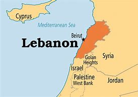

= Lesson4
:toc: left
:toclevels: 3
:sectnums:

'''

== 保释金

Another American has been kidnapped 诱拐，绑架 in West Beirut.  +

Fifty-three-year-old Frank Reed was abducted 绑架 by four gunmen this morning.  +

Islamic Jihad *claimed responsibility* (n.)责任；负责, *accusing* Reed *of* being a spy.  +

The pro-Iranian group already holds at least three other Americans and three Frenchmen.  +

Reed is the Director 负责人,主管 of the Lebanese 黎巴嫩的 International School.  +

.案例
====
.Lebanon

由于黎巴嫩扼守亚非欧战略要道，所以不少民族都曾经占领过黎巴嫩。1975年4月，黎巴嫩基督教和伊斯兰教两方爆发内战。叙利亚自1976年10月起，在黎巴嫩驻军，並扶植國內的真主黨游擊隊(伊斯兰)；而以色列亦控制過南黎巴嫩一段時期作報復。2006年7月12日，以色列与黎真主党爆发冲突.
====

He is a native of Malden, Massachusetts 马萨诸塞州 and has lived in Lebanon for eight years.  +

A federal jury 陪审团 in Brooklyn, New York today indicted a Soviet UN employee *on charges  指控；控告 of*  spying. /纽约布鲁克林的一个联邦陪审团, 今天以间谍罪起诉一名苏联联合国雇员。 +

Gennadi Zakharov is *being held without bond* 保释金；保释, *Pending (v.)等候判定或决定 trial* (n.)（法院的）审讯，审理，审判 on the charges.  +

.案例
====
.is being held without bond
表示Gennadi Zakharov被拘留而没有获得保释。在美国的司法系统中，如果被告被判定有可能逃跑、危害社会或可能逃避审判，法庭可能会决定不给予保释，并让被告在等待审判期间保持监禁状态。 +
**"bond"指的是保释金（bail）。**保释金是法庭要求被告支付的一笔款项，目的是确保被告在等待审判期间履行出庭义务。如果被告支付了保释金，他们将被释放，并在接下来的审判过程中需要履行一些条件，如不离开指定区域、遵守禁止令等。

关于 Bail and Bond 的区别, 见本页最后.
====

另一名美国人在贝鲁特西部被绑架。五十三岁的弗兰克·里德, 今天早上被四名枪手绑架。伊斯兰圣战组织声称对此负责，并指控里德是间谍。这个亲伊朗组织已经控制了至少三名美国人和三名法国人。里德是黎巴嫩国际学校的校长。他是马萨诸塞州马尔登人，在黎巴嫩生活了八年。纽约布鲁克林的一个联邦陪审团, 今天以间谍罪起诉一名苏联联合国雇员。根纳季·扎哈罗夫 (Gennadi Zakharov) 被关押，不得保释，正在等待有关指控的审判。

'''

== 间谍案

John Kailish has more from New York. /有更多来自纽约的信息。  +

"`主` The thirty-nine-year-old Soviet physicist `谓` worked at the UN Center for Science and Technology until August 23rd /when he was arrested on a Queens Subway platform for allegedly 据说，据宣称 buying military secrets from a college student.  +

*It turned out that* the student worked for the FBI /and was known by the *code name* 代号 'Berg 山；群山；山脉.' According to today's indictment 刑事起诉书；公诉书;控告；起诉, Zakharov agreed to *pay* Berg *for* information 后定 involving *the national defense* of the United States.  +

Berg, in turn, agreed to work for the Soviet Union for a period of ten years.  +

The two met *a total of* four times, *from* April 1983 *to* August of 1986.  +

At their final meeting, Zakharov allegedly 据说，据宣称 gave Berg a thousand dollars.  +

Zakharov is currently being held in a federal jail in Manhattan.  +

He faces *life in prison* /if convicted 定罪；宣判…有罪 *on* the espionage  间谍活动 *charges* 指控；控告."

约翰·凯利什 (John Kailish) 有更多来自纽约的信息。这位三十九岁的苏联物理学家, 在联合国科学技术中心工作，直到8月23日，他因涉嫌从一名大学生那里购买军事机密, 而在皇后区地铁站被捕。原来，该学生为FBI 的代号为“Berg”。根据今天的起诉书，扎哈罗夫同意, 向伯格支付涉及美国国防信息的费用，而伯格则同意为苏联工作十年。两人总共会面四次，从1983年4月, 至1986年8月。据称，在他们最后一次会面时，扎哈罗夫给了伯格一千美元。扎哈罗夫目前被关押在曼哈顿的联邦监狱中。如果因间谍罪被定罪，他将面临终身监禁。

'''

== 记者编辑被杀案

`主` The foreign editor of a news magazine recently banned (官方) 明令禁止 in Chile `谓` has been found shot dead near a cemetery （尤指不靠近教堂的）墓地，坟地，公墓 in Santiago 智利首都.  +

The family of Jose Carrasco says he was taken from his home by armed men who claimed to be police.  +

Carrasco's magazine, Analisis , has been banned *under the new state of* siege （军队,警察的）包围，围攻 *imposed 推行，采用（规章制度）；强制实行 in Chile* after an attempt this weekend to assassinate （尤为政治目的）暗杀，行刺 President Augusto Pinochet.  +

Since 自…以后；从…以来 the attempt, police have been *rounding up* 逮捕 opposition leaders 反对派领袖 although they deny they arrested Carrasco.  +

In Chile, the military government *held a rally* 公众集会，群众大会（尤指支持某信念或政党的） today *in support of* President Augusto Pinochet, who escaped an assassination attempt two days ago.  +

`主` *A crackdown 严惩措施; 镇压 on* opponents 对手；竞争者 of his government `谓` continued *in response to* 作为回应 that attack.  +

A journalist for an opposition magazine was found dead.  +

`主` His family and colleagues `谓` charge he had been kidnapped yesterday by police.  +

Tim Fosca reports (v.) now from Santiago.  +

Several thousand people gathered *in front of* La Moneda, the presidential palace, for a rally 公众集会，群众大会（尤指支持某信念或政党的） *in support* General Augusto Pinochet this afternoon.  +

Heavily armed soldiers were stationed 派驻；使驻扎 along major downtown streets for the demonstration 集会示威；游行示威, which is celebrating *the thirteenth anniversary* 周年纪念日 this week **of the military takeover** 收购；接收；接管;强行接管，控制.  +

Hundreds of members of *women's charity 慈善机构（或组织） groups* passed in review  阅兵式；检阅;评审，审查，检查，检讨（以进行必要的修改） before General Pinochet and his wife Lucia.  +

`主` The head of state `谓` *appeared physically  身体上；肉体上 unaffected* by his *close call* 幸免于难,千钧一发, 侥幸脱险 Sunday when he narrowly escaped assassination.  +

Hours before the rally, Jose Carrasco, a thirty-eight-year-old editor at the opposition magazine Analisis was found dead in a Santiago cemetery （尤指不靠近教堂的）墓地，坟地，公墓.  +

He had been shot ten times.  +

Carrasco's wife said *he was roused 唤醒；使醒来 from bed* early Monday morning by men claiming to be police.  +

But authorities officially denied his arrest.  +

Carrasco, a member of MIR, the revolutionary left movement, had been back in Chile only two years after eight years in exile  流放；流亡；放逐.  +

*The bodies of* at least two more murdered victims were also found today, but their identities have not yet been established.  +

Arrests continued in the second day of the state of siege 包围.  +

More leftist 左派人士；左翼分子 political figures were *rounded up* 逮捕, bringing *the total number of* detentions 拘留; 监禁 to twenty.  +

The government *has issued arrest orders* for a number 一群人；许多人 others, some of whom are *in hiding* 隐藏；躲藏.  +

*On the list* is at least *one member of* the Chilean 智利(人)的 *Human Rights* Commission.  +

A spokesman said `主` *the homes of Commission members* in the provincial  省的；一级行政区的 city of San Fernando `谓` were also raided 突然袭击, but no members were at home.  +

All opposition magazines were ordered closed yesterday, including the Christian democratic weekly 周报；周刊, Hoy .  +

Under the last state of siege in 1984 and 85, Hoy was allowed to continue publishing.  +

`主` The situation of *five foreign priests* and *one local lay 平信徒的；在俗的 worker* detained yesterday `谓` remains unresolved.  +

.案例
====
.lay +
(a.)  +
1.not having expert knowledge or professional qualifications in a particular subject 外行的；非专业的；缺少专门知识的 +
=> His book explains the theory *for the lay public*. 他的书为大众阐明了这个理论。 +

2.not in an official position in the Church 平信徒的；在俗的 +
=> a** lay preacher** 在俗传道员 +
====

The clergymen 男牧师 *were accused of* attacking police officers and carrying *instructions 用法说明；操作指南 on* how to make home-made bombs.  +

General Pinochet warned yesterday that human rights advocates would have to be expelled.  +

For National Public Radio, this is Tim Fosca in Santiago.  +

最近在智利被禁的一家新闻杂志的外籍编辑, 被发现在圣地亚哥的一个墓地附近被枪杀。何塞·卡拉斯科的家人称，他被自称是警察的武装人员从家中带走。 卡拉斯科的杂志《Analisis》, 在智利上周末企图刺杀奥古斯托·皮诺切特总统后实施的新戒严状态下, 被禁。自这次企图以来，警方一直在围捕反对派领导人，尽管他们否认逮捕了卡拉斯科。在智利，军政府今天举行集会，支持两天前逃脱暗杀企图的总统奥古斯托·皮诺切特。针对那次袭击，针对其政府反对者的镇压仍在继续。一家反对派杂志的一名记者被发现死亡。他的家人和同事指控他昨天被警方绑架。蒂姆·福斯卡现在从圣地亚哥报道。

今天下午，数千人聚集在总统府拉莫内达前举行集会，支持奥古斯托·皮诺切特将军。全副武装的士兵驻扎在市中心的主要街道上进行示威，本周庆祝军事接管十三周年。数百名妇女慈善团体的成员, 通过了皮诺切特将军和他的妻子露西娅的审查。周日，这位国家元首险些被暗杀，但他的身体似乎没有受到这次千钧一发的影响。集会前几个小时，反对派杂志《分析》(Analisis) 38 岁的编辑何塞·卡拉斯科 (Jose Carrasco) 被发现死于圣地亚哥公墓。他被枪杀了十次。卡拉斯科的妻子表示，周一清晨，他被自称是警察的男子从床上叫醒。但当局正式否认逮捕他。卡拉斯科是革命左翼运动“MIR”的成员，在流亡八年之后, 仅两年就回到了智利。今天还发现了至少两名被谋杀受害者的尸体，但他们的身份尚未确定。 戒严状态的第二天，逮捕行动仍在继续。更多左翼政治人物被围捕，使拘留总数达到二十人。政府已对其他一些人发出逮捕令，其中一些人目前正躲藏起来。名单上至少有一名智利人权委员会成员。一位发言人表示，省城圣费尔南多的委员会成员的住所也遭到搜查，但没有成员在家。昨天，所有反对派杂志都被勒令关闭，其中包括基督教民主周刊《Hoy》。在 1984 年和 85 年的最后一次围困期间，霍伊被允许继续出版。昨天被拘留的五名外籍神父, 和一名当地平信徒的情况, 仍未解决。这些神职人员被指控袭击警察, 并携带如何制造自制炸弹的说明。皮诺切特将军昨天警告说，人权倡导者必须被驱逐。我是圣地亚哥的蒂姆·福斯卡，来自国家公共广播电台。

'''

== 04.

Fifty years ago, Henry Ford and his son Edsel, placed  使（人）处于某位置；安置；安顿 *a modest  些许的；不太大（或太贵、太重要等）的 amount of* their vast wealth into a charitable 慈善的；行善的；布施的 foundation  基金会.  +

That was *the common practice* 常规做法 then /and is now *for wealthy Americans*.  +

The once modest foundation has grown into the largest *general purpose* 通用的,多功能的,非专用的 charitable organization in the world.  +

The Ford Foundation has *given away* 赠送 more than six billion dollars.  +

Its money has touched every aspect of American life, touched the arts, science and even public radio.  +

Warren Kozak has this report.  +

*A symphony 交响乐 orchestra*  管弦乐队 in the Midwest, an inner-city (大城市的) 市中心区 building project, Africa's chronic 长期的；慢性的；难以治愈（或根除）的 *food shortages* 食物短缺.  +

These varied activities *have one thing in common*: all have received money from the Ford Foundation.  +

Just off New York's Forty-second Street, in the shadow of the United Nations, a modern building with a huge glass wall *serves as* the world headquarters of the Ford Foundation.  +

Besides giving away money, the Foundation has always attracted some of the country's best minds.  +

"Well, I should tell you that I do not join any organization, including Ford Foundation, unless it can satisfy two criteria  (判断的) 标准." Former *Secretary of Defense* 国防部长(大臣)，国防部秘书, World Bank President, and Ford Board member, Robert McNamara.  +

"One, I insist that it be an organization I feel some capability 能力；才能 of *contributing to*. /我坚持要选一家我觉得有能力为之做出贡献的组织。 +

And, secondly, I insist it be an organization that can contribute to me, that can stimulate 鼓励; 刺激 my interest, enlarge my understanding of the world.  +

I should say that it has been, I think *the most interesting association*  联合；合伙；关联；交往;协会；社团；联盟 of my life."

At the Foundation's headquarters, `主` a staff of more than three hundred people `谓` studies data from all over the world, *spots (v.)看见；看出；注意到；发现 trends* /and *writes (v.) recommendations* 正式建议；提议.  +

In the large board room, the directors argue the merits 优点；美德；价值 of *individual requests* 个人请求 and eventually decide who will get what part of the one hundred and twenty-five million dollars that goes out every year.  +

If you think *giving away* 赠送 that kind of money is easy, you're wrong.  +

There is no question that `主` today's Ford Foundation with a four and a half billion-dollar endowment 捐赠基金 `系` is a force 力；力量 of its own. /本身就是一股力量 +

But is wasn't always that way.  +

You see, back in 1936, there were just a few large foundations when Henry and Edsel started their small project.  +

Their original contribution was only twenty-five thousand dollars and its main function was to help local charities 慈善机构 in Michigan.  +

Then in 1943, son Edsel died unexpectedly, followed four years later by his father.  +

And the family lawyers had a huge problem on their hands.  +

At the time of their deaths, the Ford Motor Company was not a *public corporation* 公开招股公司.  +

These two men owned most of the stock and, for tax reasons, a great deal of it had to *be disposed of* 应付；解决；处理;去掉；清除；销毁 and quickly.  +

There was only *one logical recipient* 受方；接受者 of the windfall 意外之财；意外获得的东西;风吹落的果子（尤指苹果）.  +

So, in the late forties 四十年代, the sleepy 安静的；冷清的；不热闹的;困倦的；瞌睡的 Michigan charity became, almost overnight, the largest foundation in the world.  +

`主` *The Third World* development programs `谓` also continue to take a lot of heat 温度 *from time to time*. /第三世界的发展计划, 也不时地继续受到很大的关注。 +

Millions of dollars have been poured into what seems to be a bottomless 很深的；深不可测的；深不见底的 pit 深洞；深坑.  +

Some problems have been solved /*only to find* 结果却发现 new ones *taking their place* 发生、举行. /有些问题解决了，却又发现了新的问题。  +

Robert McNamara defends (v.)（为…）辩护,辩解；辩白 Ford's involvement there.  +

He thinks Foundations offer something /that no one else is able to do, because without their research /the government's foreign aid would be wasted.  +

"It's insane 精神失常的;十分愚蠢的；疯狂的；危险的 to put *as much* money, invest *as much* money, per year with *as* inadequate  不充分的；不足的；不够的 an intellectual 理智的 foundation 基金会 of *how to maximize the efficiency of* those investments. /每年投入这么多钱，投资这么多钱，却没有同等海量的足够的知识基础, 来最大化这些投资的效率，这是疯狂的。 +

And Africa is *a perfect illustration* （说明事实的）故事，实例，示例 of the problem.  +

Tens of billions 十亿 of dollars are being invested in Africa today.  +

They need more.  +

But, despite that investment, `主` the GNP 国民生产总值 growth *per capita* 每人的；人均的 in the countries of sub-Saharian Africa `谓` has been negative, on average, for a decade  十年，十年期（尤指一个年代）.  +

The food production *per capita* has been negative, per capita, for over a decade.  +

Why? Who knows? Nobody knows.  +

And governments are too large; they're too rigid 死板的；僵硬的; they're too inflexible; they're too insensitive （对他人的感受）未意识到的，漠不关心的, really, unable to move as rapidly, and in some ways, as radically 根本上，彻底地 as is necessary to find the answer to that question."  /从根本上说，找到这个问题的答案是必要的。

This year the Ford Foundation will receive about nine thousand *formal requests* 正式请求 for money.   +

All of the letters and forms will be looked at; some will be studied more closely; and about twelve hundred lucky projects will receive anywhere *from* a thousand dollars *to* several million to help them *along 沿着；顺着 the way*.  +

I'm Warren Kozak in Washington.

五十年前，亨利·福特和他的儿子埃德塞尔，从他们的巨额财产中拿出一小部分，组建了慈善基金会。 +
这是当时的惯例，如今美国富人也将这一惯例继承了下来。 +
曾经那个资金并不充裕的基金会现已发展成为了全球最大的多用途慈善机构。 +
福特基金会捐出的慈善金额已超过六十亿美元。 +
它的捐赠涉及了美国生活的方方面面，涉及了艺术领域、科学领域，乃至公共广播领域。 +
沃伦·科扎克报道。 +
中西部交响乐团，市中心建筑项目，非洲长期食品短缺问题。 +
这些项目各式各样，但有一个共同点：所有人都从福特基金会那里得到了钱。 +
就在纽约第四十二街，在联合国大楼附近， +
矗立着一座拥有巨大玻璃墙的现代建筑，这就是福特基金会全球总部。 +
除了钱款捐赠之外，基金会一直吸引着这个国家的顶尖人才（慕名加入）。 +
“嗯，我应该告诉你，我不加入任何组织， +
包括福特基金会，除非它能满足两个标准。” +
前国防部长、世界银行总裁、福特董事会成员罗伯特·麦克纳马拉。 +
“一，我坚定这是一个我觉得有能力为它作出贡献的组织。 +
其次，我坚定，它是一个能为我做出贡献的组织， +
它能激发我的兴趣，扩大我对世界的认知。 +
我应该说，这是我一生中知道的最有趣的协会。 +
在基金会的总部，三百多人从世界各地收集数据，进行研究， +
发布趋势报告，并撰写建议。 +
在宽阔的董事办公室里， +
董事们讨论每个申请的优劣，并最终决定这些善款应该花落谁家。每年基金会的善款总额为1.25亿美元。 +
如果你认为将那笔钱分发出去是件容易事，那你可就错了。 +
毫无疑问，今天资产达45亿美元的福特基金会，拥有着自己的力量。 +
但境况并非从一开始就这么顺风顺水。 +
你看，时间回到1936年，当时只有几个大的基金会，而亨利和埃德塞尔才刚刚开始做起。 +
他们最初的捐款只有2.5万美元，其主要职能也只是助力密歇根当地的一些慈善机构。 +
随后1943年，儿子埃德塞尔意外死亡，四年后他的父亲也随之亡故。 +
于是，其家庭律师遇到了一个大问题。 +
福特父子去世时，福特汽车公司并不是一家上市公司。 +
这两个人手上都持有股票，出于税收原因，其中有很大一部分必须得到迅速处理。 +
而这笔横财只有一个合乎逻辑的出路。 +
所以，在四十年代末，这个沉睡的密歇根慈善机构几乎一夜成为了世界上最大的基金会。 +
谋求发展的第三世界也不时从基金会手上获益。 +
他们将数百万美元投入到无底洞里。 +
有些问题已经解决，而新的问题又随之产生。 +
罗伯特·麦克纳马拉为福特基金会的所作所为加以辩护。 +
他认为基金会的善举，任何其他人都做不到， +
因为如果没有他们的研究成果，政府的国外援助就会付诸东流。 +
“投入这么多钱是愚蠢的， +
每年投入这么多，但却极度缺乏保障投资效率的最大化的智囊团 +
非洲就是这个问题的完美例证。 +
今天，我们在非洲投资了数百亿美元。 +
他们还需要更多。但是，尽管我们投资了， +
在过去十年中，平均而言，撒哈拉沙漠以南非洲地区的人均国民生产总值增长还一直为负。 +
在过去的十几年间，人均粮食产量一直是负数，人均，为什么？谁知道呢？ +
没有人知道。政府太大了；太死板了，太不灵活了； +
他们太不敏感了，真的，动作太慢， +
在某些方面，从根本上说，找到这个问题的答案是必要的。” +
今年福特基金会将收到大约九千项正式的资金申请。 +
所有的信件和表格都要看；有些还要更仔细地研究； +
各地总共约有1200个幸运项目将会接收到资金，这些资金额度从1000美元到几百万美元不等，将会一直帮助那些接受者完成他们想做的事。 +
我是沃伦·科扎克，华盛顿报道。

'''

== The Difference Between Bail and Bond
保释和保证金之间的区别

https://www.savannahlawyers.com/article/bail-or-bond-is-there-a-difference/

Attorneys often use the word *bail* and *bond* interchangeably 可交换地 so sometimes it can be confusing. Technically, *bail* is the money or property required in the form of a *security deposit* 押金; 交易保证金 and is given to ensure that you will return and appear for your *court date* 开庭日期 if you are released. By paying the bail amount, you are using that act to symbolize (v.)象征；是…的象征；代表 your seriousness in promising to return if you are let out.  If you do not keep that promise, you forfeit (v.)（因犯错）丧失，被没收 the bail.

律师经常互换使用“保释”和“保证金”两个词，因此有时可能会造成混淆。从技术上讲，保释是以保证金形式提供的金钱或财产，目的是确保您在被释放后能够返回并出庭出庭。通过支付保释金，您用这一行为来象征您认真承诺如果您被释放就会返回。如果您不遵守该承诺，您将丧失保释资格。

Sometimes you may not have the financial resources to pay, or you are unable to get the money quickly. This is where a bondsman 保证人 or bonding company *steps in* 干预. They assure the court that they will pay the bail amount on your behalf in exchange for you paying them a fee. This financial pledge 保证；诺言；誓约 from the bonding company is called a *bond*.

有时您可能没有财力支付，或者无法快速拿到钱。这就是担保人或担保公司介入的地方。他们向法庭保证，他们将代表您支付保释金，以换取您向他们支付费用。*担保公司的这种财务承诺称为 bond。*

A *bail bond* is a contract between you and the bonding company. It is called a bail bond to be more specific 明确的；具体的 **as to** 关于，就……而言  what the bond is for.  *In exchange for* paying the bondsman, the bondsman agrees to *post your bail* so you can go home.

保释保证金是您与保证金公司之间的合同。它被称为保释保证金，更具体地说明保证金的用途。作为支付担保人费用的交换条件，担保人同意保释你，这样你就可以回家了。

Bonding companies or bail bondsmen do not do this for free. The cost to you *depends on* the bonding company. Some companies charge 15% of the bail amount while others charge 10%. For example, if your bail is set at $25,000 /then 10% of $25,000 would be $2,500 /and that is what you would need to **come up with** 找到（答案）；拿出（一笔钱等） to pay your bondsman.

担保公司或保释担保人不会免费这样做。您的费用取决于担保公司。有些公司收取保释金的 15%，而另一些公司则收取 10%。例如，如果您的保释金定为 25,000 美元，那么 25,000 美元的 10% 就是 2,500 美元，这就是您需要支付担保人费用的金额。

Some companies require the full amount /while others may allow a *down payment*  （分期付款的）首期付款；预付金；定金 upfront (a.)预付的；预交的 /and the balance  余额 to be *paid off* 还清. If you personally were able to *pay* the full amount of the bail *to* the court, then you will *get* all or some of that money *back* when the case is over.  If you pay a bonding company their fee to post your bail, you will not get that fee back.

有些公司要求全额付款，而另一些公司则可能允许预先支付首付款，然后还清余额。如果您个人能够向法院支付全额保释金，那么当案件结束时，您将获得全部或部分保释金。如果您向担保公司支付保释费，您将无法取回该费用。

'''
