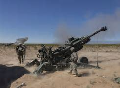
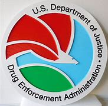
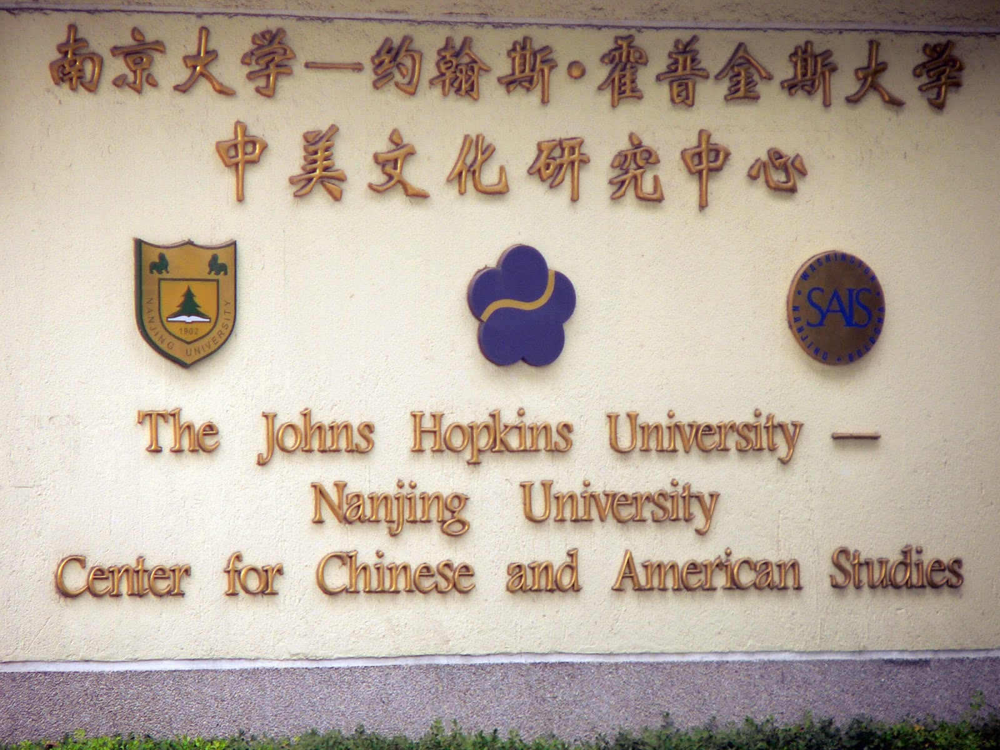
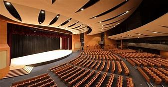

= Lesson5
:toc: left
:toclevels: 3
:sectnums:

'''

The House began debate 辩论 today on a three-year bill （提交议会讨论的）议案，法案 to combat trafficking 非法交易（尤指毒品买卖） and use of illegal drugs.  +

The measure *has the support of* most representatives 该措施得到了大多数代表的支持/and House Speaker Thomas O'Neill says he expects it to pass by tomorrow.  +

*Among other things* 此外, the bill would increase penalties for violators 违反者, provide money to increase *drug enforcement* (执行，实施)禁毒，毒品管制 and *coast guard 海岸警卫 personnel* （组织或军队中的）全体人员，职员, and require drug producing countries *to establish eradication 根除，消灭 programs* as a condition of US support for *development loans* 贷款，借款.  +

A *cultural exchange* 交换；互换；交流；掉换 between the US and the Soviet Union *may face an American boycott* 拒绝购买（或使用、参加）；抵制 unless *US News and World Report* 美国新闻与世界报道 correspondent 记者；通讯员, Nicholas Daniloff, is freed from a Moscow jail.  +

An American style *town meeting* is scheduled to take place in Latvia 拉脱维亚 next week, but `主` the two hundred seventy Americans 后定 due to *take part* `谓` say {*they won't go* if Daniloff remains in jail}.  +

They add  补充说；继续说 {the decision *is a personal one* 是每个人个体或私人的选择 /and *is not being made by* the Reagan Administration *in retaliation 报复 for* the Daniloff detention 拘留；扣押；监禁}.  +

众议院今天开始辩论一项为期三年的法案，以打击贩运和使用非法毒品。该措施得到了大多数代表的支持，众议院议长托马斯·奥尼尔表示，他预计该措施将于明天通过。除其他外，该法案将加大对违法者的处罚力度，提供资金增加禁毒执法和海岸警卫队人员，并要求毒品生产国制定根除计划，作为美国支持发展贷款的条件。除非《美国新闻与世界报道》记者尼古拉斯·达尼洛夫从莫斯科监狱获释，否则美国和苏联之间的文化交流可能会面临美国的抵制。一场美国式的城镇会议定于下周在拉脱维亚举行，但预定参加的 270 名美国人表示，如果达尼洛夫仍被关在监狱里，他们就不会参加。他们补充说，这一决定是个人决定，并不是里根政府为了报复丹尼洛夫被拘留而做出的。

'''

Egyptian and Israeli negotiators *have reached agreement on* resolving the Taba *border dispute*(争论；辩论；争端；纠纷) 边界争端, *clearing the way for* a summit between the two countries to begin tomorrow.  +

Egyptian President Hosni Mubarak and Israeli *Prime Minister* Shimon Peres will meet in Alexandria 亚历山大港（位于埃及）.  +

Details of the *Taba agreement* have not been made available.  +

埃及和以色列谈判代表就解决塔巴边界争端达成协议，为明天两国举行峰会扫清了道路。埃及总统穆巴拉克和以色列总理西蒙·佩雷斯将在亚历山大举行会晤。塔巴协议的细节尚未公布。

'''

The United States *House of Representatives* 众议院 is debating *an omnibus (a.)综合性的；（若干种作品的）选编的 drug bill* and *expects to pass the measure* tomorrow.  +

Though the bill *has attracted strong bipartisan 两党的；涉及两党的 support*, NPR's Cokey Roberts reports (v.) the debate on the issue *points up* (尤指通过明确而)强调 the differences between political parties.  +

.案例
====
.NPR (National Public Radio)
美国国家公共电台

====

When Congress 国会，议会 returned from *the Fourth of July* 美国独立纪念日(7月4日) recess 休会期, *House Speaker* 众议院议长 Tip O'Neill said /there was only one thing *members were talking about* in the cloak-room 存衣处；寄存处: drugs.  +

The Democrats *quickly pulled together* chairmen *from* twelve different committees 委员会 to draft a drug package 必须整体接收的）一套东西，一套建议；一揽子交易.  +

Then, *stung  刺；蜇；叮;激怒；使不安 by criticism*  批评；批判；责备；指责 that *they were acting in a partisan （对某个人、团体或思想）过分支持的，偏护的，盲目拥护的 fashion*, the Democratic leaders invited the Republicans 共和党党员 to join them in the newly declared war on drugs.  +

So, when the bill came to the House floor 议员席；全体议员；全体与会者 today, the party leaders *led off*  开始 debate.  +

.案例
====
.floor
*the floor* [ sing.] the part of a building where discussions or debates are held, especially in a parliament; the people who attend a discussion or debate 议员席；全体议员；全体与会者 +

=> We will now take any questions *from the floor*. 现在我们将接受会众席上的任何提问。
====

Texas Democrat 民主党人 Jim Wright.  +

"It's time to declare an all-out 全力以赴的 war, to mobilize 组织；鼓动；动员 our forces, public and private, national and local, in a total coordinated 协调一致的 assault 攻击；突击；袭击 upon(=on) this menace 威胁；危险的人（或物）, which is draining （使）流走，流出;使（精力、金钱等）耗尽 our economy of some two hundred and thirty billion dollars this year, slowly *rotting away* （使）腐烂，腐败变质 the fabric （社会、机构等的）结构;织物；布料 of our society, seducing 诱惑; 勾引; 诱奸 and killing our young.  +

That `主` it will take money `系` *is hardly 几乎不；几乎没有 debatable* 可争辩的；有争议的. / 这需要金钱几乎是无可争议的。  +

We can't *fight* artillery （统称）火炮 *with* spitballs 纸团,小孩弄的唾液湿纸团." `主` The question of just how much money 后定 this measure will cost `谓` *has not been answered to the satisfaction of* all members.

我们不能用纸团来对抗大炮。”这项措施到底要花多少钱的问题, 尚未得到令所有成员满意的答案。 +

.案例
====
.artillery

====

Democrats say /it's one and half billion dollars over three years, with almost seven hundred thousand for next year.  +

Republicans claim /the *price tag* 价格标签 will run higher /and are trying to emphasize 强调；重视；着重 other aspects of the drug battle, aspects which they think *play 发挥（作用） better* in Republican campaigns 共和党的竞选.  +

Minority 少数派 leader Robert Michel.  +

"`主` *The ultimate 最后的；最终的；终极的 cure* for the drug epidemic （迅速的）泛滥，蔓延 `谓` must come from *within the heart of* each individual *faced with the temptation 引诱；诱惑 of* taking drugs.  +

It is ultimately 最终；最后；终归 a problem of character （人、集体的）品质，性格, of *will power* 意志力, of family and community, and concern  关爱；关心, and personal pride 自尊心；自尊；尊严." Among other items, `主` the bill 后定 before the House `谓` *increases penalties for* most drug related crimes, sets the minimum *jail term* 监禁期 of twenty years for drug trafficking 非法交易（尤指毒品买卖） and manufacturing 制造，制造业, *authorizes (v.)批准；授权 money for* the *drug enforcement administration* 缉毒局 and prison construction, *beefs up* 使更大（或更好、更有意思等） the ability of *the coast guard* and *customs service* 海关服务;美国海关总署 to stop drugs coming into this country, and creates programs for drug education.  +

.案例
====
.drug enforcement administration
美国缉毒局（Drug Enforcement Administration，简称DEA）是美国司法部下属的执法机构，主要任务是打击美国境内的非法毒品交易和使用。 +

.customs service

====

`主` The various sections of the measure `谓` *give* House members *ample opportunity* to speak on an issue where they want their voices heard.  +

Maryland 马里兰（美国州名） Democratic Barbara McCulsky was nominated for the Senate 参议院 yesterday.  +

Today, she *spoke to* the part of the bill *which funds drug eradication
根除，消灭 programs* in foreign countries.  /今天，她就该法案中资助外国根除毒品计划的部分, 发表了讲话。 +

"When we fought *yellow fever* 黄热病, we didn't *go at 拼命干；卖力干;攻击某人 it* one mosquito *at a time*. We *went right to* the swamp  沼泽（地）. /当我们抗击黄热病时，我们并没有一次只对付一只蚊子。我们径直走到沼泽地。 +

.案例
====
.go at sb
to attack sb 攻击某人 +

=> They *went at each other* furiously. 他们相互猛烈攻击。  +

.go at sth
to make great efforts to do sth; to work hard at sth 拼命干；卖力干 +

=> They *went at the job* as if their lives depended on it. 他们干起活来好像性命攸关似的。 +

====

That's what *the Foreign Affairs 外交事务 section* of this legislation 立法；制订法律;法规；法律 will do.  +

It will go to the swamps, or where cocaine 可卡因；古柯碱 is either （对两事物的选择）要么…要么，不是…就是，或者…或者  grown, refined 精炼；提纯, or manufactured （用机器大量）生产，制造." Republican Henson Moore is *running for 竞选 the Senate* in Louisiana.  +

He spoke to the part of the drug bill which changes the trade laws for countries which deal in drugs.  +

"We're moving to stop something; it's absolutely idiotic  十分愚蠢的；白痴般的.  +

It needs to be stopped: this situation of where a country can *sell legally 按照法律，法律上；合法地 to us* on the one hand /and *illegally to us* under the table, selling drugs in this country /poisoning our young people and our population."

美国众议院正在讨论一项综合药物法案，预计将于明天通过该法案。尽管该法案吸引了两党的大力支持，但美国国家公共广播电台 (NPR) 的科基·罗伯茨 (Cokey Roberts) 报道称，有关该问题的辩论, 凸显了政党之间的分歧。当国会从国庆节休会回来时，众议院议长蒂普·奥尼尔表示，议员们在衣帽间里只讨论一件事：毒品。 民主党迅速召集了十二个不同委员会的主席, 起草一份药品方案。然后，由于批评他们的党派行为，民主党领导人邀请共和党加入他们新发起的禁毒战争。因此，当该法案今天提交众议院时，党派领导人引发了辩论。德克萨斯州民主党人吉姆·赖特。 “现在是宣战的时候了，动员我们的公共和私人、国家和地方力量，对这种威胁进行全面协调的攻击，这种威胁, 今年正在缓慢地消耗我们约 2300 亿美元的经济。腐烂我们社会的结构，引诱和杀害我们的年轻人。这需要金钱几乎是无可争议的。我们不能用纸团来对抗大炮。”这项措施到底要花多少钱的问题, 尚未得到令所有成员满意的答案。民主党人表示，三年内将投入 1.5 亿美元，明年将投入近 70 万美元。共和党人声称价格标签将会更高，并试图强调毒品斗争的其他方面，他们认为这些方面, 在共和党竞选中发挥得更好。少数党领袖罗伯特·米歇尔。 “毒品泛滥的最终治愈方法, 必须来自于每个面临吸毒诱惑的人的内心。这最终是一个性格、意志力、家庭和社区、关心和个人自豪感的问题。除其他事项外，众议院提交的法案, 增加了对大多数与毒品有关的犯罪的处罚，规定贩毒和制造毒品的最低刑期为二十年，授权为缉毒管理和监狱建设提供资金，增强沿海地区的能力警卫和海关部门, 阻止毒品进入这个国家，并制定毒品教育计划。该措施的各个部分, 为众议院议员提供了充分的机会, 就他们希望听到自己声音的问题发表意见。马里兰州民主党人芭芭拉·麦库斯基, 被提名为参议院, 昨天。今天，她就该法案中资助外国根除毒品计划的部分, 发表了讲话。“当我们抗击黄热病时，我们并没有一次只对付一只蚊子。”我们径直走到沼泽地。这就是该立法的外交部分将要做的事情。 ” 共和党人汉森摩尔正在路易斯安那州竞选参议员。他谈到了毒品法案中, 改变毒品交易国家贸易法的部分。 “我们正在采取行动阻止某些事情；这绝对是愚蠢的。这种情况需要制止：一个国家一方面可以合法地向我们出售毒品，另一方面可以在私底下非法向我们出售毒品，在这个国家出售毒品，毒害我们的年轻人和人民。”

'''

Today in China, in Nanjing, `主` balloons, firecrackers 鞭炮，爆竹 and *lion dancers* `谓` mark the dedication （建筑物等的）奉献典礼，落成典礼 of the Johns Hopkins University — Nanjing University Center for Chinese and American Studies.  +

For the first time since World War II, Chinese and American
students will *attend a graduate  大学毕业生；学士学位获得者 institution* 机构 in China *that is administered jointly by* academic organizations that are *worlds apart* figuratively  比喻地；象征性地 and literally 按字面；字面上.  /自二战以来，中美学生将首次共同参加由在象征上和地理上相距甚远的学术组织, 联合管理的中国研究生院。+

NPR's Susan Stanberg reports.  +

.案例
====
.The Johns Hopkins University-Nanjing University Center for Chinese and American Studies
南京大学-约翰斯·霍普金斯大学 中美文化研究中心. 成立于1986年。*旨在培养从事"中美双边事务"和"国际事务"的专门人才.* 中美文化研究中心, *以中美两国的政治、社会、经济、法律、历史文化, 及当代国际问题等, 作为教学与研究的主要内容。*

====

Cross-cultural encounters （意外、突然或暴力的）相遇，邂逅，遭遇，冲突 can be *extremely enriching* 充实的；丰富的; cross-cultural encounters can be *utterly 完全地，彻底地 absurd* 荒谬的；荒唐的；怪诞不经的.  +

"Let's see.  +

That would be eighty-seven.  +

So, ...  +

ba-shi-qi-nian-qian, ...  +

let's see, ...  +

equal ...  +

proposition 提议，建议（尤指业务上的）; 见解；主张；观点 equal, ..." Here's what that American was trying to say in Chinese.  +

"Four score 二十 and seven years ago, our fathers *brought forth* 产生、创造或引起某物的存在 on this continent *a new nation* ...  /八十七年前，我们的先辈在这个大陆上建立了一个新的国家 +

a new nation *conceived  怀孕；怀（胎）;想出（主意、计划等）；想象；构想；设想 in liberty* 自由, and *dedicated to the proposition  见解；主张；观点 that* all men are created equal 平等的；同等的." Now you don't have to be dealing with classic American oratory 讲演术；雄辩术 to run into problems.  /"一个在自由中构想的新国家，并致力于所有人生而平等的主张。”现在，你并非一定要涉及经典的美国演讲, 才会遇到问题。 +

In planning 计划制订；规划过程 for the Center for Chinese and American Studies, there was much debate *as to* 关于，就……而言 whether the new auditorium 礼堂；会堂;听众席，观众席 on the Nanjing campus （大学、学院的）校园，校区 should have a flat or sloped 倾斜的 floor.  +

.案例
====
.auditorium

====

If the floor were flat, the auditorium could be used for dances, for parties 聚会, but a sloped floor would be better for listening, for viewing films and slides 幻灯片.  +

"The argument finally won out that *for practical reasons* a flat floor would be best because it ...  it really would make it a multi-purpose 多用途的；多功能的 room.  +

You wouldn't have to fix the furniture." Stephen Muller is President of Johns Hopkins University, the US end （尤指经营活动的）部分，方面 of this Sino-American 中美的 joint venture （尤指有风险的）企业，商业，投机活动，经营项目 in learning.  /斯蒂芬·穆勒是约翰霍普金斯大学的校长，这是这个中美联合学术合作的美国部分。 +

"So, a flat floor was built.  +

.案例
====
.end
(n.)[ usually sing.] a part of an activity with which sb is concerned, especially in business （尤指经营活动的）部分，方面 +

=> We need somebody *to handle the marketing end of the business*. 我们需要有人来处理业务的推广。 +

=> Are there any problems *at your end*? 你那边有什么问题吗？ +

=> I have kept *my end of the bargain*. 我已履行了我方的协议条件。 +

====

Only the Chinese in building /it finally ended up with a flat floor but at two different levels, one higher than the other.  +

So, if you want to use it for dances, you either have to have very short women with very tall men or *vice versa* 反过来也一样；反之亦然." Twenty-four Americans and thirty-six Chinese of mixed heights are the first students at the Hopkins-Nanjing Center.  +

Nanjing used to be Nanking, by the way, *back in the days* when Beijing was Peking.  +

The Americans will *take classes* in Chinese history, economics, trade, politics, all from Chinese faculty （高等院校的）系，院;全体教师.  +

The Chinese will study the US with American university professors.  +

Johns Hopkins President Stephen Muller says this is advanced study work.  +

All the Chinese students are proficient 熟练的；娴熟的；精通的；训练有素的 in English; all the Americans have *master's 硕士 degrees* plus 外加 *fluency in Chinese*.  +

"The twenty-four Americans come from about eighteen colleges and universities.  +

`主` No one institution in this country `谓` produces that many people of this character; so that's a beginning.  /这个国家没有任何一个机构能培养出这么多这种性格的人；所以这只是一个开始。 +

Nanjing is not the place; the Center is not the place to go, if you want a doctorate 博士学位 in Chinese history or Chinese language or Chinese literature or whatever. /如果你只是想要获得中国历史、中国语言、中国文学等方面的博士学位的话, 南京不是你要去的那个地方；研究中心也不是你该去的地方 +

This is a pre-professional  为从事职业作准备的，职前的 program." Which means the men and women who spend the year at the Nanjing Center will end up as diplomats 外交官 or business people in one another's country.  +

"Our hope is that the Americans, to speak about those, who are going to be incidentally 偶然；附带地 rooming (v.)居住，住宿 with Chinese roommates, which is a very interesting thing the Chinese agree to, that the Americans will not only bring a year of living in China, a year of having studied with Chinese faculty 全体教员 and hearing *the Chinese view* of *Chinese foreign policy* in economics and so on, that they will also *have the kind of friends* among Chinese *roughly 大约；大致；差不多 their age* who are going to be dealing with the United States.  +

"我们的希望是，对于那些将与中国室友住在一起的美国人，这是中国同意的一件非常有趣的事情，美国人不仅会带来在中国生活的一年，与中国教职工一起学习，听到中国关于外交政策和经济等方面的观点，而且他们还会在中国结交到与他们年龄相当的朋友，这些朋友将要与美国打交道。"

That *will slowly*, over the years, *create* a real network, if you will, if people who, because they've had this common experience, can *deal with* each other very easily and, you know, be kind of a *rallying point* 有感召力的人（或团体、事件等）；号召力 — an old boy, old girl network, as it were." Hopkins President Muller admits that a simple exchange program — Chinese students coming to the US, and American students going to China — would involve *far fewer headaches* 头痛 than *running jointly (ad.) an academic institution* on foreign soil  国土；领土；土地.  +

.案例
====
.rallying point
a person, a group, an event, etc. that makes people come together in support of sth 有感召力的人（或团体、事件等）；号召力
====

这将逐渐在多年内建立一个真正的网络，如果你愿意这么说的话，这个网络将由那些因为有过这个共同经历而能够非常容易地相互交往的人构成，你知道，成为一种凝聚点——可以说是一种老同学网络。霍普金斯大学校长穆勒承认，一个简单的交流计划——中国学生来美国，美国学生去中国——将比在国外共同管理一个学术机构更为简单。

Plus the success of the Hopkins-Nanjing Center *depends on* undependables 靠不住的，不可靠的；不可信赖的, like *continuing (v.) sweet Sino-American relations* and *being able to attract funding*.  +

And there's this wrinkle 皱褶，皱痕." "Some of the people who will study there, without any question, will probably *come from* or afterwards *enter the intelligence community* 情报界.  +

That *it's really desirable 可取性;想望的；可取的；值得拥有的；值得做的 that* `主` people who do that `谓` have that kind of background.  +

We're very honest about that, but it's so easy to *denounce* the whole thing *as* an espionage (n.)间谍活动；谍报活动；刺探活动 center, or something.  +

You know, there's a lot of fragility (n.)脆弱，易碎（性）；虚弱 in this thing." Stephen Muller is President of Johns Hopkins University in Baltimore.  +

.案例
====
.desirable
N-UNCOUNT 可取性 +

=>  ...*the desirability of* democratic reform.  …民主改革的可取性。 +

====

此外，南京大学-约翰霍普金斯大学中心的成功, 取决于不可靠的因素，比如持续良好的中美关系和能够吸引资金。
还有一个复杂的问题。“毫无疑问，将在那里学习的一些人可能来自或之后进入情报界。人们确实希望从事这方面工作的人具备这样的背景。我们对此非常坦诚，但很容易将整个事情指责为一个间谍中心，或者什么的。"

The Hopkins-Nanjing University Center for Chinese and American Studies was dedicated 为…举行奉献典礼；为（建筑物等）举行落成典礼 today in China.  +

I'm Susan Stanberg.  +

"How do you say good luck in Chinese?" "Don't know. I don't know Chinese." "You'd better learn." "That's a phrase I should know.
Yes."

今天在中国，在南京，气球、鞭炮和舞狮, 标志着约翰·霍普金斯大学—南京大学中美研究中心的落成。这些组织在象征意义上和字面意义上, 是截然不同的。 NPR 的苏珊·斯坦伯格报道。跨文化的接触可以极其丰富；跨文化的遭遇可能是完全荒谬的。 “让我们看看。那就是八十七。所以，...​八十七年-钱，...​让我们看看，...​等于...​命题等于，...​”这就是那个美国人想说的中国人。 “二十七年前，我们的父辈在这片大陆上建立了一个新国家……一个在自由中孕育的新国家，致力于人人生而平等的主张。”现在，您不必处理经典的美国演讲也会遇到问题。在中美研究中心的规划过程中，关于南京校区的新礼堂应该采用平坦还是倾斜的地板, 存在很多争论。如果地板是平的，礼堂可以用来跳舞、聚会，但倾斜的地板更适合聆听、观看电影和幻灯片。 “这场争论最终胜出，出于实际原因，平坦的地板是最好的，因为它……​它真的可以使它成为一个多功能房间。你不必修理家具。”斯蒂芬·穆勒是美国约翰·霍普金斯大学校长，曾在这家中美合资企业学习。 “所以，建造了一个平坦的地板。只有中国人最终建造了一个平坦的地板，但有两个不同的高度，一个比另一个高。所以，如果你想用它来跳舞，你要么必须有非常矮的女性和非常高的男性，反之亦然。”霍普金斯南京中心的第一批学生是二十四名美国人和三十六名不同身高的中国人。顺便说一下，南京曾经是南京，早在北京还是北平的时候。美国人将学习中国历史、经济、贸易、政治等课程，所有课程均由中国教师授课。 中国人将与美国大学教授一起学习美国。约翰·霍普金斯大学校长斯蒂芬·穆勒表示，这是一项高级研究工作。所有中国学生都精通英语；所有美国人都拥有硕士学位并且中文流利。 “这二十四名美国人来自大约十八所学院和大学。这个国家没有任何一个机构能培养出这么多这种性格的人；所以这只是一个开始。南京不是那个地方；中心也不是你该去的地方，如果你想要获得中国历史、中国语言、中国文学等方面的博士学位。这是一个专业预科课程。”这意味着在南京中心度过一年的男男女女最终将成为彼此国家的外交官或商人。 “我们希望美国人，谈到那些偶然与中国室友同住的人，这是中国人同意的一件非常有趣的事情，美国人不仅会带来在中国生活的一年，在与中国教师一起学习并听取了中国人对中国在经济等方面的外交政策的看法之后，他们也将在与他们年龄相仿的中国人中拥有那种将要与美国打交道的朋友。多年来，创建一个真正的网络，如果你愿意的话，如果人们因为有这种共同的经历，可以很容易地彼此打交道，并且，你知道，成为一个集结点——一个老男孩，可以说是老女孩网络。”霍普金斯大学校长穆勒承认，一个简单的交换项目——中国学生来美国，美国学生去中国——比在外国土地上联合运营一个学术机构要少得多。 此外，霍普金斯大学南京中心的成功取决于一些不可靠的因素，比如持续良好的中美关系和吸引资金的能力。这就是一个问题。” “毫无疑问，一些在那里学习的人可能来自情报界或后来进入情报界。这样做的人有这样的背景是非常可取的。我们对此很诚实，但很容易将整个事件谴责为间谍中心或其他什么。你知道，这件事有很多脆弱性。”斯蒂芬·穆勒是巴尔的摩约翰·霍普金斯大学校长。霍普金斯-南京大学中美研究中心今天在中国落成。我是苏珊·斯坦伯格。“你用中文说祝你好运？” “不知道。我不懂中文。” “你最好学学。” “这是我应该知道的一句话。是的。”

