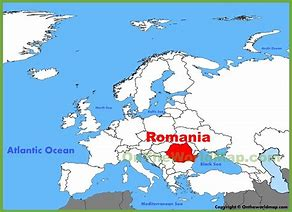

= step 3- Lesson 7
:toc: left
:toclevels: 3
:sectnums:
:stylesheet: ../../+ 000 eng选/美国高中历史教材 American History ： From Pre-Columbian to the New Millennium/myAdocCss.css

'''

== 新闻简报

Both House 众议院 and Senate 参议院 negotiators 谈判代表；协商者 today *approved sweeping  影响广泛的；大范围的；根本性的 immigration legislation* that could *grant （尤指正式地或法律上）同意，准予，允许 amnesty （对政治犯的）赦免，大赦 to* millions of illegal aliens who entered the country before 1982.  +

[.my1]
====
.amnesty
--> a（否定）+mne（记忆）+sty（名词后缀）→不再记得→既往不咎→大赦
====

The bill, as worked out in five hours of closed-door 秘密的，非公开的 negotiations, would establish a system of fines 罚款 against employers who hire illegal immigrants.

[.my2]
这项法案是秘密谈判数小时后的产物，它会对雇用非法移民的雇主予以罚款。  +

It would also *make* those who came to the US illegally but have established roots in this country eligible 有资格的；合格的；具备条件的 *for amnesty* 赦免，大赦.

[.my2]
它也会对那些非法入境美国，但在这个国家已经扎根的人们予以赦免。 +

*The Supreme Court* today *agreed to decide* if Illinois can require minors  未成年人 wanting abortions 堕胎 *to notify their parents* or *obtain judicial 法庭的；法官的；审判的；司法的 consent* 同意；准许；允许.

[.my2]
关于伊利诺斯州要求堕胎的未成年人，（执行堕胎前）是要通知其父母, 还是要获得司法同意一事，最高法院今日同意做出裁决。 +

The justices  司法制度；法律制裁；审判;法官（亦作称谓） will review 评审，审查，检查，检讨（以进行必要的修改） the decision *striking down* 摧垮；使病倒；使丧命 a 1983 law, which required some girls to wait twenty-four hours after telling their parents they wanted an abortion.

[.my2]
大法官们将审查"废除一项1983年法律"的决定，该法律要求一些女孩在告诉父母她们想要进行堕胎后, 等待24小时（方可实施）。

'''

== 诺贝尔和平奖获得者

It was announced today that `主` the winner of this year's Noble Peace Prize `系` is Elie Wiesel.  +

He has written twenty-five books *on* his experiences in a Nazi prison of war camp  营地 and *on* the Holocaust 大屠杀;（尤指战争或火灾引起的）大灾难，大毁灭.

[.my2]
他著有二十五本书，内容讲述了他在纳集中营及大屠杀中的经历。 +

And he's been a human rights activist for thirty years.  +

NPR's Mike Shuster reports.  +

"Wiesel was sleeping in his Manhattan apartment *when he received the word* at five o'clock this morning *from* the Nobel Committee in Oslo 奥斯陆（挪威首都）, Norway.  +

Wiesel said he was flabbergasted 使目瞪口呆; 使大吃一惊 at the news, and later at a *press conference* (（通常持续几天的大型正式）会议，研讨会) 记者招待会；新闻发布会, he said he would *dedicate* his Prize *to* the survivors of the Holocaust and their children.  +

"The honor is not mine alone.  +

It *belongs to* all the survivors who have tried to do something with their pain, with their memory, with their silence, with their life." Wiesel, fifty-eight, is a native  出生于某国（或某地）的人 of Rumania 罗马尼亚.  +

[.my1]
====
.Rumania

====

As a teenager, he and his family were sent to a Nazi *death camp* 死亡集中营.  +

He and two sisters survived; his mother, father, and younger sister did not.  +

After the War, Wiesel went first to France, then to the United States.  +

He *is credited 认为是…的功劳；把…归于 with* the first use of the word 'Holocaust' to describe the Nazi extermination 消灭；根绝 of the Jews."

[.my2]
他被公认为是第一个用“大屠杀”这个词，来描述纳粹对犹太人（种族）灭绝的人。

'''

== 给非法移民以赦免

A House-Senate Conference Committee has agreed to an immigration reform 改革；改进；改良 bill.  +

The measure 措施；方法, which had died in the final days of the last two Congresses 国会，议会, now looks *as though* 好像，仿佛 it will become law. /在上两轮国会会议的最后几天，此法案本已被废，但现在看来却将立法。  +

NPR's Cokie Roberts reports.  +

One of the chief advocates 拥护者；支持者；提倡者 of the immigration bill, New York Democrat Charles Schumer, says that this year immigration became a *white hat* 好人 issue, that `主` *the forces* fighting against the measures `谓` *finally had a force* on the opposite side of *equal rate* 等比率 public opinion.  +

[.my2]
移民法案的主要倡导人之一，纽约民主党参议员查尔斯·舒默，说今年移民问题成为了高度热点问题，那些移民措施的反对力量，最终在其对立面上看到了公众舆论的效果，二者势均力敌。

[.my1]
====
.white hat
"white hat" 是一个隐喻，通常用来描述积极、正面、道德高尚的行为或立场。 +
white hat 是一个古老的俚语，常常用于口语中表示好人的意思。为什么呢？原来在美国西部片中，好人带白帽子，坏人带黑帽子，所以就会用white hat代指好人，相当于 Good people 或者 nice guy.

移民法案的主要支持者之一，纽约州的民主党员查尔斯·舒默（Charles Schumer），表示今年移民问题成为一个积极的议题，即反对这些措施的力量(即反对移民改革的人), 最终在舆论场上找到了一个与之相等的正面力量(即支持移民改革的人)。
====

*The opponents 反对者；阻止者;对手；竞争者 of immigration reform* have always been many: Hispanics 西班牙的;母语为西班牙语的人 in Congress and in the country *have opposed 反对（计划、政策等）；抵制；阻挠 the part of the bill* 后定 most lawmakers consider (v.) key — punishment for employers *who knowingly 故意地；蓄意地;心照不宣地；知情地 hire illegals*.  +

[.my2]
反对移民改革的人总是很多：国会内部及外部的拉美裔人士，他们所反对的部分, 恰恰是大多数议员认为的关键部分 —— 对明知故犯，雇佣非法移民的雇主, 予以惩罚。

The measure, passed at a conference today, would provide *civil penalties* (刑罚)民事处罚 and *criminal penalties* 刑事处罚 for those who repeatedly hire illegal aliens.  +

Hispanics 西班牙裔 worry the employer sanctions would cause discrimination 歧视 against anyone with an accent 口音；腔调 or Spanish name, whether legal or not.  +

The new bill includes strong anti-discrimination language for employers who do refuse to hire any Hispanics /while still allowing someone to hire a citizen before an alien.

[.my2]
新法案包含了对雇主的鲜明的反歧视语言，这些雇主在雇佣时的确在拒绝任何西班牙裔，但法案同时允许他们, 在在雇佣时可以优先选择本国人, 而非外国人。 (意思就是你可以优先雇佣本国人, 但你在招人时不能搞种族歧视)  +

To appease 安抚；抚慰 Hispanics and others, the immigration bill includes amnesty 赦免 for aliens who have been in this country for five years.  +

Many border state representatives *fought against* the legalization 合法化；法律认可 provisions （法律文件的）规定，条款, saying that millions of people could eventually become citizens and bring their relatives to this country.  +

[.my2]
许多边境州份的代表, 反对该法案的规定，说那样的话，最终可以成为（美国合法）公民的人数将有数百万，后者还会把他们的亲戚也带到这里。 +

All those people could bankrupt 使破产 the state's social services, said the representatives, but the idea of deporting  把（违法者或无合法居留权的人）驱逐出境，递解出境 all of those people seemed impractical  不明智的；不现实的 *as well as* 也, 不仅…而且 *inhumane (a.)（对他人的疾苦）无动于衷的；残忍的；不人道的 to* most members of Congress.  +

[.my2]
代表们说，对于大多数国会议员而言，将他们全部驱逐的想法，似乎很不实际，也不人道。 +

And aliens who came to this country before 1982 will be able to *apply for* （通常以书面形式）申请，请求 legalization.  +

The other *major controversial 引起争论的；有争议的 area* of the immigration bill is the farm worker program.  +

Agricultural interests (n.) wanted to be able to bring workers into this country *to harvest 收割（庄稼） crops* without *being subjected 使经受；使遭受 to* employer sanctions, but *the trade unions* opposed  反对（计划、政策等）；抵制；阻挠 this section of the bill.  +

[.my2]
农业利益团体希望工人来到这个国家，收割庄稼，而不必受到针对雇主的惩罚，但是工会对此部分表示反对。 +

Finally, a compromise 妥协；折中 was reached where *up to* 直到；达到；最多 three hundred and fifty thousand farm workers could come into this country, but their rights would be protected /and they would also be able to apply for legalization if they met certain conditions.

[.my2]
能入境的农场工人最多不超过35万名，但是他们的权利将得到保护，如果满足一定条件，他们也能被合法化。  +

The elements of *the final immigration package* （必须整体接收的）一套东西，一套建议；一揽子交易 have been there *all along* 自始至终，一直, but this year, say the key lawmakers around this legislation, the Congress was ready to *act on* 根据（建议、信息等）行事 them.

[.my2]
最终的移民法案要素一直在那里，但今年，这项立法的主要立法者说，国会准备对他们采取行动。 +

`主` *The combination 结合；联合；混合 of* horror stories about people coming over the borders *and* editorials (n.)（报刊的）社论；（美国电台或电视台的）评论 about congressional inability to act `谓` made members of Congress decide `主` *the time `谓` had come* to enact immigration reform.

[.my2]
关于非法移民越境的恐怖传闻, 以及国会无力采取行动的社论， 使得国会议员决定，颁布移民改革方案的时候到了。 +

But `主` supporters of reform `谓` warn t**he end is not here yet**.

[.my2]
但改革的支持者警告说，这一切最终还没完。 +

*The conference report* must still pass *both* houses of Congress, *and* a Senate filibuster （议会中为拖延表决的）冗长演说 is always a possibility.

[.my2]
会议报告还必须通过两院，而来自参议院的阻挠随时都有可能发生。 +

I'm Cokie Roberts at the Capitol （美国）国会大厦;州议会大厦.  +

'''

== 摄影师对人性的观察

Many photography shops are quite busy this time of the year.  +

People back from vacation are dropping off 减少；下降 *rolls of film* 胶卷 and hoping for the best.

[.my2]
度假归来的人们纷纷放下胶卷，期待着最好生活的来临。  +

But commentator 评论员 Tom Baudet learned a long time ago *he was better off not hoping*.

[.my2]
但评论员汤姆·宝迪很久以前就认识到, 他最好不要对此抱有希望。 +

I've been told that *I take lousy 非常糟的；极坏的；恶劣的 pictures*.  +

It's not that my shots aren't technically OK; it's just that my pictures seem to bring out *the worst in people*.

[.my2]
只是我的照片暴露了人们最差的状态。 +

I hope that's not a sign of something.

[.my2]
我希望这不是什么事的征兆。  +

I usually end up throwing half the pictures I take.  +

It's not that they're deceiving 欺骗.  +

Not at all; they're just too honest.  +

It's true what they say that *a camera never lies*, but you certainly can lie to a camera.  +

We do it all the time; at least *we exaggerate 夸张；夸大；言过其实 a little* to a lens.  /至少我们对镜头有点夸张。 +

The first thing you'll usually hear when you point a camera at someone is, "Wait, I'm not ready." Well, so you wait while they *brush* （用刷子或手）拂，掸，擦掉 the crumbs 食物碎屑；（尤指）面包屑，糕饼屑 *off* their chin 颏；下巴, put out a cigarette, or throw an arm around the person next to them like *they've been standing that way* all day.  +

Well, you get your picture, but it's *blown 吹 all out of proportion* 正确的比例；均衡；匀称.  /但它被搞得（与平时）很不相称。  +

[.my1]
====
.blow things out of proportion
夸大事实 (这个短语在美国描述媒体时常用)
====

Everybody's *having a little more fun* than they really were /and *liking each other* more than they actually do.  /每个人都比他们真实的样子更加有趣，和别人的关系也比事实要好。  +

We're all *guilty (a.)犯了罪；有过失的；有罪责的 of* this one time or another.  /我们对此都有责任，这一次或另一次。 +

You're with your sweetheart travelling somewhere.  +

You've been walking and *complaining about* the price of the room, *the blister （皮肤上摩擦或烫起等的）水疱，疱 on your heel* and *the rude waitress* at the cafe.  +

[.my2]
你一直边走边抱怨房间的价格，你脚后跟上的水泡，以及咖啡馆里粗鲁的女服务员。 +

But then, you stop somebody on the street, hand them your camera, and *put on* 举办 (演出、展览); 提供 (服务); 打开 (开关) your very best having-a-wonderful-time smile.

[.my2]
但是，你在街上拦住某人，把你的相机递给他们，再配上你最佳开心完美微笑。 +

Well, ten years later you'll look at that picture in a scrapbook 剪贴簿 and remember what a great trip it was, whether it was or not.  +

For it's natural thing to do: plant little seeds of contentment 满意；满足 in our lives *in case* we doubt *we ever had any*.  +

[.my2]
这是很自然的事情：在我们的生活中种下满足的小种子，以防我们怀疑自己是不是真的曾经拥有。  +

Well, it's good practice 通常的做法；惯例；常规 to take an opportunity to *mug （尤指在舞台上或摄影机前）扮鬼脸，扮怪相 up* 突击式学习 to a camera.

[.my2]
习惯向摄像机展示自己是个好的做法。  +

There never seems to be a camera around *for the real special times*: that make-up embrace after a long and dangerous discussion, *the look* on your face *as you hold the phone* and *hear (v.) you got that promotion* 提升；提拔；晋升, *the quiet ride （乘车或骑车的）短途旅程 home* from the hospital *after learning* those *suspicious lumps* 肿块；隆起 were benign 良性的 /and *something to watch* but not worry about.  +

[.my2]
似乎永远没有相机记录下那些真正特别的时刻：那次长时间而危险的讨论后的化妆间拥抱，你听到自己得到了晋升时脸上的表情，从医院回家的安静车程，得知那些可疑的肿块是良性的, 以及一些值得注意但不必担心的事情。+

Those are the memories *that should be preserved*, to be remembered and *relied upon* 依赖；依靠 when harder times *take hold* 抓住，握紧. /那些是应该被保存下来的记忆，在艰难时刻去铭记和依恋。  +

Those times *when `主` a photographer like me* `谓` will catch you at a party *with ① a loneliness on your face* 后定 that you didn't think would show /or ② *bitterness 苦味；苦难；怨恨 tugging （朝某一方向用力）拉，拖，拽 at your lips* during a conversation 后定 you didn't intend to be overheard 偶尔听到；无意中听到.  +

[.my2]
当摄影师在派对上抓拍你的时候，你脸上的落寞，那是你不曾想到会呈现出来的，或者当你无意听到一段对话后，唇间的苦涩。 +

[.my1]
====
这句话是描述摄影师（像我这样的）在某些特定时刻捕捉到人们的真实表情，这些表情通常是他们没有意识到会展现出来的孤独, 或者在不希望被他人听到的谈话中流露出的苦涩。

Those times when a photographer (like me) will catch you [at a party] [with a loneliness on your face (that you didn't think would show) or bitterness (tugging at your lips) [during a conversation (you didn't intend to be overheard)]].  +
带着一种孤独的表情，你没想到会显露出来，或者在一次你本不希望被偷听到的谈话中，苦涩在你的嘴唇上拉扯

====

Well, we all *slip up*  疏忽; 出差错 like this sometimes, and *sooner or later* we *get caught* 被抓住 with our guards down.

[.my2]
嗯，有时候我们都会犯这样的错误，当我们放松警惕时，迟早我们会被抓到。 +

[.my1]
====
.sb./sth.+get done
是口语中的常用结构，*表示一种"被动"的概念*，强调状态，其中sb.或sth.是done所表示的动作的承受者。如: +
=> My wallet *got stolen*.我的钱包被偷了。
====

I think that's why I *end up with* 以……结束；最终得到 pictures like that, I like it when people leave their guards down. /我想这就是为什么我会拍这样的照片。我喜欢人们毫无戒备的时候。 +

We all know our best sides, and it's nice to *keep that face forward* whenever we can.

[.my2]
只要有机会，就保持那样一张面孔也不错。 +

But I don't mind having pictures of the other sides.  +

*Either way* 不管怎样；无论哪种方式 *they all look just like people* to me.

[.my2]
他们在我看来都像真实的(而非有掩饰的)人一样  +
不管怎样，他们看起来都很真实。 +

Writer Tom Baudet.  +

He lives in Homer 荷马, Alaska.

'''

