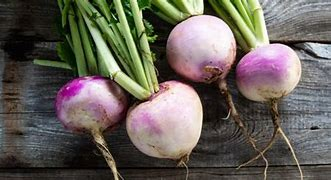
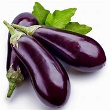
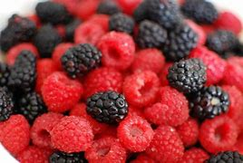
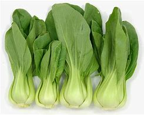
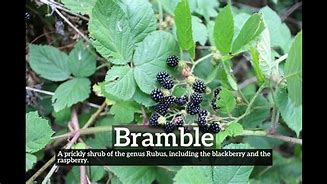

= Lesson9
:toc: left
:toclevels: 3
:sectnums:

'''

There was an assassination 暗杀，行刺 attempt against Indian Prime Minister Rajiv Gandhi today.  +

A man fired several shots at Gandhi and other Indian leaders participating (v.)参加；参与 in an open-air  户外的；露天的 prayer meeting.  +

Gandhi was not injured.  +

Six people *received minor wounds* /when the gunman burst (v.)猛冲；突然出现 from the brushes where he had apparently hidden *prior 先前的；较早的；在前的 to* the ceremony to avoid security checks.  +

He surrendered when guards surrounded him.  +

Those *in charge of* Gandhi's security have been suspended 使暂时停职（或停学等）, and an investigation is under way 进行中的.  +
负责甘地安全的人员已被停职，目前调查正在进行。 +

'''

== 从太空中心离职

Jess Moore, NASA's top official *in charge of* the shuttle  航天飞机 program when Challenger exploded, announced today he's leaving his new post as Director of the Johnson Space Center.  +

Moore will *take a leave 假期；休假 of absence* 请假 and then *be reassigned 重新委派，再次指派（任务、职位、责任等） to* NASA headquarters in Washington.  +

NPR's Daniel Zwerdling reports.  +

"The obvious question, of course, is this: Is Jess Moore leaving his job and *taking a year off work* 不工作，即不在工作状态 because of the Challenger accident? Moore came *under quite a bit of pressure* before a congressional committee early this summer when his former assistant *testified (v.) that* he *told* Moore in detail almost a year ago *that* there were serious problems with *the shuttle rocket's* O-rings, the same O-rings that eventually caused the Challenger accident.  +

当然，显而易见的问题是：
杰斯·穆尔离开他的工作岗位，休假一年，是因为挑战者号事故吗？
今年夏初，在国会委员会的重重压力面前，更多详情暴露出来，
他的前助手作证说，他几乎一年前就详细告知穆尔，航天飞机的O形环存在严重问题。
而最终导致挑战者号发生事故的正是那几个O形环。 +

That testimony 证词；证言；口供 *flatly  断然；斩钉截铁地 contradicted* 反驳；驳斥；批驳;相抵触；相矛盾；相反 what Moore's been saying *all along* 自始至终，一直: that he did not know the O-ring problems were serious until after the Challenger exploded.  +

`主` Congressional sources 来源；出处;信息来源；原始资料 who've interviewed Moore `谓` told me that they *have no way 没有办法 of* knowing just Who's telling the truth, Moore, or Moore's former assistant.  +
国会人士已经采访过穆尔，并告诉我，他们无法获知谁说的是真话，
穆尔，还是穆尔以前的助手。 +

But `主` one *top congressional aide* （尤指从政者的）助手 who *met with* Morre recently `谓` says the NASA veteran's been depressed since the Challenger *blew up*.  +
但是最近与穆尔会面的一位国会高级助手
说自从挑战者号爆炸以来，NASA的老员工们一直很沮丧。 +

He says, 'Moore doesn't have the edge （微弱的）优势 he used to.  +
说自从挑战者号爆炸以来，NASA的老员工们一直很沮丧。 +

He's hollow 中空的；空心的 inside, just like a lot of guys at NASA who worked on the shuttle.' 'Jess Moore,' the aide says, 'is not the man *he was before the accident*, and he needs a rest.'

I'm Daniel Zwerdling in Washington."

'''

== 刺杀印度首相

Indian Prime Minister Rajiv Gandhi survived an assassination attempt in New Delhi today.  +

The assailant fired a succession 一连串；一系列；连续的人（或事物） of shots at Gandhi, who was attending a Hindu prayer service with his wife and Indian President Zail Singh.  +

Official sources have called the incident a major security lapse 小错；（尤指）记错，过失，疏忽;行为失检；（平时表现不错的人一时的）失足.  +

Witnesses say Gandhi told security guards two times he had heard gun shots; the security forces reportedly  据说；据报道；据传闻 dismissed 不予考虑；摒弃；对…不屑一提 the noise as motorcycle backfire 逆火；回火.  +
目击者称甘地曾两次告诉警卫他听到了枪声；
据说安保部队称噪音是摩托车回火引起的。 +

It was over half an hour later that police finally surrounded and captured the gunman.  +

Six people were injured during the arrest.  +

The BBC's Humphrey Hoxley reports.  +

An official statement from the *Home Ministry* 内政部 said that `主` those police officials who were directly responsible for the security arrangements for Mr. Gandhi `谓` have been suspended from duty 停职.  +

Senior officials in the Ministry say that a top-level investigation *is under way* to determine why the security around the Prime Minister, who'*s meant (v.)被普遍认为是 to be* one of the most closely 仔细地，严密地 protected government leaders in the world, collapsed and how a gunman armed with an illegally manufactured revolver 左轮手枪 *broke through* the security cordon （由警察、士兵等组成的）警戒线，封锁线 undetected 未被发现的；未检测到的; 未被注意的 to get within a few feet of the Prime Minister.  +

.案例
====
.be meant to be sth
to be generally considered to be sth 被普遍认为是 +
=> This restaurant *is meant to be* excellent. 都说这家饭店很棒。

.cordon
a line or ring of police officers, soldiers, etc. guarding sth or stopping people from entering or leaving a place （由警察、士兵等组成的）警戒线，封锁线
====

Police say `主` the gunman who's in his twenties `谓` may even have fired at Mr. Gandhi and his party /as they were approaching （在距离或时间上）靠近，接近 the area *to commemorate （用…）纪念；作为…的纪念 the birthday of* the independence leader Mohandas Gandhi, who is cremated (v.)焚烧，火化（尸体）；（尤指）火葬 there.  +

警方称，这名二十多岁的持枪歹徒甚至可能向甘地及其政党开火
在他们去往纪念独立运动领袖莫汉达斯·甘地诞辰地点的途中，莫汉达斯·甘地曾在这里火化。 +

The area was searched immediately; but security men failed to spot the gunman, who was hiding *on top of* a concrete shelter （尤指用以躲避风雨或攻击的）遮蔽物，庇护处，避难处 *hidden among* thick green vines 葡萄属植物.  +
该区域立即受到搜查；但是保安人员并没有发现持枪歹徒，
持枪歹徒当时藏匿在混凝土掩体顶部，躲在厚厚的绿色藤蔓之中。 +

The man opened fire again when Mr. Gandhi was leaving half an hour later.  +

But when he was spotted, eyewitnesses 目击者 say, he *threw up* 使显眼；使引起注意 his arms and shouted in Hindi, "I surrender." Police say he's *not connected with* any terrorist organization; nor *is* he *part of* the Sikh movement which murdered Mr. Gandhi's mother, Indira, two years ago.  +

但目击者说，当他被发现时，他举起双臂用印地语喊着：“我投降。”
警方说他与恐怖组织没有任何瓜葛；
也不是锡克教运动成员，而后者在两年前杀害了甘地的母亲，英迪拉. +

Humphrey Hoxley, BBC, Delhi.  +

'''

== 城市人的农场体验

*It is not just the weather* with which farmers contend (v.)竞争；争夺;（不得不）处理问题，对付困境; there are *higher costs* for growing food and *lower prices* when selling it. /农民们要面临的不仅仅是天气问题 +

And these *combined to* make farming *an increasingly difficult life*, especially for small family farms.  /些因素综合起来，促使农业经营越发困难 +

In New York, a new organization called "Farm Hands" is trying to help struggling farms in the region by *linking* city dwellers 居民；居住者；栖身者 *with* farmers.  +
在纽约，一个名为 Farm Hands 的新组织, 正努力通过把城市居民与农民联系起来的方式，帮助该地区陷入困境的农场改善状况。 +

As John Kailish reports, the scheme seems to benefit both.  +

Last week, `主` two actors, a housewife, a *tour  旅行；旅游 guide*  导游, a *dog walker* 遛狗的人 and an unemployed social worker, all from the New York metropolitan 大城市的；大都会的 area, `谓` *spent a day* working on Hall Gibson's fruit and vegetable farm *located in* the Upstate 在（或向）州的乡野地区（尤指北部） New York town of Brewster.  +

The contingent （志趣相投、尤指来自同一地方的）一组与会者，代表团 also included two four-year-olds. /这一行人中还包括两名4岁儿童。  +

The group *listened (v.) attentively* 注意地；聚精会神地 as Gibson gave the lengthy 很长的；漫长的；冗长的 orientation （个人的）基本信仰，态度，观点 talk *complete with* 包括，含有（额外部分或特征）  *aerial 从飞机上的;空中的；空气中的；地表以上的 photographs* of his 125-acre farm.  +
吉普森进行了冗长的定向演讲，还配上了他125英亩农场的照片，大家聚精会神地听着。 +

.案例
====
.complete
*~ with sth* : [ not before noun] including sth as an extra part or feature 包括，含有（额外部分或特征） +
=> The furniture comes *complete with* tools and instructions for assembly. 这件家具备有组装工具和说明书。 +
=> The book, *complete with* CD, costs ￡35. 此书包括光盘，售价35英镑。 +
====

"This area was called *part of* the New York *milk shed*. /这个地区被称为纽约牛奶棚的一部分。  +

`主` One of the big incentives 激励；刺激；鼓励 to producing milk in this area `系` was the founding of the Borden plant." After the orientation talk /the group walked to a five-acre field that was lined with rows of tomatoes and turnips 蔓菁；芜菁, eggplants 茄子 and cabbage.  +

.案例
====
.turnip
--> 一种类似萝卜的根茎植物，来自中古英语 turnape,蔓菁，芜菁，可能来自 turn,旋转，neep, 萝卜。 +

.eggplant
-->   egg蛋 + plant植物 +

在这里生产牛奶的一大原因是博登厂的成立。”
定向演讲结束后，这一行人走到一块五英亩的土地上，那里西红柿、萝卜、茄子和白菜整齐地排成行。 +
====

Gibson *gave* some brief picking instructions *to* two women who were going to harvest *cherry tomatoes* 樱桃番茄. "If they are split like this, throw them away or eat them." "OK."  +

.案例
====
.cherry tomatoes

吉普森给两个准备采摘樱桃番茄的妇女做了简短的采摘说明。
“如果它们像这样裂开，就把它们扔掉或者吃掉。”“好的。”
====

The transplanted 移植的 urbanites 城市居民 picked six bushels  蒲式耳（谷物和水果的容量单位，相当于8加仑） of tomatoes and sixty pints  品脱 of raspberries 树莓 over the course of several hours.  +
短短几个小时，这些来到这里的都市人, 摘了六蒲式耳西红柿, 和六十品脱覆盆子。 +

.案例
====
.raspberry

====

The farmhands 农场工人 were perfect strangers when they left Manhattan, but out in the field in Putnam County, they had no trouble *striking up  开始 (谈话); 建立 (友谊) conversations* that included *such* 诸如 heady 强烈作用于感官的；使兴奋的；使有信心的 topics *as* romance in television.  +

这些农场工人，当他们离开曼哈顿时还完全是陌生人，但在帕特南县，
他们彼此畅谈，甚至还谈到了浪漫偶像剧这样令人兴奋的话题。 +

Laura Moore, a housewife and part-time 部分时间的；兼职的 teacher from Brooklyn, has made four trips to area farms with her daughter Jessie.  +

She was picking yellow low-acid tomatoes as she explained why she enjoys the Farm Hands 农场工人 program. +
她一边采摘黄色低酸西红柿，一边解释为什么她喜欢Farm Hands这个项目。

"It's therapeutic 治疗的；医疗的；治病的;有助于放松精神的, mentally, physically, and it's exhilarating 使人兴奋的；令人激动的；令人高兴的. This is my way of getting out 离开;外出 (参加社交活动等), escaping the city life for a while. I love the city. But in the fresh air, you get a feeling that you are really living."

*In addition to* the one-day farm outings (n.)（集体）出外游玩（或学习等）；远足, Farm Hands also *places individuals on farms* for periods ranging from a week to several months.  +
除了为期一天的农场郊游外，Farm Hands还可让城市人住在农场，居住时间从一个星期到几个月不等。 +

*In exchange for* their labor, Participants get a minimum wage, room and board （旅馆、招待所等提供的）伙食，膳食；膳食费用, or produce 产品；（尤指）农产品 to take back with them to the city.  +
作为劳动回报，参与者可得到等于政府规定最低工资的收入、获得住宿，或将农作物带回到城里。 +

In its first year of operation, Farm Hands *has placed twenty people on farms* for a period of two months or longer.  +
在第一年的运作中，Farm Hands项目共将20人带到农场，劳动时间至少为期两个月。 +

More than two hundred people have gone on the one-day work intensives (a.)短时间内集中紧张进行的；密集的; 集约的 or the *field trips* 实地考察; (学生)外出活动 that are often *more* play *than* work.  +
二百多人进行了为期一天的集约劳作或田间考察，而这经常是种玩耍, 而非工作。 +

Hall Gibson has had four *long term farm-hands* this summer.  +
霍尔·吉普森今年夏天雇了四个农场长工。 +

At the moment, he's benefiting (v.)得益于；得利于 from the hard work of a twenty-eight-year-old New York City painter named Debby Fisher.  +

Because Gibson's farm is organic, weeds are a major problem.  +
由于吉普森的农场是有机农场，清除杂草是个大问题。 +

Farmer Gibson says that when Debby Fisher clears weeds from the fields, she works like a demon 恶魔；魔鬼.  +

"She's been just driven 受…影响的；由…造成的 to rescue crops and she's rescued a number of crops. /她只是为了拯救庄稼，而她的确已经做到了。  +

My *bok choy* 白菜 crop -- the best I've ever had -- was rescued by her. Debby is a gem （经切割打磨的）宝石;难能可贵的人；风景优美的地方；美妙绝伦的事物."  +

.案例
====
.bok choy
--> 白菜, 来自广东话。 +

====

The Farm Hands program was founded by twenty-seven-year-old Wendy Dubid, an enthusiastic  热情的；热心的；热烈的；满腔热忱的 advocate 拥护者；支持者；提倡者 of linking farms and cities.  +

In an interview at a farmers' market in New York city, Dubid said Farm Hands may mean *cheap labors* for farmers, but she maintains *the program has a broader impact*.  +
在纽约市农贸市场的一次采访中，
杜比说，对于农民而言，Farm Hands可能意味着廉价劳动力，但她认为这项计划有着更广泛的影响。 +

"It's not just the labor that helps those farmers; it's the appreciative 感激的；感谢的;欣赏的；赏识的 consumers.  +
对农民有所帮助的不仅仅是劳动力，还有心存感激的消费者。 +

*They suddenly realize* after an hour of *picking raspberries* 树莓 and *scratching their own arms on the bramble*  黑莓灌木, they understand *the farm reality* and *the value of food*, and may become *valuable consumers and customers* for those farmers." +

.案例
====
.bramble
( especially BrE ) a wild bush with thorns on which blackberries grow 黑莓灌木 +

他们花了一个小时采摘树莓，在荆棘上划破自己的手臂，他们会突然意识到了这一点，
他们了解了农场的真实情况, 以及懂得了食物的价值，
他们可能成为那些农民的极富价值的消费者及顾客。 +
====

Dubid says there was only one Farm Hand placement （对人的）安置，安排 that did not work out this year, a fifteen-year-old football player who antagonized 使 (某人) 对自己产生敌意;使对立；使生气 his *host 主人 family* 寄宿家庭 in Upstate New York.  +
今年只有一处Farm Hand的部署工作没有落实， 一名纽约州北部的15岁足球运动员，他对寄宿家庭心存敌意。 +

Farmhands are currently working in New York, Connecticut 美国州名 and New Jersey.  +

Plans are already *under way* to expand the Farm Hands program to Maryland, Pennsylvania, Massachusetts and Vermont.

'''
