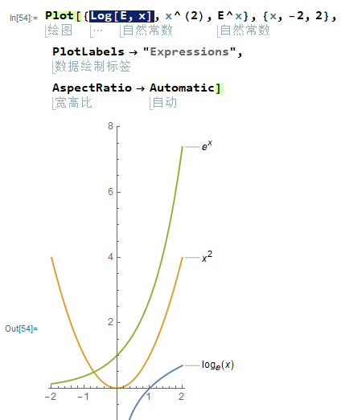
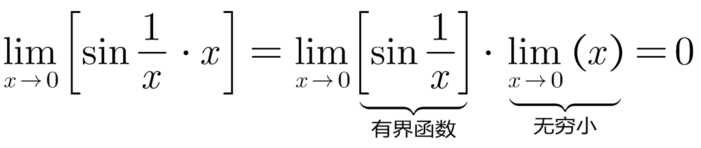
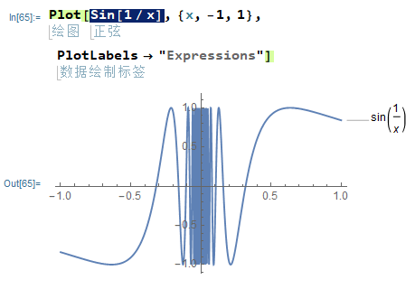
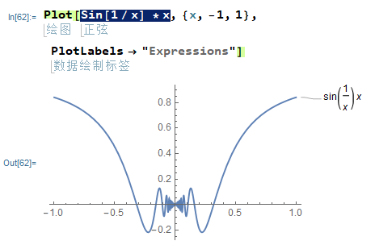
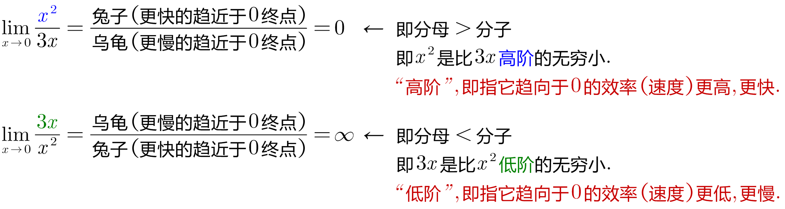
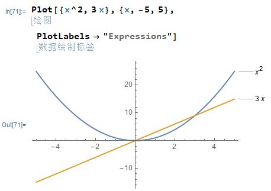
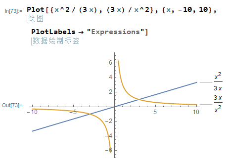
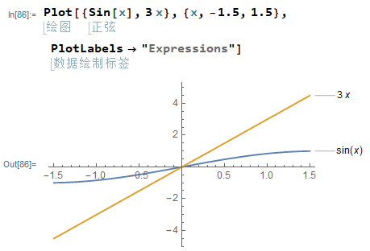
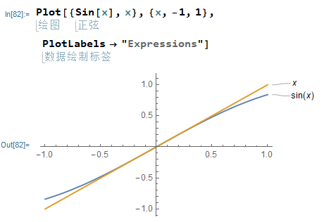

= 无穷大 & 无穷小
:toc: left
:toclevels: 3
:sectnums:

---

== 无穷大

有规律: stem:[ \lim_{x \to ∞} \ln x < \lim_{x \to ∞}  x^n < \lim_{x \to ∞} e^x]

---

==== stem:[∞ + ∞ = ?] 结果未知

因为前后的正负号, 可能相反. 一个是正无穷, 一个是负∞.

---

==== stem:[∞ - ∞ = ?] 结果未知

---

==== stem:[∞ \cdot ∞ = ∞]

---

==== stem:[∞ / ∞ = ?] 结果未知

---

== 无穷小

无穷小: 就是"以数0 为极限"的变量。 称一个函数是无穷小量，一定要说明"自变量x"的变化趋势。

---

==== 有限个"无穷小"的和, 是无穷小.

---

====  "有限个"无穷小的乘积, 依然是无穷小.

---

====  常数C * 无穷小 = 无穷小

---

==== 有界函数 × 无穷小 = 无穷小

有界函数, 就是说该函数的"值域", 是在有限区间中的. 如 sin, cos三角函数, 就是有界的.

.标题
====
例如： +

乘法就意味着: 随着 x→0, 它把"有界函数"的y值, 越来越压缩到趋向于0. 如下图的中间部分趋势: +

====

---

==== stem:["无穷小" \cdot "无穷大" = ?] 结果未知

结果未知. 即可能是无穷小, 也可能是0, 也可能是无穷大.

---

== 无穷小的比较 : stem:[\frac{"无穷小"} {"无穷小"}]

stem:[\frac{"无穷小"} {"无穷小"}] 的比值,  未必是个无穷小, 要看分母和分子,谁缩小地更快.  +
两个数都趋向于无穷小 , 但两者趋向于0 的速度有快有慢, 所以它们就能进行比较了.

---

==== 高阶无穷小 & 低阶无穷小

对于两个无穷小量 α 和 β，如果 stem:[\lim \frac{α} {β}=0], 我们就把 α, 叫做 "比 β 高阶的无穷小量". 简称 "α 是 β 的高阶无穷小  (infinitesimal of higher order)".  *即 α →0 的速度, 远远要比 β→0 的速度更快.*  记作: stem:[α = ο(β)]  <- 中间的ο是 希腊字母 omicron.

*"高阶"的意思, 就是说"更快速", 即它趋近于0的速度比别人更快速, 更迅速, 更光速.*

反过来看, 也就是:  β 是"比α低阶的无穷小量", 简称: β 是 α 的低阶无穷小 ( Low order infinitesimal). *即 β →0 的速度, 要比 α→0 的速度远远更慢.* +
即, 如果 stem:[\lim β/α = ∞], 就称 β 是比 α 低阶的无穷小.

.标题
====
例如： +

====

---

==== 同阶无穷小 -> stem:[\lim β/α = "常数C", \quad C \ne 0 ]

若 stem:[\lim β/α = "常数C", \quad C \ne 0 ], 就称: β 和 α 为"同阶无穷小" Infinitesimal of the same order. 意思是两者趋近于0的速度相仿。

.标题
====
例如： +
stem:[\lim_{x→0} \frac{sin x} {3x}= 1/3] ← 指数次数相同

====

---

==== 等价无穷小 -> stem:[\lim β/α = 1]

若 stem:[\lim β/α = 1], 就称:β 与 α 是"等价无穷小".记为 β~α. 等价, 就可以"相互替换"来使用.

.标题
====
例如： +
stem:[\lim_{x→0} \frac{sin x} {x}= 1] ← 即 如果我们想求 "x→0 处"时的 "stem:[y=sin x] 函数的输出值", 我们可以用 "stem:[y=x] 函数" 来代替它来求.

====

---

==== k阶无穷小

若 stem:[\lim β/α^k = "常数C", \quad C \ne 0, k>0 ], 就称: β是关于α的"k阶无穷小".

---

