= 导数
:toc: left
:toclevels: 3
:sectnums:

---

== 导数 Derivative /dɪˈrɪvətɪv/

某点处的"导数", 就是该点处"切线的斜率".

导数, 就是一个"极限值", 比如, y 在 点 stem:[ x_0]处的导数, 就是: +
stem:[  f'(x_0) = \lim_{Δx \to 0} \frac{Δy} {Δx}]

image:img/0055.gif[,250]

可导, 就意味着图像很"光滑". 即图像没有"尖角"存在 (因为尖角处的左右导数不相等).  +
并且还要满足: 切线不能垂直于x轴. 如果切线是垂直于x轴的, 它的斜率就会是 +∞ 或 -∞了.

stem:[x_0]点处的导数, 其实可以有下面4种写法来表示:

[options="autowidth"]
|===
|Header 1 |Header 2 |Header 3 |Header 4

|stem:[ y'\|_{x=x_0}]
|stem:[ f'(x_0)]
|stem:[\frac{dy} {dx}\|_{x=x_0}]
|stem:[\frac{d f(x)} {dx}\|_{x=x_0}]
|===

"位置"的瞬时变化率(变换趋势, 能预测未来), 就是"速度". 所以速度是位置的导数. +
"速度"的瞬时变化率, 就是"加速度". 所以"加速度"是"速度"的导数. "加速度"就是"位置"的二阶导. +

---

== 单侧导数

单侧导数, 就是从"某一侧"逼近某一x点时, 该点的切斜斜率. +
所以, 左导数, 就是"从左侧向右"逼近了. 右导数, 就是"从右边向左"逼近了.

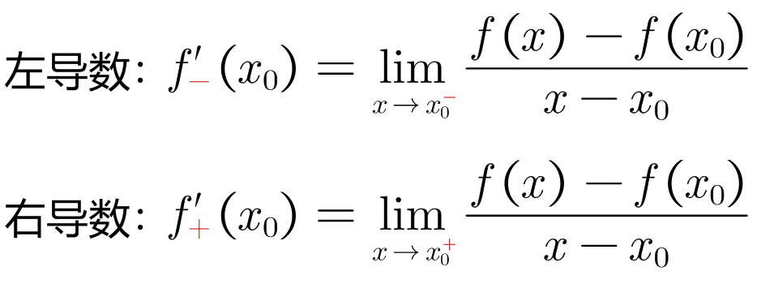

---

== ---------- ----------

---

== 常用的导数

===  stem:[ ("常数"C)'=0]

常数不会变化, 自然没有"瞬时变化率"存在, 所以常数的导数就=0.

---

=== stem:[ (x^n)'] → ①当指数n=1时, 其导数=1. ②当n>1时, 其导数是 stem:[ (x^n)' = n x^{n-1}]

.标题
====
例如： +
stem:[ (x^3)' = 3x^2]

image:img/0056.png[,]
====

.标题
====
例如： +
stem:[ (x^{-3})' = -3 x^{-4}]

image:img/0057.png[,]
====

.标题
====
例如： +
image:img/0058.png[,500]
====

---

=== stem:[ (a^x)' = a^x \ln a]  ← 即直接后面跟个尾巴: ln a

.标题
====
例如： +
stem:[(2^x)' = 2^x \ln 2]

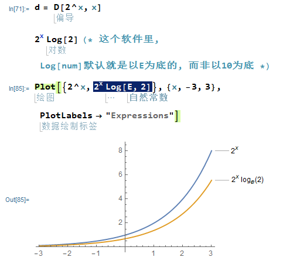
====

---

=== stem:[  (e^x)' = e^x \ln e = e^x]

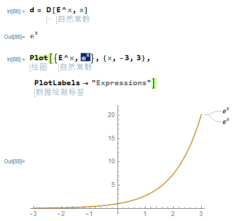

---

=== stem:[ (\log_a x)' = \frac{1} {x \ln a}] ← 即把 x 提到前面去, 把log 变成 ln, 整体再放在分母上. 分子为1.

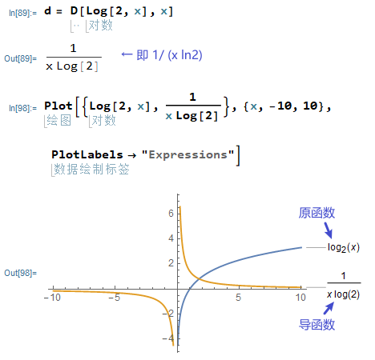

---

=== stem:[ (\ln x)' = \frac{1} {x}]

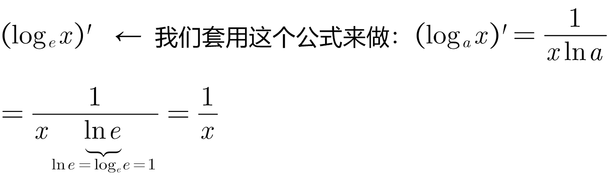

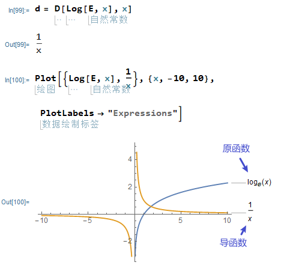

---

== ---------- ----------

---

== 三角函数的导数

=== stem:[ (\sin x)' = \cos x]

.标题
====
例如： +
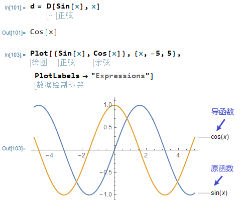
====

---

===  stem:[ (\cos x)' = -\sin x]

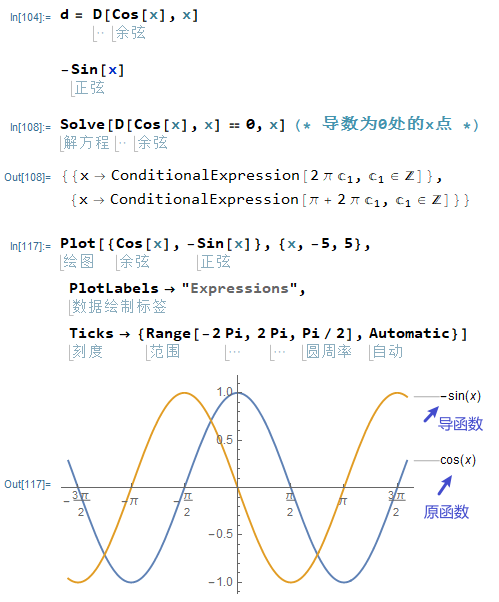

---

=== stem:[ (\tan x)' = \sec^2 x]

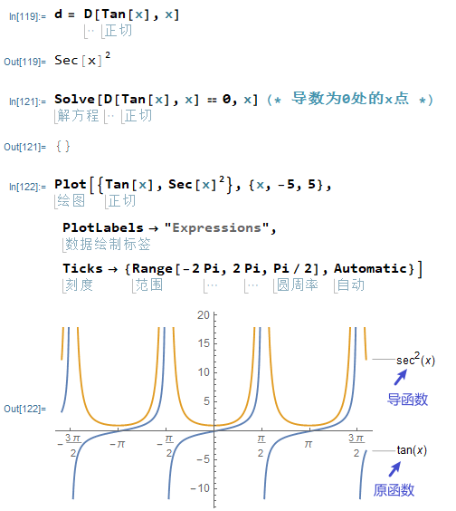

---

=== stem:[ (\cot x)' = -\csc^2 x]

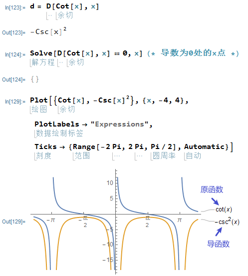

---

=== stem:[ (\sec x)' = \sec x  \cdot \tan x]

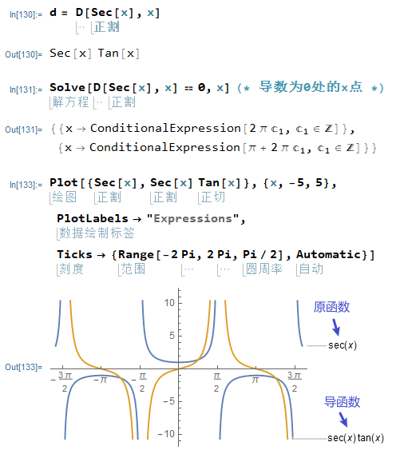

---

=== stem:[ (\csc x)' = - \csc x \cdot \cot x ]

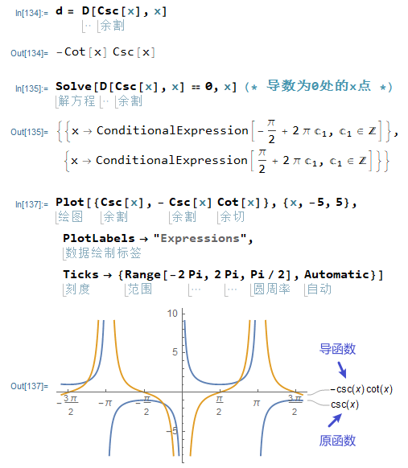

---

== ---------- ----------

---

== 求导法则 : 和差积商

=== stem:[  (a+b)' = a'+b']

.标题
====
例如： +
stem:[\left( x^2+\sin x \right) '=\left( x^2 \right) '+\left( \sin x \right) '=2x +\cos x]
====

---

==== stem:[  (a+b+c)' = a'+b'+c']

---

=== stem:[  (a-b)' = a' - b']

---

=== stem:[  (ab)' = a'b + ab']

.标题
====
例如： +
stem:[(x^3 e^x)'=(x^3)' e^x + x^3 (e^x)' = 3x^2 e^x + x_3 e^x]
====

---

==== stem:[  (abc)' = a'bc + ab'c + abc']

---

=== stem:[("常数C" \cdot a)' = C \cdot a' ] <- 直接把常数提到外面去就行了

.标题
====
例如： +
stem:[(5 sinx)'=5(sinx)'=5 cosx]
====

---

=== stem:[(\frac{a} {b})' = \frac{a'b - ab'} {b^2}]

即: stem:[(上/下)'=\frac{"上'" \cdot 下-上 \cdot "下'"} {下^2}]

---

== ---------- ----------

---

== stem:["反函数的导数" \[f^{-1}(y)\]' = \frac{1} {"原函数的导数" f'(x)}]

反函数的导数, 和其原函数的导数, 呈"倒数关系". +
原函数是 y=f(x), 其反函数是 x=f(y), 则, 反函数的导数, 就是"原函数导数"的倒数. 即:

stem:["反函数的导数" \[f^{-1}(y)\]' = \frac{1} {"原函数的导数" f'(x)}]

换言之, 原函数的导数是 stem:[ \frac{Δy} {Δx}], 则其反函数的导数就是 stem:[ \frac{1} {\frac{Δx} {Δy}}]

"原函数"与其"反函数"的图像, 是关于 y=x 对称的.
