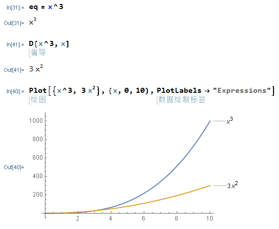
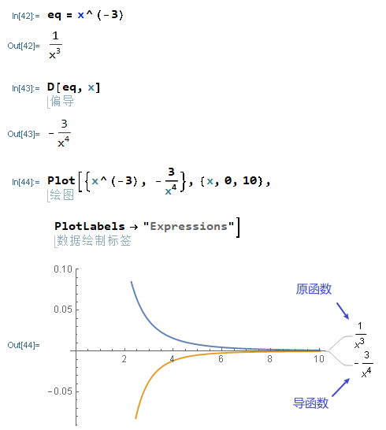
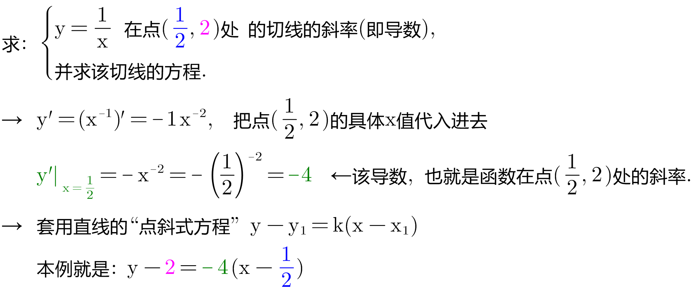

= 导数
:toc: left
:toclevels: 3
:sectnums:

---

== 导数 Derivative /dɪˈrɪvətɪv/

导数, 就是一个"极限值", 比如, y 在 点 stem:[ x_0]处的导数, 就是: +
stem:[  f'(x_0) = \lim_{Δx \to 0} \frac{Δy} {Δx}]

image:img/0055.gif[,250]

stem:[x_0]点处的导数, 其实可以有下面4种写法来表示:

[options="autowidth"]
|===
|Header 1 |Header 2 |Header 3 |Header 4

|stem:[ y'\|_{x=x_0}]
|stem:[ f'(x_0)]
|stem:[\frac{dy} {dx}\|_{x=x_0}]
|stem:[\frac{d f(x)} {dx}\|_{x=x_0}]
|===

"位置"的瞬时变化率(变换趋势, 能预测未来), 就是"速度". 所以速度是位置的导数. +
"速度"的瞬时变化率, 就是"加速度". 所以"加速度"是"速度"的导数. "加速度"就是"位置"的二阶导. +

---

== 常用的导数

===  stem:[ ("常数"C)'=0]

常数不会变化, 自然没有"瞬时变化率"存在, 所以常数的导数就=0.

---

=== stem:[ (x^n)'] → ①当指数n=1时, 其导数=1. ②当n>1时, 其导数是 stem:[ (x^n)' = n x^{n-1}]

.标题
====
例如： +
stem:[ (x^3)' = 3x^2]

====

.标题
====
例如： +
stem:[ (x^{-3})' = -3 x^{-4}]

====

.标题
====
例如： +

====

---

===

---

===

