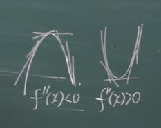
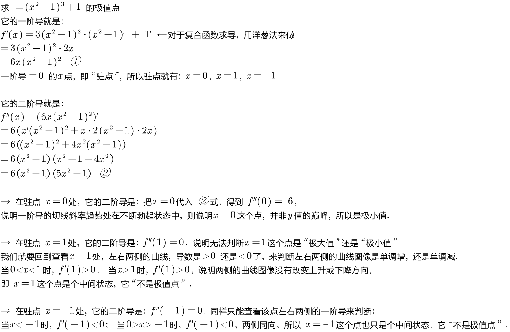
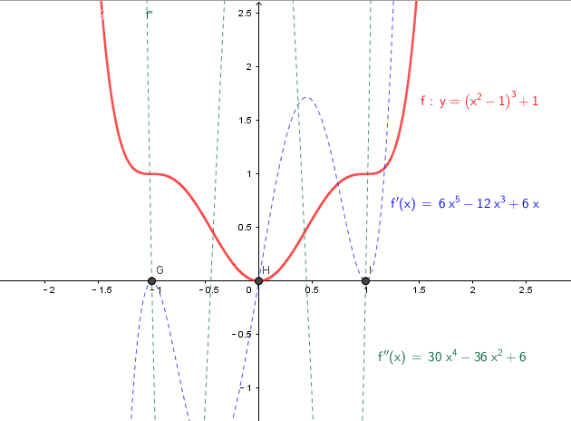
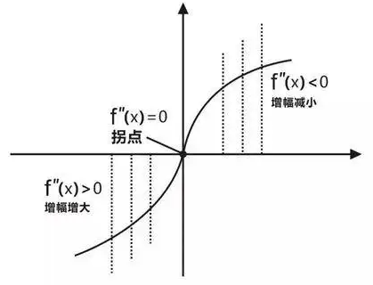
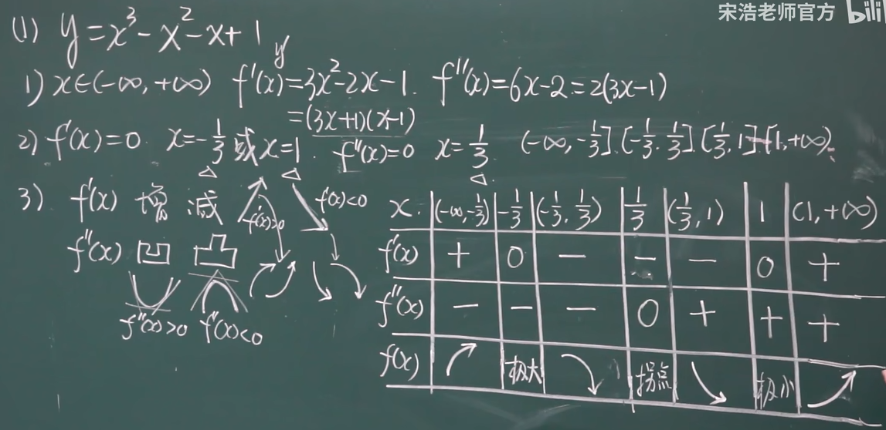
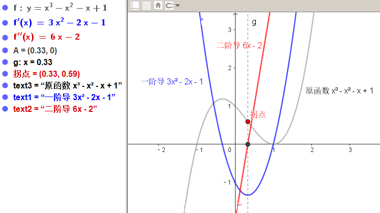

= 函数画图
:toc: left
:toclevels: 3
:sectnums:

---

- "极值"(目光短浅, 只看到眼前) 是与它的"两侧"相比，大于两侧是极大值，小于两侧是极小值.
- "最值"(目光远大, 能看到全局, 或未来一段时期) 则是函数在"定义域", 或"指定区间内"的 最大/最小值。

- 驻点 Stationary Point : **是函数的"一阶导数=0"处的x点. "驻点"处的切线, 平行于x轴。** 但驻点不一定是这个函数的极值点. 因为它可能处于"从下一级台阶到上一级台阶的 中间'水平台阶'上".

如果stem:[f(x_0)]的一阶导=0, 那么该stem:[x_0]点, 到底是函数曲线的"极大值", 还是"极小值"呢? 就要看它的二阶导:

[options="autowidth"]
|===
|Header 1 |Header 2

|-> 若 stem:[  f(x_0)''  <0 ]
|表明一阶导的"切线斜率"趋势一直在下降(越来越疲软), 说明 stem:[x_0 ] 是极大值.

|-> 若 stem:[  f(x_0)''  >0 ]
|表明一阶导的切线"斜率趋势"一直在上升(越来越强劲), 则说明 stem:[x_0 ] 是极小值.

|→ 若发现 stem:[  f(x_0)'' = 0]
|此时, 依然法判断 stem:[ x_0] 点到底是"极大值"还是"极小值", 只能再回去查看stem:[ x_0]点左右两侧的"一阶导数", 是>0 还是<0, 即: stem:[ x_0]点 左右两侧的曲线图像, 是单调增, 还是单调减?
|===

.标题
====
例如： +

====

---

== 方法论: 函数曲线的"单调性", 可以由"导数"来判断

显然: +
→ 在 导数>0 的区间中, 函数是"单调增"的. +
→ 在 导数 < 0 的区间中, 函数是"单调减"的.

[options="autowidth"]
|===
|Header 1 |Header 2

|- stem:[ f'(x) =0] 处的x点, 就是函数曲线的"驻点".
|"驻点"左右"邻域"的曲线的"导数是正是负", 就决定了函数曲线在这些区间上的"单调递增(升)"和"单调递减(降)"性, 和"极值点".

|- stem:[ f''(x)=0] 处的x点, 就是函数曲线的"拐点".
|拐点决定了函数的凹凸区间. "拐点"是使"切线"穿越曲线的点（即连续曲线的"凹弧"与"凸弧"的分界点）。拐点左右两侧的"领域"的曲线的二阶导数, 会变号, 即"由正变负"或"由负变正", 或"不存在"。

|===

.标题
====
例如： +

====

