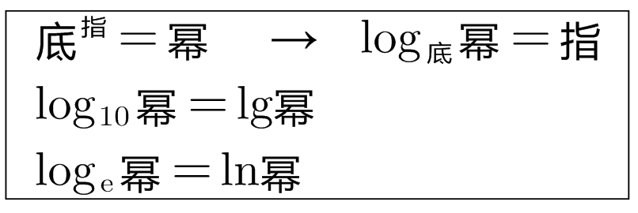
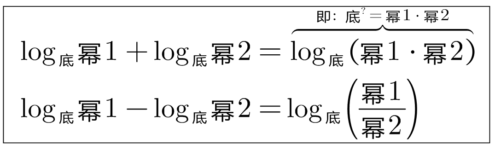

= 对数
:toc:

== stem:[ 底^指=幂]

底数 Base Number +
指数 Exponent +
幂 Power

---

== 5

嵌入html
把html代码, 用两个\++++包裹起来即可.

++++

++++

11

在 asciidoc中使用 js, 再利用js 获取图片的原始尺寸, 就能按比例缩放了

You can use the passthrough block for that using ++++:

++++

Content in a passthrough block is passed to the output unprocessed.
That means you can include raw HTML, like this embedded Gist:

++++

https://www.baidu.com/s?ie=utf-8&f=8&rsv_bp=1&tn=baidu&wd=js%20%20%E8%8E%B7%E5%8F%96%E5%9B%BE%E5%83%8F%E5%8E%9F%E5%A7%8B%E5%B0%BA%E5%AF%B8&oq=%2526lt%253BSS%2520%25E8%258E%25B7%25E5%258F%2596%25E5%259B%25BE%25E5%2583%258F%25E5%258E%259F%25E5%25A7%258B%25E5%25B0%25BA%25E5%25AF%25B8&rsv_pq=af29deb300067415&rsv_t=a35exWJ3edzr5j1Q6e3dMddofxPcfHm9NI8J4srTJxLD5RvzHa9rSaG9zbY&rqlang=cn&rsv_enter=1&rsv_dl=tb&rsv_btype=t&inputT=1967&rsv_sug3=23&rsv_sug1=12&rsv_sug7=100&rsv_sug2=0&rsv_sug4=1968

https://www.jb51.cc/faq/905516.html
