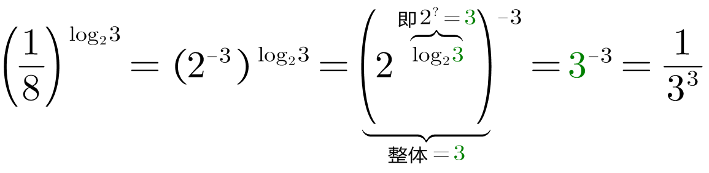
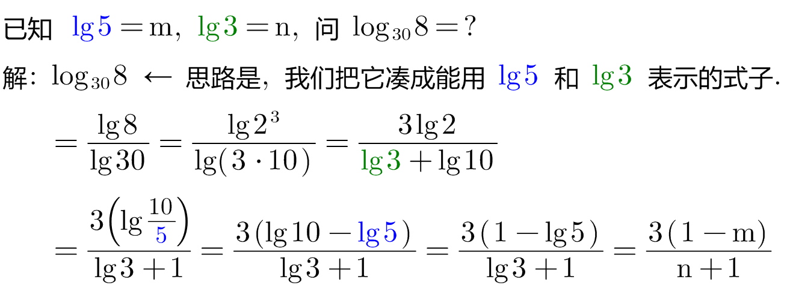
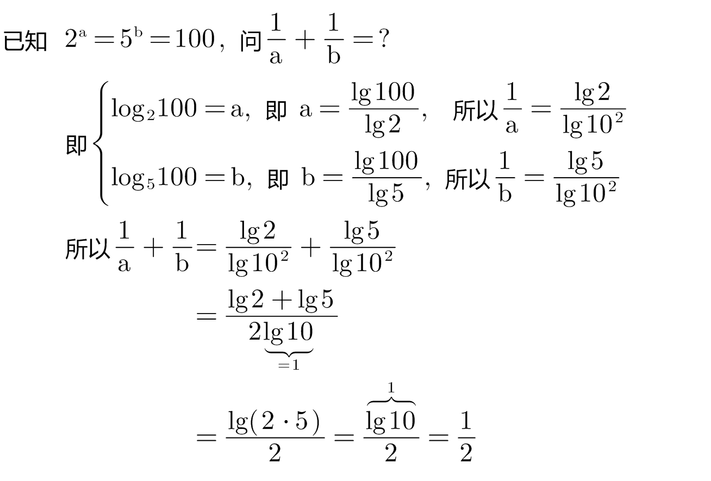
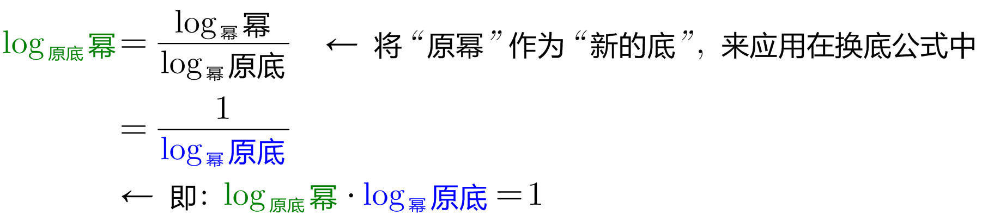
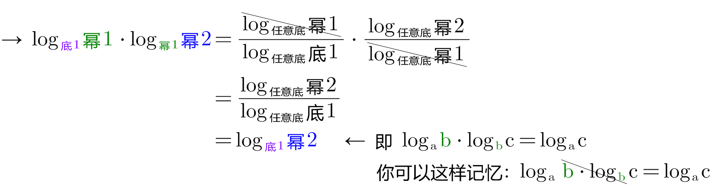
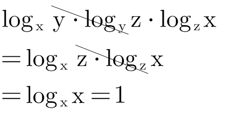

= 对数
:toc: left
:toclevels: 3
:sectnums:

---

== stem:[ 底^指=幂]

底数 Base Number +
指数 Exponent +
幂 Power

\begin{align*}
& 底^指 = 幂  →→ log_底 幂 = 指 \\
& log_a a = 1   ←← 即 a^? = a, 显然, ?次方=1 \\
& log_{10} 幂 = lg 幂 \\
& log_e 幂 = ln 幂 \\
\end{align*}

.标题
====
例如： +

====

---

==== stem:[ \text{底}^{\overset{\text{指}}{\overbrace{\log _{\text{底}}\text{幂}}}}=\text{幂}]

==== stem:[\log _{\text{底}}\underset{\text{幂}}{\underbrace{\text{底}^{\text{指}}}}=\text{指}]

==== stem:[ log_底 幂1 + log_底 幂2 = log_底 (幂1 \cdot 幂2)  ]

==== stem:[ \log _{\text{底}}\text{幂}1-\log _{\text{底}}\text{幂}2=\underset{\text{即: 底}^?=\frac{\text{幂}1}{\text{幂}2}}{\underbrace{\log _{\text{底}}\left( \frac{\text{幂}1}{\text{幂}2} \right) }}]

.标题
====
例如： +

====

---

== ★ stem:[log_{原底} "原幂" = \frac{log_{任意底}"原幂"} {log_{任意底}"原底"}]  ← 换底公式

.标题
====
例如： +

====

由换底公式, 可以推出以下这些常用结论:

==== stem:[log_bP \cdot log_Pb=1]

---

==== stem:[log_b P1 \cdot log_{P1} P2 = log_b P2]

.标题
====
例如： +

====

---

== ★ stem:[ \log _{a^n}b^m=\frac{m}{n}\log _a b]

该公式的简单记忆法: 把 m 和 n, 上下保持不动, 直接向左平移到 log外面就行了.

该公式可以推导出:

==== stem:[log_底 M^n = log_{底^1} M^n = \frac{n} {1} log_底 M = n \cdot log_{底}M]

==== stem:[log_{a^n}b^n = \frac{n}{n} log_{a^b} =  log_{a^b}]

==== stem:[log_{a^n}a^m = \frac{m}{n} log_{a^a} = \frac{m}{n}]

---

