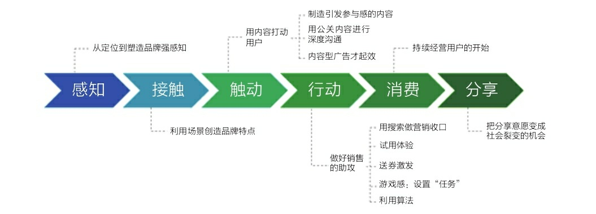

title:: dir_根据"消费者体验的心理动线", 要以消费者体验的六个关键时刻(场景)为切入点(感知→接触→触动→行动→消费→分享), 来设计场景和布局内容

- 
- ==内容营销, 正是围绕着"消费者体验心理动线"上的"六个关键时刻"场景, 来进行说服性动作。即, 品牌要对"消费者体验心理动线"的关键时刻, 给予恰当的回应.== #insight
-
- 1.初次见面, 广告感知: 
  background-color:: #787f97
	- ==品牌营销也好，内容营销也好，都是在对消费者的"认知", 进行管理. 对消费者而言，感知即事实(心理学原理).== #insight
	- 你产品带给用户的价值, 也许不止一条, 但要做减法, 只留下那条最能代表产品独特性的，或者起码看起来是独特的用户价值。
	- 把品牌定位的口号, 比喻成"语言钉"，即口号文案要足够聚焦(如"打土豪、分田地")，占据一个字眼儿，就像钉子，头很尖，锤子才好打进去。如果面面俱到，用户什么都记不住。
		- > 网易新闻，有态度
	- 通过反复宣传，提前于竞争对手完成卡位，占据客户的心智。(定位理论)
-
- 2.偶遇, 消费者与品牌"接触"的场景：利用场景创造品牌触点
  background-color:: #787f97
	- ==能够有效影响消费者的场景, 主要包括 : 需求场景、媒介场景, 消费场景。 你的品牌要与这些场景建立合适的接触机会(即广建与消费者"接触的渠道")。== #insight
	- (1) 需求场景
	  background-color:: #787f97
		- "需求场景"就是激发起消费者的"消费需求"的场景，可能是他所处的人生阶段，比如进入婚龄，这个阶段被催婚.
		- 需求场景也可能是来自时间的或空间的需求，如早上需要一杯咖啡提神，在出差时需要带便携的办公用品等.
		- > 代驾业务 : 刚需, 但低频.
		  该生意的用户的"需求场景"有 : 高频饮酒场所(酒吧, 餐馆)等. 可以将品牌和代驾广告, 印制成餐馆普遍需要的纸巾盒、牙签筒、桌上立牌、啤酒杯, 以及火锅店围裙, 等易耗物料上.
	- (2)媒介场景
	  background-color:: #787f97
		- 媒介场景: 就是消费者"触媒"的场景.
		- 内容型广告
		  background-color:: #787f97
			- 内容型广告 : 这种广告正在变得越来越像内容，或者==广告在追求自带社交属性==，希望能引起话题、可分享，==而不像传统广告那样只是一个信息告知。==
			- 包括:
				- -> 借热点来引起社交话题；
				- -> 制造冲突感；
				- -> 公关是比广告费用低得多的沟通手段。
				- > 特斯拉案例 : 为什么媒体愿意免费替马斯克做宣传呢？
	- (3, 4)消费场景: 
	  background-color:: #787f97
		- 消费者是在什么情况下，在哪里, 何处进行消费的？你就在那个地方, 现场, 说服消费者采取行动.
			- #+BEGIN_QUOTE
			  雪碧每年夏天, 都会和墨迹天气、麦当劳等品牌, 联合推出“35℃计划”——当地达到35℃的高温时，墨迹天气App, 就会向它的用户, 推送本地城市的一张雪碧优惠券.
			  
			  → 对墨迹天气而言，这是一个给用户增加"附加价值"的方式；
			  → 对麦当劳来讲，带动了到店客流(消费者在麦当劳里面, 来消费雪碧)；
			  → 对可口可乐来讲，反复地强化了喝雪碧的触发点和消费习惯：天气热你就喝雪碧.
			  
			  气温超过35℃的高温天气, 制造了消费者的"需求场景"，墨迹天气提供了一个触达用户的"媒介场景"，麦当劳则为雪碧提供了一个"消费场景"。
			  #+END_QUOTE
			- #+BEGIN_QUOTE
			  为了推广我们的这个理财产品app, 我们推出一个活动, 起名"理财任性季", 来造势. 并选择了一个恰当的时机 -- 其时，2015年的股市, 从2000多点一路飙升到5000多点，吸引了很多“小白”在那一年开通账户成为股民。但当年股市一路涨涨跌跌。这个时候，我们去主推收益稳定的"定期理财产品"，目的是给那些小白"安抚脆弱的神经".
			  
			  其中一个"理财嘉年华活动"，方案是: 把我们app平台内的优质理财产品打包在一起, 进行了一些运营的补贴，让这些产品更具吸引力，把这个理财狂欢节包装成“理财任性季”，给用户更多的选择, 来拉新。
			  #+END_QUOTE
		- 强势品牌自己造势，聪明品牌要善于借势。 选择与你的"目标用户群"近似的其他品牌, 来合作"跨界"，优势互补. 目的是"互相导流". 比如你是强势品牌，拥有注意力和流量，我能提供事件内容+利益。
			- > 如, Uber是强势品牌，拥有“一键呼叫×××”这个热门事件营销IP，平安壹钱包就供“一个亿”.
		- 客户服务也是重要的品牌触点.
-
- 在现实中, 消费者的这个过程链条, 可能会是跳跃式的，甚至闭环的.
- 我们看到的各种各样的内容营销, 无非就是不同内容, 在不同时间和空间的排列组合。
-
-
-