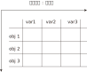
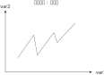
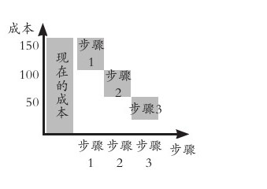
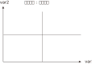
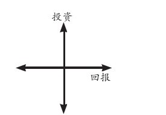
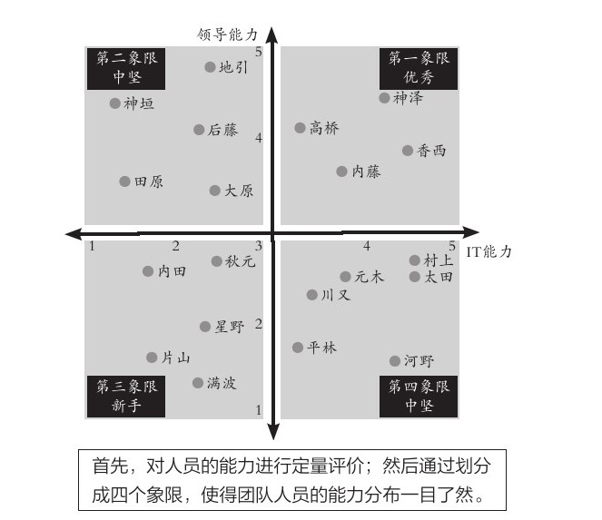
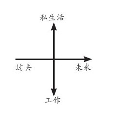
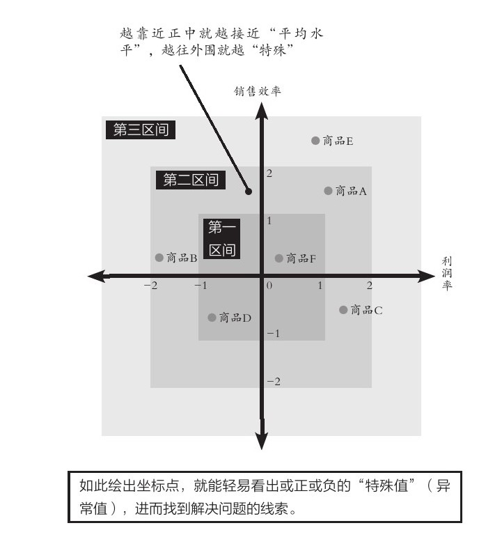

public:: true

- ## 二轴模型思考方法:
  collapsed:: true
	- 
	- 笛卡尔说 : 难题就要分割(切分)开来. 以建立起你思考的框架模型(方法论):
	  collapsed:: true
		- 把事情切分开来, 才能看到"流程"和其含有的"关键变量属性"的全貌.
			- 看到全貌: 目的是:  关键就在于，你需要知道眼前的这1公里, 到底是最初的1公里，还是中途的1公里，抑或是最后的1公里。
		- 看清 : 切分出的各环节的, 不同权重程度.  (符合28法则)
			- 即使提出100个解决方法, 也不可能全部落实，而只能必须筛选出能在有限的时间和预算之内, 能够落实的10个。
		-
	- **任何领域(自然科学, 社会科学, 商科)中, 人们创造出的各种"思维模型框架", 都是多变量关系建模. 从这些多变量中, 抽取出两个变量, 来进行不同组合, 就能得到各种"二轴模型".** 你可以自由创造任意(两个变量)的二轴模型.
		- **但是要判断: 这两个变量, 之间是什么关系? 是因果关系, 相关关系, 还是完全没有关系？**
		- 
	- 美资人士的口头禅是：“能不能用简图来表达？”
		- 图中的说明性文字，只写单词，不写整句. 但凡还需要整句说明，就代表对元素的分解还不够彻底.
		- 优秀的展示内容追求的, 并非是“一读(文字说明)就懂”，而是“一看(模型图)就懂”。
		-
		-
- ## 二轴模型可分为三种:
  collapsed:: true
	-
	- 1.表格式 (多变量)
	  background-color:: #264c9b
		- {:height 300, :width 300}
		- 表格式的特点 :
			- 表格式, 能把所有的相关变量都列出来, 即能看到问题的全貌.
		- 纵轴与横轴:
			- 纵轴与横轴, 都必须遵循MECE原则 (mutually exclusive collectively exhaustive.  相互独立, 完全穷尽).
			- 你不可能穷尽所有的变量, 所以无法穷尽的, 就归入 other(其他) 一栏.
				- {:height 650, :width 414}
			- 流程（时间、进程）用横轴展示，最多不超过7项. 请务必将横向的要素精简至不超过7项。**需要细化的时候, 也不要增加项目，而是应该将这部分单独拿出来，做另一张图进行分解。**
			- 选出来的那些 obj 或 var, 要进行价值度优先排序 (权重, 28法则).
	- 2.笛卡尔xy坐标轴式 (可表时间动态)
	  background-color:: #264c9b
		- 原则：横轴表示时间或流程，纵轴表示数额大小
		- {:height 300, :width 300}
		- 
		- 
		- 案例: 展示削减成本的效果
			- 
		-
	- 3.四象限式(两个变量) (可表空间上的分布)
	  background-color:: #264c9b
		- {:height 300, :width 300}
		- {:height 300, :width 300}
		- 
		- 案例: 对人员进行考评时, 如果只根据"总分"这个单一维度来进行排位，则每位成员的各项能力水平都被平均，无法看出其长处和短处. 所以要增加维度(如下图).
			- 
		- 案例:
		- 四象限式的特点:
			- 能对凌乱分散的数据, 进行定位, 就能一目了然各个数据是如何分布在各象限上的.
			- 纵轴和横轴的交叉点, 是在正中间，所以它的上与下、左与右所展示的含义是相反的。
				- 
			- 按心理习惯, 右上因设为“优质元素”，左下设为“劣质元素”. 即, 位于"右上"的是最好的，位于"左下"的最差的。
			- {:height 310, :width 395}
		- 切分地更细: 就是更多象限
		  collapsed:: true
			- 在四象限的基础上, 再多画一条横线和一条竖线，就能得到九个象限。
			- 象限越多, 优点是: 对数据的性质, 划分地越精细. 但缺陷是: 理解起来难度会同比增长.
		- 
			-
	- 3-2.四象限(中心内外布局法)
	  background-color:: #264c9b
	  collapsed:: true
		- 就是依据坐标点到2轴的交叉点，即“到中心的距离”来划分区间。
		- 
		-
		-
- ## 轴代表的变量的属性
  collapsed:: true
	- "轴"所代表的变量, 可分为两种类型:
		- 1.**静态**的变量(参数),
		- 2.**动态**的变量(时间, 流程步骤, 工序)
	- 变量还可以分为两种属性:
		- 1. **定量**的信息(数字),
		- 2.**定性**的信息(非数字, 表价值观的, 好坏的)
		- ||优点|缺点|
		  |--|--|--|
		  |定量信息|数字是最客观的, 能不掺杂主观倾向|收集不易|
		  |定性信息|执行上速度快|极易代入主观倾向, 而判断不客观|
		- > “有35度”是事实(定量)，对方“感觉热”也是事实(定性)。但“热”是人的主观感受.
- ## 从不同的角度去切分(选出不同的二轴变量), 去是从不同视角去分析事物
  collapsed:: true
	- **就算是同一组数据，用不同类型的图形展示出来, 给人的感受也会完全不同。因此，实践当中, 经常会将同一组数据套入多种图形之中，分别从不同角度(维度)进行分析。** (从不同的维度对同一个事物进行观察)
	- 对于一个事物，只有从各种不同的角度进行研究分析，才能尽可能地接近事实真相。
		- -> 视角，是指从什么角度去看待事物；
		- -> 视野，是指所看到事物的范围；
		- -> 立场，则是指看待事物时的价值取向。