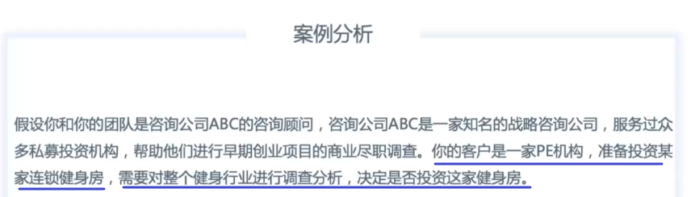
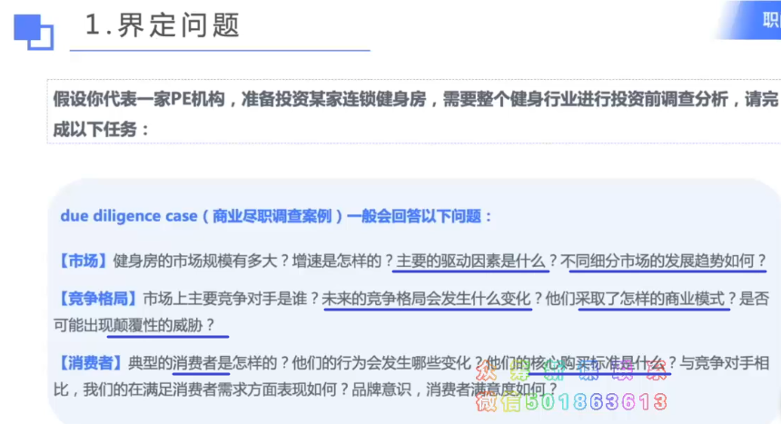
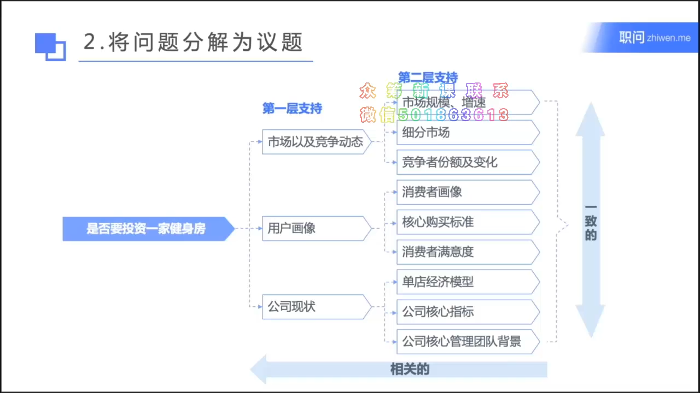
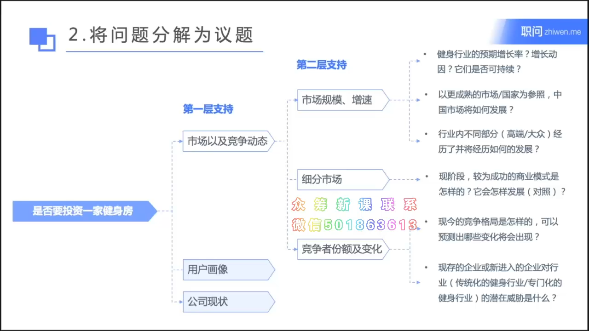
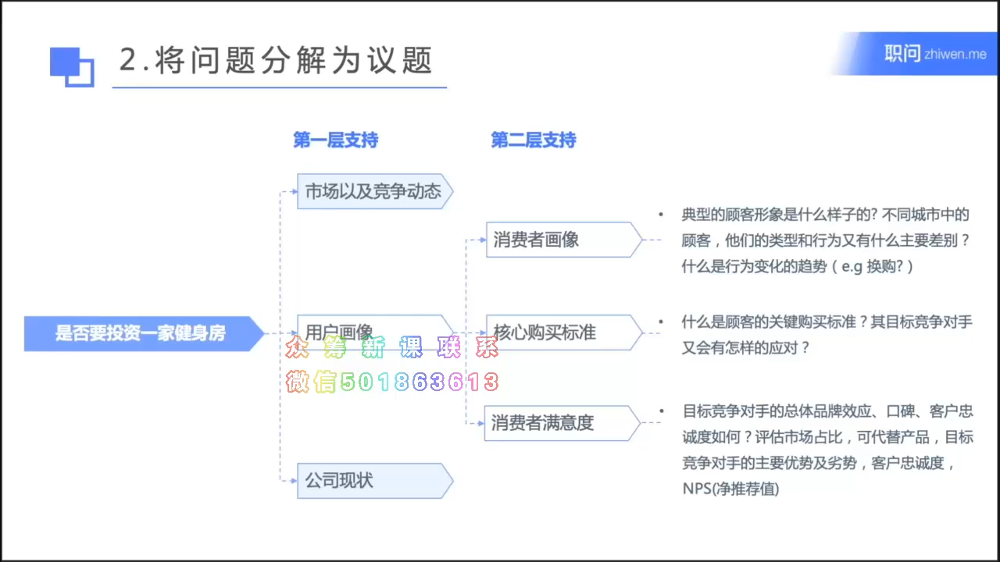
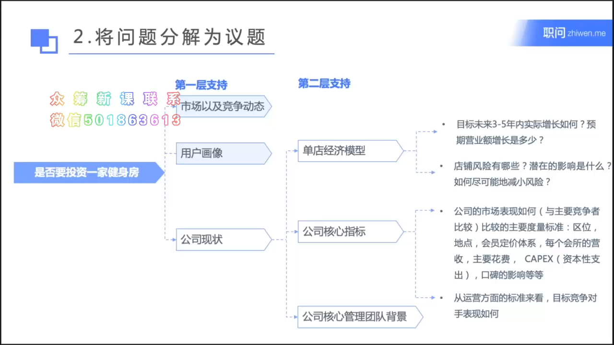
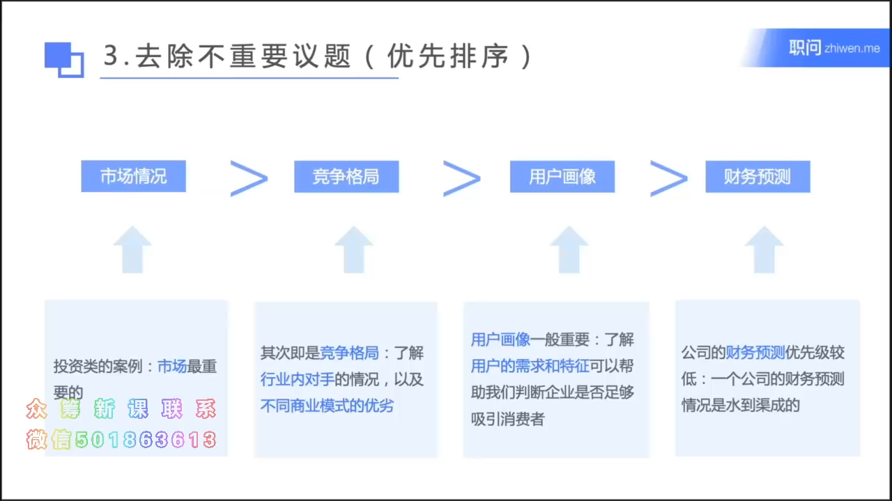

-
- b站教程 https://www.bilibili.com/video/BV1ia411677U?p=1
-
- ## 7步总览
	-
-
- 案例1
	- 
		- 
		- 
		- {:height 348, :width 607}
		- 上面, 行业发展规模, 需要看人均消费额.  国内外的对比, 也要看人均消费额比较.
		- 
		- 
		- {:height 348, :width 607}
		-