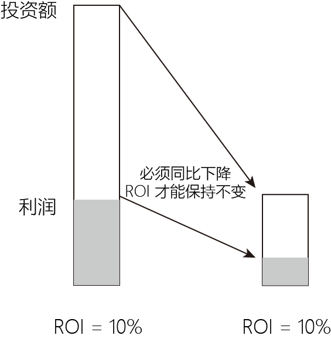

= 估值
:sectnums:
:toc:

---

==== 中介靠收佣金吃饭。房子什么时候买？什么时候卖？多少钱买？多少钱卖？房子买好、买坏，买贵、买贱，赚了、亏了，中间人是不负责的。

行内人士衡量公司并购交易成功的标准有两个：
1. 对比公司并购前后，公司买卖双方股东的市值总和。**如果并购后，市值总和高于并购前，则代表成功。低于并购前，则代表失败。**
2. 分别同那些"没有并购行为的, 同行公司的股东投资回报率"相比较。如果比同行高，则并购成功，反之，则并购失败。

并购失败的原因在于：
1. 急功近利的并购者们，支付给被并购方过高的溢价。
2. 很多兼并和收购案, 根本就没有"协同效益"（synergy），或者并购后，协同效益根本发挥不出来。

那么我们如何看待那些经常向企业游说并购方案的投资银行家们, 他们都在骗人吗？结论是这是他们的职业所然，他们就是专门买卖企业的经纪人，像买卖房子的中间人一样，他们靠收佣金吃饭。

房子什么时候买？什么时候卖？多少钱买？多少钱卖？买来之后，怎么装修、改建、使用？这些都是由买卖双方自己决定的。房子买好、买坏，买贵、买贱，赚了、亏了，中间人是不负责的。

---

==== 企业的价值，是由"企业未来的赚钱能力"来决定的。

企业的价值是怎样算出来的？你怎么知道一个企业值多少钱？你怎么知道一个公司的股票应该值10元钱，而不是12元钱？

**企业是“活”着的东西. 企业价值不仅包括物，还包括企业的人和环境，所以，企业价值每天都在发生变化。**

比如：

- 公司的关键人物飞机失事了，公司的价值马上就会下降；
- 竞争对手的关键人物跳槽了，你公司的价值可能会上升。
- 非典一爆发，航空公司的股票下降了，而医药公司的股票却上升

没有人能计算出企业未来的赚钱能力。

**企业的价值，不是由"企业现在的赚钱能力"所决定的，而是由"企业未来的赚钱能力"来决定的。**

你今天用10元钱买了一只股票，是因为你认为它明天能超过10元钱。它明天为什么能超过10元钱？因为这家公司明天赚的钱要比今天多，所以，才有下一个买家会以超过10元钱的价格买你手中的股票。

因此说，**你这10元的价钱， 买的是这家公司明天的赚钱能力, ** 这家公司明天的赚钱能力, 能令你有接盘侠能以更高的价格收取你手中的股票.

如果这家公司明天赚钱少于今天，即未来的股价要跌, 你此刻还会出10元钱买它的股票吗？当然不会了！

**所以，股票市场上每天的交易价格, 实际上是代表了企业明天的赚钱能力。** 股票下跌了，反映企业明天的盈利不如今天；反之亦然。
(股东们一扔股票，公司再融资就困难了；公司法人断了血，能不死吗？)

假设你的企业是一个餐馆，它过去每年赚1万元，可是，明年门前就要修一条封闭的高速公路，客人自然要减少，以后每年可能只赚1千元了。

如果想买你餐馆的人知道了这个情况，他绝不会像上面那样用10万元买你的企业，**因为既然盈利下降了, 投资进去的本金也要跟随之同步下降, 才能保持住相同的投资回报率.  所以他可能只愿意付1万元，否则，他的回报率就会变成1%了。（投资回报率才是重点!）**

- 1万元/10万元 = ROI 10%
- 1千元/10万元 = ROI 1%
- 1千元盈利/1万元投资 = ROI 10% <- 盈利下降多少比例, 投资额也要同比下降多少比率, 才能保持住 ROI 不变!

然而，世事难料，企业明天的事谁能说得准？对企业明天能赚多少钱的预测，充其量也只能估算一个大概，并且，还必须加上一句必不可少的前缀：“在政治、经济、市场和公司没有重大变化的前提下，我们公司有可能在20xx年实现N元利润。”

那些董事会主席、CEO和CFO、公司的审计师和股票分析员，如果能比较准确地计算出本企业未来能赚多少钱，更多的是靠幸运。

有很多朋友曾问我：“你们公司的股票现在能不能买？”其实，他们实际是要问：你们的股票现在是不是低于你们公司的价值，将来能不能涨？

巴菲特对股东说：“**我和我公司的CEO查理，不仅不知道我们企业明年赚多少钱，我们甚至不知道我们公司下一个季度赚多少钱。** 我们对那些能准确预测自己企业赚多少钱的CEO保持怀疑，如果他们经常能达到他们预测的利润目标，我们就要保持高度警惕，并开始减持他们公司的股票。”他实际是在说：那些人有可能做假账以迎合股民。

因此，如果再有人跟你说，应该在什么时间，或者什么价位买什么公司股票的话，请你记住，他们不是骗子就是靠佣金吃饭的股票经纪人，还有可能他们根本不知道自己在讲什么。我相信大多数情况是后者。

**正因如此，全世界的投资银行， 从来都不会对他们评估的企业价值负责。**

---

==== 马云“蔑视”那些喋喋不休于“阿里巴巴是什么”的人，因为其实就连他自己也不知道阿里巴巴为何物.

马云“蔑视”那些喋喋不休于“阿里巴巴是什么”的人，因为其实就连他自己也不知道阿里巴巴为何物.   +
马云说：我们现在好像在建一幢大楼，今天装一根水管，明天安一个马桶，所有的事情都是乱七八糟的，而且经常改来改去，现在只有一个大概的轮廓。

这几年人家在跟着我们模仿，但是不知道我们究竟想做什么.

---

==== #企业的价值 ，不交易就永远不知道。#

如果，一个企业"未来能赚多少钱"不能事先计算出来，那么企业的价值——未来的赚钱能力，当然就更不知道了。

既然企业的价值计算不出来，那为什么世界上每天依然发生着企业并购和股票买卖？

其实, **这些专业人士同卖菜的农民和买菜的家庭主妇一样，不进菜市场，永远不会知道菜的真实价钱**：大萝卜今年丰收了，市场上卖得就便宜；碰上非典了，人们抢着吃萝卜，萝卜又涨价了；听说萝卜不管用了，要喝醋才行，萝卜又落价了；连续下了三个星期的雨，萝卜运不进城，萝卜价钱又涨上来了。

**同理，企业的价值也是由市场买卖双方，** 根据自己口袋里的钱和个人需求，以及对天气（未来经济局势）的判断，**讨价还价“砍”出来的。企业的价值不交易就永远不知道。**

企业买卖成交了的价钱, 和股票当天的交易价，就是买卖双方对"企业未来赚钱能力"的判断。

---

