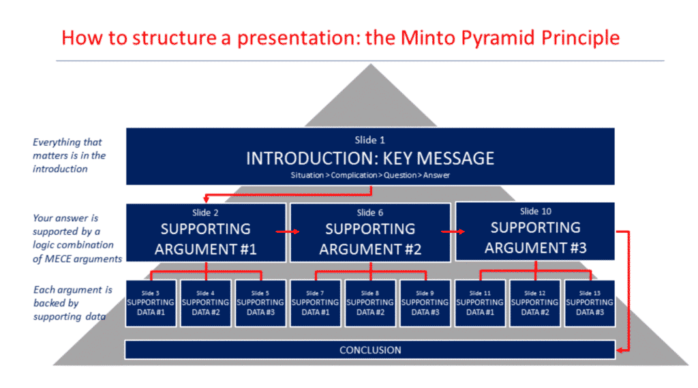
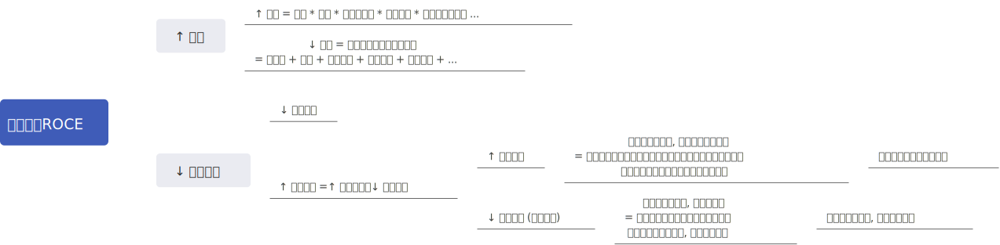
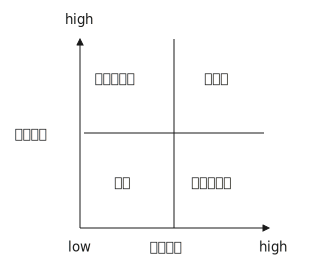
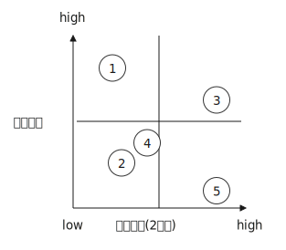
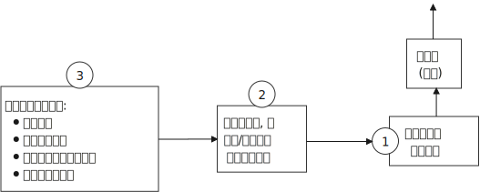
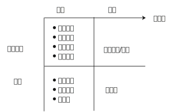

= McKinsey等"问题解决方法论"
:toc:
:toclevels: 3

---

== 4步法:

image:img/006.svg[]

---

=== 1.界定问题(也是一种假设), 并分析问题人"该问题为什么要被解决"他背后的动机是什么?

注意: 你提出的问题, 必须是"明确"且"可被执行"的, 必须符合 SMART 原则::
- Specific 具体而不空泛
- Measurable 可以被数据衡量的
- Attainable 可以被你实现的, 而非人力不可控的
- Relevant 与你的"目标"具有关联性, 即具有"因果关系"
- Time-bound 问题的解决, 具有明确的截止期限

.标题
====
例如：糟糕的例子如: "令华为手机的销量遥遥领先" , 什么叫"遥遥领先"? 这个就太模糊了.

要按 SMART原则 改成:

在未来3年内(Time-bound), 实现以下3个目标: +
- 季度销量变量 ->  连续2个季度(Time-bound), 在中国地区, 手机销量排名行业第一(Measurable) +
- 年利润变量 ->  最后一年, 全年利润, 比竞争对手A, 同期高 20% (Measurable) +
- 客户满意度变量 -> 权威第三方机构调研的客户满意度, 在国产品牌中, 位居行业第一. (Measurable)
====

---

=== 2.将问题分解成子问题 (按mese原则), 并按优先顺序排序 (找到主要"驱动因素"), 去除掉不重要的子问题. -> 对剩下的重要子问题, 考量出解决方案的"假设". -> 然后, 用调查数据, 来证明或推翻该假设.

==== ▶ MESE 原则 : 相互独立, 完全穷尽
Mutually Exclusive Collectively Exhaustive : +
-> 各部分之间, 相互独立（Mutually Exclusive） +
-> 所有部分, 完全穷尽（Collectively Exhaustive）

.标题
====
例如：如何提高你公司的ROCE(Return on capital employed = ROI，Return on investment = RONA，Return on net assets)?

用公式来分解, 一层层分解成子变量, 然后对每一个自变量, 进行改善或问题解决 :

====

---

==== ▶ 进行优先排序(28原理), 根据你的目的, 抽取出相关变量, 来创建你自己的各种"二轴图"

[options="autowidth"]
|===
|Header 1 |Header 2

|以 1.重要程度,2.紧急程度,  +
这两个变量维度来划分
|重要性低,但紧急的, 让他人帮你去做.

|以 1.财务影响,2.可执行性,  +
这两个变量维度来划分
|
|===

---

=== 3.搜集数据,来支撑或推翻你的假设(假设的解决方案), 或得出新的结论.

==== ▶ 要清楚分析的内容, 其实就是这三个: 1.游戏环境, 2.玩家, 3.游戏的未来. 可以把它们分成两个维度(2轴图)

[cols="1a,3a"]
|===
|Header 1 |Header 2
|1.游戏环境
|- 行业中的细分市场情况 +
- 产业链各环节情况

|2.玩家
|- 竞争情况, 玩家分层情况, 市场份额情况(三国志版图), 头部玩家庖丁解牛, 它们的商业模式有哪些?(及各自利弊), 哪个商业模式更成功些? 业务布局情况, 盈利情况, 营销情况, 消费者情况(用户画像), 产品研发情况 +
- 你自己企业和竞争同行的对比情况(人才,财,货,技术壁垒... 曹操集团vs袁绍集团的分析)

|3.游戏的未来
- 行业的市场规模预估, 行业增速怎样? 增长背后的促进性动因是什么? 增长即增速可否持续? 行业的天花板预测 +
- 行业当前处在它"发展阶段"上的哪个部位? 以先行者, 更成熟的发达国家市场为参照, 中国市场未来可能会走到何处? +
- 未来的游戏竞争格局, 会怎样变化? 会遭遇怎样的外部颠覆性威胁(或机遇)?

|===

---

==== ▶ 数据来源

[cols="1a,3a"]
|===
|Header 1 |<- 数据来源

|行业统计数据
|权威数据库

- 中国证监会 http://www.csrc.gov.cn/csrc/tjsj/index.shtml
- 国家统计局 http://www.stats.gov.cn/tjsj/
- 工业和信息化部 https://www.miit.gov.cn/gxsj/index.html
- 中国人民银行 http://www.pbc.gov.cn/diaochatongjisi/116219/index.html
- 中国银行 保险监督管理委员会 http://www.cbirc.gov.cn/cn/view/pages/tongjishuju/tongjishuju.html
- 中国海关 http://www.customs.gov.cn/eportal/ui?pageId=302275

|财务数据, 经营数据
|公司年报,财报

- 彭博 https://www.bloombergmedia.com/
- wind数据库(金融): https://www.wind.com.cn/ 中国超过90%的金融机构都将Wind的数据报告作为基础进行分析研究.
- 巨潮 http://www.cninfo.com.cn/new/index

|股东情况,市场竞争,发展战略
|招股说明书, 券商报告

|上市公司重要经营变动
|券商报告
|===

---

==== 世界顶尖咨询公司的排名 <- Vault

世界权威公司评测机构Vault +
https://firsthand.co/best-companies-to-work-for/consulting/vault-consulting-rankings-top-50

[cols="1a,5a"]
|===
|Header 1 |世界顶尖咨询公司的要求

|学历背景
|从学历背景上看，最终拿到 offer 成功入职的人，大多有美国藤校、英国G5、国内顶尖商科学校背景学生.

|经历
|一大部分人都至少有一份以上咨询相关实习经历, 并参加过类似德勤digital挑战赛、贝恩杯咨询起航案例大赛, 这样的商赛。

|注重的能力
|沟通能力(逻辑能力)、领导能力, 抗压能力, 合作能力

|录取率
|- Goldman Sach (高盛集团) 每年的录取率大约在3％. +
-  PwC UK (英国普华永道) 1,500个工作岗位会收到将近40,000份申请，录取率也仅为3.8％。
|===

---

==== ▶ 市场调查的方法论

[cols="1a,3a"]
|===
|Header 1 |Header 2

|对于隐私问题, 用"转移焦点指向"的方法, 来"咨询"出对方价值态度.
|- "你们公司的提奖政策是怎样的?" -> 换种问法: "**如果您来设计一个...的激励机制, 你会怎么设计?**"

- "..公司的核心风控模型中, 有哪些核心变量, 占比多大?" -> 换种问法:"如果您来设计这类大额信用贷的风险模型评分卡的话, 你会更加看重借款人的哪些方面的资质, 才能更好地控制风险?"

|问卷调查中, 重要的问题放在前面, 开放性问题也要放在前面
|原因是, 一开始时, 答题人精力最好, 能耐心做"开放性问题". 如果你放在最后面, 答题人几十道选择题做下来,已经耐心耗尽, 是不会认真来回答你的开放性问题的.

|要设置能"交叉验证"的问题
|用来判别出"答题人"是否前后逻辑不一致, 在乱填.

|不要用预设的结果,来引导答题人
|如, 错误的问法"大多数消费者觉得...更加安全, 你是否认同这个观点?" -> 要改成 "你觉得 ... 安全与否?"
|===

---

====  ▶ 对不同来源的数据进行, 进行 cross check

原因:

- 监管机构所要求的的"会计准则", 或"信息披露要求"不同.
- 不同咨询公司, 在统计时, 所用的口径不同, 如对某一概念的定义不同 (如对"高净值人群"的定义不同).
- 对细分行业, 划分标准不同
- 前提假设不同. 即初始值参数不同.

---

=== 4.编排你的故事, 报告 -> 金字塔原理

---

例如:
[cols="1a,3a"]
|===
|4步法 |举例

|1.界定问题(也是一种假设), 并分析问题人"该问题为什么要被解决"他背后的动机是什么?
|任务: 要提升影院的月利润

|2.将问题分解成子问题 (按mese原则), 并按优先顺序排序, 去除掉不重要的子问题, 对剩下的重要子问题, 考量出解决方案的"假设". 然后, 用调查数据, 来证明或推翻该假设.

|那么, 利润来自何处? 可以细分成两个来源:

1.增加收入::
又可细分成:
- ① 增加票房收入 <- × 若不可行
- ② 增加贴片广告, 零食等收入 <- √ 若可行, 可引入新的业态, 如: 唱吧, 收费按摩椅等.

2.减少成本::
又可细分成: +
- ③ 减少固定成本 <- × 若不可行, 房租, 水电, 硬件设备等, 都是长期成本, 难以降低.
- ④ 减少可变成本 <- √ 若可行, 可通过比如引进"自助取票机, 检票机", 能减少员工数量.

|3.搜集数据,来支撑或推翻你的假设(假设的解决方案), 或得出新的结论.
|现在, 通过排除法, 剩下 ②, ④ 子议题(假设)似乎可行. 那就要通过数据调查来证实它, 或证伪它.

-> 对②, 即对唱吧, 收费按摩椅等, 这些业务的市场营利度, 进行调研.  +
看看同行, 竞争对手, 这些业务的:  +

- 商业模式是怎样的?
- 投资回报率如何?
- 遇到哪些问题, 解决(或缓解)方案目前有哪些?
- 未来可能会有怎样的变化?  +
- 当前若引入的话, 合作模式有哪些? 各自利弊如何.

#**即, 把任何一个子业务, 都当做一个小行业去调查, 去"行业分析"查清楚该知道的一切. **#

-> 对④ 做调研和评估, 看是否有证据能做到这一点. 若行, 就盘点现有人员绩效表现, 确定裁员名单.

|4.编排你的故事, 报告
|
|===

---

== Mckinsey 文化和价值观

[options="autowidth"]
|===
|Header 1 |Header 2

|多看 Case Interview
|书 <case in point>

|natural
|你当前对某事物认知上的对错不重要, 但你要很自然 natural 顺滑的和客户回到正确的轨道上来, 而不能"宕机" (awkward interviewer). 即, 你的反应, 处理事情的能力, 要很圆滑自然.

|airport test
|你是老板, 你也喜欢招一个你愿意和他困在某个时空中的人, 即你喜欢的人, 令你觉得舒服的, 情商高的, 有才的人. 如同贾诩对曹操, 诸葛亮对刘备, 周瑜对孙权.

the manager asked herself after each interview: “*Would I want to be stuck in an airport with this person?*”

|===

