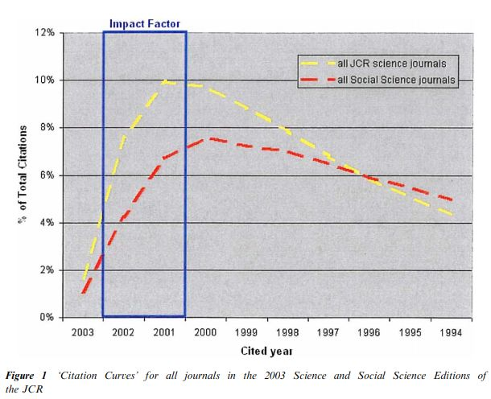

= Impact Factor
:toc:

---

世界著名的三大科技文献检索系统 :

[options="autowidth"]
|===
|Header 1 |发布机构

|Science Citation Index +
(SCI) 科学引文索引 (最重要)
|Institute for Scientific Information +
(ISI) 美国科学情报研究所

|Conference Proceedings Citation Index - Science +
(原名ISTP —Index to Scientific & Technical Proceedings) +
科技会议录索引
|Institute for Scientific Information +
(ISI) 美国科学情报研究所

|Engineering Index +
(EI) 工程索引
|Engineering Information Co. +
美国工程情报公司
|===

---

== ★ Science Citation Index (SCI) 科学引文索引

是一个期刊文献检索工具. SCI收录全世界各学科的核心期刊数千种.

---

== Journal Citation Reports (JCR) 期刊引用报告

每年统计一次上一年度SCI (Science Citation Index) 的引文数据，给出SCI收录的每种期刊的"影响因子"。 +
JCR 通过收集和统计全世界各个专业的期刊的引用数据, 可以告诉人们，哪些是最有影响力的期刊.

JCR 分析出的数据包括:

---

====  ★ 指标1: #Impact Factor (IF) 影响因子#

是 JCR 中的一项数据。

[options="autowidth" cols="1a,1a"]
|===
|Header 1 |Header 2

|计算公式
|

即:
\begin{align}
IF = \frac{某一年中, 该刊前两年发表论文, 在统计当年中被引用的总次数C}{在过去两年内, 发表的论文总数为P}
\end{align}

为什么使用两年作为时间窗口？::
在影响因子设计的时候，发现对于期刊一个年份的引用而言，大部分的时间分布都在前两年。因此，使用这个时间窗口，能够较好地捕捉到该期刊的近期影响力。
+
不过随着时间的推移，我们发现不同学科是存在差异性的，因此后面也推出了5年的影响因子（这要求期刊要有至少6年的数据）来捕捉期刊更加长期的影响力。

|IF的设计逻辑
|采用一个类比的思路，一个期刊录取一篇论文，就像一个业务部门录取一个员工，每个员工在过五关斩六将被录用之后，会在业务部门工作。在影响因子的考核体系下，每个员工会工作两年，他们的业绩用其获得的引用数量进行衡量。而我们最后对这个业务部门的评价（期刊的评价），就用每个员工的平均业绩进行评价。

|性质
|优点::
- IF 这个指标，在一定的程度上对“好”期刊有多“好”进行了量化。尽管这个指标并非完美，但是在很大的程度上具有 Robust (强健的；强壮的).

不足之处::
- 在这个业务部门中，如果有一个（或者一些）员工特别优秀，获得了大量的业绩指标，那么这个业务部门的总业绩就会飙升，然后让部门中不那么优秀的员工也“沾了光”。 同理, *个别高引用文章，提高了期刊的总体影响因子，这样是否合理？* +
在风险投资中，常有投资大量的项目，最后只有一两项盈利，但是足以回本创收的模式。

- 如果我们业务部门A只有2个人，创收200; 另一个业务部门B有100人，创收9000。 则业务部门A的绩效200/2 = 100，业务部门B的绩效9000/100 = 90。哪个业务部门表现好？

- 影响因子可以评价学术期刊的"影响力", 但不具有对"学术质量"进行精确定量评价的功能。

|查询 IF
|如何查询"外文期刊"的"影响因子"?::
可使用 JCR（Journal Citation Reports）

如何查询"中文期刊"的"影响因子"?::
可使用"中国学术期刊（光盘版）电子杂志社", 和"中国科学文献计量评价中心", 联合推出的《中国学术期刊综合引证报告》.

|===

---

== ---------- ----------

---

== 世界顶级期刊

[cols="1a,1a" options="autowidth"]
|===
|Header 1 |Header 2

|Nature
|1869年创办. 英国周刊. 综合性期刊.

|Science
|1880年创办, 美国周刊. 综合性期刊. +
为美国最大的科学团体“美国科学促进会”——(AAAS)的官方刊物.

|Cell
|1974年创办. 聚焦生命科学研究领域.
|===

