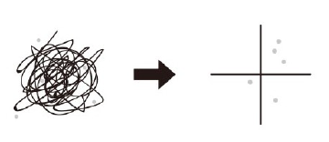
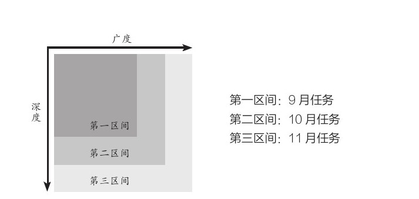
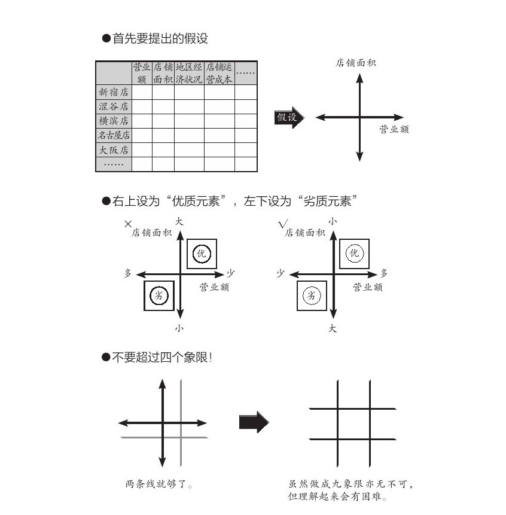
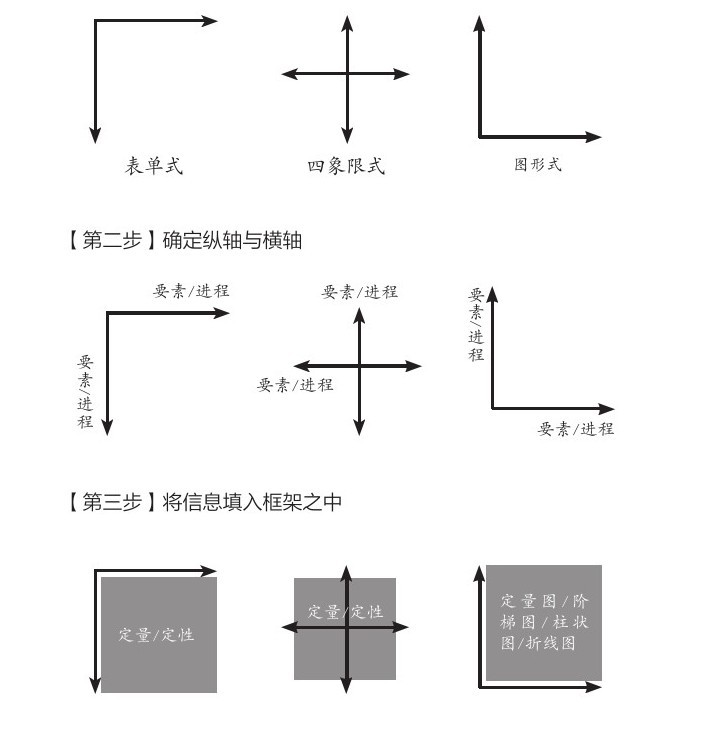

= mece原则
:toc:
:toclevels: 3
---

== 二轴模型

笛卡尔说 : 难题就要分割(切分)开来. 以建立起你思考的框架模型(方法论之一).

任何领域(自然科学, 社会科学, 商科)中, **人们创造出的各种"思维模型框架", 都是多变量关系建模. 从这些多变量中, 抽取出两个变量, 来进行不同组合, 就能得到各种"二轴模型".** 你可以自由创造任意(两个变量)的二轴模型.  +
*但是要判断: 这两个变量, 之间是什么关系? 是因果关系, 相关关系, 还是完全没有关系？*

- 美资人士的口头禅是：“能不能用简图来表达？”
- 图中的说明性文字，只写单词，不写整句. 但凡还需要整句说明，就代表对元素的分解还不够彻底.

---

== 二轴模型可分为三种

*就算是同一组数据，用不同类型的图形展示出来, 给人的感受也会完全不同。因此，实践当中, 经常会将同一组数据套入多种
图形之中，分别从不同角度(维度)进行分析。*

=== 1. 表格式

image:img/001.svg[300,300]

要点:

[cols="1a,4a"]
|===
|Header 1 |Header 2

|表格式的特点
|- 表格式, 能把所有的相关变量都列出来, 即能看到问题的全貌.

|纵轴与横轴
|- 纵轴与横轴, 都必须遵循MECE原则 (mutually exclusive
collectively exhaustive.  相互独立, 完全穷尽).
- 你不可能穷尽所有的变量, 所以无法穷尽的, 就归入 other(其他) 一栏.
- 流程（时间、进程）用横轴展示，最多不超过7项. 请务必将横向的要素精简至不超过7项。*需要细化的时候, 也不要增加项目，而是应该将这部分单独拿出来，做另一张图进行分解。*

|
|- 选出来的那些 obj 或 var, 要进行价值度优先排序 (权重, 28法则).
|===

---

=== 2. 四象限式笛卡尔xy坐标轴式 (可表空间上的分布)

image:img/002.svg[300,300]

image:img/003.svg[300,300]

要点:

[cols="1a,4a"]
|===
|Header 1 |Header 2

|四象限式的特点:
|- 能对凌乱分散的数据, 进行定位, 就能一目了然各个数据是如何分布在各象限上的.
- 纵轴和横轴的交叉点, 是在正中间，所以它的上与下、左与右所展示的含义是相反的。
- 按心理习惯, 右上因设为“优质元素”，左下设为“劣质元素”. 即, 位于"右上"的是最好的，位于"左下"的最差的。

|切分地更细: 就是更多象限
|- 在四象限的基础上, 再多画一条横线和一条竖线，就能得到九个象限。
- 象限越多, 优点是对数据的性质, 划分地越精细. 但缺陷是: 理解起来难度会同比增长.
|===

---

=== 3. 笛卡尔xy坐标轴式 (可表时间动态)

image:img/004.svg[300,300]

原则：横轴表示时间或流程，纵轴表示数额大小

image:img/009.jpg[]

---

== "轴"所代表的变量, 可分为两种类型: 1.静态的变量(参数), 2.动态的变量(时间, 流程步骤, 工序)

---

== 变量还可以分为两种属性: 1. 定量的信息(数字), 2.定性的信息(非数字, 表价值观的, 好坏的)

[options="autowidth"]
|===
| |优点|缺点

|定量信息
|数字是最客观的, 能不掺杂主观倾向
|收集不易

|定性信息
|执行上速度快
|极易代入主观倾向, 而判断不客观
|===

