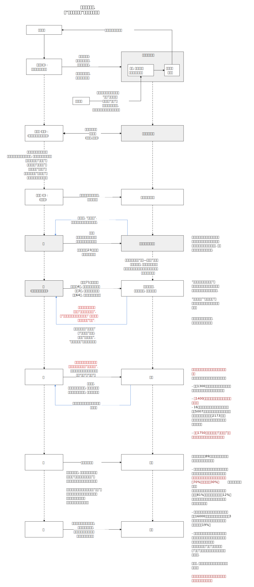
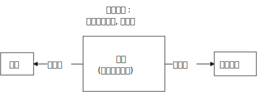
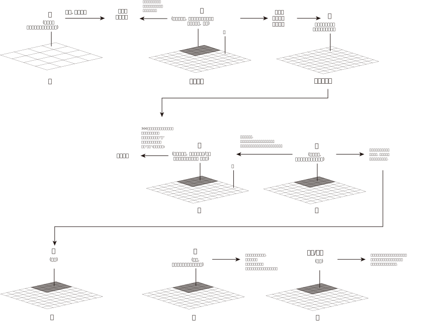
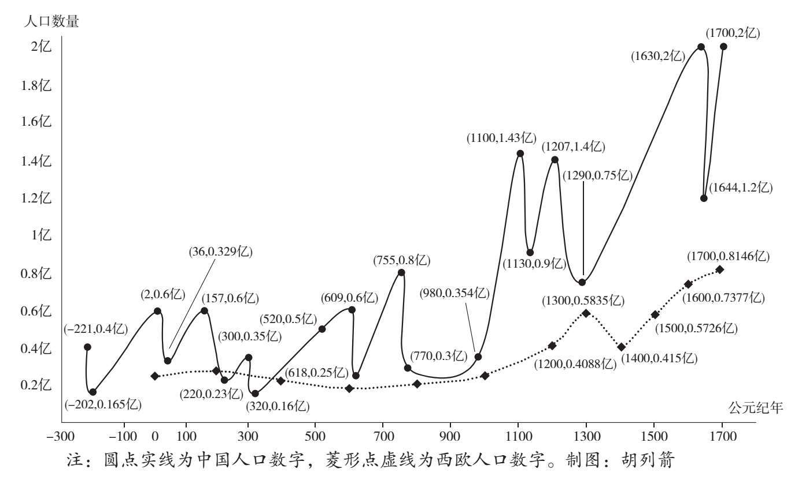
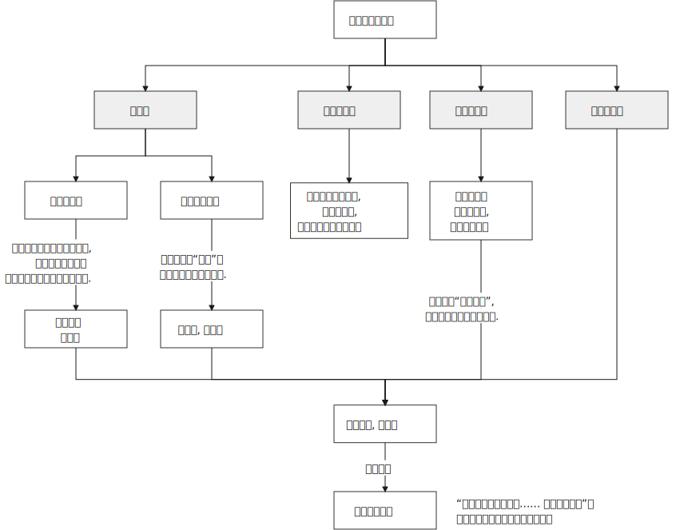
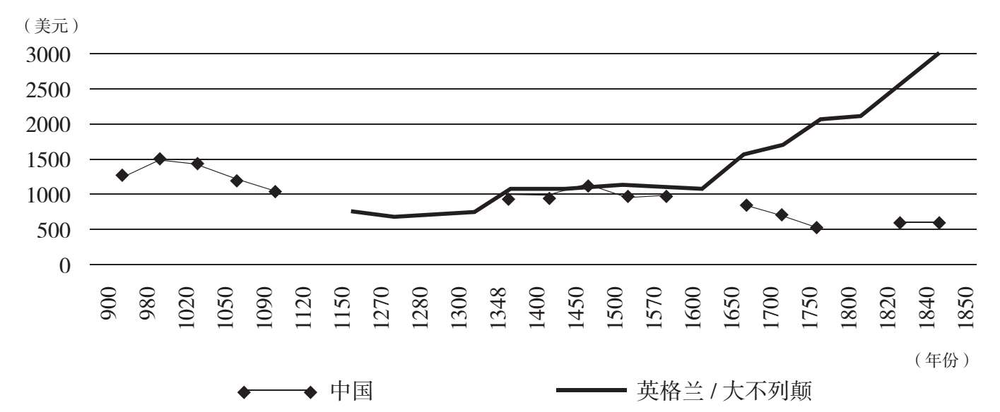

= 从西方角度看中国的历史:
:sectnums:
:toc:

---

(本篇为读过 张宏杰 书后的记录)

- 中国拥有最庞大的史料库，然而并不见得因此就能产生最伟大的历史学。
- 普通读者的头脑中，充斥着大量错误的历史常识. 如: 历史是直线发展的，越到后面肯定越先进。
- 不读世界史，你就无法准确地判断中国文明在世界上的位置，以及自身的独特之处。所以, 要把中国史放到世界史的背景下去观察。不读世界史，不知中国之特质。

---

== 不受别的文明刺激, 本主体文明就不会发展

人类的整个历史证明，**一种文明能否进步，往往取决于它能否从外界获得刺激(从而学习先进)。不同文明之间交流的机会越多，各自进步也就越快。**而那些长期与世隔绝的社会，注定要停滞，因为它们接收不到外来的刺激和压力。

文化最简单的部落, 基本上是那些与世隔绝的, 因而无法从邻近部落的文化成就中获益。

(所以, 闭关锁国是只会越来越落后的. 武侠小说里的一个人闭关修炼, 没有和世上顶尖高手的不断交流, 也只会越来越差.)

---

==== 不睁眼看世界真相, 就会盲目自大

英国使臣访华(乾隆), 目的是想与中国建立正式的外交关系. 内容包括:

- 促使中国政府改革外贸体制，取消十三行，多开放几个口岸，允许自由贸易，公开关税税率(政策透明化).
- 当时澳门已经被葡萄牙实际统治多年，英国因此希望中国皇帝也“送给”英国一个“小岛”，“以堆放货物”。

*清朝官员要求英国大使学习三跪九叩，但是英国使臣拒不同意，他们认为大英帝国与大清帝国是平等的*，双方因此发生了激烈的冲突。

缅甸人的世界观与中国非常相似, 因为缅甸的权力结构与中国相似。

缅甸人要求英国人见缅甸国王时, 必须先脱鞋，然后跪拜。然而1830年来到缅甸的白尼却拒绝这样做。*白尼坚决反对脱鞋，并明确表示：这是缅甸官员“借羞辱和贬低英国人的人格, 来提高他们王的地位, 和满足他们自己的傲慢和虚荣心的一种手段” 。*

(*好的制度，让人知道自我作为一个人应有的尊严. 专制的坏的制度，让人被贬低成奴隶意识，并创造出"阶层有高低"的意识！*)

英国人对中国的造访，迅速打破了历史上传教士们在欧洲建造起来的中国神话。

英国人认为，欧洲和中国的政治文明有巨大落差。
马戛尔尼认为“中国政治制度上没有代议性质的机构来帮助、限制或监督皇权”，“*在中国的政治、伦理和历史的文献中, 找不到任何自由色彩的理论，他们认为这种理论最后一定导致犯上作乱*”。

英国人在1793年通过和平谈判没有得到的东西，40多年后通过第一次鸦片战争, 一件不少地得到了。《南京条约》的五点核心内容，与马戛尔尼请求乾隆的内容几乎完全一致。

---

==== 毫无现代法制契约观念

第二次鸦片战争, 签订《天津条约》 (1858年), 内容包括:

- 确定领事裁判权。
- 准许国家公使驻京.

在清廷看来, 这标志着中国从此就不再是天下诸国公认的天朝上国了，可能连朝鲜、琉球等国，也不尊敬中国了。即, 2000年的"朝贡体系"崩于一旦。 +
咸丰甚至想放弃全部海关税收“赐”给外国，也不想接受公使驻京。

为了维持"天朝上国"的地位, 阻止洋人大使驻京, 咸丰不惜再次一战. 结果就是洋人顺利进京, 并英法火烧圆明园.

---

==== 西方的殖民主义, 客观上把一切民族都卷到文明中来了

西方殖民主义“把一切民族, 甚至最野蛮的民族, 都卷到文明中来了。

全球化, 从根本上改变了中国历史上的一些基本规律:

[cols="1a,3a"]
|===
|Header 1 |Header 2

|- 人口曲线规律被打破
|民国时期，中国人口模式从传统中国的高出生率、高死亡率、低增长率的传统模式，变成了高出生率、低死亡率、高增长率这样的现代发展中国家模式。

|- 经济增长规律
|甲午中日战争, 1895年**《马关条约》签订, 允许开放中国市场，外国人可以在中国投资，直接设立企业。为了抵御外资，清政府不得不鼓励民族资本发展，许多领域被迫不再由官办企业垄断. 促进了近代工商业迅速成长。**

- 中国民营资本总额: 1894年只有710万元，到了1913年达到1.62亿元，翻了22倍。
|===

---

---

== 中国的专制集权化

==== 理论改造 -> 外儒内法(法家化的儒家)

孔子的儒家, 与董仲舒改造后的"外儒内法"的儒家  的区别:

[cols="1a,3a,3a"]
|===
|Header 1 |孔儒 |外儒内法(董仲舒)

|对君
|强调权责对应, 反对单向原则.

- "君君臣臣父父子子" : 君首先要像一个君，臣才能像一个臣 +
- "君视臣如草芥，臣视君如寇仇."
|强化皇帝的地位. 继承了韩非子的法、术、势思想，强调一定要大树特树皇帝的权威。

- “君之所以为君者，威也。……威分则失权。”
- 提出了“三纲说”: "君可以不君，臣不可以不臣。"
*由此，权利变成了单向的、绝对的。*

|对民
|民贵君轻
|愚民

- 董仲舒说: 民的意思就是“瞑”，就是愚昧无知的意思，因此“可使守事从上而已”，只能老老实实地听上级的命令。
|===

---

==== 内朝取代外朝, 打压相权

强干弱枝, "三权分立". 西方的三权分立, 是为了制约最高权力，而中国的三权分立，是为了保护最高权力不受挑战。

内朝取代外朝::
在皇帝与丞相的关系上，表现为皇帝对丞相的防范. 用自己身边的临时的秘书班子, 取代丞相或者正式的政府机构。结果这个小班子 又演变为正式的政府机构，皇帝又建立新的小班子 取代这个正式的班子。这就是中国历史上丞相的名目不停变化的原因.

总的趋势是"皇权"越来越重，"相权"越来越轻.

从中世纪后期开始，西欧不论是物质文明, 还是政治文明, 都出现了迅速发展.
而从13世纪起，中国的政治文明却基本是反向发展. 因此双方差距越来越大。

---

==== "中央"与"地方"权力之间走平衡 -> 二级行政机构, 与三级行政机构 摇摆. <-   巡查官员取代地方官员

中央政府一方面希望, 省一级政府大到可以集中力量来平息各地起义; 另一方面，又希望它小到没有能力反叛中央。

中央和地方的力量若不平衡, 就会像跷跷板一样, 歪向哪一边都有自己的利弊:

[cols="3a,1a,1a"]
|===
|Header 1 |优点|缺点

|内重外轻:  +
中央权力 > 地方权力

|能够控制地方
|对方无法有力组织对"大规模起义" 或 "外敌入侵"的抵抗.

|外重内轻 :  +
中央权力 < 地方权力

|地方政府可以有足够力量, 镇压农民起义, 与外敌入侵
|地方容易出现分裂割据
|===

这就导致中国传统时代的地方层级, 总是在二级和三级之间徘徊。

同时, 在地方与中央的关系上，朝廷总信不过地方官，派出临时官员前去巡察。结果这些巡察的官员, 慢慢又变成固定的地方官，下一个朝代又要制定新的临时巡察制度，如此循环不已.

---

== ---------- ----------

---

== 中国的专制集权化, 带来的恶劣负面后果

集中反映在 "封建制"和"郡县制"孰优孰劣的事实后果上.

====  [社会健康上] :  官员对辖区人民的责任心上

[cols="1a,2a"]
|===
|封建制(西欧) |郡县制(中国)

|这是他们的世袭领地，他们要追求长远利益。不会像郡县制的地方官那样残暴.
|官员利益只在于升迁，反正我三五年就走人了，因此急于出成绩，很容易干出贪污腐败, 暴虐百姓的事.

设卡索贿::
官吏为了索要贿赂, 故意百计挑剔，说百姓上缴的粮食质量不达标, 要重换. 百姓若不想换, 就要贿赂官吏.

受贿, 借公权谋私利::
官吏利用信息不对等的优势，帮豪强士绅修改税收底册，把他们的负担分摊给其他百姓。

附加费捞钱::
传统时代，税收执行技术落后, 税收管理极为粗放，导致县令收多少税, 有非常大的弹性。能以各种名义, 额外征收各种附加费。而且附加费, 国家并没有固定的标准. 所以地方上多收多少，全看官员良心.
+
本来在正税之外多收10%就能满足办公需要了，但最后可能变成20%~100%，甚至更多。多的部分除落入了自己的腰包外，再层层上供上级，叫作“陋规”.

|===

政府的权利与义务::

[cols="1a,3a"]
|===
|Header 1 |Header 2

|大政府(高税收), 高福利
|北欧诸国

|小政府(低税收), 低福利
|美国

即: 现代国家权力和责任通常是对应的。国家多收税，就要给老百姓多做事(高福利保障)。

|大政府(高税收), 低福利 :
|中国.

政府收完税，并不负担老百姓的基本福利。
黄宗羲说，这种制度就是“利不欲其遗于下，福必欲其敛于上”，任何好处也不想给下层的人剩下，所有的利益都要集中在上层。所以中国古代几乎没有真正的社会保障，只能多生孩子，“养儿防老”。

原因::
中国政治基本逻辑的法家. 是坚决反对福利国家的。 +
韩非子说：“贫穷者，非侈则堕也。”穷人为什么穷呢？因为他们懒，所以绝不能救济他们，越救济他们越懒。

导致的结果::
过度汲取和没有福利保障，是中国社会循环性崩溃的主要原因。

|===

---

====  [社会健康上] : 灾难波延范围方面

[cols="1a,1a"]
|===
|封建制(西欧) |郡县制(中国)

|一两个小国出现问题，也不会蔓延到全天下，即使出现内乱，受害的只是局部。
|上为害(胡作非为, 瞎政策)，则天下全部受苦，无处能免。(把所有鸡蛋都放在了一个篮子里)

- 能席卷到全中国大陆的巨型农民起义, 正是郡县制下的独有现象。

- 明初为防海盗骚扰，下令“片板不许下海”. 清初"迁海令"更要求所有沿海居民内迁30里. 如葛剑雄所说，*造成的经济损失, 其实大大超过了海盗的掠夺。*
|===

---

==== [社会健康上] : 破坏了民间的自救能力

中央集权制下, 社会的自治能力被取消，“中央政权已成为社会机器的唯一动力”  ，什么事都要由它主导，不许别人插手，不许民间自发解决问题。然而政府显然没有解决一切问题的能力.

*中央集权化, 破坏了法国人的自治和自救能力，制造出一个原子化的脆弱社会, 缺乏抵御各种社会问题的能力。*

剥夺民间参与感, 造成官民"心向分离".

---

====  [社会健康上] : 上行下效

君主专制制度的另一个严重后果是，专制国家的性格也败坏了民众的品质。路易十四的君权强大蛮横，蔑视法律，政策朝三暮四，缺乏稳定性。“有什么样的政府就有什么样的民众”. 民众看穿政府的行为方式，内心深处不相信法律.

---

==== [财政上] :  “名义赋税”和“真实赋税” -> 超过社会的承受能力，导致社会崩溃 (改朝换代)

为什么中国帝制时代不停地治乱循环(朝代更迭) ?

错误的猜想::

[cols="1a,2a"]
|===
|因素猜测 |<- 事实并非如此

|- "土地兼并"猜想: 贫富分化，出现严重的土地兼并.
|1.中国不存在严重的土地分配不均问题::

近些年历史研究, 已经梳理出大量新数据，比较充分地证明，传统时代的中国和同时代其他国家比，并不存在严重的土地分配不均问题。

- 在整个清代, 存在“土地兼并”与“土地分散”两个同时发生的过程: 有人因为致富多买土地，也有地主“富不过三代”. 所以清代初期、中期和后期，土地集中的程度是差不多的，“地主阶级手中的土地越来越多”的趋势并不存在。

2.中国史书中并没有“主逼佃反”这个词，只有“官逼民反”.::

- 李自成的口号是“迎闯王，不纳粮”，这个“粮”并不是给地主交的租子，而是指给政府交的税赋. 如果农民是反地主的话，那就应该提“免租”, 而非“免粮”.
- 事实上，在大规模“农民战争”中，从来没有人提出过“免租”，提的都是“抗役、抗粮、抗税”的诉求. 所抗的对象，都指向官府。
- 《水浒传》里，没有反映任何地主和佃户的矛盾，而是讲的是一帮庄主（即地主）带领庄客（即佃户）来造官家（即政府）反的故事。

3.历代农民军有目的屠杀的对象，都是代表政府的官员和贵族，而不是普通地主.::

- 陈胜初起兵之时，“诸郡县苦秦吏暴，争杀其长吏，将以应胜”。各地民众都痛恨秦朝政府官吏的残暴，争着杀掉地方官.
- 东晋孙恩起兵，“所至醢诸县令以食其妻子，不肯食者辄肢解之”。

- 隋末农民起义军是“得隋官及士族子弟，皆杀之”。
- 唐末黄巢陷京师，“尤憎官吏，得者皆杀之”。

- 北宋方腊起义，“凡得官吏，必断脔支体，探其肺肠，或熬以膏油，丛镝乱射，备尽楚毒，以偿怨心”，目的就是发泄仇恨。
- 南宋钟相、杨幺农民起义军也是“焚官府、城市、寺观、神庙及豪右之家，杀官吏、儒生、僧道、巫医、卜祝及有仇隙之人”。

- 明末张献忠、李自成起义，每破一城池，必先斩皇室宗亲及地方官吏。

阅读这些材料，我们感受到的，都是农民阶级对当时政权浓烈的仇与恨，因为官员和皇族都代表国家机器。

|- 开国皇帝开明, 后代无能昏聩，导致亡国.
|国外也有长成于深宫之中、妇人之手的国君，但为何大部分国家却没有如此频繁地改朝换代呢？

|- 气候原因猜想: 因为遇到了像“小冰河期”之类的气候灾变。农民受灾没饭吃, 起来造反.
|秦晖: 气候变化应该是全球性的，然而西方历史上的盛衰与中国传统时代的治乱, 却明显并不同步。

|===

真实原因::

大一统的集权下，政府的汲取能力空前提高，而这种汲取能力缺乏有效的制约，通常很快就会超过社会的承受能力，导致社会的崩溃 -- 带来中国永恒的周期性的治乱循环。

[cols="1a,1a"]
|===
|Header 1 |Header 2

|明代官员有"免税免役权"，官员的家庭不用交税，也不必服劳役，因此大量百姓就投靠到官员之家，把土地投献上，以求少交赋税. +
↓ +

导致他们的税负就转移到剩下的百姓身上。 +
↓

剩下的农民无法承担，只好有地不种、弃地而逃。 进一步导致 : +
(1) 土地被侵占 : 农民先逃，而后无主的土地被他人(官豪)侵占. +
(2) *税收负担继续转移到剩下的百姓身上: 农民不断逃亡，就造成一个恶性循环：逃亡农民的负担会加到没逃亡的农民身上，-> 则剩下的农民负担越来越重，最后不得已，全都逃亡。*-> 这就形成了巨大的流民潮。 -> 并最终导致大规模农民起义的发生。

|- 明代官员有"免税免役权"，官员的家庭不用交税，也不必服劳役，因此大量百姓就投靠到官员之家，把土地投献上，以求少交赋税.  从汉代起，官员有免税免役的特权。他的家庭成员甚至仆役们也不用去服劳役。-> 带来的结果是 : 很多百姓会主动把自己的土地“投献”给官员们，主动成为“徒附”，因为交给官员的租子, 要少于交给官府的赋税劳役的负担。到了东汉后期，大族的田庄遍布各地，里面都是来逃避朝廷的赋役负担的人.

|===

中国人口繁荣时期增长比欧洲快，而崩溃时期 (改朝换代时的乱世) 的剧减更是骇人听闻。导致了人口数量大起大落。

(西欧人口数据来源: 英国经济学家 Angus Maddison 的 <The World Economy: A Millennial Perspective 世界经济千年史> )

西欧人口下降出现在两个时段：

- 第一次是200年~600年，由罗马帝国的衰败导致.
- 第二次是1300年~1400, 黑死病导致.

---

==== [财政上] : 财政使用方面 -> 要么挥霍浪费, 要么做事缺乏预算

[cols="1a,1a" options="autowidth"]
|===
|封建制(西欧) |郡县制(中国)

|欧洲君权受到更多约束，英国的“财政收入, 主要用于公共工程的修建, 以及转移支付.

|中国传统王朝的优势, 号称是能够"集中力量办大事"，但是集中后, 所获的税收,人力等, 却极少去用于提供公众民生服务. 财富大多被挥霍浪费.

中国传统王朝的财政, 几乎只用于: 1.百官工资, 2.供养军队, 3.皇室消费

- 整个明代, 除了几次治理黄河水患之外，很少进行基础设施建设. 政府提供的公共产品严重不足。更别提“投资在工业制造或者其他生产性的事业上，因此对经济的推动作用非常有限."

---

缺乏财政控制观念::

- 汉武帝的一生, 是在一个又一个大事当中度过的，“征匈奴”, “征南越”, “征西
南”, “开漕渠”... 每一个都耗资巨大.  +
汉武帝于在位53年间，共发动战争达26次之多。其中很多次战争完全是盲目的, ，经常在敌情不明、准备不足的情况下，盲目劳师远征，深入绝域，带有某种赌博
色彩。所以后期战争，钱基本都是白花了。

因此吕思勉评价说：“*应当花一个钱的事，他做起来总得花到十个八个；而且绝不考察事情的先后缓急，按照财政情形次第举办。"*

汉武一朝，花起钱来真是随心所欲，他自己倒是彪炳史册了, 但却是大大加重了民众的负担。

|===

---

==== [财政上] : 政府没有信用, 则缺乏借债能力

缺乏信用: 汉武帝收割民间财富, 搞商人的钱:

.标题
====
汉武帝 :

step 1 : 卖爵, 并提供诱饵. “诏令民得买爵及赎禁锢，免减罪。”买了爵位有什么好处呢？打仗不会征发你去当兵，也不再征用你当劳力，免除终身的徭役。买了武功爵的人，还可以当官，可以免罪。

step 2 : 钓不出来，就直接加税。要求商人主动向政府呈报财产. 谁隐瞒不报，或呈报不实，其他人可以向官府告发. 告了以后，官府就查抄没收他的全部财产，分给告发者一半。这叫作“告缗”。

step 3: 把价税范围扩大, 普通百姓也列入"被告缗”范围。穷人通过告人得来的不义之财，转眼也因为被别人告而被剥夺。老百姓因为交不起钱, 土地、住宅就被没入官府.

step 4 : 废除爵位权利. 百姓买了爵，可以不用服徭役，不用去沙场征战了。可征发的民众减少了。汉武帝又开始说话不算数了, 进行爵位贬值. 爵位低的，仍然要服劳役。

通过这样一次一次地收割财富，武帝末年，小农普遍破产，流民剧增。
====

虽然法国政府愿意付出更高的利息，然而，却没有人愿意买法国的国债。为什么法国借不到钱？**借钱能力最关键的是什么？是还款信用。**法国实行君主集权制度, 信用度很差。 +
法国王室借不到钱，只能靠不断增税.

---

==== [经济上] : 对民间资本的压制 (及官营垄断), 中国终于缺乏发展起"资本主义"的基因

中国的统治者认识到: 民间的经济力量的强大, 会威胁帝权。 所以中国两手操作 -- 一方面抑制民间商业, 一方面用官营来垄断工商业.

中国法家变法，几乎无一例外地“抑商”.

[cols="1a,1a"]
|===
|对民间商业的压制|官营工商业的垄断

|法家对民间商业的认识::
- 管仲(法家代表人物)说："夫民富则不可以禄使也，贫则不可以罚威也。" 有些人变得太富，国君就没法用利禄驱使他。有些人又太穷了，光脚的不怕穿鞋的，刑罚也威慑不住他。这样就会导致天下混乱。

- 管仲提出“利出一孔”帝治理论 : “利出于一孔者，其国无敌。……故予之在君，夺之在君，贫之在君，富之在君。”即天下所有的好处，天底下所有的利益，都要从由权力这个“孔”出来，由君主来赐予。国君用利益来决定百姓的贫富和生死，百姓就拥戴国君如日月，亲近国君如父母了。

对商人的防范::
- *国家政策朝三暮四，政策环境和法律环境, 极不稳定。*

- 以“迁徙富豪”的方式来控制地方势力。 +
秦汉以来，皇帝经常通过把富豪迁到首都的方式，让他们只能携带走自己所有的动产，而不能搬移土地。结果，他们在家乡所拥有的大量土地，便被政府没收.

所以**中国自古没有真正确立起“私有财产神圣不可侵犯”的理念.**

|思想来源::
- 至少从春秋战国开始，政治家们就不断论述"通过国家垄断经济, 控制民众"的意义。  +
春秋战国时期，之所以会出现王权削弱、公卿大夫力量增强的局面，是因为公卿大夫掌握了“山泽之利”，开矿煮盐使他们有了强大的经济实力，能招兵买马, 最终独霸一方，架空了王权。

- 管仲提出“官山海”思路 : 即由国家来垄断和经营自然资源（“山海之利”）。 +
他开创了"盐铁专营"制度，目的是:

1. “塞民之羡，隘其利途”，即通过垄断来堵塞民众致富之途。因此他规定，所有食盐都必须由政府统一收购，统一运输，统一定价销售，即“官收、官运、官销”。
2. 让政府获得更多的财政收入.

.宋王安石变法
====
青苗法的目的. 是为了打击民间的高利贷, 而采取了由国家垄断贷款市场的手法. 但结果依然变成: 官员强行摊派贷款。富户不愿借贷，当地官府便结罪申报，加害于人；贫穷百姓还不上贷款, 只好卖田卖地，以致民不聊生。

王安石变法确实取得了一定的成绩，然而这些成绩只局限于“富国”，而不是“利民”。
====

导致的后果::
- *盐铁等官营, 阻断了中国民营工商业健康发展之路.* +
"（国家）经营的目的, 并不是要发展这些工业，而是借以剥削消费者，以增加财政收入，同时达到重本抑末（即工商）的目的。"

- 韦森总结说，自西汉以来，中国经济一直沿着一个封闭的圈子遵循：新王朝建立，减轻税负，放松管制，商品经济获得一定恢复和发展，出现繁荣。到了这个阶段，朝廷就害怕了，往往就要强制推行官营工商业制度，以“重本抑末”，导致工商业发展受到打击. 政府财政也因此陷入困难，只好加重对农民的聚敛，于是农民起义，推翻王朝，从头再来……

|===

资本主义是一种非常复杂的社会现象，不仅仅在于手工业工场数量的多少，*更关键的是与之配套的文化, 政治, 和社会。*

现代资本主义, 是一系列偶然汇集到一起的结果： +

[cols="1a,1a" options="autowidth"]
|===
|Header 1 |Header 2

|- 一个软弱的君主政权
- 及常备军制度的长期缺乏

-> 削弱了王权的力量
.2+|这些都恰好汇集在了英国.  +
商人的财富, 和他的政治权力, 是同步增长的。 +
构成了英国资本主义崛起的独特背景。

|- 一部根深蒂固的习惯法
- 自治传统
- 强大的议会

-> 加强了民间资本的力量
|===

- 杨师群：“*资本主义萌芽, 是一个包括系统的政治、经济、文化等各方面基因细胞的有机结合体。*”
- 王家范: “*资本主义是一个整体性的历史运动，而不是个别经济现象。*”

- 约瑟夫·熊彼特（Joseph Schumpeter）: *资本主义“意味着一种价值体系，对生活的一种态度，一种文明”。*
- Mancur Olson :“*充满活力的市场经济绝对不是什么空穴来风。它需要一系列当今绝大多数国家都不具备的制度安排。*”

仅有“雇佣劳动”, “私营手工作坊”，并不足以称之为资本主义萌芽，事实上这些早在汉代就已经出现了。所以李伯重说，中国不存在所谓的“资本主义”萌芽.

---

====  [经济上] : 民间资本弱, 即人均GDP弱, 则国力弱

中英人均GDP对比图 +

- 第一次鸦片战争时,  +
-> 英国的财政收入是中国的4倍. 而中国的人口数是英国的27倍左右, 这样算下来, 这就意味着，英国的人均财政收入是中国的109倍！ +
-> 1840年, 英国那一年的财政收入是15540万两。而清王朝的财政收入是3904万两. 鸦片战争的军费占中国全年收入的70%以上。而对英国来说，那场战争，只花掉它全年收入的8%。

---

---

== ---------- ----------

---

== "集权制"比"封建制" 少数的优点在于

==== 无固定阶级, 人才能够脱颖而出

[cols="1a,1a"]
|===
|封建制(西欧) |郡县制(中国)

|诸侯都是世袭的, 哪怕你是白痴.
|除皇帝之外，其他所有人实际上都属于一个共同的阶层 -- 即 黑格尔所说的“普遍奴隶制”。 民众被原子化.

- 无世袭贵族.
- "科举制"实现了人才的阶层流通
|===

---

== ---------- ----------

---

== 欧洲国家在发展中探索过四种制度

欧洲在构建民族国家的过程中，进行了多种尝试，探索了多种道路(四种模式). 这四种方式经过长期竞争. 最终英国式的国家体制, 获得压倒式优势，并决定了今天世界的面貌。

[options="autowidth" cols="1a,1a"]
|===
|Header 1 |Header 2

|专制 +
↑ +

↓ +
民主
|- 极端专制 (西班牙)
- 集权专制 (法国)
- 君主立宪 (英国)
- 松散联邦 (荷兰)
|===

---

==== 英国

[cols="1a,1a" options="autowidth"]
|===
|Header 1 |Header 2

|人权
|英语里的“king”，除了“国王”之意外，还表示“大的”“主要的”。事实上，*英国的贵族一直认为国王是自己队伍中的一员，是“贵族中的第一人”。国王本身不过是最大的贵族而已。*

|自治
|英国历史上一直有着强烈的自治传统。

陪审团制度::
1166年，亨利二世颁布《克拉灵顿诏令》，确立了陪审团制度，规定大部分地方案件由当地人自己处理。 +
*这一制度对英国社会和英国人的思想影响, 是非常深远的。“每一个陪审团都是一个小国会”，这一制度逐渐培养了英国人的权利意识，对英国普通民众, 起到非常好的社会参与培训作用。*
|===

---

==== 自治城市

自治城市可以自己立法，可以组织军队，可以发行货币，可以决定如何收税。

自治城市中的市民之间, 只有贫富不同, 而**法律地位平等.** 因为资本主义本质上是反特权、反等级制的.

---

==== 遇到问题: 海外经商的"融资"和"分散风险" <- 解决方式 : 创造出"股份有限公司"制度

问题机会::
1602年，荷兰东印度公司成立之初，面临着"筹集资金"和"分散风险"两大问题。

解决方式::
荷兰人进行了制度创新，面向荷兰的所有市民公开发行股票，成为股东，分享它的收益。

存在的条件基础::
股份有限公司的出现，事实上很不简单。它的背后，反映出契约精神和法治精神。几千人几万人敢于把自己的钱, 投给一个与自己完全没有私人关系的组织，并信相信董事会会营运好这些钱，并且赚了钱后会公平地分给自己，这并不是哪个国家都能做到的 -- 这完全就需要这个国家具有悠久的**法制契约基因**。

---

==== 遇到问题: 股东资金的自由进出 <- 解决方式:  股票交易所

为了方便股东资金的随意进出, 1609年，世界历史上第一个股票交易所, 诞生在阿姆斯特丹。

---

== ---------- ----------

---

== 大乱带来大治. 把整层专制的土铲掉, 才能种下民主基因的种子, 才能生长出民主的大树.

==== 大乱达到大治

经过大规模农民起义后建立的王朝, 往往寿命更长. 因为这些农民起义把原来的社会破坏得很彻底。所以就有这种说法: “大乱达到大治”。

- 秦末农民大起义 -> 西汉王朝活了215年
- 隋末农民大起义 -> 唐 289年
- 元末农民大起义 -> 明 276年
- 明末农民大起义 -> 清 267年

---

==== 英国模式的殖民方式, 和西班牙模式的殖民方式, 对各自殖民地的影响 <- 文化基因, 决定张什么大树果实

[cols="1a,4a,4a"]
|===
||英国(民主) |西班牙(专制)

|政治上
|基于英格兰自治传统，英王对殖民地的管理也是放羊式的。殖民地时代的美国并没有一个统一的政治规划。所以美洲殖民地一开始是一个又一个分散的殖民点，*这些殖民点从一开始, 就是高度自治的。* 乡镇政治, 因此成为美国政治的基础。

作为一个代议制国家，英国把"民选代议制", 也带到了殖民地。

托克维尔：“*在我们法国，是中央政府把它的官员借给了村镇；而在美国，则是乡镇把它的官员借给了州政府。*”

|西班牙把本国的封建专制制度, 直接移入殖民地，建立起与西班牙完全相同的集权体系。总督集民政、军政与司法大权于一身，只对国王负责，并不代表地方利益。*西班牙殖民地政府, 具有其母国专制政体的一切缺点。*

====
殖民地时期，拉丁美洲社会实行严格的等级划分:

- 第一等人是“半岛人”，即来自西班牙半岛的人，他们担任殖民地的高官.
- 第二等级是“克里奥尔人”，即美洲出生的纯种西班牙人。
- 第三等级是“梅斯提索人”，也就是西班牙人同印第安人混血的后代.
- 第四等级是印第安人.
- 第五等级是黑人。
- 第六个等级是黑奴。

从殖民地时期开始，拉丁美洲就存在着北美没有的巨大阶级差别.
====

事实上，独立战争的结果“仅仅是一场政治权力的转移，除了由原来的二等公民克里奥尔人取代了西班牙人的政治位置” , 其他没有变化。  +
西班牙的政治遗产拖了拉美的后腿。“我们是独立的，但我们是不自由的；西班牙的军队不再压迫我们，但她的传统却压得我们喘不过气来。”

(*文化缺乏民主的基因, 成为拉美现代化的重要障碍.*)

因此，以欧洲移民为主体的英属殖民地, 今天基本上都是发达国家。而同样以欧洲移民为主体的西班牙（包括葡萄牙）殖民地, 今天则大都是发展中国家。西班牙对拉丁美洲的数百年旧式殖民统治，决定了拉丁美洲今天的落后面貌。 (*种下民主的种子, 才能收获民主的大树*)

- 李光耀说：“*新加坡成功的关键，是英国人留下的法治制度，而不是什么儒家文化。*”

|经济上
|（北美洲的殖民者）具有企业主的开拓和进取的精神……他们并不按照英国政府的意图行事，不愿意把自己生存的土地变成一个落后的原料供给地。
|

|===

---

