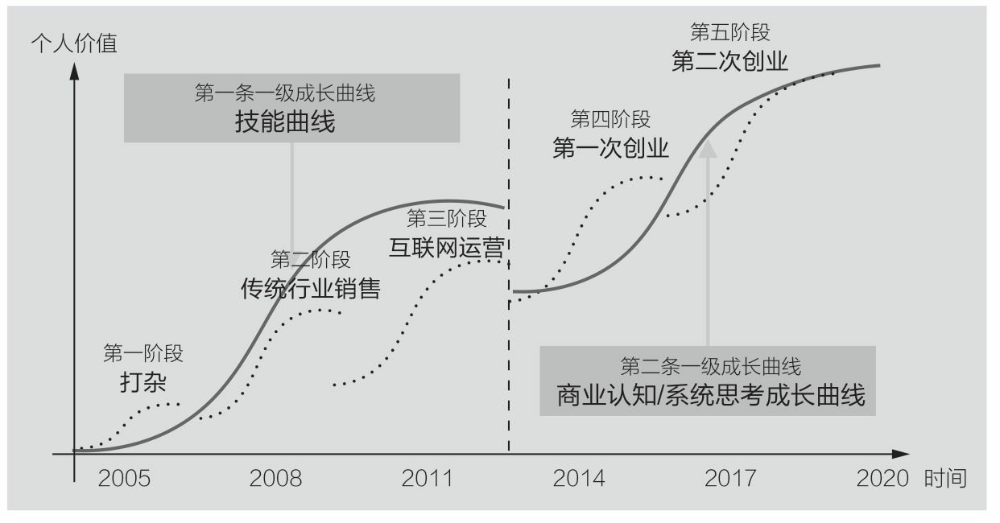
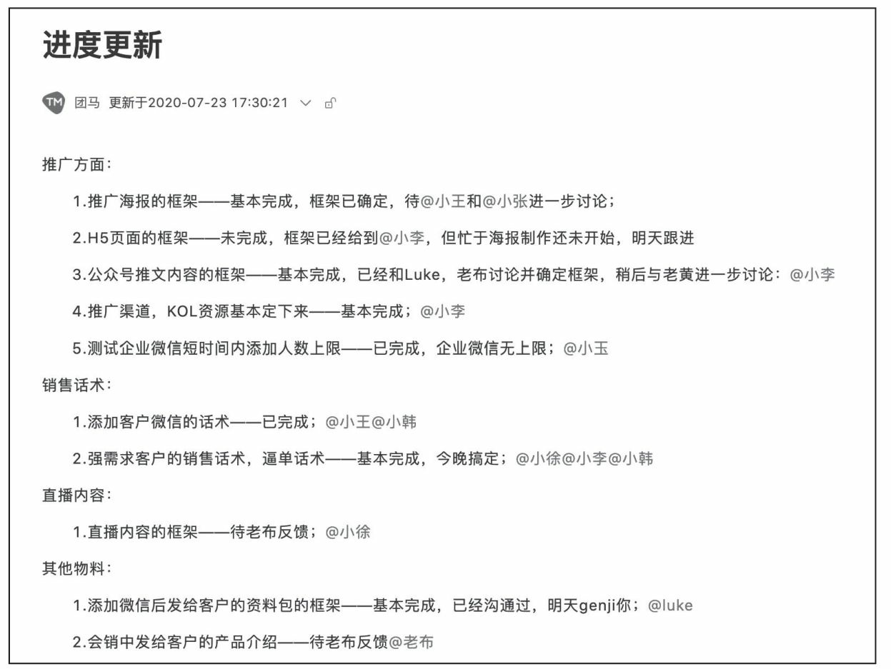
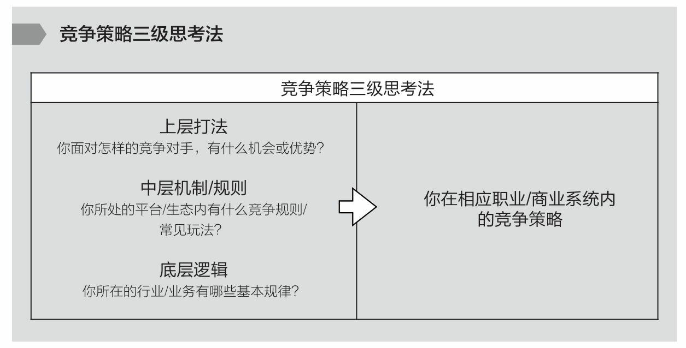
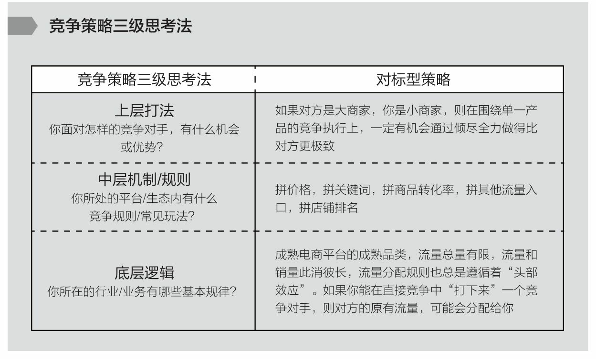
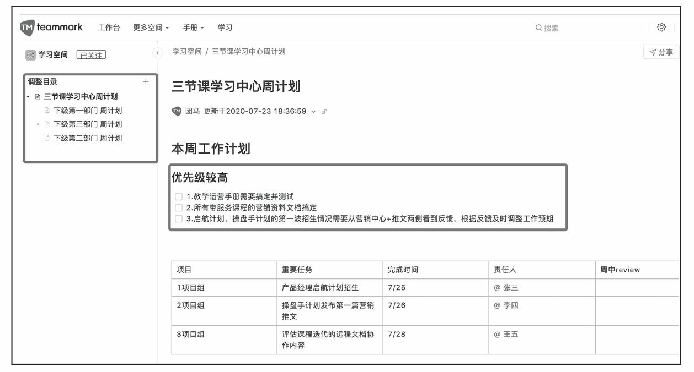
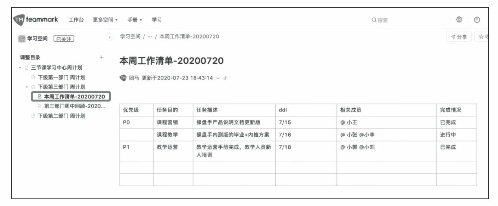
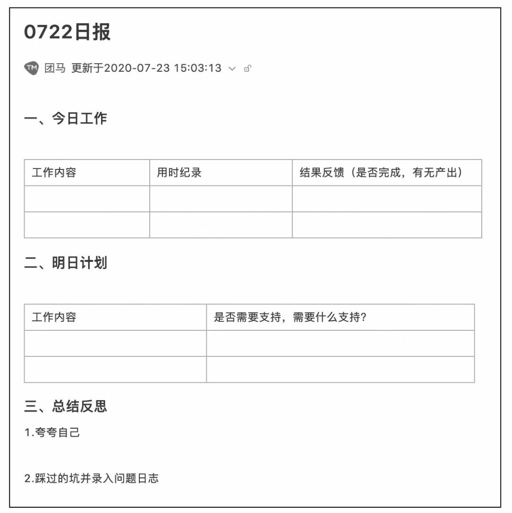

= 非线性成长
:toc:
:sectnums:

---

- 做书籍笔记, 不要啰嗦, 只要提取出解决问题的"思维模型(模块)"即可. 并且画图出模块系统. +
*每个阶段的问题, 有每个阶段的思维模型(解决方法).*

- *以"输出"来带动"输入", 是最好的学习和成长方式. 写作本身即能带来更多思考, 和深入地反思.*

- *不知而为之, 为无知; 知之而为之, 为天真。天真者无邪，但未必无知；无知者无畏，却未必有勇。* -- 无知是没经历过，天真则是经历过后选择放弃。

---

== S型曲线 /生命周期

==== 你必须以一条接一条的“S型曲线” 来带动持续的职业成长.

世上任何事物的发展(生命,组织,新技术,商业模式)都逃不开“生命周期”规律, 都会经历从诞生、成长、成熟、衰退，到最后结束的过程. 即不会一直无限地增长下去。

---

==== 好的环境, 往往是自带势能的. 能加速你的成长

---

==== 不同的阶段, 有不同的成功范式.

我在日企做销售那时，*我的成长同时受到 3种成功范式的影响和制约*:

1. 销售这一职业的发展上升轨迹,
2. 我所在那家日企的发展轨迹,
3. 仪器制造行业的发展轨迹.

三者在特定时间(生命周期)内, 都有它们所能达到的最高上限。

这几段工作内容，每一段背后意味着一类不同的成功范式，且每一段工作内容背后带来的成长性, 是完全不同的。为了追求最终的通关，你要不断让自己从成长性较低的成长赛道, 跃迁进入到成长性更高的赛道中去。

你要不断让自己从成长性较低的成长赛道, 跃迁进入到成长性更高的赛道中去。

---

== 心性的反思与完善

==== 你是否意识到自己的部分性格特点, 影响到了你的某些思考和行为习惯?

- *你是否意识到自己的部分性格特点, 影响到了你的某些思考和行为习惯? 并改变自己的这些局限性条件反射?*
- 你往上走得越高, 同时也会看清自己的尚缺之处. *你要思考你承担更大的挑战时，必须得到修正和完善的性格中的一些基本缺失是什么?*
- 随着团队和公司的发展，也越发意识到“如果你不能突破自己的瓶颈，就会成为整个团队的天花板”的意义. +
**反思, 自己当前的格局、视野和心性, 能否能够支撑这家公司走得更远? **这就是你身一个企业家需要具备的责任感和气质担当。

- *人人都有自己的功课要做，那些没有做好的和欠下的，终归要“还”。*
- 没有哪一件称得上顺利、轻松和成功，但**也没有哪一件不是在帮我补足自己身上的短板和缺失. 而且, 你努力后还能收获很多意料之外的发现，那不是按部
就班就能得到的。 这才是生命的乐趣.* 你生命中很多美好的东西，往往不是被给予和创造的，而是被你意外发现的。

- 无论做什么事, 哪怕是你不喜欢的, 你也可以选择从多种不同的视角去看待它，并在每一种视角下得到全然不同的意义. 并从与未知的互动中, 获得持续的发现收获. 物尽其用.

- 我相信，每一段重要或杂乱的经历，都会给自己留下诸多牵绊，只有认真完成了 一些思考，才能与那些过去挥手作别，此后心无旁骛，既往不恋，纵情向前，重新启程。恰如苏格拉底所言：没有检视的人生不值得活。

---

==== 你所选择的角色和挑战，将会重新塑造你.

- 很多事都是这样——在参与亲历之前，你从未想过你也可以成为某类别人眼中很厉害的人。但当真的突破心理上的束缚，打破某些边界，把自己放到相应位置或环境中浸淫一段时间后，你会发现：好像有些事，其实也没那么难，给你一些时间，让你经历一些摔打，你也完全可以做到。 +
是他的自律和无与伦比的好胜心, 驱动着他不断前行.

- 我们每一个人身处社会环境中，都在扮演着多种不同的角色，如儿
子、丈夫、妻子、母亲、员工、同学…… 不同的角色，需要你调整自己的思考、工作方法、沟通表达习惯甚至性格特征. 同时, *你所选择的角色和挑战，将会重新塑造你.*

---

==== 建立起自己恪守的原则(边界)

- 一个人若已经看过了足够大的世界，也打破了诸多边界，到了自己身上已经具备N多可能的时候，必然会开启另一个阶段 ——*建立起自己恪守的原则(边界)*，不断明确自己身上的使命和局限. 若你还未经历过前一阶段，则你虽然拥有边界和规则，但那些边界和规则都是外界施加于你的.
+
这就好比无知与天真，无知是没经历过，天真则是经历过后选择放弃。即所谓：
*不知而为之, 为无知; 知之而为之, 为天真。天真者无邪，但未必无知；无知者无畏，却未必有勇。*

---

== 当身处巨大的不确定的时代面前，你需要有两种修炼

对抗“不确定性”的两种武器:

1. 向外看，付诸理性思考，发现这个不确定世界中的局部基本规律，通过系统思考和专业主义，让很多事情变得可控，让自己拥有依赖一些基本规律对复杂系统推演和预估的能力。
2. 向内看，回归到你内在的信仰、热爱和坚持的事物上，从而天然拥有某种独特的确定性。

==== 很多事根本不存在所谓的“正确答案”，只有长期可依赖的答案。让自己拥有“为自己提供安全感和确定性”的能力。

- *很多事根本不存在所谓的“正确答案”，只有长期可依赖的答案。* 常常是那些拥有某种坚定不移的投资理念的人最终获得了巨大成功: 巴菲特的“价值投资”，索罗斯追求高风险高回报的“反身理论”，瑞·达里奥追求稳健资产组合的“恪守原则”。

- 想要对抗时代的不确定性，最好的方式不是简单地把安全感托付给一个外
界事物，而是要回归到自己身上，*让自己拥有“为自己提供安全感和确定性”的能力。* 发现这个不确定世界中的局部基本规律.
+
*很多时候，通过理性思考得出的答案也仍然会改变。但那无关紧要，因为你用来面对不确定性和寻求安全感的工具, 已经成为了“思考”这种方法，而不是通过思考得出的某个确定答案。  +
正如何帕斯卡所说：“人是有思想的芦苇，我们的全部
尊严和最具有价值之处，就在于思想。”*

---

==== 找到自己真心热爱和着迷的事. 无论外面风吹浪打，我自岿然不动。当你顺应了自己的心性，或许就已经在给自己造了一个“势”.

美妙人生的关键, 在于你能迷上什么东西。工作的习惯等于你的一幅铁甲，可以使你的心灵不至于崩溃。

---

== ---------- ----------

---

== 人的成长, 会经历三个阶段

==== 1.工具人（Handle）

职业决定阶层, 阶层有固化的趋势.

---

==== ---- 掌握"通用能力"

---

==== ---- 要掌握一系列技巧(工具包, 方法论, 理论模块去解决问题。

- 知道如何在这个世界上生存，洞悉竞争中的各种规则和规律，并学会利用规则去赢得基本竞争。
- 系统地研究和学习行业内的成熟高手，找到可遵循依赖的方法论.
- 一个领域内, 方法论可能有很多流派. 重要的是，你选了一派自己认同的方法论后，要能够深入地研究它、了解它，并充分实践、内化、吃透，让自己做出足以胜过大多数人的东西。

---

==== ---- 我需要什么(需要搞定什么)，就学习什么。

我从没问过”我需要学习xxx吗?”

---

==== ---- 你要成为Top 20%，才能拿到进入下一段的“入场券”

二八定律, 头部赢家通吃.

image:img_value/013.jpg[]

---

==== ---- 那些未能成为"顶级专家"或"商业操盘手"的人, 怎么办?

金字塔顶端的, 永远是少数.
那些未能成为"顶级专家"或"商业操盘手"的人, 怎么办?

[cols="1a,2a"]
|===
|Header 1 |Header 2

|思考1 : 探索另一种不同的竞争策略.
|

|思考2: 是否存在一个不同的维度，能够战胜对手 ->  错维竞争, 进入全新赛道.
|- 傅盛避开360的国内竞争, 进入海外市场.
<- 目的 : 在海外, 大家都是初学者, 削平了你国内的优势. 都要重新摸索起来.
|===

==== ---------- ----------

---

==== 2.负责人（Owner）

==== ---- #不要做岗位的横向平移, 而要做职业的纵向发展.#

- 即 : 你应该果断升级做业务的负责人, 为最终结果(收入, 利润, 流量)负责，而不是成为其中的一个模块。
+
*认知，几乎是人和人之间唯一的本质差别。技能的差别是可量化的，技能再累 加，也就是熟练工种。而认知的差别是本质的，是不可量化的。*
+
你要时刻关注: 你当前的成长模式，到底更多是"打补丁、提升能力"的线性竞争，还是"升级操作系统、切换赛道和模式"的非线性竞争。竞争是分不同层次的，成长也是。

- 为了能更快带动你的成长, 要寻求参与或负责一些涉及多部门协作的复杂项目的推进落地. 能了解和学习到你之前岗位接触不到的公司各模块如何交互的核心内容 (你就是ceo).

- 不断上行去看到更大的世界，了解更多顶尖高手在关注什么、如何思考，及如何才能成为那样的高手.

---

==== ---- 系统思考能力

任何一类商业组织，都是一个系统. 而一个系统，往往是由N个子系统（或称为业务模块）构成的。
如果你想管理和操盘整个系统的运转，并重新定义和设计整个系统的结构，你得熟悉整个核心模块的逻辑、构成，知道它们是如何运转的。

- *我曾经认为自己要永远‘站在弱者这一边’，后来多经历一些事情，才知道正确的是‘站在规则这一边’，否则，最终所有人(包括我)都会是受害者。*

- 要想成为一家公司的操盘者，你必须知晓这家公司所有的核心业务模块是如何运转的，有哪些关键节点，风险和机会往往来自哪里等。 +
-> 要知道模块间彼此的关系、每个模块管理的要点和难点，能够在每个模块出现问题时, 分析和提出解决方案.

[cols="1a,3a"]
|===
|Header 1 |Header 2

|1.熟练解决各类单点技能
|

|2.在对应问题面前，你要能够看到并深刻理解一类已经被验证行之有效的系统模型，并用它理解和思考部分问题。(模型思维)
|案例: 很多硅谷创业公司采用的 AARRR的运营体系

image:img_value/018.jpg[]

---

案例: 用户运营的“1-9-90”模型

你的受众目标, 最终可以被分成 1%、9%和90%这三个人群:

- 1%的“死忠粉” :
- 9%的人会经常分享 : 1. 将他们吸收为你的会员, 进行会员运营. 2. 开发"分享工具", 方便他们进行分享.
- 剩下90%的人, 为你贡献最多收入.

image:img_value/019.jpg[]

---

案例: 要支撑起一个新商业模式的持续存在, 必须拥有: 1.稳定的需求、2.稳定的解决方案、3.可预期的收益空间.

用这三个要素, 来衡量一个共享经济项目要想成功商业化, 则它必须满足以下几个条件:

- 从消费者角度: 有稳定的需求. -> 虽然刚需, 但价格较高, 使用频次较低, 导致用户不倾向于“拥有”该物品。
- 从商家角度: 有稳定的解决方案. -> 供给端要能确保用户产生需求后, 在地理上使用该物品十分便利.
- 从商家和投资人角度: 有可预期的收益空间. -> 你的预期收益要大于预期成本（包括维护成本、初始投入成本、存放成本、防盗成本等）之和，且面向整
个市场的预期收益, 能够带来商业想象空间。

从以上3点来看，当时流行的许多共享经济项目，包括但不限于共享篮球、共享雨伞、共享手推车、共享床铺、共享按摩椅等，都是注定不长久的.

|3.需要在同一个领域, 或同一个问题下，看到更多相关的系统模型，或者是来自其他专家或高手理解的系统模型. 吸收各家所长, 形成你自己的一套"模型思维"判断体系.
|在同一类问题面前，不同的高手有可能拥有完全不同的思考体系。你要不断深入去思考更多系统模型之间的关系、差异，以及背后的原因.
|===

---

==== ---- #迭代形成一套自己可以依赖的方法论 -> 知行合一, 快速验证你新获得的"认知"的真伪#

*必须知行合一，快速验证一个认知的有效性。一个认知形成后，只有经由实践，该认知才能被证实或证伪。*

一个人的高质量认知，来源于充分的实践。如果你的执行能力不到位，认知越升
级，你可能越没有足够消化和践行这些认知.

每一个人生阶段，你都会面临不同的问题，而每一个人都应该先把更为基本的问题解决好之后，才去探讨更加复杂和高维的问题。

---

==== ---- 三种重要的思考习惯 : 1. 始终关注"价值"，2. 降低成本，提高效率. 3. 多点收获思维

[cols="1a,2a"]
|===
|Header 1 |Header 2

|1.始终关注"价值"，而非具体问题的执行路径、难度和过往经验。
|我们没有关注“这件事有多难解决”，而是以“这件事的背后有多大价值，到底值不值得我们投入足够的时间和精力去解决”为思考原点。

|2.降低成本，提高效率. 始终思考和关注现有工作流程及业务链条中, 效率可以提升2倍以上的可能性和机会。
|效率导向的思考逻辑是：看到一类成熟业务或产业链条，找到当前效率特别低下或者成本特别高昂的节点.

|3.单点收获思维, 和多点收获思维
|小A 找了几个产品卖点，按照以往的套路和模板写好一篇推广文案，大意就是我们上线了一个新产品，特别厉害，限时优惠，快来买吧。

小B: （1）这是一个全新创新意义的产品，也因为新，部分用户的接受度不好说，所以更建议通过“提供特殊折扣，限量邀请部分用户试用”的方式进行第一波推广。为了便于获得他们的反馈，可以直接拉一些首批特邀用户进微信群。 +
（2）在第一波推广过程及用户试用过程中，需要重点关注3类数据，依据这3类数据，决定接下来1～2周的工作如何开展。 +
（3）行业内，有3家公司过去一年内发布过类似但又不完全相同的产品，所以要尽快了解这3款产品在最近几个月以来的表现，以及主要的营销推广渠道和方式，以此指导新产品的后续营销工作。

你会发现，面对同样一件事，小A与小B的思考和关注差别很大 ——小A关注的只是如何写好一篇推广文案发出去，而小B关注的则是整个新产品的营销策略如何制定，*如何利用当前这一次推广获取更多有效的信息。*
|===

---

==== ---- 竞争策略"三级思考法"

1. 你所在的行业/业务, 有哪些基本规律？
2. 你所处的平台/生态内, 有什么竞争规则/常见玩法？
3. 你面对怎样的竞争对手，有什么机会或优势（劣势）, SWOT ？

案例1:

image:img_value/017.jpg[]

---

==== ---- 对事的管理 : “目标、路径、资源”三段论

[cols="1a,1a" options="autowidth"]
|===
|Header 1 |Header 2

|目标
|关键目标的诞生，往往来自你对一件事拥有更为本质的认知。

- napchat从来不认为自己是聊天工具，而是改变新一代美国年轻人的沟通方式。他们认为新一代年轻人的沟通方式，未必依赖于文字, 而是围绕摄像头建立内容. 于是形成了与 Facebook 显著的差异。

---

目标应该足够简单，足够聚焦。聚焦则意味着一段时间内，目标是唯一的。目标如果无法聚焦，路径和资源也很难聚焦.

- “完成一个品类的全面建设”不算是一个足够简单的目标，而“做一堂半年内超过30000人付费报名的爆款课程出来”更像一个比较简单的目标。

|路径
|围绕一个目标，路径的拆解要足够细致，要知道大目标由哪几个子目标组成，这
些子目标之间有无先后依赖关系，以及每个子目标下的关键动作和手段是什么。

- 某app, 核心目标回归到“要让清理这个功能变得最好”上面。再往下拆解，分为3个子目标：清理垃圾大小、清理效率和内存占用3个指标都要显著领先其他同类竞品。

|资源
|Column 2, row 3
|===

对“事”的管理的本质，就是树立一个核心的业务，让这个业务带着所有的员工和组织架构往前走.

---

==== ---------- ----------

---

==== 3. 创始人（Founder）

你的公司成功需要什么，你就学习什么！ +
(懂产品、懂商业, 懂组织、懂战略, 学会了融资、会公开演讲、会社交... ) 你必须解决所有问题，让公司进入快速发展期.

你已经是一个管理者，尽量让自己在做思考、决策、对外获取有效信息的时间大于60%。

一旦度过了从1到10，在从10到100的阶段，个人英雄主义则必须被抛弃和打倒，因为**但凡是高度依赖个人的事情，都是不易复制和无法规模化的**，这与企业经营发展的根本诉求完全背道而驰。

---

== ---------- ----------

---

== 管理

==== 重点关注解决"进展中面临到的风险点".

- 每周一上午，作为管理者，你要给出你所负责的业务单元的周目标，并要求
下级团队提交他们的周目标，*他们的周目标，应与你的整体周目标直接相关.*

- 每周三或周四，让下级团队的所有成员, *进行周中工作回顾，汇报核心工作的
进展和风险。*

- 每周五和周六，举行团队的周工作总结会议，确认一周以来的进展，*并就一
些核心问题进行讨论。借由讨论，也提出下周需要重点关注的问题，进而迭代出下周
一些工作方向和计划。*

---

==== 各种文档模板(*模板即你已经验证的有效的"做事流程思维模型"*)

员工的工作状态, 会受几方面因素的影响:

- 员工的工作目标及要求是否清晰。
- 如果遇到困难或问题，是否有一个反馈的出口。

我的公司有非常丰富的各种文档模板——

- 工作日报（如图6-6）
- 不同部门的新人手册
- 跨部门协作流程
- 整个公司的OKR-KPI
- 项目管理、会议记录、每日工作计划、每周工作计划……

*注意, 下表中列出的关键词: 用时纪录, 结果反馈, 遇到的问题(需要支持的内容), 及反思(踩到的坑, 及解决方式)*

---

270

